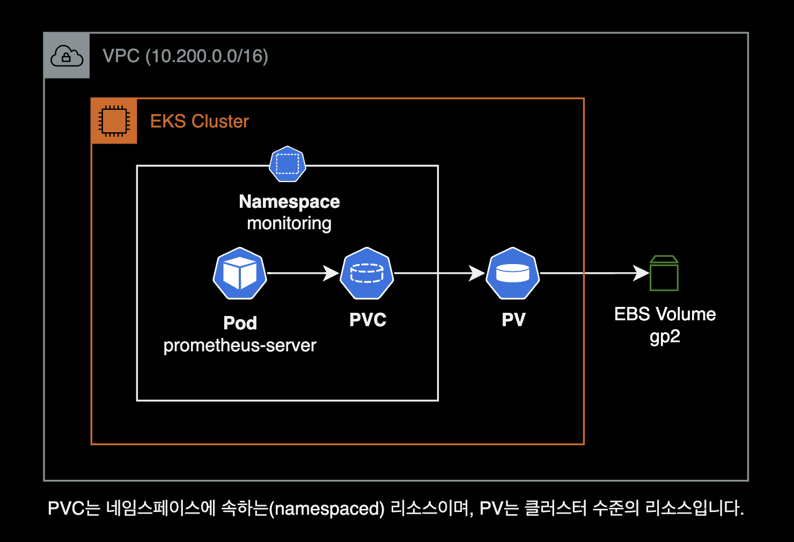
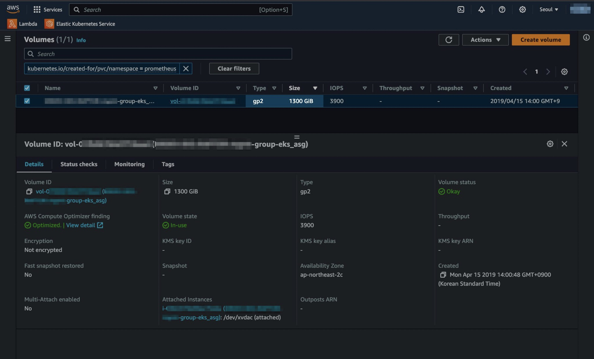

## 개요

Prometheus Server의 PersistentVolume 용량 Full로 인한 트러블슈팅 가이드

&nbsp;

## 환경

### EKS 클러스터

- **EKS v1.24** (x86_64)
- **Prometheus** [v2.9.2](https://github.com/prometheus/prometheus/releases/tag/v2.9.2) : helm chart로 설치
- EKS 클러스터에 [EBS CSI Driver](https://docs.aws.amazon.com/ko_kr/eks/latest/userguide/ebs-csi.html)가 미리 설치되어 있는 환경

&nbsp;

## 증상

Prometheus Server가 헬름 차트를 사용해서 설치되어 있습니다.

```bash
$ helm list -n monitoring
NAME          NAMESPACE    REVISION  UPDATED                                  STATUS    CHART               APP VERSION
prometheus    monitoring   208       2022-11-10 01:49:12.126086095 +0000 UTC  deployed  prometheus-8.11.4   2.9.2
```

&nbsp;

Prometheus Server 파드 상태를 확인합니다.

```bash
$ kubectl get pod -n monitoring
NAME                                  READY   STATUS             RESTARTS        AGE
prometheus-server-79f8d6c487-j6ppl    1/2     CrashLoopBackOff   6 (40s ago)     6m20s
```

Prometheus Server Pod에 CrashLoopBackOff가 발생하여 파드가 6번 재시작되었고 정상적으로 Running 되지 않았습니다.

&nbsp;

`CrashLoopBackOff`이 발생하는 원인을 파악하기 위해 Prometheus Server 파드의 로그를 확인합니다.

```bash
$ kubectl logs -f prometheus-server-79f8d6c487-j6ppl -n monitoring
prometheus-server level=warn ts=2023-11-10T02:23:05.250507661Z caller=wal.go:116 component=tsdb msg="last page of the wal is torn, filling it with zeros" se
gment=/data/wal/00045436
prometheus-server level=info ts=2023-11-10T02:23:05.250988832Z caller=main.go:489 msg="Stopping scrape discovery manager..."
prometheus-server level=info ts=2023-11-10T02:23:05.251009173Z caller=main.go:503 msg="Stopping notify discovery manager..."
prometheus-server level=info ts=2023-11-10T02:23:05.251017691Z caller=main.go:525 msg="Stopping scrape manager..."
prometheus-server level=info ts=2023-11-10T02:23:05.251025558Z caller=main.go:499 msg="Notify discovery manager stopped"
prometheus-server level=info ts=2023-11-10T02:23:05.251062604Z caller=main.go:485 msg="Scrape discovery manager stopped"
prometheus-server level=info ts=2023-11-10T02:23:05.251099842Z caller=manager.go:736 component="rule manager" msg="Stopping rule manager..."
prometheus-server level=info ts=2023-11-10T02:23:05.251135632Z caller=manager.go:742 component="rule manager" msg="Rule manager stopped"
prometheus-server level=info ts=2023-11-10T02:23:05.251149365Z caller=notifier.go:521 component=notifier msg="Stopping notification manager..."
prometheus-server level=info ts=2023-11-10T02:23:05.251149379Z caller=main.go:519 msg="Scrape manager stopped"
prometheus-server level=info ts=2023-11-10T02:23:05.251165003Z caller=main.go:679 msg="Notifier manager stopped"
prometheus-server level=error ts=2023-11-10T02:23:05.251350945Z caller=main.go:688 err="opening storage failed: zero-pad torn page: write /data/wal/00045436: no space left on device"
Stream closed EOF for monitoring/prometheus-server-79f8d6c487-j6ppl (prometheus-server)
```

`opening storage failed: zero-pad torn page: write /data/wal/00045436: no space left on device"` 에러에 주목합니다.

메트릭을 저장하는 볼륨인 `/data`에 공간이 부족하여 Prometheus가 정상적으로 뜨지 못하는 걸 알 수 있습니다.

&nbsp;

## 원인

### 디스크 공간 부족

일반적으로 Prometheus Server Pod는 `/data` 파일시스템에 시계열 데이터베이스(TSDB) 형태로 메트릭을 저장합니다.

해당 파일시스템에 연결된 [Persistent Volume](https://kubernetes.io/ko/docs/concepts/storage/persistent-volumes/)(실체는 EBS Volume)이 사용률 100%로 여유 공간이 없었습니다.

아래는 문제가 발생헀던 Prometheus 인프라 구성입니다.



&nbsp;

## 해결방법

- 헬름 차트에서 PV 용량을 늘린다.
- `prometheus` 헬름 차트 재배포

&nbsp;

## 주의사항

### EBS Volume 용량 변경 시 제한 사항

EBS 볼륨(Persistent Volume)의 용량을 변경한 후, 또 다시 변경하려면 **6시간**을 기다려야 다시 변경할 수 있습니다.

> 볼륨을 수정한 후 동일한 볼륨에 추가 수정 사항을 적용하려면 먼저 볼륨이 in-use 또는 available 상태가 되도록 6시간 이상 기다려야 합니다. 이를 때로 휴지 기간이라고도 합니다.

자세한 사항은 EBS 공식문서 [볼륨 수정 시 요구 사항](https://docs.aws.amazon.com/ko_kr/AWSEC2/latest/UserGuide/modify-volume-requirements.html#elastic-volumes-limitations)의 제한 사항 문서를 참고하세요.

&nbsp;

## 상세 조치방법

Prometheus Server Pod가 사용하는 Persistent Volume의 정보를 확인합니다.

```bash
$ kubectl get pv -n monitoring
...
pvc-6d42404c-5f3b-11e9-9126-0a883d273378   1124Gi     RWO            Retain           Bound         monitoring/prometheus-server       gp2     4y209d
```

`1124Gi` 용량의 Persistent Volume이 Prometheus Server 파드의 `/data` 경로에 붙어있습니다.

&nbsp;

클러스터에서 사용 가능한 StorageClass 목록을 확인합니다.

```bash
$ kubectl get sc
NAME                   PROVISIONER             RECLAIMPOLICY   VOLUMEBINDINGMODE      ALLOWVOLUMEEXPANSION   AGE
gp2                    kubernetes.io/aws-ebs   Delete          WaitForFirstConsumer   true                   3y247d
gp3 (default)          ebs.csi.aws.com         Delete          WaitForFirstConsumer   true                   156d
```

&nbsp;

용량을 늘리기 전에 StorageClass의 상세 설정을 확인합니다.

```bash
$ kubectl describe storageclass gp2
Name:            gp2
IsDefaultClass:  No
Annotations:     ...
Provisioner:           kubernetes.io/aws-ebs
Parameters:            fsType=ext4,type=gp2
AllowVolumeExpansion:  True
MountOptions:          <none>
ReclaimPolicy:         Delete
VolumeBindingMode:     WaitForFirstConsumer
Events:                <none>
```

storageClass 리소스의 `AllowVolumeExpansion` 값이 `true`이면 용량 변경을 허용하고 있다는 의미입니다.

```bash
$ kubectl get sc gp2 -o yaml
apiVersion: storage.k8s.io/v1
kind: StorageClass
metadata:
  name: standard
provisioner: kubernetes.io/aws-ebs
parameters:
  type: gp2
reclaimPolicy: Retain
allowVolumeExpansion: true
```

&nbsp;

StorageClass에서 `AllowVolumeExpansion` 설정이 `false`인 경우 다음 명령어를 사용해서 허용하도록 변경할 수 있습니다.

> **중요**:  
> PersistentVolume 용량 변경을 진행하기 전에 현재 자신이 위치한 EKS 클러스터에 EBS CSI Driver가 설치되어 있는지 미리 확인하세요.

```bash
kubectl patch storageclass <SC> -p '{"allowVolumeExpansion": true}'
```

`<SC>` 값을 Prometheus Server 볼륨에서 사용중인 StorageClass 이름으로 변경해줍니다.

&nbsp;

Size 변경을 허용하도록 `gp2` StorageClass 설정을 변경합니다.

```bash
kubectl patch storageclass gp2 -p '{"allowVolumeExpansion": true}'
```

`allowVolumeExpansion` 값이 `true`로 설정되면 볼륨 사이즈 변경이 허용된 상태입니다.

&nbsp;

이제 실제 Persistent Volume의 사이즈를 변경합니다.

Prometheus를 헬름 차트로 설치한 경우, `values.yaml`의 `server.persistentVolume.size` 값으로 Persistent Volume의 용량을 지정할 수 있습니다.

```diff
# values.yaml for prometheus chart
server
  ...
  persistentVolume:
    ## If true, Prometheus server will create/use a Persistent Volume Claim
    ## If false, use emptyDir
    ##
    enabled: true

    ## Prometheus server data Persistent Volume access modes
    ## Must match those of existing PV or dynamic provisioner
    ## Ref: http://kubernetes.io/docs/user-guide/persistent-volumes/
    ##
    accessModes:
      - ReadWriteOnce

    ## Prometheus server data Persistent Volume annotations
    ##
    annotations: {}

    ## Prometheus server data Persistent Volume existing claim name
    ## Requires server.persistentVolume.enabled: true
    ## If defined, PVC must be created manually before volume will be bound
    existingClaim: ""

    ## Prometheus server data Persistent Volume mount root path
    ##
    mountPath: /data

    ## Prometheus server data Persistent Volume size
    ##
-   size: 1124Gi
+   size: 1300Gi

    ## Prometheus server data Persistent Volume Storage Class
    ## If defined, storageClassName: <storageClass>
    ## If set to "-", storageClassName: "", which disables dynamic provisioning
    ## If undefined (the default) or set to null, no storageClassName spec is
    ##   set, choosing the default provisioner.  (gp2 on AWS, standard on
    ##   GKE, AWS & OpenStack)
    ##
    # storageClass: "prometheus"

    ## Subdirectory of Prometheus server data Persistent Volume to mount
    ## Useful if the volume's root directory is not empty
    ##
    subPath: ""
```

기존에 `1124Gi`이던 PV 용량을 `1300Gi`로 변경했습니다.

&nbsp;

EBS CSI Driver에 의해 실제 EBS Volume의 용량도 PV 설정과 동일하게 자동 변경됩니다.



이 뒷단의 보이지 않는 EBS 볼륨을 변경하고 컨트롤하는 작업들은 EKS 클러스터에 설치된 [EBS CSI Driver](https://docs.aws.amazon.com/ko_kr/eks/latest/userguide/ebs-csi.html)가 수행합니다.

&nbsp;

변경된 사항을 적용하기 위해 헬름 업그레이드를 실행합니다.

```bash
helm upgrade prometheus . \
  -n monitoring \
  -f values_example.yaml \
  --wait
```

&nbsp;

PV 사이즈가 늘어났는지와 Prometheus Server가 PVC를 통해 볼륨과 잘 연결되어 있는지 확인합니다.

```bash
$ kubectl get pv,pvc -n monitoring
NAME                                       CAPACITY   ACCESS MODES   RECLAIM POLICY   STATUS        CLAIM                          STORAGECLASS   REASON   AGE
pvc-6d42404c-5f3b-11e9-9126-0a883d273378   1300Gi     RWO            Retain           Bound         monitoring/prometheus-server   gp2                     4y209d

NAME                                                             STATUS   VOLUME                                     CAPACITY   ACCESS MODES   STORAGECLASS   AGE
persistentvolumeclaim/prometheus-server                          Bound    pvc-6d42404c-5f3b-11e9-9126-0a883d273378   1300Gi     RWO            gp2            4y124d
```

PV 용량이 1124Gi에서 1300Gi로 늘어난 걸 확인할 수 있습니다.

&nbsp;

Prometheus Server가 재시작되고 용량을 확보했기 때문에 정상적으로 Running 상태로 전환된 걸 확인할 수 있습니다.

```bash
$ kubectl get pod -n monitoring
NAME                                READY   STATUS    RESTARTS        AGE
...
prometheus-server-5cbd97c96-dwk2d   2/2     Running   2 (22m ago)     22m
```

&nbsp;

실제 파드에 붙은 `/data` 파일시스템의 용량도 늘어났는지 확인합니다.

```bash
$ kubectl exec -it -n monitoring prometheus-server-5cbd97c96-dwk2d -c prometheus-server -- df -hT /data
Filesystem           Type            Size      Used  Available  Use%  Mounted on
/dev/xvdac           ext4            1.2T      1.1T     178.4G   86%  /data
```

`/data` 파일시스템의 용량이 늘어난 걸 확인할 수 있습니다.

&nbsp;

Prometheus Serve 파드가 구동될 때 특이한 로그가 없고 이전에 발생했던 `no space left on device` 에러 로그는 사라졌습니다.

```bash
$ kubectl logs -f prometheus-server-5cbd97c96-dwk2d -n monitoring
prometheus-server level=info ts=2023-11-10T02:34:11.273179852Z caller=head.go:526 component=tsdb msg="head GC completed" duration=2.792894391s
prometheus-server level=info ts=2023-11-10T02:34:14.80639232Z caller=head.go:573 component=tsdb msg="WAL checkpoint complete" first=45433 last=45435 duratio
n=3.533157972s
prometheus-server level=info ts=2023-11-10T02:34:26.200791468Z caller=head.go:526 component=tsdb msg="head GC completed" duration=1.37427812s
prometheus-server level=info ts=2023-11-10T02:34:29.854613706Z caller=head.go:573 component=tsdb msg="WAL checkpoint complete" first=45436 last=45437 durati
on=3.653761294s
prometheus-server level=info ts=2023-11-10T02:34:40.374378292Z caller=head.go:526 component=tsdb msg="head GC completed" duration=772.413383ms
prometheus-server level=info ts=2023-11-10T02:34:43.399665116Z caller=head.go:573 component=tsdb msg="WAL checkpoint complete" first=45438 last=45439 durati
on=3.025229582s
prometheus-server level=info ts=2023-11-10T02:34:54.856973245Z caller=head.go:526 component=tsdb msg="head GC completed" duration=832.8964ms
prometheus-server level=warn ts=2023-11-10T02:35:05.460706041Z caller=scrape.go:835 component="scrape manager" scrape_pool=kubernetes-service-endpoints targ
et=http://xx.xxx.xx.xx:8080/metrics msg="append failed" err="not found"
prometheus-server level=info ts=2023-11-10T02:35:06.038713935Z caller=head.go:526 component=tsdb msg="head GC completed" duration=1.256901115s
prometheus-server level=info ts=2023-11-10T02:35:19.522476356Z caller=head.go:526 component=tsdb msg="head GC completed" duration=2.344829434s
prometheus-server level=info ts=2023-11-10T02:35:32.539459371Z caller=head.go:526 component=tsdb msg="head GC completed" duration=945.127937ms
prometheus-server level=info ts=2023-11-10T03:00:13.381164789Z caller=head.go:526 component=tsdb msg="head GC completed" duration=950.601452ms
prometheus-server level=info ts=2023-11-10T03:00:16.354503976Z caller=head.go:573 component=tsdb msg="WAL checkpoint complete" first=45440 last=45442 durati
on=2.968652344s
```

&nbsp;

## 더 나아가서

### 볼륨 용량 자동확장

볼륨<sup>Pesistent volume</sup>을 최소 크기로 유지하면 비용을 절감하는 데 도움이 될 수 있지만 매번 수동으로 확장해야 하는 것은 DevOps와 클러스터 관리자에게 고통스럽고 시간 낭비가 될 수 있습니다. 특히 쿠버네티스 클러스터 위에서 구동되는 Prometheus, MySQL, Redis, RabbitMQ 또는 기타 Stateful 서비스에서 사용하는 스토리지 볼륨에서 이러한 문제가 자주 발생합니다.

특정 사용률에 도달했을 때 볼륨<sup>Persistent volume</sup> 사이즈를 자동확장하고 싶은 요구사항이 있다면 쿠버네티스 컨트롤러인 [Kubernetes Volume Autoscaler](https://github.com/DevOps-Nirvana/Kubernetes-Volume-Autoscaler) 도입을 고려하는 것도 좋을 것 같습니다.

&nbsp;

## 참고자료

**Kubernetes**  
[Storage Classes - Allow volume expansion](https://kubernetes.io/docs/concepts/storage/storage-classes/#allow-volume-expansion)  
[Using kubectl patch to modify existing Kubernetes objects](https://pet2cattle.com/2021/08/kubectl-patch)  
[Kubernetes를 사용하여 Persistent Volume 크기 조정](https://kubernetes.io/blog/2018/07/12/resizing-persistent-volumes-using-kubernetes/)  

**AWS**  
[Amazon EBS CSI Driver](https://docs.aws.amazon.com/ko_kr/eks/latest/userguide/ebs-csi.html)  
[볼륨 수정 시 요구 사항](https://docs.aws.amazon.com/ko_kr/AWSEC2/latest/UserGuide/modify-volume-requirements.html#elastic-volumes-limitations)
