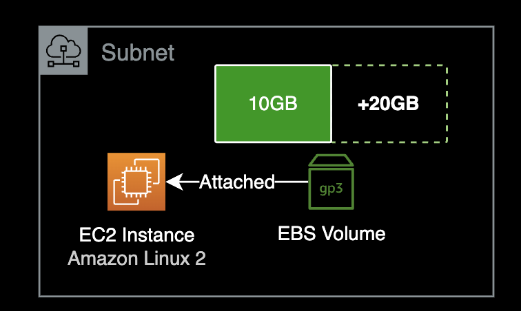
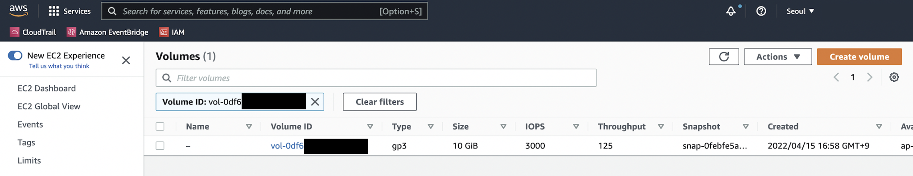
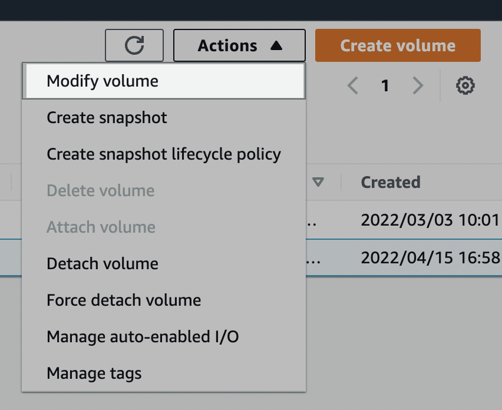
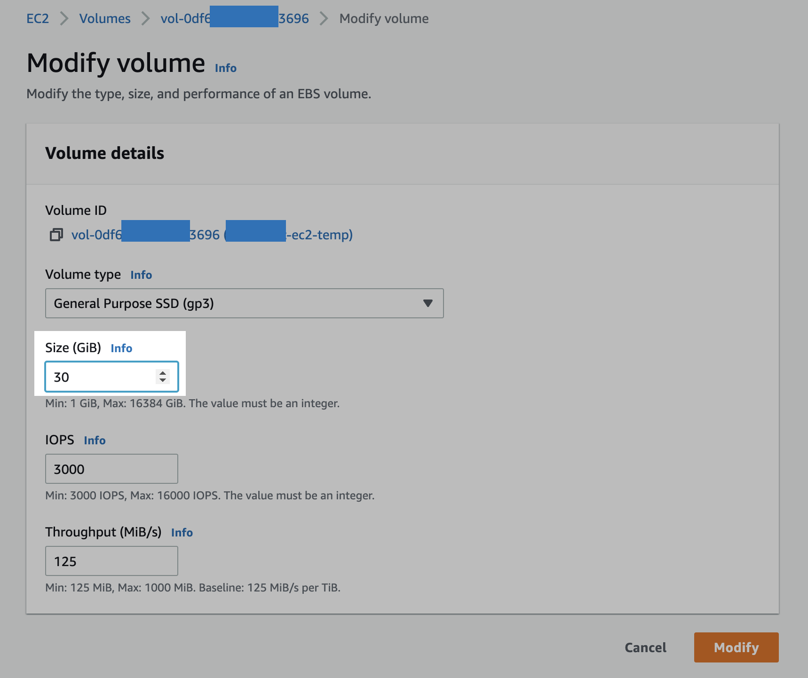
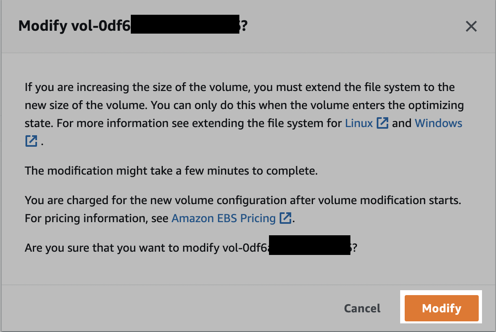

## 개요

EC2 인스턴스의 디스크 공간이 부족한 상황에서는 EBS 볼륨 용량을 늘리거나 파일시스템에 불필요한 파일들을 정리해서 여유공간을 다시 확보하는 조치가 필요합니다.  

이 문서에서는 Linux EC2 인스턴스의 EBS<sup>Elastic Block Storage</sup> Volume의 용량을 늘리는 방법을 소개합니다.  

&nbsp;

## 환경

인스턴스에 연결된 gp3 볼륨 하나의 용량을 **무중단**으로 늘리는 작업입니다.



- **OS** : Amazon Linux 2
- **Type** : t2.micro
- **EBS Volume**
  - **Type** : gp3 (General Purpose SSD)
  - **Size** : 10GiB → gp3 30GiB (xfs 타입)
- **Shell** : bash
- **ID** : ec2-user

&nbsp;

## 배경지식

### gp3 타입

배경지식으로 설명하자면 EBS 볼륨은 되도록이면 gp2 타입의 다음 세대인 gp3 타입을 사용하도록 합니다.  
EBS의 비용이나 성능 측면에서 모두 월등히 gp3가 좋습니다.  
참고로 gp2 타입은 2014년에 처음 출시했습니다.

AWS 블로그 포스팅에 따르면 gp3의 최고 성능은 gp2 볼륨의 최대 처리량보다 4배 빠르다고 합니다.  
가격도 gp3가 기존 gp2 볼륨 타입보다 20% 저렴합니다.

[AWS 블로그 포스팅](https://aws.amazon.com/ko/blogs/korea/new-amazon-ebs-gp3-volume-lets-you-provision-performance-separate-from-capacity-and-offers-20-lower-price/)

&nbsp;

## 준비사항

### 작업자의 로컬 환경

- AWS Management Console에 미리 로그인되어 있어야 함
- SSH 또는 SSM Session Manager를 사용하여 EC2 Instance에 원격접속 가능한 네트워크 환경

&nbsp;

## 해결방법

### AWS Management Console

EBS<sup>Elastic Block Storage</sup> Volume의 용량을 늘리는 작업은 AWS Management Console에서 진행합니다.  
충분한 권한을 가진 AWS 계정으로 로그인했다는 전제하에 다음 과정을 진행합니다.



EC2 서비스 메뉴 → 왼쪽 사이드바 메뉴 → Volumes 클릭  

이후 작업대상 EC2에 부착된 EBS Volume을 체크합니다.

&nbsp;



우측 상단에 Actions → Modify volume 클릭.  

&nbsp;



EBS 볼륨의 용량(`Size (GiB)`)을 원하는 값으로 변경합니다.

> [**EBS 볼륨 스펙 변경 시 제약사항**](https://docs.aws.amazon.com/ko_kr/AWSEC2/latest/UserGuide/modify-volume-requirements.html#elastic-volumes-limitations)  
> EBS 볼륨 사이즈 또는 타입을 한 번 수정하면, 해당 EBS 볼륨은 최소 6시간이 지난 후에 다시 용량 또는 볼륨 타입을 변경할 수 있습니다.

현재 시나리오에서는 EBS 볼륨 용량을 10GB → 30GB로 올렸습니다.

&nbsp;



위 안내문을 요약하자면 다음과 같습니다.

- AWS Console에서 늘리면 작업이 끝나는 게 아니라, EC2 인스턴스에 접속해서 일련의 추가 명령어 실행을 해야 완벽히 적용됩니다.
- AWS Console 영역에서 EBS Volume 용량 변경이 완료되는 데에는 몇 분 정도 소요될 수 있습니다.
- EBS Volume 용량 변경이 시작될 때부터 EBS Volume의 비용은 바뀐 용량 기준으로 청구됩니다.

안내문을 이해했다면 [Modify] 버튼을 클릭합니다.

&nbsp;

### EC2

#### 1. EC2 접속

작업이 필요한 인스턴스에 SSH 또는 SSM Session Manager를 사용해 원격 접속합니다.  
각자 자신의 환경에서 접속 가능한 방법으로 EC2에 연결하면 됩니다.

&nbsp;

#### 2. 디스크 구성 및 타입 확인

인스턴스의 파일시스템 구성과 타입을 확인합니다.

```bash
[ec2-user@test-ec2 ~]$ df -hT
Filesystem     Type      Size  Used Avail Use% Mounted on
devtmpfs       devtmpfs  474M     0  474M   0% /dev
tmpfs          tmpfs     483M     0  483M   0% /dev/shm
tmpfs          tmpfs     483M  404K  483M   1% /run
tmpfs          tmpfs     483M     0  483M   0% /sys/fs/cgroup
/dev/xvda1     xfs        10G  1.6G  8.5G  16% /
tmpfs          tmpfs      97M     0   97M   0% /run/user/0
```

root 파일시스템이 `xfs` 타입인 걸 확인할 수 있습니다.

&nbsp;

#### 3. lsblk 확인

```bash
[ec2-user@test-ec2 ~]$ lsblk
NAME    MAJ:MIN RM SIZE RO TYPE MOUNTPOINT
xvda    202:0    0  30G  0 disk
└─xvda1 202:1    0  10G  0 part /
```

루트 볼륨 `/dev/xvda`는 `/dev/xvda1` 파티션 하나로만 구성되어 있습니다.

xvda 볼륨 전체용량은 `30G`이지만 xvda1 파티션의 용량은 `10G`만 할당되어 있으므로 확장이 필요합니다.

&nbsp;

#### 4. 볼륨 확장

`xvda1` 파티션의 용량을 확장합니다.

```bash
[ec2-user@test-ec2 ~]$ sudo growpart /dev/xvda 1
CHANGED: partition=1 start=4096 old: size=20967391 end=20971487 new: size=62910431 end=62914527
```

`xvda1` 파티션의 용량이 정상적으로 변경(`CHANGED`)된 걸 확인할 수 있습니다.

&nbsp;

#### 5. lsblk 재확인

`lsblk` 명령어를 다시 실행합니다.

```bash
[ec2-user@test-ec2 ~]$ lsblk
NAME    MAJ:MIN RM SIZE RO TYPE MOUNTPOINT
xvda    202:0    0  30G  0 disk
└─xvda1 202:1    0  30G  0 part /
```

루트 파일시스템(`/`)에 연결된 `xvda1` 파티션이 `10G` → `30G`로 확장한 걸 확인할 수 있습니다.

&nbsp;

루트 파일시스템(`/`)의 디스크 사용률을 확인했을 때는 `16%`로 그대로입니다.

```bash
[ec2-user@test-ec2 ~]$ df -h
Filesystem      Size  Used Avail Use% Mounted on
devtmpfs        474M     0  474M   0% /dev
tmpfs           483M     0  483M   0% /dev/shm
tmpfs           483M  436K  483M   1% /run
tmpfs           483M     0  483M   0% /sys/fs/cgroup
/dev/xvda1       10G  1.6G  8.5G  16% /
tmpfs            97M     0   97M   0% /run/user/0
```

아직 마지막 명령어가 남아있습니다.

&nbsp;

#### 6. 파일시스템 확장 (xfs)

각 볼륨에서 파일 시스템을 확장하려면 `xfs_growfs` 명령을 사용합니다.

아래 명령어는 루트 파일시스템(`/`)을 확장합니다.

```bash
[ec2-user@test-ec2 ~]$ sudo xfs_growfs -d /
meta-data=/dev/xvda1             isize=512    agcount=6, agsize=524159 blks
         =                       sectsz=512   attr=2, projid32bit=1
         =                       crc=1        finobt=1 spinodes=0
data     =                       bsize=4096   blocks=2620923, imaxpct=25
         =                       sunit=0      swidth=0 blks
naming   =version 2              bsize=4096   ascii-ci=0 ftype=1
log      =internal               bsize=4096   blocks=2560, version=2
         =                       sectsz=512   sunit=0 blks, lazy-count=1
realtime =none                   extsz=4096   blocks=0, rtextents=0
data blocks changed from 2620923 to 7863803
```

&nbsp;

##### xfsprogs 패키지 설치 (선택)

[xfsprogs](https://xfs.wiki.kernel.org/#kernel_source) 패키지에는 XFS 파일 시스템을 위한 관리 도구와 디버깅 도구가 포함되어 있습니다.  

아직 XFS 툴이 설치되지 않은 Amazon Linux 2 환경인 경우, 패키지 관리자 `yum`을 사용해서 `xfsprogs` 패키지를 설치할 수 있습니다.

```bash
$ sudo yum install xfsprogs -y
```

&nbsp;

`df -h` 명령어로 파일시스템 사용률을 확인합니다.

```bash
[ec2-user@test-ec2 ~]$ df -h
Filesystem      Size  Used Avail Use% Mounted on
devtmpfs        474M     0  474M   0% /dev
tmpfs           483M     0  483M   0% /dev/shm
tmpfs           483M  436K  483M   1% /run
tmpfs           483M     0  483M   0% /sys/fs/cgroup
/dev/xvda1       30G  1.7G   29G   6% /
tmpfs            97M     0   97M   0% /run/user/0
```

- 루트 파일시스템(`/`)의 **용량** :  10G → 30G로 증가
- 루트 파일시스템(`/`)의 **사용률** : 16% → 6%로 감소

&nbsp;

이것으로 EC2 인스턴스의 디스크<sup>EBS Volume</sup> 증설 작업이 완료되었습니다.

&nbsp;

## 결론

인프라 운영 중에 EC2 디스크 증설 작업은 종종 발생하는 상황입니다.  
EBS 볼륨의 파일 시스템 타입이 `xfs`인지 `ext4`에 따라 설정 명령어가 다르다는 점을 명심하도록 합니다.

&nbsp;

## 참고자료

**AWS 공식문서**  
[Extend a Linux file system after resizing a volume](https://docs.aws.amazon.com/AWSEC2/latest/UserGuide/recognize-expanded-volume-linux.html#extend-file-system)  
AWS 공식문서에도 디테일하게 설명되어 있습니다.
