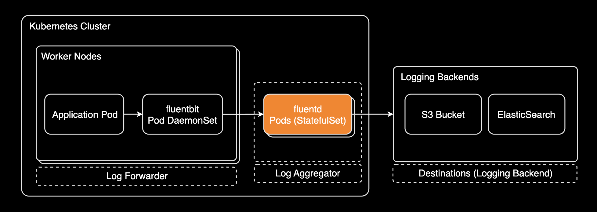

## 개요

[fluentd v1.3.3](https://github.com/fluent/fluentd/releases/tag/v1.3.3)에서 특정 컨테이너 로그 수집 제외하기


&nbsp;

## 환경

- **fluentd app version**: [v1.3.3](https://github.com/fluent/fluentd/releases/tag/v1.3.3)
- **fluentd 설치방식**: Helm chart

> **주의사항**: `fluentd` `v1.3.3`은 2019년 1월 7일 출시되어 상당히 오래된 버전입니다. 최신 버전의 fluentd와 예외처리 설정 방법이 다를 수 있음에 유의합니다.

&nbsp;

## 설정방법

이 가이드에서는 `fluentd`의 로그 수집 예외처리 방법 2가지를 설명합니다.

1. 특정 파드의 로그 수집 예외처리
2. 특정 네임스페이스의 로그 수집 예외처리

&nbsp;

### 특정 파드 예외처리

`fluentd`에서 특정 컨테이너에 대한 로그 수집을 예외처리하려면 [exclude](https://docs.fluentd.org/filter/grep#less-than-exclude-greater-than-directive) 섹션에 추가합니다. `exclude` 섹션에는 크게 2개의 파라미터가 있습니다.

| 파라미터 | 설명 | 버전 |
| --- | --- | --- |
| `key` | 예외처리할 파라미터 이름 (필수) | 1.0.0 |
| `pattern` | 예외처리할 파라미터 값 (필수) | 1.2.0 |

&nbsp;

특정 파드의 수집 예외처리 설정은 `filter` 플러그인 안에 `exclude` 섹션을 추가해서 설정합니다.

아래는 fluentd 헬름차트의 `values.yaml` 파일에서 특정 파드의 수집 예외처리 설정 예시입니다.

```yaml
# charts/fluentd/values.yaml
configMaps:
  output.conf: |
    <filter kube.**>
      @type grep

      <exclude>
        key log
        pattern /(ELB-HealthChecker|health|actuator|statusz|healthz)/i
      </exclude>

      <exclude>
        key $["kubernetes"]["container_name"]
        pattern /(CONTAINER_NAME_A|CONTAINER_NAME_B)/i
      </exclude>
    </filter>
```

`/i`는 정규 표현식에서 대소문자를 구분하지 않도록 하는 약속된 플래그입니다. 만약 대소문자를 구분하지 않고 매칭하고 싶다면 `/i`를 유지해야 합니다. 대소문자를 구분하고 싶다면 `/i`를 제거해도 됩니다. 자세한 사항은 [Specifying Modes Inside The Regular Expression](https://www.regular-expressions.info/modifiers.html) 페이지를 참고합니다.

&nbsp;

대소문자를 구분 안하는 `fluentd` 설정:

```yaml
# charts/fluentd/values.yaml
configMaps:
  output.conf: |
    <exclude>
      key $["kubernetes"]["container_name"]
      pattern /(CONTAINER_NAME_A|CONTAINER_NAME_B)/i
    </exclude>
```

예를 들어, `CONTAINER_NAME_A`와 `container_name_a`를 모두 매칭하고 싶다면 `/i`를 유지해야 하고, `CONTAINER_NAME_A`만 매칭하고 싶다면 `/i`를 제거하면 됩니다.

대소문자를 명확하게 구분하는 `fluentd` 설정:

```yaml
# charts/fluentd/values.yaml
configMaps:
  output.conf: |
    <exclude>
      key $["kubernetes"]["container_name"]
      pattern /(CONTAINER_NAME_A|CONTAINER_NAME_B)/
    </exclude>
```

&nbsp;

완성된 `fleuntd`의 `output.conf` 설정:

```yaml
# charts/fluentd/values.yaml
configMaps:
  output.conf: |
    <filter kube.**>
      @type grep

      <exclude>
        key log
        pattern /(ELB-HealthChecker|health|actuator|statusz|healthz)/i
      </exclude>

      <exclude>
        key $["kubernetes"]["container_name"]
        pattern /(CONTAINER_NAME_A|CONTAINER_NAME_B)/i
      </exclude>
    </filter>

    <filter kube.**>
      @type record_transformer
      remove_keys $["kubernetes"]["labels"], $["kubernetes"]["annotations"], $["kubernetes"]["pod_id"], $["kubernetes"]["docker_id"], $["kubernetes"]["container_hash"]
    </filter>

    <filter kube.**>
      @type geoip

      geoip_lookup_keys ip
      backend_library geoip2_c

      <record>
        ip_location       ${location.latitude["ip"]},${location.longitude["ip"]}
        ip_country        ${country.iso_code["ip"]}
        ip_countryname    ${country.names.en["ip"]}
        ip_cityname       ${city.names.en["ip"]}
      </record>

      skip_adding_null_record  true
    </filter>

    <match kube.**>
      @type copy

      <store>
      # ... omitted for brevity ...
      </store>
    </match>
```

&nbsp;

### 특정 네임스페이스 예외처리

`fluentd`에서 특정 네임스페이스에 대한 모든 로그를 예외처리하려면 namespace_name 파라미터를 exclude 섹션에 추가할 수 있습니다.

```yaml
# charts/fluentd/values.yaml
configMaps:
  output.conf: |
    <filter kube.**>
      @type grep

      <exclude>
        key $["kubernetes"]["namespace_name"]
        pattern /(backend|default|monitoring)/
      </exclude>
    </filter>
```

&nbsp;

## 관련자료

fluentd:

- [fluentd filter.grep 공식문서](https://docs.fluentd.org/filter/grep)

kubernetes:

- [Logging Architecture](https://kubernetes.io/docs/concepts/cluster-administration/logging/#cluster-level-logging-architectures)