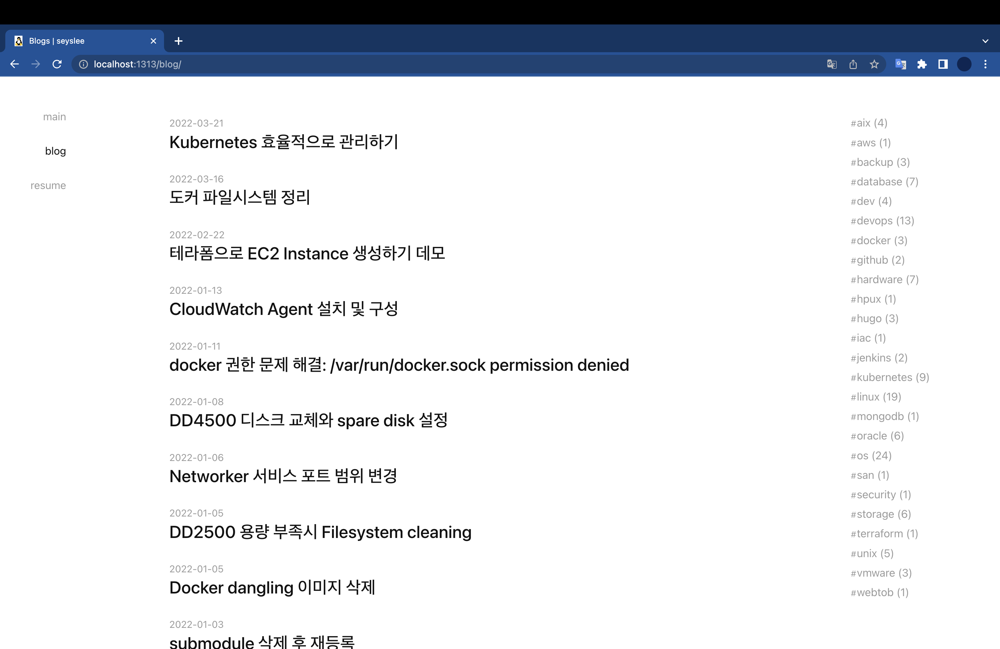

## 개요

Hugo 블로그를 운영하면서 발생할 수 있는 `found no layout file for ...` 에러를 해결한다.

&nbsp;

## 환경

- **Hardware** : MacBook Pro(14", 2021, M1 Pro)
- **OS** : macOS Monterey 12.3
- **Shell** : zsh
- **Hugo** : v0.95.0 (Brew로 설치함)
- **Browser** : Chrome 99.0.4844.83

&nbsp;

## 증상

기존에 사용중이던 맥북에서 신규 맥북으로 옮겨서 블로그 레포지터리를 클론했다.  
이제 신규 맥북에서 Github 블로그를 관리하려는 목적이었다.

```bash
$ git clone https://github.com/seyslee/blog.git
```

&nbsp;

현재 내가 위치한 경로를 확인한다.

```bash
$ pwd
/Users/ive/github/personal/blog
```

&nbsp;

Hugo 테스트 웹서버를 실행했다.  
여기서 `-D` 옵션은 숨김 처리(`draft: true`)되어 있는 게시글도 모두 표시하겠다는 설정이다.

```bash
$ hugo server -D
...
WARN 2022/03/22 18:48:28 found no layout file for "HTML" for kind "term": You should create a template file which matches Hugo Layouts Lookup Rules for this combination.
WARN 2022/03/22 18:48:28 found no layout file for "HTML" for kind "term": You should create a template file which matches Hugo Layouts Lookup Rules for this combination.
WARN 2022/03/22 18:48:28 found no layout file for "HTML" for kind "term": You should create a template file which matches Hugo Layouts Lookup Rules for this combination.
WARN 2022/03/22 18:48:28 found no layout file for "HTML" for kind "term": You should create a template file which matches Hugo Layouts Lookup Rules for this combination.
WARN 2022/03/22 18:48:28 found no layout file for "HTML" for kind "term": You should create a template file which matches Hugo Layouts Lookup Rules for this combination.

                   | EN
-------------------+------
  Pages            |  29
  Paginator pages  |   0
  Non-page files   | 114
  Static files     |   3
  Processed images |   0
  Aliases          |   0
  Sitemaps         |   1
  Cleaned          |   0

Built in 103 ms
Watching for changes in /Users/xxxxx/github/personal/blog/{archetypes,content,layouts,static}
Watching for config changes in /Users/xxxxx/github/personal/blog/config.toml
Environment: "development"
Serving pages from memory
Running in Fast Render Mode. For full rebuilds on change: hugo server --disableFastRender
Web Server is available at http://localhost:1313/ (bind address 127.0.0.1)
Press Ctrl+C to stop
```

잘 실행되는 것처럼 보이지만 아래 에러 메세지를 주목하자.

```bash
file for "HTML" for kind "term": You should create a template file which matches Hugo Layouts Lookup Rules for this combination.
```

template file을 인식하지 못하는 문제가 있다.

테스트용 웹페이지 주소인 <http://localhost:1313/>에 접속해도 빈 페이지가 뜬다.

&nbsp;

## 원인

복제해온 레포지터리 안에 포함된 `hugo-theme-codex` Submodule이 비어 있었다.  

Blog repository는 제대로 복사<sup>Clone</sup>해서 가져왔지만, 안에 포함된 Submodule을 가져오지 못한 문제였다.

```bash
blog/                     [Blog repository]
└── themes/
    └── hugo-theme-codex/ [Submodule]
        └── .
```

위 `hugo-theme-codex` 디렉토리는 내가 사용하는 테마명이다. 이 글을 보는 다른 사람들은 다른 테마명으로 보일 수 있으니 참고하자.

&nbsp;

실제로 Submodule 안에 파일들을 확인해본 결과이다.

```bash
$ cd themes
$ ls
hugo-theme-codex
$ cd hugo-theme-codex
$ ls -al
total 0
drwxr-xr-x  2 xxxxx  staff   64  3 22 18:53 .
drwxr-xr-x  4 xxxxx  staff  128  3 22 18:53 ..
```

`hugo-theme-codex` 디렉토리 안에 파일이 존재하지 않는다.

&nbsp;

## 해결방법

### git clone

레포지터리를 복제할 때 해당 레포지터리에 안에 포함된 Submodule도 함께 복제해서 가져오도록 `--recursive` 옵션을 주면 해결된다.  

기존에 로컬로 복제해온 레포지터리를 `rm -rf blog`으로 삭제한 다음, 아래 명령어를 실행해서 다시 복제해서 가져오도록 한다.  

```bash
$ git clone https://github.com/<USERNAME>/<REPONAME>.git --recursive
```

&nbsp;

실제 명령어 실행결과는 다음과 같다.

```bash
$ git clone https://github.com/seyslee/blog.git --recursive
Cloning into 'blog'...
remote: Enumerating objects: 1909, done.
remote: Counting objects: 100% (1909/1909), done.
remote: Compressing objects: 100% (1334/1334), done.
remote: Total 1909 (delta 1116), reused 1316 (delta 523), pack-reused 0
Receiving objects: 100% (1909/1909), 81.07 MiB | 3.20 MiB/s, done.
Resolving deltas: 100% (1116/1116), done.
Submodule 'public' (https://github.com/seyslee/seyslee.github.io.git) registered for path 'public'
Submodule 'themes/hugo-theme-codex' (https://github.com/jakewies/hugo-theme-codex.git) registered for path 'themes/hugo-theme-codex'
Cloning into '/Users/xxxxx/github/personal/blog/public'...
remote: Enumerating objects: 1054, done.
remote: Counting objects: 100% (1054/1054), done.
remote: Compressing objects: 100% (609/609), done.
remote: Total 1054 (delta 576), reused 814 (delta 339), pack-reused 0
Receiving objects: 100% (1054/1054), 79.73 MiB | 3.15 MiB/s, done.
Resolving deltas: 100% (576/576), done.
Cloning into '/Users/xxxxx/github/personal/blog/themes/hugo-theme-codex'...
remote: Enumerating objects: 1391, done.
remote: Counting objects: 100% (49/49), done.
remote: Compressing objects: 100% (48/48), done.
remote: Total 1391 (delta 20), reused 9 (delta 1), pack-reused 1342
Receiving objects: 100% (1391/1391), 604.03 KiB | 839.00 KiB/s, done.
Resolving deltas: 100% (701/701), done.
Submodule path 'public': checked out 'af91d944400180ec2afdb85205dfef19f3a8556c'
Submodule path 'themes/hugo-theme-codex': checked out '9e911e331c90fcd56ae5d01ae5ecb2fa06ba55da'
```

`--recursive` 옵션으로 인해 `themes/hugo-theme-codex` 와 `public` 서브모듈도 함께 받아오는 걸<sup>cloning</sup> 확인할 수 있다.

&nbsp;

### 테스트

블로그 테스트 웹페이지를 다시 띄워보자.

```bash
$ hugo server -D
Start building sites …
hugo v0.95.0+extended darwin/arm64 BuildDate=unknown

                   | EN
-------------------+------
  Pages            | 114
  Paginator pages  |   0
  Non-page files   | 114
  Static files     |  14
  Processed images |   0
  Aliases          |   0
  Sitemaps         |   1
  Cleaned          |   0

Built in 112 ms
Watching for changes in /Users/xxxxx/github/personal/blog/{archetypes,content,layouts,static,themes}
Watching for config changes in /Users/xxxxx/github/personal/blog/config.toml
Environment: "development"
Serving pages from memory
Running in Fast Render Mode. For full rebuilds on change: hugo server --disableFastRender
Web Server is available at http://localhost:1313/ (bind address 127.0.0.1)
Press Ctrl+C to stop
```

아까와 같은 에러 메세지는 출력되지 않는다.

&nbsp;

Chrome 브라우저를 열어서 테스트 페이지 <http://localhost:1313>에 접속해본다.


&nbsp;

Hugo 블로그가 문제없이 잘 보인다.



핵심 원인은 최초에 클론해서 가져올 때, 블로그 안에 포함된 테마 서브모듈을 제대로 가져오지 못한 문제였다.  
git clone 할 때 submodule이 포함되어 있는 레포지터리라면, `--recursive` 옵션을 주도록 하자.

&nbsp;

## 참고자료

<https://nochoco-lee.tistory.com/87>  
<https://discourse.gohugo.io/t/found-no-layout-file-for/36512>
