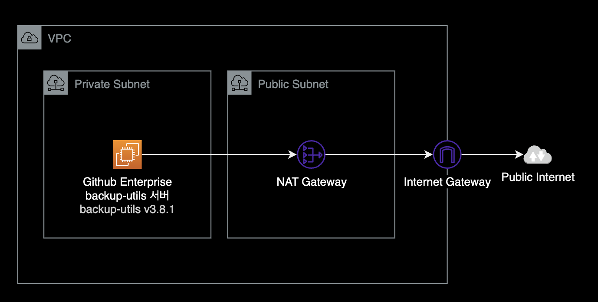
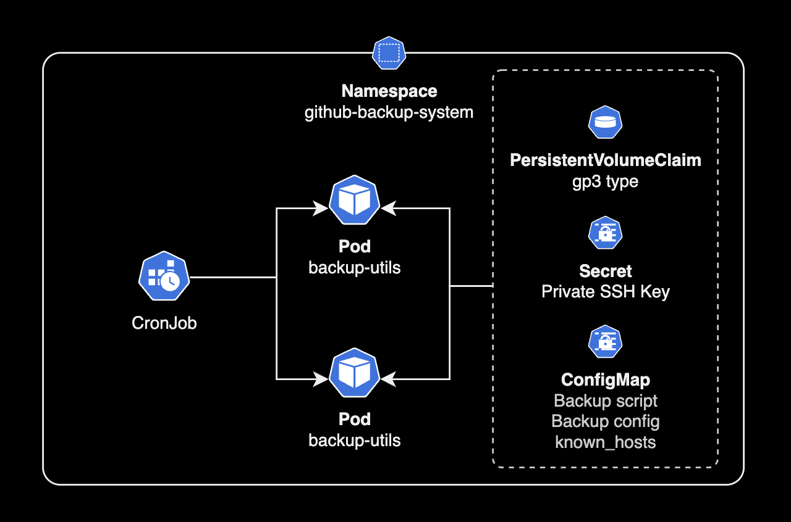

## 개요

Github Enterprise Server v3.8.4에서 Backup 인스턴스(backup-utils) 구축하기

&nbsp;

## 배경지식

### backup-utils와 replica 권장사항

Github Enterprise Server에서 백업 유틸리티(backup-utils)와 고가용성 복제본(HA Replica)은 서로 다른 역할을 수행하기 때문에 둘 중 하나를 선택하는 것보다, 반드시 같이 사용하는 걸 권장하고 있습니다.


자세한 설명은 [backup-utils FAQ](https://github.com/github/backup-utils/blob/master/docs/faq.md#frequently-asked-questions)에서 확인할 수 있습니다.

&nbsp;

### github-backup-utils

Github Enterprise Server를 운영할 때 공식적으로 backup-utils를 사용해서 백업을 수행해야 합니다.

Github Support 측 공식 답변으로는 Github Enterprise Server의 백업은 AWS Backup의 경우 보조 개념으로 사용하고, backup-utils를 메인 백업으로 사용하는 걸 권장한다고 합니다. 이 경우 AWS Backup은 선택사항이므로 Github에서 공식적으로 제공하는 backup-utils만 사용해도 무방합니다.

&nbsp;

## 환경

Github Enterprise 시스템 구성은 다음과 같습니다.


퍼블릭 클라우드인 AWS를 기반으로 Github Enterprise Server와 백업 서버를 구축한 환경입니다.

&nbsp;

### Github Enterprise 서버

- **OS** : Debian 10
- **Github Enterprise v3.8.4**
- **CPU 아키텍처** : x86_64

&nbsp;

### 백업 전용 EC2 인스턴스

- **OS** : Amazon Linux 2023
- **인스턴스 타입** : t4g.large
- **CPU 아키텍처** : ARM64
- **백업 패키지 버전** : [backup-utils v3.8.1](https://github.com/github/backup-utils/releases/tag/v3.8.1)

&nbsp;

## EC2에 설치하기

### 백업 인스턴스 생성

#### OS (AMI)

Github에서는 공식적으로 Ubuntu OS에서 백업 소프트웨어를 테스트했기 때문에 Ubuntu를 사용하는 걸 권장합니다.

하지만 저는 AWS 환경을 사용하고 있어서 백업 서버의 AMI로 Amazon Linux 2023을 선택했습니다. 이유는 [Amazon Linux 2 FAQ](https://aws.amazon.com/ko/amazon-linux-2/faqs/) 문서에 의하면 Amazon Linux 2가 2025년 6월 30일에 완전 지원이 종료되기 때문입니다.

&nbsp;

제 경우 백업 서버의 OS로 Amazon Linux 2023 + ARM64 아키텍처를 사용했는데 백업서버 운영에 전혀 영향이 없었습니다.

```bash
$ cat /etc/os-release
NAME="Amazon Linux"
VERSION="2023"
ID="amzn"
ID_LIKE="fedora"
VERSION_ID="2023"
PLATFORM_ID="platform:al2023"
PRETTY_NAME="Amazon Linux 2023"
ANSI_COLOR="0;33"
CPE_NAME="cpe:2.3:o:amazon:amazon_linux:2023"
HOME_URL="https://aws.amazon.com/linux/"
BUG_REPORT_URL="https://github.com/amazonlinux/amazon-linux-2023"
SUPPORT_END="2028-03-01"
```

&nbsp;

#### 리소스 스펙

CPU 및 메모리 요구 사항은 GitHub Enterprise Server 어플라이언스의 크기에 따라 다릅니다.

GitHub Enterprise Backup Utilities를 실행하는 호스트에는 최소 4개의 코어와 8GB의 RAM이 권장됩니다.

&nbsp;

#### 디스크 볼륨

백업 서버에 연결하는 EBS 볼륨 크기는 Primary GHE 서버 볼륨의 [**최소 5배**](https://github.com/github/backup-utils/blob/master/docs/requirements.md#storage-requirements)를 권장하고 있습니다.

```bash
$ df -hT
Filesystem     Type      Size  Used Avail Use% Mounted on
devtmpfs       devtmpfs  4.0M     0  4.0M   0% /dev
tmpfs          tmpfs     3.9G     0  3.9G   0% /dev/shm
tmpfs          tmpfs     1.6G  468K  1.6G   1% /run
/dev/nvme0n1p1 xfs       1.5T   13G  1.5T   1% /
tmpfs          tmpfs     3.9G     0  3.9G   0% /tmp
tmpfs          tmpfs     783M     0  783M   0% /run/user/1000
```

&nbsp;

#### 가용영역 선정

퍼블릭 클라우드 환경에서 Github Enterprise Server를 설치해서 사용하는 경우, 백업서버의 가용영역 선정이 중요합니다.

가용영역 레벨의 장애가 발생할 경우를 대비하기 위해 반드시 **Github Enterprise Primary 서버와 다른** 가용영역에 배치합니다.


&nbsp;

### 백업 인스턴스에 접속

Github Enterprise 백업 인스턴스에 SSH 또는 [SSM Session Manager](https://docs.aws.amazon.com/ko_kr/systems-manager/latest/userguide/session-manager.html)로 접속합니다.

```bash
# SSH access command example
ssh -i my-ec2-ssh-key.pem -p 22 -l ec2-user 10.190.33.44
```

&nbsp;

#### 필수 유틸리티

백업 서버에 `git` 명령어을 설치합니다. 백업 수행에 필요한 유틸리티입니다.

```bash
$ sudo yum install -y git
```

&nbsp;

백업 서버에 설치가 필요한 패키지는 다음과 같습니다.  
Amazon Linux 2023 기준으로 대부분이 이미 설치되어 있지만 git과 cronie는 별도 설치가 필요했습니다.

| 기능 구분       | 설치가 필요한 패키지           |
|---------------|---------------------------|
| 일반           | bash, git, ssh, rsync, jq |
| 병렬 백업 및 복구 | GNU awk, moreutils        |

자세한 사항은 공식문서 [Backup host requirements](https://github.com/github/backup-utils/blob/master/docs/requirements.md#backup-host-requirements)를 참고하세요.

&nbsp;

### github-backup-utils 패키지 설치

[github-backup-utils v3.8.1](https://github.com/github/backup-utils/releases/tag/v3.8.1) 패키지를 `/opt/` 밑에 다운로드 받습니다.

```bash
VERSION="v3.8.1"
wget https://github.com/github/backup-utils/releases/download/$VERSION/github-backup-utils-$VERSION.tar.gz \
  -O /opt/github-backup-utils-$VERSION.tar.gz
```

위 명령어가 실행되기 위해서 백업서버가 NAT Gateway를 경유해서 인터넷 아웃바운드 가능한 네트워크 환경이어야 합니다.



> **인터넷 아웃바운드의 필요 시점**  
> 패키지 다운로드 작업이 완료된 이후부터는 인터넷 아웃바운드가 필요 없습니다.  
> 백업 서버의 보안그룹에서 인터넷으로 나가는 아웃바운드 룰을 삭제해도 백업 수행에 영향이 없습니다.

&nbsp;

```bash
--2023-06-16 00:47:24--  https://github.com/github/backup-utils/releases/download/v3.8.1/github-backup-utils-v3.8.1.tar.gz
Resolving github.com (github.com)... 20.200.245.247
Connecting to github.com (github.com)|20.200.245.247|:443... connected.
HTTP request sent, awaiting response... 302 Found
...
Resolving objects.githubusercontent.com (objects.githubusercontent.com)... 185.199.110.133, 185.199.111.133, 185.199.108.133, ...
Connecting to objects.githubusercontent.com (objects.githubusercontent.com)|185.199.110.133|:443... connected.
HTTP request sent, awaiting response... cd200 OK
Length: 117155 (114K) [application/octet-stream]
Saving to: ‘/opt/github-backup-utils-v3.8.1.tar.gz’

/opt/github-backup-utils-v3.8.1.t 100%[==========================================================>] 114.41K  --.-KB/s    in 0.009s

2023-06-16 00:47:25 (12.9 MB/s) - ‘/opt/github-backup-utils-v3.8.1.tar.gz’ saved [117155/117155]
```

정상적으로 패키지를 다운로드 받았습니다.

&nbsp;

현재 `/opt/` 밑에 GHE backup util v3.8.1 설치파일을 다운로드 받았습니다.

```bash
$ cd /opt/
$ ls -lh
total 132K
drwxr-xr-x.  4 root     root       33 Jun  9 20:43 aws
-rw-r--r--.  1 root     root     115K Jun 14 22:00 github-backup-utils-v3.8.1.tar.gz
```

&nbsp;

다운로드 받은 `github-backup-utils-v3.8.1.tar.gz` 파일을 압축 해제합니다.

```bash
$ tar -xzvf /opt/github-backup-utils-v3.8.1.tar.gz
```

```bash
github-backup-utils-v3.8.1/
github-backup-utils-v3.8.1/.dockerignore
github-backup-utils-v3.8.1/.github/
github-backup-utils-v3.8.1/.github/dependabot.yml
github-backup-utils-v3.8.1/.github/workflows/
github-backup-utils-v3.8.1/.github/workflows/docker-image.yml
...
github-backup-utils-v3.8.1/test/testlib.sh
```

&nbsp;

Github Enterprise 백업 유틸리티에서 기본적으로 인식할 수 있도록 디렉토리 이름을 `backup-utils`로 변경합니다.

```bash
$ mv github-backup-utils-v3.8.1 backup-utils
```

&nbsp;

### 백업 설정파일 작성

샘플 백업 설정파일 `/opt/backup-utils/backup.config-example`을 확인합니다.  
예제 설정파일 원본은 [Github](https://github.com/github/backup-utils/blob/v3.8.1/backup.config-example)에서 확인할 수 있습니다.

```bash
$ cat backup.config-example
```

```bash
# GitHub Enterprise Server backup configuration file

# The hostname of the GitHub Enterprise Server appliance to back up. The host
# must be reachable via SSH from the backup host.
GHE_HOSTNAME="github.example.com"

# Path to where backup data is stored. By default this is the "data"
# directory next to this file but can be set to an absolute path
# elsewhere for backing up to a separate partition / mount point.
GHE_DATA_DIR="data"

# The number of backup snapshots to retain. Old snapshots are pruned after each
# successful ghe-backup run. This option should be tuned based on the frequency
# of scheduled backup runs. If backups are scheduled hourly, snapshots will be
# available for the past N hours; if backups are scheduled daily, snapshots will
# be available for the past N days ...
GHE_NUM_SNAPSHOTS=10

# The hostname of the GitHub appliance to restore. If you've set up a separate
# GitHub appliance to act as a standby for recovery, specify its IP or hostname
# here. The host to restore to may also be specified directly when running
# ghe-restore so use of this variable isn't strictly required.
#
#GHE_RESTORE_HOST="github-standby.example.com"

# If set to 'yes', ghe-restore will omit the restore of audit logs.
#
#GHE_RESTORE_SKIP_AUDIT_LOGS=no

# When verbose output is enabled with `-v`, it's written to stdout by default. If
# you'd prefer it to be written to a separate file, set this option.
#
#GHE_VERBOSE_LOG="/var/log/backup-verbose.log"

# Any extra options passed to the SSH command.
# In a single instance environment, nothing is required by default.
# In a clustering environment, "-i abs-path-to-ssh-private-key" is required.
#
#GHE_EXTRA_SSH_OPTS=""

# Any extra options passed to the rsync command. Nothing required by default.
#
#GHE_EXTRA_RSYNC_OPTS=""

# If set to 'no', GHE_DATA_DIR will not be created automatically
# and restore/backup will exit 8
#
#GHE_CREATE_DATA_DIR=yes

# If set to 'yes', git fsck will run on the repositories
# and print some additional info.
#
# WARNING: do not enable this, only useful for debugging/development
#GHE_BACKUP_FSCK=no

# Cadence of MSSQL backups
# <full>,<differential>,<transactionlog> all in minutes
# e.g.
#   - Full backup every week (10080 minutes)
#   - Differential backup every day (1440 minutes)
#   - Transactionlog backup every 15 minutes
#
#GHE_MSSQL_BACKUP_CADENCE=10080,1440,15

# If set to 'yes', ghe-backup jobs will run in parallel. Defaults to 'no'.
#
#GHE_PARALLEL_ENABLED=yes

# Sets the maximum number of jobs to run in parallel. Defaults to the number
# of available processing units on the machine.
#
#GHE_PARALLEL_MAX_JOBS=2

# Sets the maximum number of rsync jobs to run in parallel. Defaults to the
# configured GHE_PARALLEL_MAX_JOBS, or the number of available processing
# units on the machine.
#
# GHE_PARALLEL_RSYNC_MAX_JOBS=3

# When jobs are running in parallel wait as needed to avoid starting new jobs
# when the system's load average is not below the specified percentage. Defaults to
# unrestricted.
#
#GHE_PARALLEL_MAX_LOAD=50

# When running an external mysql database, run this script to trigger a MySQL backup
# rather than attempting to backup via backup-utils directly.
#EXTERNAL_DATABASE_BACKUP_SCRIPT="/bin/false"

# When running an external mysql database, run this script to trigger a MySQL restore
# rather than attempting to backup via backup-utils directly.
#EXTERNAL_DATABASE_RESTORE_SCRIPT="/bin/false"
```

- **GHE_HOSTNAME** : "github.company.com"과 같은 Primary 깃허브 서버 도메인 주소
- **GHE_DATA_DIR** : 백업 데이터가 저장되는 경로
- **GHE_NUM_SNAPSHOTS** : 최대 보관하려는 스냅샷 개수

&nbsp;

다음과 같이 `backup.config-example` 설정파일을 수정합니다.

```bash
# GitHub Enterprise Server backup configuration file

# The hostname of the GitHub Enterprise Server appliance to back up. The host
# must be reachable via SSH from the backup host.
GHE_HOSTNAME="github.company.com"

# Path to where backup data is stored. By default this is the "data"
# directory next to this file but can be set to an absolute path
# elsewhere for backing up to a separate partition / mount point.
GHE_DATA_DIR="data"

# The number of backup snapshots to retain. Old snapshots are pruned after each
# successful ghe-backup run. This option should be tuned based on the frequency
# of scheduled backup runs. If backups are scheduled hourly, snapshots will be
# available for the past N hours; if backups are scheduled daily, snapshots will
# be available for the past N days ...
GHE_NUM_SNAPSHOTS=72

# The hostname of the GitHub appliance to restore. If you've set up a separate
# GitHub appliance to act as a standby for recovery, specify its IP or hostname
# here. The host to restore to may also be specified directly when running
# ghe-restore so use of this variable isn't strictly required.
#
#GHE_RESTORE_HOST="github-standby.example.com"

# If set to 'yes', ghe-restore will omit the restore of audit logs.
#
#GHE_RESTORE_SKIP_AUDIT_LOGS=no

# When verbose output is enabled with `-v`, it's written to stdout by default. If
# you'd prefer it to be written to a separate file, set this option.
#
#GHE_VERBOSE_LOG="/var/log/backup-verbose.log"

# Any extra options passed to the SSH command.
# In a single instance environment, nothing is required by default.
# In a clustering environment, "-i abs-path-to-ssh-private-key" is required.
#
#GHE_EXTRA_SSH_OPTS=""

# Any extra options passed to the rsync command. Nothing required by default.
#
#GHE_EXTRA_RSYNC_OPTS=""

# If set to 'no', GHE_DATA_DIR will not be created automatically
# and restore/backup will exit 8
#
#GHE_CREATE_DATA_DIR=yes

# If set to 'yes', git fsck will run on the repositories
# and print some additional info.
#
# WARNING: do not enable this, only useful for debugging/development
#GHE_BACKUP_FSCK=no

# Cadence of MSSQL backups
# <full>,<differential>,<transactionlog> all in minutes
# e.g.
#   - Full backup every week (10080 minutes)
#   - Differential backup every day (1440 minutes)
#   - Transactionlog backup every 15 minutes
#
#GHE_MSSQL_BACKUP_CADENCE=10080,1440,15

# If set to 'yes', ghe-backup jobs will run in parallel. Defaults to 'no'.
#
#GHE_PARALLEL_ENABLED=yes

# Sets the maximum number of jobs to run in parallel. Defaults to the number
# of available processing units on the machine.
#
#GHE_PARALLEL_MAX_JOBS=2

# Sets the maximum number of rsync jobs to run in parallel. Defaults to the
# configured GHE_PARALLEL_MAX_JOBS, or the number of available processing
# units on the machine.
#
# GHE_PARALLEL_RSYNC_MAX_JOBS=3

# When jobs are running in parallel wait as needed to avoid starting new jobs
# when the system's load average is not below the specified percentage. Defaults to
# unrestricted.
#
#GHE_PARALLEL_MAX_LOAD=50

# When running an external mysql database, run this script to trigger a MySQL backup
# rather than attempting to backup via backup-utils directly.
#EXTERNAL_DATABASE_BACKUP_SCRIPT="/bin/false"

# When running an external mysql database, run this script to trigger a MySQL restore
# rather than attempting to backup via backup-utils directly.
#EXTERNAL_DATABASE_RESTORE_SCRIPT="/bin/false"
```

저희는 1시간마다 백업을 수행하도록 스케줄 설정할 예정입니다.  
총 3일치를 보관하기 위해 72개 스냅샷을 보관하도록 설정했습니다.

```bash
GHE_NUM_SNAPSHOTS=72
```

&nbsp;

이후 작성한 설정파일은 Github Enterprise backup-utils 기본 경로인 `/opt/github-backup-utils`에 위치시킵니다.

```bash
$ sudo mkdir /etc/github-backup-utils
$ sudo mv backup.config-example /etc/github-backup-utils/backup.config
```

&nbsp;

### cronie 설치

스케줄 백업을 수행하기 위해 cron 데몬<sup>cronie</sup>을 설치합니다.

```bash
$ sudo yum install -y cronie
```

Amazon Linux 2023에는 기본적으로 crontab이 설치되어 있지 않습니다. Amazon Linux 2023은 내부 반복 작업을 [systemd 타이머](https://www.freedesktop.org/software/systemd/man/systemd.timer.html)로 마이그레이션했기 때문에 의도적으로 cron 패키지가 제외되어 있습니다.

> Amazon Linux 2023에서 cron deprecation 관련으로는 [deprecated cron](https://docs.aws.amazon.com/linux/al2023/ug/deprecated-al2023.html#deprecated-cron)과 [Github issue #300](https://github.com/amazonlinux/amazon-linux-2023/issues/300#issuecomment-1481592973)을 참고합니다.

&nbsp;

백업서버가 재부팅된 후에도 cron 데몬<sup>crond</sup>을 자동시작하도록 enable 설정합니다.

```bash
$ sudo systemctl enable crond.service
```

&nbsp;

cron 데몬을 시작한 후 상태를 확인합니다.

```bash
$ sudo systemctl start crond.service
```

```bash
$ sudo systemctl status crond.service
● crond.service - Command Scheduler
     Loaded: loaded (/usr/lib/systemd/system/crond.service; enabled; preset: enabled)
     Active: active (running) since Thu 2023-06-15 12:15:15 UTC; 13h ago
   Main PID: 32401 (crond)
      Tasks: 1 (limit: 9292)
     Memory: 808.0K
        CPU: 851ms
     CGroup: /system.slice/crond.service
             └─32401 /usr/sbin/crond -n

Jun 15 22:01:01 ip-xx-xxx-xxx-xxx.ap-northeast-2.compute.internal CROND[78810]: (root) CMDEND (run-parts /etc/cron.hourly)
Jun 15 23:01:01 ip-xx-xxx-xxx-xxx.ap-northeast-2.compute.internal CROND[82822]: (root) CMD (run-parts /etc/cron.hourly)
Jun 15 23:01:01 ip-xx-xxx-xxx-xxx.ap-northeast-2.compute.internal CROND[82821]: (root) CMDEND (run-parts /etc/cron.hourly)
Jun 16 00:01:01 ip-xx-xxx-xxx-xxx.ap-northeast-2.compute.internal CROND[86817]: (root) CMD (run-parts /etc/cron.hourly)
Jun 16 00:01:01 ip-xx-xxx-xxx-xxx.ap-northeast-2.compute.internal anacron[86828]: Anacron started on 2023-06-16
Jun 16 00:01:01 ip-xx-xxx-xxx-xxx.ap-northeast-2.compute.internal anacron[86828]: Normal exit (0 jobs run)
Jun 16 00:01:01 ip-xx-xxx-xxx-xxx.ap-northeast-2.compute.internal CROND[86816]: (root) CMDEND (run-parts /etc/cron.hourly)
Jun 16 01:01:01 ip-xx-xxx-xxx-xxx.ap-northeast-2.compute.internal CROND[91127]: (root) CMD (run-parts /etc/cron.hourly)
Jun 16 01:01:01 ip-xx-xxx-xxx-xxx.ap-northeast-2.compute.internal anacron[91138]: Anacron started on 2023-06-16
Jun 16 01:01:01 ip-xx-xxx-xxx-xxx.ap-northeast-2.compute.internal anacron[91138]: Normal exit (0 jobs run)
```

&nbsp;

### 백업 스케줄 등록

crontab에 스케줄 백업을 등록합니다.

백업 빈도는 백업 계획에서 최악의 복구 지점 목표(RPO)를 나타냅니다.  
[backup-utils 공식문서](https://github.com/github/backup-utils/blob/master/docs/scheduling-backups.md#scheduling-backups) 기준으로 최소한 1시간 단위 백업을 권장하고 있습니다.

```bash
$ crontab -e
# Hourly backup
# Note: The backup-utils team recommends hourly backups at the least.
0 * * * * /opt/backup-utils/bin/ghe-backup -v 1>>/opt/backup-utils/backup.log 2>&1
```

위 설정의 경우 1시간 간격(정시)마다 백업이 수행되고, 백업 로그는 `/opt/backup-utils/backup.log`에 저장됩니다.

위 백업 빈도의 경우, 가장 최악의 복구 지점에서 장애가 발생할 때를 가정해보면 최근 1시간 동안의 코드 소실이 발생할 가능성이 있습니다.  
백업 빈도는 각 환경의 [재해 복구 계획](https://ko.wikipedia.org/wiki/%EC%9E%AC%EB%82%9C_%EB%B3%B5%EA%B5%AC_%EA%B3%84%ED%9A%8D)<sup>DRP, Disaster Recovery Plan</sup>에 맞춰 조정하도록 합니다.

&nbsp;

아래는 [cron 스케줄 치트시트](https://devhints.io/cron)입니다.  
crontab에 백업 스케줄 작성 시 참고하세요.

```bash
* * * * * command to be executed
┬ ┬ ┬ ┬ ┬
│ │ │ │ └─────────────  Day of Week   (0=Sun .. 6=Sat)
│ │ │ └───────────────  Month         (1 .. 12)
│ │ └─────────────────  Day of Month  (1 .. 31)
│ └───────────────────  Hour          (0 .. 23)
└─────────────────────  Minute        (0 .. 59)
```

&nbsp;

### SSH 키 등록

백업 서버의 SSH 공개키가 Primary Github Enterprise 서버에 등록되어 있어야 백업 수행이 가능합니다.

백업 서버에서 새로운 SSH 키페어를 생성합니다.

```bash
ssh-keygen \
  -t ed25519 \
  -C "backup-utils@github.example.com" \
  -P ""
```

- `-t` (Type): 어떠한 암호화 방식을 사용할 것인지를 지정합니다. 사용 가능한 타입으로는 `rsa`, `dsa`, `ecdsa`, `ed25519` 등이 있습니다.
- `-C` (Comment): 생성한 키에 주석 달기. 일반적으로는 Github Enterprise 관리자의 이메일 주소를 입력합니다.
- `-P` (Passphrase): 패스프레이즈 없이 SSH 키를 생성합니다.

&nbsp;

백업 서버에서 SSH 키페어 생성이 완료되면 `~/.ssh/` 경로에 비밀키 `id_ed25519`, 공개키 `id_ed25519.pub`가 생성됩니다.

```bash
$ ls ~/.ssh/
authorized_keys  id_ed25519  id_ed25519.pub  known_hosts
```

&nbsp;

백업서버 공개키 `id_ed25519.pub` 내용을 Primary 서버 Management Console에 접속해서 등록합니다.


또는 아래와 같이 Primary 서버의 `~/.ssh/authorized_keys` 파일에 추가해도 콘솔에서 설정한 것과 동일한 효과를 나타냅니다.

```bash
# Add public key in your GHE instance as backup target
echo "ssh-ed25519 <your-public-key> backup-utils@github.example.com" | tee -a /home/admin/.ssh/authorized_keys
```

&nbsp;

이후 다시 백업 서버로 돌아옵니다.

백업 대상인 GHE Primary 인스턴스와 통신 문제가 없는지 체크하기 위해 `/opt/backup-utils/bin/ghe-host-check` 명령어를 실행합니다.

```bash
$ ./ghe-host-check
Connect github.company.com:122 OK (v3.8.4)
```

실행결과로 `Connect <YOUR_GITHUB_DOMAIN>:122 OK`가 출력되면 정상적으로 백업이 준비되었다고 판단할 수 있습니다.

&nbsp;

**보안그룹 설정 시 주의사항**  
백업서버가 아웃바운드 122로 Github Primary 서버에 도달할 수 있어야 하고, Primary 서버의 인바운드 룰에는 백업서버로부터 122로 들어올 수 있도록 허용되어 있어야 합니다.


&nbsp;

### 백업 결과 확인

스케줄링 시간이 지난 후 백업로그를 확인합니다.

```bash
$ tail -f /opt/backup-utils/backup.log
```

```bash
...

sent 270 bytes  received 18,226 bytes  36,992.00 bytes/sec
total size is 262,741  speedup is 14.21
* Enabling ES index flushing ...
Pruning 1 expired snapshot(s) ...
End time: 1686877217
Runtime: 15 seconds
Completed backup of github.company.com:122 in snapshot 20230616T010002 at 01:00:17
Checking for leaked ssh keys ...
* No leaked keys found
```

정상적으로 백업이 수행된 것을 확인할 수 있습니다.

&nbsp;

백업 스냅샷 파일을 확인합니다.  
백업 스냅샷은 기본적으로 `/opt/backup-utils/data/`에 쌓입니다.

```bash
$ ls -lh /opt/backup-utils/data/
```

```bash
total 160K
drwxr-xr-x. 9 ec2-user ec2-user 16K Jun 15 16:00 20230615T160001
drwxr-xr-x. 9 ec2-user ec2-user 16K Jun 15 17:00 20230615T170001
drwxr-xr-x. 9 ec2-user ec2-user 16K Jun 15 18:00 20230615T180001
drwxr-xr-x. 9 ec2-user ec2-user 16K Jun 15 19:00 20230615T190001
drwxr-xr-x. 9 ec2-user ec2-user 16K Jun 15 20:00 20230615T200001
drwxr-xr-x. 9 ec2-user ec2-user 16K Jun 15 21:00 20230615T210001
drwxr-xr-x. 9 ec2-user ec2-user 16K Jun 15 22:00 20230615T220001
drwxr-xr-x. 9 ec2-user ec2-user 16K Jun 15 23:00 20230615T230001
drwxr-xr-x. 9 ec2-user ec2-user 16K Jun 16 00:00 20230616T000001
drwxr-xr-x. 9 ec2-user ec2-user 16K Jun 16 01:00 20230616T010002
lrwxrwxrwx. 1 ec2-user ec2-user  15 Jun 16 01:00 current -> 20230616T010002
```

&nbsp;

### 수동 백업하기

스케줄 백업 말고도 설치 경로의 `bin` 디렉토리 안에 백업 관련 명령어들이 들어있습니다.

```bash
# Backup instance with backup-utils v3.8.1 installed
$ ls -l /opt/backup-utils/bin/
total 56
-rwxrwxr-x. 1 ec2-user ec2-user 10926 Jun 29 22:36 ghe-backup
-rwxrwxr-x. 1 ec2-user ec2-user  9431 Jun 29 22:36 ghe-host-check
-rwxrwxr-x. 1 ec2-user ec2-user 26618 Jun 29 22:36 ghe-restore
```

&nbsp;

백업 인스턴스에 접속한 상태에서 `ghe-backup` 명령어를 실행해서 수동 백업을 할 수 있습니다.

```bash
$ cd /opt/backup-utils/bin/
$ ./ghe-backup
```

```bash
...
2023-07-14T00:52:05Z  INFO  Backing up GitHub settings ...
2023-07-14T00:52:08Z  INFO  Backing up SSH authorized keys ...
2023-07-14T00:52:08Z  INFO  Backing up SSH host keys ...
2023-07-14T00:52:08Z  INFO  Backing up MySQL database using binary backup strategy ...
2023-07-14T00:52:20Z  INFO  Backing up MSSQL databases ...
2023-07-14T00:52:21Z  INFO  Backing up Actions data ...
2023-07-14T00:52:21Z  INFO  Backing up Redis database ...
2023-07-14T00:52:21Z  INFO  Backing up audit log ...
2023-07-14T00:52:21Z  INFO  Backing up Git repositories ...
2023-07-14T00:52:21Z  INFO  Backing up GitHub Pages artifacts ...
2023-07-14T00:52:21Z  INFO  Backing up storage data ...
2023-07-14T00:52:21Z  INFO  Backing up custom Git hooks ...
2023-07-14T00:52:21Z  INFO  Backing up Elasticsearch indices ...
2023-07-14T00:52:31Z  INFO  Runtime: 32 seconds
2023-07-14T00:52:31Z  INFO  Completed backup of github.company.com:122 in snapshot 20230714T005159 at 00:52:31
2023-07-14T00:52:31Z  INFO  Checking for leaked ssh keys ...
2023-07-14T00:52:31Z  INFO  * No leaked keys found
2023-07-14T00:52:31Z  INFO  Backup of github.company.com:122 finished.
```

&nbsp;

또는 백업 명령어 파일의 절대경로를 써서 실행해도 결과는 동일합니다.

```bash
$ /opt/backup-utils/bin/ghe-backup
...
2023-07-14T00:52:05Z  INFO  Backing up GitHub settings ...
2023-07-14T00:52:08Z  INFO  Backing up SSH authorized keys ...
2023-07-14T00:52:08Z  INFO  Backing up SSH host keys ...
2023-07-14T00:52:08Z  INFO  Backing up MySQL database using binary backup strategy ...
2023-07-14T00:52:20Z  INFO  Backing up MSSQL databases ...
2023-07-14T00:52:21Z  INFO  Backing up Actions data ...
2023-07-14T00:52:21Z  INFO  Backing up Redis database ...
2023-07-14T00:52:21Z  INFO  Backing up audit log ...
2023-07-14T00:52:21Z  INFO  Backing up Git repositories ...
2023-07-14T00:52:21Z  INFO  Backing up GitHub Pages artifacts ...
2023-07-14T00:52:21Z  INFO  Backing up storage data ...
2023-07-14T00:52:21Z  INFO  Backing up custom Git hooks ...
2023-07-14T00:52:21Z  INFO  Backing up Elasticsearch indices ...
2023-07-14T00:52:31Z  INFO  Runtime: 32 seconds
2023-07-14T00:52:31Z  INFO  Completed backup of github.company.com:122 in snapshot 20230714T005159 at 00:52:31
2023-07-14T00:52:31Z  INFO  Checking for leaked ssh keys ...
2023-07-14T00:52:31Z  INFO  * No leaked keys found
2023-07-14T00:52:31Z  INFO  Backup of github.company.com:122 finished.
```

&nbsp;

### 백업 및 복구 진행사항 모니터링

> 백업 및 복구 진행사항 모니터링 기능은 backup-utils `v3.9.0`부터 지원합니다.  
> [관련 Github Engterprise 릴리즈 노트](https://docs.github.com/en/enterprise-server@3.9/admin/release-notes#3.9.0-backups)

```bash
# Backup instance with backup-utils v3.9.0 installed
$ ls -l /opt/backup-utils/bin/
total 56
-rwxrwxr-x. 1 ec2-user ec2-user 10926 Jun 29 22:36 ghe-backup
-rwxrwxr-x. 1 ec2-user ec2-user  1210 Jun 29 22:36 ghe-backup-progress
-rwxrwxr-x. 1 ec2-user ec2-user  9431 Jun 29 22:36 ghe-host-check
-rwxrwxr-x. 1 ec2-user ec2-user 26618 Jun 29 22:36 ghe-restore
```

`ghe-backup-progress` 명령어는 백업 진행상황과 복구상황을 실시간으로 모니터링할 수 있는 명령어입니다.

&nbsp;

명령어 사용 예시는 다음과 같습니다.

```bash
$ /opt/backup-utils/bin/ghe-backup-progress
Backup progress: 138.00 % (25 / 18 ) ghe-backup-es-rsync took 1s
```

`top` 명령어처럼 백업 또는 복구 작업의 진행사항이 실시간으로 출력됩니다.  
전체 스탭 25개 중에 18번째 스탭을 수행하고 있는 걸 확인할 수 있습니다.

&nbsp;

### 주요 핵심파일들

EC2 기반의 `backup-utils` 서버에서 사용하는 중요파일 경로는 다음과 같습니다.

- **설정파일 기본경로** : `/etc/github-backup-utils/backup.config`
- **패키지 경로** : `/opt/backup-utils/`
- **스냅샷이 저장되는 경로** : `/opt/backup-utils/data/`
- **백업 로그 경로** : `/opt/backup-utils/backup.log`

&nbsp;

## 쿠버네티스에 설치하기

### backup-utils

아쉽게도 Github Enterprise 백업서버는 공식 헬름차트를 제공하지 않습니다. GHE 서버는 쿠버네티스 클러스터 기반 설치 지원도 없습니다.

제 경우는 되도록이면 대부분의 시스템을 쿠버네티스에 올리는 걸 선호하는데요, 시스템 운영이 자동화된다는 장점과 별도의 인스턴스 구동이 필요 없이 컴퓨팅 자원을 절약할 수 있다는 장점 때문입니다.



그래서 백업서버 인프라를 쿠버네티스 클러스터에 CronJob 형태로 운영하는 결정을 했습니다. gp3 타입의 EBS 볼륨에 백업 데이터를 증적하는 메커니즘은 동일합니다.  
다만 백업을 수행하는 주체가 EC2 대신 `CronJob`이 주기적으로 스케줄링하는 `Pod`로 바뀐다는 점이 가장 큰 차이점입니다.

backup-utils는 SSH Key에 대한 Secret 리소스를 생성한 이후, 헬름 차트로 손쉽게 설치할 수 있습니다.

&nbsp;

다음은 EKS 클러스터에 [backup-utils](/charts)를 설치하는 절차입니다.

`backup-utils` 차트가 저장된 [차트 레포지토리](https://github.com/younsl/charts)를 추가합니다.

```bash
helm repo add younsl https://younsl.github.io/
helm search repo younsl
```

&nbsp;

`values.yaml`의 세부 설정을 추가한 후, `helm` 명령어로 쿠버네티스 클러스터에 `backup-utils` 차트를 설치합니다.

```bash
helm upgrade \
    --install \
    --namespace backup-utils \
    --create-namespace \
    backup-utils younsl/backup-utils \
    -f values.yaml
```

&nbsp;

쿠버네티스 클러스터에 `cronJob` 리소스가 생성되며, 이를 통해 `backup-utils` 파드가 주기적으로 Github Enterprise Server의 백업 작업을 수행합니다.

```bash
$ kubectl get cronjob -n backup-utils
NAME                  SCHEDULE       TIMEZONE     SUSPEND   ACTIVE   LAST SCHEDULE   AGE
github-backup-utils   */30 * * * *   Asia/Seoul   False     1        25m             25h
```

> Github Enterprise에서는 공식적으로 최소 백업 주기를 1시간으로 권장하고 있습니다. 그러나 제 경험상 30분 간격으로 백업을 찍는 것이 가장 안전한 것 같습니다.

&nbsp;

### 파드 기반의 Github 인스턴스 복구절차

때는 2024년 7월. 스펙 업그레이드를 위해 서버를 껐다 켰고 이로 인해 15시간 동안 Github Enterprise Server 장애를 겪었습니다.

Primary & Replica로 HA 구성을 했지만 둘다 깨지는 사단에 이르렀습니다. 이 장애때는 진짜 지금까지 쌓아둔 모든 소스코드가 날라갈 수 있다는 생각에 사로잡혀 정상적인 판단을 할 수 없었던 것 같습니다. 다행히 30분 간격으로 스냅샷을 찍게 되어 있던 backup-utils CronJob이 있었고, 이를 통해 다음 절차대로 복구 완료했습니다.


1. 복구할 새 Github Enterprise Server 인스턴스 생성: 반드시 **새로 생성된 인스턴스**에 복구를 해야만 합니다.
2. GHE 새 인스턴스의 `/home/admin/.ssh/authorized_keys` 경로에 SSH 공개키<sup>id_ed25519.pub</sup> 등록
3. 복구용 backup-utils deployment 파드 생성
4. **메인터넌스 모드 켜기**: `ghe-restore` 명령어를 수행하려면 `ghe-maintenance -s`를 사용해서 반드시 메인터넌스 모드가 켜져 있어야 합니다.

   ```bash
   # Enable maintenance mode in new primary GHE instance
   ghe-maintenance -q
   ghe-maintenance -s
   ```

5. **Actions S3 설정**: 이 단계는 내가 복구할 스냅샷에 Actions 데이터가 포함되어 있어서 필요했습니다. 자세한 설정 방법은 [Github Enterprise Server 공식문서](https://docs.github.com/en/enterprise-server/admin/managing-github-actions-for-your-enterprise/advanced-configuration-and-troubleshooting/backing-up-and-restoring-github-enterprise-server-with-github-actions-enabled#restoring-a-backup-of-github-enterprise-server-when-github-actions-is-enabled)에서 확인할 수 있습니다.

   ```bash
   # Run these commands in new primary GHE instance
   # Actions S3 관련 설정
   ghe-config secrets.actions.storage.blob-provider "s3"

   ghe-config secrets.actions.storage.s3.bucket-name "<ACTIONS_BUCKET_NAME>"
   ghe-config secrets.actions.storage.s3.service-url "https://s3.ap-northeast-2.amazonaws.com"
   ghe-config secrets.actions.storage.s3.access-key-id "<ACCESS_KEY_ID>"
   ghe-config secrets.actions.storage.s3.access-secret ""

   ghe-config app.actions.enabled true

   # Actions S3 설정 적용
   ghe-config-apply
   ```

6. 복구용 파드 → 새 인스턴스 SSH 포트<sup>TCP/122</sup>로 연결 가능여부 확인

   ```bash
   ghe-host-check
   ```

7. 복구용 파드에서 스냅샷 복구 `ghe-restore`

&nbsp;

## 정리

- Github Enterprise Server를 운영할 때 백업과 고가용성을 위한 Replica를 같이 혼합해서 사용하는 것이 모범사례입니다.
- 백업 구성은 지루한 작업이지만 그 무엇보다 중요합니다. Github Enterprise Server에 재난이 닥쳤을 때에 후회하면 이미 늦습니다.
- 최근 15시간 동안 Github Enterprise Server 서버를 복구한 후 포스트모템을 쓰면서 업무가 중단된 개발자들에게 미안하기도 하고 많은 생각이 스쳤습니다.

> 초기에 Github Enterprise Server 구축할 때 `backup-utils`로 데이터 백업 구성 해놓길 잘했다. VCS를 self-hosted로 직접 운영하는 건 매우 고된 작업이구나.. 가끔은 Failover 이후에 Replica 서버까지도 고장나는 경우가 있구나.. 만약 데이터 백업하지 않았더라면? 모든 회사의 소스코드가 날라간 상황에서 나는 어떻게 되었을까?

&nbsp;

## 참고자료

[GitHub Enterprise Server Backup Utilities - Documentation](https://github.com/github/backup-utils#documentation)  
github-backup-utils 공식문서에 전체적인 설명이 잘 나와 있습니다.

[Installing CronTab on Amazon Linux 2023 EC2](https://jainsaket-1994.medium.com/installing-crontab-on-amazon-linux-2023-ec2-98cf2708b171)  
Amazon Linux 2023에서 CronTab 설치 시에 참고한 글

[Deprecated in AL2023](https://docs.aws.amazon.com/linux/al2023/ug/deprecated-al2023.html#deprecated-cron)
