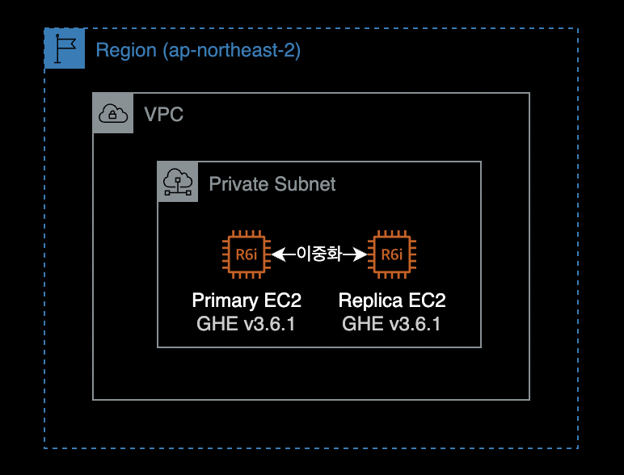
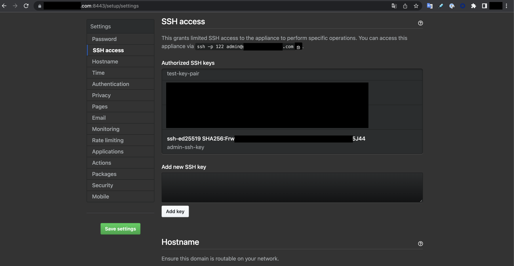

## 개요

이 글은 Github Enterprise Server의 이중화 구성 및 해제를 설명하는 가이드입니다.  
크게 아래 주제를 다룹니다.

- Github Enterprise 인스턴스 2대를 Primary - Replica로 이중화 구성하는 가이드
- 이중화된 Github Enterprise Server 구성에서 Replica 해제 후 인스턴스 중지하기

&nbsp;

## 환경



- Private Subnet에 위치한 EC2 인스턴스 2대로 구성되어 있습니다.
  - **인스턴스 타입** : `r6i.2xlarge` (x86_64)
  - **EBS Volume** : root 200GiB, data 100GiB
- 사용중인 Github Enterprise Server 버전은 `v3.6.1` (Debian 10)입니다.
  - **AMI ID** : ami-026a4976f74701223

  ```bash
  $ ghe-version
  GitHub Enterprise Server 3.6.1 ami 2022-08-24 0616a9cb7b
  ```

&nbsp;

## 이중화 구성

### 서버 접속

Replica EC2 인스턴스에 SSH 또는 SSM Session Manager를 사용해서 원격 접속합니다.

Github Enterprise EC2의 경우 관리용 SSH 포트는 Git SSH 액세스와 별도로 관리되며, TCP/122 포트를 통해서만 접속할 수 있습니다.

```bash
$ ssh \
    -i /path/to/ghe_private_key \
    -p 122 \
    admin@your.github.com
```

&nbsp;

#### 서버 접속 시 참고할 문서

Github Enterprise Server 원격접속 시 필요한 네트워크 포트 목록 및 접속 방법은 아래 문서들을 참고합니다.

[네트워크 포트](https://docs.github.com/ko/enterprise-server@3.6/admin/configuration/configuring-network-settings/network-ports#administrative-ports)  
Github Enterprise Server v3.6 공식문서

[Accessing the administrative shell (SSH)](https://docs.github.com/en/enterprise-server@3.7/admin/configuration/configuring-your-enterprise/accessing-the-administrative-shell-ssh)  
관리용 SSH에 대한 설명 및 접속방법

&nbsp;

### 복제용 키페어 생성

Replica 인스턴스에서 `ghe-repl-setup <PRIMARY_SERVER_IP>` 명령어를 실행합니다.  
이 명령어를 실행하면 데이터 복제에 사용되는 SSH 키페어가 자동 생성됩니다.

```bash
# On "replica" github enterprise EC2.
$ ghe-repl-setup 11.11.11.11
```

```bash
Generating public/private ed25519 key pair.
/home/admin/.ssh/id_ed25519 already exists.
Overwrite (y/n)? Your identification has been saved in /home/admin/.ssh/id_ed25519.
Your public key has been saved in /home/admin/.ssh/id_ed25519.pub.
The key fingerprint is:
SHA256:FrwNgvYlfuXXXXXrXXXXXXmXXXXpFwcr000/O123J45 admin-ssh-key
The key's randomart image is:
...
Connection check failed.
admin@11.11.11.11: Permission denied (publickey).
Connection check with replicas succeeded.
The primary GitHub Enterprise Server appliance must be configured to allow replica access.
Visit http://11.11.11.11/setup/settings and authorize the following SSH key:

ssh-ed25519 XXXXC.............................................................Ox admin-ssh-key

Run `ghe-repl-setup 11.11.11.11' once the key has been added to continue replica setup.
```

**참고**: 위 키값에서 연속된 `.`은 실제 값을 시크릿 처리하기 위한 표기입니다.

&nbsp;

마지막줄에 나오는 SSH 키 값을 클립보드에 복사합니다.

```bash
ssh-ed25519 XXXXC.............................................................Ox admin-ssh-key
```

**참고**: 위 키값에서 연속된 `.`은 실제 값을 시크릿 처리하기 위한 표기입니다.

&nbsp;

### 복제용 키페어 등록

Replica 서버에서 키페이를 생성한 후 Primary 서버에서 등록합니다.
크게 2가지 방법이 있습니다.

1. SSH (CLI)
2. Management Console

&nbsp;

#### SSH

Primary 서버의 [Administrative SSH](https://docs.github.com/en/enterprise-server@3.11/admin/monitoring-managing-and-updating-your-instance/configuring-clustering/cluster-network-configuration#administrative-ports)<sup>TCP/122</sup>로 접속합니다.

리눅스 서버에서 `~/.ssh/authorized_keys` 파일은 SSH 공개 키를 저장하는 파일로, 서버나 사용자가 원격으로 접속할 때 사용됩니다.

`tee` 명령어를 사용해서 Replica 서버에서 생성한 SSH 공개키를 `authorized_keys` 파일에 새로 추가합니다.

```bash
echo "ssh-ed25519 <your-public-key> admin-ssh-key" | tee -a /home/admin/.ssh/authorized_keys
```

해당 파일에 SSH 공개키를 추가하게 되면 Management Console에서도 동일하게 조회가 됩니다.

&nbsp;

#### Management Console

Github Enterprise 관리 콘솔 페이지에 접속해서 값을 입력하고 Add key를 눌러 복제용 키를 등록합니다.

[관리 콘솔](https://docs.github.com/ko/enterprise-server@3.6/admin/configuration/administering-your-instance-from-the-management-console/about-the-management-console)은 HTTPS 프로토콜에 TCP/8443 포트를 사용합니다. 관리 콘솔 URL 주소는 `https://your.github-enterprise.com:8443/setup/settings/`와 같은 형식을 지니고 있습니다.



Primary 서버의 Github Enterprise 웹 콘솔 페이지에서 다음 작업을 진행합니다.  
복사한 SSH 키 값을 Add new SSH key 란에 입력한 후, Add key 버튼을 클릭해서 등록합니다.

&nbsp;

### Replica 등록

Primary 서버에 Replica 서버를 등록합니다.  
아래 명령어는 Github Enterprise Replica 서버에서만 실행할 수 있습니다.

#### 명령어 형식

```bash
# On "replica" github enterprise EC2.
$ ghe-repl-setup <PRIMARY EC2 IP>
```

&nbsp;

#### 명령어 예시

```bash
# On "replica" github enterprise EC2.
$ ghe-repl-setup 11.11.11.11
```

&nbsp;

결과값은 다음과 같습니다.

```bash
Verifying ssh connectivity with 11.11.11.11 ...
Connection check with primary succeeded.
Connection check with replicas succeeded.
Updating Elasticsearch configuration ...
Elasticsearch isn't listening on tcp/9200.
Copying license and settings from primary appliance ...
Syncing Actions state files and certificates (if applicable) from primary appliance ...
 --> Importing SSH host keys...
 --> The SSH host keys on this appliance have been replaced to match the primary.
 --> Please run 'ssh-keygen -R 22.22.22.22; ssh-keygen -R "[22.22.22.22]:122"' on your client to prevent future ssh warnings.
Copying custom CA certificates from primary appliance ...
Validating configuration
Updating configuration for github-enterprise-com-replica (22.22.22.22)
/data/user/common/github.conf /data/user/common/secrets.conf                  /data/user/common/cluster.conf /data/user/common/enterprise.ghl                  /data/user/common/saml-sp.p12                  /data/user/common/authorized_keys /data/user/common/ssh_host_* /data/user/actions/states/*                      /data/user/actions/certificates/*
Configuration Updated
Success: Replica mode is configured against 11.11.11.11.
To disable replica mode and undo these changes, run 'ghe-repl-teardown'.
Run 'ghe-repl-start' to start replicating from the newly configured primary.
```

`ghe-repl-setup` 명령어 실행시 Replica 서버에 클러스터와 관련된 다양한 설정파일, 라이센스 파일들을 복제해서 가져오는 걸 확인할 수 있습니다.

&nbsp;

### 복제 시작

Replica 서버에서 복제본 받아오도록 `ghe-repl-start` 명령어를 실행합니다.  
`ghe-repl-start`로 인해 Primary 서버가 잠시 중단되며 잠깐동안 Github Enterprise 사용자에게 내부 서버 오류 페이지가 표시될 수 있습니다.

```bash
# On "replica" github enterprise EC2.
$ ghe-repl-start
```

전체 복제가 끝나는 데까지는 약 20분 정도 소요되므로 인내심을 가지고 기다려주세요.

&nbsp;

복제 진행사항과 관련된 모든 로그는 Primary 서버의 아래 경로에서 확인 가능합니다.

```bash
# On "primary" github enterprise EC2.
$ tail -f /data/user/common/ghe-config.log
```

&nbsp;

Replication은 총 4개의 Phase로 구성됩니다.  
이는 `ghe-repl-status` 명령어 실행 후 출력되는 실시간 로그에서 확인할 수 있습니다.

아래는 Replica 서버에서 확인한 ghe-repl-status 명령어 결과입니다.

```bash
# On "replica" github enterprise EC2.
$ ghe-repl-start
```

```bash
...
Configuration Phase 1
github-enterprise-com-replica: Nov 25 14:53:01 Preparing storage device...
github-enterprise-com-replica: Nov 25 14:53:02 Updating configuration...
github-enterprise-com-replica: Nov 25 14:53:03 Reloading system services...
github-enterprise-com-replica: Nov 25 14:54:50 Done!
github-enterprise-com-primary: Nov 25 14:52:37 Preparing storage device...
github-enterprise-com-primary: Nov 25 14:52:38 Updating configuration...
github-enterprise-com-primary: Nov 25 14:52:38 Reloading system services...
github-enterprise-com-primary: Nov 25 14:55:44 Done!
Configuration Phase 2
github-enterprise-com-replica: Nov 25 14:55:45 Running migrations...
github-enterprise-com-replica: Nov 25 14:55:45 Done!
github-enterprise-com-primary: Nov 25 14:55:45 Running migrations...
github-enterprise-com-primary: Nov 25 14:57:53 Done!
Configuration Phase 3
github-enterprise-com-primary: Nov 25 14:57:54 Reloading application services...
github-enterprise-com-primary: Nov 25 15:04:09 Done!
Configuration Phase 4
github-enterprise-com-replica: Nov 25 15:05:49 Validating services...
github-enterprise-com-replica: Nov 25 15:05:50 Done!
github-enterprise-com-primary: Nov 25 15:05:49 Validating services...
github-enterprise-com-primary: Nov 25 15:05:53 Done!
github-enterprise-com-primary: Firewall reloaded
github-enterprise-com-replica: Firewall reloaded
Finished cluster configuration
Success: replication is running for all services.
Run `ghe-repl-status' to monitor replication health and progress.
```

&nbsp;

`ghe-repl-start` 결과값의 마지막 부분에 다음과 같은 메세지가 출력되면 이중화 구성이 정상적으로 완료된 것입니다.

```bash
...
Finished cluster configuration
Success: replication is running for all services.
Run `ghe-repl-status' to monitor replication health and progress.
```

&nbsp;

### 이중화 상태 확인

초기에 Primary 서버에게 git Replication 시점이 과거에 있는 걸 확인할 수 있습니다.

```bash
# On "replica" github enterprise EC2.
$ ghe-repl-status
```

```bash
OK: mysql replication is in sync
OK: mssql replication is in sync
OK: redis replication is in sync
OK: elasticsearch cluster is in sync (0 shards initializing, 0 shards unassigned)
CRITICAL: git replication is behind the primary by 150 repositories and/or gists
OK: pages replication is in sync
OK: alambic replication is in sync
OK: git-hooks replication is in sync
OK: consul replication is in sync
```

&nbsp;

하지만 시간이 지나면서 빠른 시간 내에 최근 시점으로 싱크가 맞춰지는 걸 확인할 수 있습니다.

```bash
# On "replica" github enterprise EC2.
$ ghe-repl-status
```

```bash
WARNING: mysql replication delay is 29s
OK: mssql replication is in sync
OK: redis replication is in sync
OK: elasticsearch cluster is in sync (0 shards initializing, 0 shards unassigned)
WARNING: git replication is behind the primary by 50 repositories and/or gists
OK: pages replication is in sync
OK: alambic replication is in sync
OK: git-hooks replication is in sync
OK: consul replication is in sync
```

Primary와 Replica 서버의 격차가 줄어들며 결국 모든 컴포넌트가 싱크가 맞춰집니다.

&nbsp;

### 결과 확인

정상적으로 이중화 구성이 되었는지 모니터링 하려면 Replica 서버에서 아래 명령어를 실행합니다.

```bash
# On "replica" github enterprise EC2.
$ ghe-repl-status
```

```bash
$ ghe-repl-status -v   # 이중화 상태 자세히 보기
$ ghe-repl-status -vv  # 이중화 상태 더 자세히 보기
```

&nbsp;

Replication 구성에 대한 네트워크 연결 가능성<sup>Connectivity</sup> 통계를 확인하려면 Primary 서버와 Replica 서버 양쪽 모두에서 다음 명령어를 실행합니다.

```bash
sudo fping -t 1000 -B 1 -c 5 -i 500 -q `ghe-cluster-nodex` -x
```

**중요**  
복제(Replication)가 제대로 작동하려면 복제 인스턴스가 포트 `TCP/122` 및 `UDP/1194`를 통해 고가용성 환경의 다른 모든 어플라이언스와 통신할 수 있어야 합니다.

&nbsp;

Replication 상태에 따라 실행 결과값이 다르게 나옵니다.

```bash
# Replication 상태가 정상인 경우 결과값
github-xxx-xxx-replica: xmt/rcv/%loss = 5/5/0%, min/avg/max = 0.17/0.23/0.27
```

```bash
# Replication 상태가 비정상인 경우 결과값
github-xxx-xxx-primary: xmt/rcv/%loss = 5/0/100%
```

위 경우 Replica 서버와 Primary 서버간의 Network 연결 가능 여부를 반드시 확인합니다. TCP/122와 UDP/1194 포트 중 하나라도 통신이 안되는 경우 위와 같이 `%loss` 값이 100%로 출력됩니다.

&nbsp;

## 이중화 해제

### Replica 서버 접속

모든 이중화 해제에 필요한 명령어 실행은 Replica 서버에서 진행합니다.
SSH 또는 SSM Session Manager를 통해 Replica 서버에 원격 접속합니다.

&nbsp;

### 이중화 상태 체크

Replica 서버에서 이중화 상태를 체크합니다.

```bash
# On "replica" github enterprise EC2.
$ ghe-repl-status
```

```bash
OK: mysql replication is in sync
OK: mssql replication is in sync
OK: redis replication is in sync
OK: elasticsearch cluster is in sync (0 shards initializing, 0 shards unassigned)
OK: git replication is in sync
OK: pages replication is in sync
OK: alambic replication is in sync
OK: git-hooks replication is in sync
OK: consul replication is in sync
```

`in sync`로 출력되는 경우 모든 컴포넌트가 Primary 서버와 실시간 동기화되었다고 이해하면 됩니다.

&nbsp;

Primary와 Replica 서버는 `v3.6.1` 버전을 사용하고 있습니다.

```bash
# On "replica" github enterprise EC2.
$ ghe-version
GitHub Enterprise Server 3.6.1 ami 2022-08-24 0616a9cb7b
```

&nbsp;

### 이중화 중지

Replica 서버에서 실시간 싱크를 중지합니다.

```bash
# On "replica" github enterprise EC2.
$ ghe-repl-stop
```

&nbsp;

Phase 1부터 4까지 순차적으로 진행됩니다.  
완료까지는 약 15분 걸립니다.

```bash
Updating configuration...
gh-greenlabsfin-com-primary: Total reclaimed space: 0B
gh-greenlabsfin-com-replica: Total reclaimed space: 0B
Validating configuration
Updating configuration for gh-greenlabsfin-com-replica (11.11.11.110)
/data/user/common/github.conf /data/user/common/secrets.conf                  /data/user/common/cluster.conf /data/user/common/enterprise.ghl                  /data/user/common/saml-sp.p12                  /data/user/common/authorized_keys /data/user/common/ssh_host_* /data/user/actions/states/*                      /data/user/actions/certificates/*
Configuration Updated
Configuration Phase 1
...
gh-greenlabsfin-com-primary: Feb 15 02:11:50 Done!

Configuration Phase 2
gh-greenlabsfin-com-replica: Feb 15 02:11:51 Done!
...

Configuration Phase 3
gh-greenlabsfin-com-replica: Feb 15 02:14:01 Reloading application services...
gh-greenlabsfin-com-replica: Feb 15 02:15:55 Done!
...

Configuration Phase 4
...

Success: Replication was stopped for all services.
To disable replica mode and remove all replica configuration, run 'ghe-repl-teardown'.
```

&nbsp;

### 이중화 해제하기

Replica 서버를 이중화 해제합니다.

```bash
# On "replica" github enterprise EC2.
$ ghe-repl-teardown
```

```bash
git-server-691a9482-6ccd-11ed-8158-0a9dd83cc212 is evacuating
...
git-server-691a9482-6ccd-11ed-8158-0a9dd83cc212 is destroyed
...
Feb 15 02:34:00 Validating services...
Feb 15 02:34:04 Done!
Success: Replication configuration has been removed.
Run `ghe-repl-setup' to re-enable replica mode.
```

&nbsp;

Primary 서버에서도 이중화 상태를 확인합니다.

```bash
# On "primary" github enterprise EC2.
$ ghe-cluster-each --replica 'ghe-repl-status'
```

```bash
Clustering is not configured on this host.
```

위와 같이 실행결과로 `Clustering is not configured on this host.` 메세지가 출력되는 경우, Replica 서버가 하나도 없다는 의미입니다.  
제가 원하는 Replica 인스턴스가 제거된 상황이 되었습니다.

&nbsp;

### 인스턴스 중지

이중화 해제를 완료한 후에는 Replica EC2 인스턴스를 중지합니다.  
AWS 콘솔에서 EC2 중지를 실행하거나 AWS CLI를 사용해서 EC2를 중지하는 작업을 진행합니다.

&nbsp;

AWS CLI의 경우는 다음과 같이 실행합니다.

```bash
$ aws ec2 modify-instance-attribute \
    --instance-id i-0xx0x6x17x88be5ed \
    --no-disable-api-stop
```

위 명령어는 Replica EC2 인스턴스에 설정된 [중지 방지](https://docs.aws.amazon.com/AWSEC2/latest/UserGuide/Stop_Start.html#Using_StopProtection)<sup>Stop protection</sup> 기능을 해제합니다.

&nbsp;

Github Enterprise 이중화 해제까지 완료되었으므로 EC2 인스턴스를 중지합니다.

```bash
$ aws ec2 stop-instances \
    --instance-ids i-0xx0x6x17x88be5ed
```

&nbsp;

## 참고자료

### 이중화 구성 관련 참고자료

[Creating a high availability replica](https://docs.github.com/en/enterprise-server@3.6/admin/enterprise-management/configuring-high-availability/creating-a-high-availability-replica)  
제 경우 Github Enterprise 공식문서를 참조해서 이중화 구성을 정상적으로 완료했습니다.

&nbsp;

클러스터 정보 확인하는 방법

```bash
$ cat /data/user/common/cluster.conf
```

클러스터 구성 파일(cluster.conf)은 클러스터의 노드와 이들이 실행하는 서비스를 정의합니다.  
[Initializing the cluster](https://docs.github.com/en/enterprise-server@3.6/admin/enterprise-management/configuring-clustering/initializing-the-cluster)

&nbsp;

### 이중화 해제 관련 참고자료

[고가용성 복제본 제거](https://docs.github.com/ko/enterprise-server@3.6/admin/enterprise-management/configuring-high-availability/removing-a-high-availability-replica)  
GHE 공식문서

[Github Enterprise on AWS 구축 가이드](/blog/guide-to-setup-ghe-on-aws/)  
넓고 얕게 Github Enterprise 전반적인 주제를 다루고 있습니다.  
제가 직접 작성한 가이드입니다.
