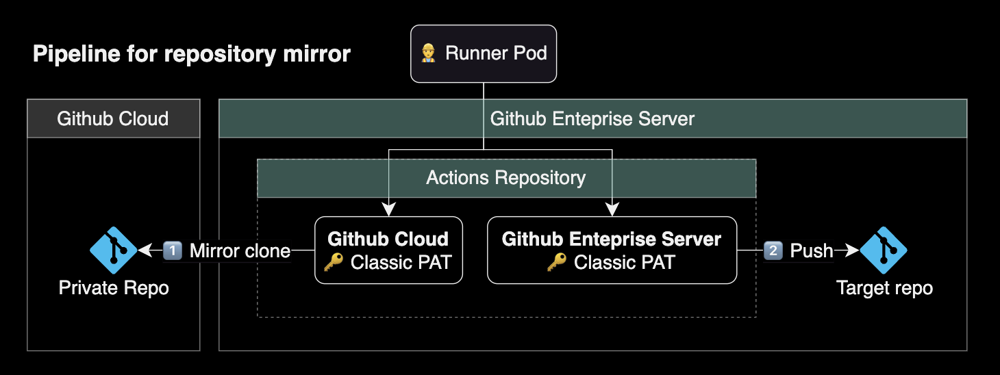
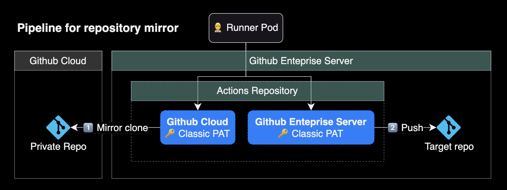

## 개요

Github Actions를 사용해서 Github Cloud에 있는 Private Repository를 Github Enterprise Server의 레포로 Mirror clone 하는 방법을 소개합니다.

Github Actions를 사용해서 자동화하는 시나리오입니다.

&nbsp;

## 준비사항

Mirror Clone을 구현하기 전에 다음 준비사항이 필요합니다.

&nbsp;

### Actions Runner

Github Enterprise Server는 Github Cloud와 다르게 Actions Workflow를 실행하는 머신인 Actions Runner의 구축이 필요합니다.

Actions Runner는 크게 2가지 방식으로 구축할 수 있습니다.

1. **EC2** : EC2 기반의 Actions Runner
2. **EKS** : [Actions Runner Controller](https://github.com/actions/actions-runner-controller)를 사용한 Pod 기반의 Actions Runner

제 경우 컴퓨팅 비용 절감 및 운영 자동화 측면에서 EKS 방식을 사용해서 Actions Runner를 운영하고 있습니다.

&nbsp;

제 환경에서는 Amazon EKS 기반의 Runner를 운영하고 있습니다.

EKS 클러스터에 Actions Runner Controller를 헬름 차트로 설치했습니다.

```bash
$ helm list -n actions-runner-system
NAME                       NAMESPACE              REVISION  UPDATED                               STATUS    CHART                             APP VERSION
actions-runner-controller  actions-runner-system  40        2023-11-14 16:13:08.829636 +0900 KST  deployed  actions-runner-controller-0.23.3  0.27.4
```

&nbsp;

이후 Actions Runner를 클러스터에 배포해서 사용중입니다.

```bash
$ kubectl get runner -A
NAMESPACE        NAME                            ENTERPRISE   ORGANIZATION   REPOSITORY   GROUP   LABELS                                                                                                              STATUS    MESSAGE   WF REPO   WF RUN   AGE
actions-runner   mgmt-basic-runner-zczrf-mfzdx   doge                                             ["XXXXX-MGMT-EKS-CLUSTER","m6i.xlarge","support-horizontal-runner-autoscaling","ubuntu-22.04","v2.311.0","build"]   Running                                9h
actions-runner   mgmt-cd-runner-wrftn-wxgwq      doge                                             ["XXXXX-MGMT-EKS-CLUSTER","m6i.xlarge","ubuntu-22.04","v2.311.0","deploy"]                                          Running                                10h
```

자세한 설치 방법이 궁금한 분들은 [Actions Runner Controller 구성](/blog/actions-runner-admin-guide/) 페이지를 참고하세요.

&nbsp;

## 자동화 구현

### Actions Workflow 구성

Mirror Clone을 받아오는 파이프라인 동작방식은 다음과 같습니다.



> PAT는 Personal Access Token의 줄임말입니다. 자세한 사항은 Github 공식문서의 [개인용 액세스 토큰 관리](https://docs.github.com/ko/authentication/keeping-your-account-and-data-secure/managing-your-personal-access-tokens) 페이지를 참고합니다.

Github Cloud에 위치한 Private repository를 PAT를 사용해서 받아온 후, Github Enterprise Server에 위치한 Repository로 mirror push 합니다.

&nbsp;

GitHub Enterprise Server에서 두 개의 레포지터리를 생성합니다.


이 두 레포지터리는 각각 복제본 결과물을 담는 레포지터리와 Actions Workflow가 실행되는 역할을 합니다.

- **charting_library**: Mirror clone을 받아온 복제본 레포지터리
- **charting-library-mirror**: Mirror clone 자동화용 Actions가 실행되는 레포지터리

&nbsp;

Actions Workflow 코드입니다.

```yaml
name: Mirror clone private repository from Github Cloud

on:
  workflow_dispatch:

  schedule:
    - cron: '0 0 * * *'

jobs:
  checkout_and_push:
    runs-on: [self-hosted, linux, build]

    env:
      GHC_SOURCE_REPO: tradingview/charting_library
      GHE_TARGET_REPO: doge/charting_library
      REPO_NAME: charting_library

    steps:
    - name: Checkout source repository
      id: clone
      run: |
        git clone --mirror https://<GITHUB_CLOUD_USERNAME>:${{ secrets.ORG_GITHUB_CLOUD_ADMIN_PAT }}@github.com/${{ env.GHC_SOURCE_REPO }}
        ls -alh

    - name: Push to target repository
      id: push
      if: ${{ steps.clone.outcome == 'success' }}
      run: |
        cd ${{ env.REPO_NAME }}.git
        git config user.name "github-admin"
        git config user.email "admin@doge.com"
        git remote set-url --push origin https://${{ secrets.DOGECOMPANY_ORG_GITHUB_ENTERPRISE_ADMIN_PAT }}@github-enterprise.example.com/${{ env.GHE_TARGET_REPO }}.git
        git push --mirror 2>&1 | tee push.log
```

&nbsp;

#### 파이프라인 디테일

`on` 키워드를 보면 크게 2가지 조건에 의해 Mirror Clone이 트리거됩니다.

```yaml
on:
  # 수동으로 워크플로우를 실행할 수 있도록 함
  workflow_dispatch:

  # 하루에 한 번, UTC 00:00(KST 09:00)에 실행되도록 스케줄 설정
  schedule:
    - cron: '0 0 * * *'
```

- `worfklow_dispatch` : Actions 레포에서 관리자가 직접 실행
- `schedule` : Cron Schedule 기반의 정기적인 실행

&nbsp;

`push` 스탭은 이전 스탭인 `clone` 과정이 성공한 경우에만 실행되도록 아래와 같이 `if`를 추가합니다.

```yaml
    - name: Push to target repository
      id: push
      # clone 스탭이 성공했을 때만 push 스탭을 실행
      if: ${{ steps.clone.outcome == 'success' }}
```

조건부 실행에 대한 자세한 사용 예시은 아래 페이지를 참고하세요.

- **Stack overflow**: [Running a GitHub Actions step only if previous step has run](https://stackoverflow.com/a/70549615)
- **Github docs**: [steps context](https://docs.github.com/en/actions/learn-github-actions/contexts#steps-context)

&nbsp;

### Actions Secret 구성

Github Enterprise Server에 위치한 Mirror용 Repository에는 2개의 Actions Secret을 생성해두어야 합니다.



- **Github Cloud의 PAT**
  - `${{ secrets.ORG_GITHUB_CLOUD_ADMIN_PAT }}`에는 Github Cloud 계정의 PAT를 시크릿으로 생성해야 합니다.
- **Github Enterprise Server의 PAT**
  - `${{ secrets.DOGECOMPANY_ORG_GITHUB_ENTERPRISE_ADMIN_PAT }}`에는 Github Enterprise Server의 관리자 계정 PAT를 시크릿으로 생성해야 합니다.
  - PAT에 필요한 권한은 `repo:*` 입니다.