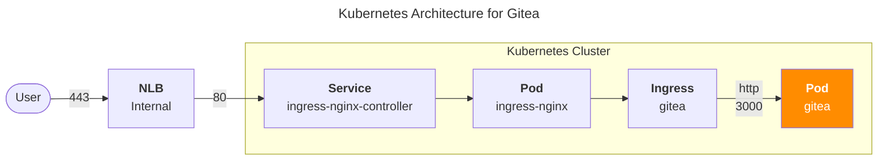

## 개요

ingress-nginx나 ALB와 같은 reverse proxy 뒤에서 서비스되는 Gitea에서 대용량 파일(12MB .tar.gz) 다운로드 중 Range Request 처리 과정에서 401 Unauthorized 오류가 발생하는 문제를 해결해보자. Kubernetes 환경에서 reverse proxy를 통해 서비스할 때 주로 발생한다.



## 환경

- EKS 1.32
- Amazon Linux 2023.8.20250721 (amd64) 
- Gitea app version 1.24.2 (by [helm install](https://gitea.com/gitea/helm-gitea))
- 앞단에 [ingress-nginx-controller](https://github.com/kubernetes/ingress-nginx)가 reverse proxy 서버 역할로 TLS Termination 후 Gitea 파드로 넘겨주는 구성임

## 증상

- 레포지터리의 릴리즈 페이지에서 다운로드 시 첫 번째 청크 다운로드는 정상 완료
- 후속 Range Request에서 "context canceled" 오류와 함께 401 Unauthorized 응답
- 작은 파일은 정상이지만 중간 크기 파일에서 간헐적 발생
- 브라우저나 wget에서 파일 다운로드 중단
- reverse proxy 로그에서 upstream 연결 오류 확인

### 실제 로그 패턴

**Pattern 1: Range Request 시퀀스**

```bash
2025-08-18T07:59:01.290779720Z gitea 2025/08/18 07:59:01 HTTPRequest [I] router: completed GET /OrgName/repo_name/releases/download/v1.0.35/build-artifacts-v1.0.35.tar.gz for 10.0.0.1:18329, 206 Partial Content in 192.5ms @ repo/repo.go:318(repo.RedirectDownload)
2025-08-18T07:59:01.320181025Z gitea 2025/08/18 07:59:01 services/auth/session.go:51:(*Session).Verify() [E] GetUserByID: context canceled
2025-08-18T07:59:01.320228848Z gitea 2025/08/18 07:59:01 routers/web/web.go:121:Routes.webAuth.10() [E] Failed to verify user: context canceled
2025-08-18T07:59:01.322235910Z gitea 2025/08/18 07:59:01 HTTPRequest [I] router: completed GET /OrgName/repo_name/releases/download/v1.0.35/build-artifacts-v1.0.35.tar.gz for 10.0.0.1:18329, 401 Unauthorized in 6.8ms @ web/web.go:118(web.Routes.webAuth)
```

**Pattern 2: 반복되는 Range Request 실패**

```bash
2025-08-18T07:59:12.250175593Z gitea 2025/08/18 07:59:12 HTTPRequest [I] router: completed GET /OrgName/repo_name/releases/download/v1.0.35/build-artifacts-v1.0.35.tar.gz for 10.0.0.2:57323, 206 Partial Content in 193.7ms @ repo/repo.go:318(repo.RedirectDownload)
2025-08-18T07:59:12.262348544Z gitea 2025/08/18 07:59:12 services/auth/session.go:51:(*Session).Verify() [E] GetUserByID: context canceled
2025-08-18T07:59:12.262387879Z gitea 2025/08/18 07:59:12 routers/web/web.go:121:Routes.webAuth.10() [E] Failed to verify user: context canceled
2025-08-18T07:59:12.264366790Z gitea 2025/08/18 07:59:12 HTTPRequest [I] router: completed GET /OrgName/repo_name/releases/download/v1.0.35/build-artifacts-v1.0.35.tar.gz for 10.0.0.2:57323, 401 Unauthorized in 6.8ms @ web/web.go:118(web.Routes.webAuth)
```

**Pattern 3: 브라우저 폴백으로 정상 다운로드 (200 OK)**

```bash
2025-08-18T08:03:06.000000000Z gitea 2025/08/18 08:03:06 HTTPRequest [I] router: completed GET /OrgName/repo_name/releases/download/v1.0.35/build-artifacts-v1.0.35.tar.gz for 10.0.0.1:46502, 200 OK in 1051.9ms @ repo/repo.go:318(repo.RedirectDownload)
2025-08-18T08:03:47.000000000Z gitea 2025/08/18 08:03:47 HTTPRequest [I] router: completed GET /OrgName/repo_name/releases/download/v1.0.35/build-artifacts-v1.0.35.tar.gz for 10.0.0.2:24190, 304 Not Modified in 193.4ms @ repo/repo.go:318(repo.RedirectDownload)
2025-08-18T08:04:33.000000000Z gitea 2025/08/18 08:04:33 HTTPRequest [I] router: completed GET /OrgName/repo_name/releases/download/v1.0.35/build-artifacts-v1.0.35.tar.gz for 10.0.0.2:24190, 304 Not Modified in 196.4ms @ repo/repo.go:318(repo.RedirectDownload)
```

## 원인

### 핵심 원인: ROOT_URL과 외부 도메인 불일치

Gitea 서버에 설정된 ROOT_URL이 실제 외부 접근 도메인과 달라서 발생하는 문제입니다. reverse proxy 환경에서 URL 불일치로 인해 세션 인증이 실패합니다.

1. **ROOT_URL 불일치**: Gitea 내부 설정과 외부 접근 URL이 다름
2. **쿠키 도메인 문제**: URL 불일치로 인한 세션 쿠키 검증 실패
3. **컨텍스트 상속 문제**: Range Request 처리 중 이전 요청의 취소된 컨텍스트를 상속받음
4. **세션 검증 실패**: 유효하지 않은 컨텍스트로 인해 인증 단계에서 실패

### Gitea 코드 레벨에서의 오류 발생 지점

Gitea 서버의 사용자 세션 검증 과정에서 오류가 발생합니다:

```go
// services/auth/session.go:51
user, err := user_model.GetUserByID(ctx, sess.Get("uid").(int64))
if err != nil {
    // Return the err as-is to keep current signed-in session, in case the err is something like context.Canceled
    if !user_model.IsErrUserNotExist(err) {
        log.Error("GetUserByID: %v", err)  // ← 여기서 "context canceled" 로그 출력
        return nil, err
    }
}
```

취소된 컨텍스트로 인해 `GetUserByID` 함수가 실패하고, 이로 인해 세션 인증이 실패하면서 Gitea 서버에서 401 Unauthorized 응답을 반환하게 됩니다.

## 해결방안

### 1. ROOT_URL 명시적 설정

ROOT_URL은 Gitea가 세션 쿠키 도메인과 리다이렉트 URL을 생성할 때 기준이 되는 설정이다. reverse proxy 환경에서는 내부 서비스 URL과 외부 접근 URL이 다르기 때문에 반드시 외부 도메인으로 설정해야 합니다. 일반적으로 외부 도메인 주소는 `https://`로 시작합니다.

`/data/gitea/config/app.ini` 설정 파일에서 reverse proxy를 통한 외부 접근 URL로 설정:

```ini
[server]
ROOT_URL = https://gitea.mydomain.com  # Fixed authentication
ENABLE_PPROF = false
SSH_PORT = 22
APP_DATA_PATH = /data
SSH_LISTEN_PORT = 2222
PROTOCOL = http
HTTP_PORT = 3000
START_SSH_SERVER = true
SSH_DOMAIN = gitea.mydomain.com
DOMAIN = gitea.mydomain.com
LOCAL_ROOT_URL = http://gitea-http:3000  # Internal service URL
```

**주의:** reverse proxy 뒤에서 HTTPS로 서비스되는 경우 반드시 `https://`를 사용해야 한다. `http://`로 설정하면 쿠키 보안 문제로 인해 인증이 실패할 수 있다.

설정값에 대한 정보는 [Gitea 설정 가이드](https://docs.gitea.com/administration/config-cheat-sheet) 공식문서를 참고합니다.

### 2. ingress-nginx 설정

도메인 일관성을 위한 Gitea의 Ingress 설정:

```yaml
apiVersion: networking.k8s.io/v1
kind: Ingress
metadata:
  name: gitea-ingress
  annotations:
    nginx.ingress.kubernetes.io/proxy-body-size: 20m
    nginx.ingress.kubernetes.io/rewrite-target: /
    nginx.ingress.kubernetes.io/service-upstream: "true"
    nginx.ingress.kubernetes.io/ssl-redirect: "false"
spec:
  ingressClassName: nginx
  rules:
  - host: gitea.mydomain.com
    http:
      paths:
      - path: /
        pathType: Prefix
        backend:
          service:
            name: gitea-service
            port:
              number: 3000
```

[proxy-body-size](https://kubernetes.github.io/ingress-nginx/user-guide/nginx-configuration/configmap/#proxy-body-size) 어노테이션은 사용자가 대용량 파일을 git push할 때 ingress-nginx에서 반환하는 [413 Request Entity Too Large](https://forum.gitea.com/t/unable-to-push-to-repo-due-to-rpc-failed-http-413-error/2630) 오류를 방지하기 위해 설정합니다.

Prometheus, Grafana, ArgoCD 등의 플랫폼 어플리케이션에서는 일반적으로 쓰이지 않지만, Gitea, Gitlab 등과 같은 버전 컨트롤 시스템(VCS)의 경우 종종 proxy-body-size 값의 조정이 필요합니다.

```yaml
# gitea ingress yaml
apiVersion: networking.k8s.io/v1
kind: Ingress
metadata:
  annotations:
    nginx.ingress.kubernetes.io/proxy-body-size: 20m
```

Gitea 사용자가 git push 시 413 오류가 발생할 때 ingress-nginx-controller의 로그:

```bash
ingress-nginx-controller-658f97b9-nmdhv 10.0.0.1 - myuser [08/Apr/2025:03:03:49 +0000] "POST /myorg/myproject.git/git-receive-pack HTTP/1.1" 413 176 "-" "git/2.39.5 (Apple Git-154)" 342 0.011 [-] [] - - - - 026e792367403bbde97773f518207359
ingress-nginx-controller-658f97b9-shrw4 10.0.0.1 - myuser [08/Apr/2025:03:05:38 +0000] "POST /myorg/myproject2.git/git-receive-pack HTTP/1.1" 413 176 "-" "git/2.39.5 (Apple Git-154)" 329 0.015 [-] [] - - - - 3396d0c5666f82bb8497daab95a3ac22
```

### 3. 설정 적용

Gitea 컨테이너 재시작:

```bash
kubectl rollout restart deployment/gitea --namespace gitea
```

### 4. 문제 해결 확인

Gitea 파드에 ROOT_URL 설정 후, Release 페이지에서 대용량 파일(.tar.gz) 다운로드 시 Range Request 오류가 해결되었습니다. 이제 첫 번째 청크부터 마지막 청크까지 정상적으로 다운로드되며, Gitea 파드에서 401 Unauthorized 오류나 "context canceled" 로그가 더 이상 발생하지 않습니다.

## 관련자료 

- [[Bug] Range Request failure causes context canceled errors during tar.gz downloads #35302](https://github.com/go-gitea/gitea/issues/35302): Github Issue
- [Gitea Configuration Cheat Sheet](https://docs.gitea.io/en-us/config-cheat-sheet/): Gitea docs
- [ingress-nginx Configuration](https://kubernetes.github.io/ingress-nginx/user-guide/nginx-configuration/): Ingress-nginx docs
- [HTTP Range Requests - MDN](https://developer.mozilla.org/en-US/docs/Web/HTTP/Range_requests)
