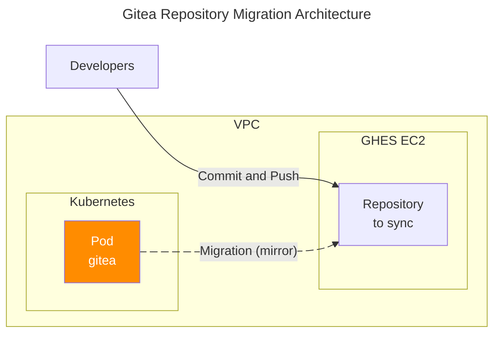

## 개요

Gitea에서 외부 저장소를 미러링할 때 발생하는 도메인 허용 설정 오류를 해결하는 방법을 다룹니다. ALLOWED_DOMAINS 설정을 통해 특정 호스트에서 레포지토리를 가져올 수 있도록 허용하는 과정을 설명합니다.



## 환경

- Kubernetes 1.32
- Gitea 1.23.8
- Github Enterprise Server 3.13 (self-hosted on EC2)

## 설정 방법

GHES에 저장된 레포를 Gitea에서 10분 간격으로 미러 싱크해서 가져와야 하는 요구사항이 있었습니다.

Gitea에는 빌트인 [마이그레이션(미러링) 기능](https://docs.gitea.com/next/usage/migration)이 있습니다. 단, 동기화 간격은 최소 10분으로 제한되며 그보다 짧은 간격으로는 설정할 수 없습니다.

아래와 같이 `/repo/migrate` URL로 접근하면 쉽게 미러링 구성을 할 수 있습니다.

```bash
https://gitea.example.com/repo/migrate
```

GHES의 레포를 풀링해오는 미러링(Migration) 구성시 발생하는 에러 메세지:

```
You cannot import from disallowed hosts, please ask the admin to check ALLOWED_DOMAINS/ALLOW_LOCALNETWORKS/BLOCKED_DOMAINS settings.
```

이 에러는 Gitea v1.22.0부터 보고된 버그([#31733](https://github.com/go-gitea/gitea/issues/31733))로, 외부 호스트에서의 저장소 마이그레이션이 기본적으로 차단되기 때문입니다. 이전 버전(v1.21.4)에서는 문제가 없었지만, v1.22.0부터는 명시적으로 `ALLOWED_DOMAINS` 설정이 필요합니다.

참고: 

gitea 차트 설정:

```yaml
# helm/gitea/values_example.yaml
gitea:
  config:
    migrations:
      ALLOWED_LOCALNETWORKS: "true"
      ALLOWED_DOMAINS: "*" 
```

실제 gitea 파드의 설정파일에 반영된 Gitea 세부 설정:

```ini
# cat /data/gitea/conf/app.ini
[migrations]
ALLOWED_LOCALNETWORKS = true
ALLOWED_DOMAINS = *
```

## 관련자료

- [Gitea Migration Documentation](https://docs.gitea.com/next/usage/migration)
- [Gitea Issue #31733](https://github.com/go-gitea/gitea/issues/31733)
