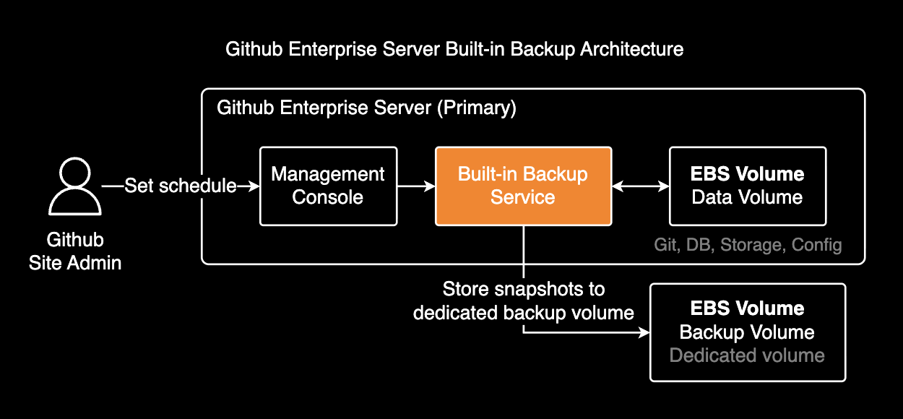
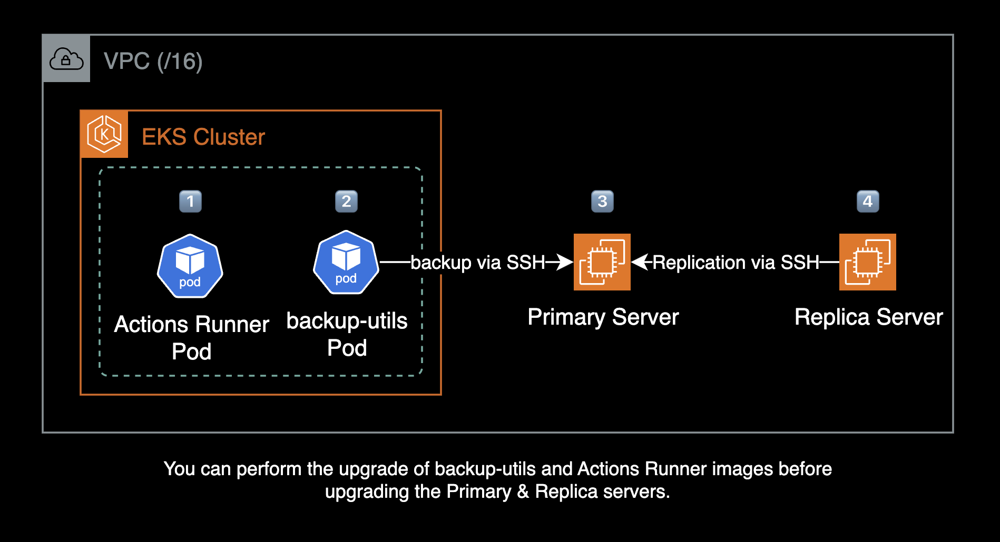

## Overview

GitHub Enterprise Server를 v3.15.13에서 v3.17.7로 버전 업그레이드하는 작업 절차입니다.

이 문서는 GitHub 공식 문서의 [Upgrading with an upgrade package](https://docs.github.com/en/enterprise-server@latest/admin/upgrading-your-instance/performing-an-upgrade/upgrading-with-an-upgrade-package)를 기반으로 작성되었습니다.

### Version Changes

- **Github Enterprise Server**: v3.15.13 → v3.17.7
- **Actions Runner**: v2.329.0 (유지)
- **Backup Utilities**: v3.15.4 → 제거 (내장 백업 서비스 사용 권장)

## Release Information

| Version | Release Date | Deprecation Date |
|---------|-------------|------------------|
| 3.17    | 2025-06-03  | 2026-08-25       |
| 3.16    | 2025-03-11  | 2026-06-02       |
| 3.15    | 2024-12-03  | 2026-03-17       |

자세한 릴리즈 정보는 [GitHub Enterprise Server releases](https://docs.github.com/en/enterprise-server/admin/all-releases) 공식문서를 참고하세요.

## Pre-Upgrade Checklist

### GitHub Enterprise Server Version

GitHub Enterprise Server는 최대 x+2 버전까지만 업그레이드할 수 있습니다. 즉, 현재 버전에서 최대 2단계 앞선 버전으로만 직접 업그레이드가 가능합니다. 예를 들어 3.15에서 3.17로는 직접 업그레이드할 수 있지만, 3.15에서 3.18로는 직접 업그레이드할 수 없습니다.

자세한 업그레이드 요구사항은 [Upgrade requirements](https://docs.github.com/en/enterprise-server/admin/upgrading-your-instance/preparing-to-upgrade/upgrade-requirements) 공식문서를 참고하세요.

### GitHub Actions Runner Compatibility

GitHub Enterprise Server는 self-hosted runner만 지원하며, github-hosted runner는 사용할 수 없습니다. GHES 버전별로 최소 요구되는 GitHub Actions Runner 버전이 존재하므로, 업그레이드 시 현재 사용 중인 Runner 버전이 업그레이드할 GHES 버전의 최소 요구사항을 충족하는지 확인해야 합니다.

| GHES Version | Minimum Runner | Current Version | Status |
|--------------|---------------|-----------------|--------|
| 3.17         | 2.322.0       | 2.329.0         | 안전함   |
| 3.15         | 2.319.1       | 2.329.0         | 안전함   |

self-hosted runner도 GHES 업그레이드와 함께 최소 권장 버전에 맞게 업그레이드해야 합니다.

관련 자료: [Minimum GitHub Actions Runner application versions](https://docs.github.com/en/enterprise-server/admin/all-releases#minimum-github-actions-runner-application-versions)

### Backup Utilities Version

GitHub Enterprise Server 3.17부터 서버 내부에 [Built-in Backup Service](https://docs.github.com/en/enterprise-server@latest/admin/backing-up-and-restoring-your-instance/backup-service-for-github-enterprise-server/about-the-backup-service-for-github-enterprise-server)가 Preview Feature로 포함되었습니다. 별도의 backup-utils 배포 없이 GHES 서버 자체적으로 백업을 수행할 수 있게 되었으며, 이 방식을 권장합니다.



backup-utils와 같은 외부 서버 의존 없이 GHES 서버 자체가 내장 백업 서비스(built-in backup service)로 백업을 수행할 수 있으므로, backup-utils를 내장 백업 서비스로 대체하는 것을 권장합니다. backup-utils는 향후 릴리즈에서 deprecated될 수 있습니다.

기존 backup-utils를 사용하는 경우:
- GitHub Enterprise Server Backup Utilities 버전은 GHES 인스턴스 버전과 동일하거나 최대 두 버전 앞서야 합니다
- backup-utils 3.17 버전은 GHES 3.15, 3.16, 3.17 버전을 지원합니다

관련 자료: [About the Backup Service for GitHub Enterprise Server](https://docs.github.com/en/enterprise-server@latest/admin/backing-up-and-restoring-your-instance/backup-service-for-github-enterprise-server/about-the-backup-service-for-github-enterprise-server)

## Upgrade Procedure

### Architecture Overview

각 인프라 컴포넌트별 버전 업그레이드 진행 순서는 다음과 같습니다.



**권장 업그레이드 순서:**

1. Backup Server (backup-utils) - 선행 작업
2. Actions Runner - 선행 작업
3. Primary Server
4. Replica Server

Backup Server와 Actions Runner는 Primary 서버보다 높은 버전을 사용해도 호환성에 문제가 없기 때문에 먼저 업그레이드를 진행하는 것을 권장합니다. 이를 통해 전체 업그레이드 작업 시간을 단축할 수 있습니다.

## Backup Server (backup-utils)

backup-utils는 GHES 서버보다 높은 버전을 사용해도 호환성에 문제가 없습니다(x+2까지 지원). 따라서 백업 서버를 먼저 업그레이드한 후 Primary 서버를 업그레이드하는 것을 권장합니다.

이 가이드에서는 [backup-utils Helm 차트](https://github.com/younsl/charts/tree/main/charts/backup-utils) (`ghcr.io/younsl/charts/backup-utils`)를 사용합니다.

사용 가능한 차트 버전 목록을 확인합니다:

```bash
crane ls ghcr.io/younsl/charts/backup-utils
```

### 1. Upload Container Image

GitHub 백업서버(backup-utils)의 컨테이너 이미지를 빌드 후 업로드하기 위해 CI 파이프라인을 실행합니다.

GitHub Actions를 사용한 backup-utils 이미지의 CI 파이프라인 예시는 [release-backup-utils.yml](https://github.com/younsl/o/blob/main/.github/workflows/release-backup-utils.yml)을 참고하세요.

### 2. Update Chart

백업 서버 차트의 `image.tag` 값을 3.15.4에서 3.17.2로 업그레이드합니다:

```yaml
# helm/backup-utils/values.yaml
backupUtils:
  suspend: false
  image:
    repository: 123456789012.dkr.ecr.ap-northeast-2.amazonaws.com/github-backup-utils
    tag: 3.17.2
```

**참고**: 차트에서 `suspend: false`로 설정해야 CronJob의 스케줄링이 동작합니다.

이후 ArgoCD Autosync에 의해 CronJob 파드가 자동 배포됩니다.

### 3. Monitor Backup Status

CronJob 파드가 complete 되는지 kubectl로 파드 로그를 모니터링합니다.

## Primary Server Upgrade

### 1. Enable Maintenance Mode

Primary 서버를 유지 관리 모드로 전환합니다:

```bash
# Primary server
ghe-maintenance --query
ghe-maintenance --set
```

**중요**: 모든 활성 프로세스가 완료될 때까지 대기해야 합니다.

Management Console의 Maintenance 탭에서도 유지관리 모드를 설정할 수 있습니다.

### 2. Stop Replication on Replica

Replica 서버에서 데이터 복제를 중지합니다:

```bash
# Replica server
ghe-repl-stop
ghe-repl-status
```

- `ghe-repl-status`로 모든 replication 상태가 OK인지 확인 후 진행
- `ghe-repl-stop`은 총 4단계에 걸쳐 진행되며, 완료까지 약 10~15분 소요

### 3. Upgrade Primary Server

Management Console에서 자동 업데이트를 활성화한 경우, `.pkg` 파일이 `/var/lib/ghe-updates/` 경로에 자동으로 다운로드됩니다. 자동으로 다운로드되지 않은 경우, 직접 다운로드할 수 있습니다:

```bash
# Primary server

# .pkg 파일이 없는 경우 직접 다운로드
sudo curl -O -L \
  https://github-enterprise.s3.amazonaws.com/ami/updates/github-enterprise-ami-3.17.7.pkg

# 이미지(.pkg) 파일 확인
ls -lh /var/lib/ghe-updates/
```

`.pkg` 파일을 사용해서 업그레이드를 실행합니다:

```bash
# Primary server
ghe-upgrade /var/lib/ghe-updates/github-enterprise-ami-3.17.7.pkg
```

업그레이드할 버전이 맞는지 확인한 후, 일치하면 `y` 키를 눌러 버전 업그레이드를 실행합니다:

```
*** applying update...
This package will upgrade your installation to version VERSION-NUMBER
Current root partition: /dev/xvda1 [VERSION-NUMBER]
Target root partition: /dev/xvda2
Proceed with installation? [y/N]
```

**루트 볼륨 파티션 구조:**

GHES는 업그레이드 시 루트 볼륨을 2개의 파티션으로 나누어 사용합니다. `/dev/xvda1`에 구 버전이 실행 중이고, `/dev/xvda2`에 새 버전을 설치한 후 재부팅하면서 파티션이 교체됩니다. 이러한 이중 파티션 구조로 인해 400GB 루트 볼륨도 실제 사용 가능한 용량은 약 200GB입니다.

파티션 구조 확인:

```bash
lsblk
```

```
NAME    MAJ:MIN RM  SIZE RO TYPE MOUNTPOINT
xvda    202:0    0  400G  0 disk
├─xvda1 202:1    0  200G  0 part /          (현재 버전)
└─xvda2 202:2    0  200G  0 part            (업그레이드 대상)
xvdb    202:16   0  200G  0 disk /data
```

- 약 30~40분 소요
- 이 과정에서 EC2의 자동 리부팅이 발생합니다

### 4. Monitor Upgrade Progress

Feature 릴리즈로 업그레이드하는 동안 데이터베이스 마이그레이션 상태를 모니터링:

```bash
# Primary server
ghe-migrations
```

백그라운드 프로세스 작업 상태 확인:

```bash
# Primary server
ghe-check-background-upgrade-jobs
```

Configuration 재시작 과정을 모니터링합니다. `ghe-config.log`는 GHES 서버의 설정 적용 및 재시작 과정을 기록하는 로그 파일입니다:

```bash
# Primary server
tail -f /data/user/common/ghe-config.log
```

**중요**: 인스턴스가 다시 시작된 후 업그레이드 작업은 백그라운드 환경에서 계속됩니다. 백그라운드 프로세스가 완료될 때까지 유지보수 모드를 해제할 수 없습니다.

## Replica Server Upgrade

**주의**: Primary가 온전히 올라온 상태에서만 Replica의 `ghe-upgrade`가 정상 동작합니다. HA 구성인 경우, Replica 서버의 버전 업그레이드가 완료될 때까지 Primary 서버의 유지보수 모드를 계속 유지해야 합니다.

### 1. Download Upgrade Package

Replica는 AMI 이미지를 자동 다운로드 받지 못하므로, 직접 GitHub Enterprise Server 포털로부터 3.17.7 버전의 AMI 파일을 다운로드합니다:

```bash
# Replica server

# 업그레이드 패키지 다운로드
sudo curl -O -L \
  https://github-enterprise.s3.amazonaws.com/ami/updates/github-enterprise-ami-3.17.7.pkg

# 다운로드한 이미지(.pkg) 파일 확인
ls -lh /var/lib/ghe-updates/
```

**팁**: `.pkg` 파일 용량이 13GB가 넘기 때문에, 작업 시간 단축을 위해 실제 작업일 이전에 미리 Replica 서버에 `.pkg` 파일을 다운로드 받아두는 것이 좋습니다.

### 2. Upgrade Replica Server

Replica 서버에서 업그레이드를 실행합니다:

```bash
# Replica server
ghe-upgrade /var/lib/ghe-updates/github-enterprise-ami-3.17.7.pkg
```

- 약 30~40분 소요
- 이 과정에서 EC2의 자동 리부팅이 발생합니다

### 3. Monitor Upgrade Progress

데이터베이스 마이그레이션 및 설정 재시작 과정을 모니터링합니다:

```bash
# Replica server
ghe-migrations
tail -f /data/user/common/ghe-config.log
```

### 4. Verify Version

업그레이드된 버전을 확인합니다:

```bash
# Replica server
ghe-version
```

새 GitHub Enterprise Server 버전으로 출력되는지 확인합니다.

### 5. Start Replication

중지했던 데이터 복제를 다시 시작합니다:

```bash
# Replica server
ghe-repl-start
```

### 6. Check Replication Status

복제 상태를 확인합니다:

```bash
# Replica server
ghe-repl-status
```

성공적으로 복제가 진행중인 경우에는 모든 서비스에 대해 `OK`를 반환합니다.

### 7. Disable Maintenance Mode

모든 Replica 서버의 `ghe-repl-status` 결과가 모두 정상임을 확인한 다음, Primary 서버의 유지보수 모드를 해제합니다:

```bash
# Primary server

# 유지보수 모드 해제
ghe-maintenance --unset

# 유지보수 모드 상태 확인
ghe-maintenance --query
```

## Post-Upgrade Tasks

### NTP (chrony) Configuration

**중요**: GitHub Enterprise Server가 Jira Cloud와 App으로 연동되어 있는 경우, Jira Cloud API 서버와 GHES 간의 NTP 동기화된 시간차가 1분 이상 벌어지면 401 에러와 함께 PR, Issue 등이 이슈에 동기화(등록)되지 않는 영향이 있으므로 NTP 설정을 반드시 적용해야 합니다.

GHES는 NTP 데몬으로 ntpd가 아닌 chrony를 사용합니다. 따라서 NTP 관련 명령어는 chronyc를 사용해야 합니다.

NTP 설정은 Management Console에서 가능하며, Primary 서버에서 설정시 복제(Replication) 연결되어 있는 Replica 서버도 자동 설정이 반영되며 동기화됩니다.

Management Console의 NTP 설정 이후에도 시간차가 많이 난 상태로 유지되는 경우, 수동으로 NTP 동기화를 수행할 수 있습니다.

NTP 서버와 강제 동기화를 수행합니다. `makestep` 명령어는 시스템 시계를 즉시 조정하여 NTP 서버와 동기화합니다:

```bash
sudo chronyc makestep
```

NTP 소스 상태를 확인합니다:

```bash
$ chronyc sources -v
210 Number of sources = 2

  .-- Source mode  '^' = server, '=' = peer, '#' = local clock.
 / .- Source state '*' = current synced, '+' = combined , '-' = not combined,
| /   '?' = unreachable, 'x' = time may be in error, '~' = time too variable.
||                                                 .- xxxx [ yyyy ] +/- zzzz
||      Reachability register (octal) -.           |  xxxx = adjusted offset,
||      Log2(Polling interval) --.      |          |  yyyy = measured offset,
||                                \     |          |  zzzz = estimated error.
||                                 |    |           \
MS Name/IP address         Stratum Poll Reach LastRx Last sample
===============================================================================
^* 169.254.169.123               3  10   377   942  +6459ns[+7430ns] +/-  155us
^? 175.210.18.47                 0  10     0     -     +0ns[   +0ns] +/-    0n
```

정상적으로 동기화된 경우 NTP 서버 앞에 `^*` (현재 동기화 중) 상태로 표시됩니다.

## Troubleshooting

### Elasticsearch Migration Warning

Primary 업그레이드 진행중에 무시하고 Replica 서버 업그레이드를 실행할 경우, Elasticsearch migration 과정에 의해 거부됩니다.

```
Warning! There are Elasticsearch migrations in progress. Check here for more details.
```

반드시 Primary 서버 업그레이드 완료 후 Replica를 진행해야 합니다.

## Timeline

- 각 단계별 예상 소요 시간
  - Replication 중지: 10~15분
  - Primary 업그레이드: 30~40분
  - Replica 업그레이드: 30~40분
  - 전체 작업 시간: 약 1.5~2시간

## References

- [GitHub Enterprise Server releases](https://docs.github.com/en/enterprise-server@3.17/admin/overview/about-upgrades-to-new-releases)
- [Upgrading GitHub Enterprise Server](https://docs.github.com/en/enterprise-server@latest/admin/upgrading-your-instance/performing-an-upgrade/upgrading-with-an-upgrade-package)
- [Taking a snapshot](https://docs.github.com/en/enterprise-server@3.17/admin/backing-up-and-restoring-your-instance/configuring-backups-on-your-instance)
- [Configuring time synchronization](https://docs.github.com/en/enterprise-server@3.17/admin/configuring-settings/configuring-time-synchronization)
- [Restoring from a backup](https://docs.github.com/en/enterprise-server@3.17/admin/backing-up-and-restoring-your-instance/restoring-your-instance-from-a-backup)
