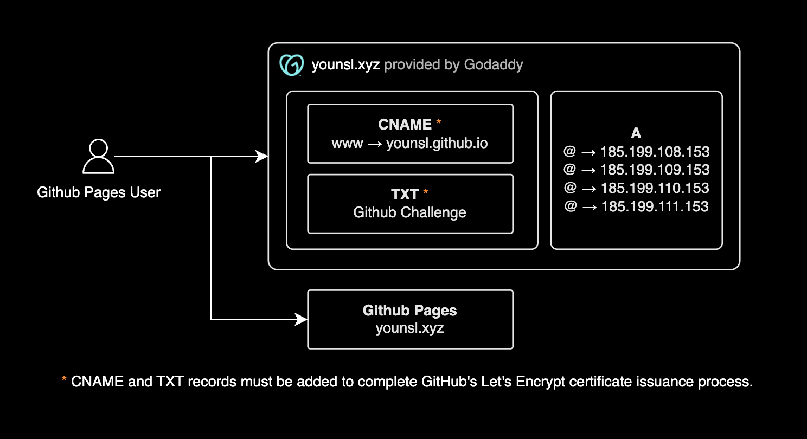

## 개요

[Godaddy](https://godaddy.com/)에서 구매한 커스텀 도메인을 Github Pages에 연결하는 방법을 설명합니다.



&nbsp;

## 설정 방법

### 1. GoDaddy에서 도메인 구매

당연히 Godaddy에서 먼저 사용할 도메인을 구매해야 합니다. 가능하면 마케팅 + 웹사이트 상품을 선택하지 마세요. (이미 무료 체험을 선택했다면 괜찮습니다.)

저는 요즘 엔지니어들 사이에서 트렌디하고 힙한 제 깃헙 닉네임이 포함된 .xyz 도메인을 구매했습니다. .com, .net, .org 등 기존의 올드스쿨 도메인 확장자들도 있지만, 최근 엔지니어들 사이에서는 .xyz 도메인이 인기입니다. 구글의 모회사 [alphabet](https://abc.xyz/)도 이 도메인을 사용하고 있습니다.

&nbsp;

### 2. Godday에 레코드 추가

#### A 레코드

[GitHub Pages 사이트의 사용자 지정 도메인 관리](https://docs.github.com/ko/pages/configuring-a-custom-domain-for-your-github-pages-site/managing-a-custom-domain-for-your-github-pages-site) 페이지를 참고하여 A 레코드를 4개 추가합니다.

```bash
dig +short younsl.github.io
```

```bash
185.199.108.153
185.199.109.153
185.199.111.153
185.199.110.153
```

```bash
Type   Name  Value           TTL
A      @    185.199.108.153  600
A      @    185.199.109.153  600
A      @    185.199.111.153  600
A      @    185.199.110.153  600
```

&nbsp;

#### CNAME 레코드

CNAME 레코드를 추가합니다. [Github Pages에서 HTTPS](https://docs.github.com/ko/pages/configuring-a-custom-domain-for-your-github-pages-site/troubleshooting-custom-domains-and-github-pages#https-errors)를 적용하려면 `www`에 대한 CNAME 레코드를 추가해야, Github 측에서 새 커스텀 도메인에 대한 Let's Encrypt 인증서를 발급할 수 있습니다.

```bash
Type   Name  Value             TTL
CNAME  www   younsl.github.io  600
```

> 가장 중요한 부분: GoDaddy에서 이미 `www`를 기본으로 차지하고 있을 수 있습니다. 이 경우, 웹사이트를 비공개(언퍼블리시) 처리한 후 기존 CNAME 레코드를 삭제하고 github.io로 끝나는 값으로 변경하세요.

&nbsp;

### 3. Github 설정 변경

- GitHub 사용자 설정 → Pages에서 도메인 추가(Add Domain) 버튼을 클릭합니다.
- 이 링크에 따라 TXT 레코드를 GoDaddy DNS 설정에 추가하여 도메인 소유권을 인증합니다.

username.github.io 저장소의 설정(Settings) → Pages에서 Custom domain 항목에 구매한 도메인을 입력합니다. (예: younsl.xyz)

&nbsp;

### 4. 설정 확인 및 완료

DNS 설정이 올바르게 되었다면, TLS 인증 상태(TLS provision status)와 "DNS check successful" 메시지가 표시됩니다.

A 레코드 적용 확인:

```bash
dig younsl.xyz +nostats +nocomments +nocmd
```

```bash
; <<>> DiG 9.10.6 <<>> younsl.xyz +nostats +nocomments +nocmd
;; global options: +cmd
;younsl.xyz.                    IN      A
younsl.xyz.             600     IN      A       185.199.111.153
younsl.xyz.             600     IN      A       185.199.110.153
younsl.xyz.             600     IN      A       185.199.108.153
younsl.xyz.             600     IN      A       185.199.109.153
```

HTTPS 적용을 위한 CNAME 레코드 적용 확인:

```bash
dig CNAME www.younsl.xyz +nostats +nocomments +nocmd
```

```bash
; <<>> DiG 9.10.6 <<>> CNAME www.younsl.xyz +nostats +nocomments +nocmd
;; global options: +cmd
;www.younsl.xyz.                        IN      CNAME
www.younsl.xyz.         583     IN      CNAME   younsl.github.io.
```

&nbsp;

## 주의사항

### Godaddy 웹사이트 서비스와 DNS 설정시 주의사항

Godday에서 DNS 주소를 구매하면 자동으로 활성화되어 있는 기본 웹사이트 서비스인 websitebuilder.com이 있기 때문에 설정이 조금 복잡하고 혼란이 올 수 있습니다. 개인적으로 이 기본 웹사이트 서비스가 왜 있는지 모르겠습니다. DNS 서비스만 제공받고 싶은데요.

- GoDaddy의 기본 웹사이트 서비스인 websitebuilder.com이 자동으로 활성화되어 있을 수 있습니다.
- CNAME 타입의 www 레코드에 기본적으로 등록해주는 younsl.xyz 같은 값이 남아 있다면 삭제 후 USERNAME.github.io로 변경하세요.
- 무료 체험판(Website + Marketing) 패키지를 사용 중이라면, 해당 서비스가 APEX 레코드인 @에 기본값으로 설정되었을 가능성이 있습니다.
- APEX 레코드(@)에 4개의 IP 주소 외에 다른 값이 있는 경우(Go Daddy에서 기본 제공하는 웹사이트의 공인 IP 주소 등), 해당 값을 삭제하세요. 이러한 다른 값이 있는 경우 HTTPS 적용을 위한 인증이 실패하게 됩니다.