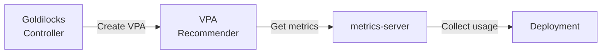
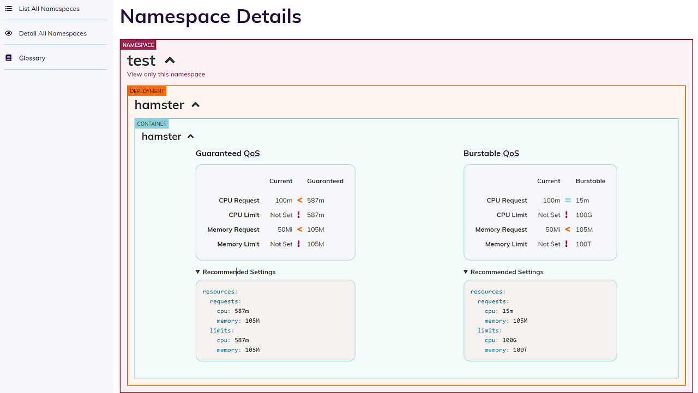

## Overview

Goldilocks is a tool that helps you find the right CPU and memory for your pods. It uses the VPA (Vertical Pod Autoscaler) recommender to show you what resources your workloads really need.

The name comes from the fairy tale "Goldilocks and the Three Bears" - not too much, not too little, but just right.

## Why use Goldilocks

Setting pod resources is hard. If you set too low, your app crashes. If you set too high, you waste money.

Goldilocks solves this problem:

| Problem | How Goldilocks helps |
|---------|---------------------|
| OOMKilled pods | Shows memory you actually need |
| CPU throttling | Shows CPU you actually need |
| Wasted resources | Finds over-provisioned pods |
| Guessing game | Gives data-based suggestions |

## How it works

Goldilocks has two parts:

1. **Controller** - Watches namespaces with a special label. Creates VPA objects in recommendation mode.
2. **Dashboard** - Shows all VPA recommendations in a web UI.

The VPA recommender watches your pods and collects metrics. After some time, it gives you CPU and memory suggestions based on real usage.



Goldilocks is installed via [goldilocks](https://github.com/FairwindsOps/charts/tree/master/stable/goldilocks) chart, and VPA is installed via [vpa](https://github.com/FairwindsOps/charts/tree/master/stable/vpa) chart. Both charts are from Fairwinds.

## Prerequisites

Before you install Goldilocks, you need:

- Kubernetes cluster v1.21+
- Helm v3+
- metrics-server installed (VPA Recommender needs this to collect CPU and memory usage)

## Install

VPA is included as a subchart of Goldilocks. You can install both with a single Helm release.

Installed charts:

- **goldilocks**: Main chart (controller + dashboard)
- **vpa**: Subchart (recommender only)

```bash
helm repo add fairwinds-stable https://charts.fairwinds.com/stable
helm repo update
```

### Checkpoint mode (default)

Stores recommendation data in memory. Simple setup but has limitations:

- Max 8 days of history
- Data lost on VPA Recommender pod restart
- Recommendations reset after cluster upgrade

```yaml
# values.yaml
vpa:
  enabled: true
  recommender:
    extraArgs:
      v: "4"
      storage: checkpoint
      pod-recommendation-min-cpu-millicores: 15
      pod-recommendation-min-memory-mb: 100
  updater:
    enabled: false
  admissionController:
    enabled: false
```

### Prometheus mode (recommended)

Uses Prometheus as history provider. Better for production:

- Data survives pod restarts
- History length follows Prometheus retention setting (not limited to 8 days)
- Better recommendations for workloads with weekly patterns
- Recommendations available immediately after cluster upgrade

```yaml
# values.yaml
vpa:
  enabled: true
  recommender:
    extraArgs:
      v: "4"
      storage: prometheus
      prometheus-address: http://kube-prometheus-stack-prometheus.monitoring.svc.cluster.local:9090
      pod-recommendation-min-cpu-millicores: 15
      pod-recommendation-min-memory-mb: 100
  updater:
    enabled: false
  admissionController:
    enabled: false
```

### Run install

Install Goldilocks with VPA subchart:

```bash
helm install goldilocks fairwinds-stable/goldilocks \
  --namespace goldilocks \
  --create-namespace \
  -f values.yaml
```

Check if pods are running:

```bash
kubectl get pods -n goldilocks
```

```bash
NAME                                        READY   STATUS    RESTARTS   AGE
goldilocks-controller-xxxxx-xxxxx           1/1     Running   0          1m
goldilocks-dashboard-xxxxx-xxxxx            1/1     Running   0          1m
goldilocks-vpa-recommender-xxxxx-xxxxx      1/1     Running   0          1m
```

### VPA Recommender storage mode

VPA Recommender has two storage modes:

- **checkpoint** (default): Stores data in memory.
- **prometheus**: Uses Prometheus as history provider.

By default, VPA Recommender uses `checkpoint` mode. ⚠️ This mode has some data retention limits:

- **Max 8 days**: VPA Recommender only keeps up to 8 days of historical data.
- **Data loss on restart**: If the VPA Recommender pod restarts, all collected data is lost. It starts collecting from zero again.

This means your recommendations may be inaccurate right after a VPA Recommender pod restart or cluster upgrade.

For production, use `prometheus` mode:

- Data survives VPA Recommender pod restarts
- Longer history than 8 days
- Better recommendations for workloads with weekly patterns
- Recommendations available right after cluster upgrade

To use `prometheus` mode, set the following in your Helm values. This stores history in Prometheus:

```yaml
# values.yaml for Fairwinds VPA chart
recommender:
  extraArgs:
    v: "4"
    storage: prometheus
    prometheus-address: http://prometheus.monitoring.svc:9090
    history-length: 30d
    pod-recommendation-min-cpu-millicores: 15
    pod-recommendation-min-memory-mb: 100
```

For all available flags, see [VPA flags.md](https://github.com/kubernetes/autoscaler/blob/master/vertical-pod-autoscaler/docs/flags.md). Key flags and defaults:

- `--v`: 4 (log level verbosity)
- `--storage`: checkpoint
- `--prometheus-address`: http://prometheus.monitoring.svc
- `--prometheus-cadvisor-job-name`: kubernetes-cadvisor
- `--history-length`: 8d
- `--history-resolution`: 1h
- `--pod-recommendation-min-cpu-millicores`: 25
- `--pod-recommendation-min-memory-mb`: 250
- `--recommendation-margin-fraction`: 0.15
- `--target-cpu-percentile`: 0.9
- `--target-memory-percentile`: 0.9

## Enable namespace

Goldilocks only watches namespaces with the `goldilocks.fairwinds.com/enabled=true` label. This is the default behavior controlled by the Helm chart.

Add this label to namespaces you want to observe:

```bash
kubectl label namespace <your-namespace> goldilocks.fairwinds.com/enabled=true
```

For example:

```bash
kubectl label namespace default goldilocks.fairwinds.com/enabled=true
```

This gives you full control over which namespaces Goldilocks watches. It prevents VPA objects from being created in system namespaces like `kube-system` or namespaces that don't need resource tuning.

### Auto-created VPA objects

After you enable a namespace, Goldilocks controller automatically creates VPA objects for all Deployments in that namespace.

The flow is:

1. You label a namespace with `goldilocks.fairwinds.com/enabled=true`
2. Goldilocks controller detects the label
3. Controller creates VPA objects in **recommendation mode** for each Deployment
4. VPA recommender collects metrics and generates suggestions
5. Goldilocks dashboard shows the recommendations

The VPA objects Goldilocks creates look like this:

```yaml
apiVersion: autoscaling.k8s.io/v1
kind: VerticalPodAutoscaler
metadata:
  name: goldilocks-<deployment-name>
  namespace: <your-namespace>
spec:
  targetRef:
    apiVersion: apps/v1
    kind: Deployment
    name: <deployment-name>
  updatePolicy:
    updateMode: "Off"  # Recommendation only, no auto-update
```

`updateMode: "Off"` means VPA only gives recommendations. It does not change your pod resources automatically.

Check created VPA objects:

```bash
kubectl get vpa -n <your-namespace>
```

## Access dashboard

Open the Goldilocks dashboard:

```bash
kubectl port-forward -n goldilocks svc/goldilocks-dashboard 8080:80
```

Now go to `http://localhost:8080` in your browser.



The dashboard shows:

- Current resource requests and limits
- Lower bound (minimum needed)
- Target (recommended)
- Upper bound (maximum needed)
- Uncapped target (if no limits)

## Read recommendations

The dashboard shows different QoS (Quality of Service) classes:

| QoS Class | Description |
|-----------|-------------|
| Guaranteed | requests = limits (most stable) |
| Burstable | requests < limits (good balance) |

For each class, you see CPU and memory suggestions:

- **Lower Bound** - Minimum resources. Below this, your app may fail.
- **Target** - Best value. Use this for most cases.
- **Upper Bound** - Maximum peak usage seen.

## Example output

Here is what you might see:

```yaml
# Current
resources:
  requests:
    cpu: 100m
    memory: 128Mi
  limits:
    cpu: 500m
    memory: 512Mi

# Goldilocks recommendation (Target)
resources:
  requests:
    cpu: 25m
    memory: 64Mi
  limits:
    cpu: 25m
    memory: 64Mi
```

In this case, the pod was over-provisioned. Goldilocks found it only needs 25m CPU and 64Mi memory.

## Best practices

- Wait at least 24 hours before using recommendations. VPA needs time to see real usage patterns.
- Check recommendations during peak hours. Make sure the target can handle traffic spikes.
- Start with non-critical workloads. Test recommendations before applying to production.
- Review regularly. Usage patterns change over time.
- Avoid setting CPU limits. CPU limits cause throttling even when there is free CPU on the node. This hurts performance. Set CPU requests only and let pods burst when needed.

## Troubleshooting

### VPA objects not created

Check if the namespace has the correct label:

```bash
kubectl get namespace <your-namespace> --show-labels
```

Check Goldilocks controller logs:

```bash
kubectl logs -n goldilocks -l app.kubernetes.io/name=goldilocks,app.kubernetes.io/component=controller
```

### No recommendations showing

VPA needs time to collect data. Wait a few hours and check again.

Make sure metrics-server is working:

```bash
kubectl top pods -n <your-namespace>
```

### Dashboard not loading

Check if the dashboard pod is running:

```bash
kubectl get pods -n goldilocks -l app.kubernetes.io/component=dashboard
```

## Clean up

To remove Goldilocks and VPA:

```bash
helm uninstall goldilocks -n goldilocks
kubectl delete namespace goldilocks
```

Remove labels from namespaces.

```bash
kubectl label namespace <your-namespace> goldilocks.fairwinds.com/enabled-
```

If Goldilocks is still running, removing the label triggers automatic deletion of VPA objects in that namespace.

## Summary

Goldilocks + VPA Recommender helps you with resource right-sizing and cost optimization:

- Find the right CPU and memory for your pods
- Save money by removing over-provisioned resources
- Avoid OOMKilled and throttling issues
- Make data-based decisions instead of guessing

Start with one namespace, review the recommendations, and apply changes step by step.

## Related links

- [Goldilocks GitHub](https://github.com/FairwindsOps/goldilocks)
- [Vertical Pod Autoscaler](https://github.com/kubernetes/autoscaler/tree/master/vertical-pod-autoscaler)
- [Fairwinds Helm Charts](https://github.com/FairwindsOps/charts)
