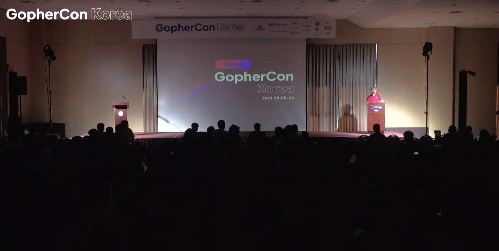
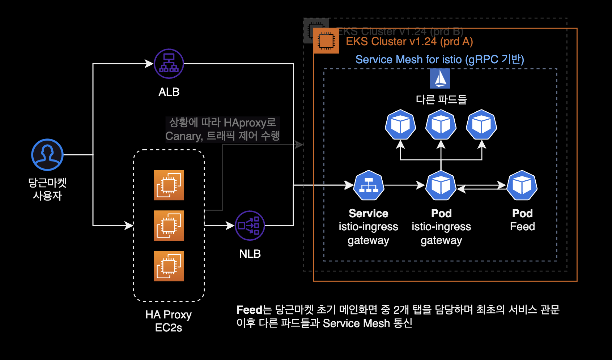
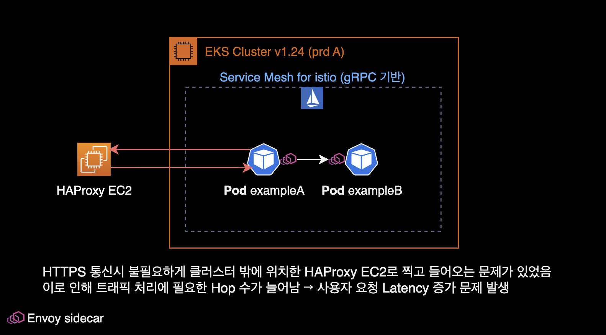
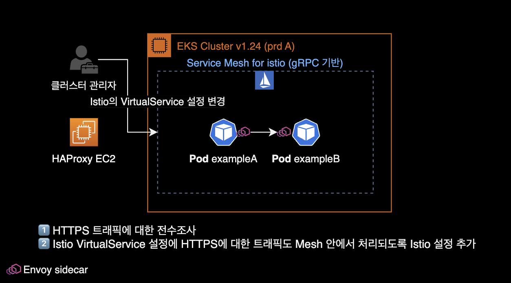
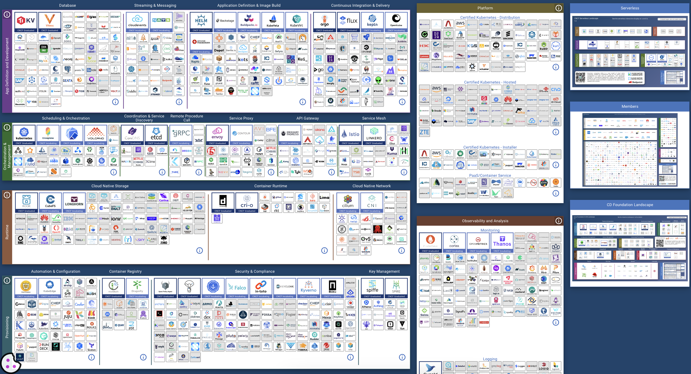
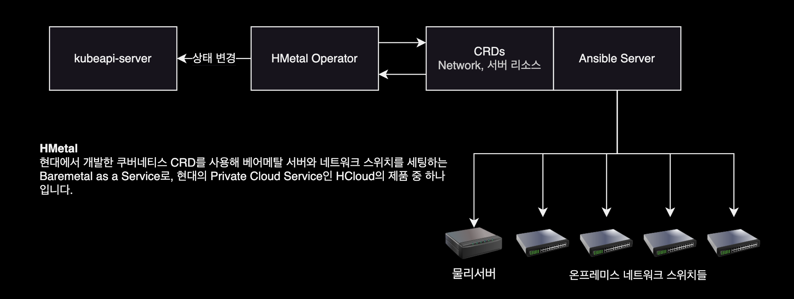

## 개요



2023년 8월 5일 GopherCon 2023의 1일차 행사에 참석한 후 세션 내용을 메모한 기록.

&nbsp;

이번 GopherCon Korea 2023 행사는 세종대학교 대양AI센터 12F에서 열렸습니다.


행사장 안은 시원했지만 당시 날씨는 '전국 폭염경보' 상태였습니다.

&nbsp;

다음날(8월 6일)에 열리는 GopherCon 2일차 행사는 개인 일정이 있어서 아쉽게도 참석하지 못했습니다.

&nbsp;

## 오피스 아워

저는 행사 참석 전에 미리 당근마켓 부스에 오피스 아워를 신청했습니다.

당시 저는 EKS의 스팟 노드 운영과 파드의 스케일 인 과정에서 발생하는 Graceful Shutdown 이슈를 엔터프라이즈 환경에서 경험하고 있었고, 이 때 발생하는 시스템 불안정성과 503 Service Unavailable 에러 발생에 대한 해결 노하우를 얻고 싶어서 오피스 아워를 신청했습니다.

&nbsp;

### 제가 궁금했던 사항

- EKS 환경에서 Application의 Graceful한 shutdown 기법은 어떤 것들을 주로 사용하고 있는지?
- HPA 적용시에 스케일 인 과정에서 500 에러 이슈는 없었는지?
- Application 도입할 때 중앙집중되어 있는 Config Server를 따로 운영하고 있는지?
  - dev, qa, stg, prd 멀티 스테이지 환경에서 각 환경별로 Config를 **효율적으로 주입 및 관리** 방법에 대한 노하우가 궁금
- Spot 인스턴스 노드그룹에 대한 운영 노하우
  - Logging용 파드를 일부 스팟 그룹에서 운영하고 있는데, Spot Interruption 과정에서 확률적으로 503 Service Unavailable Error가 발생함

10시부터 Keynote 발표가 시작되고, 하나의 세션을 듣다가 11:15 ~ 11:40 동안에는 오피스 아워에 참석했습니다.  
당근마켓 백엔드 개발자분에게 많은 노하우를 듣고, 이런저런 기술적인 이야기를 나눴습니다.

&nbsp;

### 당근마켓의 문제해결 사례

#### 인프라 구성

직접 설명받은 간략한 당근마켓 인프라 구성. 사실 이 부분은 당근마켓 SRE 밋업에서 이미 여러번 소개된 아키텍처입니다.



&nbsp;

#### Graceful Shutdown 기법

- 파드의 Lifecycle Hook 기능인 `PreStop`과 `terminationGracePeriodSeconds` 2가지 설정을 사용하여 Graceful Shutdown 할 수 있도록 **이중방어** 체계를 적용했음.
  - `PreStop`에는 당근에서 직접 작성한 커스텀 스크립트를 활용. `netstat` 명령어를 사용함. 해당 스크립트는 established 상태(맺어진 상태)인 커넥션이 끝나기 전까지 계속 기다린 후, 종료되면 그 때 파드 종료하는 원리라고 합니다.
- Istio 환경에서 Envoy 사이드카와 App 메인 컨테이너의 커넥션 불일치 문제는 tcp_keepalive_time 튜닝으로 해결할 수 있었음
- Istio의 관측가능성 확보하는 게 문제해결에 큰 도움이 되었으며 중요하다고 생각함
- 당근마켓의 실제 서비스 중 일부는 스팟 노드그룹에서 실행되고 있습니다.

&nbsp;

#### HTTPS 통신 시 외부로 나가는 문제

Istio 환경에서 내부 HTTP 통신은 정상적이나, HTTPS 통신을 붙이면 잘 안되는 문제가 있었습니다.

해결방법은 Istio의 VirtualService 설정에 HTTPS 트래픽에 대한 Mesh 처리가 빠져 있었던 걸로 확인되었다고 합니다.





한줄 요약하자면 당근마켓의 엔지니어와 개발자분들은 경이로운 문제 해결 능력을 갖추고 있는 실력자들 모임 같아 보인다.

&nbsp;

## 세션 내용

### 키노트

- 당근마켓은 Go 언어를 메인으로 사용하는 회사임
- 메가존 소프트
- 2023년 8월 ~ 9월 Go 성능 최적화 관련해서 책 출판할 예정.
  - 8월 6일 Golang Korea 부스가 책에 대해서 안내를 들을 수 있음

&nbsp;

### Open Source In Go

**스피커**: 박남규, LitmusChaos

**Go Proverbs**  
Golang과 관련된 속담  
[go-proverbs.github.io](https://go-proverbs.github.io)

&nbsp;

CNCF **160개** 프로젝트 중, Go 언어로 개발된 프로젝트가 **100개**, 컨트리뷰터 **20만명**

&nbsp;

CNCF의 각 카테고리별 오픈소스를 잘 활용한다면 클라우드 네이티브 인프라를 쉽게 구축할 수 있습니다.



[CNCF Landscape 보기](https://landscape.cncf.io/)

&nbsp;

#### CI/CD

CI/CD 파이프라인 표준 아키텍처

```bash
+------------+     +----------------+     +--------+
| Developers | --> | Github Actions | --> | Harbor |
+------------+     +----------------+     +--------+
                            |      |                  
                            v      | Triggered
                         +------+  |      +--------+
                         | Helm |  +----> | ArgoCD |
                         +------+ <------ +--------+
```

CI/CD 파이프라인에서 Harbor는 컨테이너 이미지 저장소이며 이미지 취약점 스캔 기능을 활용합니다.

헬름 차트에서 값이 변하는 부분들은 `values.yaml` 부분에 정의를 합니다.  
일반적인 경우, 헬름 차트의 형태는 그대로 유지되고 이미지 태그 값 정도만 바뀌므로 `values.yaml` 파일에 업데이트를 수행하면 됩니다.

&nbsp;

#### OpenTelemetry

- `Traefik`
- `Cert Manager` : Let's Encrypt 등의 무료 인증서 자동 갱신 및 직접 HTTPS 인증서 생성을 지원해주는 에드온
- `OpenTelemetry` : Observability 플랫폼, traces, log, metrics 수집
- `Litmus` : 카오스 엔지니어링 툴

&nbsp;

### 오픈소스 기여

오픈소스 기여<sup>Contribution</sup>하는 방법에 대해 더 알고싶다면 테라폼 창립자인 Mitchell Hashimoto가 쓴 [Contributing to Complex Projects](https://mitchellh.com/writing/contributing-to-complex-projects)를 보면 좋습니다.

#### 오픈소스 기여에 도움을 주는 행사와 도구들

- [2023 오픈소스 플레이그라운드](https://www.oss.kr/notice)
- [LFX Mentorship](https://lfx.linuxfoundation.org/tools/mentorship/) : 오픈 소스 소프트웨어 개발 분야에서 새로운 개발자들을 지원하고 가이드하는 멘토십 프로그램입니다. 리눅스 재단(Linux Foundation)이 LFX Mentorship을 주최하고 있으며, 여러 오픈 소스 프로젝트와 개발자 커뮤니티에 참여하며 실무 경험을 쌓을 수 있는 기회를 제공합니다.
- [Google Summer of Code](https://summerofcode.withgoogle.com/)
- [OutReachy](https://www.outreachy.org/)

&nbsp;

### 당근마켓의 Go 도입기

**스피커**: 당근마켓 변규현

&nbsp;

#### 당근마켓의 Go 사용 현황

대부분의 당근마켓 프로젝트는 Golang 기반으로 작성되어 있습니다.

- Golang을 사용하는 Repository 수 200개 이상
- Golang을 사용하는 사람수 50명 이상

운영하는 서비스에서 얼마나 많은 요청(트래픽)을 처리하는가?

- 파드 1개당 2코어 10GB, 200개 정도 운영  
- 파드 1개당 1코어 1GB, 25개 정도 운영

스피커인 변규현님은 당근마켓 전부터 이미 개인적으로 Golang을 시작했었다고 합니다.

&nbsp;

#### 회사에서 Go를 시작한 계기

1. 현재 기술로는 해결하기 어려운 상황이 발견됨
   1. Ruby on Rails 서버로 감당하기 트래픽이 당근마켓에서 발생하고 있었습니다.
   2. 이때 RDS의 약 60% 부하가 채팅 트래픽에서만 발생하고 있었습니다.

&nbsp;

#### Go 성능 이슈

- Starvation mode of Mutex
- gopark를 사용해서 트러블슈팅 가능
  - Mutex mode?
- 컨테이너 환경에서 원치 않는 CPU Throttling을 경험한 적 있음
  - 전체 CPU 사용률이 낮은데, CPU 스로틀링이 걸리는 이유를 찾아보기 시작

&nbsp;

#### CPU 스로틀링 해결

GOMAXPROCS는 CPU Quota와 별개로 동작하는 문제가 있었습니다. 관련 이슈는 [Automatically set GOMAXPROCS according to linux container cpu quota](https://github.com/ory/hydra/issues/2033)를 참고합니다.

당근마켓은 CPU Throttling Optimization을 해결하기 위한 목적으로 [uber-go/automaxprocs](https://github.com/uber-go/automaxprocs) 패키지를 활용했습니다.  
[uber-go/automaxprocs](https://github.com/uber-go/automaxprocs) 패키지는 Linux 컨테이너에 설정된 CPU Quota에 따라 자동적으로 GOMAXPROCS를 설정해주는 역할을 합니다.

트래픽이 많이 발생하는 대부분의 당근마켓 프로젝트에는 [uber-go/automaxprocs](https://github.com/uber-go/automaxprocs)가 적용되어 있다고 생각하면 됩니다.

&nbsp;

불필요한 메모리 할당을 최소화

slice & map : 메모리 할당시 더블링을 사용
doubling을 피해 필요한 메모리만큼 사용

&nbsp;

메모리 사용 개선하기

GC 튜닝하기
GC Frequencey가 높은 현상을 발견.  
분당 400회씩 GC가 도는 걸 발견. 400개의 stop-the-world가 발생, 이는 레이턴시에 영향을 줄 수 있고

> **stop-the-world**  
> Go 언어는 자동으로 가비지 컬렉션을 수행하여 개발자가 직접 메모리 관리를 신경 쓰지 않도록 도와줍니다. 그러나 가비지 컬렉션을 실행하려면 프로그램의 실행을 잠시 멈춰야 할 때가 있습니다. 이때 발생하는 멈춤 현상을 "stop-the-world"라고 합니다.  
> "stop-the-world"는 프로그램의 실행이 가비지 컬렉션을 위해 잠시 중단되는 상황을 의미합니다.

GC 작업이 CPU Time의 30%까지 소모. 서비스 운영에 굉장히 낭비라고 판단되었음.

GC Cycle의 횟수를 줄여야 할까?
GC Cycle로 인해 레이턴시 영향도 최소화, 인프라 비용 절감도 필요했고 개선이 필요하다고 판단했었음.

&nbsp;

[Go v1.20 기준](https://pkg.go.dev/runtime#hdr-Environment_Variables)으로 GC Cycle의 튜닝 파라미터는 2개 제공하고 있습니다.

- **GOGC**<sup>Go Garbage Collection</sup> : 가비지 컬렉션의 동작 빈도를 제어하는 환경 변수. `GOGC=100`인 경우, 프로그램이 새로운 메모리를 할당할 때, 이전에 할당한 메모리의 양에 비해 추가로 할당한 메모리의 양이 프로그램의 전체 메모리 사용의 100%에 도달하는 순간, 가비지 컬렉션이 트리거됩니다.
- **GOMEMLIMIT** : Memory Soft Limit

**같이 보면 좋은 자료**  
[GOMEMLIMIT is a game changer for high-memory applications](https://weaviate.io/blog/gomemlimit-a-game-changer-for-high-memory-applications)

&nbsp;

| 환경변수 이름 | As was  | Now |
|------------|---------|-----|
| GOGC | 100 (Default) | -1 (비활성화) |
| GOMEMLIMIT | no soft limit (Default) | container의 메모리 스펙의 60~80% |

Now에서 GOGC 값의 경우는 memory limit을 초과할 때에만 GOGC가 동작하도록 설정했습니다.

&nbsp;

적용 후 개선된 Application 성능 결과는 다음과 같습니다.

- GC 사이클 카운트가 400회 → 8회로 줄어듬
- CPU Time 30% → 1% 로 줄어듬
- GC 튜닝 결과 Pod count 245개 → 120개
- 파드 개수가 절반 이상으로 줄어들었기 때문에 EKS의 워커노드도 많은 수를 감소시켜 컴퓨팅 비용을 절감했습니다.
- CPU 메모리 관리를 위한 [Autopprof](https://github.com/daangn/autopprof) 프로젝트

&nbsp;

당근마켓은 이 외에도 다양한 오픈소스들을 공개하고 생태계에 기여하고 있습니다.

- [daangn/autopprof](https://github.com/daangn/autopprof)
- [daangn/kinesumer](https://github.com/daangn/kinesumer)
- [daangn/minimemcached](https://github.com/daangn/minimemcached)

&nbsp;

시간 관계상 이번 발표에서 공유하지 못한 내용들

- 도메인 복잡도가 올라가면서 변화하는 코드 변화
- gRPC 서비스 최적화하기
- Error를 다루는 방법
- 로깅을 효과적으로 하는 시스템 디자인
- 마이크로 서비스를 나누는 기준
- Kubernetes 환경에서 네트워크 이슈 트래킹


당근마켓 발표 마지막 쯤에 위 '달리는 자동차의 바퀴 갈아끼우기' 짤방을 보니 신기했습니다. 저 사진을 보니까 합성은 아니고 진짜로 가능한 것처럼 보이네요. 매우 위험하다는 게 문제겠지만.

> "운영되고 있는 서비스를 고객에게 임팩트를 주지 않고, 어떻게 성능을 최적하고 빠르게 기능을 전달할 수 있는지를 고민하고 있습니다."


&nbsp;

#### 질문답변

> **Q**: 당근마켓에서 사용하는 실제 프로덕션 환경에서 고루틴의 개수 제한이나 균형점이 있는지?
> **A**: Worker Pool에 들어갈 때 아토믹한 카운터를 하나 만들고, Go routine에서 카운트를 내려주고 Graceful SHutdown 할때 → Worker Pool을 체크한 후 죽는 방식

60,000개 이상의 고루틴이 에러를 내뿜으면서 한번에 죽은 사례가 발생했었습니다.

개선할 필요가 있는 장애나 이슈 현상이 먼저 관측이 된 이후, 그 다음에 어플리케이션을 개선을 하는 것이 시간 효율적입니다.

> "고작 1~2명의 유저가 접속하는 서비스가 있는데, 어플리케이션 문제가 발생하기도 전에 어플리케이션의 성능을 튜닝하려고 하는 건 너무 시간비용 낭비라고 생각합니다."

차라리 그 시간에 새로운 기능을 개발해서 배포하는 게 더 생산성 있는 일이라는 걸 말씀하시는 듯

&nbsp;

그 외 스피커 분의 Go 도입시 조언들

- Enterprise 환경에 Go 어플리케이션을 도입한다는 건, 그 조직 안에 Go 마스터가 몇명 있어야 한다는 의미입니다. 당근마켓의 경우, (스피커 분을 스스로를 포함하여) Golang 책을 쓰신 저자 출신 엔지니어부터 그 외 다양한 Go 언어계의 제다이들이 애초에 모여있는 특수 케이스였습니다. 이 외의 상황에서 Go를 도입하는 건 너무 무모한 도전이라고 생각합니다.
- Go를 도입을 하고 싶다면 작은 서비스부터 Go로 개발 및 전환한 후, 어느정도 경험과 지식을 먼저 쌓을 것. 이후 큰 서비스로 점진적으로 적용하는 게 베스트 시나리오입니다.

&nbsp;

### API 서버 테스트코드 A-Z

케이스별 효과적인 테스트코드 작성 전략

**스피커**: 김진용  
네이버클라우드 → 네이버랩스 → 룩코 (백엔드 엔지니어)

테스트 코드를 잘 짜기 위해서는 어떤 프로젝트 구조를 가지는 것이 유리한지, 3rd Party API와 같은 외부 의존성이 있는 경우에는 테스트를 어떻게 작성해야 하는 지에 대해서 설명하고, 유용하게 사용할 수 있는 테스트 패키지들에 대해 설명하는 세션이었습니다.

&nbsp;

강의 대상<sup>Who should attend?</sup>

- Golang에서 테스트를 위한 도구들은 어떤 것이 있는지 궁금하신 분들
- API 서버개발에 Golang을 고려하고 계신 분들
- Golang에서 테스트 작성에 어려움을 겪고 계신 분

&nbsp;

Golang에 대한 테스트는 Table Driven Testing 방식을 주로 사용합니다.

&nbsp;

```go
func TestIsSubset(t *testing.T) {
  type args struct {
    list1 []string
    list2 []string
  }
  tests := []struct {
    // ...
  }
}
```

&nbsp;

테스트 관련 자주 사용하는 `go` CLI 명령어

```bash
# 전체 코드 테스트
go test ./...

go test github.com/gophercon/example/overview

# 특정 패키지나 파일에서 이름이 `TestIsSubset`인 함수를 실행
go test github.com/gophercon/example/overview -run TestIsSubset

# 테스트 cover 파일 저장
go test -coverpkg=./... -coverprofile=coverage.out ./...

# cover 파일을 htlm로 변환
go tool cover -html=coverage.out
```

참고로 `-run` 옵션에는 정규표현식도 적용할 수 있습니다.

&nbsp;

어떤 코드가 테스트를 어렵게 만드는가?

- **높은 결합도(High Coupled Code) & 낮은 응집도(Low Cohension Code)**
  - 높은 응집도를 유지하자: 하나의 함수는 여러 기능을 수행하면 안되며, 명확한 하나의 기능만 수행해야한다.
- **복잡한 매개변수와 반환 값**
  - 반환 값이 여러 개이거나, 각 값이 복잡한 구조를 가지고 있다면 테스트하기가 어렵다.
- **고루틴 & 채널**
  - 테스트가 실행되는 시점과 고루틴의 실행이 완료되는 시점이 다를 수가 있어서, 테스트 결과가 일관되지 않을 수가 있음. 채널의 성격에 따라서 계속 블로킹 상태로 있는 코드들도 있을 수 있기에 이 경우에는 영원히 테스트가 종료되지 않는 상황이 있을 수 있습니다.

```go
// Go routine case
func callAPI(v string) error {
  time.Sleep(3 * time.Second) // simulate delay
  fmt.Printf("%v Do Something v vlaue: ", v)
  return nil
}
func UpdateData(data []string) error {
  // ...
}
```

- **외부 의존성**
  - 외부 리소스나 서비스에 의존하는 코드는 테스트 중에 해당 리소스나 서비스를 제어하기 어렵고 이로 인해 원하는 테스트 시나리오를 재현하기 어렵습니다.
  - 3rd Prty API: 외부 API를 호출하는 Go 코드가 있다고 가정할 떄, 외부 API 장애나 API 변경에 의해 테스트 코드까지 같이 깨지는 문제가 발생할 수 있습니다.
- **전역상태 관리**
  - 전역상태는 여러 테스트 사이에서 공유되므로, 하나의 테스트가 다른 테스트에 영향을 줄 수 있습니다.
  - 전역 상태에 대한 종속성으로 인해 테스트 코드의 복잡성이 증가하고, 유지보수가 어려워질 수 있습니다.

```go
type Config struct {
  // 전역설정
  DebugMode bool
}

var GlobalConfig *Config

type Service struct {}
func (s *Service) DoSomething() {
  // 직접적인 globalConfig 참조
  if GlobalConfig.DebugMode {
    // ...
  }
}
```

- **코드 구조와 설계** : 사실 이 부분이 제일 중요합니다.
  - 테스트를 위한 코드 구조와 설계에 대한 충분한 이해 없이 테스트 코드를 작성하는 것은 어려울 수 있습니다.
  - API 서버를 설계한다면 프로젝트 구조는 [Go Clean Architecture](https://github.com/bxcodec/go-clean-arch)를 참고하는 것을 추천합니다.

&nbsp;

#### Golang Project Layout

Golang에서는 성격에 따라서 프로젝트 레이아웃도 천차만별. Golang은 프로젝트 구조에 대한 명확한 표준이나 강제하는 부분이 없음.

- [Flat Structure](https://www.calhoun.io/flat-application-structure/)
- Modularization
- [Go Standard Project](https://github.com/golang-standards/project-layout)

&nbsp;

결과적으로 Go 프로젝트 구조는 아직 명확한 정답이 없습니다. 여러 사례를 경험해본 결과 **적당히**, **상황에 맞게**, **알아서** 작성하는 것이 대부분입니다.  
팀 구성원들이 다들 동의할 수 있는, 참조할 수 있는 프로젝트 구조면 괜찮을 것 같습니다.

&nbsp;

#### Clean 아키텍처 원칙

자세한 사항은 Go Clean Architecture를 참고

- 프레임워크 독립성
- 비즈니스 로직들은 UI, 데이터베이스, 웹 서버 등의 외부요소에 상관없이 테스트 될 수 있어야 한다.
- UI와 무관하게 만약 변경이 있더라도 비즈니스 로직들은 변경하지 않고 콘솔 UI로 변경할 수 있어야함.
- 데이터베이스에 독립적이고 MySQL을 Post, OracleDB로 바꾸어도 교체할수 있어야 함.


보통 Interface 같은 경우 한 패키지에 몰아져 있으면 장점들이 많습니다.

> **중요**: 상위 레이어는 하위 레이어를 참조할 수 있지만, 하위 레이어는 상위 레이어를 알지도 못하고 참조할 수 없습니다.

&nbsp;

#### 결론

##### 테스트를 어렵게 만드는 요소

- 테스트를 잘하기 위해서는 좋은 코드<sup>Clean Code</sup>가 선행되어야 합니다. 이 부분이 가장 중요합니다.
- 고루틴이나 채널을 사용해야 하는 경우 테스트를 위해서 다양한 고려가 필요합니다.
- [Go Clean Architecture](https://github.com/bxcodec/go-clean-arch)는 레이어별로 결합도를 최소화하는 구조를 가지면서 테스트 하기에 좋은 구조를 제안합니다.

&nbsp;

#### 레이어별 테스트 UseCase

##### Repository

Repository 레이어에서는 데이터베이스에 직접 접근하는 계층이기 때문에 의도한대로 데이터가 CRUD가 잘 동작했는지 확인할 필요가 있습니다.

&nbsp;

외부 의존성 대체하는 테스트 도구는 크게 3가지가 있습니다.

- **Docker**
  - 데이터의 일관성을 보장하고 싶다면 테스트를 수행할 때마다 데이터셋을 밀어주는 작업을 할 필요가 있음
  - testcontainers-go 프로젝트 참고하는 걸 추천
- **In memory database**
  - 도커에 비해서는 제대로 관리되고 운영되는 프로젝트가 적으며, 있다고 하더라도 제약이 있을 수 있습니다. 예를 들어 postgresql에서 postgis를 써야한다면, embeded postgresql에서는 제약이 있을 수 있습니다.
- **Mocking**
  - 외부 인터페이스를 Mocking 하거나 라이브러리를 사용해서 좀 더 고차원적인 Mocking을 할 수 있습니다.
  - 테스트를 진행할 때 테스트 환경을 제어할 수 없다는 건 불안한 요소가 많다는 걸 의미합니다.
  - 사용 예시 : httpmock, sqlmock
  - 초기에 Mocking 방식을 사용하다가 도커나 인메모리 데이터베이스 쪽으로 넘어갔던 이유중 하나가 어플리케이션 사이즈가 커지면 쿼리도 복잡해지고, 구현 난이도가 높아지므로 Mocking을 들어내고, In-memory 데이터베이스 쪽으로 테스트 방식을 전환한 사례가 있었음.

&nbsp;

##### UseCase

해당 레이어에서는 비즈니스 로직을 구현하는 계층이고, 테스트 또한 로직을 좀 더 집중해서 작성이 필요함

외부 의존성을 가지는 부분은 Repository에서 처리하고 있기 때문에 테스트를 셋업하는데 들어가는 노력을 최소화할 필요가 있음

Mocking 사용시 참조 라이브러리

- [mockery](https://github.com/vektra/mockery) : mocker config 설정 후 mockery 명령어 실행하면 관련 파일을 자동으로 generate 시켜줌
- [uber-go/mock](https://github.com/uber-go/mock) : 참고로 구 [golang/mock](https://github.com/golang/mock)은 더 이상 유지 관리되지 않습니다.

&nbsp;

##### Delivery

HTTP API 기준으로 어떤 프레임워크(gin, echo, fiber)를 사용했느냐에 따라 테스트를 하는 방식이 달라질 수 있음.

외부에서 올바른 요청이 들어왔는지 확인할 필요가 있습니다.

Usecase 레이어와 올바르게 통신하고 반환된 데이터를 올바르게 처리하고 반환하는지 확인해야 합니다.

```go
func TestCreateUser(t *testing.T) {
  // ...

  mockuserUsecase.on("CreateUser", mock.Anything, ..., nil)
}
```

&nbsp;

#### 정리

- Layer별로 집중해야 하는 테스트 목적이 다름
- 하위 레이어에서 테스트가 무결하면 상위 레이어에서는 해당 레이어를 검증할 필요가 없기에 코드가 간략해질 수 있음
- Mocking 라이브러리를 사용해서 좀 더 다양한 형태로 코드를 검증할 수 있습니다.
- 그럼에도 불구하고 특정함수에서 의존성이 복잡해지기 시작하면 하나의 함수를 여러 개로 분리하는 결정을 해야합니다.

> **유닉스 철학**<sup>Unix Philosophy</sup>  
> 한 가지 일을 잘 수행하는 프로그램을 작성하십시오.  
> Do One Thing And Do It Well.

&nbsp;

런타임에 정해지는 값들

대표적으로 시간이나 생성 때마다 만들어지는 ID 값이 대표적임.

```go
type Realtime strcut {}
...
```

대안으로 google의 [go-cmp](https://github.com/google/go-cmp) 패키지를 사용하는 것도 좋은 방법입니다.

인터페이스를 별도로 선언하면서 처리하는게 너무 과하다고 생각하면 런타임시에 정해지는 값들에 대해서는 테스트를 무시하고 작성하는 것도 방법이 될 수 있습니다.

Table Driven Testing with go-cmp의 샘플 코드는 다음과 같습니다.

```go
func TestUserUsercase_CreateUser(t *testing.T) {
  tests := []struct {
    name     string
    userName string
    want     User
  }{...}
  for _, tt := range tests {
    t.Run(tt.name, func(t *testing.T) {
      us := UserUsecase{}

      got := us.CreateUser(tt.userName)
      assert.True(t, cmp.Equal(tt.want, got, cmpopts.IgnoreFields...))
    })
  }
}
```

&nbsp;

**어쩔 수 없이 비대해지는 함수들**  
회사가 성장하면서 비즈니스 로직은 복잡해지고 하나의 함수가 처리하는 기능의 크기가 커지는 일은 불가피하다. (먼저 심적으로 받아들이는 게 중요하다.)

이 경우 함수 분할(Function Splitting)로 문제를 해결합니다.

하나의 큰 함수를 여러 개의 작은 함수로 분할하여 기능을 분리합니다. 이렇게 하면 각 함수의 역할이 명확해지고 코드가 더 모듈화됩니다. 관련된 작업을 수행하는 작은 함수들을 만들어 가독성을 높일 수 있습니다.

&nbsp;

**고루틴 & 채널**  
함수내부에 있는 Goroutine이 별도의 동기화 과정을 거치지 않고 종료되는 경우 호출 결과를 담는 채널을 반환해줍니다.

&nbsp;

내용 정리

- 런타임에 정해지는 값들은 인터페이스를 활용
- 모든 값을 테스트할 필요가 없다면 go-comp 패키지의 [IgnoreFields](https://pkg.go.dev/github.com/google/go-cmp/cmp/cmpopts#IgnoreFields) 옵션을 활용
- 구현체가 너무 커지면 내부함수를 mocking하는 형태로 테스트의 크기를 줄일 수 있음
- 고루틴으로 테스트 케이스에서는 연관된 채널의 반환값을 전달해주면 작성하기 수월해집니다.

&nbsp;

### Go와 K8s로 만드는 Datacenter Autopilot

**스피커**: 현대자동차, 박도형, Cloud Platform Developer

엔지니어 커리어 전체가 Private Cloud 플랫폼 개발만 하신 엔지니어이셔서 인상적이었습니다.

#### HMetal

현대의 자체 서비스인 인프라 자동화 솔루션 HMetal에 대한 소개 및 동작방식 세션이었습니다.

HMetal은 현대에서 자체 개발한 Baremetal as a Service 입니다.

```bash
Barmetal 서버를 --> Cloud처럼 자동화된 방식으로 --> 사용자에게 제공
```

&nbsp;

#### K8s Operator Pattern 도입 결정

- Kubernetes is designed for automation : 쿠버네티스는 자동화를 위한 컨테이너 오케스트레이션 툴이며, [쿠버네티스 공식문서](https://kubernetes.io/docs/concepts/overview/)에 이미 나와있습니다.
- 어쨌거나 HMetal은 Kubernetes를 쓴다
- ArgoCD, Prometheus, MySQL 등 유명한 오픈소스들은 모두 Kubernetes Operator 패턴을 사용하고 있습니다.



&nbsp;

## 참고자료

[GopherCon Korea 공식 사이트](https://gophercon.kr/)

[유닉스 철학](https://academic-accelerator.com/encyclopedia/kr/unix-philosophy)

[Golang korea 발표 저장소](https://github.com/golangkorea/gophercon-talks)
