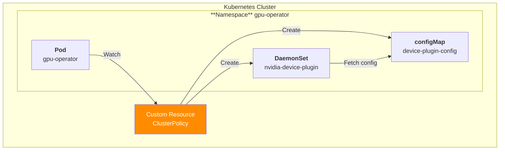
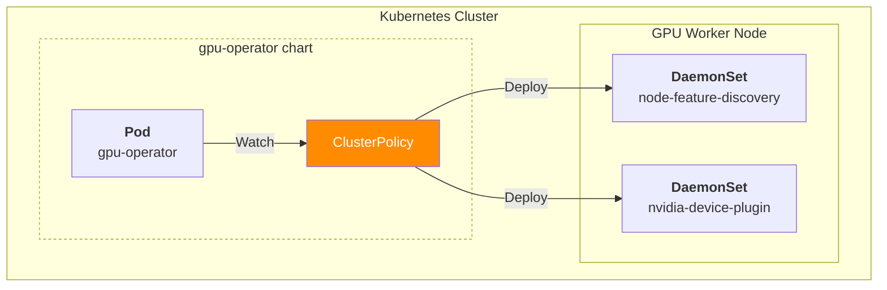
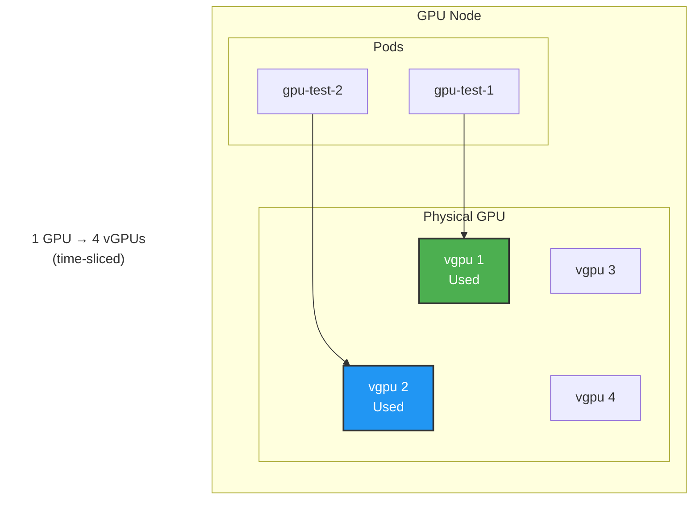

## 개요

쿠버네티스 + GPU Operator 환경에서 워커노드의 GPU 리소스를 시분할로 잘게 나눠쓰는 방법.

## 배경지식

### GPU Timeslicing

쿠버네티스 환경에서 GPU는 CPU나 메모리와 달리 하드웨어 레벨에서 분할할 수 없는 리소스입니다. 

```yaml
apiVersion: v1
kind: Pod
spec:
  containers:
  - name: gpu-container
    image: nvidia/cuda:11.0-base
    resources:
      limits:
        nvidia.com/gpu: 1  # 정수만 가능 (1개의 GPU)
      requests:
        nvidia.com/gpu: 1
```

CPU는 코어별로 독립적인 실행 단위를 가지고 있고, 메모리는 주소 공간을 논리적으로 분할할 수 있지만, GPU는 단일 컨텍스트에서 동작하는 구조로 설계되어 있습니다. 하나의 GPU는 한 번에 하나의 CUDA 컨텍스트만 활성화할 수 있으며, 여러 컨테이너가 동시에 GPU에 접근하려고 하면 충돌이 발생합니다. 이러한 한계를 해결하기 위해 NVIDIA는 Time Slicing 기술을 제공하여 하나의 GPU를 시간 단위로 나눠서 여러 워크로드가 순차적으로 사용할 수 있도록 합니다.

## 환경

- EKS 1.32
- gpu-operator 25.3.1 (official helm install)
- Worker Node: AL2023, g4dn.xlarge, amd64

## 설정 가이드

최신 버전의 [gpu-operator](https://github.com/NVIDIA/gpu-operator) v25.3.1 헬름 차트를 로컬로 다운로드 받습니다.

```bash
helm repo list
helm repo add nvidia https://helm.ngc.nvidia.com/nvidia
helm pull nvidia/gpu-operator --version 25.3.1 --untar
```

**주의사항**: gpu-operator에서 레포를 직접 Clone 하거나, Github Release를 통해 헬름 차트를 받아 설치하는 경우, runtimeClass 커스텀 리소스가 정상 생성 안되거나, Nvidia Device Plugin 데몬셋이 정상적으로 실행되지 않는 특이사항이 있습니다. `helm pull`로 직접 헬름 차트를 다운로드 받아야만 합니다.

gpu-operator 헬름 차트를 사용하면 GPU 시분할 설정도 configMap을 통해 쉽게 적용할 수 있습니다.

```yaml
# gpu-operator/values.yaml (v25.3.1)
devicePlugin:
  enabled: true
  repository: nvcr.io/nvidia
  image: k8s-device-plugin
  version: v0.17.2
  imagePullPolicy: IfNotPresent
  imagePullSecrets: []
  args: []
  env:
    - name: PASS_DEVICE_SPECS
      value: "true"
    - name: FAIL_ON_INIT_ERROR
      value: "true"
    - name: DEVICE_LIST_STRATEGY
      value: envvar
    - name: DEVICE_ID_STRATEGY
      value: uuid
    - name: NVIDIA_VISIBLE_DEVICES
      value: all
    - name: NVIDIA_DRIVER_CAPABILITIES
      value: all
  resources: {}
  # Plugin configuration
  # Use "name" to either point to an existing ConfigMap or to create a new one with a list of configurations(i.e with create=true).
  # Use "data" to build an integrated ConfigMap from a set of configurations as
  # part of this helm chart. An example of setting "data" might be:
  # config:
  #   name: device-plugin-config
  #   create: true
  #   data:
  #     default: |-
  #       version: v1
  #       flags:
  #         migStrategy: none
  #     mig-single: |-
  #       version: v1
  #       flags:
  #         migStrategy: single
  #     mig-mixed: |-
  #       version: v1
  #       flags:
  #         migStrategy: mixed
  config:
    # Create a ConfigMap (default: false)
    create: true 
    # ConfigMap name (either existing or to create a new one with create=true above)
    name: "device-plugin-config"
    # Default config name within the ConfigMap
    default: "default"
    # Data section for the ConfigMap to create (i.e only applies when create=true)
    data:
      default: |-
        version: v1
        flags:
          migStrategy: none
        sharing:
          timeSlicing:
            resources:
              - name: "nvidia.com/gpu"
                replicas: 4 
  # MPS related configuration for the plugin
  mps:
    # MPS root path on the host
    root: "/run/nvidia/mps"
```

clusterPolicy 리소스에 선언된 devicePlugin.config 설정을 토대로 gpu-operator는 configMap을 아래와 같이 gpu-operator 네임스페이스에 생성합니다.



> gpu-operator 파드와 configMap은 반드시 동일한 네임스페이스에 위치해야 정상적으로 설정을 읽을 수 있습니다.

```yaml
apiVersion: v1
data:
  default: |-
    version: v1
    flags:
      migStrategy: none
    sharing:
      timeSlicing:
        resources:
          - name: "nvidia.com/gpu"
            replicas: 4 
kind: ConfigMap
metadata:
  labels:
    app.kubernetes.io/instance: gpu-operator
    app.kubernetes.io/managed-by: Helm
    app.kubernetes.io/name: gpu-operator
    app.kubernetes.io/version: v25.3.1
    argocd.argoproj.io/instance: gpu-operator
    helm.sh/chart: gpu-operator-v25.3.1
  name: device-plugin-config
  namespace: gpu-operator
```

해당 configMap에는 GPU 시분할(Time Slicing) 관련 설정이 들어있습니다.

GPU Operator는 커스텀 리소스인 ClusterPolicy를 실시간으로 감지하고 시분할을 반영하게 됩니다.



nfd(node-feature-discovery) 데몬셋의 Affinity 설정을 추가합니다.

기본적으로 gpu-operator의 nfd worker 데몬셋은 Affinity가 설정되어 있지 않으므로, 모든 워커 노드에 배포됩니다. worker 데몬셋에 affinity를 추가해서 GPU 노드에만 할당되도록 제한합니다.

```yaml
# chart/gpu-operator/values_my.yaml
node-feature-discovery:
  worker:
    serviceAccount:
      name: node-feature-discovery
      # disable creation to avoid duplicate serviceaccount creation by master spec below
      create: false
    affinity:
      nodeAffinity:
        requiredDuringSchedulingIgnoredDuringExecution:
          nodeSelectorTerms:
          - matchExpressions:
            - key: karpenter.k8s.aws/instance-gpu-count
              operator: Gt
              values:
              - "0" 
```

이 설정이 적용되면 gpu-feature-discovery와 nvidia-device-plugin 데몬셋이 재시작됩니다.

```yaml
# clusterpolicies.nvidia.com
apiVersion: nvidia.com/v1
kind: ClusterPolicy
# ...
spec:
  devicePlugin:
    config:
      default: default
      name: device-plugin-config
```

instance-gpu-count를 확인해보면 T4 GPU 하나가 장착된 g4dn.xlarge 노드임을 알 수 있습니다. 이 하나의 물리적 GPU를 가상의 4개 GPU로 잘게 쪼갠 걸 라벨을 통해 확인할 수 있습니다.

```yaml
# GPU node (resource yaml) 
spec:
  labels:
    karpenter.k8s.aws/instance-gpu-count: "1"
    nvidia.com/gpu.replicas: "4"
```

replicas: 4로 Time slicing 적용하게 되면, 실제로 allocatable.nvidia.com/gpu가 1이 아닌 1 x 4 = 4로 늘어나는 걸 확인할 수 있습니다.

```yaml
# GPU Node (resource yaml)
status:
  allocatable:
    cpu: 3920m
    ephemeral-storage: "27845546346"
    hugepages-1Gi: "0"
    hugepages-2Mi: "0"
    memory: 15467656Ki
    nvidia.com/gpu: "4"
    pods: "29"
```

정말로 GPU 4개로 잘게 쪼개졌는지 검증하기 위해 `gpu: 1`씩 할당하는 테스트 파드 2개를 배포합니다. 원래대로라면 2개의 노드에 파드가 1개씩 나눠져서 스케줄링 되어야 합니다.

```yaml
cat <<EOF | kubectl apply -f -
---
apiVersion: v1
kind: Pod
metadata:
  name: gpu-test-1
  namespace: default
  labels:
    app: gpu-test
spec:
  runtimeClassName: nvidia
  restartPolicy: OnFailure
  containers:
  - name: cuda-vector-add
    image: "nvidia/samples:vectoradd-cuda10.2"
    resources:
      limits:
        nvidia.com/gpu: 1
---
apiVersion: v1
kind: Pod
metadata:
  name: gpu-test-2
  namespace: default
  labels:
    app: gpu-test
spec:
  runtimeClassName: nvidia
  restartPolicy: OnFailure
  affinity:
    podAffinity:
      requiredDuringSchedulingIgnoredDuringExecution:
      - labelSelector:
          matchExpressions:
          - key: app
            operator: In
            values:
            - gpu-test
        topologyKey: kubernetes.io/hostname
  containers:
  - name: cuda-vector-add
    image: "nvidia/samples:vectoradd-cuda10.2"
    resources:
      limits:
        nvidia.com/gpu: 1
EOF
```

파드가 생성되었습니다. podAffinity 설정에 의해 gpu-test-2 파드는 gpu-test-1 파드가 위치한 동일 노드에 같이 배포하려고 합니다. 이 설정을 통해 한 GPU 노드의 총 gpu: 2를 점유합니다.



```
pod/gpu-test-1 created
pod/gpu-test-2 created
```

물리적으로 1 GPU를 가진 g4dn.xlarge 노드에 정상적으로 2개의 파드가 스케줄링 된 것을 확인할 수 있습니다.

```bash
$ kubectl get pod -o wide | grep gpu-test
gpu-test-1   0/1     Completed   0          2m20s   10.xxx.xx.xx    ip-xx-xxx-xx-9.ap-northeast-2.compute.internal   <none>           <none>
gpu-test-2   0/1     Completed   0          2m19s   10.xxx.xx.xxx   ip-xx-xxx-xx-9.ap-northeast-2.compute.internal   <none>           <none>
```

고비용 리소스인 GPU를 시분할을 통해 여러 파드간에 효율적으로 공유해서 쓸 수 있습니다.

## 관련자료

- [Time-Slicing GPUs in Kubernetes](https://docs.nvidia.com/datacenter/cloud-native/gpu-operator/latest/gpu-sharing.html): Nvidia Official Docs
- [GPU 쪼개쓰기(Timeslicing)](https://montkim.com/gpu-timeslicing)
