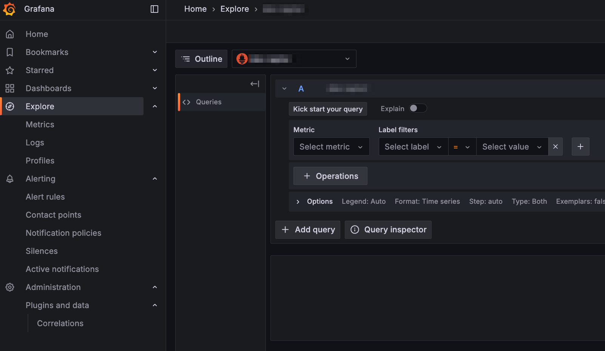
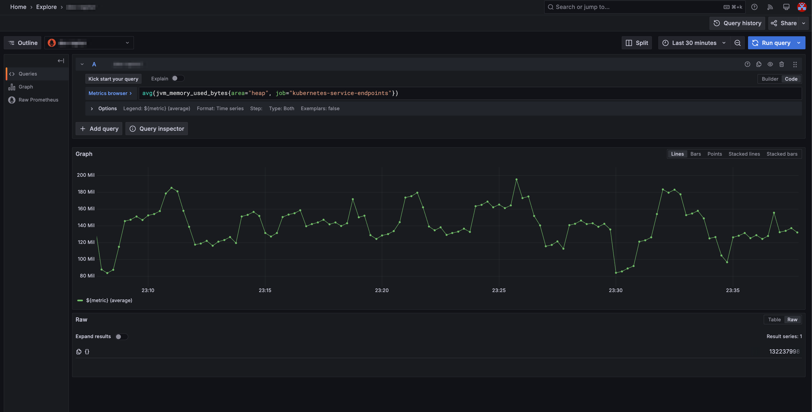

## 개요

Grafana Viewer 권한을 가진 사용자가 Explore 기능을 사용할 수 있도록 하는 방법을 소개합니다.

&nbsp;

## TLDR

- **대상 독자**: 쿠버네티스 환경에서 Grafana를 운영하는 클러스터 관리자
- **이 포스트에서 얻을 수 있는 것**: Grafana Viewer 권한을 가진 사용자가 Explore 기능을 사용할 수 있도록 설정할 수 있는 방법

&nbsp;

## 배경지식

### Grafana 권한 구조

Grafana에서 조직(Organization)은 사용자의 역할과 권한을 관리하는 기본 단위입니다. 조직 내에서 사용자는 특정 역할을 부여받으며, 역할에 따라 접근할 수 있는 기능과 리소스가 결정됩니다.

Grafana의 Organization에는 다음 세 가지 주요 역할이 있습니다.

- Viewer (뷰어): 대시보드를 조회할 수 있지만, 편집하거나 설정을 변경할 수 없음
- Editor (에디터): 대시보드를 생성 및 수정할 수 있으나, 사용자 관리 등의 관리 기능은 수행할 수 없음
- Admin (관리자): 조직 내 사용자 및 리소스를 관리할 수 있으며, Viewer 및 Editor보다 더 많은 권한을 가짐

자세한 사항은 [Roles and permissions](https://grafana.com/docs/grafana/latest/administration/roles-and-permissions/) 문서를 참고해주세요.

&nbsp;

## 환경

쿠버네티스 클러스터에서 헬름 차트로 관리하는 Grafana에서 테스트했습니다.

- **Grafana**: 앱 버전 11.5.2, 차트 버전 8.10.1

&nbsp;

## 설정하기

### viewers_can_edit 설정

그라파나에 [viewers_can_edit](https://grafana.com/docs/grafana/latest/setup-grafana/configure-grafana/#viewers_can_edit) 설정을 추가하면 Grafana Viewer 권한을 가진 사용자가 Explore 기능을 사용할 수 있도록 할 수 있습니다.

헬름 차트로 관리하는 Grafana에서는 `values.yaml` 파일에 viewers_can_edit 설정을 추가합니다.

> 2025년 4월 2일 기준, 확인해본 결과 viewers_can_edit 설정은 지원종료(deprecated)되었습니다. RBAC 설정을 통해 권한을 부여할 것을 권장합니다. 하지만 이전 버전에서 사용하던 viewers_can_edit 설정을 사용하는 경우 더 간단하게 설정할 수 있습니다만 권장하지 않습니다.

```bash
# charts/grafana/values.yaml
grafana.ini:
  user:
    viewers_can_edit: true
```

&nbsp;

그러면 다음과 같이 Grafana 파드가 참조하는 configMap에 설정이 추가됩니다.

```yaml
data:
  grafana.ini: |
    [users]
    viewers_can_edit = true
```

Grafana 파드에서는 `/etc/grafana/grafana.ini` 파일을 참조하여 설정을 적용합니다.

&nbsp;

### 사용자의 Explore 권한 확인

이제 Grafana Viewer 권한을 가진 사용자도 로그인 후 왼쪽 사이드바에서 Explore 기능을 사용할 수 있습니다.



&nbsp;

이제 Grafana Viewer 권한을 가진 사용자도 Explore 기능에서 쿼리를 작성하고 실행하면 다음과 같이 그래프와 테이블 형태로 메트릭 데이터를 확인할 수 있습니다.



&nbsp;

## 관련자료

Grafana:

- [Roles and permissions](https://grafana.com/docs/grafana/latest/administration/roles-and-permissions/)
- [viewers_can_edit](https://grafana.com/docs/grafana/latest/setup-grafana/configure-grafana/#viewers_can_edit)

Grafana Github

- [Made "Explore" Tool Available to the Users With "Viewer" Role #25914](https://github.com/grafana/grafana/issues/25914)