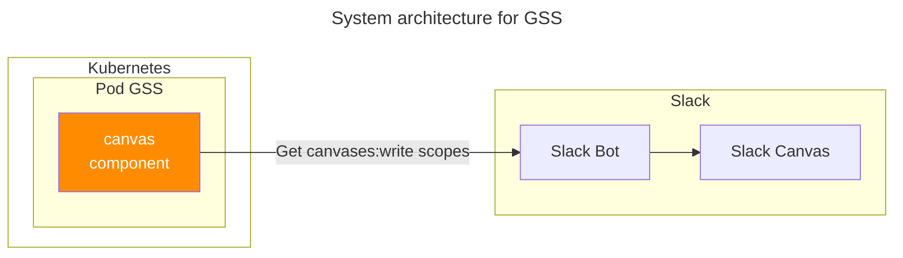

## Overview

[GSS](https://github.com/younsl/o/tree/main/box/kubernetes/gss) is a Kubernetes addon that scans scheduled workflows across GitHub Enterprise Server. It runs as a [CronJob](https://kubernetes.io/docs/concepts/workloads/controllers/cron-jobs/) and posts results to console or Slack Canvas.

## Why GSS exists

GitHub has a [known behavior](https://github.com/orgs/community/discussions/109354): when a GHES user is deleted (e.g., after leaving the company), all scheduled workflows last committed by that user stop running silently. No warning, no alert, no error — they just stop.

In a large org with 960+ repos, this leads to hidden CI/CD outages that are hard to trace. GSS makes this risk visible by scanning all scheduled workflows and tracking their last committer, so teams can fix at-risk workflows before they break.

## Features

- **Org-wide scan**: Scans all repos in a GHES organization
- **Fast**: Scans 900+ repos in about 20 seconds using async tasks
- **Status tracking**: Shows run status, last run time, and last committer per workflow
- **Timezone**: Auto UTC/KST conversion
- **Output**: Console or Slack Canvas

## Tech Stack

GSS was first built in Go, then ported to [Rust](https://www.rust-lang.org/) in November 2025 to match the team's Rust-based Kubernetes tooling. The rewrite brought:

- Smaller binary (~3.8MB vs ~12MB)
- Lower memory usage (~40MB vs ~80MB)
- No null pointer crashes thanks to compile-time safety

Async work is handled by Tokio.

## Setup

### Secret

Create a secret for the GitHub token:

```bash
kubectl create secret generic gss-secret \
  --namespace gss \
  --from-literal=GITHUB_TOKEN=ghp_xxxxxxxxxxxx
```

### Helm Chart

GHES and Slack settings are managed through the chart's `configMap.data` values. The Slack Canvas publisher needs `SLACK_TOKEN` (`xoxb-` bot token), `SLACK_CHANNEL_ID`, and `SLACK_CANVAS_ID`. See [values.yaml](https://github.com/younsl/o/tree/main/box/kubernetes/gss/charts/gss/values.yaml) for all options.

```bash
# Check available versions
crane ls ghcr.io/younsl/charts/gss

# Pull chart
helm pull oci://ghcr.io/younsl/charts/gss --version 0.1.0 --untar

# Install
helm install gss ./gss --namespace gss --create-namespace
```

### Slack Canvases API



GSS uses the Slack [Canvases API](https://api.slack.com/methods?query=canvases) to write scan results to a canvas page on each CronJob run.

## References

- [GSS source code](https://github.com/younsl/o/tree/main/box/kubernetes/gss)
- [Scheduled Github Action stops working if last committer deletes their accounts #109354](https://github.com/orgs/community/discussions/109354)
