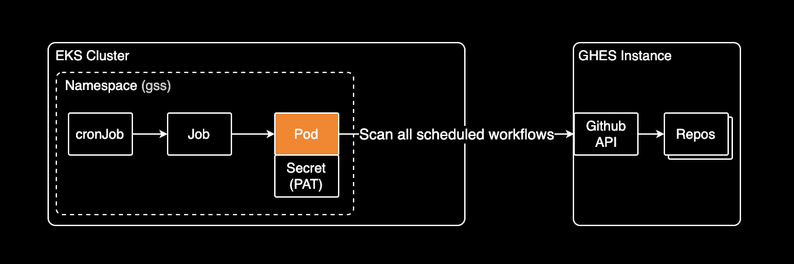
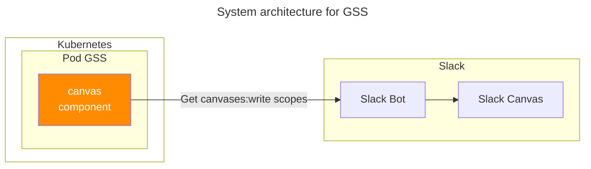

## 개요

이 문서는 GitHub Enterprise Server 환경에서 수백 개의 리포지토리에 분산된 스케줄 워크플로우를 효율적으로 모니터링하기 위해 개발한 오픈소스 도구 GSS(GHES Schedule Scanner)를 소개합니다.

레포지터리 개수가 960개 넘는 대규모 조직에서 CI/CD 워크플로우를 중앙 관리하며 겪은 성능 문제를 Go의 동시성으로 해결한 경험과 Kubernetes CronJob 및 Slack Canvas API를 활용한 자동화 구현 사례를 공유합니다.

## 배경지식

### GSS란?

[GSS(GHES Schedule Scanner)](https://github.com/younsl/gss)는 GitHub Enterprise Server의 스케줄된 워크플로우를 모니터링하고 분석하는 Kubernetes 애드온입니다. DevOps 및 SRE 팀이 CI/CD 워크플로우를 효율적으로 관리할 수 있도록 설계되었습니다.

### 주요 기능

- **조직 전체 워크플로우 스캐닝**: GitHub Enterprise Server의 모든 조직 리포지토리 스캔
- **고성능 병렬 처리**: Go 루틴을 활용하여 900개 이상의 리포지토리를 20-22초 내에 스캔
- **워크플로우 상태 모니터링**: 각 워크플로우의 실행 상태, 마지막 실행 시간, 커미터 정보 수집
- **타임존 지원**: UTC/KST 자동 변환
- **다양한 출력 형식**: 콘솔 출력 또는 Slack Canvas로 결과 발행

## 기술 스택

### 개발 언어

Go 1.25.0으로 개발되어 높은 성능과 동시성을 제공합니다. 컨테이너화되어 Kubernetes CronJob으로 주기적으로 실행되며, 매 시간 또는 원하는 스케줄에 따라 자동으로 워크플로우를 스캔합니다.

## 세부 정보

### 헬름 차트 지원

Kubernetes 배포를 위한 헬름 차트를 제공하여 쉽게 설치하고 관리할 수 있습니다.

### Slack canvases API

슬랙에서 제공하는 [Canvases API](https://api.slack.com/methods?query=canvases)로 캔버스 페이지를 CRUD 가능

### Scanning Output

GSS가 cronJob 스케줄에 맞춰 슬랙 캔버스에 Scheduled Workflow 기록

## 관련자료

개발할 때 참고할 만한 모범사례

- [Go Standard Project](https://github.com/golang-standards/project-layout)

Github:

- [GSS](https://github.com/younsl/gss)
