## 개요

AWS 네트워크 구성 시 참고하기 좋은 여러가지 패턴들을 모아놓은 가이드 문서입니다.

&nbsp;

## 네트워크 구성 사례

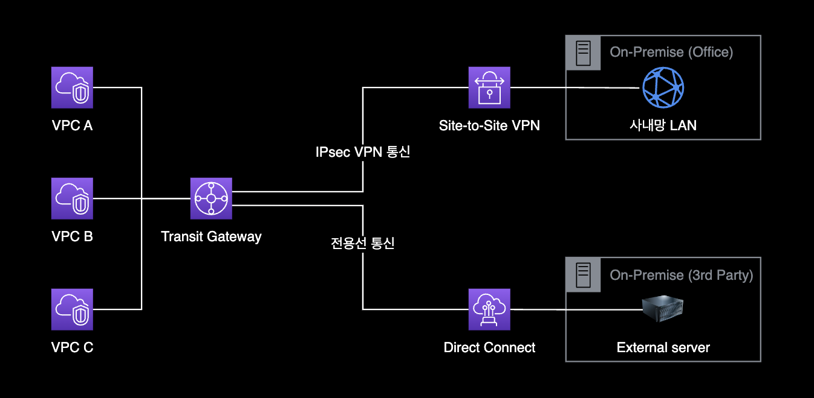

Transit Gateway는 VPN 및 Direct Connect 전용선을 모두 사용할 수 있습니다. Transit Gateway를 사용하면 VPC, 온프레미스 데이터 센터, 다른 AWS 계정에서 호스팅되는 VPC 등과 같은 여러 곳에서 사용할 수 있는 중앙 집중식 가상 프라이빗 네트워크를 구성할 수 있습니다. VPN을 사용하여 인터넷을 통해 안전하게 연결할 수 있고, 전용선을 사용하여 보다 안전하고 빠른 연결을 설정할 수 있습니다. 이를 통해 효율적이고 심플한 네트워크 구성을 유지할 수 있습니다.

&nbsp;

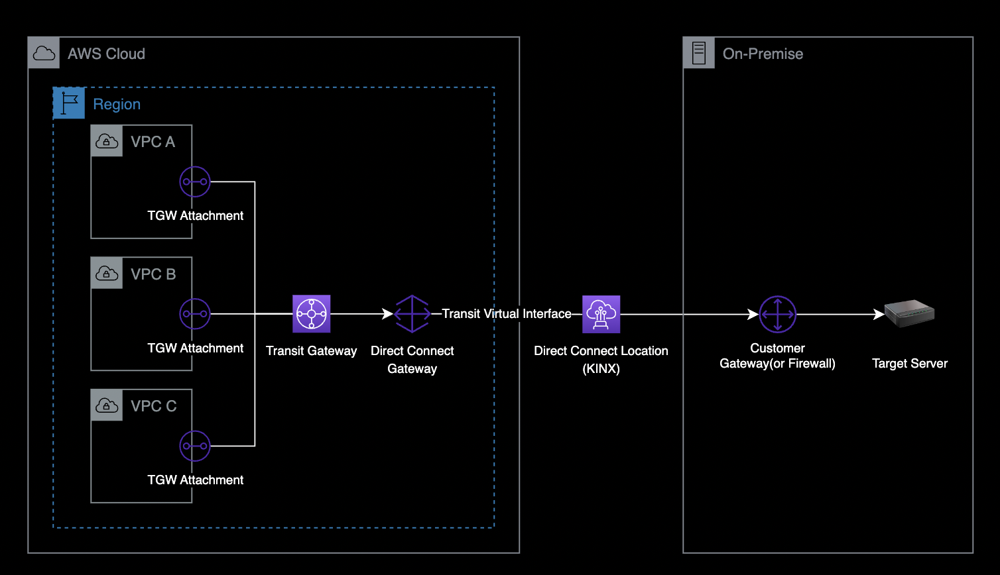

### Direct Connect (DX)

AWS Direct Connect는 회사 내부 네트워크 혹은 기존 데이터 센터 환경의 온프레미스 장비와 AWS 클라우드 네트워크를 전용 회선으로 연결하여, 하이브리드 클라우드 환경을 구축할 수 있는 네트워크 서비스입니다.  
전용 회선의 장점인 **높은 보안성** 및 **일관된 네트워크 대역폭**을 제공하고, AWS 서비스의 트래픽 비용 (Data transfer Out)을 절감시킬 수 있는 장점이 있습니다.

- 여러 개의 VPC 관리를 위해 기존에 Transit Gateway를 쓰는 인프라 환경의 경우, Direct Connect Gateway를 통해 연결할 수 있습니다.
- AWS Direct Connect Gateway에 연결할 수 있는 Transit Gateway 최대 개수는 3개입니다.
  - [AWS 공식문서](https://docs.aws.amazon.com/ko_kr/vpc/latest/tgw/transit-gateway-quotas.html#direct-connect-quotas)

&nbsp;

#### Direct Connect Locations

2024년 3월 6일 기준으로 서울 리전의 계약 가능한 Direct Connect Location 목록

- Digital Realty ICN10, Seoul, South Korea
- KINX, Seoul, South Korea
- LG U+ Pyeong-Chon Mega Center, Seoul, South Korea

더 자세한 정보는 [AWS DX Location 공식 문서](https://aws.amazon.com/ko/directconnect/locations/)를 참조합니다.

&nbsp;

#### Virtual Interface

줄여서 VIF라고 부릅니다. Virtual Interface는 DX Location 담당자와 통화하면서 연결 작업을 진행해야 합니다.  
이 때, AWS측의 가상 인터페이스 2개를 서로 BGP ASN을 동일하게 맞춰서 구성해주어야 합니다.

- **Private Virtual Interface** : 프라이빗 IP 주소를 사용하여 Amazon VPC에 액세스하려면 프라이빗 가상 인터페이스를 사용해야 합니다.
- **Public Virtual Interface** : 퍼블릭 가상 인터페이스는 퍼블릭 IP 주소를 사용하여 모든 AWS 퍼블릭 서비스에 액세스할 수 있습니다.
- **Transit Virtual Interface** : Direct Connect 게이트웨이와 연결된 하나 이상의 Amazon VPC 전송 게이트웨이에 액세스하려면 Transit Virtual Interface를 사용해야 합니다. 모든 속도의 AWS Direct Connect 전용 또는 호스팅 연결과 함께 전송 가상 인터페이스를 사용할 수 있습니다.

&nbsp;

#### VIF 타입 주의사항

Transit Gateway와 Direct Connect를 연결해서 사용하는 경우에는, Virtual Interface 타입을 Transit Virtual Interface만 사용할 수 있습니다.  
Private VIF나 Public VIF를 사용중인 경우, 아래와 같은 에러가 발생하면서 Direct Connect와 Transit Gateway를 연결할 수 없습니다.

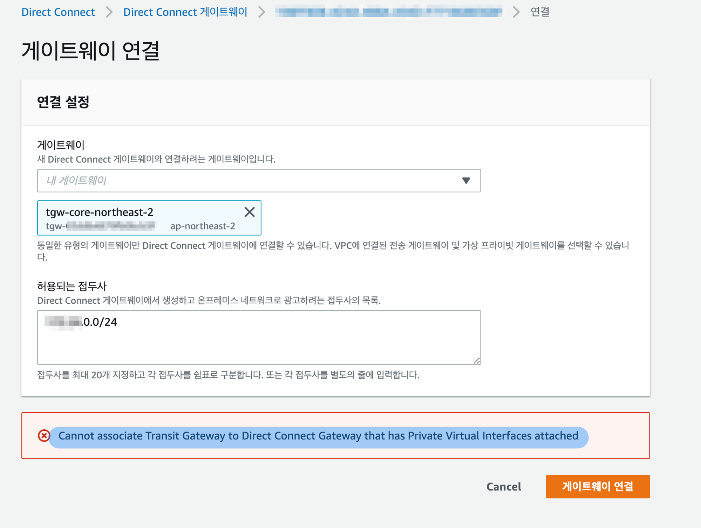

`Cannot associate Transit Gateway to Direct Connect Gateway that has Private Virtual Interfaces attached`

&nbsp;

Virtual Interface의 잘못된 타입으로 인해 [Direct Connect Gateway](https://docs.aws.amazon.com/ko_kr/directconnect/latest/UserGuide/direct-connect-gateways-intro.html)와 Transit Gateway를 연결하지 못하는 상황을 표현한 구성도입니다.

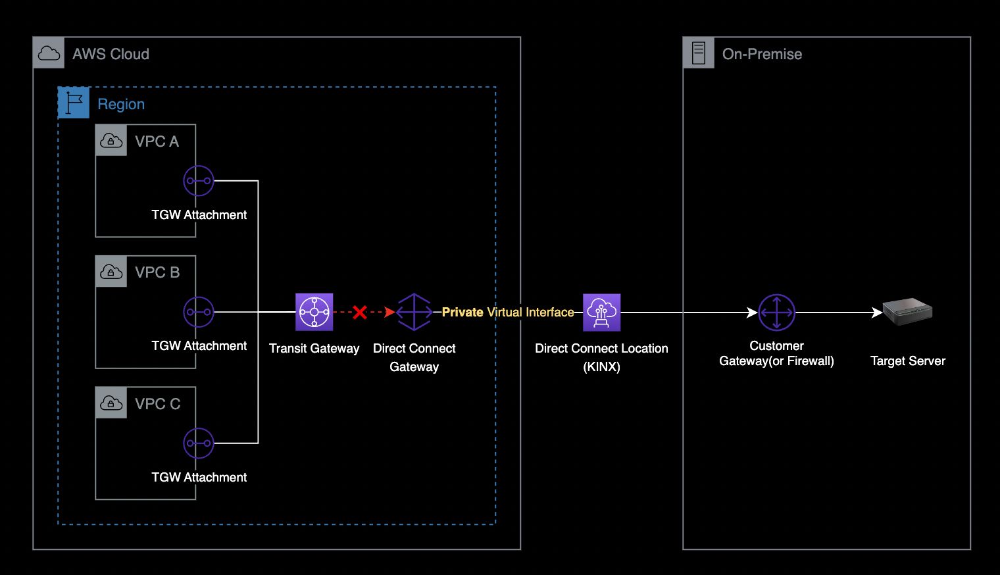

이 경우, 다음 순서대로 Virtual Interface 오류를 조치합니다.

- 기존에 생성한 Private 타입의 Virtual Interface를 삭제
- Virtual Interface를 생성합니다. 이 때 반드시 Transit 타입으로 생성합니다.
  - 자세한 Transit VIF 생성 방법은 [AWS 공식문서](https://docs.aws.amazon.com/directconnect/latest/UserGuide/create-vif.html#create-transit-vif)를 참조합니다.
- Transit Virtual Interface를 다시 활성화하기 위해 BGP Config 파일을 다운로드 받기
  - AWS 콘솔 → Direct Connect → Virtual interfaces → VIF 클릭 → Actions → Download → Sample configuration
- 다운로드 받은 새로운 BGP 설정 파일을 메일 또는 지정된 수단을 사용해 DX Location 네트워크 담당자에게 전달합니다.
- BGP 구성 작업이 끝나면 Transit Virtual Interface가 `available` 상태로 변합니다.

&nbsp;

### Transit Gateway

Transit Gateway는 AWS의 네트워크 중앙 허브입니다.  
다음과 같은 연결이 필요한 경우 Transit Gateway를 사용합니다.

- VPC와 VPC간의 연결
- VPC와 온프레미스 데이터세터 연결이 필요한 경우 중간다리 역할
- VPC - Transit Gateway - DX 구성
- VPC - Transit Gateway - Customer Gateway 구성 (Site to Site VPN)

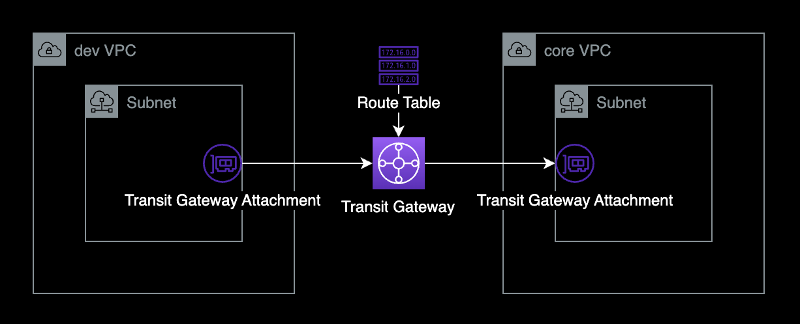

VPC와 VPC를 연결하면 Transit Gateway Attachment(ENI)가 지정된 서브넷에 생성됩니다.
이를 통해 Transit Gateway로 트래픽을 송수신합니다.

Transit Gateway 구축 시에는 AWS 공식문서의 [Transit Gateway 설계 모범 사례](https://docs.aws.amazon.com/ko_kr/vpc/latest/tgw/tgw-best-design-practices.html)를 준수해서 만들기를 권장합니다.

&nbsp;

Transit Gateway에 라우팅 룰은 크게 2가지로 구분됩니다.

- **Static** : 관리자가 직접 Destination IP 대역과 라우팅 방향을 지정한 룰
- **Propagated** : Propagation을 등록하면 해당 VPC 대역이 Transit Gateway 라우팅 테이블에 자동으로 추가됩니다. 이 때, 자동 추가된 라우팅 룰의 타입은 Propagated 입니다.

&nbsp;

### VPC Endpoint 통합

여러 개의 VPC 환경에서 S3, KMS, SNS 등의 엔드포인트를 하나의 계정에서 통합관리 하기

VPC Endpoint는 크게 2가지 타입으로 구분됩니다.

- Interface Endpoint
- Gateway Endpoint

&nbsp;

Interface Endpoint를 사용하면 여러 개의 VPC의 Private Subnet에서 공통으로 사용하는 서비스 S3, KMS, ECR 등의 엔드포인트를 통합 관리할 수 있습니다.

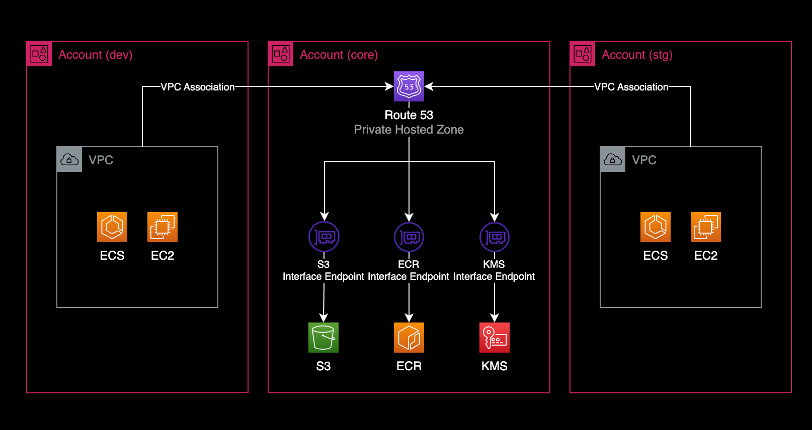

생성절차는 다음과 같습니다.

- VPC Endpoint 생성
  - VPC Endpoint의 타입은 Interface 타입으로 생성합니다.
- VPC Endpoint에서 Private DNS names enabled 비활성화

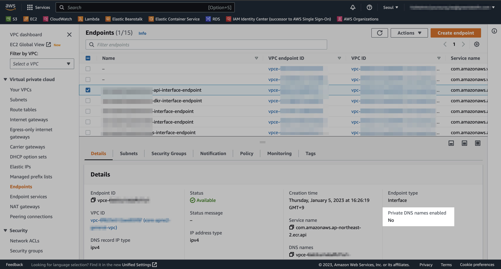

- Route 53에서 Private hosted zone 생성

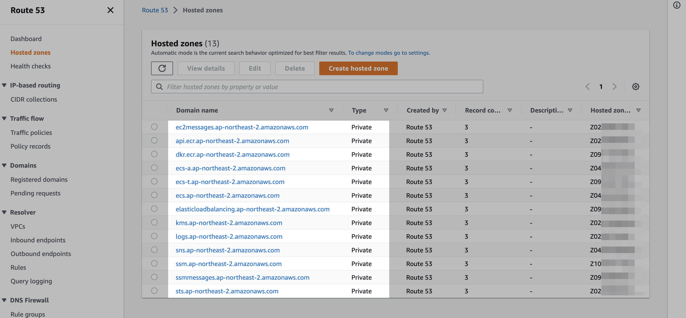

- 각 Private hosted zone마다 A 레코드로 VPC 엔드포인트를 추가합니다.

**참고자료**  
[AWS VPC PrivateLink를 이용한 네트워크 구성 전략(박병진) - 당근 SRE 밋업 1회](https://www.youtube.com/watch?v=tBZBYozvTO8)

&nbsp;

### Route 53 Inbound Resolver

온프레미스 데이터센터에서 AWS Private DNS 사용하고 싶을 경우 Route 53 Inbound Resolver를 생성하면 됩니다.  

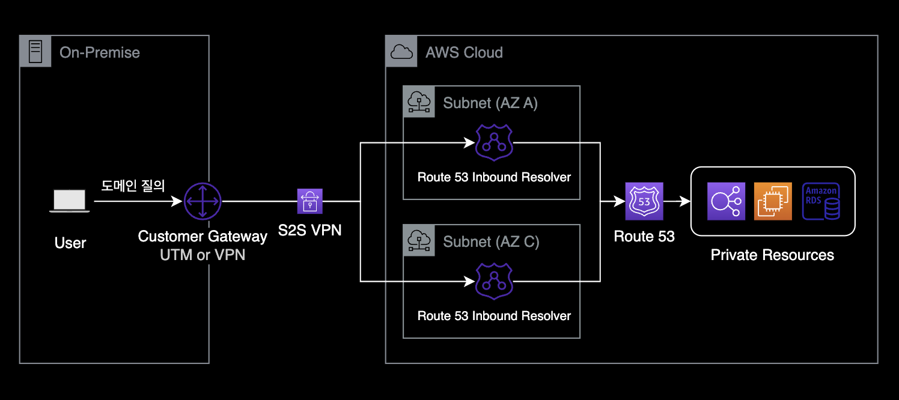

- Route 53 Inbound Resolver를 생성하면 각 서브넷마다 ENI 형태로 생성됩니다.
- Inbound Resolver의 IP는 Private IP이기 때문에 외부에서 Inbound Resolver를 통해 AWS 내부로 질의하기 위해서는 VPN 또는 Direct Connect 등으로 연결되어 있어야 합니다.
  - [**AWS 공식문서** VPC로 인바운드 DNS 쿼리 전달](https://docs.aws.amazon.com/ko_kr/Route53/latest/DeveloperGuide/resolver-forwarding-inbound-queries.html)

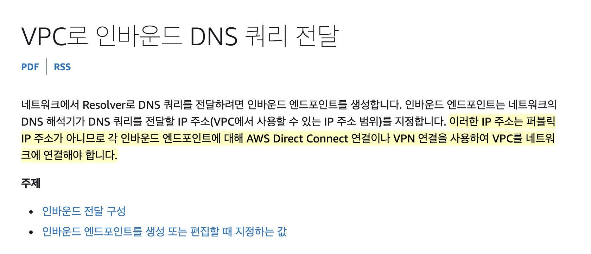

- 두 개 이상의 서로 다른 가용 영역에 Route 53 Inbound Resolver를 생성하는 게 모범 사례입니다.
  - [**AWS Knowledge Center** 원격 네트워크에서 프라이빗 호스팅 영역의 DNS 레코드를 확인하도록 Route 53 Resolver 인바운드 엔드포인트를 구성하려면 어떻게 해야 합니까?
](https://aws.amazon.com/ko/premiumsupport/knowledge-center/route53-resolve-with-inbound-endpoint/)
- Route 53 Inbound Resolver는 최소 2개 ~ 최대 6개까지 동시 사용이 가능합니다.
  - 아쉽게도 1개만 생성 못하고 최소 2개를 사용해야 합니다.
- Route 53 Inbound Resolver의 비용
  - 엔드포인트 ENI 1개마다 비용이 0.125/1h USD 발생합니다.
  - [Route 53 Resolver 엔드포인트 비용](https://aws.amazon.com/ko/route53/pricing/)

&nbsp;

### SSM Session Manager

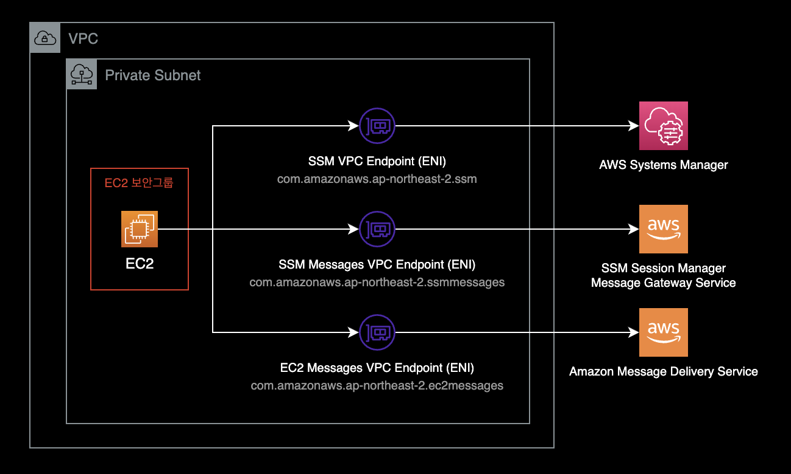

Private Subnet에 위치한 EC2 인스턴스에 SSM Sessions Manager를 접속하기 위해서는 3개의 VPC Endpoint 등록이 필요합니다.

```bash
1 | Interface Type | com.amazonaws.REGION.ssmmessages  
2 | Interface Type | com.amazonaws.REGION.ec2messages  
3 | Interface Type | com.amazonaws.REGION.ssm
```

&nbsp;

SSM Session Manager용 VPC Endpoint를 구성할 때에는 아래 문서들을 참고하면 좋습니다.

[Systems Manager를 사용하여 인터넷 액세스 없이 프라이빗 EC2 인스턴스를 관리할 수 있도록 VPC 엔드포인트를 생성하려면 어떻게 해야 합니까?](https://aws.amazon.com/ko/premiumsupport/knowledge-center/ec2-systems-manager-vpc-endpoints/)  
AWS Knowledge Center

[Automated configuration of Session Manager without an internet gateway](https://aws.amazon.com/ko/blogs/mt/automated-configuration-of-session-manager-without-an-internet-gateway/)  
AWS Blog

[Step 5: Create VPC endpoints](https://docs.aws.amazon.com/systems-manager/latest/userguide/setup-create-vpc.html)  
SSM Session Manager에 필요한 VPC Endpoint 생성 가이드

&nbsp;

### SSM Session Manager 중앙집중식 로깅

서버 원격관리 방식으로 SSM Session Manager를 사용하는 경우 중앙집중식으로 SSM 로깅을 할 수 있습니다.

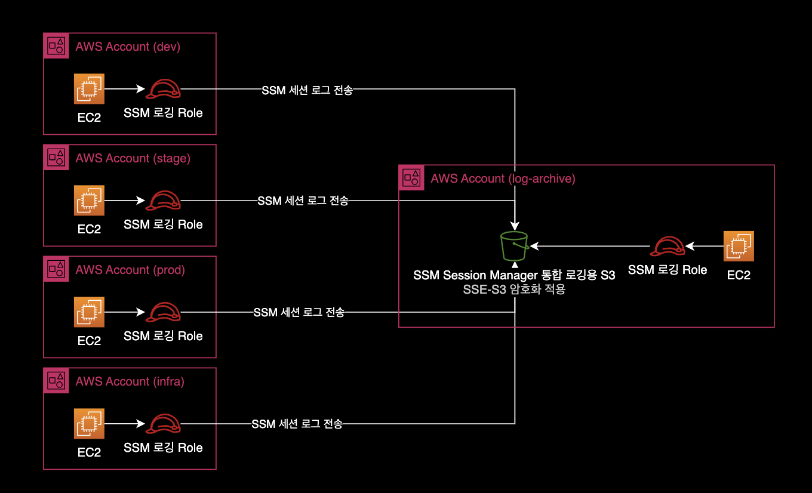

여러 AWS 계정의 SSM 로그를 지정된 하나의 AWS 계정으로 모으면 다음과 같은 장점이 있습니다.

- **간결한 시스템 아키텍쳐** : 인프라 유지보수가 더 수월해집니다.
- **로그 접근성 향상** : 하나의 버킷에서 전체 AWS 계정의 로그를 한 눈에 볼 수 있어서 운영이 편리하고 접근성이 더 좋아집니다.

&nbsp;

S3 버킷에 저장된 SSM Session Manager 로그에는 아래와 같이 접속 시간, 실행한 명령어와 결과가 저장됩니다.

```bash
Script started on 2023-01-19 07:10:08+0000
[?1034hsh-4.2$ 
[Ksh-4.2$ 

sh-4.2$ uptime

 07:09:57 up 39 min,  0 users,  load average: 0.00, 0.00, 0.00

sh-4.2$ exit

exit

Script done on 2023-01-19 07:10:08+0000
```

&nbsp;

중앙 로깅용 S3 버킷 정책<sup>Bucket Policy</sup>의 예시는 다음과 같습니다.

```json
{
    "Version": "2012-10-17",
    "Statement": [
        {
            "Sid": "AllowLoggingSSMFromCrossAccountInstances",
            "Effect": "Allow",
            "Principal": {
                "AWS": "*"
            },
            "Action": [
                "s3:PutObjectAcl",
                "s3:PutObject",
                "s3:GetEncryptionConfiguration"
            ],
            "Resource": [
                "arn:aws:s3:::<YOUR_SSM_LOGGING_BUCKET_NAME>",
                "arn:aws:s3:::<YOUR_SSM_LOGGING_BUCKET_NAME>/*"
            ],
            "Condition": {
                "StringEquals": {
                    "aws:PrincipalOrgID": "<YOUR_AWS_ORGANIZATION_ID>"
                }
            }
        },
        {
            "Sid": "DenyDeleteBucketFromAnyone",
            "Effect": "Deny",
            "Principal": {
                "AWS": "*"
            },
            "Action": "s3:DeleteBucket",
            "Resource": "arn:aws:s3:::<YOUR-SSM-LOGGING-BUCKET-NAME>"
        }
    ]
}
```

&nbsp;

### 하나의 ALB에서 여러 도메인 라우팅

HTTPS Listener Rule을 사용하면 동일한 로드 밸런서에서 여러 도메인에 따라 백엔드 서버를 다르게 보낼 수 있습니다.  
도메인을 구분하는 방법은 Listener Rule의 조건문에서 Host Header를 사용하면 됩니다.

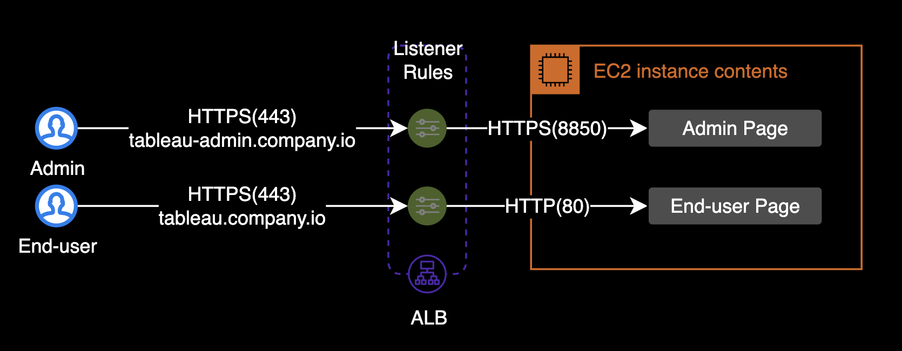

[Application Load Balancer를 사용하여 호스트 기반 라우팅을 설정하려면 어떻게 해야 합니까?](https://aws.amazon.com/ko/premiumsupport/knowledge-center/elb-configure-host-based-routing-alb/)  
AWS 공식 가이드

&nbsp;

### QueryPie

QueryPie Proxy 기능을 활용하여 EC2 인스턴스가 DB에 직접 접근하지 않고, QueryPie를 통해 경유해 접속하도록 안전한 DB 접속 경로를 제공합니다.

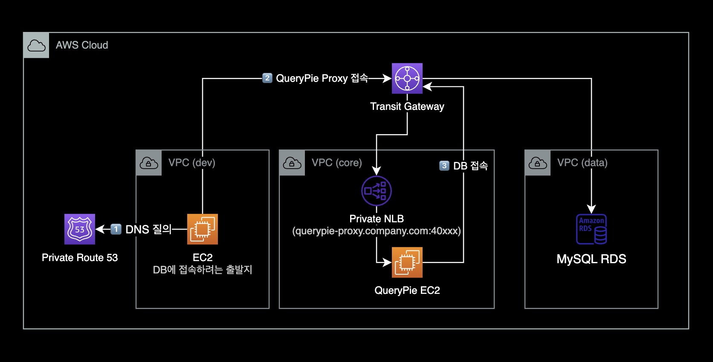

&nbsp;

### Central Egress

[Centralized egress to internet](https://docs.aws.amazon.com/whitepapers/latest/building-scalable-secure-multi-vpc-network-infrastructure/centralized-egress-to-internet.html)

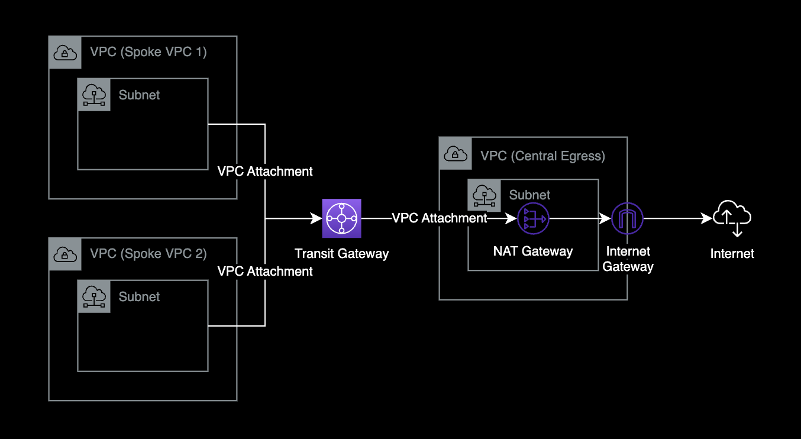

- 네트워크 중앙 허브 역할을 하는 [Transit Gateway](https://docs.aws.amazon.com/whitepapers/latest/building-scalable-secure-multi-vpc-network-infrastructure/amazon-vpc-sharing.html) 리소스를 사용하여 여러 개의 VPC를 연결합니다.
- Central Egress로 구성하게 되면 하나의 VPC에서만 NAT Gateway를 운영하므로 비용 절감 가능.
  - 각각의 VPC마다 NAT Gateway를 만드는 경우 시간당 Endpoint 비용이 청구되므로 비용이 많이 나감.
- 아웃바운드로 나가는 경로가 하나로 통합되어 인터넷 아웃바운드 트래픽에 대한 로깅 및 감사 편리
