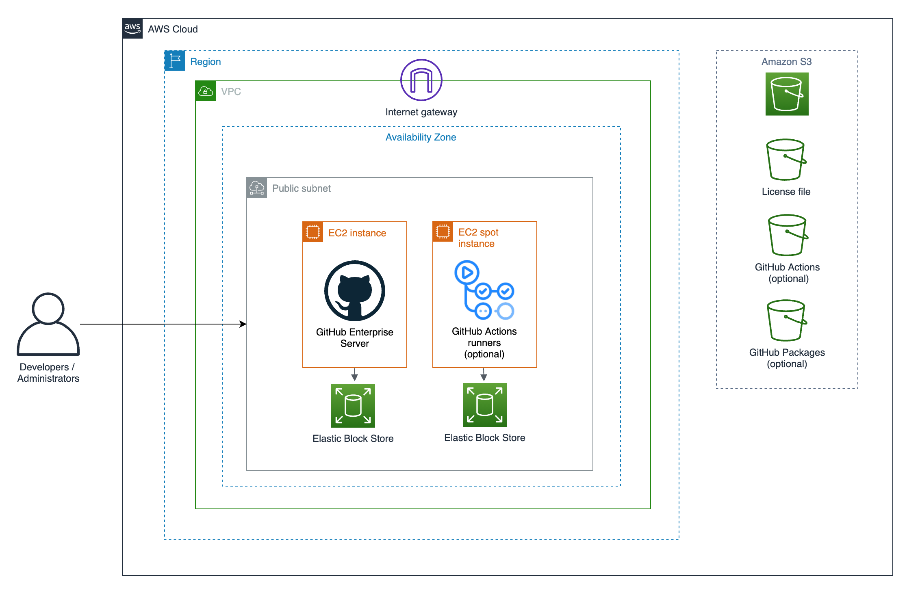
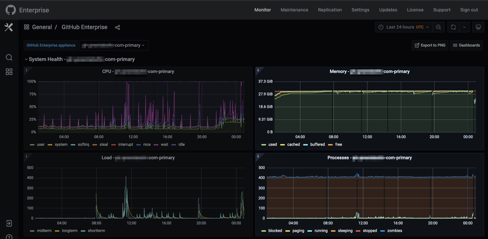
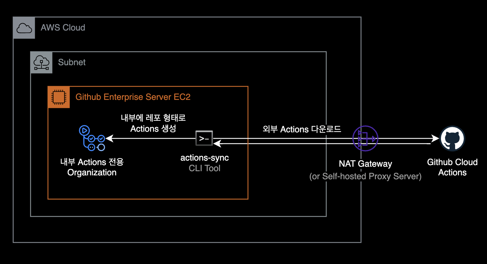
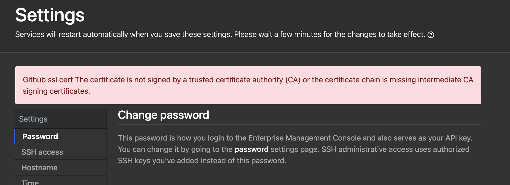
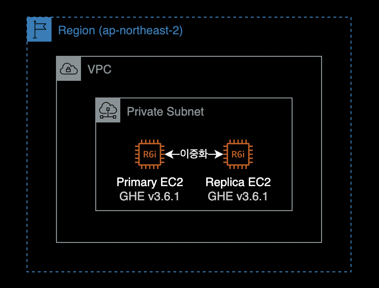
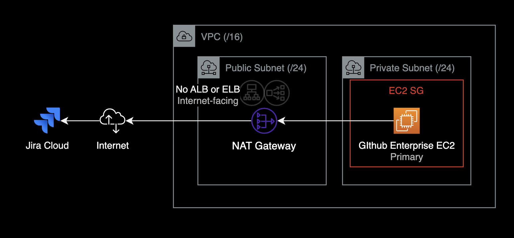
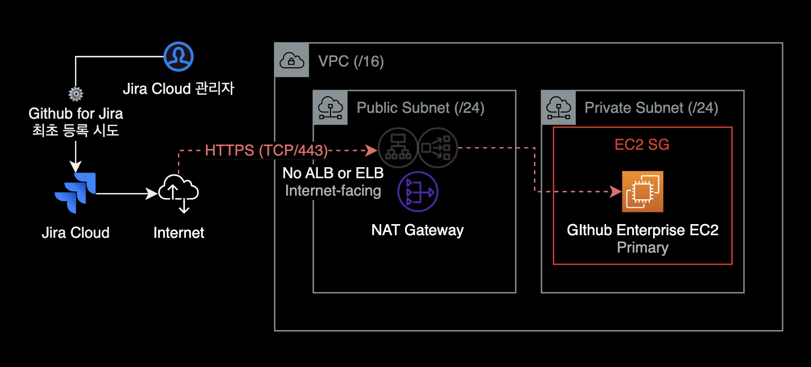
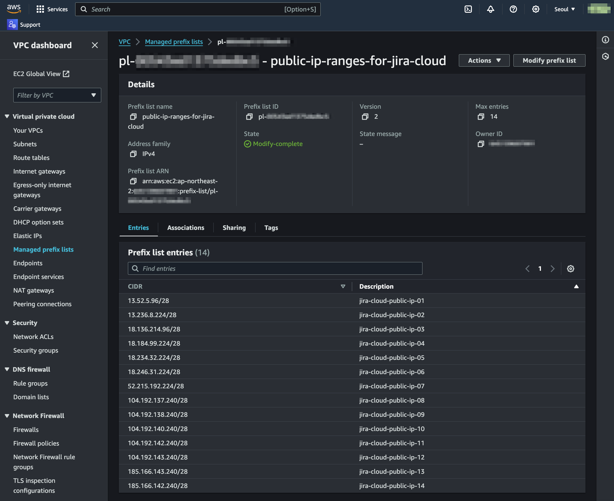
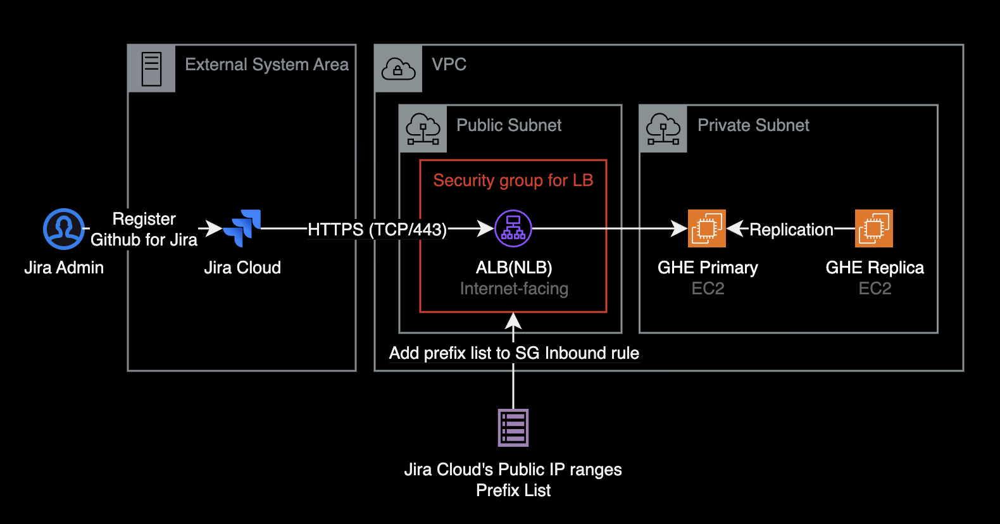
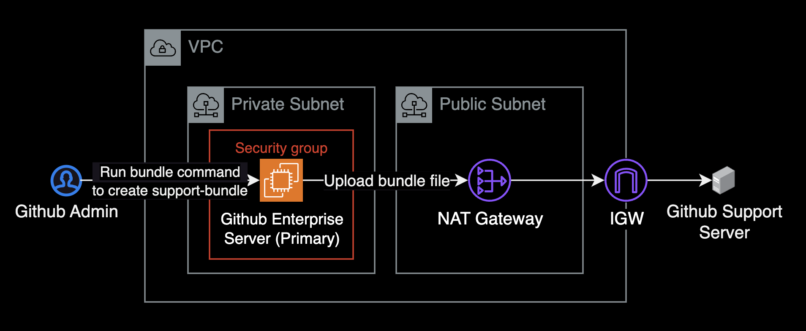

## 개요

금융당국의 규제<sup>Compliance</sup>를 준수하기 위해 핀테크에서는 Github Cloud가 아닌 Github Enterprise를 EC2에 배포해서 자체 운영 & 사용했습니다.

&nbsp;

토스뱅크, 당근페이, 그린랩스 파이낸셜 등의 핀테크 기업의 경우 금융이라는 도메인 특성 때문에 Github Cloud를 사용하지 못하는 한계 때문에 버전 컨트롤 시스템으로 Github Enterprise Server를 사용합니다.

&nbsp;

아래는 Github Enterprise 공식문서에 나와있는 Github Enterprise Server의 시스템 아키텍처입니다.



Github Enterprise Server는 기본적으로 Internet Gateway와 NAT Gateway를 통해 인터넷과 연결되어 있지 않아도 문제 없이 사용 가능하도록 설계되어 있습니다.

&nbsp;

## 참고자료

[AWS | Github Enterprise on AWS 소개](https://aws.amazon.com/ko/quickstart/architecture/github-enterprise/)  
[Github | 라이센스 신청](https://enterprise.github.com/trial?ref_cta=Start+a+free+trial&ref_loc=hero&ref_page=%2Fenterprise&source=pricing-card-enterprise)  
[Github | AWS 설치 가이드](https://docs.github.com/en/enterprise-server@3.2/admin/installation/setting-up-a-github-enterprise-server-instance/installing-github-enterprise-server-on-aws)  
[Youtube | 당근페이, 6개월 간의 인프라 구축 이야기(강진우) - 당근 SRE 밋업 2회](https://www.youtube.com/watch?v=8a2-b9X7Xno)

&nbsp;

## 가이드

&nbsp;

---

&nbsp;

### Github Enterprise EC2의 인스턴스 타입 선정

#### EC2 인스턴스 타입 선정

[GitHub Enterprise Server 공식문서](https://docs.github.com/en/enterprise-server@3.2/admin/installation/setting-up-a-github-enterprise-server-instance/installing-github-enterprise-server-on-aws#determining-the-instance-type)에서는 EC2 인스턴스 타입으로 [메모리 최적화 타입](https://aws.amazon.com/ko/ec2/instance-types/#Memory_Optimized) 사용을 권장합니다.

당근페이는 Github Enterprise EC2의 타입으로 `m5.4xlarge`를 사용했으며, EC2 2대로 구성하여 [Primary - Secondary](https://docs.github.com/en/enterprise-server@3.6/admin/enterprise-management/configuring-high-availability) 구조로 운영했습니다.

&nbsp;

**메모리 부족 현상**  
제 경우 Github Enterprise를 초기에 `m5.4xlarge` 타입을 선정했습니다. 이후 메모리 부족으로 서버에 구동중인 도커 컨테이너 일부가 메모리 부족으로 재시작되는 증상이 발생했고, 이로 인해 개발자분들이 순간적으로 짧은 시간동안 깃허브 서버에 접속하지 못하는 증상이 하루에 2~3회 정도 반복되었습니다.



이 문제를 해결하는 방법은 메모리 증설입니다. 제 경우 인스턴스의 메모리 용량을 늘리기 위해 EC2 인스턴스 타입을 `m5.4xlarge` → `r6i.2xlarge`로 변경한 후 증상은 완전히 사라졌습니다.

&nbsp;

#### AMI

Github Enterprise AMI는 Amazon Linux와 달리 SSM Agent가 기본적으로 설치되어 있지 않기 때문에, Session Manager를 통한 원격 접속이 필요할 경우, 서버에 별도 에이전트 설치 과정이 필요합니다.

Github Enterprise 3.6의 경우 Debian 10 베이스이며 아래 Userdata를 통해 EC2 생성시 SSM Agent를 자동 설치할 수 있습니다.

```bash
#!/bin/bash
mkdir /tmp/ssm
cd /tmp/ssm
wget https://s3.amazonaws.com/ec2-downloads-windows/SSMAgent/latest/debian_amd64/amazon-ssm-agent.deb
sudo dpkg -i amazon-ssm-agent.deb
sudo systemctl enable amazon-ssm-agent
```

운영체제별 SSM Agent 설치 스크립트는 [AWS 공식문서](https://aws.amazon.com/ko/premiumsupport/knowledge-center/install-ssm-agent-ec2-linux/)에서 확인할 수 있습니다.

&nbsp;

---

&nbsp;

### Github Actions

Github Enterprise 서버는 기본적으로 Github Actions가 활성화되어 있지 않습니다.

- Github Enterprise Server에서 Github Actions 기능 활성화
- Github Actions Runners EC2 인스턴스 생성
  - Github Actions 자체가 실행시간이 짧고 빈번히 발생하는 작업들이 많기 때문에 비용절약 측면에서 On-demand 보다는 Spot Instance로 사용하는 걸 권장합니다.
- Github Enterprise Server와 Github Action Runners 연동 작업

&nbsp;

#### 아티팩트 저장소

- Github Actions를 사용하려면 S3와 연동이 필요합니다.
- S3에는 Actions로 생성되는 아티펙트, 캐시, 로그 등이 보관됩니다.
- github.com의 Actions를 사용하려면 Github Enterprise EC2에서 Github Connect와 연동이 필요합니다.

&nbsp;

### actions-sync



- Github Actions의 경우 금융 컴플라이언스 유지를 위해 직접 Github Cloud에 있는 Actions 레포들을 Github Enterprise 서버 내부로 가져왔습니다.
- 외부 깃허브에 있는 Action을 내부 서버로 가져올 때는 [actions-sync](https://docs.github.com/ko/enterprise-server@3.6/admin/github-actions/managing-access-to-actions-from-githubcom/manually-syncing-actions-from-githubcom#about-the-actions-sync-tool)라는 CLI 툴을 사용합니다.

&nbsp;

#### actions-sync 설치

Github Enterprise Primary 서버에서 `actions-sync`를 설치합니다.  
인터넷 아웃바운드가 가능한 네트워크 구성이어야 설치파일을 다운로드 할 수 있습니다.

```bash
$ wget https://github.com/actions/actions-sync/releases/download/v202211070205/gh_202211070205_linux_386.tar.gz
$ tar -zxvf gh_202211070205_linux_386.tar.gz
```

```bash
# actions-sync 명령어 동작 확인
$ actions-sync version
GHES Actions Sync v0.2
```

&nbsp;

`actions-sync`로 Actions을 동기화하려면 Personal Access Token을 발급한 유저가 `actions` Organization에 오너로 소속되어 있어야 합니다.

사이트 관리자는 SSH로 GHE Primary 서버에 접속해서 `ghe-org-admin-promote` 명령어로 지정한 사용자를 Actions 조직의 Owner로 승격할 수 있습니다.

```bash
$ ghe-org-admin-promote \
    -u <PAT_OWNER_USERNAME> \
    -o actions
```

&nbsp;

#### actions-sync 사용법

Github Cloud에서 Actions **여러 개**를 한 번에 받아옵니다.

```bash
$ actions-sync sync \
    --cache-dir "/tmp/cache" \
    --destination-token "ghp_YOUR_GITHUB_ENTERPRISE_PAT" \
    --destination-url "https://your.ghedomain.com" \
    --repo-name-list-file "./sync-actions-list-2.txt"
```

&nbsp;

Github Cloud에서 **특정 Actions 하나**만 받아옵니다.

```bash
$ actions-sync sync \
    --cache-dir "/tmp/cache" \
    --destination-token "ghp_GITHUB_ENTERPRISE_PAT_HERE" \
    --destination-url "https://your.ghedomain.com" \
    --repo-name wzieba/Firebase-Distribution-Github-Action:synced-actions/Firebase-Distribution-Github-Action
```

&nbsp;

#### 트러블슈팅 가이드

<details>
<summary>Personal Access Token 권한 에러</summary>

actions-sync에 사용할 Personal Access Token에는 `workflow` 스코프 권한이 부여되어 있어야 합니다.

PAT에 `workflow` 스코프 권한이 없는 경우, `actions-sync` 명령어를 실행하면 다음과 같은 에러가 발생합니다.

```bash
error syncing repository `actions/action-slack`: failed to push to repo: https://github.company.com/actions/action-slack.git: command error on refs/heads/master: refusing to allow a Personal Access Token to create or update workflow `.github/workflows/release.yml` without `workflow` scope
```

&nbsp;

`actions-sync` 명령어에 사용하는 Personal Access Token에 다음 2개 권한<sup>Scope</sup>이 부여되어 있는지 확인하세요.

- `repo:*` : Full control of private repositories
- `workflow` : Update GitHub Action workflows

&nbsp;

참고로 Github Enterprise Server v3.10 부터는 Github Cloud와 동일하게 [Fine-grained Personal Access Token](https://docs.github.com/en/enterprise-server@3.10/authentication/keeping-your-account-and-data-secure/managing-your-personal-access-tokens#creating-a-fine-grained-personal-access-token)을 정식 지원합니다.

</details>

&nbsp;

<details>
<summary>403 You need admin access to the organization before 에러 해결방법 </summary>

#### 증상

actions-sync를 사용해서 Github Cloud에 있는 `action-slack` Actions을 가져옵니다.

```bash
$ ./actions-sync sync \
  --cache-dir "/tmp/cache" \
  --destination-token "ghp_YOUR_GITHUB_ENTERPRISE_PAT" \
  --destination-url "https://github.company.com" \
  --repo-name 8398a7/action-slack:actions/action-slack
```

```bash
fetching * refs for 8398a7/action-slack ...
not using impersonation for the requests
syncing `actions/action-slack`
error creating github repository `actions/action-slack`: error creating organization actions: POST https://github.company.com/api/v3/admin/organizations: 404 Not Found []
```

하지만 `404 Not Found []` 에러가 발생합니다.

&nbsp;

#### 원인

Primary 서버의 CPU 아키텍처와 actions-sync CLI의 아키텍처가 달라서 발생한 원인이었습니다.

제 경우 x86_64 (64bit) 기반의 EC2 인스턴스에서 386 (32bit) actions-sync 명령어를 실행하는 환경이었습니다.

&nbsp;

#### 해결방법

서버 CPU 아키텍처와 동일한 `actions-sync`를 다운로드 받아서 다시 실행하면 됩니다.

&nbsp;

#### 상세 해결기록

Primary Github Enterprise 서버의 CPU 아키텍처를 확인합니다.

```bash
# Run this command on the primary server.
$ arch
x86_64
```

CPU 아키텍처가 `x86_64`로 확인됩니다.

Github Cloud에 업로드된 [actions-sync](https://github.com/actions/actions-sync/releases)를 다운로드 받습니다.

```bash
$ wget https://github.com/actions/actions-sync/releases/download/v202303192358/gh_202303192358_linux_amd64.tar.gz
--2023-06-29 12:38:25--  https://github.com/actions/actions-sync/releases/download/v202303192358/gh_202303192358_linux_amd64.tar.gz
```

압축을 해제한 후 `actions-sync` 명령어 파일이 있는 `bin` 디렉토리로 이동합니다.

```bash
$ tar -zxvf gh_202303192358_linux_amd64.tar.gz
$ cd bin
```

&nbsp;

`actions-sync` 명령어를 다시 실행합니다.

```bash
$ ./actions-sync sync \
    --cache-dir "/tmp/cache" \
    --destination-token "ghp_YOUR_GITHUB_ENTERPRISE_PAT" \
    --destination-url "https://github.company.com" \
    --repo-name 8398a7/action-slack:actions/action-slack
```

```bash
fetching * refs for 8398a7/action-slack ...
not using impersonation for the requests
syncing `actions/action-slack`
Existing repo `actions/action-slack`
successfully synced `actions/action-slack`
```

Github Cloud에 업로드된 actions/actions-slack을 받은 후 로컬 Actions Organization에 업로드했습니다.

</details>

&nbsp;

---

&nbsp;

### TLS 인증서 설치

Management Console에서 Request TLS Certificate 버튼을 눌러서 웹 인증서를 설치한 후 적용하려고 하면 아래와 같이 에러가 발생함.



**관련 문서**  
[About Let's Encrypt support](https://docs.github.com/en/enterprise-server@3.3/admin/configuration/configuring-network-settings/configuring-tls#about-lets-encrypt-support)

&nbsp;

깃허브 본사로부터 티켓 답변 받은 해결방법입니다.  
제 경우 업무 환경에서 실제로 아래 방법으로 SSL 인증서 문제를 해결할 수 있었습니다.

```bash
$ ghe-ssl-acme -x     # 기존 SSL 인증서 설정 초기화
$ ghe-ssl-acme -e -v  # Let's Encrypt에게 SSL 인증서 요청/발급

# Show status of whether ACME certificates are enabled, and additional details
$ ghe-ssl-acme -s
SSL enabled:           true
Active certificate CA: Let's Encrypt
ACME enabled:          true
ACME provider:         letsencrypt
ACME ToS accepted:     true
ACME Contact E-mail:
ACME Account Key:      (key is set; retrieve with `ghe-config "secrets.acme.account-key"`)
ACME CA conf string:   (CA conf is set; retrieve with `ghe-config "github-ssl.acme.ca-conf"`)
```

`ghe-ssl-acme -e -v` 명령어를 실행하면 Let's Encrypt로부터 SSL 인증서를 발급받습니다.

&nbsp;

#### 인증서 발급 시 네트워크 구성 체크리스트

- 이 때, Github Enterprise 서버가 squid와 같은 Proxy 서버를 사용하는 환경일 경우 Proxy 서버에서 `.letsencrypt.org` 도메인을 아웃바운드 허용해야 인증서를 발급받을 수 있습니다.
- Github Enterprise EC2 보안그룹에 **인바운드** 80 포트가 열려있어야 Let's Encrypt 인증서를 정상적으로 받아올 수 있습니다.

&nbsp;

위 명령어 절차를 실행하고도 SSL 인증서 문제가 해결되지 않을 경우, 아래 명령어 결과를 깃허브 티켓 담당자에게 공유하도록 합니다.

```bash
$ openssl s_client -connect <hostname>:<port> -servername <hostname> | openssl x509 -text -noout
```

&nbsp;

---

&nbsp;

### SMTP

Github Enterprise EC2가 Amazon SES의 SMTP를 사용해 메일을 보낼 수 있습니다.  
그러나 AWS에서는 기본적으로 SMTP 25번 포트를 사용한 SMTP 아웃바운드를 허용하지 않습니다.  
따라서 EC2 인스턴스가 메일을 보내려면 SMTP 포트(TCP/25)를 사용하기 위해 AWS에 별도 신청해야 합니다.

[관련 AWS 문서](https://aws.amazon.com/ko/premiumsupport/knowledge-center/ec2-port-25-throttle/)  
[GHE v3.6 Email Notification](https://docs.github.com/en/enterprise-server@3.6/admin/configuration/configuring-your-enterprise/configuring-email-for-notifications)

&nbsp;

---

&nbsp;

### 이중화 구성

Github Enterprise의 이중화는 Primary - Replica 구조로 구성할 수 있습니다.



자세한 이중화 구성 방법은 제가 작성한 [Github Enterprise EC2 이중화 설정](/blog/ghe-replication/)을 참조하세요.

Github Enterprise의 서버 이중화 구성은 [Github Enterprise 공식문서](https://docs.github.com/en/enterprise-server@3.6/admin/enterprise-management/configuring-high-availability/about-high-availability-configuration#ghe-repl-status)에도 상세하게 나와있습니다.

#### 이중화 상태 체크 명령어

Replica 서버에서 이중화 상태를 확인합니다.

```bash
# Run on REPLICA instance.
$ ghe-repl-status
```

&nbsp;

Primary 서버에서도 `--replica` 옵션을 사용하면 이중화 상태를 확인할 수 있습니다.

```bash
# Run on PRIMARY instance.
$ ghe-cluster-each --replica 'ghe-repl-status'
```

&nbsp;

#### Failover 조치하기

장애 조치에 필요한 시간은 수동으로 복제본을 승격하고 트래픽을 리디렉션하는 데 걸리는 시간에 따라 다릅니다.  
평균 시간은 20~30분 걸립니다.

[Github Enterprise 공식문서](https://docs.github.com/en/enterprise-server@3.6/admin/enterprise-management/configuring-high-availability/initiating-a-failover-to-your-replica-appliance)

&nbsp;

---

&nbsp;

### 백업 구성

- Github Enterprise Server는 공식적으로 Replica와 백업 동시 운영을 적극 권장하고 있습니다.
- [backup-utils](https://github.com/github/backup-utils)를 사용해서 백업을 수행합니다.
- 백업 서버는 독립적인 서버이며, EC2 혹은 Kubernetes 클러스터에서 운영되는 Cronob 형태로 배포 및 운영이 가능합니다. 컴퓨팅 리소스 비용 절감과 운영 자동화의 장점을 가져가기 위해 cronJob 기반의 backup-utils 운영을 권장드립니다.
- 백업 시간은 최소 1시간 미만으로 권장합니다.
- 자세한 설치 및 구성방법은 [Github Enterprise 백업 인스턴스 구성](/blog/ghe-backup-utils/) 페이지에서 확인할 수 있습니다.

&nbsp;

---

&nbsp;

### Github for Jira 연동

퍼블릭 서브넷에 ALB 또는 NLB 등을 배치해서 퍼블릭 경로를 통한 HTTPS 인바운드 경로를 만들어줘야 Jira Cloud가 Github Enterprise Server와 API 통신이 가능하므로, Github for Jira 앱을 등록할 수 있습니다.


&nbsp;

아래와 같이 Internet-facing ALB, NLB를 연결하지 않을 경우 Github for Jira에 Github Enterprise Server 등록시 (Jira에서 권장하는 연동 방식인) 자동세팅 방식을 사용할 수 없습니다.



&nbsp;

모두의 예상과 다르게도 Jira Cloud 관리자 페이지에서 Github for Jira를 최초 설정하는 상황에서 Github Enterprise 서버로 HTTPS 들어오는 경로가 구성되어야만 정상 등록됩니다.



&nbsp;

#### Jira의 Public IP 범위

Github for Jira를 사용해서 Github App을 등록하려면, 아래 Jira Cloud의 Public IP 대역 14개를 모두 추가해야 합니다.

```bash
13.52.5.96/28
13.236.8.224/28
18.136.214.96/28
18.184.99.224/28
18.234.32.224/28
18.246.31.224/28
52.215.192.224/28
104.192.137.240/28
104.192.138.240/28
104.192.140.240/28
104.192.142.240/28
104.192.143.240/28
185.166.143.240/28
185.166.142.240/28
```

Jira의 Public IPv4 네트워크 대역은 Jira 공식문서 [IP addresses and domains for Atlassian cloud products](https://support.atlassian.com/organization-administration/docs/ip-addresses-and-domains-for-atlassian-cloud-products/) 페이지에서 확인할 수 있습니다.

&nbsp;

#### Prefix list로 IP 목록 관리하기

AWS에서 Github Enterprise Server 인프라를 운영하는 경우, 위 14개 IP 범위 리스트를 [Customer managed prefix list](https://docs.aws.amazon.com/vpc/latest/userguide/working-with-managed-prefix-lists.html) 리소스라는 단위로 하나로 묶은 후, SG Inbound rule에 Prefix list를 추가하는 형태로 운영하면 편합니다.



배경지식으로 설명하자면 Prefix list를 사용하여 Security Group(SG)의 인바운드 룰을 관리하면 여러 가지 편리한 점이 있습니다.

- Security Group 규칙이 간단해져서 시각적으로나 관리적으로 더 깔끔해집니다.
- 대규모 환경에서 여러 IP를 관리하기가 더 수월해집니다. 여러 VPC와 계정에서 동일한 prefix list를 재사용할 수 있습니다.
- 새로운 IP를 허용하거나 기존 IP를 제거할 때, prefix list만 수정하면 모든 관련 Security Group이 자동으로 업데이트됩니다. 이는 관리자의 작업 시간을 크게 줄여줍니다.

&nbsp;

다음 과정은 AWS CLI를 사용해서 Prefix list 리소스를 생성하고, Jira Cloud의 Public IP 범위 목록을 추가하는 과정입니다.

```bash
aws ec2 create-managed-prefix-list \
  --region ap-northeast-2 \
  --address-family IPv4 \
  --max-entries 14 \
  --prefix-list-name public-ip-ranges-for-jira-cloud
```

&nbsp;

Prefix list 목록을 조회한 후, 새롭게 생성된 Prefix List ID를 확인합니다.

```bash
aws ec2 describe-managed-prefix-lists \
  --region ap-northeast-2 \
  --query 'PrefixLists[*].[PrefixListId, PrefixListName]' \
  --output text
```

&nbsp;

Jira Cloud의 Public IP 목록을 해당 Prefix List의 목록<sup>entry</sup> 추가합니다.

> **트러블슈팅 팁**:  
> `describe-managed-prefix-lists` 명령어 실행시 `A prefix list version is required` 에러가 발생하는 경우, current-version 옵션<sup>`--current-version`</sup>이 선언되었는지, 그리고 현재 Prefix list의 버전이 맞는지를 다시 확인합니다.

```bash
aws ec2 modify-managed-prefix-list \
  --region ap-northeast-2 \
  --prefix-list-id pl-<REDACTED> \
  --current-version 1 \
  --add-entries \
    "Cidr=13.52.5.96/28,Description=jira-cloud-public-ip-01" \
    "Cidr=13.236.8.224/28,Description=jira-cloud-public-ip-02" \
    "Cidr=18.136.214.96/28,Description=jira-cloud-public-ip-03" \
    "Cidr=18.184.99.224/28,Description=jira-cloud-public-ip-04" \
    "Cidr=18.234.32.224/28,Description=jira-cloud-public-ip-05" \
    "Cidr=18.246.31.224/28,Description=jira-cloud-public-ip-06" \
    "Cidr=52.215.192.224/28,Description=jira-cloud-public-ip-07" \
    "Cidr=104.192.137.240/28,Description=jira-cloud-public-ip-08" \
    "Cidr=104.192.138.240/28,Description=jira-cloud-public-ip-09" \
    "Cidr=104.192.140.240/28,Description=jira-cloud-public-ip-10" \
    "Cidr=104.192.142.240/28,Description=jira-cloud-public-ip-11" \
    "Cidr=104.192.143.240/28,Description=jira-cloud-public-ip-12" \
    "Cidr=185.166.143.240/28,Description=jira-cloud-public-ip-13" \
    "Cidr=185.166.142.240/28,Description=jira-cloud-public-ip-14"
```

이후 새롭게 생성된 Prefix list를 ELB SG의 인바운드룰에 추가합니다.



Prefix list를 사용한 Jira Cloud IP 등록 작업이 완료되었습니다. ELB SG에 Jira Cloud Public IP 범위를 허용한 이후에는 Jira Admin 콘솔에서 Github for Jira가 정상적으로 수행됩니다.

&nbsp;

#### Github for Jira 연동 시 장점

Github for Jira 앱을 등록해서 Github Enterprise Server와 Jira Cloud를 연동할 경우, 다음과 같은 장점이 있습니다.

먼저 Github for Jira 앱을 등록하게 되면 지정된 Github 레포지터리(혹은 전체 레포지터리)의 Commit, PR, Branch, Comment 등이 Jira Cloud의 칸반보드에 자동으로 연계됩니다.

- **시너지 효과**: GitHub Enterprise는 기업 내부의 소스 코드 관리와 협업을 지원하는 플랫폼입니다. Jira는 이슈 추적과 프로젝트 관리에 강점을 가지고 있습니다. 두 플랫폼을 통합하면 개발자와 비기술 직군 간의 협업을 원활하게 할 수 있습니다.
- **연계된 이슈 추적**: GitHub의 이슈와 Jira의 이슈를 연결할 수 있습니다. 이로써 개발자는 GitHub에서 작업을 진행하면서, 이에 관련된 Jira 이슈의 상태나 진행 상황을 실시간으로 확인할 수 있습니다.
- **일관된 워크플로우**: GitHub와 Jira 간의 연계를 통해 소프트웨어 개발 워크플로우를 일관성 있게 유지할 수 있습니다. 이를 통해 코드 변경 사항이나 이슈의 상태 변화에 따른 작업 과정을 효과적으로 관리할 수 있습니다.
- **정확한 정보 동기화**: GitHub에서의 코드 변경 사항이나 머지 요청(Merge Request)의 상태 변화 등이 Jira에 자동으로 반영됩니다. 이로써 개발 진행 상황이나 이슈의 상태를 정확하게 보다 빠르게 파악할 수 있습니다.
- **보다 나은 보고서와 분석**: GitHub과 Jira 간의 연동을 통해 프로젝트의 진행 상황, 이슈 추적, 작업 분배 등에 대한 다양한 보고서와 분석을 생성할 수 있습니다. 이를 통해 팀 내에서의 의사 결정에 도움을 줄 수 있습니다.
- **시간 절약과 효율성 증대**: 개발자는 GitHub에서 작업을 하면서 Jira로 이동하지 않고도 이슈를 처리하거나 상태를 업데이트할 수 있습니다. 이로써 작업 흐름이 더욱 효율적이고 빠르게 이뤄질 수 있습니다.
- **통합된 알림**: GitHub과 Jira 간의 연동을 통해 통합된 알림을 설정할 수 있습니다. 이로써 개발자와 팀은 중요한 변경 사항이나 이슈 업데이트에 대한 정보를 실시간으로 받아볼 수 있습니다.

요약하면, GitHub for Jira를 GitHub Enterprise App에 등록해서 사용하면 개발과 이슈 관리 간의 시너지를 높이고, 작업 효율성을 증대시키며, 일관성 있는 워크플로우를 유지하며, 정확한 정보 동기화와 보고서 생성을 가능하게 하여 개발 프로젝트의 효율성을 크게 향상시킬 수 있습니다.

&nbsp;

---

&nbsp;

### 서포트 지원절차

[Github Support 사이트](https://support.github.com)에서 서포트 티켓을 열고 Github Enterprise 엔지니어의 기술 지원을 받을 수 있습니다.

&nbsp;

웹페이지에서 서포트 티켓을 작성해서 제출한 이후, 서버 상태, 성능 메트릭, 로그 등 모든 분석 데이터가 담겨있는 Support bundle을 서버에서 직접 생성합니다. Support bundle을 제출하려면 Github Enterprise Server 인스턴스에 접속한 후, `ghe-support-bundle` 명령어를 실행합니다.

```bash
ghe-support-bundle -t <TICKET_NUMBER>
```

`ghe-support-bundle` 명령어를 사용하는 방식은 Github Enterprise Server는 NAT Gateway를 경유해 외부 Github Support 서버와 연결될 수 있어야 합니다.



`<TICKET_NUMBER`> 값에는 Github Support 페이지 상에서 확인되는 서포트 티켓 번호 7자리를 입력합니다.

```bash
# Example `ghe-support-bundle` command
ghe-support-bundle -t 1234567
```

`ghe-support-bundle`의 실행 결과는 실시간으로 `/tmp/` 밑에 기록됩니다. 다음 명령어를 사용해서 실시간으로 `ghe-support-bundle` 생성 과정을 모니터링할 수 있습니다.

```bash
$ watch -d -n1 "cat /tmp/ghe-support-bundle-status"
$ cat /tmp/ghe-support-bundle-status
complete
```

서포트 번들 파일을 생성 진행중일 때는 `running`, 완료시에는 `complete`로 표기됩니다.

자세한 명령어 사용 방법은 Github Enterprise Server의 [명령줄 유틸리티](https://docs.github.com/ko/enterprise-server/admin/administering-your-instance/administering-your-instance-from-the-command-line/command-line-utilities#support) 공식문서를 참고합니다.

&nbsp;

---

&nbsp;

### 릴리즈 노트

[Github Enterprise 릴리즈 노트](https://enterprise.github.com/releases)

&nbsp;

---
