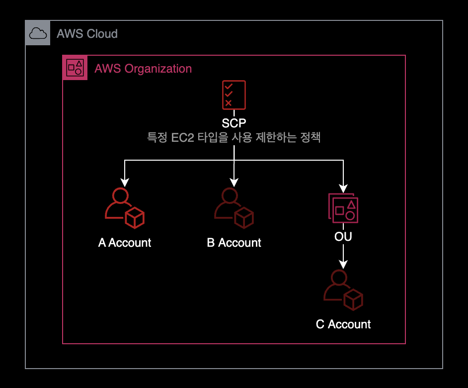
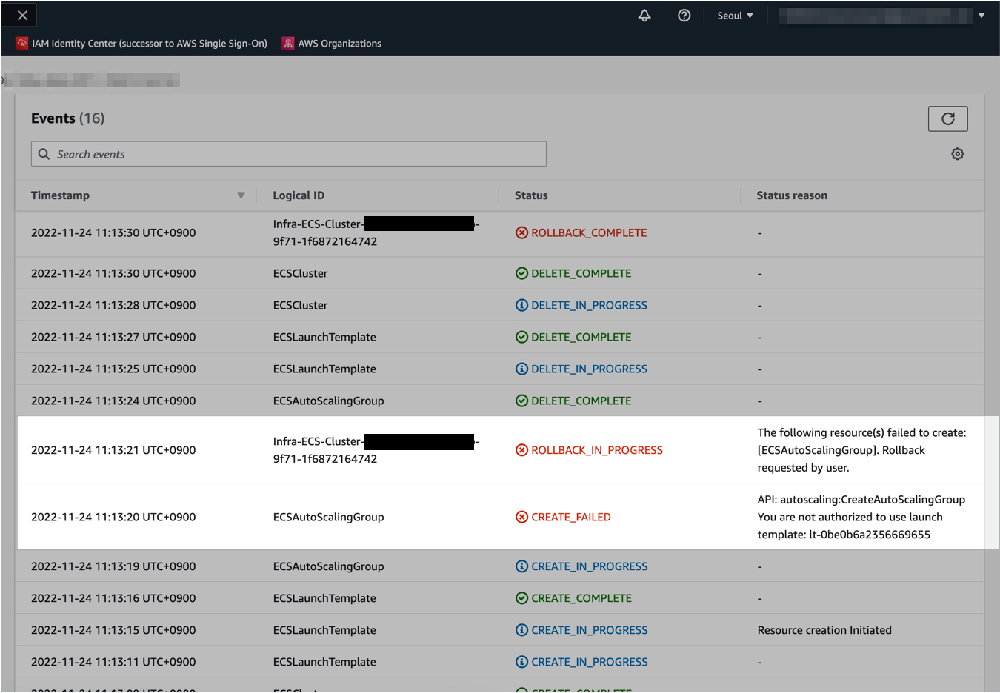

## 개요

AWS Organization의 서비스 제어 정책<sup>SCP</sup> 기능을 사용해서 구세대 EC2 인스턴스 타입과 구세대 EBS 인스턴스 타입을 강제로 제한하는 방법을 소개합니다.

&nbsp;

## 준비사항



- 서비스 제어 정책<sup>SCP</sup>은 AWS Organization의 기능 중 일부이기 때문에, AWS Organization이 미리 구성된 상태여야 합니다.
- AWS Organization의 Management Account에서만 서비스 제어 정책<sup>SCP</sup>을 설정할 수 있습니다.

&nbsp;

## 설정방법

### 특정 EBS와 EC2 타입을 거부

AWS Organizations 환경인 경우, 서비스 제어 정책<sup>SCP</sup>을 아래와 같이 작성합니다.  
이 정책을 통해 구세대 EC2 인스턴스 타입과 구세대 EBS 볼륨 사용을 제한할 수 있습니다.

아래는 서비스 제어 정책의 내용입니다.

```json
{
  "Statement": [
    {
      "Action": "ec2:*",
      "Condition": {
        "ForAnyValue:StringEquals": {
          "ec2:VolumeType": [
            "gp2",
            "io1"
          ]
        }
      },
      "Effect": "Deny",
      "Resource": "*",
      "Sid": "RestrictLegacyEBSVolumeType"
    },
    {
      "Action": "ec2:*",
      "Condition": {
        "ForAnyValue:StringLike": {
          "ec2:InstanceType": [
            "t2.*"
          ]
        }
      },
      "Effect": "Deny",
      "Resource": "*",
      "Sid": "RestrictLegacyInstanceType"
    }
  ],
  "Version": "2012-10-17"
}
```

- EBS의 `gp2`, `io1` 타입 사용을 제한합니다.  
- EC2의 `t2.*` 패밀리 전체 사용을 제한합니다.

&nbsp;

### 특정 EC2 인스턴스 타입만 허용

`t3.*` 패밀리 외에 다른 EC2 인스턴스 타입은 모두 거부합니다.

아래는 서비스 제어 정책의 내용입니다.

```json
{
  "Statement": [
    {
      "Sid": "RequireT3FamilyInstanceType",
      "Effect": "Deny",
      "Action": "ec2:RunInstances",
      "Resource": [
        "arn:aws:ec2:*:*:instance/*"
      ],
      "Condition": {
        "ForAnyValue:StringNotLike": {
          "ec2:InstanceType": [
            "t3.*"
          ]
        }
      }
    }
  ],
  "Version": "2012-10-17"
}
```

&nbsp;

## SCP 설정 시 사이드 이펙트

### ECS Cluster 생성 시 영향

최신 버전의 AWS 콘솔에서 ECS Cluster를 생성하게 될 경우, 기본적으로 gp2 타입의 볼륨을 사용하도록 생성합니다.  
AWS Organizations의 서비스 제어 정책<sup>SCP</sup>를 통해 gp2 볼륨 사용을 금지한 상태인 경우, Auto Scaling Group을 새로 생성하는 과정에서 에러가 발생할 수 있습니다.



&nbsp;

아래는 CloudFormation에서 Auto Scaling Group을 생성하는 과정에서 발생하는 에러 메세지입니다.

```bash
There was an error creating cluster dev-apne2-pri-burgerpay-frontend-cluster.
API: autoscaling:CreateAutoScalingGroup You are not authorized to use launch template: lt-0xx0x9x1234567890
```

이 문제를 해결하기 위해서는 SCP를 수정해서 다시 gp2 볼륨 제한을 예외적으로 허용해주어야 합니다.

&nbsp;

## 참고자료

[AWS - Amazon Elastic Compute Cloud(Amazon EC2)에 대한 SCP 예제](https://docs.aws.amazon.com/ko_kr/organizations/latest/userguide/orgs_manage_policies_scps_examples_ec2.html)  
[Stack Overflow - AWS SCP for EC2 type](https://stackoverflow.com/a/68453646)
