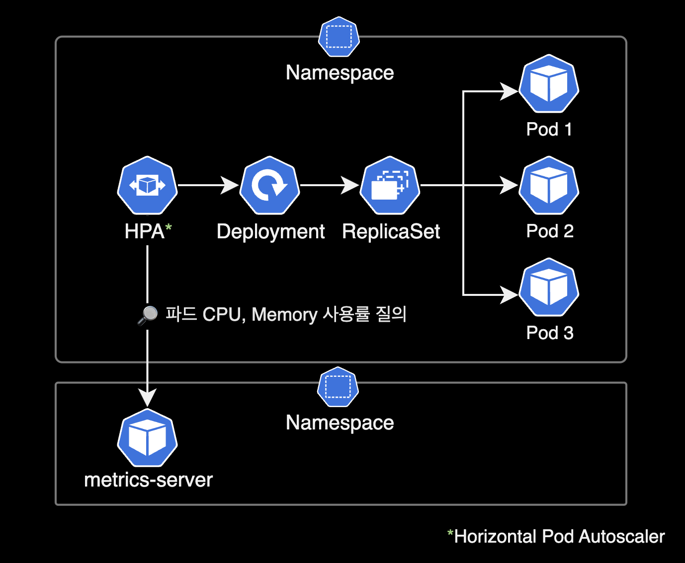
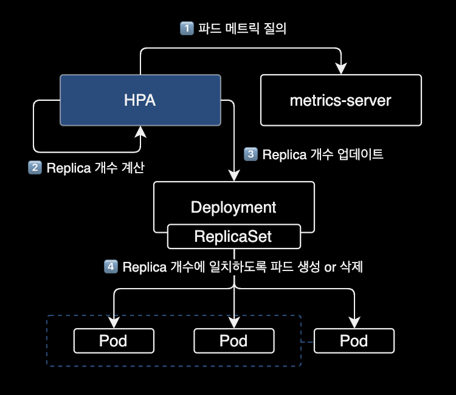

## 개요

HPA가 메트릭을 수집하지 못하는 이슈에 대한 트러블슈팅 기록입니다.

이 페이지는 Kubernetes 클러스터를 운영하는 DevOps Engineer, SRE를 대상으로 작성되었습니다.

&nbsp;

## 배경지식

### HPA (Horizontal Pod Autoscaler)

HPA<sup>Horizontal Pod Autsocaler</sup>는 쿠버네티스 클러스터에서 자동으로 파드 수를 조정하여 애플리케이션의 리소스 사용률을 유지하도록 도와주는 리소스입니다.



보통 애플리케이션은 특정 시간대에 트래픽이 많아지거나 적어지는 경우가 발생합니다. 이 경우 수동으로 파드 수를 조정해주어야 하지만, HPA를 사용하면 이러한 상황에서도 자동으로 파드 수를 조정할 수 있습니다.

HPA는 설정한 CPU 사용률 또는 메모리 사용률에 따라 파드 수를 늘리거나 줄일 수 있습니다. 예를 들어, CPU 사용률이 일정 수준을 초과하면 HPA는 파드 수를 늘려서 애플리케이션이 더 많은 CPU를 사용할 수 있도록 합니다. 반대로 CPU 사용률이 일정 수준 이하로 떨어지면 HPA는 파드 수를 줄여서 애플리케이션이 사용하는 리소스 양을 줄입니다.

이렇게 HPA를 사용하면 애플리케이션의 트래픽 변화에 대응하여 자동으로 파드 수를 조정할 수 있으므로, 애플리케이션의 가용성과 성능을 유지하면서 리소스 사용을 최적화할 수 있습니다.

&nbsp;

### metrics-server

HPA를 사용하기 위해서는 metrics-server pod가 필요합니다.

[metrics-server](https://github.com/kubernetes-sigs/metrics-server)는 쿠버네티스 클러스터 내에서 리소스 사용률에 대한 메트릭을 수집하고 쿠버네티스 API 서버에 보내는 역할을 합니다.

&nbsp;

## 환경

### 쿠버네티스 클러스터

- **EKS v1.24**
- **CPU 아키텍처** : AMD64 (x86_64)
- **metrics-server** : 헬름 차트를 사용해서 EKS 클러스터에 metrics-server v0.6.2가 설치되어 있습니다.

```bash
$ helm list \
    -n kube-system \
    -l name=metrics-server
```

```bash
NAME            NAMESPACE   REVISION    UPDATED                                 STATUS      CHART                   APP VERSION
metrics-server  kube-system 1           2023-02-08 23:49:39.986446 +0900 KST    deployed    metrics-server-3.8.3    0.6.2
```

&nbsp;

## 증상

어느날 EKS 클러스터에서 HPA<sup>Horizontal Pod Autoscaler</sup>를 운영하던 중 타겟 파드의 CPU 사용률을 수집 못하는 이슈를 겪었습니다.

```bash
$ kubectl get hpa -n dev
```

```bash
NAME    REFERENCE          TARGETS         MINPODS   MAXPODS   REPLICAS   AGE
demo1   Deployment/demo1   <unknown>/40%   2         20        0          13s
```

Horizontal Pod Autoscaler의 정보를 조회했을 때 `<TARGETS>`에 현재 CPU 사용률 값이 `<unknown>`으로 표시되는 문제가 있습니다.

&nbsp;

`kubectl top pod` 명령어로 확인 시에는 정상적으로 동작하고 있습니다.

```bash
$ kubectl top pod -n dev
```

```bash
NAME                                CPU(cores)   MEMORY(bytes)
demo1-5c55485f54-4s6dr              10m          205Mi
demo1-5c55485f54-7cgz2              7m           358Mi
demo1-5c55485f54-9ddw9              668m         164Mi
```

&nbsp;

## 원인

메트릭 감시대상 Pod에 [Resource 요청값(Requests), 제한값(Limits)](https://itchain.wordpress.com/2018/05/16/kubernetes-resource-request-limit/) 값이 지정되지 않았습니다.

&nbsp;

## 해결방법

- Horizontal Pod Autoscaler가 감시하는 메트릭 값이 CPU or Memory 인지 여부를 확인합니다.
- 감시대상 Deployment에 CPU or Memory 리소스에 대한 requests, limits 값을 추가 설정합니다.

&nbsp;

## 상세 해결기록

### HPA 설정 정보

HPA의 기존 설정 정보를 확인합니다.

```bash
$ kubectl get hpa demo1 \
    -n dev \
    -o yaml
```

```yaml
apiVersion: autoscaling/v2
kind: HorizontalPodAutoscaler
metadata:
  name: demo1
  namespace: dev
spec:
  maxReplicas: 20
  metrics:
  - resource:
      name: cpu
      target:
        averageUtilization: 40
        type: Utilization
    type: Resource
  minReplicas: 2
  scaleTargetRef:
    apiVersion: apps/v1
    kind: Deployment
    name: demo1
```

&nbsp;

현재 HPA가 모니터링하는 대상은 `demo1` Deployment 입니다.

```bash
$ kubectl get hpa -n dev
```

```bash
NAME    REFERENCE          TARGETS         MINPODS   MAXPODS   REPLICAS   AGE
demo1   Deployment/demo1   <unknown>/40%   2         20        0          13s
```

현재 TARGETS 값이 `<unknown>` 입니다.

&nbsp;

최근 HPA에서 발생한 이벤트 정보를 확인합니다.

```bash
$ kubectl describe hpa demo1 -n dev | grep -A 5 "^Events"
```

```bash
Events:
  Type     Reason                        Age               From                       Message
  ----     ------                        ----              ----                       -------
  Warning  FailedGetResourceMetric       1s (x7 over 91s)  horizontal-pod-autoscaler  failed to get cpu utilization: missing request for cpu
  Warning  FailedComputeMetricsReplicas  1s (x7 over 91s)  horizontal-pod-autoscaler  invalid metrics (1 invalid out of 1), first error is: failed to get cpu utilization: missing request for cpu
```

메세지 정보를 보면 감시대상 Pod에 CPU requests 값 설정이 없기 때문에, HPA가 CPU 사용률을 조회하지 못하고 있습니다.



&nbsp;

### deployment 설정 변경

Deployment demo1 Pod에 CPU 리소스에 대한 `requests`와 `limits` 값을 지정합니다.

**중요**  
어플리케이션 환경에 맞게 `requests`와 `limits` 값을 변경해서 명령어를 실행합니다.

```bash
$ kubectl patch deployment demo1 \
    -n dev \
    -p '{
  "spec": {
    "template": {
      "spec": {
        "containers": [{
          "name": "demo1",
          "resources": {
            "requests": {
              "cpu": "250m"
            },
            "limits": {
              "cpu": "1000m"
            }
          }
        }]
      }
    }
  }
}'
```

```bash
deployment.apps/demo1 patched
```

명령어 실행 시 `<RESOURCE_NAME> patched`가 출력되면 정상적으로 설정이 변경된 것입니다.

&nbsp;

Deployment 설정이 변경되면서 새 파드가 자동 생성됩니다.

```bash
$ kubectl get pod \
    -n dev \
    -l app=demo1
```

```bash
NAME                    READY   STATUS    RESTARTS   AGE
demo1-94f9d5fc9-jnz29   2/2     Running   0          6m50s
demo1-94f9d5fc9-sgjfs   2/2     Running   0          7m21s
```

새로 만들어진 파드들에는 저희가 지정한 컨테이너 CPU `limits`, `requests`가 걸려있는 상태입니다.

&nbsp;

deployment에 변경된 CPU limits, requests 부분은 실제로 다음과 같습니다.

```bash
$ kubectl get deployment demo1 \
    -n dev \
    -o yaml
```

```diff
    spec:
      containers:
      - env:
        - name: POD_NAME
          valueFrom:
            fieldRef:
              apiVersion: v1
              fieldPath: metadata.name
        - name: JVM_OPT
          value: -Xms64m -Xmx128m -XX:MetaspaceSize=128m -XX:ParallelGCThreads=2 -XX:MaxGCPauseMillis=500
        - name: PROFILE
          value: dev
        image: 111122223333.dkr.ecr.ap-northeast-2.amazonaws.com/demo:demo-v1
        imagePullPolicy: Always
        livenessProbe:
          failureThreshold: 3
          httpGet:
            path: /actuator/health
            port: 8080
            scheme: HTTP
          initialDelaySeconds: 10
          periodSeconds: 10
          successThreshold: 1
          timeoutSeconds: 5
        name: demo1
        ports:
        - containerPort: 8080
          protocol: TCP
        readinessProbe:
          failureThreshold: 3
          httpGet:
            path: /actuator/health
            port: 8080
            scheme: HTTP
          initialDelaySeconds: 10
          periodSeconds: 10
          successThreshold: 1
          timeoutSeconds: 5
        resources:
+       # HPA의 메트릭 수집을 위한 resources 정보 추가
+         limits:
+           cpu: 1024m
+         requests:
+           cpu: 250m
```

`spec.resources.limits.cpu`, `spec.resources.requests.cpu`가 저희가 지정한 값으로 적용된 걸 확인할 수 있습니다.

&nbsp;

**주의사항**  
컨테이너의 limits 값을 부족하게 잡을 경우, Pod 생성이 실패하며 `CrashLoopBackOff`가 발생할 수 있습니다.

```bash
$ kubectl get pod -n dev
```

```bash
NAME                                READY   STATUS             RESTARTS       AGE
demo1-545d7f94f8-cxdq2              1/2     CrashLoopBackOff   5 (14s ago)    4m54s
demo1-545d7f94f8-gmxwd              1/2     CrashLoopBackOff   5 (21s ago)    4m54s
```

&nbsp;

제 경우 컨테이너 리소스 부족으로 인해 Liveness, Readiness Probe를 체크하는 과정에 실패한 후 `CrashLoopBackOff`를 겪었습니다.

```bash
$ kubectl describe pod demo1-545d7f94f8-cxdq2 -n dev
```

```bash
...
  Warning  Unhealthy  4m11s (x4 over 4m51s)  kubelet            Liveness probe failed: HTTP probe failed with statuscode: 500
  Warning  Unhealthy  4m11s (x5 over 4m51s)  kubelet            Readiness probe failed: HTTP probe failed with statuscode: 500
  Warning  BackOff    10s (x4 over 38s)      kubelet            Back-off restarting failed container
...
```

`kubectl describe` 명령어로 최근 이벤트 정보를 확인한 결과입니다. Liveness probe와 Readiness Probe 체크를 실패한 걸 확인할 수 있습니다.

이를 해결하기 위해 초기 `limits.cpu` 값을 512m로 했으나, 1024m로 늘린 후 파드가 정상적으로 생성되는 걸 확인했습니다.

&nbsp;

### 결과 확인

```bash
$ kubectl get hpa -n dev
```

```bash
NAME    REFERENCE          TARGETS    MINPODS   MAXPODS   REPLICAS   AGE
demo1   Deployment/demo1   248%/40%   2         20        2          2m16s
```

이후 정상적으로 TARGETS 값에 현재 CPU 사용률이 표시되는 걸 확인할 수 있습니다.

&nbsp;

## 참고자료

[k8s HPA TARGETS CPU unknown 현상 해결](https://skysoo1111.tistory.com/72)  
위 글을 참고해서 해결했습니다.

[Kubernetes Resource Request와 Limit의 이해](https://itchain.wordpress.com/2018/05/16/kubernetes-resource-request-limit/)  
쿠버네티스의 request와 limit 설정을 잘 설명한 글입니다.

[EKS 환경에서 metrics-server 설치 가이드](https://docs.aws.amazon.com/ko_kr/eks/latest/userguide/metrics-server.html)  
AWS 공식문서로 `kubectl apply`를 사용해서 설치하는 방식을 설명하고 있습니다.

[kubecost의 HPA 설명문서](https://www.kubecost.com/kubernetes-autoscaling/kubernetes-hpa/)  
그림으로 표현된 HPA 동작방식을 보시면 이해하기 쉽습니다.
