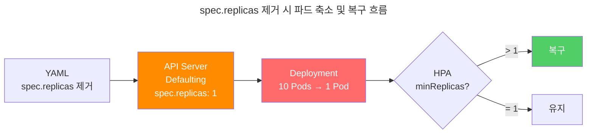
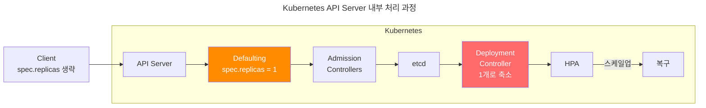

## 개요

ArgoCD 같은 GitOps Controller로 HPA를 관리할 때 발생하는 크리티컬한 문제입니다. Deployment의 `.spec.replicas` 필드를 제거하면 Kubernetes API Server의 Defaulting 메커니즘으로 인해 파드가 일시적으로 1개로 축소되며, 이는 완전히 피할 수 없습니다.

## TL;DR

**대상 독자:**
- ArgoCD/Flux 등 GitOps 도구로 HPA를 관리하는 DevOps 엔지니어
- Kubernetes 클러스터에서 HPA 적용 시 파드가 갑자기 1개로 줄어드는 현상을 경험한 SRE
- HPA와 Deployment의 spec.replicas 충돌 문제를 해결하려는 플랫폼 엔지니어

**이 글에서 얻을 수 있는 것:**
- 파드가 1개로 축소되는 원인 (Kubernetes API Defaulting 메커니즘)
- 서비스 영향을 최소화하는 배포 전략과 복구 시간 단축 방법
- 이 문제를 완전히 피할 수 없는 기술적 이유

## 문제 상황

HPA가 적용된 Deployment에서 `.spec.replicas` 필드를 제거하고 ArgoCD sync 실행 시:
1. 파드 개수가 일시적으로 1개로 축소
2. HPA가 감지하여 minReplicas로 복구 (복구 시간은 Pod의 Probe 설정에 따라 달라짐)

**프로덕션 환경 예시:**

100개 파드를 운영 중인 Deployment에 `spec.replicas` 필드 제거 시:
- **100 Pods → 1 Pod** (즉시 99개 파드 종료)
- 트래픽 처리 불가, 타임아웃 및 에러 폭증
- HPA 복구까지 **2-5분** 다운타임 발생

## 원인

HPA를 사용할 때는 Deployment Controller와의 충돌을 방지하기 위해 `spec.replicas` 필드를 반드시 생략해야 합니다.

그러나 Deployment에서 `spec.replicas` 필드를 제거하고 적용하면, kube-apiserver가 요청을 처리하는 과정 중 Mutation Admission 단계에서 Defaulting 메커니즘이 작동하여 자동으로 `spec.replicas: 1`을 설정합니다. 이는 Kubernetes의 기본 동작이며 변경할 수 없습니다.

결과적으로 Deployment Controller가 파드를 1개로 축소시키고, 이후 HPA가 이를 감지하여 minReplicas로 복구합니다. 반대로 `spec.replicas` 필드를 유지하면 HPA와 Deployment Controller 간의 무한 경쟁으로 Pod Flapping이 발생합니다.

### Kubernetes API 요청 처리 과정

1. **Git Commit** - spec.replicas 필드가 제거된 YAML을 Git 저장소에 커밋
2. **GitOps Sync** - ArgoCD가 Git 변경사항을 감지하고 kube-apiserver에 적용 요청
3. **Authentication** - kube-apiserver가 요청자 신원 확인
4. **Authorization** - kube-apiserver가 권한 검증
5. **Mutation Admission** - ⚠️ **kube-apiserver가 Defaulting으로 `spec.replicas: 1` 자동 설정**
6. **Validation Admission** - kube-apiserver가 스키마 및 정책 검증
7. **Persistence** - kube-apiserver가 `spec.replicas: 1`로 etcd에 저장
8. **Deployment Controller** - etcd 변경 감지 후 파드를 1개로 축소

**Defaulting**: kube-apiserver가 생략된 필드에 자동으로 기본값을 설정하는 과정

참고: [Controlling Access to the Kubernetes API](https://kubernetes.io/docs/concepts/security/controlling-access/)

`spec.replicas` 필드를 제거하면 **4단계 Mutation Admission**에서 kube-apiserver가 무조건 `1`로 설정됩니다.

### HPA와 spec.replicas 필드의 딜레마

| 상황 | 문제 | 이슈 |
|------|------|------|
| **spec.replicas 유지** | Pod Flapping<br/>HPA와 Deployment Controller가 무한 경쟁 | [#25238](https://github.com/kubernetes/kubernetes/issues/25238) |
| **spec.replicas 제거** | Reset to 1<br/>Defaulting으로 파드 1개로 일시 축소 | [#67135](https://github.com/kubernetes/kubernetes/issues/67135) |



## 해결 방안

### 1. Server-side Apply

```bash
argocd app set APP_NAME --sync-option ServerSideApply=true
```

**효과:**
- ✅ Pod flapping 해결
- ❌ Defaulting으로 인한 일시적 축소는 여전히 발생

### 2. spec.replicas 필드 제거 + 적절한 시점 배포 (권장)

**Helm 템플릿:**

```yaml
# example-chart/templates/deployment.yaml
spec:
  {{- if not .Values.autoscaling.enabled }}
  replicas: {{ .Values.replicaCount }}
  {{- end }}
```

HPA를 사용하지 않을 때만 `spec.replicas` 필드를 포함하고, HPA를 활성화하면 해당 필드를 완전히 제거하는 조건문입니다. 이 방식은 [ArgoCD Best Practices](https://argo-cd.readthedocs.io/en/stable/user-guide/best_practices/#leaving-room-for-imperativeness)에서 권장하는 패턴으로, HPA 사용 여부에 따라 Deployment 매니페스트를 동적으로 생성할 수 있습니다.

**배포 시점:**
- **트래픽이 적은 새벽 시간대** (2-4시) - 파드가 1개로 일시 축소되는 동안 서비스 부하를 최소화
- **유지보수 윈도우** - 계획된 다운타임을 활용
- **주말/휴일** (B2B 서비스) - 사용자가 없는 시간대 선택

**배포 절차:**
```bash
# 1. 사전 확인
kubectl get hpa -o yaml
kubectl get deployment

# 2. 모니터링 시작
kubectl get events --watch

# 3. 배포 실행 (spec.replicas 필드 제거 후 ArgoCD sync)

# 4. 복구 확인 (복구 시간은 Pod의 Probe 설정에 따라 달라짐)
kubectl describe hpa
```

**복구 시간 단축:**

HPA 스케일업 정책 최적화:
```yaml
behavior:
  scaleUp:
    stabilizationWindowSeconds: 0
    policies:
    - type: Percent
      value: 100
      periodSeconds: 15
```

**TIP: JVM 기반 컨테이너 회복력 향상**

JVM 애플리케이션은 시작 시간이 오래 걸리므로 startupProbe를 적용하면 더 빠르게 Ready 상태로 전환됩니다:

```yaml
spec:
  containers:
  - name: app
    startupProbe:
      httpGet:
        path: /actuator/health
        port: 8080
      failureThreshold: 30
      periodSeconds: 10
    readinessProbe:
      httpGet:
        path: /actuator/health/readiness
        port: 8080
      periodSeconds: 5
    livenessProbe:
      httpGet:
        path: /actuator/health/liveness
        port: 8080
      periodSeconds: 10
```

startupProbe가 성공하면 readinessProbe/livenessProbe가 시작되어 불필요한 재시작을 방지하고 복구 시간을 단축합니다.

## 완전히 피할 수 있는가?

**불가능합니다.** Kubernetes API Server의 Defaulting 메커니즘은 변경할 수 없습니다.



**실패하는 시도들:**
- **Server-side Apply**: Pod flapping만 해결
- **Strategic Merge Patch**: Defaulting 동일
- **Custom Admission Controller**: Defaulting 이후 실행

## 모니터링

```bash
# HPA 상태
kubectl describe hpa

# Pod 이벤트
kubectl get events --field-selector involvedObject.kind=Pod

# ArgoCD 상태
argocd app get APP_NAME
```

## 관련 자료

**Kubernetes 공식 문서:**
- [Controlling Access to the Kubernetes API](https://kubernetes.io/docs/concepts/security/controlling-access/)

**ArgoCD 공식 문서:**
- [ArgoCD Best Practices - Leaving Room for Imperativeness](https://argo-cd.readthedocs.io/en/stable/user-guide/best_practices/#leaving-room-for-imperativeness)

**Kubernetes GitHub Issues:**
- [#25238 - HPA and Deployment Controller conflict (Pod Flapping)](https://github.com/kubernetes/kubernetes/issues/25238)
- [#67135 - spec.replicas defaulting to 1 when removed](https://github.com/kubernetes/kubernetes/issues/67135)
