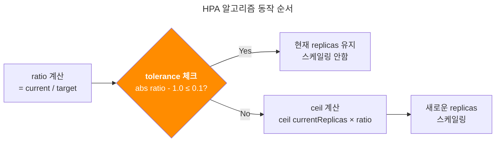

## TL;DR

- **대상 독자**: DevOps 엔지니어, SRE, 쿠버네티스 운영자
- **얻을 수 있는 점**: HPA가 수학적으로 스케일링해야 할 상황인데 실제로는 스케일링하지 않는 원인과 해결책을 다룹니다. tolerance 메커니즘의 작동 원리와 EKS 환경에서의 실무 대안을 제시합니다.

- **문제**: KEDA v2.17.1의 메모리 스케일러가 측정한 Memory 사용률이 81%인데 목표 75%보다 높아서 스케일링이 될 것 같지만, 실제로는 스케일링되지 않음
- **원인**: HPA는 `ceil[]` 계산 전에 tolerance 체크를 먼저 함. `|81/75 - 1.0| = 0.08 ≤ 0.1` (기본 tolerance 10%)이므로 스케일링하지 않음
- **해결**:
    - EKS 환경에서는 컨트롤플레인 접근 불가로 tolerance 직접 조정 불가능
    - 메트릭 임계값 조정 (75% → 70% 등)으로 우회
    - Kubernetes 1.33+ Alpha 기능도 EKS 버전 업그레이드 필요

## 문제 상황

KEDA를 사용한 환경에서 다음과 같은 상황이 발생했습니다:

```
현재 상태: 12개 파드
현재 메트릭: 81% memory 사용률
목표 메트릭: 75% memory 사용률
예상 결과: 13개 파드로 스케일링
실제 결과: 12개 파드 유지 (스케일링 안됨)
```

## HPA 알고리즘의 실제 동작 순서 (오해하기 쉬운 부분)

대부분의 개발자들이 착각하는 부분: HPA가 항상 `ceil[]` 계산을 한다고 생각하는 것입니다.

### 흔한 오해 (잘못된 이해)
```
1. desiredReplicas = ceil[12 × (81/75)] = ceil[12.96] = 13
2. 13개로 스케일링 실행
```
"수학적으로 계산하면 13개니까 당연히 13개로 스케일링될 것"

### 실제 HPA 알고리즘 (정확한 동작)
```
1. ratio = current/target = 81/75 = 1.08
2. tolerance 체크 먼저: |1.08 - 1.0| = 0.08 ≤ 0.1 (기본 tolerance)
3. tolerance 범위 내이므로 즉시 종료 → 12개 유지
4. ceil[] 계산 자체를 하지 않음
```
"tolerance 범위 내이면 ceil 계산도 하지 않음"

## 핵심 포인트: ceil[] 계산은 조건부



많은 사람들이 놓치는 부분:
- HPA는 항상 ceil[] 계산을 하는 것이 아님
- tolerance 체크가 먼저 이루어짐
- tolerance 범위 내이면 수학적 계산 자체를 건너뜀

이것이 "수학적으로는 맞는데 실제로는 스케일링 안 됨" 현상의 원인입니다.

## 정확한 HPA 공식 (순서가 중요)

대부분의 문서나 예제에서 보는 `ceil[currentReplicas × ratio]` 공식은 tolerance 체크를 통과했을 때만 실행됩니다.

```
Step 1: ratio = current/target = currentMetricValue / desiredMetricValue

Step 2: if |ratio - 1.0| <= tolerance:
           return currentReplicas  # 여기서 바로 끝, ceil 계산 안 함
        
Step 3: else:
           return ceil[currentReplicas × ratio]  # tolerance 통과시에만 계산
```

### 실제 Kubernetes HPA tolerance 체크 코드
```go
// 출처: Kubernetes v1.33 pkg/controller/podautoscaler/replica_calculator.go
	if tolerances.isWithin(newUsageRatio) || (usageRatio < 1.0 && newUsageRatio > 1.0) || (usageRatio > 1.0 && newUsageRatio < 1.0) {
		// return the current replicas if the change would be too small,
		// or if the new usage ratio would cause a change in scale direction
		return currentReplicas, utilization, rawUtilization, timestamp, nil
	}
```

**코드 분석:**
- `tolerances.isWithin(newUsageRatio)`: tolerance 범위 체크 (핵심 로직)
- `(usageRatio < 1.0 && newUsageRatio > 1.0)`: 스케일 방향 변경 체크 (down→up)
- `(usageRatio > 1.0 && newUsageRatio < 1.0)`: 스케일 방향 변경 체크 (up→down)

우리 예시에서 `newUsageRatio = 81/75 = 1.08`이므로 `tolerances.isWithin(1.08)`이 
`true`가 되어 스케일링하지 않습니다.

## 사례 분석: 왜 이런 오해가 생기는가

### 현재 케이스 상세 분석
```
상황: 12개 파드, 현재 81% memory 사용률, 목표 75% memory 사용률

일반적인 생각 과정:
"81/75 = 1.08이니까 ceil[12 × 1.08] = ceil[12.96] = 13개겠네"

실제 HPA 동작:
Step 1: ratio = current/target = 81/75 = 1.08
Step 2: |1.08 - 1.0| = 0.08 ≤ 0.1 (tolerance)
Step 3: return 12 (ceil 계산 자체를 안 함)

결과: 12개 파드 유지 (스케일링 안됨)
```

### 문서에서 보는 공식의 함정

Kubernetes 공식문서의 HPA 페이지나 블로그에서는 이렇게 파드 개수 산정식을 설명합니다:

```
desiredReplicas = ceil[currentReplicas × (currentMetricValue / desiredMetricValue)]
```

하지만 이는 tolerance 체크를 통과했을 때만 적용되는 공식입니다. 문서에서는 tolerance 체크가 선행 조건이라는 점을 명확히 강조하지 않아서 오해가 생깁니다.

### 만약 메트릭이 더 높았다면

```
ratio = current/target = 90/75 = 1.2  
|1.2 - 1.0| = 0.2 > 0.1 (tolerance 초과)

결과: ceil[12 × 1.2] = ceil[14.4] = 15개로 스케일링
```

### 만약 tolerance가 5%였다면

```
ratio = current/target = 81/75 = 1.08
tolerance = 0.05
|1.08 - 1.0| = 0.08 > 0.05 (tolerance 초과)

결과: ceil[12 × 1.08] = ceil[12.96] = 13개로 스케일링
```

## Tolerance 설정의 현실적 제약

### Kubernetes 1.33 이전 (대부분의 현재 환경)

- **개별 HPA tolerance 설정 불가능**
- 클러스터 전체에 동일한 tolerance 적용한다는 한계점이 있음
- 컨트롤플레인의 kube-controller-manager 컴포넌트에서 아래 플래그로만 제어 가능:
  ```bash
  --horizontal-pod-autoscaler-tolerance=0.1  # 기본값
  ```

### Kubernetes 1.33+ (Alpha 기능)

Kubernetes 1.33에서 도입된 개별 HPA tolerance 설정은 현재 Alpha 단계로 기본적으로 비활성화되어 있습니다.

```yaml
apiVersion: autoscaling/v2
kind: HorizontalPodAutoscaler
metadata:
  name: my-app-hpa
spec:
  # 기본 HPA 설정...
  behavior:
    scaleUp:
      tolerance: 0.05  # 5% tolerance
    scaleDown:
      tolerance: 0.1   # 10% tolerance
```

Alpha 기능의 제약사항:

- 프로덕션 환경 사용 주의: Alpha 기능은 언제든 변경되거나 제거될 수 있음
- 기능 게이트 활성화 필요: `--feature-gates=HPAConfigurableTolerance=true`
- API 불안정성: Alpha 단계에서는 API 스펙이 변경될 가능성 높음
- KEDA 환경 제약: KEDA가 HPA를 내부적으로 생성하므로 직접 제어 불가
- Beta 예상: KEP-4951에 따르면 v1.35에서 Beta 단계로 전환 예정

## 커뮤니티의 요구사항

[Kubernetes Issue #116984](https://github.com/kubernetes/kubernetes/issues/116984)에서는 다음과 같은 요구사항이 제기되었습니다:

> "K8 Clusters in organizations are often used by multiple applications with different needs. Allowing individual HPA to set their own tolerance limits can help in handling different usecases smoothly."

특히 대규모 배포 환경에서 10% tolerance는 수십 개의 파드를 의미할 수 있어 너무 거친 설정이라는 피드백이 많습니다.

## EKS 환경에서의 현실적 대안

EKS 환경에서 tolerance를 직접 조정할 수 없으므로 다음 방법들을 활용해야 합니다:

### 1. 메트릭 임계값 조정 (가장 실용적)

```yaml
# KEDA ScaledObject에서
triggers:
- type: prometheus
  metadata:
    threshold: '70'  # 75% → 70%로 낮춤 (더 민감하게)
```

이렇게 하면:
- ratio = 81/70 = 1.157
- |1.157 - 1.0| = 0.157 > 0.1 (tolerance 초과)
- 스케일링 실행: ceil[12 × 1.157] = ceil[13.88] = 14개

### 2. 메트릭 쿼리 최적화

더 민감한 메트릭을 사용하거나 메트릭 계산 방식을 조정하여 tolerance 범위를 벗어나도록 설계

### 3. 다중 메트릭 사용

여러 메트릭을 조합하여 하나라도 tolerance를 초과하면 스케일링되도록 구성

## 결론 및 향후 전망

HPA의 tolerance 메커니즘은 불필요한 스케일링을 방지하는 중요한 기능이지만, 때로는 예상한 스케일링을 차단할 수 있습니다.

### 현재 상황 요약
- 수학적으로는 13개가 맞지만
- HPA 알고리즘상 tolerance로 인해 12개 유지
- Kubernetes 1.33 이전: tolerance 개별 조정 완전 불가능
- Kubernetes 1.33+: Alpha 단계로 개별 tolerance 설정 가능하나 프로덕션 사용 위험

### 향후 로드맵

- v1.35 예상: Beta 단계로 전환 [(KEP-4951)](https://github.com/kubernetes/enhancements/issues/4951)
- 안정화 이후: 프로덕션 환경에서 안전한 사용 가능
- 추가 기능: Per-metric tolerance, 동적 tolerance 조정 등 계획

### 현재 권장사항 (EKS 환경)

EKS 환경에서는 컨트롤플레인 접근이 불가능하므로 다음 접근 방식을 권장합니다:

1. **메트릭 임계값 조정**: 가장 실용적이고 안전한 방법
2. **메트릭 쿼리 최적화**: 기존 tolerance 범위를 벗어나도록 설계
3. **모니터링 강화**: HPA 동작을 면밀히 관찰하여 패턴 파악
4. **장기 계획**: EKS 버전 업그레이드 시 Alpha 기능 검토 (v1.35 Beta 이후)

## 관련자료 

Kubernetes github issues:

- [KEP-4951](https://github.com/kubernetes/enhancements/issues/4951)
- [Kubernetes Issue #116984 - Custom tolerance levels](https://github.com/kubernetes/kubernetes/issues/116984)
- [Kubernetes Issue #62013 - Enable customize tolerance](https://github.com/kubernetes/kubernetes/issues/62013)

Docs:

- [Kubernetes HPA 공식 문서](https://kubernetes.io/docs/tasks/run-application/horizontal-pod-autoscale/)
- [Kubernetes v1.33 HPA Configurable Tolerance](https://kubernetes.io/blog/2025/04/28/kubernetes-v1-33-hpa-configurable-tolerance/)

Kubernetes code:

- [HPA tolerance 체크 실제 구현 코드](https://github.com/kubernetes/kubernetes/blob/master/pkg/controller/podautoscaler/replica_calculator.go#L147-L151) - `tolerance` 필드 정의 및 사용
