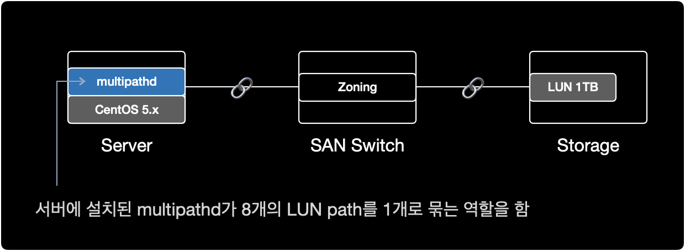
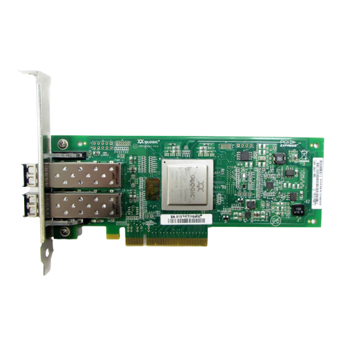

## 개요

리눅스 서버에 할당한 스토리지 <abbr title="Logical Unit Number">LUN</abbr>을 multipath를 이용해 연결하는 작업을 설명한다.  
참고로 해당 시나리오에서는 <abbr title="Linux Volume Manager">LVM</abbr>을 사용하지 않는다.  

&nbsp;

## 환경

- **Architecture** : x86_64
- **OS** : CentOS release 5.x (Final)
- **Shell** : bash
- **Package** : device-mapper-multipath-0.4.7-59.el5

&nbsp;

## 전제조건

- 서버, <abbr title="Storage Area Network">SAN</abbr> 스위치, 스토리지 간의 물리적 연결이 사전에 완료된 상태
- 서버의 OS, 아키텍처 버전에 맞는 multipath 패키지(`device-mapper-multipath`)가 설치된 상태여야함

&nbsp;

**물리적 시스템 구성**  
현재 시나리오에서 SAN의 물리적 구성은 다음과 같다.



- **Storage** : Server Host 등록, LUN 할당 작업이 완료된 상태
- **SAN Switch** : 서버와 스토리지가 광 케이블로 SAN 포트에 연결된 상태, 서버와 스토리지간 Zoning 작업이 완료된 상태
- **Server** : SAN Switch와 물리적으로 케이블이 연결된 상태

&nbsp;

다음 단계를 진행하기 위해 서버와 스토리지를 광케이블로 연결하는 물리적 구성 작업이 이미 완료되어 있어야 한다.

&nbsp;

## 사전작업

### 1. HBA 카드 확인

```bash
$ lspci | grep -i fibre
40:00.0 Fibre Channel: QLogic Corp. ISP2532-based 8Gb Fibre Channel to PCI Express HBA (rev 02)
40:00.1 Fibre Channel: QLogic Corp. ISP2532-based 8Gb Fibre Channel to PCI Express HBA (rev 02)
```

서버에 <abbr title="Host Bus Adapter">HBA</abbr> 카드가 1개 장착된 상태이며, 2개의 <abbr title="Fiber Channel">FC</abbr> 포트로 구성된다.  
현재 서버에 장착된 HBA 카드의 제원 정보는 `QLogic Corp.`에서 만든 `ISP2532-based 8Gb Fibre Channel to PCI Express HBA.`이다.



&nbsp;

### 2. multipath 패키지 설치여부 확인

```bash
$ rpm -qa | grep device-mapper-multipath
device-mapper-multipath-0.4.7-59.el5
```

이 서버에서는 `device-mapper-multipath 0.4.7` 버전이 이미 설치된 상태이다.  

CentOS 5.x 기준으로 multipath 패키지는 기본적으로 OS 설치시 포함되어 있기 때문에, 별도로 multipath 패키지 설치가 필요 없었다.  

&nbsp;

### 3. multipathd 실행여부 확인

```bash
$ ps -ef | grep multipathd
root      8474  8427  0 18:14 pts/1    00:00:00 grep multipathd
```

multipath 데몬<sup>`multipathd`</sup>이 동작하고 있지 않다.  

&nbsp;

### 4. multipathd 자동시작 활성화

`multipathd`에 대한 부팅 시 자동시작 설정을 확인한다.

```bash
$ chkconfig --list multipathd
multipathd      0:off   1:off   2:off   3:off   4:off   5:off   6:off
```

`multipathd`가 모든 Run Level에서 자동시작하지 않도록 설정된 상태이다.

&nbsp;

`multipathd`가 Run Level이 3과 5일 경우에만 자동 시작하도록 설정한다.  

```bash
$ chkconfig --level 35 multipathd on
```

#### Run Level

대부분의 리눅스 서버에서 사용하는 런레벨은 크게 2가지 중 하나를 사용한다.

| Level | Name                 | Description                             |
|-------|----------------------|-----------------------------------------|
| 3     | Full multi user mode | CLI 환경. 네트워크를 지원하는 다중 사용자 모드.   |
| 5     | X11                  | GUI 환경. X Window를 사용하는 다중 사용자 모드. |

&nbsp;

부팅 시 자동시작 설정을 다시 확인한다.

```bash
$ chkconfig --list multipathd
multipathd      0:off   1:off   2:off   3:on    4:off   5:on    6:off
```

런레벨이 3 또는 5일 경우에만 `multipathd`를 자동시작하도록 설정되었다.

&nbsp;

### 5. multipathd 실행

`multipathd`를 시작한다.

```bash
$ service multipathd start
Starting multipathd daemon: [  OK  ]
```

&nbsp;

프로세스 상태를 확인한다.

```bash
$ ps -ef | grep multipathd | grep -v grep
root     16274     1  0 20:50 ?        00:00:00 /sbin/multipathd
```

`multipathd`가 동작하고 있다.

&nbsp;

## multipath 설정

### 6. 모듈 생성

multipath 사용을 위해 dm-multipath 모듈을 올린다.

```bash
$ modprobe dm-multipath
```

&nbsp;

`partprobe` 명령어를 실행해서 리부팅 없이도 파티션 변경사항을 적용할 수 있다.  

```bash
$ partprobe
```

`partprobe` 명령어 실행 후 출력된 결과가 없으면 명령어가 정상적으로 실행된 것이다.

&nbsp;

### 7. LUN Rescan

`systool` 명령어를 이용해서 FC 포트의 구성과 이름 정보를 수집한다.  
참고로 `systool` 명령어를 사용하려면 sysfsutils 패키지 설치가 필요하다.

```bash
$ systool -c fc_host
Class = "fc_host"

  Class Device = "host7"
    Device = "host7"

  Class Device = "host8"
    Device = "host8"
```

해당 서버에서 `host7`, `host8` 이라는 이름의 2개의 광 포트<sup>FC</sup>를 사용중이다.

&nbsp;

스토리지에서 LUN 할당 작업이 이미 끝난 상태라면, 서버에서 LUN을 재인식<sup>Rescan</sup>하도록 명령어를 실행한다.

```bash
$ echo "1" > /sys/class/fc_host/host7/issue_lip
$ echo "1" > /sys/class/fc_host/host8/issue_lip
```

위의 `host7`, `host8` 값은 각 서버마다 다르기 때문에 변경될 수 있다.  
`systool -c fc_host` 명령어로 반드시 각자의 서버 환경에서 확인한다.  

&nbsp;

### 8. WWID 확인

```bash
$ scsi_id -g -u -s /block/sdb
36006016035303900df9eaf55ec5bec11
$ scsi_id -g -u -s /block/sdc
36006016035303900df9eaf55ec5bec11
$ scsi_id -g -u -s /block/sdd
36006016035303900df9eaf55ec5bec11
$ scsi_id -g -u -s /block/sde
36006016035303900df9eaf55ec5bec11
$ scsi_id -g -u -s /block/sdf
36006016035303900df9eaf55ec5bec11
$ scsi_id -g -u -s /block/sdg
36006016035303900df9eaf55ec5bec11
$ scsi_id -g -u -s /block/sdh
36006016035303900df9eaf55ec5bec11
$ scsi_id -g -u -s /block/sdi 
36006016035303900df9eaf55ec5bec11
```

`/block/sdb` 부터 `/block/sdi` 까지 8개의 장치가 모두 동일한 <abbr title="World Wide IDentifier">WWID</abbr>를 가지고 있다.  
`/block/sda`는 OS가 설치된 로컬 디스크이다.

8개 장치의 WWID가 같다는 것은, 서버 기준에서 물리적으로 동일한 스토리지의 LUN이 여러 경로를 통해 중복되어 보인다는 의미이다.

&nbsp;

### 9. multipath 설정파일 수정

이처럼 다중 경로로 인해 8개로 중복되어 나타나는 스토리지 볼륨을 하나로 합쳐주는 역할을 하는 소프트웨어가 multipath이다.

#### blacklist 해제

```bash
$ cat /etc/multipath.conf | grep -v ^# | grep -v ^$
blacklist {
        devnode "*"
}
defaults {
        user_friendly_names yes
}
```

multipath 설정파일의 기본값은 모든 Device를 차단하도록 설정되어 있다.  
라인 맨 앞에 `#`을 붙여서 `blacklist { ... }` 영역을 주석처리한다.

&nbsp;

```bash
$ cat /etc/multipath.conf | grep -v ^# | grep -v ^$
#blacklist {
#        devnode "*"
#}
defaults {
        user_friendly_names yes
}
```

이제 `multipaths { ... }` 구문에 동일한 WWID 값을 추가한다.

&nbsp;

#### multipaths 작성

```bash
$ cat /etc/multipath.conf | grep -v ^$
#blacklist {
#        devnode "*"
#}
defaults {
        user_friendly_names yes
}
multipaths {
        multipath {
                wwid  36006016035303900df9eaf55ec5bec11
                alias mpath1
        }
}
```

OS가 설치된 영역이자 로컬 디스크인 `/dev/sda`의 WWID를 확인한다.

&nbsp;

#### 로컬디스크 제외

`/dev/sda` 장치는 OS가 설치된 로컬디스크다.  

multipath에서 로컬 디스크를 자동으로 설정을 잡을 경우 문제가 발생할 수 있으므로, 로컬 디스크를 multipath에서 잡지 않도록 blacklist 설정한다.  

`/block/sda`의 WWID를 조회한다.  

```bash
$ scsi_id -g -u -s /block/sda
3600508e000000000d7ca736cf72d740c
```

```bash
$ cat /etc/multipath.conf | grep -v ^$ | grep -v ^#
blacklist {
        wwid 3600508e000000000d7ca736cf72d740c
}
defaults {
        user_friendly_names yes
}
multipaths {
        multipath {
                wwid  36006016035303900df9eaf55ec5bec11
                alias mpath1
        }
}
```

blacklist의 주석을 해제한 후 multipath에서 자동 설정을 잡지 않도록, `/dev/sda`의 WWID를 추가해준다.

&nbsp;

변경된 설정을 적용하기 위해 `multipathd`를 reload 한다.

```bash
$ service multipathd reload
Reloading multipathd: [  OK  ]
```

&nbsp;

`multipathd` 프로세스 상태를 확인한다.

```bash
$ service multipathd status
multipathd (pid  12269) is running...
```

`multipathd`가 정상 실행중이다.

&nbsp;

```bash
$ multipath -v2
```

명령어 결과로 아무런 출력이 없으면 현재 서버와 스토리지의 구성 문제는 없다는 의미이다.  
이제 LUN이 멀티패스 구성이 됐는지 확인한다.

&nbsp;

### 10. multipath 구성 확인

```bash
$ multipath -ll
mpath1 (36006016035303900df9eaf55ec5bec11) dm-0 DGC,VRAID
[size=1.0T][features=1 queue_if_no_path][hwhandler=1 emc][rw]
\_ round-robin 0 [prio=1][active]
 \_ 7:0:2:0 sdd 8:48  [active][ready]
 \_ 7:0:3:0 sde 8:64  [active][ready]
 \_ 8:0:2:0 sdh 8:112 [active][ready]
 \_ 8:0:3:0 sdi 8:128 [active][ready]
\_ round-robin 0 [prio=0][enabled]
 \_ 7:0:0:0 sdb 8:16  [active][ready]
 \_ 7:0:1:0 sdc 8:32  [active][ready]
 \_ 8:0:0:0 sdf 8:80  [active][ready]
 \_ 8:0:1:0 sdg 8:96  [active][ready]
```

1개의 LUN이 8개의 경로로 멀티패스가 구성되었다.  
multipath 경로 개수는 각자 구축한 환경에 따라 다르다.  

해당 시나리오의 경우, 8개의 multipath 경로를 잡도록 SAN 스위치와 스토리지 부분에서 Zoning 설정을 의도했다.  

&nbsp;

## 파일시스템 작업

### 11. 파일시스템 생성

```bash
$ mkfs.ext3 /dev/mapper/mpath1 
mke2fs 1.39 (29-May-2006)
Filesystem label=
OS type: Linux
Block size=4096 (log=2)
Fragment size=4096 (log=2)
134217728 inodes, 268435456 blocks
13421772 blocks (5.00%) reserved for the super user
First data block=0
Maximum filesystem blocks=4294967296
8192 block groups
32768 blocks per group, 32768 fragments per group
16384 inodes per group
Superblock backups stored on blocks: 
        32768, 98304, 163840, 229376, 294912, 819200, 884736, 1605632, 2654208, 
        4096000, 7962624, 11239424, 20480000, 23887872, 71663616, 78675968, 
        102400000, 214990848

Writing inode tables: done                            
Creating journal (32768 blocks): done
Writing superblocks and filesystem accounting information: done

This filesystem will be automatically checked every 38 mounts or
180 days, whichever comes first.  Use tune2fs -c or -i to override.
```

이 시나리오의 경우는 스토리지의 볼륨을 ext3 타입으로 파일시스템을 생성해서 사용한다.  
만약 ext4 타입으로 생성하고 싶다면, `mkfs.ext4 /dev/mapper/mpath1` 명령어를 이용하면 된다.

&nbsp;

### 12. 파티션 구성

```bash
$ fdisk -l          

Disk /dev/sda: 298.9 GB, 298999349248 bytes
255 heads, 63 sectors/track, 36351 cylinders
Units = cylinders of 16065 * 512 = 8225280 bytes

   Device Boot      Start         End      Blocks   Id  System
/dev/sda1   *           1         131     1052226   83  Linux
/dev/sda2             132       17624   140512522+  83  Linux
/dev/sda3           17625       21801    33551752+  82  Linux swap / Solaris
/dev/sda4           21802       36351   116872875    5  Extended
/dev/sda5           21802       24412    20972826   83  Linux
/dev/sda6           24413       27023    20972826   83  Linux
/dev/sda7           27024       29634    20972826   83  Linux
/dev/sda8           29635       36351    53954271   83  Linux

.....

Disk /dev/dm-0: 1099.5 GB, 1099511627776 bytes
255 heads, 63 sectors/track, 133674 cylinders
Units = cylinders of 16065 * 512 = 8225280 bytes

     Device Boot      Start         End      Blocks   Id  System
```

`/dev/dm-0` 의 전체 용량을 파티션 1개로 잡을 예정이다.  

&nbsp;

```bash
$ fdisk /dev/mapper/mpath1
```

`/dev/mapper/mpath1` 디스크를 파티션 설정하기 위해 `fdisk` 명령어를 실행한다.

&nbsp;

<kbd>p</kbd> 키를 입력해서 파티션 정보를 출력한다.

```bash
$ fdisk /dev/mapper/mpath1

The number of cylinders for this disk is set to 133674.
There is nothing wrong with that, but this is larger than 1024,
and could in certain setups cause problems with:
1) software that runs at boot time (e.g., old versions of LILO)
2) booting and partitioning software from other OSs
   (e.g., DOS FDISK, OS/2 FDISK)

Command (m for help): p

Disk /dev/mapper/mpath1: 1099.5 GB, 1099511627776 bytes
255 heads, 63 sectors/track, 133674 cylinders
Units = cylinders of 16065 * 512 = 8225280 bytes

                           Device Boot      Start         End      Blocks   Id  System
```

아직 아무런 파티션 설정이 없기 때문에, 출력값은 없다.  

&nbsp;

<kbd>n</kbd> 키를 입력해서 새<sup>new</sup> 파티션을 생성한다.

```bash
Command (m for help): n
```

&nbsp;

<kbd>p</kbd> 키를 입력해서 primary partition으로 생성한다.

```bash
Command (m for help): n
Command action
   e   extended
   p   primary partition (1-4)
p
```

&nbsp;

지금부터는 파티션 생성시 설정 단계이다.  

<kbd>Enter</kbd> 키를 입력해서 첫 실린더 위치와 끝 실린더 위치를 기본값인 전체로 사용한다.

```bash
Partition number (1-4): 1
First cylinder (1-133674, default 1): [Enter]
Using default value 1
Last cylinder or +size or +sizeM or +sizeK (1-133674, default 133674): [Enter]
Using default value 133674
```

&nbsp;

<kbd>p</kbd> 키를 입력해서 생성된 파티션 목록을 출력<sup>print</sup>한다.

```bash
Command (m for help): p

Disk /dev/mapper/mpath1: 1099.5 GB, 1099511627776 bytes
255 heads, 63 sectors/track, 133674 cylinders
Units = cylinders of 16065 * 512 = 8225280 bytes

                           Device Boot      Start         End      Blocks   Id  System
/dev/mapper/mpath1p1                             1      133674  1073736373+  83  Linux
```

`mpath1p1` : 해당 디스크(`mpath1`)의 첫번째 파티션(`p1`)을 의미한다.

&nbsp;

<kbd>w</kbd> 키를 입력해 생성한 파티션을 영구적으로 디스크에 쓴다<sup>write</sup>.

```bash
Command (m for help): w
The partition table has been altered!

Calling ioctl() to re-read partition table.

WARNING: Re-reading the partition table failed with error 22: Invalid argument.
The kernel still uses the old table.
The new table will be used at the next reboot.
Syncing disks.
```

&nbsp;

정상적으로 파티션 구성이 완료되면 fdisk 프롬프트에서 Shell 프롬프트로 돌아온다.

```bash
.....

WARNING: Re-reading the partition table failed with error 22: Invalid argument.
The kernel still uses the old table.
The new table will be used at the next reboot.
Syncing disks.
$
```

파티션 설정을 완료한 후 자동으로 기본 쉘로 돌아온 상황이다.

&nbsp;

```bash
$ partprobe
```

`partprobe` 명령어로 파티션의 변경사항을 전체 멀티패스 볼륨에 반영한다.

&nbsp;

```bash
$ fdisk -l

Disk /dev/sda: 298.9 GB, 298999349248 bytes
255 heads, 63 sectors/track, 36351 cylinders
Units = cylinders of 16065 * 512 = 8225280 bytes

   Device Boot      Start         End      Blocks   Id  System
/dev/sda1   *           1         131     1052226   83  Linux
/dev/sda2             132       17624   140512522+  83  Linux
/dev/sda3           17625       21801    33551752+  82  Linux swap / Solaris
/dev/sda4           21802       36351   116872875    5  Extended
/dev/sda5           21802       24412    20972826   83  Linux
/dev/sda6           24413       27023    20972826   83  Linux
/dev/sda7           27024       29634    20972826   83  Linux
/dev/sda8           29635       36351    53954271   83  Linux

Disk /dev/sdd: 1099.5 GB, 1099511627776 bytes
255 heads, 63 sectors/track, 133674 cylinders
Units = cylinders of 16065 * 512 = 8225280 bytes

   Device Boot      Start         End      Blocks   Id  System
/dev/sdd1               1      133674  1073736373+  83  Linux

Disk /dev/sde: 1099.5 GB, 1099511627776 bytes
255 heads, 63 sectors/track, 133674 cylinders
Units = cylinders of 16065 * 512 = 8225280 bytes

   Device Boot      Start         End      Blocks   Id  System
/dev/sde1               1      133674  1073736373+  83  Linux

Disk /dev/sdh: 1099.5 GB, 1099511627776 bytes
255 heads, 63 sectors/track, 133674 cylinders
Units = cylinders of 16065 * 512 = 8225280 bytes

   Device Boot      Start         End      Blocks   Id  System
/dev/sdh1               1      133674  1073736373+  83  Linux

Disk /dev/sdi: 1099.5 GB, 1099511627776 bytes
255 heads, 63 sectors/track, 133674 cylinders
Units = cylinders of 16065 * 512 = 8225280 bytes

   Device Boot      Start         End      Blocks   Id  System
/dev/sdi1               1      133674  1073736373+  83  Linux

Disk /dev/dm-0: 1099.5 GB, 1099511627776 bytes
255 heads, 63 sectors/track, 133674 cylinders
Units = cylinders of 16065 * 512 = 8225280 bytes

     Device Boot      Start         End      Blocks   Id  System
/dev/dm-0p1               1      133674  1073736373+  83  Linux
```

partprobe 명령어를 실행한 후, 멀티패스로 구성된 디바이스 `/dev/sdd` ~ `/dev/sdi` 전체가 `/dev/dm-0` 과 동일한 파티션 정보를 갖게 되었다.  

&nbsp;

### 13. 마운트

마운트 지점이 될 디렉토리를 새로 생성한다.

```bash
$ mkdir /appdata
```

&nbsp;

multipath 구성이된 device(`/dev/mapper/mpath1`)를 마운트 지점(디렉토리)에 마운트한다.

```bash
$ mount /dev/mapper/mpath1 /appdata
```

&nbsp;

#### 파일시스템 확인

파일시스템 리스트 결과를 보기 편하게 정렬하려면 `column -t` 명령어를 조합해서 실행한다.

```bash
$ df -Ph | column -t
Filesystem                        Size   Used  Avail  Use%  Mounted    on
/dev/sda8                         50G    499M  47G    2%    /
/dev/sda7                         20G    2.7G  16G    15%   /usr
/dev/sda6                         20G    238M  19G    2%    /var
/dev/sda5                         20G    174M  19G    1%    /home
/dev/sda2                         130G   188M  123G   1%    /test
/dev/sda1                         996M   41M   904M   5%    /boot
tmpfs                             7.9G   0     7.9G   0%    /dev/shm
/dev/mapper/mpath1                1008G  200M  957G   1%    /appdata
```

`/dev/mapper/mpath1` 파일시스템이 새로 생성되었다. 마운트 지점은 `/appdata` 이다.

&nbsp;

### 14. 자동 마운트 설정

서버 리부팅 후에도 스토리지 볼륨이 자동으로 마운트되도록 파일시스템 설정파일(`/etc/fstab`)에 등록한다.

```bash
$ cat /etc/fstab
LABEL=/                 /                       ext3    defaults        1 1
LABEL=/usr              /usr                    ext3    defaults        1 2
LABEL=/var              /var                    ext3    defaults        1 2
LABEL=/home             /home                   ext3    defaults        1 2
LABEL=/test             /test                   ext3    defaults        1 2
LABEL=/boot             /boot                   ext3    defaults        1 2
/dev/mapper/mpath1      /appdata                ext3    defaults        0 0
tmpfs                   /dev/shm                tmpfs   defaults        0 0
devpts                  /dev/pts                devpts  gid=5,mode=620  0 0
sysfs                   /sys                    sysfs   defaults        0 0
proc                    /proc                   proc    defaults        0 0
LABEL=SWAP-sda3         swap                    swap    defaults        0 0
```

&nbsp;

### 15. 파일 생성/삭제 테스트

스토리지 Write 성능을 벤치마크하기 위해 1GB 크기의 파일을 10개 생성한다.

```bash
$ dd if=/dev/zero \
    of=/appdata/write_test.tmp \
    bs=1G \
    count=10
```

#### dd

<abbr title="data definition">`dd`</abbr> 명령어는 다용도로 사용하는 파일시스템 관련 CLI 유틸리티이다.  
주요 기능으로는 데이터 전송, <abbr title="Master Boot Record">MBR</abbr> 백업 및 복원, 데이터 수정, 디스크 완전 소거, 데이터 복구, 드라이브 성능 벤치마크, 랜덤 데이터로 파일 생성, 파일을 대문자로 변환 등이 있다.

&nbsp;

`dd` 명령어 실행 결과는 다음과 같다.

```
10+0 records in
10+0 records out
10737418240 bytes (11 GB) copied, 15.7843 seconds, 680 MB/s
```

`11 GB`만큼의 파일이 `15.7843`초만에 생성되었다.  
디스크 속도도 `680 MB/s`로 정상적으로 나온다.

&nbsp;

```bash
$ ls -lh /appdata/
total 11G
drwx------ 2 root root 16K Dec 13 18:51 lost+found
-rw-r--r-- 1 root root 10G Dec 13 19:08 write_test.tmp
```

10GB의 `write_test.tmp` 파일이 생성되었다.

&nbsp;

```bash
$ rm /appdata/write_test.tmp 
rm: remove regular file `/appdata/write_test.tmp'? y
```

생성한 테스트 파일을 삭제한다.

&nbsp;

```bash
$ ls -lh /appdata/
total 16K
drwx------ 2 root root 16K Dec 13 18:51 lost+found
```

파일 삭제도 문제 없이 진행된다.

&nbsp;

이제 서버와 스토리지의 볼륨을 연결하는 작업이 완료되었다.
