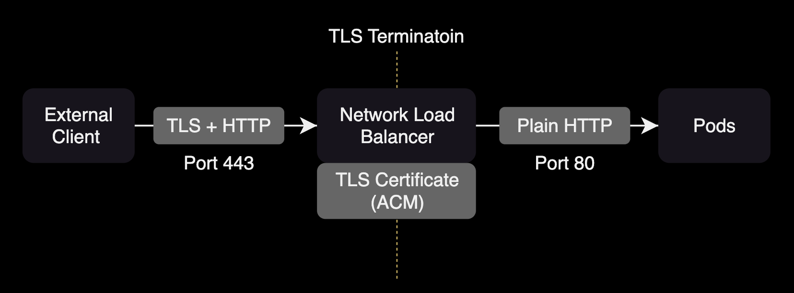

## 개요

Ingress nginx controller를 운영하면서 흔히 발생할 수 있는 `400 bad request` 에러에 대한 해결방법을 소개합니다.

&nbsp;

## 증상

curl을 사용하여 EKS 클러스터에 kube-prometheus-stack 차트를 통해 배포된 Grafana에 호출 시도:

```bash
$ curl -v https://grafana.doge.net/
*   Trying 13.125.119.168:443...
* Connected to grafana.doge.net (13.x.x.x) port 443
* ALPN: curl offers h2,http/1.1
* (304) (OUT), TLS handshake, Client hello (1):
*  CAfile: /etc/ssl/cert.pem
*  CApath: none
* (304) (IN), TLS handshake, Server hello (2):
* TLSv1.2 (IN), TLS handshake, Certificate (11):
* TLSv1.2 (IN), TLS handshake, Server key exchange (12):
* TLSv1.2 (IN), TLS handshake, Server finished (14):
* TLSv1.2 (OUT), TLS handshake, Client key exchange (16):
* TLSv1.2 (OUT), TLS change cipher, Change cipher spec (1):
* TLSv1.2 (OUT), TLS handshake, Finished (20):
* TLSv1.2 (IN), TLS change cipher, Change cipher spec (1):
* TLSv1.2 (IN), TLS handshake, Finished (20):
* SSL connection using TLSv1.2 / ECDHE-RSA-AES128-GCM-SHA256
* ALPN: server did not agree on a protocol. Uses default.
* Server certificate:
*  subject: CN=doge.net
...
* using HTTP/1.x
> GET / HTTP/1.1
> Host: grafana.doge.net
> User-Agent: curl/8.4.0
> Accept: */*
>
< HTTP/1.1 400 Bad Request
< Date: Tue, 14 May 2024 09:25:04 GMT
< Content-Type: text/html
< Content-Length: 248
< Connection: close
<
<html>
<head><title>400 The plain HTTP request was sent to HTTPS port</title></head>
<body>
<center><h1>400 Bad Request</h1></center>
<center>The plain HTTP request was sent to HTTPS port</center>
<hr><center>nginx</center>
</body>
</html>
* Closing connection
* TLSv1.2 (IN), TLS alert, close notify (256):
* TLSv1.2 (OUT), TLS alert, close notify (256):
```

`curl`로 URL 접근시 `HTTP/1.1 400 Bad Request` 오류가 발생합니다.

&nbsp;

## 환경

- EKS v1.29
- ingress-nginx v1.10.0 (헬름 차트 버전 4.10.0)
- EKS 클러스터에 이미 AWS Load Balancer Controller가 설치되어 있음

&nbsp;

## 원인

NLB에 TLS Termination이 설정되지 않아서 400 Bad Request 오류가 발생합니다.

ingress-nginx 차트에서 NLB는 loadBalancer 타입의 서비스 리소스로 생성됩니다. NLB의 포트 443 리스너로 트래픽이 들어오면 TLS를 종료하고 이를 ingress-nginx 포드의 포트 80으로 전달하도록 loadBalancer 서비스 설정을 변경해야 합니다.

&nbsp;

## 해결 방법

ingress-nginx 차트를 설치하면 LoadBalancer 타입 서비스가 생성됩니다. LoadBalancer 타입 서비스는 AWS Load Balancer Controller에 의해 NLB가 생성됩니다.

AWS Network Load Balancer는 2019년 1월부터 [TLS Termination 기능](https://aws.amazon.com/ko/blogs/korea/new-tls-termination-for-network-load-balancers/)을 지원합니다. 이를 통해 NLB에서 직접 SSL/TLS 인증서를 관리하고 트래픽을 암호화 해제하여 백엔드 인스턴스로 전달할 수 있습니다.

해당 NLB에 TLS Termination을 적용합니다. NLB에 TLS Termination을 적용하려면 ingress-nginx 헬름 차트로 생성된 서비스의 포트 설정을 변경해주면 됩니다.



https 설정의 targetPort가 `https` (TCP/443)가 아닌 `http` (TCP/80)여야 합니다.

&nbsp;

`kube-prometheus-stack` 차트로 배포된 Grafana의 인그레스:

```yaml
apiVersion: networking.k8s.io/v1
kind: Ingress
metadata:
  annotations:
    kubernetes.io/ingress.class: nginx
    meta.helm.sh/release-name: kube-prometheus-stack
    meta.helm.sh/release-namespace: monitoring
    nginx.ingress.kubernetes.io/rewrite-target: /
  creationTimestamp: "2024-05-14T07:39:33Z"
  generation: 1
  labels:
    app.kubernetes.io/instance: kube-prometheus-stack
    app.kubernetes.io/managed-by: Helm
    app.kubernetes.io/name: grafana
    app.kubernetes.io/version: 10.4.1
    helm.sh/chart: grafana-7.3.9
  name: kube-prometheus-stack-grafana
  namespace: monitoring
  resourceVersion: "231151113"
  uid: 7f72f082-7706-402b-b21f-52d6f3b5ccb6
spec:
  ingressClassName: nginx
  rules:
  - host: grafana.doge.net
    http:
      paths:
      - backend:
          service:
            name: kube-prometheus-stack-grafana
            port:
              number: 80
        path: /
        pathType: Prefix
```

&nbsp;

ingress-nginx 차트의 `targetPort`를 `https`에서 `http`로 수정합니다.

```diff
  # ingress-nginx/values.yaml
  ports:
    - name: http
      port: 80
      protocol: TCP
      targetPort: http
    - name: https
      port: 443
      protocol: TCP
-     targetPort: https
+     targetPort: http
```

&nbsp;

그런 다음 `helm upgrade` 명령을 사용하여 ingress-nginx-controller 서비스를 수정합니다.

```bash
$ kubectl get svc -n ingress-nginx
NAME                                 TYPE           CLUSTER-IP      EXTERNAL-IP                                   PORT(S)                      AGE
ingress-nginx-controller             LoadBalancer   172.20.11.118   <REDACTED>.elb.ap-northeast-2.amazonaws.com   80:30948/TCP,443:30608/TCP   138m
ingress-nginx-controller-admission   ClusterIP      172.20.154.40   <none>                                        443/TCP                      4h17m
```

&nbsp;

ingress-nginx 차트 값:

```yaml
# ingress-nginx/values.yaml
controller:
  service:
    # -- Enable controller services or not. This does not influence the creation of either the admission webhook or the metrics service.
    enabled: true
    external:
      # -- Enable the external controller service or not. Useful for internal-only deployments.
      enabled: true
    # -- Annotations to be added to the external controller service. See `controller.service.internal.annotations` for annotations to be added to the internal controller service.
    annotations:
      service.beta.kubernetes.io/aws-load-balancer-name: <REDACTED>-pub-nginx-ingress-nlb
      service.beta.kubernetes.io/aws-load-balancer-scheme: internet-facing
      service.beta.kubernetes.io/aws-load-balancer-nlb-target-type: ip
      service.beta.kubernetes.io/aws-load-balancer-cross-zone-load-balancing-enabled: "true"
      service.beta.kubernetes.io/aws-load-balancer-ssl-cert: "arn:aws:acm:ap-northeast-2:<REDACTED>:certificate/<REDACTED>"
      service.beta.kubernetes.io/aws-load-balancer-security-groups: <REDACTED>
      service.beta.kubernetes.io/aws-load-balancer-attributes: deletion_protection.enabled=true
```

ingress-nginx 서비스의 targetPort를 `https`에서 `http`로 변경한 후, Grafana 서비스를 정상적으로 접근할 수 있습니다.

&nbsp;

## 참고자료

- [kubernetes ingress-controller 400 Bad request - plain HTTP request sent to HTTPS port at stack overflow](https://stackoverflow.com/questions/70733110/kubernetes-ingress-controller-400-bad-request-plain-http-request-sent-to-http)
- [NLB TLS Termiation](https://kubernetes-sigs.github.io/aws-load-balancer-controller/v2.4/guide/use_cases/nlb_tls_termination/)
- [Network Load Balancer용 TLS 종료 기능 출시 (서울 리전 포함)](https://aws.amazon.com/ko/blogs/korea/new-tls-termination-for-network-load-balancers/)
