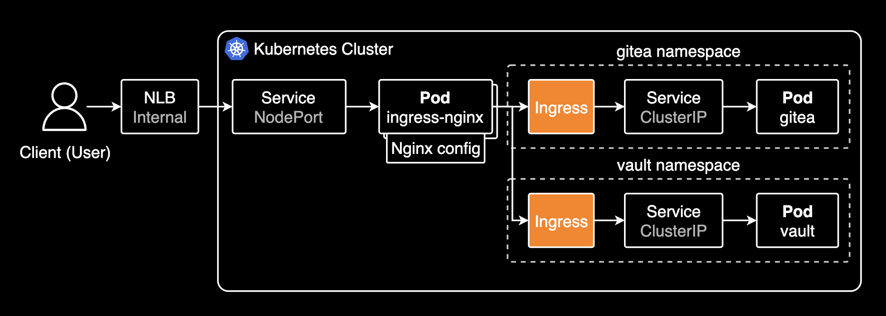
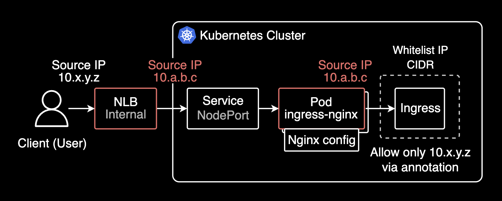
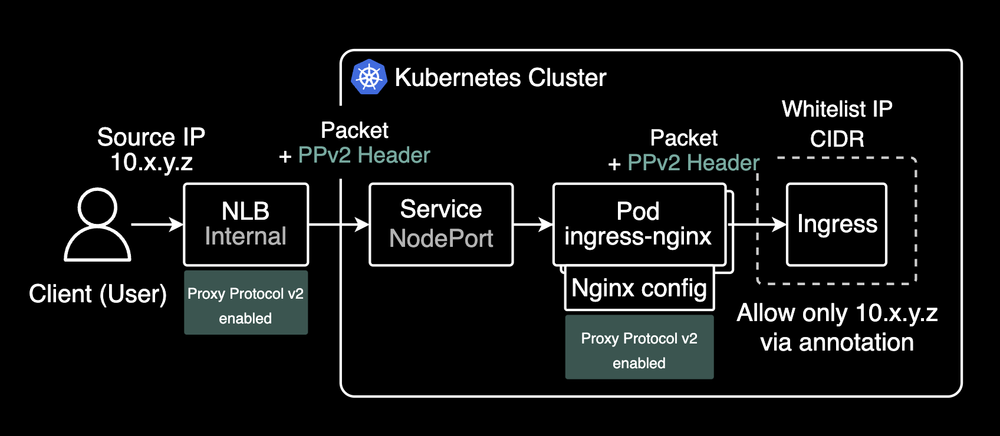
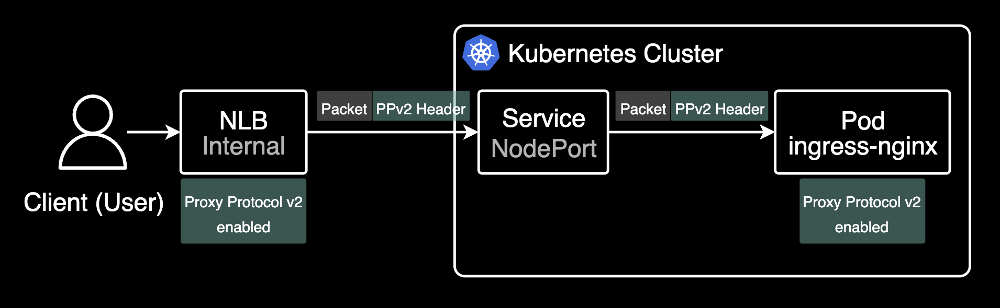
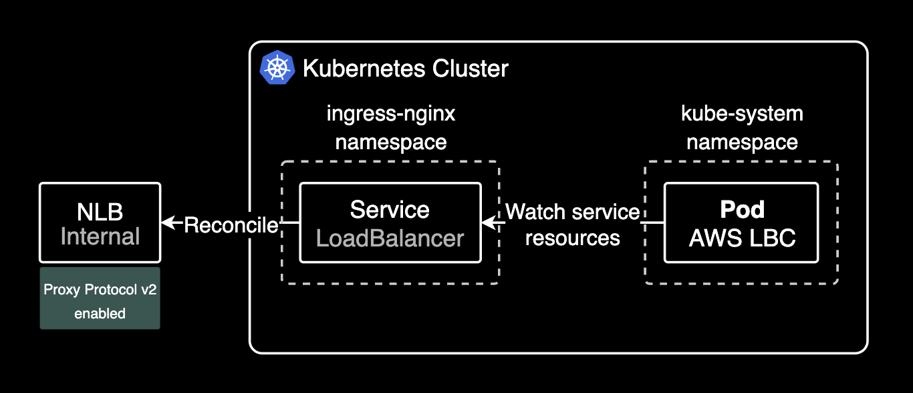
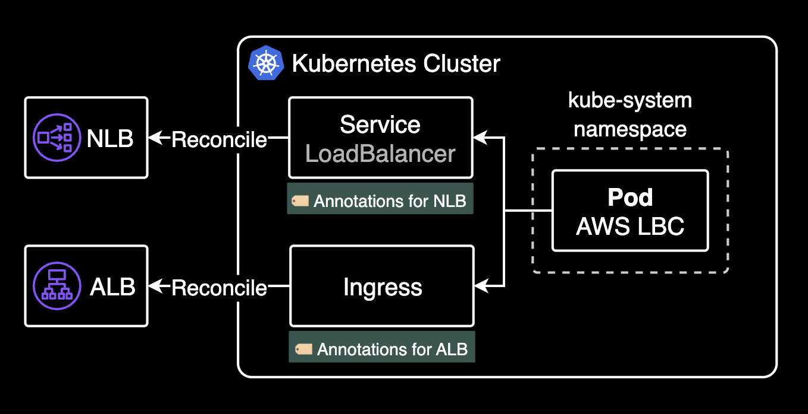

## 개요

EKS 환경에서 Ingress nginx controller의 IP ACL 기반 whitelist-source-range 기능을 사용할 때, 클라이언트의 실제 소스 IP가 NLB를 거치면서 변경되어 IP 기반 접근제어가 제대로 동작하지 않는 문제를 해결한 과정을 설명합니다.

&nbsp;

## 환경

문제가 발생한 인프라 환경은 다음과 같습니다:

- EKS v1.32
- **Internal Network Load Balancer**: 앞단의 클라이언트와 뒤단의 파드 사이에 위치하는 네트워크 로드밸런서로 최초 트래픽 진입점
- [AWS Load Balancer Controller 2.7.0](https://kubernetes-sigs.github.io/aws-load-balancer-controller/v2.7/) (installed by helm chart)
- **Ingress controller**: [Ingress nginx controller](https://github.com/kubernetes/ingress-nginx) 1.12.0 (installed by helm chart)
- No Service Mesh like Istio or Linkerd

&nbsp;

## 진행배경

사용자들이 Ingress를 거쳐 파드로 들어오는 경로에서 Network Policy가 아닌 Ingress nginx controller의 IP 기반 접근제어를 적용하고 싶었음. 해당 파드는 보안 중요도가 높은 서버였기 때문에 IP 기반 접근제어를 적용해서 환경을 좀 더 격리하고 보호해야만 하는 요구사항이 있었습니다.

&nbsp;

기존에 Ingress 컨트롤러로 ingress-nginx-controller를 사용하고 있었습니다. 최초 트래픽 진입점은 Internal NLB였습니다.



Ingress 리소스에 [whitelist-source-range 어노테이션](https://github.com/kubernetes/ingress-nginx/blob/main/docs/user-guide/nginx-configuration/annotations.md#whitelist-source-range)을 추가하여 여러 개의 IP 대역을 화이트리스트로 설정해서 파드를 보호할 수 있습니다. 이 어노테이션을 Ingress nginx controller 파드가 감지하면, 파드에서 허용된 IP 대역에 대해서만 트래픽을 허용합니다.

기존 Ingress에 IP 기반 접근제어를 적용하기 위해 아래와 같이 어노테이션을 추가합니다.

```yaml
apiVersion: networking.k8s.io/v1
kind: Ingress
metadata:
  name: gitea
  namespace: gitea
  annotations:
    nginx.ingress.kubernetes.io/rewrite-target: /
    nginx.ingress.kubernetes.io/service-upstream: "true"
    nginx.ingress.kubernetes.io/ssl-redirect: "false"
    nginx.ingress.kubernetes.io/whitelist-source-range: 10.x.y.z/32
spec:
  ingressClassName: nginx
  rules:
  - host: gitea.example.com
    http:
      paths:
      - backend:
          service:
            name: gitea-http
            port:
              number: 3000
        path: /
        pathType: Prefix
```

&nbsp;

만약 2개 이상의 IP 대역을 화이트리스트로 설정하고 싶다면, [whitelist-source-range 어노테이션](https://github.com/kubernetes/ingress-nginx/blob/main/docs/user-guide/nginx-configuration/annotations.md#whitelist-source-range)의 값을 쉼표로 구분하여 여러 개의 IP 대역을 한 번에 설정할 수 있습니다.

```yaml
nginx.ingress.kubernetes.io/whitelist-source-range: 10.x.y.z/32,10.a.b.c/32
```

&nbsp;

처음에 ingress-nginx-controller를 사용해서 IP 기반의 화이트리스트는 잘 적용되긴 했습니다. 그치만 제 소스 IP인 10.x.y.z/32 에서 접근하더라도 403 Forbidden 에러가 뜨는 이슈가 있었습니다. 현재 Ingress-nginx-controller의 설정대로라면 10.a.b.c/32 에서만 접근이 가능해야 하는데, 제 소스 IP인 10.x.y.z/32 에서도 403 Forbidden 에러가 뜨는 이슈가 있었습니다.

원인 파악을 위해 ingress-nginx-controller 파드 로그 먼저 조회해보았습니다.

```bash
ingress-nginx-controller-858dcf4bff-9g2n8 2025/03/19 10:01:03 [error] 31#31: *1393 access forbidden by rule, client: 10.a.b.c, server: gitea.example.com, request: "GET / HTTP/1.1", host: "gitea.example.com"
ingress-nginx-controller-858dcf4bff-9g2n8 2025/03/19 10:01:04 [error] 31#31: *1393 access forbidden by rule, client: 10.a.b.c, server: gitea.example.com, request: "GET /favicon.ico HTTP/1.1", host: "gitea.example.com", referrer: "https://gitea.example.com/"
```

ingress-nginx-controller 파드 로그에서 access forbidden by rule 에러 로그를 확인할 수 있습니다. 이는 Ingress에 설정된 whitelist-source-range 어노테이션에 의해 허용된 IP가 아니라 접근이 제한되어 403 Forbidden 에러가 발생했다는 것을 의미합니다.

설정 의도와 달리 제 소스 Private IP(10.x.y.z)가 아닌 NLB의 Private IP(10.a.b.c)로 바뀌어서 ingress-nginx 파드로 패킷이 전달되고 있었습니다. 당연히 허용된 IP가 아니라 클라이언트에게 403 Forbidden 에러가 반환되었습니다.

&nbsp;

아래와 같이 특정 Ingress에 대한 화이트리스트 IP ACL 설정은 Ingress 리소스에 잘 들어가 있는데, 왜 제 출발지 Private IP(10.x.y.z)가 아닌 NLB의 Private IP(10.a.b.c)로 중간에 변환되어 전달되었을까요?

```yaml
metadata:
  annotations:
    nginx.ingress.kubernetes.io/whitelist-source-range: 10.x.y.z/32
```

NLB와 Ingress nginx controller 구간 사이에서 출발지 IP가 NLB의 Private IP로 변환되어 ingress-nginx 파드로 패킷이 전달되는 것을 해결하면 되는 문제입니다.



이걸 해결한다는 건, 제 출발지 IP를 헤더를 사용해 마지막 목적지인 파드까지 보존하는 것을 의미합니다.

&nbsp;

제 소스 IP가 NLB를 거쳐 목적지 파드까지 전달되는 경로는 아래와 같습니다.


1. 내 소스 Private IP가 VPC 내부의 Internal NLB에 도달
2. Internal NLB가 소스 IP를 자기 자신의 소스 IP로 변경하여 ingress-nginx 서비스로 전달
3. ingress-nginx 서비스는 화이트리스트를 조회하여 허용된 소스 IP인지 확인
4. 허용된 소스 IP가 아니라 403 Forbidden 에러를 NLB에 반환
5. NLB는 403 Forbidden 에러를 클라이언트에게 반환

&nbsp;

## 조치하기

Ingress nginx controller가 관리하고 있는 Ingress 리소스에서 화이트리스트를 설정하고자 하는 니즈가 있었음. 목적지는 VCS 서비스인 Gitea 파드였습니다.

&nbsp;

사용자의 Private한 출발지 IP를 목적지 파드까지 보존해야했음. 목적지 파드까지 패킷이 전달하는 데에는 매우 복잡한 경로였습니다.

```bash
💻 Client --> Office LAN --Site-to-Site VPN--> Transit Gateway --> VPC Attachment --> 1️⃣ Internal NLB --> Service (NodePort) --> 2️⃣ Ingress nginx controller --> Service (ClusterIP) --> Gitea Pod
```

&nbsp;

Network Load Balancer를 Ingress-nginx controller 앞단에 두고 운영하는 구성의 경우, 크게 3개의 작업을 해서 소스 IP를 마지막 목적지 파드까지 보존할 수 있습니다.



1. NLB의 Proxy Protocol v2 기능 활성화
2. Ingress nginx controller의 컨피그맵에서 use-proxy-header 값을 true로 설정
3. Ingress nginx controller가 관리하는 Ingress 리소스에서 화이트리스트 설정

&nbsp;

### Network Load Balancer

클라이언트 소스 IP 주소가 목적지 파드까지 보존하기 위해서는 아래 [annotation](https://kubernetes-sigs.github.io/aws-load-balancer-controller/v2.2/guide/service/nlb/)을 추가해서 NLB에 Proxy Protocol v2를 활성화합니다.

Proxy Protocol v2를 활성화하면, L4 계층에서 NLB는 소스 IP와 포트뿐만 아니라 목적지 서버 IP와 포트, 프로토콜 타입(IPv4, IPv6 등) 정보를 이진 형식으로 헤더에 추가하여 뒷단 파드에 전달합니다. 이 헤더는 PPv2 헤더라고 부르며, 이 헤더를 통해 클라이언트의 소스 IP와 포트 정보를 목적지 파드까지 보존할 수 있습니다.



Network Load Balancer에서 Proxy Protocol v2는 기본적으로 비활성화되어 있습니다. ALB(Application Load Balancer)는 기본적으로 L7 계층을 담당하는 로드밸런서이므로 X-Forwarded-For 헤더를 통해 클라이언트의 소스 IP를 보존합니다.

```yaml
apiVersion: v1
kind: Service
metadata:
  annotations:
    service.beta.kubernetes.io/aws-load-balancer-proxy-protocol: "*"
```

Load Balancer Controller가 해당 어노테이션을 감지한 후 NLB에 Proxy Protocol v2가 설정됩니다.



Load Balancer Controller(Pod)는 LoadBalancer 타입의 Service 리소스를 감지하고, 해당 서비스에 붙어있는 어노테이션 설정들을 토대로 NLB를 생성하고 상세 설정을 자동으로 추가합니다.

&nbsp;

Load Balancer Controller는 크게 2가지 타입의 Load Balancer 관리를 담당합니다. 어느 타입의 로드밸런서를 사용할지에 따라 생성할 쿠버네티스 리소스와 어노테이션이 달라집니다.



- **Network Load Balancer**: LoadBalancer 타입의 서비스 리소스에 붙어있는 어노테이션을 기반으로 생성되는 Load Balancer
- **Application Load Balancer**: Ingress 리소스에 붙어있는 어노테이션을 기반으로 생성되는 Load Balancer

&nbsp;

NLB를 구현하는 주체인 Service 리소스의 이벤트를 조회해보면 Load Balancer Controller가 해당 어노테이션을 감지한 후 NLB에 Proxy Protocol v2를 설정하는 것을 확인할 수 있습니다.

```bash
kubectl describe service -n ingress-nginx ingress-nginx-controller
```

```bash
Name:                     ingress-nginx-controller
Namespace:                ingress-nginx
...
Type:                     LoadBalancer
...
Events:
  Type    Reason                  Age                  From     Message
  ----    ------                  ----                 ----     -------
  Normal  SuccessfullyReconciled  46m (x5 over 7h23m)  service  Successfully reconciled
  Normal  SuccessfullyReconciled  28m (x2 over 28m)    service  Successfully reconciled
  Normal  SuccessfullyReconciled  17m                  service  Successfully reconciled
```

SuccessfullyReconciled 이벤트는 Load Balancer Controller가 해당 어노테이션을 감지한 후 NLB에 Proxy Protocol v2를 설정했음을 의미합니다.

&nbsp;

#### Proxy Protocol v2 설정시 주의사항

NLB에 프록시 프로토콜 v2를 활성화하면, NLB(Network Load Balancer) Health Check가 HTTP/HTTPS로만 작동하며, 이때 Health Check 포트(이 시나리오에서는 ingress-nginx가 노출한 노드포트)가 프록시 프로토콜 v2를 지원해야 합니다. 이 동작으로 인해, NLB 인스턴스 모드에서 externalTrafficPolicy가 Local로 설정된 경우에는 프록시 프로토콜 v2를 구성하지 않는 것이 좋습니다. externalTrafficPolicy를 Local 대신 기본값인 Cluster로 설정하는 걸 권장합니다.

```yaml
apiVersion: v1
kind: Service
metadata:
  # ...
spec:
  allocateLoadBalancerNodePorts: true
  clusterIP: 172.20.38.198
  clusterIPs:
  - 172.20.38.198
  externalTrafficPolicy: Cluster
  internalTrafficPolicy: Cluster
  ipFamilies:
  - IPv4
```

&nbsp;

NLB에서 Proxy Protocol v2를 활성화했으면 그 다음 지점인 Ingress nginx controller 파드에서 [use-proxy-header 기능](https://kubernetes.github.io/ingress-nginx/user-guide/nginx-configuration/configmap/#use-proxy-protocol)을 활성화해야 합니다.

&nbsp;

### Ingress nginx controller

ingress-nginx controller의 configMap에 아래 설정을 추가합니다.

ingress-nginx-controller에서 Proxy Protocol v2를 활성화하는 작업을 설정하는 방법에는 크게 2가지가 있습니다: 

1. kubectl edit 명령어를 사용해서 configMap에 설정값을 추가하는 방법
2. helm chart에서 설정하는 방법

&nbsp;

아래는 kubectl로 직접 configMap에 설정값을 추가하는 방법입니다.

```bash
kubectl edit configmap ingress-nginx-controller -n ingress-nginx
```

```yaml
apiVersion: v1
kind: ConfigMap
metadata:
  name: ingress-nginx-controller
  namespace: ingress-nginx
data:
  use-proxy-protocol: "true"
```

use-proxy-protocol을 true로 설정합니다. 선언하지 않으면 기본값은 false입니다.

&nbsp;

헬름 차트 (ingress-nginx-controller 1.12.0 기준):

```yaml
# charts/ingress-nginx/values.yaml
controller:
  config:
    use-proxy-protocol: "true"
```

&nbsp;

10.x.y.z 소스 IP가 ingress-nginx-controller 파드로 전달되는 걸 확인할 수 있습니다. 원래는 NLB의 Private IP로 전달되었던게 문제였지만요.

&nbsp;

기본적으로 Ingress nginx controller 파드에 기록되는 로그 포맷은 아래와 같습니다. 한 요청에 대해 총 19개의 필드가 아래와 같은 포맷으로 기록됩니다. 이 로그를 통해 트러블슈팅 시 요청 정보의 디테일한 기록을 확인할 수 있습니다.

```bash
$remote_addr - - [$time_local] "$request" $status $body_bytes_sent "$http_referer" "$http_user_agent" $request_length $request_time [$proxy_upstream_name[] [] $upstream_addr $upstream_response_length $upstream_response_time $upstream_status $request_id
```

&nbsp;

목적지 접속 성공 이후 Ingress nginx controller 파드 로그:

```bash
ingress-nginx-controller-858dcf4bff-jmndz 10.x.y.z - - [19/Mar/2025:11:00:37 +0000] "GET /assets/css/index.css?v=1.23.5 HTTP/1.1" 200 63593 "-" "Mozilla/5.0 (Macintosh; Intel Mac OS X 10_15_7) AppleWebKit/537.36 (KHTML, like Gecko) Chrome/134.0.0.0 Safari/537.36" 3067 0.001 [gitea-gitea-http-3000[] [] <REDACTED_POD_IP>:3000 63485 0.001 200 871bcb777c269d5d6be938f3b75f59bd
ingress-nginx-controller-858dcf4bff-prrx5 10.x.y.z - - [19/Mar/2025:11:00:37 +0000] "GET /assets/css/theme-gitea-dark.css?v=1.23.5 HTTP/1.1" 200 2928 "-" "Mozilla/5.0 (Macintosh; Intel Mac OS X 10_15_7) AppleWebKit/537.36 (KHTML, like Gecko) Chrome/134.0.0.0 Safari/537.36" 3078 0.001 [gitea-gitea-http-3000[] [] <REDACTED_POD_IP>:3000 2928 0.001 200 74cc90470a06a64aed44eb643b81864e
ingress-nginx-controller-858dcf4bff-f9vgf 10.x.y.z - - [19/Mar/2025:11:00:37 +0000] "GET / HTTP/1.1" 200 32650 "-" "Mozilla/5.0 (Macintosh; Intel Mac OS X 10_15_7) AppleWebKit/537.36 (KHTML, like Gecko) Chrome/134.0.0.0 Safari/537.36" 3209 0.055 [gitea-gitea-http-3000[] [] <REDACTED_POD_IP>:3000 32700 0.056 200 8c2e87143958ca34b27ba19022695115
ingress-nginx-controller-858dcf4bff-f9vgf 10.x.y.z - - [19/Mar/2025:11:00:37 +0000] "GET /assets/js/webcomponents.js?v=1.23.5 HTTP/1.1" 200 30720 "-" "Mozilla/5.0 (Macintosh; Intel Mac OS X 10_15_7) AppleWebKit/537.36 (KHTML, like Gecko) Chrome/134.0.0.0 Safari/537.36" 3059 0.000 [gitea-gitea-http-3000[] [] <REDACTED_POD_IP>:3000 30666 0.001 200 aac64d5943edfce3c394205c6204274a
ingress-nginx-controller-858dcf4bff-prrx5 10.x.y.z - - [19/Mar/2025:11:00:37 +0000] "GET /assets/js/index.js?v=1.23.5 HTTP/1.1" 200 315536 "-" "Mozilla/5.0 (Macintosh; Intel Mac OS X 10_15_7) AppleWebKit/537.36 (KHTML, like Gecko) Chrome/134.0.0.0 Safari/537.36" 3051 0.001 [gitea-gitea-http-3000[] [] <REDACTED_POD_IP>:3000 315005 0.001 200 172928355ffca5939f55223bef1b86a7
ingress-nginx-controller-858dcf4bff-f9vgf 10.x.y.z - - [19/Mar/2025:11:00:37 +0000] "GET /assets/img/logo.svg HTTP/1.1" 200 1040 "-" "Mozilla/5.0 (Macintosh; Intel Mac OS X 10_15_7) AppleWebKit/537.36 (KHTML, like Gecko) Chrome/134.0.0.0 Safari/537.36" 3103 0.000 [gitea-gitea-http-3000[] [] <REDACTED_POD_IP>:3000 1040 0.000 200 2847617f8dc3f01f3cf19916b9726f70
ingress-nginx-controller-858dcf4bff-f9vgf 10.x.y.z - - [19/Mar/2025:11:00:37 +0000] "GET /avatars/0642e3e25d9a91d2519388e6e4dbc915?size=56 HTTP/1.1" 200 2484 "-" "Mozilla/5.0 (Macintosh; Intel Mac OS X 10_15_7) AppleWebKit/537.36 (KHTML, like Gecko) Chrome/134.0.0.0 Safari/537.36" 3132 0.000 [gitea-gitea-http-3000[] [] <REDACTED_POD_IP>:3000 2484 0.001 200 7bdf769c725279a8f9fbfeed3a00fe84
ingress-nginx-controller-858dcf4bff-prrx5 10.x.y.z - - [19/Mar/2025:11:00:37 +0000] "GET /repo/search?sort=updated&order=desc&uid=1&team_id=undefined&q=f&page=1&limit=15&mode=&archived=false HTTP/1.1" 200 22 "-" "Mozilla/5.0 (Macintosh; Intel Mac OS X 10_15_7) AppleWebKit/537.36 (KHTML, like Gecko) Chrome/134.0.0.0 Safari/537.36" 3077 0.026 [gitea-gitea-http-3000[] [] <REDACTED_POD_IP>:3000 22 0.026 200 d2211c8c5b3da00a5f256a7fd92c086e
```

위 로그를 살펴보면 백엔드 파드(gitea-gitea-http-3000)가 200 OK 응답을 반환했고, 최종적으로 클라이언트(10.x.y.z)가 이를 받아 정상적으로 목적지까지 도달했음을 확인할 수 있습니다.

&nbsp;

## 결론

NLB에서 Proxy Protocol v2 기능을 활성화하면 소스 IP를 보존할 수 있습니다. 기본적으로 NLB는 소스 IP를 보존하지 않지만, Proxy Protocol v2를 사용하면 원본 클라이언트의 IP 주소를 포함한 PPv2 헤더 정보를 전달하여, 백엔드 서버가 실제 클라이언트의 IP를 확인할 수 있게 됩니다. 이 기능은 TCP/UDP 연결을 통해 클라이언트의 실제 IP를 보존하려는 경우 유용하게 사용됩니다.

- NLB는 Layer 4 로드밸런서로 클라이언트의 소스 IP를 보존하지 않습니다.
- 클라이언트의 소스 IP를 보존하기 위해서는 Proxy Protocol v2를 활성화해야 합니다.
- Proxy Protocol v2 기능을 활성화하면, 클라이언트의 소스 IP가 목적지 파드까지 보존됩니다.
- Proxy Protocol v2 기능을 NLB에서 활성화했다면, 그 다음 트래픽 진입점인 Ingress nginx controller 파드에서도 동일하게 활성화해야 합니다.

&nbsp;

## 관련자료

Ingress nginx controller:

- [Ingress nginx의 ConfigMap 설정 문서](https://kubernetes.github.io/ingress-nginx/user-guide/nginx-configuration/configmap/#use-proxy-protocol)
- [Ingress annotations](https://github.com/kubernetes/ingress-nginx/blob/main/docs/user-guide/nginx-configuration/annotations.md)

AWS Load Balancer Controller:

- [Network Load Balancer > Protocols](https://kubernetes-sigs.github.io/aws-load-balancer-controller/v2.7/guide/service/nlb/#protocols)

Article:

- [Preserving client IP address with Proxy protocol v2 and Network Load Balancer](https://aws.amazon.com/ko/blogs/networking-and-content-delivery/preserving-client-ip-address-with-proxy-protocol-v2-and-network-load-balancer/): AWS 공식 블로그에서 제공하는 문서로, Proxy Protocol v2와 Network Load Balancer를 사용해 클라이언트의 소스 IP를 보존하는 방법을 설명합니다.
- [진짜 Source IP 를 Pod 까지 제대로 전달 하기 위한 삽질기](https://blog.barogo.io/%EC%A7%84%EC%A7%9C-source-ip-%EB%A5%BC-pod-%EA%B9%8C%EC%A7%80-%EC%A0%9C%EB%8C%80%EB%A1%9C-%EC%A0%84%EB%8B%AC-%ED%95%98%EA%B8%B0-%EC%9C%84%ED%95%9C-%EC%82%BD%EC%A7%88%EA%B8%B0-2e928a5f9e3e)