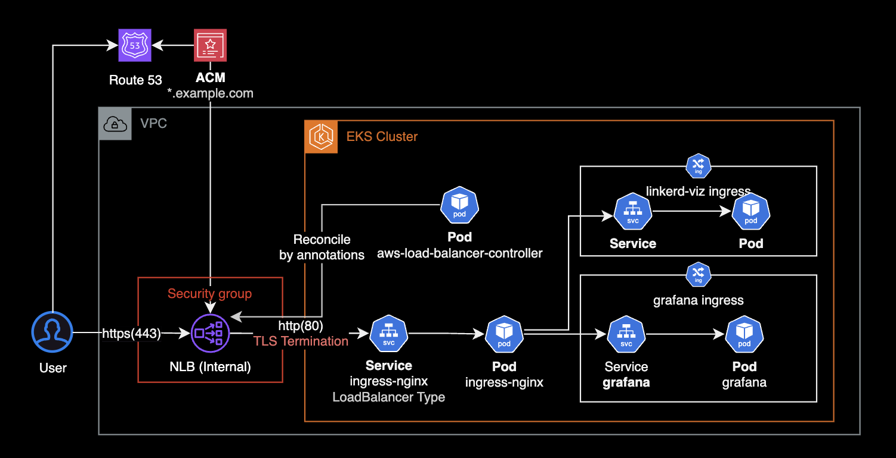
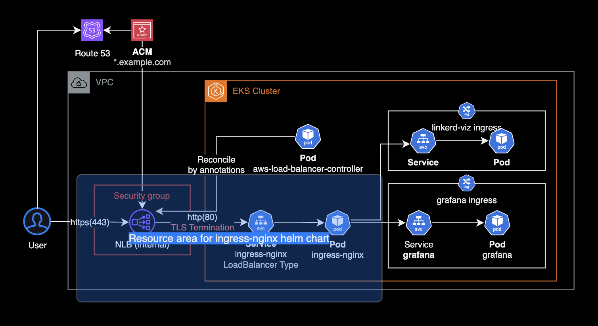
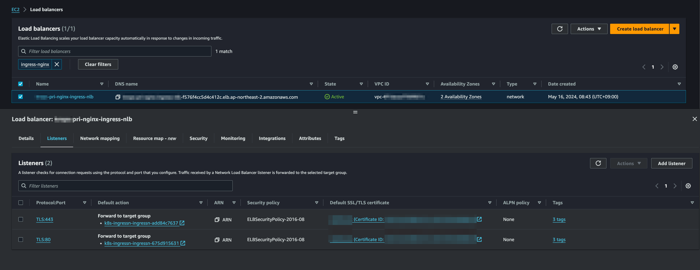
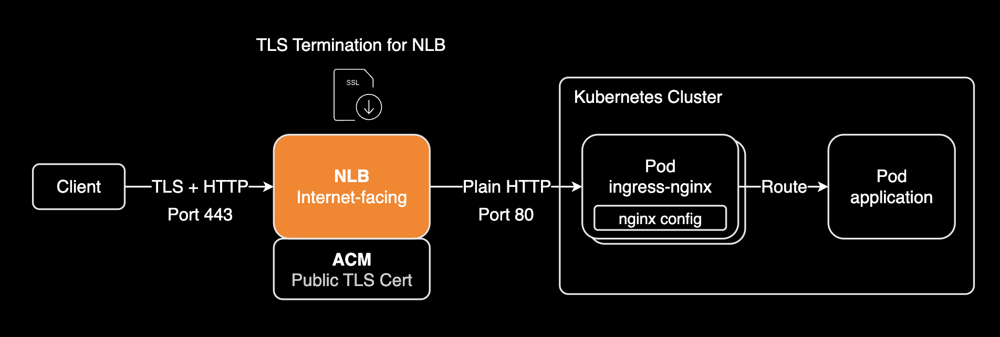
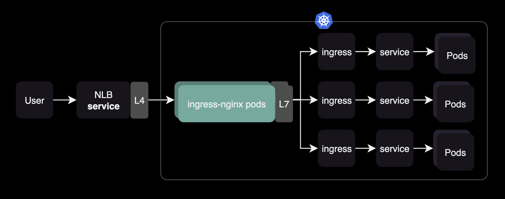
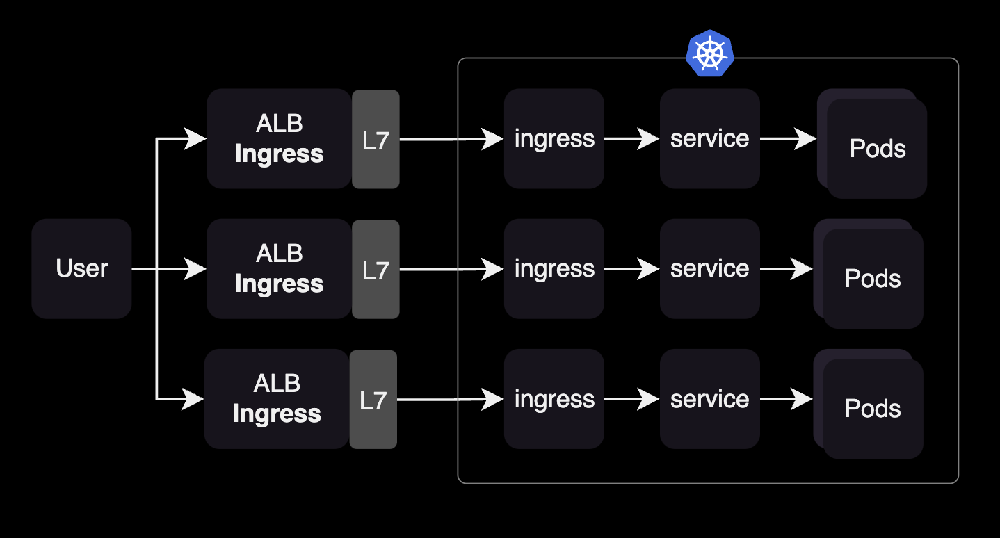
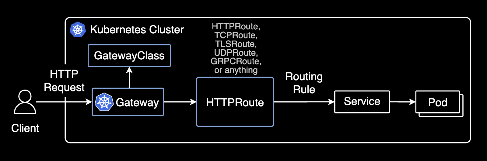

## 개요

ingress-nginx controller와 Internal NLB + ACM 조합해서 네트워크 구성하기.

이 가이드는 쿠버네티스 클러스터와 Ingress 리소스를 관리하는 DevOps Engineer 또는 SRE를 위한 네트워크 구성 가이드입니다.

&nbsp;

## 환경

외부 사용자의 요청을 NLB로 받아 클러스터 내부의 ingress-nginx controller로 전달하는 네트워크 구성입니다.



클러스터 내부에서 Ingress nginx controller 파드는 내부 NLB로 전달된 트래픽을 받아 클러스터 내부의 서비스로 전달합니다. 이 때, Ingress 리소스에 설정된 라우팅 규칙에 따라 트래픽이 뒷단의 파드로 전달됩니다.

&nbsp;

## 구성하기

### ingress-nginx chart

`ingress-nginx` 차트에서 service를 생성합니다.

```yaml
# ingress-nginx/values.yaml
controller:
  ...
  service:
    # -- Enable controller services or not. This does not influence the creation of either the admission webhook or the metrics service.
    enabled: true
    external:
      # -- Enable the external controller service or not. Useful for internal-only deployments.
      enabled: true
    # -- Annotations to be added to the external controller service. See `controller.service.internal.annotations` for annotations to be added to the internal controller service.
    annotations:
      service.beta.kubernetes.io/aws-load-balancer-name: <INTERNAL_NLB_NAME>
      service.beta.kubernetes.io/aws-load-balancer-scheme: internal
      service.beta.kubernetes.io/aws-load-balancer-nlb-target-type: ip
      service.beta.kubernetes.io/aws-load-balancer-cross-zone-load-balancing-enabled: "true"
      service.beta.kubernetes.io/aws-load-balancer-ssl-cert: "arn:aws:acm:ap-northeast-2:<ACCOUNT_ID>:certificate/<ACM_ID>"
      service.beta.kubernetes.io/aws-load-balancer-security-groups: sg-013f5ee1423faf2ca
      service.beta.kubernetes.io/aws-load-balancer-attributes: deletion_protection.enabled=true
```

&nbsp;

`ingress-nginx` 파드에 고가용성 및 파드 오토스케일링을 적용하기 위해 다음과 HPA<sup>Horizontal Pod Autoscaler</sup>를 설정합니다.

```yaml
# ingress-nginx/values.yaml
controller:
  # Mutually exclusive with keda autoscaling
  autoscaling:
    enabled: true
    annotations: {}
    minReplicas: 2
    maxReplicas: 11
    targetCPUUtilizationPercentage: 50
    targetMemoryUtilizationPercentage: 50
    behavior: {}
```

CPU 사용률이 50% 또는 메모리 사용률이 50%를 기준으로 HPA에 의해 파드 스케일 인/아웃이 진행됩니다.

&nbsp;

`nginx` IngressClass를 클러스터의 디폴트 ingressClass로 지정하려면 `controller.ingressClassResource.default` 값을 `true`로 설정합니다.

```yaml
# ingress-nginx/values.yaml
controller:
  ...
  ingressClassResource:
    # -- Name of the IngressClass
    name: nginx
    # -- Create the IngressClass or not
    enabled: true
    # -- If true, Ingresses without `ingressClassName` get assigned to this IngressClass on creation.
    # Ingress creation gets rejected if there are multiple default IngressClasses.
    # Ref: https://kubernetes.io/docs/concepts/services-networking/ingress/#default-ingress-class
    default: true
```

&nbsp;

`nginx` IngressClass는 `ingress-nginx` 컨트롤러 차트에 포함되어 있습니다. 차트를 설치하면 `nginx` ingressClass가 같이 생성됩니다.

```bash
$ kubectl get ingressclass
NAME    CONTROLLER             PARAMETERS   AGE
alb     ingress.k8s.aws/alb    <none>       5d19h
nginx   k8s.io/ingress-nginx   <none>       5d19h
```

&nbsp;

`ingress-nginx` 컨트롤러를 통해 특정 Ingress를 제어하고 싶은 경우에는 ingressClassName을 `nginx`로 지정할 수 있습니다.

아래는 `Ingress` 리소스에 `ingressClass`로 `nginx`를 지정하는 예시입니다.

```yaml
apiVersion: networking.k8s.io/v1
kind: Ingress
...
spec:
  ingressClassName: nginx
```

&nbsp;

`ingress-nginx` 헬름 차트를 설치하면 `LoadBalancer` 타입의 Service 리소스가 생성됩니다.

`ingress-nginx` 차트에 의해 배포, 관리되는 인프라 리소스 영역은 다음과 같습니다.



&nbsp;

사전에 헬름 차트를 통해 [AWS Load Balancer Controller](https://github.com/kubernetes-sigs/aws-load-balancer-controller/)가 위 서비스 리소스에 설정된 annotation을 확인한 후, 그에 맞게 설정이 적용된 Network Load Balancer를 생성합니다.



ingress-nginx 차트에서 NLB는 loadBalancer 타입의 service 리소스를 통해 생성되며, 자세한 상세 설정은 AWS LBC에 의해 제어되는 구조입니다.

&nbsp;

### TLS Termination 설정

NLB에 TLS Termination 설정을 적용합니다.



[NLB에서 TLS Termination](https://aws.amazon.com/ko/blogs/korea/new-tls-termination-for-network-load-balancers/)은 클라이언트로부터 들어오는 HTTPS 트래픽(443포트)을 받아서 암호화를 해제한 후, 내부 서비스로는 일반 HTTP(80포트) 트래픽으로 전달하는 방식입니다. 이렇게 구성하면 내부 서비스들은 복잡한 인증서 관리나 암호화 처리를 신경 쓸 필요 없이 HTTP 통신만 처리하면 되므로, 시스템 구성이 단순해지고 성능 부담도 줄일 수 있습니다.

앞단의 NLB에서 TLS Termination이 적용되지 않으면 ingress-nginx 뒷단의 서비스들로 접근시 400 Bad Request 에러, 즉 `The plain HTTP request was sent to HTTPS port` 에러가 발생할 수 있습니다. 자세한 사항은 [400 Bad Request "Play HTTP request was sent to HTTPS port" using ingress-nginx behind AWS Network Load Balancer #5206](https://github.com/kubernetes/ingress-nginx/issues/5206#issuecomment-668224462) 이슈에서 확인할 수 있습니다.

트래픽이 NLB의 443 포트 리스너로 들어오면 TLS를 종료하고 ingress-nginx Pod의 80 포트로 전달하도록 `loadBalancer` 서비스 설정을 변경합니다.

```diff
controller:
  ...
  service:
    ...
    ports:
      # -- Port the external HTTP listener is published with.
      http: 80
      # -- Port the external HTTPS listener is published with.
      https: 443
    targetPorts:
      # -- Port of the ingress controller the external HTTP listener is mapped to.
      http: http
      # -- Port of the ingress controller the external HTTPS listener is mapped to.
-     https: https
+     https: http
```

위 `service` 리소스의 설정을 변경하고 헬름 차트를 재배포하게 되면 AWS Load Balancer Controller는 NLB의 443 포트 리스너 설정을 변경합니다.

더 자세한 사항은 [Stack overflow 논의](https://stackoverflow.com/questions/70733110/kubernetes-ingress-controller-400-bad-request-plain-http-request-sent-to-http)를 확인합니다.

&nbsp;

### Grafana ingress 구성

`ingress-nginx` 파드가 트래픽을 받은 후, Grafana 파드로 연결하기 위해 Grafana Ingress 리소스를 생성합니다.

이 때, Grafana Ingress를 `ingress-nginx` 컨트롤러와 연결하기 위해 `ingressClassName`과 `kubernetes.io/ingress.class` 어노테이션을 추가합니다.

```yaml
# kube-proemtheus-stack/values.yaml
grafana:
  ingress:
    ## If true, Grafana Ingress will be created
    ##
    enabled: true

    ## IngressClassName for Grafana Ingress.
    ## Should be provided if Ingress is enable.
    ##
    ingressClassName: nginx

    ## Annotations for Grafana Ingress
    ##
    annotations:
      nginx.ingress.kubernetes.io/rewrite-target: /
      nginx.ingress.kubernetes.io/ssl-redirect: "false"
      kubernetes.io/ingress.class: nginx
```

ingress-nginx 컨트롤러가 설치된 환경에서 `ingressClassName: nginx`로 설정하면, Grafana Ingress 리소스는 NGINX Ingress 컨트롤러에 의해 처리됩니다. 이는 NGINX 컨트롤러가 Grafana에 대한 HTTP(S) 요청을 관리하고 라우팅함을 의미합니다.

&nbsp;

Ingress 리소스에서 `kubernetes.io/ingress.class` annotation은 [Kubernetes v1.18부터 deprecation](https://kubernetes.io/blog/2020/04/02/improvements-to-the-ingress-api-in-kubernetes-1.18/#deprecating-the-ingress-class-annotation) 되었습니다. 대신 `spec.ingressClassName`을 사용합니다.

```diff
apiVersion: networking.k8s.io/v1
kind: Ingress
metadata:
  annotations:
-   kubernetes.io/ingress.class: nginx
  name: kube-prometheus-stack-grafana
  namespace: monitoring
spec:
+ ingressClassName: nginx
```

&nbsp;

위 `kube-prometheus-stack`의 차트 설정에 의해 생성된 grafana ingress 리소스 설정은 다음과 같습니다.

```yaml
apiVersion: networking.k8s.io/v1
kind: Ingress
metadata:
  annotations:
    meta.helm.sh/release-name: kube-prometheus-stack
    meta.helm.sh/release-namespace: monitoring
    nginx.ingress.kubernetes.io/rewrite-target: /
    nginx.ingress.kubernetes.io/ssl-redirect: "false"
  labels:
    app.kubernetes.io/instance: kube-prometheus-stack
    app.kubernetes.io/managed-by: Helm
    app.kubernetes.io/name: grafana
    app.kubernetes.io/version: 10.4.1
    helm.sh/chart: grafana-7.3.9
  name: kube-prometheus-stack-grafana
  namespace: monitoring
spec:
  ingressClassName: nginx
  rules:
  - host: grafana.example.com
    http:
      paths:
      - backend:
          service:
            name: kube-prometheus-stack-grafana
            port:
              number: 80
        path: /
        pathType: Prefix
status:
  loadBalancer:
    ingress:
    - hostname: <REDACTED>
```

&nbsp;

## 결론

`ingress-nginx` 컨트롤러를 도입했을 때 가장 큰 기대효과는 여러 네임스페이스의 여러 개의 ingress 리소스를 `nginx` 파드를 통해 쉽게 라우팅 제어할 수 있습니다.



&nbsp;

ingress-nginx-controller와 같은 Ingress controller를 사용하지 않으면 Kubernetes 클러스터에서 네임스페이스마다 Ingress 리소스와 ALB (Application Load Balancer)를 각각 설정해야 할 필요가 생깁니다. 이는 네트워크 인프라 관리의 복잡성과 비용을 증가시킬 수 있습니다.



&nbsp;

## 더 나아가서

### Gateway API - Ingress의 미래

Kubernetes에서 Ingress API는 장기적으로 Gateway API로 대체될 예정입니다. Gateway API는 Ingress의 한계를 극복하고 더 유연하고 강력한 라우팅 기능을 제공합니다. 중요한 점은 Kubernetes 커뮤니티가 Ingress API에 대한 추가 기능 업데이트를 중단하고, 모든 새로운 네트워킹 기능을 Gateway API에 집중하고 있다는 것입니다.

[Gateway API 기반 k8s resources(Gateway, HTTPRoute)와 타 k8s resources(Service, Pod)와의 관계도](https://gateway-api.sigs.k8s.io/api-types/httproute/):



Gateway API는 더 세분화된 라우팅 제어, 다양한 프로토콜 지원(HTTP, TCP, UDP 등), 트래픽 분할 및 가중치 기반 라우팅을 제공합니다. 또한 향상된 보안 정책과 인프라 관리자와 애플리케이션 개발자 간 더 명확한 역할 분리를 가능하게 합니다.

현재 프로덕션 환경에서는 Ingress가 널리 사용되고 있지만, 새로운 프로젝트를 시작하거나 아키텍처를 개선할 때는 Gateway API 도입을 고려해 보는 것이 좋습니다. Ingress는 Ingress Nginx Controller를 통해 구현할 수 있으며, Gateway API는 NGINX에서 제공하는 [Nginx Gateway Fabric](https://github.com/nginx/nginx-gateway-fabric)을 통해 구현할 수 있습니다.

&nbsp;

## 참고자료

AWS Network Load Balancer:

- [Network Load Balancer, 이제 보안 그룹 지원](https://aws.amazon.com/ko/about-aws/whats-new/2023/08/network-load-balancer-supports-security-groups/)  
- [AWS Load Balancer Controller의 NLB 설정](https://kubernetes-sigs.github.io/aws-load-balancer-controller/v2.7/guide/service/nlb/)
- [Network Load Balancer용 TLS Termination 기능 출시 (서울 리전 포함)](https://aws.amazon.com/ko/blogs/korea/new-tls-termination-for-network-load-balancers/)

Kubernetes Ingress:

- [Deprecating the Ingress Class Annotation](https://kubernetes.io/blog/2020/04/02/improvements-to-the-ingress-api-in-kubernetes-1.18/#deprecating-the-ingress-class-annotation)
