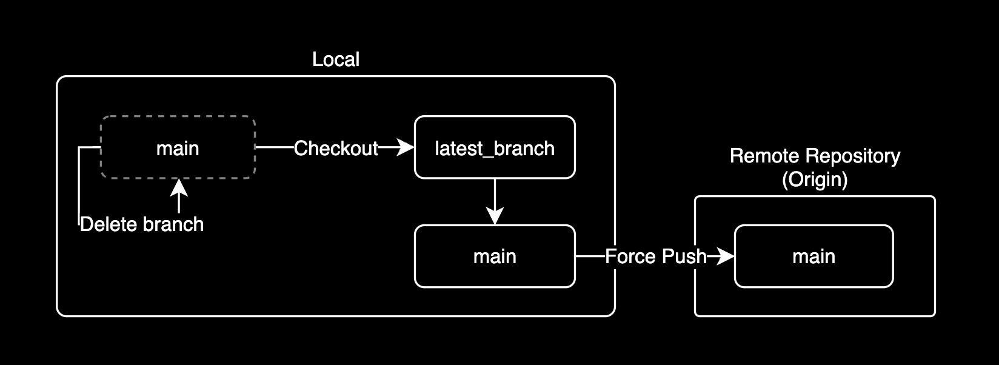

## 개요

특정 레포지터리의 전체 커밋로그를 삭제(초기화)하는 방법을 설명합니다.  

내 Public Repository에 크리티컬한 보안 이슈를 일으킬만한 이미지 파일이나 ID, PW 등의 인증 정보 등이 노출되었을 경우 이 방법을 사용해서 전체 커밋 로그 기록을 삭제하면 안전합니다.

&nbsp;

## 배경지식

### 전체 커밋 로그 삭제 원리

전체 커밋로그 삭제(초기화) 원리는 간단합니다.



1. `main` 브랜치를 복제해서 `latest_branch` 브랜치를 새로 생성합니다.
2. 구 `main` 브랜치를 삭제합니다.
3. 구 `main` 브랜치가 삭제될 때 그 안에 포함된 Commit log 전체도 같이 삭제됩니다.
4. `latest_branch`의 이름을 `main`으로 변경합니다.
5. 새 `main` 브랜치를 레포로 `push`합니다.

커밋로그 초기화에 대한 해결방법은 로컬에 다운로드 받은 레포지터리 디렉토리에서 실행해야 합니다.

&nbsp;

### 주의사항

#### 커밋 로그 삭제

- 이 가이드를 따라하면 지금까지의 main 브랜치의 전체 커밋 로그(히스토리)가 사라집니다. 삭제된 커밋 로그는 복구할 방법이 없다는 사실을 명심하도록 합니다.

&nbsp;

#### Public Activity

- GitHub에서 모든 커밋을 지우더라도 [활동 기록](https://docs.github.com/en/repositories/viewing-activity-and-data-for-your-repository/using-the-activity-view-to-see-changes-to-a-repository)(Activity)은 남아 있어 이전 변경사항을 확인할 수 있습니다. 즉 모든 커밋 기록을 삭제하더라도 Activity 기록을 통해 레포지토리의 각 커밋마다의 변경사항(diff)를 볼 수 있다는 의미입니다.
- [GitHub 지원팀에 따르면](https://webapps.stackexchange.com/a/82920), 민감한 정보가 노출되지 않는 한 공개 활동(Public Activity)은 삭제되지 않으며, 이는 레포지토리의 투명성과 변경 이력을 보존하기 위한 정책입니다. 대신 GitHub의 Secret Scanning 기능이 기본적으로 활성화되어 있어 비밀 키나 토큰이 포함된 커밋은 푸시가 거부되므로 안전하게 코드가 관리됩니다. Secret Scanning이 많은 걱정을 덜어주지만, 지속적인 주의가 필요합니다.
- 레포지터리에 남는 활동(Activity) 기록에 대해 지정된 사람만 볼 수 있게 관리할 수 있게 해달라는 문의사항은 [Repository Activity View #53140](https://github.com/orgs/community/discussions/53140#discussioncomment-6052248)에서 확인할 수 있습니다.

&nbsp;

## 준비사항

작업을 진행하는 로컬 컴퓨터에 `git` 명령어가 설치되어 있어야 합니다.

```bash
$ git --version
git version 2.37.1 (Apple Git-137.1)
```

&nbsp;

## 해결방법

git 명령어로 커밋 로그를 초기화하는 방법과 미리 준비된 스크립트로 초기화하는 방법이 있습니다.

&nbsp;

### git 명령어로 실행

#### Checkout

`latest_branch`라는 이름의 브랜치를 생성합니다.

```bash
# [>] main
git checkout --orphan latest_branch
```

`checkout`은 새로운 브랜치를 만드는 명령어입니다.

&nbsp;

#### 전체 파일 Add

전체 파일을 새로 만든 `latest_branch` 브랜치에 추가합니다.

```bash
# [ ] main
# [>] latest_branch
git add -A
```

`-A`는 전체 파일을 추가하는 옵션입니다.

&nbsp;

```bash
# [ ] main
# [>] latest_branch
git commit \
  -m "Initial commit" \
  -m "Initialize repository to clean all commit history using commit history cleaner script"
```

전체 파일을 그대로 새로 만든 `latest_branch` 브랜치에 커밋합니다.

&nbsp;

#### 브랜치 삭제

기존 `main` 브랜치를 삭제합니다.

```bash
# [X] main
# [>] latest_branch
git branch -D main
```

구 `main` 브랜치를 지우면 지금까지 기록된 전체 커밋 로그도 같이 삭제됩니다.

&nbsp;

#### 새 브랜치 이름 변경

새로 만든 `latest_branch` 브랜치를 `main`으로 변경합니다.

```bash
# [>] latest_branch --> main
git branch -m main
```

`-m`은 브랜치의 이름을 변경하는 옵션입니다.

&nbsp;

#### 강제 업데이트

```bash
# [>] main
git push -f origin main
```

마지막으로 커밋한 전체 파일을 강제로 `main` 브랜치에 올립니다.

&nbsp;

#### 결과확인

새 `main` 브랜치에서 커밋 로그를 확인합니다.

```bash
# [>] main
git log --graph

# Display commit history as a one-line summary with a graph
git log --oneline --graph
```

`git log`에서 `--graph` 옵션은 커밋 로그 전체를 트리 형태로 그려줍니다.

&nbsp;

결과값은 다음과 같이 출력됩니다.

```bash
* commit 4xxx81728xx4x8815f6970f43545b3xxx433x2x3 (HEAD -> main, origin/main, origin/HEAD)
  Author: younsl <cysl@kakao.com>
  Date:   Fri Feb 24 17:33:33 2023 +0900

      Initial commit
```

지금까지의 전체 커밋로그가 사라지고 초기화 커밋만 기록되었습니다.

이제 중요 정보가 노출된 커밋로그는 어느 누구도 확인할 수 없습니다.

&nbsp;

커밋 로그 초기화가 완료되었습니다.

&nbsp;

### 스크립트로 실행

먼저 Commit 로그를 초기화할 Git 디렉토리로 이동합니다.

Github Cloud에 공개되어 있는 [커밋 로그 초기화를 위한 스크립트](https://github.com/younsl/box/blob/main/box/script/github/commit-history-cleaner/commit-history-cleaner.sh)를 다운로드 받습니다.

```bash
wget -O commit-history-cleaner.sh \
  https://raw.githubusercontent.com/younsl/box/main/box/script/github/commit-history-cleaner/commit-history-cleaner.sh
```

&nbsp;

다운로드 받은 결과를 확인합니다.

```bash
ls -lh commit-history-cleaner.sh
```

```bash
-rw-r--r--@ 1 john.doe  staff   1.7K Feb  4 04:33 commit-history-cleaner.sh
```

&nbsp;

스크립트를 실행합니다.

```bash
sh commit-history-cleaner.sh
```

&nbsp;

정말로 실행할 지 한 번 묻는데, 이 때 `y`를 입력하면 `main` 브랜치의 모든 커밋 로그가 삭제됩니다.

> **주의사항**: 이 작업은 `main` 브랜치의 모든 커밋 로그를 삭제하는 파괴적인 작업이며, 커밋 로그 초기화 후 복구할 수 없습니다.

```bash
This script will delete the main branch and create the latest_branch branch.
Do you want to continue? (yY/n) y
```

&nbsp;

커밋 로그 초기화된 결과를 확인합니다.

```bash
# Display commit history as a one-line summary with a graph
git log --oneline --graph
```

커밋 로그 초기화가 완료되었습니다.

&nbsp;

## 결론

`rm -rf .git` 명령어로 `.git` 디렉토리를 지우는 건 권장하지 않습니다.  
서브모듈 설정 등도 `.git` 안에 모두 포함되어 있는데, 이것들 다시 설정 잡는 것도 번거롭고 전체 레포지터리 설정을 날리는게 위험합니다.  

&nbsp;

애초에 작업 목적을 잘 생각해보면 우리는 레포지터리의 커밋 로그 전체를 날리고 싶었습니다.  
main 브랜치를 그대로 다른 브랜치에 복제 떠서 백업한 후 main 브랜치 자체를 날리는게 훨씬 간단하고 안전합니다.  
브랜치가 삭제될 때 그 안에 포함된 모든 커밋 로그도 같이 삭제된다는 점을 명심하세요.

&nbsp;

## 참고자료

**Github**:

- [commit log 초기화 스크립트](https://github.com/younsl/box/blob/main/box/script/github/commit-history-cleaner/commit-history-cleaner.sh)
- [Repository Activity View #53140](https://github.com/orgs/community/discussions/53140)
