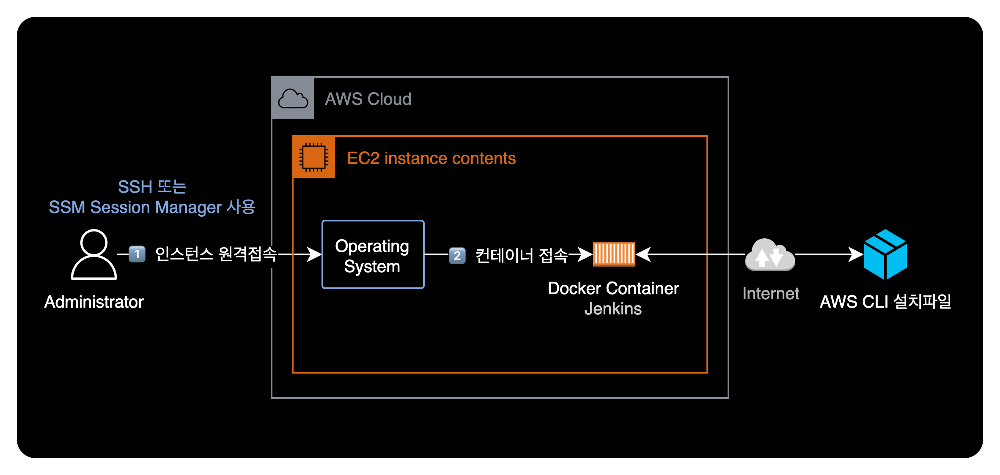
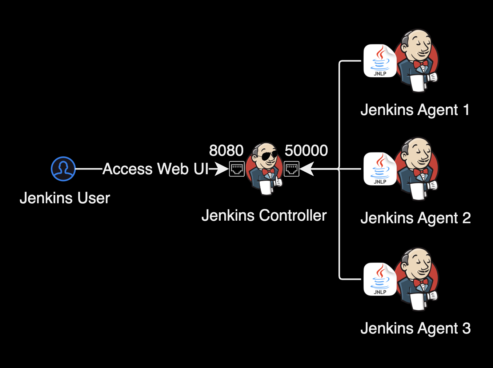

## 개요

Jenkins 도커 컨테이너에 AWS CLI를 설치하는 방법을 소개합니다.



&nbsp;

## 환경

### EC2 인스턴스

- **CPU 아키텍처** : ARM64 (aarch64)
- **Subnet** : Jenkins 컨테이너가 구동되고 있는 EC2 인스턴스는 현재 NAT Gateway를 타고 인터넷으로 아웃바운드가 가능한 Private Subnet에 위치합니다.

### Docker 이미지

- **컨테이너 이미지** : [jenkins/jenkins:2.402-jdk11](https://hub.docker.com/r/jenkins/jenkins/tags?page=1&name=2.402-jdk11)
- **컨테이너 OS** : Debian 11.6

&nbsp;

## Jenkins 구성

### 컨테이너 실행 방법

로컬 환경에서 Jenkins 컨테이너를 실행하는 명령어는 다음과 같습니다.

```bash
JENKINS_VERSION="2.402-jdk11"
docker run -d \
    -p 8080:8080 \
    -p 50000:50000 \
    --name jenkins \
    jenkins/jenkins:${JENKINS_VERSION}
```

&nbsp;

### Jenkins 사용 포트

Jenkins 컨테이너가 기본적으로 사용하는 중요 포트는 다음과 같습니다.

| Proto | Port    | Description                                          |
|-------|---------|------------------------------------------------------|
| TCP   | `8080`  | [**Web UI**](https://www.jenkins.io/doc/book/security/services/#web-ui): Jenkins Console port                     |
| TCP   | `50000` | [**TCP Agent Listener Port**](https://www.jenkins.io/doc/book/security/services/#tcp-agent-listener-port): default JNLP agent port |



Jenkins는 에이전트(Agent)라고 불리는 원격 빌드 머신을 사용하여 빌드 작업을 수행합니다. 이러한 에이전트는 Jenkins 컨트롤러와 통신해야 합니다. [Java Network Launch Protocol](https://docs.oracle.com/javase/tutorial/deployment/deploymentInDepth/jnlp.html)<sup>JNLP</sup>의 기본 포트인 TCP/50000은 이러한 에이전트와 Jenkins 컨트롤러 간의 통신을 위한 포트입니다.

&nbsp;

## AWS CLI 설치방법

EC2 로컬에 SSM Session Manager 또는 SSH로 접속한 이후 시점으로 가정하겠습니다.

&nbsp;

### Jenkins 컨테이너 상태 확인

먼저 EC2의 로컬에서 Jenkins 컨테이너가 실행중인지 확인합니다.

```bash
$ docker ps
CONTAINER ID   IMAGE                         COMMAND                  CREATED         STATUS             PORTS                                              NAMES
85f0af1f40e4   jenkins/jenkins:2.402-jdk11   "/usr/bin/tini -- /u…"   2 minutes ago   Up 2 minutes       0.0.0.0:8080->8080/tcp, 0.0.0.0:50000->50000/tcp   jenkins
```

`STATUS`를 확인해보니 `jenkins` 컨테이너가 정상적으로 실행되고 있습니다.

&nbsp;

### 컨테이너 접속

`docker exec` 명령어를 사용해서 Jenkins 컨테이너에 접속합니다.

```bash
docker exec -u 0 -it 85f0af1f40e4 /bin/bash
```

- `-u 0` : UID 0인 root로 컨테이너에 접근하는 걸 의미합니다.
- `85f0af1f40e4` : 컨테이너 ID입니다. 자신의 환경에 맞게 변경합니다.

&nbsp;

### AWS CLI 설치

`apt-get` 명령어를 사용해 AWS CLI를 다운로드 받고 설치 스크립트를 실행합니다.

> **패키지 관리자**  
> `jenkins:2.402-jdk11` 이미지 기준으로 Debian GNU/Linux 11 (bullseye) 배포판을 사용하고 있으므로 패키지 관리자로 `apt-get`을 사용하면 됩니다. Debian 배포판의 상세 버전은 `cat /etc/debian_version` 명령어로 확인할 수 있습니다.

```bash
# Next, update the packages list:
apt-get update

# Download AWS CLI zip file from AWS.
curl "https://awscli.amazonaws.com/awscli-exe-linux-$(arch).zip" \
  -o "awscliv2.zip"

# Unzip the package
unzip awscliv2.zip

# Install the AWS CLI by running the script
./aws/install

# Check if the AWS CLI has been installed properly.
aws –version
```

&nbsp;

## 참고자료

[How to Install AWS CLI and Terraform in Jenkins Docker Container](https://securitywing.com/how-to-install-aws-cli-in-jenkins-docker-container/)  
[AWS 공식문서 - 최신 버전의 AWS CLI 설치 또는 업데이트](https://docs.aws.amazon.com/ko_kr/cli/latest/userguide/getting-started-install.html#getting-started-install-instructions)  
[Jenkins Docs - Exposed Services and Ports](https://www.jenkins.io/doc/book/security/services/#exposed-services-and-ports)
