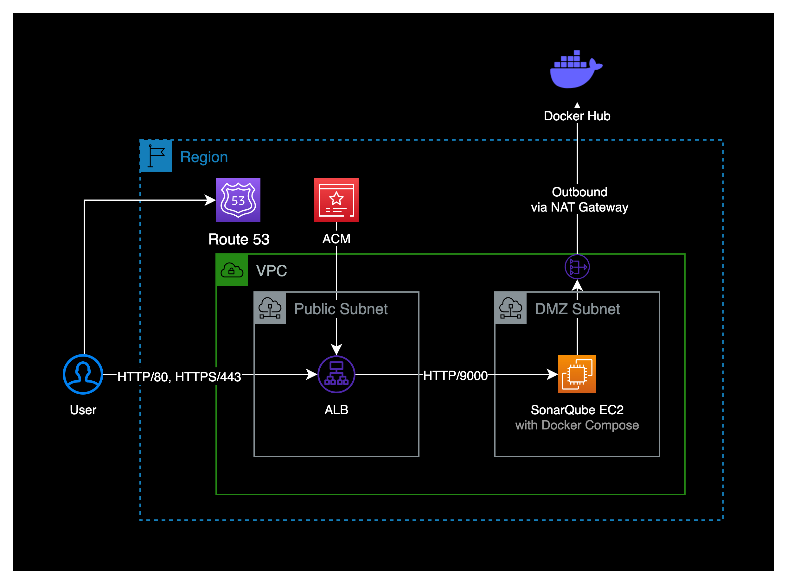
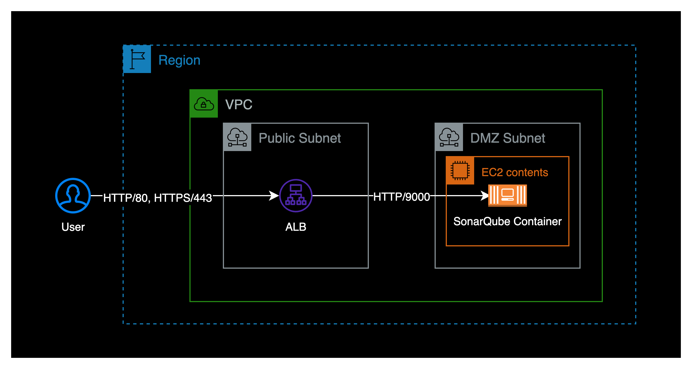
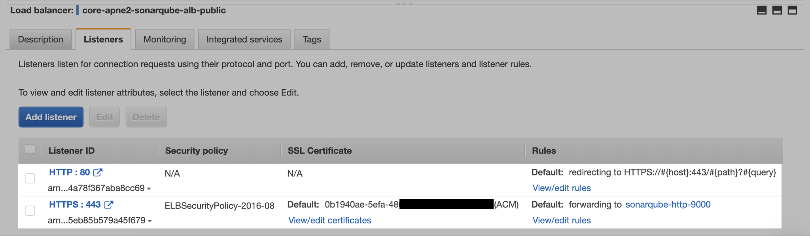
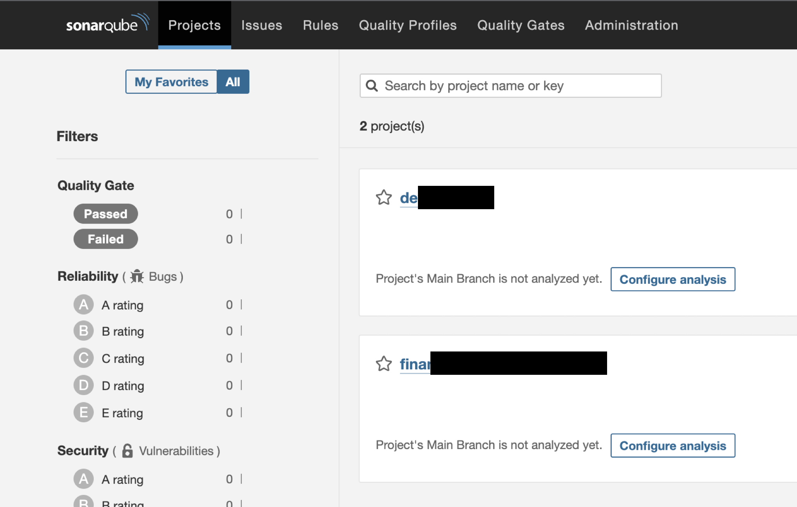

## 개요

Amazon Linux 2 인스턴스에 SonarQube 서버를 구축하는 방법을 소개합니다.

SonarQube 서버는 docker-compose 컨테이너 기반 환경으로 구축했습니다.

&nbsp;

## 환경

처음에 구축하는 시점에는 제가 ECS라는 서비스에 아직 익숙하지 않았던 시점이라 EC2 기반으로 구축했습니다.



만약 ECS Fargate 워크로드에 구축하고 싶다면 제가 작성한 [이 포스트](/blog/install-sonarqube-on-ecs-fargate/)를 참조하세요.

&nbsp;

- **인스턴스** : EC2 (t3.medium)
  - SonarQube에서 요구하는 최소 메모리 스펙은 소나큐브에서 사용할 메모리 2GB + OS의 여유 메모리 1GB입니다.
- **EBS** : gp3 / 30GB
- **OS** : Amazon Linux 2 (x86_64)
  - **AMI ID** : ami-0c76973fbe0ee100c
- **Docker** : 20.10.17
- **Docker Compose** : v2.12.0
- **로드밸런서** : Application Load Balancer (Internet facing)
  - 도메인 기반의 ACM 인증서를 발급받은 후 sonarqube 웹 도메인 기반으로 SSL 인증서 연결한 상태입니다.

&nbsp;

## 설치하기

### 인스턴스 환경 확인

SonarQube를 설치할 EC2 인스턴스를 생성합니다.  
현재 인스턴스의 운영체제는 Amazon Linux 2 (x86_64)입니다.

CPU 아키텍처 정보를 확인합니다.

```bash
$ arch
x86_64
```

`x86_64` 기반 AMI입니다.

&nbsp;

OS 정보를 확인합니다.

```bash
$ grep -E -w 'VERSION|NAME|PRETTY_NAME' /etc/os-release
NAME="Amazon Linux"
VERSION="2"
PRETTY_NAME="Amazon Linux 2"
```

현재 인스턴스에 설치된 OS는 `Amazon Linux 2`입니다.

&nbsp;

소나큐브는 공식문서 상에서 효율적으로 실행하기 위해 최소 2GB의 RAM과 OS를 위한 1GB의 여유 RAM을 필요로 합니다.  
[SonarQube 공식문서](https://docs.sonarqube.org/latest/requirements/requirements/)

&nbsp;

### docker 설치

EC2 인스턴스에 도커를 설치합니다.

```bash
$ sudo amazon-linux-extras install docker
$ sudo service docker start

# EC2 유저를 docker 그룹에 추가해서 docker를 사용할 수 있도록 구성
$ sudo usermod -a -G docker ec2-user

# 재부팅 시 docker 자동시작 설정
$ sudo chkconfig docker on

# git 설치 (optional)
$ sudo yum install -y git

# docker 자동시작 검증을 위해 reboot
$ reboot
```

위 명령어는 [이 글](https://gist.github.com/npearce/6f3c7826c7499587f00957fee62f8ee9)을 참조했습니다.

&nbsp;

### docker-compose 설치

EC2 인스턴스에 도커 컴포즈를 설치합니다.  
EC2 인스턴스가 패키지 설치를 위해서 NAT Gateway, Internet Gateway 등을 통해 퍼블릭 인터넷에 접속할 수 있는 상태여야 합니다.

도커 컴포즈 설치는 특정 버전으로 설치하거나 최신 버전으로 설치하는 방법 2가지가 있습니다.

```bash
# docker-compose 특정버전 설치
$ sudo curl \
    -L https://github.com/docker/compose/releases/download/2.12.0/docker-compose-$(uname -s)-$(uname -m) \
    -o /usr/local/bin/docker-compose
```

&nbsp;

```bash
# docker-compose 최신버전(latest) 설치
$ sudo curl \
    -L https://github.com/docker/compose/releases/latest/download/docker-compose-$(uname -s)-$(uname -m) \
    -o /usr/local/bin/docker-compose
```

제 경우 최신 버전의 docker-compose를 설치했습니다.

&nbsp;

도커 컴포즈 설치 완료 후에는 도커와 도커 컴포즈 버전을 확인합니다.

```bash
$ docker-compose version
Docker Compose version v2.12.0
```

2022년 10월 21일 기준 도커 컴포즈 최신 버전인 `v2.12.0`을 설치가 된 걸 확인할 수 있습니다.

```bash
$ docker version
...
Server:
 Engine:
  Version:          20.10.17
```

&nbsp;

### SonarQube 설치

현재 커널 파라미터의 설정 정보를 확인합니다.

```bash
sysctl vm.max_map_count
sysctl fs.file-max
ulimit -n
ulimit -u
```

&nbsp;

소나큐브를 리눅스 서버에 설치하는 경우, 커널 파라미터가 아래와 같아야 합니다.  
[SonarQube 공식문서](https://docs.sonarqube.org/latest/requirements/requirements/)

| 파라미터           | 필요 조건    | 관련 설정파일                 |
|------------------|------------|---------------------------|
| vm.max_map_count | 524288 이상 | /etc/sysctl.conf          |
| fs.file-max      | 131072 이상 | /etc/sysctl.conf          |
| ulimit -n        | 131072 이상 | /etc/security/limits.conf |
| ulimit -u        | 8192 이상   | /etc/security/limits.conf |

`ulimit -n <number>`은 open files의 개수를 설정하는 명령어입니다.  
`ulimit -u <number>`는 max user processes의 개수를 설정하는 명령어입니다.

&nbsp;

커널 파라미터를 설정합니다.

```bash
sysctl -w vm.max_map_count=524288
sysctl -w fs.file-max=131072
ulimit -n 131072
ulimit -u 8192
```

위 방법의 경우 서버 리부팅 시 초기화되기 때문에, 리부팅 후에도 커널 파라미터를 지속 적용하고 싶다면 공식문서를 바탕으로 설정파일에 직접 입력해야 합니다.

`vm.max_map_count` 파라미터 값이 너무 낮을 경우 sonarqube 컨테이너가 시작될 때 오류 발생하면서 down 되버릴 수도 있습니다.

&nbsp;

도커 컴포즈 파일을 생성합니다.

아래는 sonarqube에서 공식적으로 제공하는 [docker compose](https://github.com/SonarSource/docker-sonarqube/blob/master/example-compose-files/sq-with-postgres/docker-compose.yml) 파일입니다.

```yaml
cat << EOF > ./sonarqube-dc.yaml
version: "3"
services:
  sonarqube:
    image: sonarqube:community
    hostname: sonarqube
    container_name: sonarqube
    depends_on:
      - db
    environment:
      SONAR_JDBC_URL: jdbc:postgresql://db:5432/sonar
      SONAR_JDBC_USERNAME: sonar
      SONAR_JDBC_PASSWORD: sonar
    volumes:
      - sonarqube_data:/opt/sonarqube/data
      - sonarqube_extensions:/opt/sonarqube/extensions
      - sonarqube_logs:/opt/sonarqube/logs
    ports:
      - "9000:9000"

  db:
    image: postgres:12
    hostname: postgresql
    container_name: postgresql
    environment:
      POSTGRES_USER: sonar
      POSTGRES_PASSWORD: sonar
      POSTGRES_DB: sonar
    volumes:
      - postgresql:/var/lib/postgresql
      - postgresql_data:/var/lib/postgresql/data

volumes:
  sonarqube_data:
  sonarqube_extensions:
  sonarqube_logs:
  postgresql:
  postgresql_data:
EOF
```

&nbsp;

작성한 도커 컴포즈 파일이 위치한 경로로 이동한 후 아래 명령어를 실행합니다.

```bash
$ docker-compose -f sonarqube-dc.yaml up -d
```

&nbsp;

정상적으로 구동이 완료된 경우 로그 마지막에 `SonarQube is operational`이 출력됩니다.

```bash
$ docker logs -f sonarqube
...
2022.10.20 04:56:51 INFO  ce[][c.z.h.HikariDataSource] HikariPool-1 - Start completed.
2022.10.20 04:56:53 INFO  ce[][o.s.s.p.ServerFileSystemImpl] SonarQube home: /opt/sonarqube
2022.10.20 04:56:53 INFO  ce[][o.s.c.c.CePluginRepository] Load plugins
2022.10.20 04:56:55 INFO  ce[][o.s.c.c.ComputeEngineContainerImpl] Running Community edition
2022.10.20 04:56:55 INFO  ce[][o.s.ce.app.CeServer] Compute Engine is started
2022.10.20 04:56:55 INFO  app[][o.s.a.SchedulerImpl] Process[ce] is up
2022.10.20 04:56:55 INFO  app[][o.s.a.SchedulerImpl] SonarQube is operational
```

&nbsp;

컨테이너 상태를 확인합니다.  
아래는 정상적으로 구동된 SonarQube 컨테이너 정보입니다.

```bash
$ docker ps
CONTAINER ID   IMAGE                 COMMAND                  CREATED      STATUS      PORTS                                       NAMES
54c6909e5791   sonarqube:community   "/opt/sonarqube/bin/…"   3 days ago   Up 3 days   0.0.0.0:9000->9000/tcp, :::9000->9000/tcp   sonarqube
61b96d5cf064   postgres:12           "docker-entrypoint.s…"   3 days ago   Up 3 days   5432/tcp                                    postgresql
```

&nbsp;

EC2 인스턴스에 접속한 상태에서 localhost로 SonarQube 메인 페이지를 호출해봅니다.  
소나큐브는 기본 포트로 9000번을 사용합니다.

```bash
$ curl http://localhost:9000
```

&nbsp;

메인 페이지를 정상적으로 호출한 결과는 다음과 같이 나옵니다.

```bash
<!DOCTYPE html>
<html lang="en">

<head>
    <meta http-equiv="content-type" content="text/html; charset=UTF-8" charset="UTF-8" />
    <meta http-equiv="X-UA-Compatible" content="IE=edge">
    <link rel="apple-touch-icon" href="/apple-touch-icon.png">
    <link rel="apple-touch-icon" sizes="57x57" href="/apple-touch-icon-57x57.png">
    <link rel="apple-touch-icon" sizes="60x60" href="/apple-touch-icon-60x60.png">
    <link rel="apple-touch-icon" sizes="72x72" href="/apple-touch-icon-72x72.png">
    <link rel="apple-touch-icon" sizes="76x76" href="/apple-touch-icon-76x76.png">
    <link rel="apple-touch-icon" sizes="114x114" href="/apple-touch-icon-114x114.png">
    <link rel="apple-touch-icon" sizes="120x120" href="/apple-touch-icon-120x120.png">
    <link rel="apple-touch-icon" sizes="144x144" href="/apple-touch-icon-144x144.png">
    <link rel="apple-touch-icon" sizes="152x152" href="/apple-touch-icon-152x152.png">
    <link rel="apple-touch-icon" sizes="180x180" href="/apple-touch-icon-180x180.png">
    <link rel="icon" type="image/x-icon" href="/favicon.ico">
    <meta name="application-name" content="SonarQube" />
    <meta name="msapplication-TileColor" content="#FFFFFF" />
    <meta name="msapplication-TileImage" content="/mstile-512x512.png" />
    <title>SonarQube</title>

    <link rel="stylesheet" href="/js/out5N4MCG76.css" />
</head>

<body>
    <div id="content">
        <div class="global-loading">
            <i class="spinner global-loading-spinner"></i>
            <span aria-live="polite" class="global-loading-text">Loading...</span>
        </div>
    </div>

    <script>
        window.baseUrl = '';
        window.serverStatus = 'UP';
        window.instance = 'SonarQube';
        window.official = true;
    </script>

    <script type="module" src="/js/outO22A765U.js"></script>
</body>

</html>
```

EC2 인스턴스 구축 단계는 완료입니다.  

이제 ELB 구성으로 넘어갑니다.

&nbsp;

### 타겟 그룹 생성

ALB로 들어오는 트래픽을 받기 위해 새로운 타겟 그룹을 생성합니다.  
실제 인바운드 트래픽이 소나큐브 컨테이너까지 도달되어야 하기 때문에 EC2의 포트는 HTTP 9000으로 등록해야 합니다.



Target group 생성 시 상세한 설정정보는 다음과 같습니다.

- **Basic configurations**
  - **Choose a target type** : Instances
  - **Protocol** : HTTP
  - **Port** : 9000
  - **Protocol version** : HTTP1

- **Health checks**
  - **Health check protocol** : HTTP
  - **Health check path** : /

- **Advanced health check settings**  
  타겟 그룹을 더 빠르게 Healthy 상태를 만들기 위해 Advanced health check의 Interval 값들을 아래와 같이 최대한 짧게 설정합니다.
  - **Port** : Traffic port
  - **Healthy threshold** : 2
  - **Unhealthy threshold** : 2
  - **Timeout** : 3
  - **Interval** : 5
  - **Success codes** : 200

&nbsp;

### ELB 생성

ELB 타입은 Application Load Balancer로 생성합니다.

- **Scheme** : Internet-facing
- **IP address type** : IPv4

&nbsp;

#### 리스너 생성

외부의 사용자가 HTTP 80 포트로 들어와도 HTTPS 443 포트로 리다이렉트 되도록 ALB 리스너에서 설정해주는 게 핵심입니다.



제 경우 AWS의 인증서 서비스인 ACM<sup>AWS Certificate Manager</sup>을 통해 도메인 기반 인증서를 발급 받아, HTTPS 리스너에 인증서를 연결해서 구성했습니다.

&nbsp;

### 로그인 테스트

ALB 설정이 완료되었으면 퍼블릭 ALB의 Endpoint 주소 또는 메핑한 소나큐브 전용 도메인으로 접속합니다.

SonarQube의 Admin 디폴트 접속정보는 다음과 같습니다.

- **ID** : admin
- **PW** : admin

SonarQube에 admin 계정으로 로그인한 화면입니다.



이것으로 Community EditionVersion 9.7 (build 61563)으로 구축을 완료했습니다.

&nbsp;

## 참고자료

[SonarQube | 하드웨어 스펙 요구사항](https://docs.sonarqube.org/latest/requirements/requirements/)  
[Gist | Amazon Linux 2 기준 docker + docker compose 설치 가이드](https://gist.github.com/npearce/6f3c7826c7499587f00957fee62f8ee9)  
[SonarQube | 커널 파라미터 요구사항](https://docs.sonarqube.org/latest/requirements/requirements/)  
[SonarQube | Official 도커 컴포즈 파일](https://github.com/SonarSource/docker-sonarqube/blob/master/example-compose-files/sq-with-postgres/docker-compose.yml)

[ECS Fargate 소나큐브 구축](/blog/install-sonarqube-on-ecs-fargate/)  
제가 직접 구축한 경험을 바탕으로 작성한 ECS Fargate 기반의 SonarQube 9.7.1 구축 가이드입니다.
