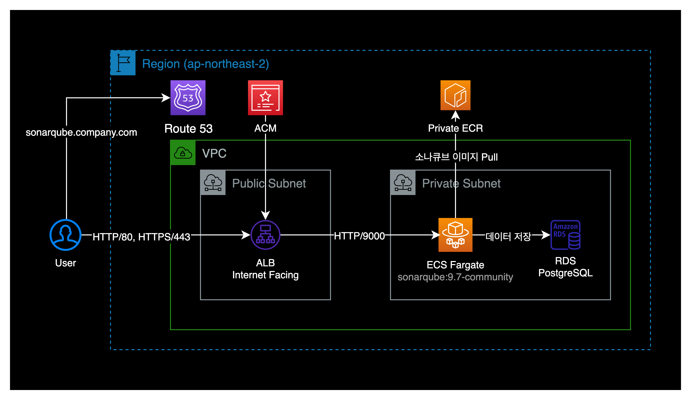
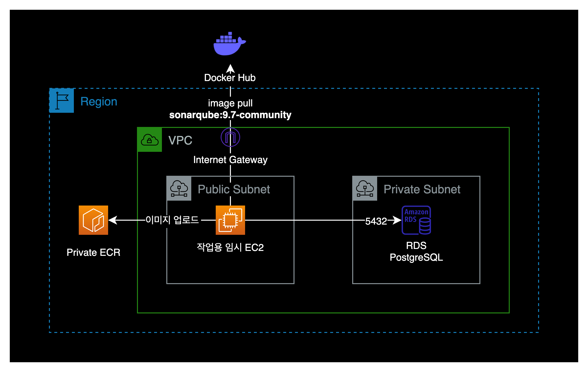
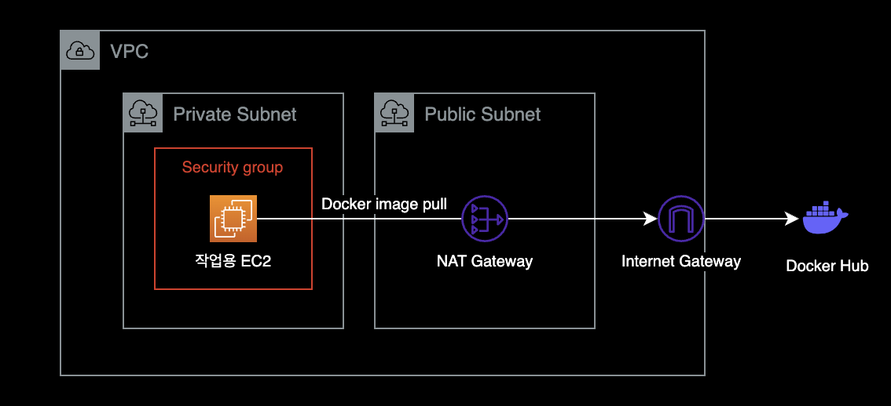
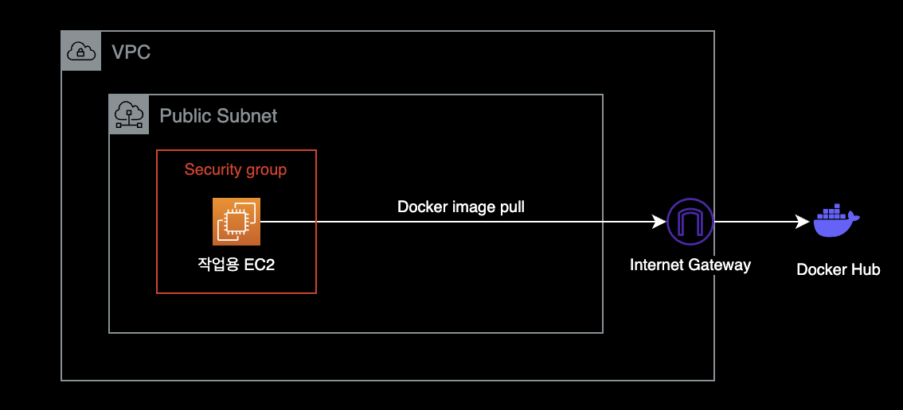
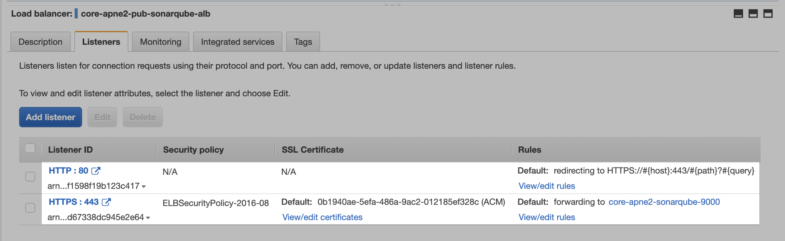
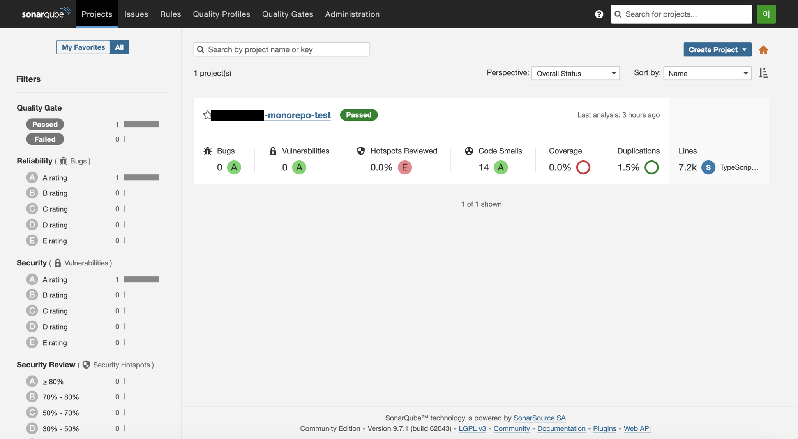

---
# === front matter of hugo ===
title: "SonarQube ECS Fargate 설치"
date: 2022-11-02T01:02:15+09:00
lastmod: 2022-11-02T01:02:25+09:00
slug: ""
description: "ECS Fargate 워크로드에 소나큐브 9.7.1을 구축하는 가이드"
keywords: []
tags: ["aws", "ecs", "sonarqube"]
---

## 개요

ECS Fargate 워크로드 환경에 SonarQube 9.7.1을 구축합니다.

&nbsp;

## 환경

구성할 AWS 인프라 환경은 다음과 같습니다.



ECS Fargate를 사용하면 EC2 관리에 발생하는 운영 오버헤드를 줄일 수 있으며, 소나큐브 전용 EC2 인스턴스를 항상 켜놓는 것보다 AWS 비용도 절감되는 장점이 있습니다.

&nbsp;

## 구축하기

### 작업용 EC2 생성

먼저 작업용 EC2 1대를 생성하도록 합니다.  
해당 EC2는 다음 부수적인 작업들을 수행할 때 활용할 예정입니다.



- 퍼블릭한 도커 허브에서 SonarQube 컨테이너 이미지 다운로드
- ECR에 소나큐브 이미지를 업로드
- RDS에 접속
- SonarQube 설치 전 DB 세팅
  - sonarqube 사용자 생성
  - sonarqube 데이터베이스 생성

&nbsp;

AWS 콘솔에서 EC2 인스턴스를 1대 생성합니다.  
Management 용도로 잠시 사용할 EC2이기 때문에 인스턴스 타입과 볼륨 등은 최저로 할당합니다.

- **OS** : Amazon Linux 2 (x86_64)
- **Instance Type** : t3.micro
- **EBS 볼륨**
  - **용량** : 가장 최소인 8GB로 할당
  - **타입** : gp3
    - gp2보다 gp3가 20% 더 저렴합니다. [AWS Korea 블로그](https://aws.amazon.com/ko/blogs/korea/new-amazon-ebs-gp3-volume-lets-you-provision-performance-separate-from-capacity-and-offers-20-lower-price/)
- **Subnet** : 인스턴스를 Internet Gateway 또는 NAT Gateway가 연결되어 있는 Public 서브넷에 생성해줍니다.
  - 해당 EC2가 인터넷이 연결되는 환경이어야 아웃바운드로 Docker Hub에 연결한 후 소나큐브 컨테이너 이미지를 받아올 수 있습니다.

&nbsp;

생성한 EC2의 OS, CPU 아키텍처 정보를 확인합니다.

```bash
$ cat /etc/*-release
NAME="Amazon Linux"
VERSION="2"
ID="amzn"
ID_LIKE="centos rhel fedora"
VERSION_ID="2"
PRETTY_NAME="Amazon Linux 2"
ANSI_COLOR="0;33"
CPE_NAME="cpe:2.3:o:amazon:amazon_linux:2"
HOME_URL="https://amazonlinux.com/"
Amazon Linux release 2 (Karoo)
```

&nbsp;

`x86_64`는 아키텍처 정보로 Intel CPU 기반을 의미합니다.

```bash
$ arch
x86_64
```

&nbsp;

작업용 EC2 인스턴스에 도커를 설치합니다.  
Docker Hub에서 소나큐브 컨테이너 이미지를 다운로드(Pull)하고, Private ECR에 컨테이너 이미지를 업로드할 때 도커가 필요합니다.

```bash
$ sudo amazon-linux-extras install docker
$ sudo service docker start
$ sudo usermod -a -G docker ec2-user
$ sudo chkconfig docker on
```

위 명령어 절차는 [install-docker.md Gist](https://gist.github.com/npearce/6f3c7826c7499587f00957fee62f8ee9)를 그대로 참고했습니다.

&nbsp;

인스턴스에서 소나큐브 컨테이너 이미지를 다운로드 받습니다.  
ECS Fargate에 사용할 컨테이너 이미지는 [sonarqube:9.7-community](https://hub.docker.com/layers/library/sonarqube/9.7-community/images/sha256-d8247aa44526ccf185bf07fd0331a663f16d96f9d12f3e483982c2808083d2f0?context=explore) 입니다.

```bash
$ docker pull sonarqube:9.7-community
```

**인터넷 연결 필요**  
EC2 인스턴스가 도커 허브에서 소나큐브 이미지를 받으려면 인터넷 연결이 가능한 퍼블릭한 환경이어야 합니다.





도커 허브에서 소나큐브 이미지를 받아오지 못할 경우, 다음 체크리스트를 확인합니다.

- EC2 인스턴스가 Internet Gateway 또는 NAT Gateway가 연결된 서브넷에 배치되어 있는지 확인합니다.
- EC2에 연결된 보안그룹의 Outbound 룰에서 HTTP(80), HTTPS(443)이 허용되어 있는지 확인합니다.
- EC2 인스턴스에 도커 패키지가 정상적으로 설치되어 있는지 확인합니다.

&nbsp;

### ECR 생성

AWS CLI로 ECR 레포지터리를 생성합니다. 이 과정은 AWS 콘솔을 통해 ECR 저장소를 생성하셔도 상관 없습니다.  
ECR 저장소의 태그 값 `--tags`는 예시입니다. ECR 저장소의 태그는 자신의 환경에 맞게 변경해주세요.

제 경우 `AdministratorFullAccess` IAM 권한을 가진 IAM Role에서 아래 명령어를 수행했습니다.

```bash
$ aws ecr create-repository \
    --repository-name core-apne2-sonarqube \
    --region ap-northeast-2 \
    --tags '[{"Key":"Environment","Value":"core"},{"Key":"Creator","Value":"seyslee"}]'
```


&nbsp;

작업용 EC2에서 ECR로 소나큐브 컨테이너 이미지를 업로드할 수 있도록 ECR에 허용 정책을 추가합니다.

AWS 콘솔에서 ECR → Repositories → Permissions → Edit policy json 클릭 → 아래 내용 복사 붙여넣기 → Save 버튼 클릭

```json
{
    "Version": "2012-10-17",
    "Statement": [
        {
            "Sid": "AllowPushPullImage",
            "Effect": "Allow",
            "Principal": {
                "AWS": [
                    "*"
                ]
            },
            "Action": [
                "ecr:BatchGetImage",
                "ecr:BatchCheckLayerAvailability",
                "ecr:CompleteLayerUpload",
                "ecr:GetDownloadUrlForLayer",
                "ecr:InitiateLayerUpload",
                "ecr:PutImage",
                "ecr:UploadLayerPart"
            ]
        }
    ]
}
```

&nbsp;

인스턴스의 로컬에 다운로드 받은 `sonarqube:9.7-community` 이미지를 ECR에 업로드하기 위해 이미지 태그를 변경합니다.

```bash
$ docker tag sonarqube:9.7-community <aws-account-id>.dkr.ecr.ap-northeast-2.amazonaws.com/<ecr-repository-name>:9.7-community
```

&nbsp;

EC2 인스턴스에서 Amazon ECR에 로그인합니다.

```bash
aws ecr get-login-password --region <region> | docker login --username AWS --password-stdin <aws-account-id>.dkr.ecr.<region>.amazonaws.com
```

`<aws-account-id>`는 ECR이 위치한 AWS Account ID로 변경하고, `<region>`은 ECR이 위치한 Region으로 변경합니다.

```bash
# 명령어 예시
aws ecr get-login-password --region ap-northeast-2 | docker login --username AWS --password-stdin 123456789012.dkr.ecr.ap-northeast-2.amazonaws.com
```

&nbsp;

### RDS 세팅

AWS 콘솔에서 PostgreSQL RDS를 생성합니다.

#### Engine Options

- **Engine options**
  - Engine type : PostgreSQL
  - Engine version : PostgreSQL 13.7-R1
    - **주의** : SonarQube 9.7 기준으로 PostgreSQL 14.x 버전을 공식적으로 지원하지 않습니다. [SonarQube 공식문서](https://docs.sonarqube.org/latest/requirements/requirements/)
- **Templates**
  - Production
- **Availability and durability**
  - Deployment options : Single DB instance
- **Instance configuration**
  - DB instance class : t4g.micro
    - Graviton CPU 기반 인스턴스 타입인 `t4g.micro`를 사용해도 소나큐브 운영에는 지장이 없으므로, 비용 절감을 위해 `t4g.micro`로 사용하도록 합니다.
- **Storage**
  - Storage type : General Purpose SSD (gp2)
  - Allocate storage : 20 GiB
    - 처음에 할당하는 스토리지 용량은 최소로 잡아줍니다. 운영하면서 자연스럽게 용량을 스케일링해 늘려가는 방식으로 운영해야 비용이 적게 나옵니다.
  - Enable storage autoscaling 체크
  - Maximum storage threshold : 200 GiB
- **Connectivity**
  - Network Type : IPv4
  - Public Access : No
  - VPC security group (firewall)
    - Choose existing
    - 보안그룹에서 PostgreSQL의 기본 포트인 5432 인바운드를 허용해주어야 합니다.
- **Monitoring**
  - Turn on Performance Insights 체크 해제

RDS 생성이 완료되면 AWS 콘솔에서 RDS Endpoint를 확인할 수 있습니다.  
RDS Endpoint를 클립보드에 복사합니다.

&nbsp;

작업용 EC2에 접속합니다. 이 작업용 EC2에서 PostgreSQL DB에 접속할 예정입니다.

PostgreSQL RDS에 접속하려면 `psql` 명령어가 필요합니다. Amazon Linux 2에는 `psql` 명령어가 기본적으로 포함되어 있지 않아서 별도 설치가 필요합니다.

`postgresql` 패키지를 설치해줍니다.

```bash
$ sudo -i
$ id
uid=0(root) gid=0(root) groups=0(root)
$ yum install postgresql -y
```

&nbsp;

`postgresql` 패키지의 설치 결과를 확인합니다.

```bash
$ which psql
/bin/psql
$ psql --version
psql (PostgreSQL) 9.2.24
```

위와 같이 결과가 나오면 정상적으로 설치된 것입니다.

&nbsp;

EC2 인스턴스에서 PostgreSQL RDS에 접속합니다.

```bash
$ psql \
    -U postgres \
    -h <YOUR_RDS_ENDPOINT>
```

&nbsp;

`postgres` 유저의 패스워드를 입력해서 로그인합니다.

```bash
Password for user postgres: <초기 RDS 생성시에 입력한 패스워드 입력>
psql (9.2.24, server 13.7)
WARNING: psql version 9.2, server version 13.0.
         Some psql features might not work.
SSL connection (cipher: ECDHE-RSA-AES256-GCM-SHA384, bits: 256)
Type "help" for help.

postgres=>
```

&nbsp;

### PostGres DB 세팅

소나큐브에 연동하기 위해 RDS에 소나큐브용 계정과 소나큐브용 데이터베이스 생성이 필요합니다.

```sql
#==== sonarqube 유저 생성 ====
postgres=> create user sonarqube with password 'sonarqube';
CREATE ROLE
postgres=> alter role sonarqube with createdb;
ALTER ROLE

#==== sonarqube 데이터베이스 생성 ====
postgres=> create database sonarqube;
CREATE DATABASE
postgres=> alter database sonarqube owner to sonarqube;
ALTER DATABASE
postgres=> grant all privileges on database sonarqube to sonarqube;
GRANT
```

&nbsp;

데이터베이스 목록을 확인합니다.

```sql
sonarqube=> \l
                                   List of databases
   Name    |   Owner   | Encoding |   Collate   |    Ctype    |    Access privileges
-----------+-----------+----------+-------------+-------------+-------------------------
 postgres  | postgres  | UTF8     | en_US.UTF-8 | en_US.UTF-8 |
 rdsadmin  | rdsadmin  | UTF8     | en_US.UTF-8 | en_US.UTF-8 | rdsadmin=CTc/rdsadmin  +
           |           |          |             |             | rdstopmgr=Tc/rdsadmin
 sonarqube | sonarqube | UTF8     | en_US.UTF-8 | en_US.UTF-8 | =Tc/sonarqube          +
           |           |          |             |             | sonarqube=CTc/sonarqube
 template0 | rdsadmin  | UTF8     | en_US.UTF-8 | en_US.UTF-8 | =c/rdsadmin            +
           |           |          |             |             | rdsadmin=CTc/rdsadmin
 template1 | postgres  | UTF8     | en_US.UTF-8 | en_US.UTF-8 | =c/postgres            +
           |           |          |             |             | postgres=CTc/postgres
```

`postgres` Name을 가진 데이터베이스가 추가되었고, Owner가 `postgres` 계정이면 정상입니다.

&nbsp;

PostgreSQL DB 내부의 전체 Role 목록을 확인합니다.  
`sonarqube` Role에 Create DB 권한이 부여되어 있으면 정상입니다.

```sql
sonarqube=> \du
                                                               List of roles
         Role name         |                   Attributes                   |                          Member of
---------------------------+------------------------------------------------+--------------------------------------------------------------
 pg_execute_server_program | Cannot login                                   | {}
 pg_monitor                | Cannot login                                   | {pg_read_all_settings,pg_read_all_stats,pg_stat_scan_tables}
 pg_read_all_settings      | Cannot login                                   | {}
 pg_read_all_stats         | Cannot login                                   | {}
 pg_read_server_files      | Cannot login                                   | {}
 pg_signal_backend         | Cannot login                                   | {}
 pg_stat_scan_tables       | Cannot login                                   | {}
 pg_write_server_files     | Cannot login                                   | {}
 postgres                  | Create role, Create DB                        +| {rds_superuser}
                           | Password valid until infinity                  |
 rds_ad                    | Cannot login                                   | {}
 rds_iam                   | Cannot login                                   | {}
 rds_password              | Cannot login                                   | {}
 rds_replication           | Cannot login                                   | {}
 rds_superuser             | Cannot login                                   | {pg_monitor,pg_signal_backend,rds_replication,rds_password}
 rdsadmin                  | Superuser, Create role, Create DB, Replication+| {}
                           | Password valid until infinity                  |
 rdsrepladmin              | No inheritance, Cannot login, Replication      | {}
 rdstopmgr                 | Password valid until infinity                  | {pg_monitor}
 sonarqube                 | Create DB                                      | {}
```

&nbsp;

### Target Group

- **Protocol HTTP** : Port 9000
- **IP address type** : IPv4
- **VPC** : ECS Fargate 컨테이너가 구동되는 동일한 VPC로 설정
- **Protocol Version** : HTTP1
- Health checks
  - Health check protocol : HTTP
  - Health check path : /

ECS Fargate의 경우 Target Group에 등록된 타겟 IP를 자동적으로 관리해줍니다.  
ECS 컨테이너가 새로 뜨는 경우 컨테이너의 IP가 변경되는데, 이 때 자동적으로 타겟그룹에 등록된 IP도 자동적으로 변경해줍니다.

&nbsp;

### ALB

- Load balancer types : Application Load Balancer
- Scheme : Internet-facing
- IP address type : IPv4
- 리스너 설정
  - HTTP 80은 HTTPS 443으로 Redirect
  - HTTPS 443은 9000번 소나큐브 타겟그룹으로 Forward
- Secure listener settings
  - Security policy : 기본값 (ELBSecurityPolicy-2016-08)
  - Default SSL/TLS certificate
    - From ACM
    - Select a certificate 에서 미리 생성한 ACM 인증서 선택

세팅 완료한 ALB의 리스너 설정은 다음과 같습니다.



&nbsp;

### Task Definition 생성

Select launch type compatibility에서 Fargate를 선택합니다.

- **Task definition name** : sonarqube
- **Task role** : None
  - 소나큐브 컨테이너의 환경변수에 PostgreSQL DB의 ID, PW가 직접 들어가 있기 때문에 Task role은 별도로 필요하지 않습니다.
- **Operating system family** : Linux
- **Task execution rol**e : ecsTaskExecutionRole
- **Task size**
  - Task memory (GB) : 2GB
  - Task CPU (vCPU) : 0.5 vCPU

Add container에서 다음과 같이 설정합니다.

#### Standard

- **Container name** : sonarqube
- **Image** : <YOUR_AWS_ACCOUNT_ID>.dkr.ecr.ap-northeast-2.amazonaws.com/<YOUR_ECR_NAME>:9.7-community
- **Memory Limits (MiB)** : Soft limit, 1024
  - 컨테이너가 전체 2GB 테스크 메모리 중 1GB를 점유하고 구동되도록 설정 합니다.
- **Port mappings** : 9000 tcp

&nbsp;

#### Advanced container configuration

컨테이너 환경변수, 실행할 명령어, Resource Limits 등의 더 자세한 설정을 하는 단계입니다.

- **ENVIRONMENT**
  - **command**

    ```bash
    -Dsonar.search.javaAdditionalOpts=-Dnode.store.allow_mmap=false
    ```

  - **Environment variables** : 컨테이너에 주입되는 3개의 환경변수의 경우, 필요하다면 SSM Parameter Store를 사용하는 선택지도 존재합니다.
    - **SONAR_JDBC_URL** = jdbc:postgresql://core-apne2-sonarqube-postgresql.xyzxxyzxxyzx.ap-northeast-2.rds.amazonaws.com:5432/sonarqube
      - PostgreSQL DB용 JDBC URL 포맷은 `jdbc:postgresql://<RDS_ENDPOINT>:5432/<DATABASE_NAME>` 입니다. 위 값은 예시이며, 자신의 환경에 맞게 `<RDS_ENDPOINT>`와 `<DATABASE_NAME>`을 바꿔주세요.
      - **참고자료** : [PostgreSQL의 JDBC 설정 공식문서](https://jdbc.postgresql.org/documentation/use/#connecting-to-the-database)
    - **SONAR_JDBC_USERNAME** = sonarqube
    - **SONAR_JDBC_PASSWORD** = sonarqube
      - `SONAR_JDBC_USERNAME`과 `SONAR_JDBC_PASSWORD`는 RDS 세팅 과정에서 설정한 ID/PW와 동일하게 맞춰주어야 합니다.

- **RESOURCE LIMITS**

  | Limit name | Soft limit | Hard limit |
  |------------|------------|------------|
  | NOFILE     | 131072     | 131072     |
  | NPROC      | 8192       | 8192       |

  리눅스 서버에서 소나큐브를 구동하는 경우에는 반드시 nofile 값이 최소 131072, nproc 값이 최소 8192로 설정되어 있어야만 합니다. [소나큐브 공식문서](https://docs.sonarqube.org/latest/requirements/requirements/)

  위와 같이 `NOFILE`, `NPROC` 값을 설정하지 않으면 소나큐브 컨테이너가 생성 → 중지 → 다시 생성을 무한 반복하게 됩니다.

  ```bash
  # 문제 발생시에 ECS Task에 출력되는 로그
  bootstrap check failure [1] of [1]: max file descriptors [4096] for elasticsearch process is too low, increase to at least [65535]
  ```

  이 경우 Add container → Advanced container configuration → RESOURCE LIMITS에서 NOFILE 값을 131072로 설정해주면 해결할 수 있습니다.

&nbsp;

### 결과 확인

웹 브라우저를 열고 ALB에 할당된 도메인 주소 또는 ALB 주소를 매핑한 Route 53의 도메인 주소로 접속합니다. (e.g. <https://sonarqube.company.com>)



ECS Fargate 기반의 SonarQube 9.7.1 구축이 완료되었습니다.

이 글에서 다루지는 않았지만 Okta를 통한 SAML 연동과 젠킨스 파이프라인과의 연동도 정상적으로 동작하는 걸 확인했습니다.

&nbsp;

## 참고자료

[SonarQube deployed in AWS ECS Fargate](https://aws.plainenglish.io/sonarqube-deployed-in-aws-ecs-fargate-e86fee056aae)  
제 경우 위 글을 보고 ECS Fargate 기반의 소나큐브를 구축할 수 있었습니다.

[Running SonarQube in ECS](https://www.linuxdeveloper.space/sonarqube-in-ecs/)  
ECS에서 RESOURCE LIMITS 설정 방법을 이 글을 통해서 찾았습니다.
