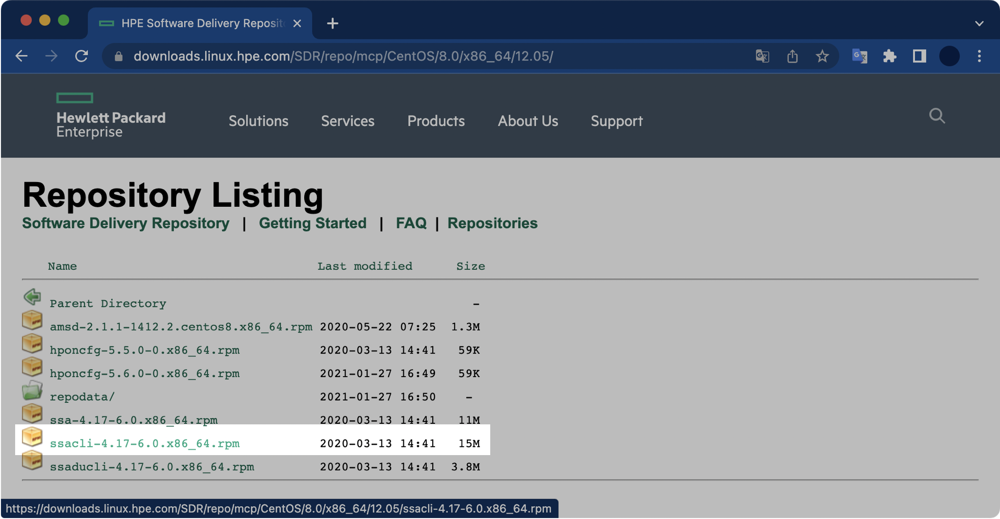

# 개요

- CentOS 7 + HP ProLiant 서버 조합에 `ssacli`(Smart Storage Administrator CLI) 패키지를 설치한다.
- `ssacli`(Smart Storage Administrator CLI) 명령어를 실행해 RAID 구성정보와 디스크 용량, RPM, Serial Number 등의 디스크 상세정보를 확인할 수 있다.

<br>

# 환경

- **OS** : CentOS Linux release 7.6.1810 (Core)
- **Kernel** : 3.10.0
- **Shell** : bash

<br>

# 절차
### 1. 패키지 설치파일 다운로드

**hpssacli**

HPE SSA CLI(HPE Smart Storage Administrator CLI)는 HPE Smart Arrays 컨트롤러 및 HPE SAS HBA를 신속하게 설치, 구성 및 관리하는 단일 인터페이스를 제공하는 Storage 관리 프로그램이다.  
줄여서 `hpssacli` 라고 부른다.

<br>

**설치파일 다운로드 링크**

[HPE Software Delivery Repository](https://downloads.linux.hpe.com/SDR/repo/mcp/centos)

내 경우는 `https://downloads.linux.hpe.com/SDR/repo/mcp/centos/8/x86_64/current/` 에 위치한 `ssacli-4.17-6.0.x86_64.rpm` 15MB 용량의 패키지 설치파일을 다운로드 받았다.



각 서버의 운영체제, CPU 아키텍쳐가 다양하기 때문에 본인의 환경에 맞게 패키지를 찾아서 다운로드 받는다.  
이 글에서 운영체제와 CPU 아키텍쳐의 종류 및 확인방법까지는 다루지 않는다.

<br>

### 2. 패키지 설치파일 업로드

FTP 또는 SFTP를 이용해 서버에 패키지 설치파일을 업로드한다.

```bash
$ pwd
/root/rpms
```

내 경우 패키지 설치파일의 이름은 `ssacli-4.17-6.0.x86_64.rpm` 이다. ssacli v4.17 패키지 파일의 용량은 약 15MB 이다.

```bash
$ ls -lh /root/rpms
-rw-rw-r-- 1 testuser testuser 15M  8월  3 10:41 ssacli-4.17-6.0.x86_64.rpm
```

<br>

### 3. ssacli 설치

**패키지 설치**

Red Hat Enterprise Linux와 CentOS의 경우 패키지 관리자로 rpm을 사용한다.  

패키지 설치 과정에서 발생할 수 있는 권한 문제를 방지하기 위해, 반드시 root 계정으로 전환한 후 패키지 설치 명령어 `rpm -ivh <패키지 이름>.rpm` 를 실행한다.

```bash
$ rpm -ivh ssacli-4.17-6.0.x86_64.rpm
준비 중...                         ################################# [100%]
Updating / installing...
```

<br>

**패키지 설치 확인**

설치된 ssacli RPM 패키지 정보를 확인한다.

```bash
$ rpm -qi ssacli
Name        : ssacli
Version     : 4.17
Release     : 6.0
Architecture: x86_64
Install Date: 2021년 08월 03일 (화) 오전 10시 47분 35초
Group       : Applications/System
Size        : 42277683
License     : See ssacli.license
Signature   : RSA/SHA256, 2020년 01월 14일 (화) 오전 04시 23분 30초, Key ID cxxxaddexxcxbxxx
Source RPM  : ssacli-4.17-6.0.src.rpm
Build Date  : 2020년 01월 14일 (화) 오전 04시 26분 18초
Build Host  : abls12ex6404.sde.rdlabs.hpecorp.net
Relocations : (not relocatable)
Packager    : Hewlett Packard Enterprise Development LP
Vendor      : Hewlett Packard Enterprise Development LP
URL         : http://www.hpe.com
Summary     : Command Line Smart Storage Administrator
Description :
The Command Line Smart Storage Administrator is the storage management
application suite for Proliant Servers.
```

<br>

Description 란에는 해당 패키지에 대한 간략할 설명이 적혀있다. HP ProLiant 모델에 제공되는 스토리지 관리 프로그램이라고 한다.

```bash
[...]
Description :
The Command Line Smart Storage Administrator is the storage management
application suite for Proliant Servers.
```

<br>

**Smart Storage Administrator 모드 접속**

```bash
$ ssacli
Smart Storage Administrator CLI 4.17.6.0
Detecting Controllers...Done.
Type "help" for a list of supported commands.
Type "exit" to close the console.

=>
```

SSA(Smart Storage Administrator) 모드에 접속하면 프롬프트가 `=>` 모양으로 바뀐다.

<br>

### 4. RAID 컨트롤러 구성 상태 확인

**명령어 형식**

```bash
=> ctrl all show config
```

Shell에서 ssacli 모드에 접속하지 않고 ssacli 명령어를 한 번에 실행하는 방법은 아래와 같다.

```bash
$ ssacli ctrl all show config
```

<br>

**명령어 결과**

```bash
=> ctrl all show config

HPE Smart Array P408i-a SR Gen10 in Slot 0 (Embedded)  (sn: PWXKVxxxHDKCQx)


   Internal Drive Cage at Port 1I, Box 1, OK


   Internal Drive Cage at Port 2I, Box 0, OK


   Port Name: 1I (Mixed)

   Port Name: 2I (Mixed)

   Array A (SAS, Unused Space: 0  MB)

      logicaldrive 1 (558.88 GB, RAID 1, OK)

      physicaldrive 1I:1:1 (port 1I:box 1:bay 1, SAS HDD, 600 GB, OK)
      physicaldrive 1I:1:2 (port 1I:box 1:bay 2, SAS HDD, 600 GB, OK)

   SEP (Vendor ID HPE, Model Smart Adapter) 379  (WWID: xxxxxEC0xxCxBAxx, Port: Unknown)
```

600GB 물리 디스크 2개가 RAID 1으로 구성된 걸 확인할 수 있다. 모든 디스크 상태는 정상(`OK`)이다.

<br>

### 5. 특정 PD(Physical Drive) 상태 확인

**명령어 형식**

```bash
=> ctrl slot=<slot_number> pd <PortNumber>:<BoxNumber>:<BayNumber> show
```

`ctrl all show config` 명령어에서 확인한 Port, Box, Bay 번호를 토대로 특정 디스크의 정보를 확인할 수 있다.  

예를 들어 `1I:1:2` 의 경우 1I Port, 1번 Box, 2번 bay에 장착한 물리 디스크이다.

<br>

**명령어 결과**

```bash
=> ctrl slot=0 pd 1I:1:1 show

HPE Smart Array P408i-a SR Gen10 in Slot 0 (Embedded)

   Array A

      physicaldrive 1I:1:1
         Port: 1I
         Box: 1
         Bay: 1
         Status: OK
         Drive Type: Data Drive
         Interface Type: SAS
         Size: 600 GB
         Drive exposed to OS: False
         Logical/Physical Block Size: 512/512
         Rotational Speed: 10000
         Firmware Revision: HPD2
         Serial Number: xxUxAxELFFxF
         WWID: 00000000E000E000
         Model: HP      EG000600JWJNH
         Current Temperature (C): 37
         Maximum Temperature (C): 42
         PHY Count: 2
         PHY Transfer Rate: 12.0Gbps, Unknown
         PHY Physical Link Rate: 12.0Gbps, Unknown
         PHY Maximum Link Rate: 12.0Gbps, 12.0Gbps
         Drive Authentication Status: OK
         Carrier Application Version: 11
         Carrier Bootloader Version: 6
         Sanitize Erase Supported: True
         Sanitize Estimated Max Erase Time: 4 hour(s), 1 minute(s) 
         Unrestricted Sanitize Supported: True
         Shingled Magnetic Recording Support: None
         Drive Unique ID: 00000000E000E000
```

명령어 결과에서 인터페이스 종류(`Interace Type`), 디스크 용량(`Size`), RPM(`Rotational Speed`), `Serial Number`, 전송속도(`PHY Transfer Rate`) 등 상세한 정보까지 확인이 가능하다. 심지어 디스크의 현재 온도(`Current Temperature`)까지 확인 가능하다.

<br>

### 6. SSA 모드 나가기

`exit` 명령어를 실행해서 SSA 모드를 빠져나올 수 있다.  

```bash
=> exit
$
```

<br>

이걸로 SSA 설치 및 간단 사용법은 익혔다.

<br>

# 결론

서버 관리 업무 중 중요 테스크로 뽑히는 것 중 하나는 서버의 물리 디스크 및 RAID 구성 관리이다.  
HPE에서 만든 서버의 경우, SSA CLI를 통해 디스크 제원과 상태, RAID 상태를 자세히 확인할 수 있다.  
무엇보다 `ssacli` 명령어를 잘 활용하면 서버에 꽂힌 디스크 수량이나 모델명을 조사하러 데이터센터에 들어갈 일이 없다.  

이 글을 읽는 분들은 대부분 시스템 엔지니어나 어드민일 것 같은데, 여러 대의 서버를 관리하는거 기왕이면 HPE 서버에는 모두 SSA CLI를 깔아놓도록 하자.  
처음엔 패키지 설치 과정이 귀찮겠지만, 장기적 관점에서 훨씬 서버 관리가 편해질 것이다.  