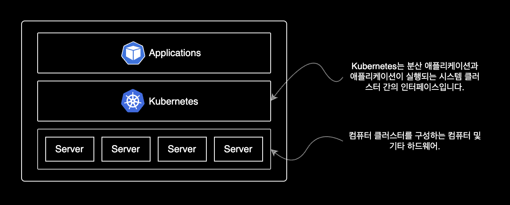
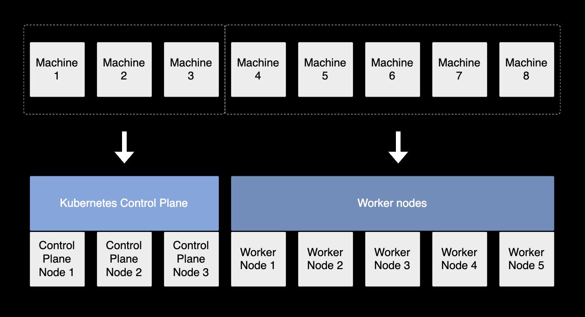
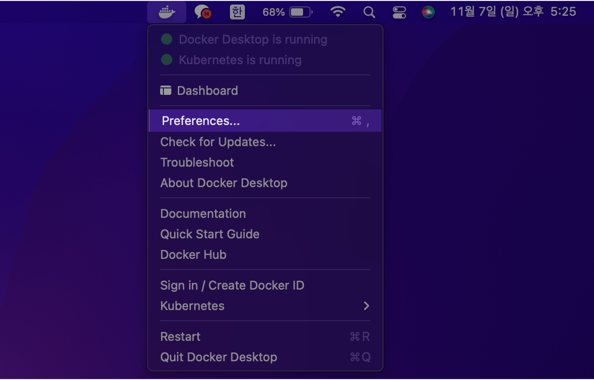

## 개요

macOS 로컬환경에서 Kubernetes 실습을 할 수 있도록 쿠버네티스 설치 과정을 설명합니다.

&nbsp;

## 배경지식

### Kubernetes

#### 쿠버네티스 개요

[쿠버네티스](https://kubernetes.io/docs/concepts/overview/)는 수백 대, 수천 대의 컨테이너를 쉽고 빠르게 배포/확장하고 관리를 자동화해주는 오픈소스 플랫폼입니다.



컴퓨터 클러스터를 구성하고 관리하는 오픈소스 플랫폼인 쿠버네티스는 클러스터에 대한 운영 체제<sup>Operating System</sup>와 같은 역할을 수행합니다.

&nbsp;

#### 쿠버네티스 클러스터의 구성

쿠버네티스가 컴퓨터 클러스터에 어떻게 배포, 구성되는 지 구체적인 예시가 궁금하다면 다음 그림을 참고합니다.



하나의 쿠버네티스 클러스터는 여러 대의 머신으로 구성됩니다. 클러스터를 구성하는 전체 머신은 크게 2개 그룹으로 나눌 수 있습니다.

- [**Control Plane**](https://kubernetes.io/docs/concepts/overview/components/#control-plane-components) : Control Plane은 Control Plane Nodes에서 실행됩니다. Control Plane은 클러스터의 두뇌와 같으며 전체적인 쿠버네티스 시스템을 제어합니다.
- [**Worker Nodes**](https://kubernetes.io/docs/concepts/overview/components/#node-components) : Control Plane 외에 나머지 노드들은 모두 Worker Node라고 불리며 어플리케이션(파드)은 Worker Node에서 실행됩니다.

&nbsp;

## 환경

- **Hardware** : MacBook Pro (13", M1, 2020)
- **OS** : macOS Monterey 12.0.1
- **패키지 관리자** : Homebrew 3.3.2
- **Docker Desktop 4.1.1**
- **클러스터 구성** : minikube
  - 노드의 쿠버네티스 버전은 Kubernetes v1.21.5
  - 클러스터는 2대의 노드로 구성

&nbsp;

## 준비사항

### 로컬 환경

- macOS 패키지 관리자인 [homebrew](https://brew.sh/ko)가 미리 설치되어 있어야 합니다.
- 로컬 쿠버네티스 클러스터 생성을 위해 [minikube](https://github.com/kubernetes/minikube)가 설치되어 있어야 합니다.

homebrew 설치 방법은 이 글의 주제를 벗어나기 때문에 자세한 설명을 생략합니다.

&nbsp;

## 클러스터 셋업

### Docker 설치

쿠버네티스 클러스터를 생성하기 위해서는 docker 설치가 먼저 필요합니다.

macOS용 패키지 관리자인 Homebrew를 이용해 `docker`를 설치합니다.

```bash
$ brew install --cask docker
==> Downloading https://desktop.docker.com/mac/main/arm64/69879/Docker.dmg
Already downloaded: /Users/ive/Library/Caches/Homebrew/downloads/b5774f18ca8a6d3936c5174f91b93cb1a1a407daa784fe63d9b6300180c7b1ed--Docker.dmg
==> Installing Cask docker
==> Moving App 'Docker.app' to '/Applications/Docker.app'
==> Linking Binary 'docker-compose.bash-completion' to '/opt/homebrew/etc/bash_c
==> Linking Binary 'docker.zsh-completion' to '/opt/homebrew/share/zsh/site-func
==> Linking Binary 'docker.fish-completion' to '/opt/homebrew/share/fish/vendor_
==> Linking Binary 'docker-compose.fish-completion' to '/opt/homebrew/share/fish
==> Linking Binary 'docker-compose.zsh-completion' to '/opt/homebrew/share/zsh/s
==> Linking Binary 'docker.bash-completion' to '/opt/homebrew/etc/bash_completio
🍺  docker was successfully installed!
```

docker 최초 설치 시 오래 걸립니다.  
인내심을 갖고 기다립니다.

&nbsp;

brew로 설치한 패키지 목록을 확인합니다.

```bash
$ brew list --cask
docker                                   iterm2
```

cask 목록에 `docker`가 추가되었습니다.

&nbsp;

곧 런치패드에도 Docker 아이콘이 추가됩니다.


&nbsp;

### kubernetes 활성화

도커가 정상 설치되었다면 상단바에 Docker Desktop 아이콘이 나타납니다.  
이제 도커 데스크탑에서 쿠버네티스 기능을 활성화합니다.



상단바 Docker 아이콘 클릭 → 환경설정(Preferences) 클릭

&nbsp;


Kubernetes → Enable Kubernetes 체크 → Apply & Restart

&nbsp;

### 클러스터 생성

minikube를 사용해서 로컬 쿠버네티스 클러스터를 생성합니다.

```bash
$ minikube start \
    --driver='docker' \
    --kubernetes-version='stable' \
    --nodes=2
```

`--nodes=<NODE_NUMBER>` 옵션을 사용해서 쿠버네티스 클러스터를 구성하는 노드 수를 지정할 수 있습니다.

&nbsp;

### kubernetes 상태 확인

`minikube` 클러스터의 컨트롤 플레인이 쿠버네티스 클러스터 정보를 제대로 응답하는지 확인합니다.

```bash
$ kubectl cluster-info
Kubernetes control plane is running at https://kubernetes.docker.internal:6443
CoreDNS is running at https://kubernetes.docker.internal:6443/api/v1/namespaces/kube-system/services/kube-dns:dns/proxy

To further debug and diagnose cluster problems, use 'kubectl cluster-info dump'.
```

[쿠버네티스 API 서버](https://coffeewhale.com/apiserver)가 minikube 클러스터 정보를 정상적으로 응답했습니다.

&nbsp;

#### kubectl 버전 확인

kubectl은 쿠버네티스 클러스터에게 명령을 내리고 관리하기 위한 <abbr title="Command Line Interface">CLI</abbr> 도구입니다.

&nbsp;

로컬에 설치된 `kubectl` 버전을 확인합니다.  
예상하지 못한 실행결과와 버그를 방지하기 위해 클러스터의 쿠버네티스 버전과 `kubectl` 버전을 일치시켜 사용하는 것을 권장합니다.

```bash
$ kubectl version
Client Version: version.Info{Major:"1", Minor:"22", GitVersion:"v1.22.3", GitCommit:"c92036820499fedefec0f847e2054d824aea6cd1", GitTreeState:"clean", BuildDate:"2021-10-27T18:34:20Z", GoVersion:"go1.16.10", Compiler:"gc", Platform:"darwin/arm64"}
Server Version: version.Info{Major:"1", Minor:"21", GitVersion:"v1.21.5", GitCommit:"aea7bbadd2fc0cd689de94a54e5b7b758869d691", GitTreeState:"clean", BuildDate:"2021-09-15T21:04:16Z", GoVersion:"go1.16.8", Compiler:"gc", Platform:"linux/arm64"}
```

`kubectl` 명령어가 문제없이 동작하는 걸 확인할 수 있습니다.

이제 쿠버네티스 클러스터 구성이 끝났습니다.

&nbsp;

## 쿠버네티스 실습

### 1. pod 스펙 작성

kubernetes에서 오브젝트를 생성하려면 오브젝트에 대한 기본적인 정보와 함께 의도한 상태를 기술한 오브젝트 스펙<sup>Spec</sup>을 제시해야합니다.

쿠버네티스 오브젝트를 생성하기 위한 언어는 크게 <abbr title="YAML Ain't Markup Language">YAML</abbr>과 <abbr title="JavaScript Object Notation">JSON</abbr>으로 나뉩니다.  
대부분의 경우 YAML이 JSON보다 가독성이 좋고 작성하기도 쉬워서 많이들 사용합니다.

쿠버네티스 구성요소의 최소 단위를 파드<sup>Pod</sup>라고 부릅니다. 도커에서는 컨테이너를 사용하지만요.  
1개의 파드는 1개 이상의 컨테이너로 구성됩니다.

&nbsp;

아래는 파드 매니페스트를 생성하는 명령어입니다.  
`myapp-pod`라는 이름의 파드 1개를 생성하는 내용입니다.

```bash
$ cat << EOF > sample-pod.yaml
---
apiVersion: v1
kind: Pod
metadata:
 name: myapp-pod           # 파드 이름
 labels:
   app: myapp
spec:
 containers:
 - name: myapp-container   # 컨테이너 이름
   image: busybox          # 컨테이너 이미지
   # 컨테이너가 실행할 명령어
   command: ['sh', '-c', 'echo Hello Kubernetes! && sleep 3600']
EOF
```

`myapp-pod`라는 이름을 가진 파드 안에는 1개의 컨테이너가 포함되어 있습니다.  
해당 컨테이너의 이름은 `myapp-container`이며 최신 버전의 `busybox` 이미지를 사용해서 컨테이너를 생성합니다.

&nbsp;

### 2. pod 배포

작성한 `sample-pod.yaml` 파일을 사용해서 파드를 생성합니다.

```bash
$ kubectl apply -f sample-pod.yaml
pod/myapp-pod created
```

실행 결과로 `pod/myapp-pod created` 메세지가 출력되면 pod가 정상 생성된 것입니다.

&nbsp;

### 3. pod 상태확인

파드 정보를 확인합니다.

```bash
$ kubectl get pods
NAME        READY   STATUS              RESTARTS   AGE
myapp-pod   0/1     ContainerCreating   0          3s
```

파드의 `STATUS`를 확인합니다.  
현재 파드가 생성중<sup>`ContainerCreating`</sup>인 상태입니다.

&nbsp;

몇 초 후에 파드 목록을 다시 조회합니다.

```bash
$ kubectl get pods
NAME        READY   STATUS    RESTARTS   AGE
myapp-pod   1/1     Running   0          5s
```

이제 파드가 생성 완료된 후 실행중<sup>`Running`</sup>입니다.

&nbsp;

#### 축약어

```bash
$ kubectl get po
```

`pods` 키워드 대신 축약형인 `po`를 입력해도 됩니다.

파드 외에 대부분의 쿠버네티스 리소스, 오브젝트들에도 축약형이 지정되어 있습니다.  
예를 들어 namespace는 `ns`, deployments는 `deploy`, replicasets는 `rs`입니다.

CLI 환경에서는 한 글자라도 덜 치는게 편하게 일하는 지름길입니다.

&nbsp;

#### 파드 정보 자세히 출력

파드 리스트를 조회합니다.

```bash
$ kubectl get pods -o wide
NAME        READY   STATUS    RESTARTS   AGE   IP         NODE             NOMINATED NODE   READINESS GATES
myapp-pod   1/1     Running   0          11s   10.1.0.8   docker-desktop   <none>           <none>
```

`-o wide` 옵션을 사용하면 `IP`, `NODE`, `NOMINATED NODE`, `READINESS GATES` 4가지 정보를 더 보여줍니다.

&nbsp;

### 4. 배포 결과확인

특정 파드의 로그를 확인합니다.

```bash
$ kubectl logs pod/myapp-pod
Hello Kubernetes!
```

`sample-pod.yaml` 파일에 작성한대로 파드가 `echo Hello Kubernetes!` 메세지를 출력했습니다.

&nbsp;

### 5. pod 접속

`myapp-pod` 파드의 `myapp-container` 컨테이너 안으로 접속합니다.

&nbsp;

#### deprecated 명령어

구 버전의 kubernetes에서는 pod 접속시 `kubectl exec -it [POD] [COMMAND]` 명령어를 사용했습니다.

```bash
$ kubectl exec -it myapp-pod /bin/sh -c myapp-container
```

하지만 해당 명령어는 신규 명령어로 대체되어 곧 다음 버전에서 사라질<sup>deprecated</sup> 예정입니다.

&nbsp;

과거 방식의 접속 명령어를 사용하면 아래와 같은 경고문이 출력됩니다.  
친절하게도 올바른 새 버전의 명령어를 안내해주기까지 하네요.

```bash
kubectl exec [POD] [COMMAND] is DEPRECATED and will be removed in a future version. Use kubectl exec [POD] -- [COMMAND] instead.
```

파드 접속 명령어를 사용할 때 이 점을 꼭 기억합니다.

&nbsp;

#### 명령어 형식

kubernetes 권고사항에 따라 아래의 신규 `kubectl exec` 명령어를 사용해서 컨테이너에 접속합니다.

```bash
$ kubectl exec <POD_NAME> -c <CONTAINER_NAME> -it -- <COMMAND>
```

&nbsp;

#### 실제 명령어

`myapp-pod` 파드의 `myapp-container` 컨테이너로 접속합니다.

```bash
$ kubectl exec myapp-pod \
    -c myapp-container \
    -it \
    -- /bin/sh
```

&nbsp;

`/bin/sh`을 이용해서 `myapp-pod`의 `myapp-container`에 접속합니다.

```bash
$ kubectl exec myapp-pod \
    -c myapp-container \
    -it \
    -- /bin/sh
```

&nbsp;

컨테이너에 접속되면 프롬프트가 컨테이너 환경에 맞게 변경됩니다.

컨테이너의 shell 환경에 진입한 상태입니다.

```bash
/ # hostname
myapp-pod
```

```bash
/ # ifconfig
eth0      Link encap:Ethernet  HWaddr 5E:DC:25:DF:28:AA
          inet addr:10.1.0.9  Bcast:10.1.255.255  Mask:255.255.0.0
          UP BROADCAST RUNNING MULTICAST  MTU:1500  Metric:1
          RX packets:14 errors:0 dropped:0 overruns:0 frame:0
          TX packets:1 errors:0 dropped:0 overruns:0 carrier:0
          collisions:0 txqueuelen:0
          RX bytes:1048 (1.0 KiB)  TX bytes:42 (42.0 B)

lo        Link encap:Local Loopback
          inet addr:127.0.0.1  Mask:255.0.0.0
          UP LOOPBACK RUNNING  MTU:65536  Metric:1
          RX packets:0 errors:0 dropped:0 overruns:0 frame:0
          TX packets:0 errors:0 dropped:0 overruns:0 carrier:0
          collisions:0 txqueuelen:1000
          RX bytes:0 (0.0 B)  TX bytes:0 (0.0 B)
```

컨테이너 상태 확인이 끝났습니다.

&nbsp;

컨테이너 안에서 Escape Sequence인 <kbd>Ctrl</kbd> + <kbd>p</kbd>, <kbd>q</kbd> 키를 입력하면 컨테이너 쉘에서 빠져나올 수 있습니다.

```bash
exec attach failed: error on attach stdin: read escape sequence
command terminated with exit code 126
$ 
```

&nbsp;

### 6. 파드 삭제

이전에 작성한 `.yaml` 파일을 사용해서 생성한 파드를 삭제합니다.

```bash
$ kubectl delete -f sample-pod.yaml
pod "myapp-pod" deleted
```

`kubectl delete pod` 명령어를 이용해 파드를 지정해 삭제를 할수도 있지만, 깔끔한 삭제를 위해서는 `-f` 옵션을 이용해 yaml 파일에 선언된 설정을 기반으로 삭제하는 걸 권장합니다.

파드 삭제까지 약 20초 정도 걸립니다.

&nbsp;

파드 목록을 조회합니다.

```bash
$ kubectl get po
No resources found in default namespace.
```

`default` 네임스페이스에서 파드가 없다고 나옵니다.

파드 삭제가 완료되었습니다.

&nbsp;

### 7. 실습환경 정리

실습이 끝났으니 minikube 클러스터를 완전 삭제합니다.

```bash
$ minikube delete
```

&nbsp;

minikube 클러스터의 상태를 확인합니다.

```bash
$ minikube status
🤷  Profile "minikube" not found. Run "minikube profile list" to view all profiles.
👉  To start a cluster, run: "minikube start"
```

클러스터가 삭제되었기 때문에 minikube 클러스터의 상태 정보가 조회되지 않습니다.

&nbsp;

## 마치며

지금까지 minikube를 활용해서 간단한 쿠버네티스 실습을 해보았습니다.  
이상 실습을 마치겠습니다.
