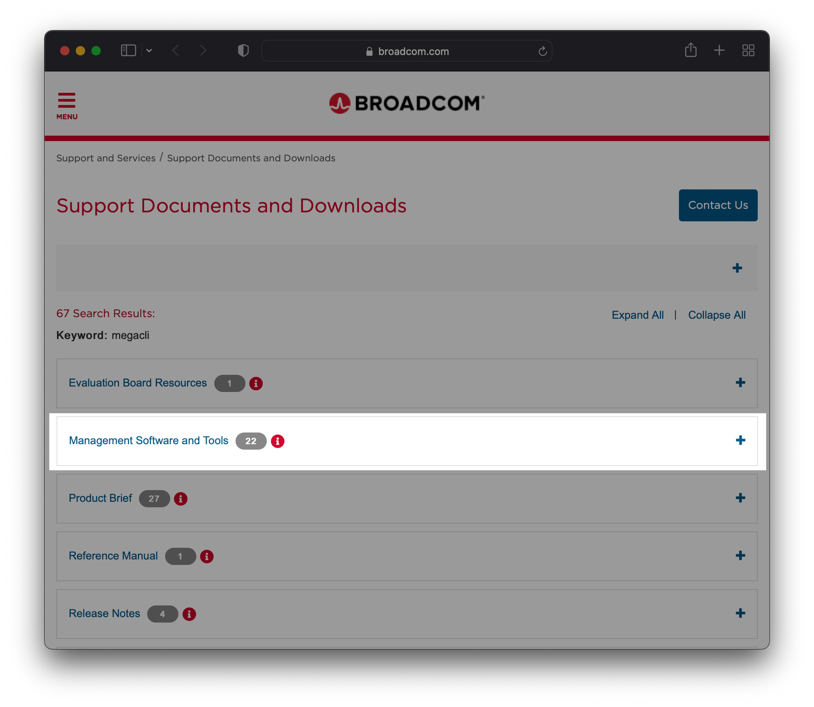
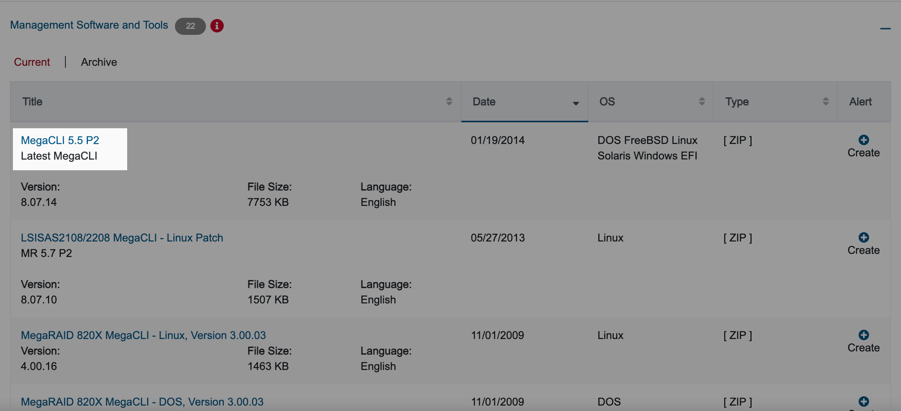

# 개요
LSI 사의 RAID Controller가 장착된 리눅스 서버에서 MegaCLI 명령어를 이용해 RAID 관련 정보를 확인할 수 있다.  

megacli는 MegaRaid를 CLI 환경에서 조작할 수 있도록 지원하는 관리 소프트웨어이다.  
<br>

# 환경
- **OS** : Red Hat Enterprise Linux Server release 6.2 (Santiago)
- **Architecture** : x86_64
- **Shell** : bash
- **설치할 패키지** : MegaCLI v8.07.14 (`MegaCli-8.07.14-1.noarch.rpm`)

<br>

# 본문
## MegaCLI 패키지 설치

### 1. RAID Controller 제원 확인
우선 해당 서버의 RAID Controller가 LSI Logic에서 만든 MegaRAID 제품이어야 MegaCli 패키지를 설치후 명령어를 이용 가능하다. 그러니 우선 RAID Controller의 제조사와 모델명부터 확인한다.  

<br>


#### 확인방법 1. `lspci`
```bash
$ rpm -qa pciutils
pciutils-3.1.4-11.el6.x86_64
```
`lspci` 명령어를 사용하기 위해서는 lspci 패키지 설치가 선행되어야 한다.  
<br>


```bash
$ lspci | grep -i raid
06:00.0 RAID bus controller: LSI Logic / Symbios Logic MegaRAID SAS 2208 [Thunderbolt] (rev 03)
```
RAID Controller 제조사(Vendor)는 `LSI Logic`, 모델명은 `MegaRAID SAS 2208 [Thunderbolt]` 라는 정보를 얻을 수 있다.  
<br>


#### 확인방법 2. `lshw`
```bash
$ rpm -qa lshw
lshw-2.17-1.el6.rf.x86_64
```
`lshw` 명령어를 사용하기 위해서는 lshw 패키지 설치가 선행되어야 한다.
<br>


해당 서버는 `LSI Logic`사에서 만든 RAID Controller 모델 `MegaRAID SAS 2208 [Thunderbolt]`를 사용하고 있다.
```bash
$ lshw -c storage
  *-storage               
       description: RAID bus controller
       product: MegaRAID SAS 2208 [Thunderbolt]
       vendor: LSI Logic / Symbios Logic
       physical id: 0
       bus info: pci@0000:06:00.0
       logical name: scsi0
       version: 03
       width: 64 bits
       clock: 33MHz
       capabilities: storage pm pciexpress vpd msi msix bus_master cap_list rom
       configuration: driver=megaraid_sas latency=0
       resources: irq:40 ioport:d000(size=256) memory:fbd60000-fbd63fff memory:fbd00000-fbd3ffff memory:fbd40000-fbd5ffff(prefetchable)
```
**`lshw` 명령어 설명**  
`-c <class>` : 특정 파트에 대한 상세 정보를 출력한다.  
<br>


### 2. 설치파일 다운로드

**Broadcom 다운로드 링크 접속**  

Broadcom 사의 공식 다운로드 홈페이지를 접속한다.  

https://www.broadcom.com/support/download-search?dk=megacli 

<br>


**Management Software and Tools 클릭**  

<br>


**MegaCLI 5.5 P2 (Version 8.07.14) 클릭**  


클릭시 팝업 페이지가 뜨며 zip 확장자의 설치파일 다운로드가 시작된다.  

<br>


### 3. MegaCLI 패키지 업로드

SFTP, FTP를 이용해 서버에 MegaCLI 설치파일(`8-07-14_MegaCLI.zip`)을 업로드한다.
```bash
$ ls
8-07-14_MegaCLI.zip
```
<br>


```bash
$ ls -lh
total 7.6M
-rw-rw-r-- 1 devuser1 devuser1 7.6M Nov 18 09:15 8-07-14_MegaCLI.zip
```
MegaCLI 설치파일의 용량은 7.6MB 이다.  
<br>


설치파일 zip을 압축해제한다.  
```bash
$ unzip 8-07-14_MegaCLI.zip 
Archive:  8-07-14_MegaCLI.zip
  inflating: 8.07.14_MegaCLI.txt     
  inflating: DOS/MegaCLI.exe         
 extracting: FreeBSD/MegaCLI.zip     
 extracting: FreeBSD/MegaCli64.zip   
  inflating: Linux/MegaCli-8.07.14-1.noarch.rpm  
  inflating: Solaris/MegaCli.pkg     
  inflating: Windows/MegaCli.exe     
  inflating: Windows/MegaCli64.exe  
```
<br>


압축 해제후 생성된 `Linux` 디렉토리로 이동한다.
```bash
$ ls
8-07-14_MegaCLI.zip  8.07.14_MegaCLI.txt  DOS  FreeBSD  Linux  Solaris  Windows
$ cd Linux
```
<br>


Linux용 패키지 설치파일 확인
```bash
$ ls  
MegaCli-8.07.14-1.noarch.rpm
```
<br>


### 4. 패키지 설치
```bash
$ rpm -ivh MegaCli-8.07.14-1.noarch.rpm 
Preparing...                ########################################### [100%]
   1:MegaCli                ########################################### [100%]
```

패키지 설치파일명의 `noarch`는 특정 아키텍쳐를 의미하지 않을 때 붙이는 키워드이다. 아키텍쳐 종류로는 alpha, sparc, sparc64, i386, i586, i686, ppc64 등이 있다. megacli 패키지가 설치되는 절대 경로는 `/opt/MegaRAID/MegaCli/` 이다.  
<br>


### 5. 명령어 심볼릭 링크 연결
MegaCli64 명령어에는 대소문자와 숫자까지 섞여있다. MegaCLI64 명령어를 편하게 사용하기 위해 `MegaCli64` 명령어 파일을 `megacli`로 심볼릭 링크 연결한다.  
```bash
$ ln -s /opt/MegaRAID/MegaCli/MegaCli64 /usr/bin/megacli
```
<br>


이제부터는 `MegaCli64` 명령어가 아닌 `megacli`로 입력해서 사용하면 된다.

```bash
$ which megacli
/usr/bin/megacli
```
<br>


### 6. 명령어 동작 테스트
`-v` 옵션은 megacli 버전을 출력한다.  

```bash
$ megacli -v
                                     

      MegaCLI SAS RAID Management Tool  Ver 8.07.14 Dec 16, 2013
    
    (c)Copyright 2013, LSI Corporation, All Rights Reserved.

Exit Code: 0x00
```
<br>


## MegaCli 명령어
### 1. megacli 명령어 메뉴얼 확인
자세한 명령어 메뉴얼은 `megacli -h` 명령어로 확인 가능하다.

```bash
$ megacli -h | more
                                     

      MegaCLI SAS RAID Management Tool  Ver 8.07.14 Dec 16, 2013
    
    (c)Copyright 2013, LSI Corporation, All Rights Reserved.


NOTE: The following options may be given at the end of any command below: 

    [-Silent] [-AppLogFile filename] [-NoLog] [-page[N]] 
                 [-] is optional. 
                  N - Number of lines per page. 

MegaCli -v 
MegaCli -help|-h|? 
MegaCli -adpCount 
MegaCli -AdpSetProp {CacheFlushInterval -val} | { RebuildRate -val} 
    | {PatrolReadRate -val} | {BgiRate -val} | {CCRate -val} | {ForceSGPIO -val}
    | {ReconRate -val} | {SpinupDriveCount -val} | {SpinupDelay -val} 
    | {CoercionMode -val} | {ClusterEnable -val} | {PredFailPollInterval -val} 
    | {BatWarnDsbl -val} | {EccBucketSize -val} | {EccBucketLeakRate -val} 
    | {AbortCCOnError -val} | AlarmEnbl | AlarmDsbl | AlarmSilence 

[...]

MegaCli XD -FetchSafeId -iN | -iALL
MegaCli XD -ApplyActivationKey <key> -iN

Exit Code: 0x00
```
<br>


### 2. 시스템 요약정보 확인
**확인 가능한 주요정보**
- **시스템 기본정보** : 리눅스 커널 버전, 드라이버 버전, megacli 패키지 버전 정보
- **RAID Controller** : 제조사, 모델명, 펌웨어 버전, 상태
- **RAID 배터리(BBU, Battery Backup Unit)** : BBU는 갑작스러운 전원 중단이 발생하더라도 캐시의 내용이 지워지지 않도록 보존하는 역할을 한다.
- **인클로저(Enclosure)**
- **물리적 디스크(PD, Physical Drive) 구성정보**
- **논리적 디스크(VD, Virtual Drive) 구성정보** : 논리적 디스크는 RAID를 의미한다.

```bash
$ megacli -ShowSummary -aALL
                                     
System
        Operating System:  Linux version 2.6.32-220.el6.x86_64 
        Driver Version: 00.00.05.40-rh2
        CLI Version: 8.07.14

Hardware
        Controller
                 ProductName       : LSI MegaRAID SAS 9266-8i(Bus 0, Dev 0)
                 SAS Address       : 500605b0057b9570
                 FW Package Version: 23.9.0-0023
                 Status            : Optimal
        BBU
                 BBU Type          : 
                 Status            : Healthy
        Enclosure
                 Product Id        : SGPIO           
                 Type              : SGPIO
                 Status            : OK

        PD 
                Connector          : Port 0 - 3<Internal>: Slot 1 
                Vendor Id          : SEAGATE 
                Product Id         : ST9300653SS     
                State              : Online
                Disk Type          : SAS,Hard Disk Device
                Capacity           : 278.464 GB
                Power State        : Active
    
                Connector          : Port 0 - 3<Internal>: Slot 0 
                Vendor Id          : SEAGATE 
                Product Id         : ST9300653SS     
                State              : Online
                Disk Type          : SAS,Hard Disk Device
                Capacity           : 278.464 GB
                Power State        : Active

Storage

       Virtual Drives
                Virtual drive      : Target Id 0 ,VD name 
                Size               : 278.464 GB
                State              : Optimal
                RAID Level         : 1 


Exit Code: 0x00
```
<br>


### 3. 물리적 디스크 정보 확인
PD는 물리 디스크(Physical Drive)의 약자이다.

```bash
## MegaCli64 명령어를 심볼릭 링크로 연결하지 않았을 경우
$ /opt/MegaRAID/MegaCli/MegaCli64 -PDList -aALL
```

```bash
## MegaCli64 명령어를 심볼릭 링크로 연결했을 경우
$ megacli -PDList -aALL
                                     
Adapter #0

Enclosure Device ID: 252
Slot Number: 0
Drive's position: DiskGroup: 0, Span: 0, Arm: 1
Enclosure position: N/A
Device Id: 9
WWN: 5000C5005EC4558C
Sequence Number: 2
Media Error Count: 0
Other Error Count: 0
Predictive Failure Count: 0
Last Predictive Failure Event Seq Number: 0
PD Type: SAS

Raw Size: 279.396 GB [0x22ecb25c Sectors]
Non Coerced Size: 278.896 GB [0x22dcb25c Sectors]
Coerced Size: 278.464 GB [0x22cee000 Sectors]
Sector Size:  512
Firmware state: Online, Spun Up
Device Firmware Level: 0004
Shield Counter: 0
Successful diagnostics completion on :  N/A
SAS Address(0): 0x5000c5005ec4558d
SAS Address(1): 0x0
Connected Port Number: 1(path0) 
Inquiry Data: SEAGATE ST9300653SS     00046XN2SNLZ            
FDE Capable: Not Capable
FDE Enable: Disable
Secured: Unsecured
Locked: Unlocked
Needs EKM Attention: No
Foreign State: None 
Device Speed: 6.0Gb/s 
Link Speed: 6.0Gb/s 
Media Type: Hard Disk Device
Drive:  Not Certified
Drive Temperature :29C (84.20 F)
PI Eligibility:  No 
Drive is formatted for PI information:  No
PI: No PI
Port-0 :
Port status: Active
Port's Linkspeed: 6.0Gb/s 
Port-1 :
Port status: Active
Port's Linkspeed: 6.0Gb/s 
Drive has flagged a S.M.A.R.T alert : No


Enclosure Device ID: 252
Slot Number: 1
Drive's position: DiskGroup: 0, Span: 0, Arm: 0
Enclosure position: N/A
Device Id: 8
WWN: 5000C5005EC45560
Sequence Number: 2
Media Error Count: 0
Other Error Count: 0
Predictive Failure Count: 0
Last Predictive Failure Event Seq Number: 0
PD Type: SAS

Raw Size: 279.396 GB [0x22ecb25c Sectors]
Non Coerced Size: 278.896 GB [0x22dcb25c Sectors]
Coerced Size: 278.464 GB [0x22cee000 Sectors]
Sector Size:  512
Firmware state: Online, Spun Up
Device Firmware Level: 0004
Shield Counter: 0
Successful diagnostics completion on :  N/A
SAS Address(0): 0x5000c5005ec45561
SAS Address(1): 0x0
Connected Port Number: 0(path0) 
Inquiry Data: SEAGATE ST9300653SS     00046XN2SNMA            
FDE Capable: Not Capable
FDE Enable: Disable
Secured: Unsecured
Locked: Unlocked
Needs EKM Attention: No
Foreign State: None 
Device Speed: 6.0Gb/s 
Link Speed: 6.0Gb/s 
Media Type: Hard Disk Device
Drive:  Not Certified
Drive Temperature :28C (82.40 F)
PI Eligibility:  No 
Drive is formatted for PI information:  No
PI: No PI
Port-0 :
Port status: Active
Port's Linkspeed: 6.0Gb/s 
Port-1 :
Port status: Active
Port's Linkspeed: 6.0Gb/s 
Drive has flagged a S.M.A.R.T alert : No


Exit Code: 0x00
```
<br>


### 4. 물리 디스크 개별 에러 카운트 확인
디스크의 `Error Count` 값이 1 이상이면 디스크 교체를 권고한다.  
`Predictive Failure Count` 값이 급증하는 디스크의 경우는 며칠 이내에 디스크 폴트가 발생할 수 있으니 미리 예비 디스크 파트를 확보해둔다.  

```bash
$ megacli -PDList -aALL | grep Count
Media Error Count: 0
Other Error Count: 0
Predictive Failure Count: 0
Shield Counter: 0
Media Error Count: 0
Other Error Count: 0
Predictive Failure Count: 0
Shield Counter: 0
```
<br>


### 5. 논리적 디스크 정보 확인
```bash
$ megacli -LDInfo -Lall -aALL
                                     

Adapter 0 -- Virtual Drive Information:
Virtual Drive: 0 (Target Id: 0)
Name                :
RAID Level          : Primary-1, Secondary-0, RAID Level Qualifier-0
Size                : 278.464 GB
Sector Size         : 512
Mirror Data         : 278.464 GB
State               : Optimal
Strip Size          : 64 KB
Number Of Drives    : 2
Span Depth          : 1
Default Cache Policy: WriteBack, ReadAhead, Direct, No Write Cache if Bad BBU
Current Cache Policy: WriteBack, ReadAhead, Direct, No Write Cache if Bad BBU
Default Access Policy: Read/Write
Current Access Policy: Read/Write
Disk Cache Policy   : Disk's Default
Encryption Type     : None
PI type: No PI

Is VD Cached: No


Exit Code: 0x00
```
<br>


### 6. 어댑터 정보확인
**확인 가능한 주요정보**

- RAID Controller 모델명
- RAID Controller Serial 번호
- RAID Controller 펌웨어 버전 정보
- RAID Controller가 지원하는 RAID Level 정보
- RAID Controller가 지원하는 드라이브 타입 : SAS, SATA

```bash
$ megacli -AdpAllInfo -aALL
                                     
Adapter #0

==============================================================================
                    Versions
                ================
Product Name    : LSI MegaRAID SAS 9266-8i
Serial No       : SV23924725
FW Package Build: 23.9.0-0023

                    Mfg. Data
                ================
Mfg. Date       : 09/29/12
Rework Date     : 00/00/00
Revision No     : 09B
Battery FRU     : N/A

                Image Versions in Flash:
                ================
BIOS Version       : 5.38.00_4.12.05.00_0x05180000
WebBIOS Version    : 6.1-49-e_49-Rel
Preboot CLI Version: 05.05-03:#%00011
FW Version         : 3.220.75-2196
NVDATA Version     : 2.1209.03-0117
Boot Block Version : 2.05.00.00-0010
BOOT Version       : 07.26.13.219

                Pending Images in Flash
                ================
None

                PCI Info
                ================
Controller Id   : 0000
Vendor Id       : 1000
Device Id       : 005b
SubVendorId     : 1000
SubDeviceId     : 9266

Host Interface  : PCIE

ChipRevision    : C1

Link Speed           : 0 
Number of Frontend Port: 0 
Device Interface  : PCIE

Number of Backend Port: 8 
Port  :  Address
0        5000c5005ec45561 
1        5000c5005ec4558d 
2        0000000000000000 
3        0000000000000000 
4        0000000000000000 
5        0000000000000000 
6        0000000000000000 
7        0000000000000000 

                HW Configuration
                ================
SAS Address      : 500605b0057b9570
BBU              : Present
Alarm            : Present
NVRAM            : Present
Serial Debugger  : Present
Memory           : Present
Flash            : Present
Memory Size      : 1024MB
TPM              : Absent
On board Expander: Absent
Upgrade Key      : Absent
Temperature sensor for ROC    : Present
Temperature sensor for controller    : Absent

ROC temperature : 46  degree Celsius

                Settings
                ================
Current Time                     : 9:44:50 11/18, 2021
Predictive Fail Poll Interval    : 300sec
Interrupt Throttle Active Count  : 16
Interrupt Throttle Completion    : 50us
Rebuild Rate                     : 30%
PR Rate                          : 30%
BGI Rate                         : 30%
Check Consistency Rate           : 30%
Reconstruction Rate              : 30%
Cache Flush Interval             : 4s
Max Drives to Spinup at One Time : 2
Delay Among Spinup Groups        : 12s
Physical Drive Coercion Mode     : 1GB
Cluster Mode                     : Disabled
Alarm                            : Enabled
Auto Rebuild                     : Enabled
Battery Warning                  : Enabled
Ecc Bucket Size                  : 15
Ecc Bucket Leak Rate             : 1440 Minutes
Restore HotSpare on Insertion    : Disabled
Expose Enclosure Devices         : Enabled
Maintain PD Fail History         : Disabled
Host Request Reordering          : Enabled
Auto Detect BackPlane Enabled    : SGPIO/i2c SEP
Load Balance Mode                : Auto
Use FDE Only                     : Yes
Security Key Assigned            : No
Security Key Failed              : No
Security Key Not Backedup        : No
Default LD PowerSave Policy      : Automatic
Maximum number of direct attached drives to spin up in 1 min : 10 
Auto Enhanced Import             : Yes
Any Offline VD Cache Preserved   : No
Allow Boot with Preserved Cache  : No
Disable Online Controller Reset  : No
PFK in NVRAM                     : No
Use disk activity for locate     : No
POST delay                       : 90 seconds
BIOS Error Handling              : Pause on Errors
Current Boot Mode                 :Normal
                Capabilities
                ================
RAID Level Supported             : RAID0, RAID1, RAID5, RAID6, RAID00, RAID10, RAID50, RAID60, PRL 11, PRL 11 with spanning, SRL 3 supported, PRL11-RLQ0 DDF layout with no span, PRL11-RLQ0 DDF layout with span
Supported Drives                 : SAS, SATA

Allowed Mixing:

Mix in Enclosure Allowed
Mix of SAS/SATA of HDD type in VD Allowed
Mix of SAS/SATA of SSD type in VD Allowed

                Status
                ================
ECC Bucket Count                 : 0

                Limitations
                ================
Max Arms Per VD          : 32 
Max Spans Per VD         : 8 
Max Arrays               : 128 
Max Number of VDs        : 64 
Max Parallel Commands    : 1008 
Max SGE Count            : 60 
Max Data Transfer Size   : 8192 sectors 
Max Strips PerIO         : 42 
Max LD per array         : 64 
Min Strip Size           : 8 KB
Max Strip Size           : 1.0 MB
Max Configurable CacheCade Size: 0 GB
Current Size of CacheCade      : 0 GB
Current Size of FW Cache       : 873 MB

                Device Present
                ================
Virtual Drives    : 1 
  Degraded        : 0 
  Offline         : 0 
Physical Devices  : 3 
  Disks           : 2 
  Critical Disks  : 0 
  Failed Disks    : 0 

                Supported Adapter Operations
                ================
Rebuild Rate                    : Yes
CC Rate                         : Yes
BGI Rate                        : Yes
Reconstruct Rate                : Yes
Patrol Read Rate                : Yes
Alarm Control                   : Yes
Cluster Support                 : No
BBU                             : Yes
Spanning                        : Yes
Dedicated Hot Spare             : Yes
Revertible Hot Spares           : Yes
Foreign Config Import           : Yes
Self Diagnostic                 : Yes
Allow Mixed Redundancy on Array : No
Global Hot Spares               : Yes
Deny SCSI Passthrough           : No
Deny SMP Passthrough            : No
Deny STP Passthrough            : No
Support Security                : No
Snapshot Enabled                : No
Support the OCE without adding drives : Yes
Support PFK                     : Yes
Support PI                      : Yes
Support Boot Time PFK Change    : No
Disable Online PFK Change       : No
Support LDPI Type1                      : No
Support LDPI Type2                      : No
Support LDPI Type3                      : No
PFK TrailTime Remaining         : 0 days 0 hours
Support Shield State            : Yes
Block SSD Write Disk Cache Change: No

                Supported VD Operations
                ================
Read Policy          : Yes
Write Policy         : Yes
IO Policy            : Yes
Access Policy        : Yes
Disk Cache Policy    : Yes
Reconstruction       : Yes
Deny Locate          : No
Deny CC              : No
Allow Ctrl Encryption: No
Enable LDBBM         : No
Support Breakmirror  : No
Power Savings        : No

                Supported PD Operations
                ================
Force Online                            : Yes
Force Offline                           : Yes
Force Rebuild                           : Yes
Deny Force Failed                       : No
Deny Force Good/Bad                     : No
Deny Missing Replace                    : No
Deny Clear                              : No
Deny Locate                             : No
Support Temperature                     : Yes
NCQ                                     : No
Disable Copyback                        : No
Enable JBOD                             : No
Enable Copyback on SMART                : No
Enable Copyback to SSD on SMART Error   : Yes
Enable SSD Patrol Read                  : No
PR Correct Unconfigured Areas           : Yes
Enable Spin Down of UnConfigured Drives : Yes
Disable Spin Down of hot spares         : No
Spin Down time                          : 30 
T10 Power State                         : No
                Error Counters
                ================
Memory Correctable Errors   : 0 
Memory Uncorrectable Errors : 0 

                Cluster Information
                ================
Cluster Permitted     : No
Cluster Active        : No

                Default Settings
                ================
Phy Polarity                     : 0 
Phy PolaritySplit                : 0 
Background Rate                  : 30 
Strip Size                       : 64kB
Flush Time                       : 4 seconds
Write Policy                     : WB
Read Policy                      : Adaptive
Cache When BBU Bad               : Disabled
Cached IO                        : No
SMART Mode                       : Mode 6
Alarm Disable                    : Yes
Coercion Mode                    : 1GB
ZCR Config                       : Unknown
Dirty LED Shows Drive Activity   : No
BIOS Continue on Error           : 1 
Spin Down Mode                   : Internal Only
Allowed Device Type              : SAS/SATA Mix
Allow Mix in Enclosure           : Yes
Allow HDD SAS/SATA Mix in VD     : Yes
Allow SSD SAS/SATA Mix in VD     : Yes
Allow HDD/SSD Mix in VD          : No
Allow SATA in Cluster            : No
Max Chained Enclosures           : 16 
Disable Ctrl-R                   : Yes
Enable Web BIOS                  : Yes
Direct PD Mapping                : No
BIOS Enumerate VDs               : Yes
Restore Hot Spare on Insertion   : No
Expose Enclosure Devices         : Yes
Maintain PD Fail History         : No
Disable Puncturing               : No
Zero Based Enclosure Enumeration : No
PreBoot CLI Enabled              : Yes
LED Show Drive Activity          : No
Cluster Disable                  : Yes
SAS Disable                      : No
Auto Detect BackPlane Enable     : SGPIO/i2c SEP
Use FDE Only                     : Yes
Enable Led Header                : No
Delay during POST                : 0 
EnableCrashDump                  : No
Disable Online Controller Reset  : No
EnableLDBBM                      : No
Un-Certified Hard Disk Drives    : Allow
Treat Single span R1E as R10     : No
Max LD per array                 : 64
Power Saving option              : All power saving options are enabled
Default spin down time in minutes: 30 
Enable JBOD                      : No
TTY Log In Flash                 : Yes
Auto Enhanced Import             : Yes
BreakMirror RAID Support         : No
Disable Join Mirror              : No
Enable Shield State              : No
Time taken to detect CME         : 60s

Exit Code: 0x00
```
<br>


### 7. BBU 정보 확인

BBU(Battery Backup Unit)는 RAID Controller 전용 배터리로, 예고없이 전원 공급이 끊긴 상황에서 캐시 영역의 데이터가 손실되는 걸 방지하는 역할을 한다.  

<br>

**확인 가능한 주요정보**

- **배터리 상태** : `Battery State`
- **제조년월** : `Date of Manufacture`
- **제조사** : `Manufacture Name`
- **동작정보** : 전압(`Voltage`), 온도(`Temperature`), Learn Cycle 상태(`Learn Cycle Status`)

```bash
$ megacli -AdpBbuCmd -aALL
                                     
BBU status for Adapter: 0

BatteryType: SuperCaP
Voltage: 9438 mV
Current: 0 mA
Temperature: 28 C
Battery State: Optimal
BBU Firmware Status:

  Charging Status              : None
  Voltage                                 : OK
  Temperature                             : OK
  Learn Cycle Requested                   : No
  Learn Cycle Active                      : No
  Learn Cycle Status                      : OK
  Learn Cycle Timeout                     : No
  I2c Errors Detected                     : No
  Battery Pack Missing                    : No
  Battery Replacement required            : No
  Remaining Capacity Low                  : No
  Periodic Learn Required                 : No
  Transparent Learn                       : No
  No space to cache offload               : No
  Pack is about to fail & should be replaced : No
  Cache Offload premium feature required  : No
  Module microcode update required        : No

BBU GasGauge Status: 0x002a 
  Pack energy             : 298 J 
  Capacitance             : 0 
  Remaining reserve space : 93 

  Battery backup charge time : 0 hours

BBU Design Info for Adapter: 0

Date of Manufacture: 06/13, 2012
Design Capacity: 283 J
Design Voltage: 9411 mV
Serial Number: 2679
Manufacture Name: LSI
Firmware Version   : 
Device Name: SuperCaP
Device Chemistry: 
Battery FRU: N/A
TMM FRU: N/A
  Transparent Learn = 1
  App Data = 0

BBU Properties for Adapter: 0

  Auto Learn Period: 28 Days
  Next Learn time: Tue Dec 14 12:07:23 2021
  Learn Delay Interval:0 Hours
  Auto-Learn Mode: Transparent

Exit Code: 0x00
```
<br>


### 8. 컨트롤러 로그확인
```bash
$ megacli -fwtermlog -dsply -aALL
[...]
11/06/21  3:32:08: pii ccisue ld pii=1 ld=0
11/06/21  3:32:08: cmdBlockPrep: Command block started (host IOs blocked)
11/06/21  3:32:08: EVT#55239-11/06/21  3:32:08:  58=Consistency Check done on VD 00/0
11/06/21  3:32:08: pii modvd bvd pii=1 <- ld ld=0
11/06/21  3:32:08: ccScheduleSetNextStartTime: RTC_TimeStamp=2918b3b8, nextStartTime=2921e6ac
11/06/21  3:32:08: Next cc scheduled to start at 11/13/21  2:59:56
11/06/21  3:32:08: CC Schedule cycle complete
11/06/21  3:32:08: updateBlockDone: DDF update started
11/06/21  3:32:08: updateStartNext: DDF update complete
11/06/21  3:32:08: ld sync: all LDs sync'd
11/06/21  3:32:08: FP_NotifyAndChangeAll - Driver ldsync required 1
11/06/21  3:32:08: CmdUnBlock: Final command block released (host IOs were blocked for 266 ms)
11/06/21  3:32:08: ld sync: all LDs sync'd
11/06/21  3:32:08: LdDcmdSynchronize gLdSyncRequired:0 mfiCmdStatus:0 
11/12/21 12:04:03: EVT#55240-11/12/21 12:04:03: 157=Battery relearn will start in 4 days
11/13/21  2:59:56: prDiskStart: starting Patrol Read on PD=08
11/13/21  2:59:56: EVT#55241-11/13/21  2:59:56:  94=Patrol Read progress on PD 08(e0xfc/s1) is 0.00%(0s)
11/13/21  2:59:56: prDiskStart: starting Patrol Read on PD=09
11/13/21  2:59:56: EVT#55242-11/13/21  2:59:56:  94=Patrol Read progress on PD 09(e0xfc/s0) is 0.00%(0s)
11/13/21  2:59:56: EVT#55243-11/13/21  2:59:56:  39=Patrol Read started
11/13/21  2:59:56: EVT#55244-11/13/21  2:59:56:  66=Consistency Check started on VD 00/0
11/13/21  2:59:56: pii modvd bvd pii=1 <- ld ld=0
11/13/21  2:59:56: cmdBlockPrep: Command block started (host IOs blocked)
11/13/21  2:59:56: prDiskCheckOkToRun: PR cannot run on this pd=8 init or CC running ld=0
11/13/21  2:59:56: prCallback: PR being stopped for pd=08 - state changed
11/13/21  2:59:56: EVT#55245-11/13/21  2:59:56: 445=Patrol Read aborted on PD 08(e0xfc/s1)
11/13/21  2:59:56: prDiskCheckOkToRun: PR cannot run on this pd=9 init or CC running ld=0
11/13/21  2:59:56: prCallback: PR being stopped for pd=09 - state changed
11/13/21  2:59:56: EVT#55246-11/13/21  2:59:56: 445=Patrol Read aborted on PD 09(e0xfc/s0)
11/13/21  2:59:56: PR cycle complete

Exit Code: 0x00
```
RAID Controller 로그에는 PR(Patrol Read)이 수행된 기록, 일관성 검사(CC, Consistency Check) 기록, 논리적 디스크(LD, Logical Drive)의 동기화를 맺은 기록 등이 남아있다.  

<br>

#### 일관성 검사

영어로 Consistency Check, 축약형은 CC. 일관성 검사는 데이터 및 중복이 올바르게 일치하는지 확인하기 위해 어레이의 모든 드라이브를 서로 비교하는 수동으로 활성해야 동작하는 기능이다. RAID 1으로 구성된 경우 한 드라이브의 데이터를 다른 드라이브와 비교하여 데이터가 오류 없이 복제(미러링)되는지 확인한다.  

<br>


### 9. Patrol Read
Patrol Read(PR)는 디스크 오류 상태가 악화되어 데이터가 손실되기 전에 디스크 오류를 미리 발견하는 자동검사 기능이다.  
기본값으로 새벽 시간마다 자동 수행되며, 수행 간격(`Patrol Read Execution Delay`)은 168시간이다. Patrol Read는 I/O 리소스의 최대 30%를 차지할 수 있다.
<br>


#### PR 설정정보 확인
```bash
$ megacli -AdpPR -Info -aALL
                                     
Adapter 0: Patrol Read Information:

Patrol Read Mode: Auto
Patrol Read Execution Delay: 168 hours
Number of iterations completed: 448 
Next start time: 11/20/2021, 02:00:00
Current State: Stopped
Patrol Read on SSD Devices: Disabled

Exit Code: 0x00
```

**해석**  

- `Patrol Read Execution Delay` : Patrol Read를 실행하는 간격(주기)를 의미합니다.
- `Number of iterations completed` : 지금까지 수행 완료된 Patrol Read 횟수를 의미합니다.
- `Next start time` : 다음 Patrol Read가 실행되는 시간
- `Patrol Read on SSD Devices` : SSD(Solid State Drive)에도 Patrol Read를 수행하는지 여부 **(Patrol Read는 기본적으로 SSD 장치에는 수행하지 않고, HDD 장치에서만 실행합니다.)**  
  <br>


#### PR 활성화  
```bash
$ megacli -AdpPR -EnblAuto -aALL

Adapter 0: Patrol Read Mode is set to AUTO.

Exit Code: 0x00
```
<br>


#### PR 비활성화
```bash
$ megacli -AdpPR -Dsbl -aALL

Adapter 0: Patrol Read Mode is set to DISABLED.

Exit Code: 0x00
```
<br>


#### PR 스캔 수동실행
Patrol Read 스캔 작업은 I/O 자원의 최대 30%까지 점유할 수 있다. 따라서 PR 스캔 수동실행 명령어를 실행할 경우 반드시 부하가 적은 시간대(off-peak times)에 시행해야 한다.

```bash
$ megacli -AdpPR -Start -aALL
```
<br>


#### PR 스캔 중지
```bash
$ megacli -AdpPR -Stop -aALL
```
<br>


### 10. 디스크 LED 블링크
디스크 교체 작업을 진행할 때 교체 대상 디스크의 전면 LED를 점등시킨 후 교체 작업을 진행하면 정상 디스크를 잘못 제거하는 등의 인적 실수(Human Fault)를 방지할 수 있다.  
특정 디스크의 물리적 위치를 파악할 때도 사용 가능하다.  
<br>


#### 1. Enclosure, Slot 번호 확인
LED Blink를 실행시키려면 먼저 해당 디스크의 Enclosure 번호(`Enclosure Device ID`)와 디스크 슬롯 번호(`Slot Number`)를 먼저 파악해야한다.  

```bash
$ megacli -PDList -aALL
                                     
Adapter #0

Enclosure Device ID: 252
Slot Number: 0
Drive's position: DiskGroup: 0, Span: 0, Arm: 1
Enclosure position: N/A
Device Id: 9
WWN: 5000C5005EC4558C
Sequence Number: 2
Media Error Count: 0
Other Error Count: 0
Predictive Failure Count: 0
Last Predictive Failure Event Seq Number: 0
PD Type: SAS
```

`Enclosure Device ID: 252`는 Enclosure 번호, `Slot Number: 0`은 디스크 슬롯 번호를 의미한다.  
<br>


#### 2. LED Blinking 시작
252번 Enclosure의 0번 슬롯에 장착된 디스크는 `-physdrv` 옵션에서 `[252:0]`로 표기한다.  

```bash
[252:0]
 --- -
  |  +----> 0 : (Disk) Slot Number
  |
  +-------> 252 : Enclosure Device ID
```
<br>


```bash
$ megacli -PdLocate -start -physdrv[252:0] -aALL
                                     
Adapter: 0: Device at EnclId-252 SlotId-0  -- PD Locate Start Command was successfully sent to Firmware 

Exit Code: 0x00
```
서버 전면부에 장착된 디스크의 LED가 깜빡이는지 확인한다.  
<br>


#### 3. LED Blinking 중지
```bash
$ megacli -PdLocate -stop -physdrv[252:0] -aALL
                                     
Adapter: 0: Device at EnclId-252 SlotId-0  -- PD Locate Stop Command was successfully sent to Firmware 

Exit Code: 0x00
````
서버 전면부에 장착된 0번 디스크의 LED 점멸이 멈춘다.  