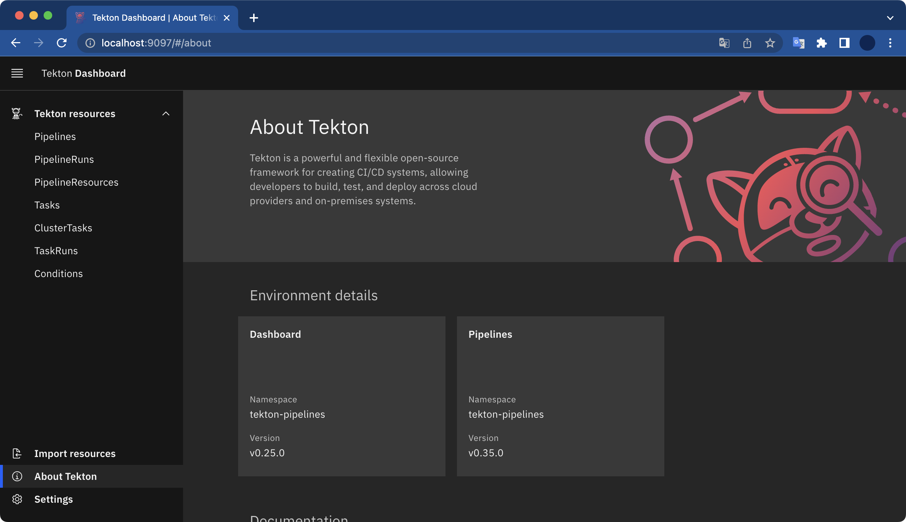

## 개요

minikube를 통해 Tekton Pipeline과 Tekton Dashboard를 설치하고 데모를 구성해본다.  

&nbsp;

## 환경

- **OS**: macOS Monterey 12.3.1
- **Shell**: zsh
- **minikube v1.25.2**
- **Homebrew 3.4.9**

&nbsp;

## 전제조건

- minikube가 미리 설치되어 있어야 한다.

&nbsp;

## 시작하기

### 1. Task 데모

미니큐브 클러스터를 생성한다.

```bash
$ minikube start
😄  Darwin 12.3.1 (arm64) 의 minikube v1.25.2
✨  자동적으로 docker 드라이버가 선택되었습니다
👍  minikube 클러스터의 minikube 컨트롤 플레인 노드를 시작하는 중
🚜  베이스 이미지를 다운받는 중 ...
💾  쿠버네티스 v1.23.3 을 다운로드 중 ...
    > preloaded-images-k8s-v17-v1...: 419.07 MiB / 419.07 MiB  100.00% 2.37 MiB
    > gcr.io/k8s-minikube/kicbase: 343.12 MiB / 343.12 MiB  100.00% 1.87 MiB p/
🔥  Creating docker container (CPUs=2, Memory=1988MB) ...
🐳  쿠버네티스 v1.23.3 을 Docker 20.10.12 런타임으로 설치하는 중
    ▪ kubelet.housekeeping-interval=5m
    ▪ 인증서 및 키를 생성하는 중 ...
    ▪ 컨트롤 플레인이 부팅...
    ▪ RBAC 규칙을 구성하는 중 ...
🔎  Kubernetes 구성 요소를 확인...
    ▪ Using image gcr.io/k8s-minikube/storage-provisioner:v5
🌟  애드온 활성화 : storage-provisioner, default-storageclass
🏄  끝났습니다! kubectl이 "minikube" 클러스터와 "default" 네임스페이스를 기본적으로 사용하도록 구성되었습니다.
```

&nbsp;

kubectl을 사용하여 클러스터가 성공적으로 생성되었는지 확인할 수 있다.

```bash
$ kubectl cluster-info
Kubernetes control plane is running at https://127.0.0.1:57074
CoreDNS is running at https://127.0.0.1:57074/api/v1/namespaces/kube-system/services/kube-dns:dns/proxy

To further debug and diagnose cluster problems, use 'kubectl cluster-info dump'.
```

&nbsp;

tekton pipeline을 설치한다.

```bash
$ kubectl apply --filename \
https://storage.googleapis.com/tekton-releases/pipeline/latest/release.yaml
```

```bash
$ kubectl get pod -n tekton-pipelines
NAME                                           READY   STATUS    RESTARTS   AGE
tekton-pipelines-controller-55487dcfb8-vww2f   1/1     Running   0          31s
tekton-pipelines-webhook-794864555f-g9fnm      1/1     Running   0          31s
```

&nbsp;

`hello-world.yaml` 파일을 아래와 같이 작성한다.
```bash
apiVersion: tekton.dev/v1beta1
kind: Task
metadata:
  name: hello
spec:
  steps:
    - name: echo
      image: alpine
      script: |
        #!/bin/sh
        echo "Hello World"
```

&nbsp;

작성한 `hello-world.yaml` 파일을 배포한다.

```bash
$ kubectl apply -f hello-world.yaml
task.tekton.dev/hello created
```

&nbsp;

`True`, `Succeeded`는 Task가 정상적으로 완료되었다는 의미이다.

```bash
$ kubectl get taskrun hello-task-run
NAME             SUCCEEDED   REASON      STARTTIME   COMPLETIONTIME
hello-task-run   True        Succeeded   29s         5s
```

&nbsp;

실행된 Task의 결과(로그)를 확인해본다.

```bash
$ kubectl logs --selector=tekton.dev/taskRun=hello-task-run
Hello World
```

실행한 Task 로그에 `Hello World`가 출력됐다.  
Task가 정상 실행된 걸 확인할 수 있다.

&nbsp;

### 2. Pipeline 데모

**두 번째 테스크 생성하고 실행하기**  
Hello World Task가 이미 있다. 이제 두 번째 Task인 Goodbye World를 만들어본다.  
파일명은 `goodbye-world.yaml` 이다.

```yaml
apiVersion: tekton.dev/v1beta1
kind: Task
metadata:
  name: goodbye
spec:
  steps:
    - name: goodbye
      image: ubuntu
      script: |
        #!/bin/bash
        echo "Goodbye World!"
```

&nbsp;

작성한 `goodbye-world.yaml` 파일을 배포한다.

```bash
$ kubectl apply --filename goodbye-world.yaml
task.tekton.dev/goodbye created
```

&nbsp;

**Pipeline 생성**  
`hello-goodbye-pipeline.yaml` 파일을 작성한다.

```yaml
apiVersion: tekton.dev/v1beta1
kind: Pipeline
metadata:
  name: hello-goodbye
spec:
  tasks:
    - name: hello
      taskRef:
        name: hello
    - name: goodbye
      runAfter:
        - hello
      taskRef:
        name: goodbye
```

&nbsp;

작성한 파일을 배포한다.

```bash
$ kubectl apply --filename hello-goodbye-pipeline.yaml
```

&nbsp;

PipelineRun 개체로 파이프라인을 인스턴스화한다.  
`hello-goodbye-pipeline-run.yaml`이라는 새 파일을 아래와 같이 작성한다.

```yaml
apiVersion: tekton.dev/v1beta1
kind: PipelineRun
metadata:
  name: hello-goodbye-run
spec:
  pipelineRef:
    name: hello-goodbye
```

&nbsp;

작성한 파일을 배포한다.

```bash
$ kubectl apply --filename hello-goodbye-pipeline-run.yaml
pipelinerun.tekton.dev/hello-goodbye-run created
```

&nbsp;

Tekton CLI를 사용해서 `hello-goodbye-run` Pipelien Run의 로그를 확인한다.

```bash
$ tkn pipelinerun logs hello-goodbye-run -f -n default
```

#### tektoncd-cli 설치

참고로 `tkn` 명령어를 사용하려면 tektoncd-cli 설치가 필요하다.  
`brew` 명령어로 `tektoncd-cli`를 설치할 수 있다.

```bash
$ brew install tektoncd-cli
```

실행된 파이프라인 로그에서 hello task와 goodbye task가 모두 정상 실행된 결과를 확인할 수 있다.

```bash
$ tkn pipelinerun logs hello-goodbye-run -f -n default
[hello : echo] Hello World

[goodbye : goodbye] Goodbye World!

```

&nbsp;

### 3. Tekton Dashboard 설치

Tekton Dashboard는 Tekton을 관리하기 편하게 해주는 Web UI이다.  

&nbsp;

최신 버전의 Tekton Dashboard를 설치하려면 아래 명령어를 실행한다.

```bash
$ kubectl apply --filename https://github.com/tektoncd/dashboard/releases/latest/download/tekton-dashboard-release.yaml
```

&nbsp;

`tekton-dashboard-xxx` Pod가 새로 생성된 걸 확인할 수 있다.

```bash
$ kubectl get pods --namespace tekton-pipelines
NAME                                           READY   STATUS    RESTARTS   AGE
tekton-dashboard-6c66f85968-f42h5              1/1     Running   0          34s
tekton-pipelines-controller-55487dcfb8-vww2f   1/1     Running   0          8m21s
tekton-pipelines-webhook-794864555f-g9fnm      1/1     Running   0          8m21s
```

&nbsp;

Tekton Dashboard에 접속하기 위해 포트를 설정한다.

```bash
$ kubectl proxy --port=8080
```

&nbsp;

그 다음 웹 브라우저에서 아래 주소를 입력해 Tekton Dashboard로 접속 가능하다.

```
http://localhost:8080/api/v1/namespaces/tekton-pipelines/services/tekton-dashboard:http/proxy/#/clustertasks
```

또는 이 방법도 가능하다.

```bash
$ kubectl --namespace tekton-pipelines port-forward svc/tekton-dashboard 9097:9097
```

&nbsp;

위 명령어가 실행된 후 웹 브라우저를 열고 <http://localhost:9097>로 접속하면 Tekton Dashboard 화면이 나타난다.



끝!

&nbsp;

## 참고자료

[Tekton 공식문서](https://tekton.dev/docs/getting-started/tasks/)