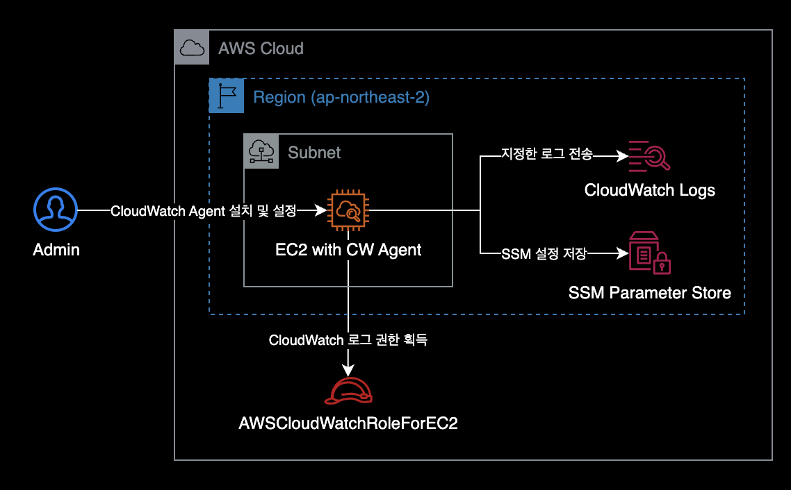

## 개요

EC2 Instance에 CloudWatch Agent를 설치하고 모니터링, 로그 수집, System Manager의 parameter store에 CloudAgent 설정파일을 저장하는 방법을 소개합니다.

&nbsp;

## 배경지식

### CloudWatch Agent의 설치 중요성

EC2 인스턴스에 CloudWatch Agent를 설치하면, 더 많은 시스템 메트릭들을 수집할 수 있습니다. 기본적으로 Cloudwatch에서는 메모리나 디스크 사용률에 대해서 알려주지 않기 때문에 EC2의 메모리 사용률 또는 디스크 사용률에 대해서 알고 싶다면, 관련 메트릭을 수집해주는 에이전트인 CloudWatch Agent를 설치해야합니다.

대표적으로 아래와 같은 메트릭들이 추가로 수집됩니다.

- **메모리 사용률** (`mem_used_percent`)
- **스왑 메모리 사용률** (`swap_used_percent`)
- **디스크 사용률** (`disk_used_percent`) : 각 파일시스템 단위로도 조회 가능합니다.

CloudWatch Agent가 수집하는 전체 메트릭은 AWS 공식문서의 [Linux 및 macOS 인스턴스의 CloudWatch 에이전트가 수집하는 지표](https://docs.aws.amazon.com/ko_kr/AmazonCloudWatch/latest/monitoring/metrics-collected-by-CloudWatch-agent.html#linux-metrics-enabled-by-CloudWatch-agent) 페이지를 참고합니다.

EC2 인스턴스에 Cloudwatch Agent를 설치하고 어떠한 메트릭을 수집할지 정한 후, CloudWatch Agent를 실행시키면 됩니다.

&nbsp;

## 환경

### 시스템 구성도

EC2 인스턴스가 CloudWatch Logs로 로그를 보내는 시스템 구성은 다음과 같습니다.



동작방식은 EC2 인스턴스가 OS에 설치된 CloudWatch Agent와 Instance Profile의 권한을 사용해 CloudWatch Logs로 로그를 보냅니다.

&nbsp;

### EC2 Instance

> **⚠️ 지원종료 예정** : Amazon Linux 2의 [지원 종료 날짜(EOL)는 2025년 6월 30일](https://aws.amazon.com/ko/amazon-linux-2/faqs/)입니다. Amazon Linux 2 대신 Amazon Linux 2023을 사용하는 걸 권장드립니다.
- **Type** : t2.micro (x86_64)
- **OS** : Amazon Linux release 2 (Karoo)
- **Shell** : bash
- **ID** : ec2-user

&nbsp;

## 준비사항

- EC2 Instance가 생성된 상태

&nbsp;

## 설정방법

### IAM 설정

생성한 EC2 Instance에 CloudWatch Agent를 사용하기 위한 IAM 권한을 부여합니다.


&nbsp;

EC2 Instance에 붙힐 Role을 새로 만듭니다.

- **Role 이름** : AWSCloudWatchRoleForEC2


&nbsp;

모니터링할 대상(EC2 Instance)에 CloudWatch Agent 관련 권한 2개가 부여되어 있어야 모니터링이 가능합니다.  


**Role에 추가가 필요한 IAM Policy 2개**  
Parameter store에 CloudWatch agent 설정상태를 저장하기 위해 IAM 권한이 필요합니다.

- CloudWatchAgentServerPolicy
- CloudWatchAgentAdminPolicy : `ssm:PutParameter` Action 때문에 필요합니다.

이 모든 구성을 끝내고 가장 중요한 작업은 EC2 인스턴스에 우리가 구성한 IAM Role을 붙이는(권한을 부여하는) 것입니다.

&nbsp;

### 테스트용 Apache(httpd) 설치

CloudWatch Agent를 설치할 EC2 인스턴스에 SSH 또는 SSM Session Manager를 사용해 원격 로그인합니다.

CloudWatch Log 수집을 테스트하기 위한 목적으로 EC2 인스턴스에 Apache<sup>httpd</sup>를 설치합니다.

```bash
Last login: Thu Jan 13 13:11:39 2022 from 117.111.22.231

       __|  __|_  )
       _|  (     /   Amazon Linux 2 AMI
      ___|\___|___|

https://aws.amazon.com/amazon-linux-2/
[ec2-user@ip-xxx-xx-xx-xxx ~]$
```

&nbsp;

```bash
$ sudo su
$ id
uid=0(root) gid=0(root) groups=0(root)
```

ec2-user에서 root 계정으로 변경합니다.  

Apache 설치 작업 과정에서는 root 권한을 얻는게 중요합니다.  

&nbsp;

패키지 관리자 `yum`을 사용해서 `httpd` 패키지를 설치합니다.  

```bash
$ yum install -y httpd
...
Installed:
  httpd.x86_64 0:2.4.51-1.amzn2

Dependency Installed:
  apr.x86_64 0:1.7.0-9.amzn2
  apr-util.x86_64 0:1.6.1-5.amzn2.0.2
  apr-util-bdb.x86_64 0:1.6.1-5.amzn2.0.2
  generic-logos-httpd.noarch 0:18.0.0-4.amzn2
  httpd-filesystem.noarch 0:2.4.51-1.amzn2
  httpd-tools.x86_64 0:2.4.51-1.amzn2
  mailcap.noarch 0:2.1.41-2.amzn2
  mod_http2.x86_64 0:1.15.19-1.amzn2.0.1

Complete!
```

정상적으로 httpd 패키지를 설치했습니다.  

&nbsp;

```bash
$ yum list installed httpd
Loaded plugins: extras_suggestions, langpacks, priorities, update-motd
Installed Packages
httpd.x86_64                                                     2.4.51-1.amzn2                                                     @amzn2-core
```

현재 인스턴스에 `httpd 2.4.51` 버전이 설치된 상태입니다.

&nbsp;

테스트하기 위한 기본 메인페이지를 생성합니다.

```bash
$ echo "Hello world from $(hostname -f)" > /var/www/html/index.html
```

&nbsp;

httpd 데몬을 실행한 후 상태를 확인합니다.

```bash
$ systemctl start httpd
$ systemctl status httpd
```

```bash
$ exit
$ whoami
ec2-user
```

httpd 메인 페이지 생성 및 데몬 실행이 끝난 후에는 `exit` 명령어로 ec2-user 계정으로 다시 돌아옵니다.

&nbsp;

### CloudWatch Agent 설치

EC2 인스턴스에 CloudWatch Agent 설치하는 방법에는 크게 2가지가 있습니다.

- 직접 다운로드 후 설치
- 패키지 관리자 yum을 이용한 설치

이 가이드에서는 2가지 방법 모두 알려드리겠습니다.

&nbsp;

#### 방법 1: 직접 설치

AWS에서 제공하는 CloudWatch Agent의 설치파일용 S3 경로를 통해 직접 패키지 파일을 받아온 후 `rpm`으로 설치하는 방법입니다.

되도록이면 이후 소개드릴 방법2가 더 간단하므로 방법2를 추천합니다.

```bash
$ wget https://s3.amazonaws.com/amazoncloudwatch-agent/amazon_linux/amd64/latest/amazon-cloudwatch-agent.rpm
--2022-01-13 13:22:09--  https://s3.amazonaws.com/amazoncloudwatch-agent/amazon_linux/amd64/latest/amazon-cloudwatch-agent.rpm
Resolving s3.amazonaws.com (s3.amazonaws.com)... 52.216.104.13
Connecting to s3.amazonaws.com (s3.amazonaws.com)|52.216.104.13|:443... connected.
HTTP request sent, awaiting response... 200 OK
Length: 46891760 (45M) [application/octet-stream]
Saving to: ‘amazon-cloudwatch-agent.rpm’

100%[======================================>] 46,891,760  3.79MB/s   in 14s

2022-01-13 13:22:24 (3.23 MB/s) - ‘amazon-cloudwatch-agent.rpm’ saved [46891760/46891760]
```

&nbsp;

45MB 크기의 CloudWatch 패키지 파일을 다운로드 받았습니다.

```bash
$ ls -lh
total 45M
-rw-rw-r-- 1 ec2-user ec2-user 45M Aug  5 01:07 amazon-cloudwatch-agent.rpm
```

&nbsp;

rpm 패키지 파일을 설치합니다.

```bash
$ sudo rpm -U ./amazon-cloudwatch-agent.rpm
create group cwagent, result: 0
create user cwagent, result: 0
```

&nbsp;

#### 방법 2: yum 설치

방법 2는 방법 1보다 더 간단하므로 이 방법을 통해 설치하는 걸 권장합니다.

패키지 관리자인 `yum`을 사용해서 CloudWatch Agent 설치파일을 다운로드 받는 동시에 설치합니다.

```bash
$ sudo yum install amazon-cloudwatch-agent -y
```

```bash
Loaded plugins: extras_suggestions, langpacks, priorities, update-motd
amzn2-core                                                                          | 3.7 kB  00:00:00
amzn2extra-docker                                                                   | 3.0 kB  00:00:00
amzn2extra-kernel-5.10                                                              | 3.0 kB  00:00:00
amzn2extra-redis6                                                                   | 3.0 kB  00:00:00
nginx                                                                               | 2.9 kB  00:00:00
...

Dependencies Resolved

===========================================================================================================
 Package                         Arch           Version                           Repository          Size
===========================================================================================================
Installing:
 amazon-cloudwatch-agent         x86_64         1.247354.0b251981-1.amzn2         amzn2-core          45 M

Transaction Summary
===========================================================================================================
Install  1 Package

...
Running transaction
create group cwagent, result: 0
create user cwagent, result: 0
create user aoc, result: 6
  Installing : amazon-cloudwatch-agent-1.247354.0b251981-1.amzn2.x86_64                                1/1
  Verifying  : amazon-cloudwatch-agent-1.247354.0b251981-1.amzn2.x86_64                                1/1

Installed:
  amazon-cloudwatch-agent.x86_64 0:1.247354.0b251981-1.amzn2

Complete!
```

명령어 한 줄로 CloudWatch Agent 설치를 완료했습니다.

&nbsp;

CloudWatch Agent 설치 마법사를 이용하면 간단하게 CloudWatch Agent를 초기 설정할 수 있습니다.

```bash
$ sudo /opt/aws/amazon-cloudwatch-agent/bin/amazon-cloudwatch-agent-config-wizard
=============================================================
= Welcome to the AWS CloudWatch Agent Configuration Manager =
=============================================================
On which OS are you planning to use the agent?
1. linux
2. windows
3. darwin
default choice: [1]:
1
...
```

보통 기본값일 경우, Enter 키를 입력해서 다음 단계로 계속 넘어갑니다.

CloudWatch Agent 초기 설정 단계를 넘기다보면 로그 모니터링 쪽 설정 단계가 나옵니다.

&nbsp;

### 로그 모니터링 설정

CloudWatch Agent가 `/var/log/httpd/access_log` 와 `/var/log/httpd/error_log`를 수집하도록 설정합니다.

&nbsp;

#### access_log 수집 설정

access_log의 절대경로는 `/var/log/httpd/access_log` 이다.  

로그 파일의 절대경로<sup>Log file path</sup>를 입력할 때 오타에 주의합니다.

```bash
...
Do you want to monitor any log files?
1. yes
2. no
default choice: [1]:
1
Log file path:
/var/log/httpd/access_log
Log group name:
default choice: [access_log]

Log stream name:
default choice: [{instance_id}]
```

&nbsp;

#### error_log 수집 설정

error_log의 절대경로는 `/var/log/httpd/error_log` 입니다.

```bash
...
Do you want to specify any additional log files to monitor?
1. yes
2. no
default choice: [1]:
1
Log file path:
/var/log/httpd/error_log
Log group name:
default choice: [error_log]

Log stream name:
default choice: [{instance_id}]

Do you want to specify any additional log files to monitor?
1. yes
2. no
default choice: [1]:
2
Saved config file to /opt/aws/amazon-cloudwatch-agent/bin/config.json successfully.
```

마지막에는 CloudWatch Agent의 설정파일 경로를 알려줍니다.

&nbsp;

```bash
Please check the above content of the config.
The config file is also located at /opt/aws/amazon-cloudwatch-agent/bin/config.json.
Edit it manually if needed.
```

CloudAgent 설정파일의 경로인 `/opt/aws/amazon-cloudwatch-agent/bin/config.json` 를 확인하라고 안내하고 있습니다.

&nbsp;

실제로 해당 경로에 위치한 CloudWatch Agent 설정파일을 확인합니다.

```bash
$ cat /opt/aws/amazon-cloudwatch-agent/bin/config.json
{
    "agent": {
        "metrics_collection_interval": 60,
        "run_as_user": "root"
    },
    "logs": {
        "logs_collected": {
            "files": {
                "collect_list": [
                    {
                        "file_path": "/var/log/httpd/access_log",
                        "log_group_name": "access_log",
                        "log_stream_name": "{instance_id}"
                    },
                    {
                        "file_path": "/var/log/httpd/error_log",
                        "log_group_name": "error_log",
                        "log_stream_name": "{instance_id}"
                    }
                ]
            }
        }
    },
    "metrics": {
        "append_dimensions": {
            "AutoScalingGroupName": "${aws:AutoScalingGroupName}",
            "ImageId": "${aws:ImageId}",
            "InstanceId": "${aws:InstanceId}",
            "InstanceType": "${aws:InstanceType}"
        },
        "metrics_collected": {
            "collectd": {
                "metrics_aggregation_interval": 60
            },
            "disk": {
                "measurement": [
                    "used_percent"
                ],
                "metrics_collection_interval": 60,
                "resources": [
                    "*"
                ]
            },
            "mem": {
                "measurement": [
                    "mem_used_percent"
                ],
                "metrics_collection_interval": 60
            },
            "statsd": {
                "metrics_aggregation_interval": 60,
                "metrics_collection_interval": 10,
                "service_address": ":8125"
            }
        }
    }
}
```

&nbsp;

### CloudWatch Agent 실행

`ssm:AmazonCloudWatch-linux` 는 Parameter Store의 기본<sup>default</sup> 이름입니다.  
ssm은 AWS System Manager의 줄임말입니다.

&nbsp;

#### 명령어 설명

```bash
$ sudo /opt/aws/amazon-cloudwatch-agent/bin/amazon-cloudwatch-agent-ctl \
    -a fetch-config \
    -m ec2 \
    -c ssm:AmazonCloudWatch-linux \
    -s
```

- `-a fetch-config` : 에이전트가 최신 버전의 CloudWatch 에이전트 구성 파일을 로드합니다.
- `-c ssm:AmazonCloudWatch-linux` : CloudAgent 구성 파일은 AWS System Manager<sup>ssm</sup>의 AmazonCloudWatch-linux 라는 이름의 파라미터 스토어에서 가져옵니다.
- `-s` : 에이전트 설정이 끝난 후 CloudWatch 에이전트를 재시작합니다.

&nbsp;

#### 명령어 실행결과

```bash
$ sudo /opt/aws/amazon-cloudwatch-agent/bin/amazon-cloudwatch-agent-ctl \
    -a fetch-config \
    -m ec2 \
    -c ssm:AmazonCloudWatch-linux \
    -s
```

```bash
****** processing amazon-cloudwatch-agent ******
/opt/aws/amazon-cloudwatch-agent/bin/config-downloader --output-dir /opt/aws/amazon-cloudwatch-agent/etc/amazon-cloudwatch-agent.d --download-source ssm:AmazonCloudWatch-linux --mode ec2 --config /opt/aws/amazon-cloudwatch-agent/etc/common-config.toml --multi-config default
Region: ap-northeast-2
credsConfig: map[]
Successfully fetched the config and saved in /opt/aws/amazon-cloudwatch-agent/etc/amazon-cloudwatch-agent.d/ssm_AmazonCloudWatch-linux.tmp
Start configuration validation...
/opt/aws/amazon-cloudwatch-agent/bin/config-translator --input /opt/aws/amazon-cloudwatch-agent/etc/amazon-cloudwatch-agent.json --input-dir /opt/aws/amazon-cloudwatch-agent/etc/amazon-cloudwatch-agent.d --output /opt/aws/amazon-cloudwatch-agent/etc/amazon-cloudwatch-agent.toml --mode ec2 --config /opt/aws/amazon-cloudwatch-agent/etc/common-config.toml --multi-config default
2022/01/13 03:16:55 Reading json config file path: /opt/aws/amazon-cloudwatch-agent/etc/amazon-cloudwatch-agent.d/ssm_AmazonCloudWatch-linux.tmp ...
Valid Json input schema.
I! Detecting run_as_user...
No csm configuration found.
Configuration validation first phase succeeded
/opt/aws/amazon-cloudwatch-agent/bin/amazon-cloudwatch-agent -schematest -config /opt/aws/amazon-cloudwatch-agent/etc/amazon-cloudwatch-agent.toml
Configuration validation second phase failed
======== Error Log ========
2022-01-13T03:16:55Z E! [telegraf] Error running agent: Error parsing /opt/aws/amazon-cloudwatch-agent/etc/amazon-cloudwatch-agent.toml, open /usr/share/collectd/types.db: no such file or directory
```

에러 로그가 출력되면서 CloudWatch Agent 실행이 실패했습니다.

&nbsp;

에러 로그 내용을 좀 더 살펴봅니다.

```bash
======== Error Log ========
2022-01-13T03:16:55Z E! [telegraf] Error running agent: Error parsing /opt/aws/amazon-cloudwatch-agent/etc/amazon-cloudwatch-agent.toml, open /usr/share/collectd/types.db: no such file or directory
```

마지막 라인에서 `/usr/share/collectd/types.db: no such file or directory` 에러가 발생했습니다.  
에러 로그의 내용처럼 `types.db` 파일이 `/usr/share/collectd/`에 실제로 존재하는 지 체크할 필요가 있습니다.

&nbsp;

```bash
$ ls -l /usr/share/collectd/types.db
ls: cannot access /usr/share/collectd/types.db: No such file or directory
```

확인해보니 해당 경로에 `types.db` 파일이 존재하지 않아서 발생하는 에러입니다.

&nbsp;

이 문제를 해결하기 위해 `/usr/share/collectd/` 경로에 `types.db` 파일을 새로 생성합니다.

```bash
$ sudo mkdir -p /usr/share/collectd/
```

- `-p` : 중간에 디렉토리가 없으면 해당 상위 디렉토리도 같이 생성하는 옵션

&nbsp;

```bash
$ sudo touch /usr/share/collectd/types.db
```

`types.db` 파일도 생성합니다.

&nbsp;

`types.db` 파일을 생성한 후 CloudWatch Agent를 다시 실행합니다.

```bash
$ sudo /opt/aws/amazon-cloudwatch-agent/bin/amazon-cloudwatch-agent-ctl \
    -a fetch-config \
    -m ec2 \
    -c ssm:AmazonCloudWatch-linux \
    -s
```

```bash
****** processing amazon-cloudwatch-agent ******
/opt/aws/amazon-cloudwatch-agent/bin/config-downloader --output-dir /opt/aws/amazon-cloudwatch-agent/etc/amazon-cloudwatch-agent.d --download-source ssm:AmazonCloudWatch-linux --mode ec2 --config /opt/aws/amazon-cloudwatch-agent/etc/common-config.toml --multi-config default
Region: ap-northeast-2
credsConfig: map[]
Successfully fetched the config and saved in /opt/aws/amazon-cloudwatch-agent/etc/amazon-cloudwatch-agent.d/ssm_AmazonCloudWatch-linux.tmp
Start configuration validation...
/opt/aws/amazon-cloudwatch-agent/bin/config-translator --input /opt/aws/amazon-cloudwatch-agent/etc/amazon-cloudwatch-agent.json --input-dir /opt/aws/amazon-cloudwatch-agent/etc/amazon-cloudwatch-agent.d --output /opt/aws/amazon-cloudwatch-agent/etc/amazon-cloudwatch-agent.toml --mode ec2 --config /opt/aws/amazon-cloudwatch-agent/etc/common-config.toml --multi-config default
2022/01/13 03:19:19 Reading json config file path: /opt/aws/amazon-cloudwatch-agent/etc/amazon-cloudwatch-agent.d/ssm_AmazonCloudWatch-linux.tmp ...
Valid Json input schema.
I! Detecting run_as_user...
No csm configuration found.
Configuration validation first phase succeeded
/opt/aws/amazon-cloudwatch-agent/bin/amazon-cloudwatch-agent -schematest -config /opt/aws/amazon-cloudwatch-agent/etc/amazon-cloudwatch-agent.toml
Configuration validation second phase succeeded
Configuration validation succeeded
amazon-cloudwatch-agent has already been stopped
Created symlink from /etc/systemd/system/multi-user.target.wants/amazon-cloudwatch-agent.service to /etc/systemd/system/amazon-cloudwatch-agent.service.
Redirecting to /bin/systemctl restart amazon-cloudwatch-agent.service
```

`types.db` 파일을 생성한 뒤부터 정상적으로 CloudWatch Agent가 실행됩니다.

&nbsp;

CloudWatch Agent의 현재 상태를 확인합니다.

`systemctl`과 `amazon-cloudwatch-agent-ctl` 명령어 모두 지원합니다.

```bash
systemctl status amazon-cloudwatch-agent
```

```bash
sudo /opt/aws/amazon-cloudwatch-agent/bin/amazon-cloudwatch-agent-ctl \
  -a status \
  -m ec2
```

```bash
{
  "status": "running",
  "starttime": "2022-01-13T13:34:11+0000",
  "configstatus": "configured",
  "cwoc_status": "stopped",
  "cwoc_starttime": "",
  "cwoc_configstatus": "not configured",
  "version": "1.247349.0b251399"
}
```

AWS CloudWatch Agent가 정상적으로 실행중(`running`)이며, 에이전트가 설정된 상태(`configured`)입니다.

&nbsp;

### 로그 수집 결과 확인

이제 AWS Console로 이동합니다. CloudWatch → Logs → Log group 메뉴로 접속합니다.


EC2 인스턴스에 설치된 CloudWatch Agent가 로컬 로그파일인 `access_log`와 `error_log`를 CloudWatch Logs로 성공적으로 보냈습니다.

&nbsp;

OS상의 로그와 동일한 내용으로 로그가 잘 전송된 걸 확인할 수 있습니다.


&nbsp;

결과적으로 EC2 인스턴스는 다음과 같은 동작순서로 CloudWatch Logs에 로그를 보내게 됩니다.


&nbsp;

이상으로 CloudWatch Agent 설치 및 구성 가이드를 마칩니다.

&nbsp;

## 더 나아가서

### cloudwatch-agent-cli 치트시트

<details>
<summary>명령어 모음</summary>

EC2에 설치된 CloudWatch Agent를 관리할 때 자주 사용하는 명령어들은 정리해놓았습니다.

```bash
# CloudWatch Agent 설치 마법사 실행
$ sudo /opt/aws/amazon-cloudwatch-agent/bin/amazon-cloudwatch-agent-config-wizard
```

&nbsp;

```bash
# CloudWatch Agent 상태 확인 1 (CLI)
$ sudo /opt/aws/amazon-cloudwatch-agent/bin/amazon-cloudwatch-agent-ctl \
    -m ec2 \
    -a status
```

&nbsp;

```bash
# CloudWatch Agent 상태 확인 2 (systemctl)
$ systemctl status amazon-cloudwatch-agent
```

&nbsp;

```bash
# CloudWatch Agent 시작
$ sudo /opt/aws/amazon-cloudwatch-agent/bin/amazon-cloudwatch-agent-ctl \
    -m ec2 \
    -a fetch-config \
    -c ssm:AmazonCloudWatch-linux \
    -s
```

`-c ssm:<SSM_PARAMETER_STORE_NAME>` 옵션에서 `<SSM_PARAMETER_SOTRE_NAME>` 값은 자신의 환경에 맞게 바꿔서 실행합니다.

&nbsp;

```bash
# CloudWatch Agent 중지
$ sudo /opt/aws/amazon-cloudwatch-agent/bin/amazon-cloudwatch-agent-ctl \
    -m ec2 \
    -a stop
```

</details>

&nbsp;

## 결론

이 포스팅은 CloudWatch Agent의 **수동** 설치를 다룹니다.

수동 설치 방식은 Cloud Native의 핵심 가치인 자동화<sup>Automation</sup>와는 거리가 좀 있습니다.

만약 CloudWatch Agent를 설치해야할 EC2 인스턴스가 200대라면, 200대 각각 들어가서 CloudWatch Agent를 설치하는건 비효율적이고(사람을 갈아넣으면 뭐든 가능하겠지만) 인적 실수<sup>Human fault</sup>를 유발할 확률이 높은 방식입니다.

조만간 자동설치 관련해서 직접 글을 쓸 예정입니다.

CloudWatch Agent 자동 설치 방법이 궁금하다면 OpsNow Techblog의 [CloudWatch 에이전트를 손쉽게 설치하는 방법 – OpsNow Tech Blog](https://blog.opsnow.com/29) 포스팅을 참고하면 좋습니다.
