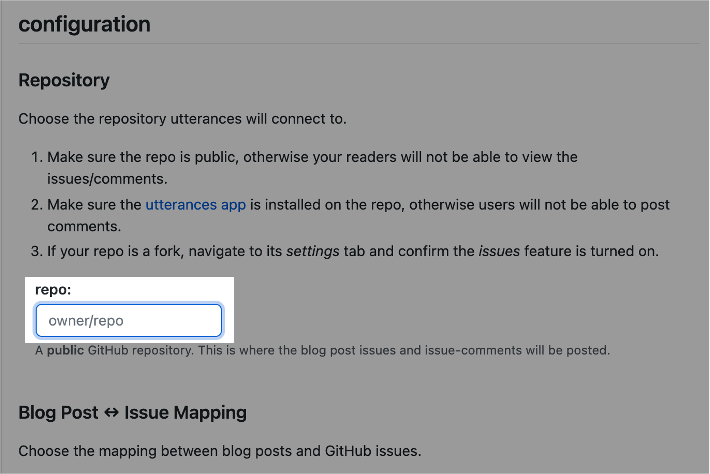
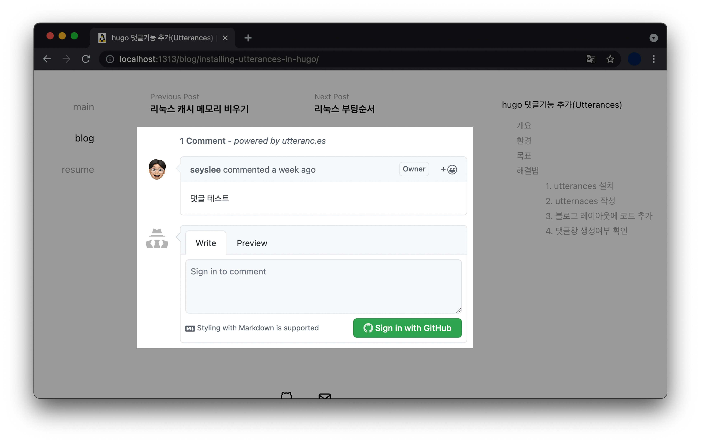

## 개요

Hugo-theme-codex 테마를 사용하는 블로그에서 댓글 플러그인인 utterances 기능 추가하는 방법을 설명한다.  

사실 언젠간 해야지 하면서 계속 미루고 있던 블로그 유지보수를 할로윈 기념으로 실시하게 되었다.  

TIL(Today I Learned) 포스트는 꾸준히 작성하고 있는데, 정작 블로그 유지보수는 미루고 있었다.

&nbsp;

## 환경

- **하드웨어** : Apple / MacBook Pro (13", M1, 2020)
- **사이트 정적 생성기** : hugo v0.88.1

```bash
$ hugo version
hugo v0.88.1+extended darwin/arm64 BuildDate=unknown
```

- **테마** : hugo-theme-codex v1.6.0

```bash
$ git submodule
-f568a96d9b35bfa63c5e5f7feb7e799f7c995cb4 public
 9e911e331c90fcd56ae5d01ae5ecb2fa06ba55da themes/hugo-theme-codex (v1.6.0)
```

- **댓글 플러그인** : Utterances

&nbsp;

## 목표

블로그 레이아웃에 Utterances 플러그인을 추가해 댓글(Comment) 기능을 구현한다.

&nbsp;

## 해결법

### 1. utterances 설치

블로그 레포지터리(repo)에 Utterances 앱을 설치한다.  

Utterances를 사용하면 댓글 기능을 구현하는 데 드는 시간은 10분이면 충분하다. 그만큼 간단하기 때문이다.

> 블로그 레포지터리의 공개 상태는 **Public**으로 설정되어 있어야만 Utterances 플러그인을 사용 가능하다.

- [utterances 설치 홈페이지](https://github.com/apps/utterances)에 접속한 후 본인의 깃허브 계정으로 로그인한다.

- 이후 우측에 초록색 Install 버튼 클릭

- Only select repositories → 블로그 repo 선택 (내 경우는 seyslee/blog)

&nbsp;

### 2. utternaces 작성

#### A) repo

[utterances 공식 홈페이지](https://utteranc.es)에 접속한다. 중간에 configuration 이후 'repo:' 값이 있다.



이 값에 **소유자와 레포지터리 이름**을 입력한다. 예를 들어 나같은 경우는 다음과 같이 작성했다.

```bash
repo:
seyslee/blog
```

&nbsp;

#### B) Blog Post ↔️ Issue Mapping

블로그 글과 Issue를 어떻게 Mapping 할 것인지 정하는 설정이다.  

기본값인 `Issue title contains page pathname`로 선택한다.

&nbsp;

#### C) Issue Label

`blog-comment` 로 입력. 아무 입력 없으면 기본값인 `Comment`로 설정된다.  

Issue Label은 옵션값(Optional)이기 때문에 Default 값인 `Comment`를 사용해도 블로그 서비스에는 전혀 지장없다.

&nbsp;

#### D) Theme

댓글창 테마는 각자 원하는 걸로 선택하면 된다.  

내 블로그 테마인 hugo-theme-codex는 흰색 계열이기 때문에 같은 색상에 맞춰 기본값인 `GitHub Light`로 선택했다.

&nbsp;

#### E) Enable Utterances

repo 정보, 블로그 포스트와 이슈간 맵핑 방식, 이슈 라벨, 테마를 선정했다면 최종적으로 Utterances 플러그인의 코드가 자동 완성된다.

```javascript
<script src="https://utteranc.es/client.js"
        repo="seyslee/blog"
        issue-term="pathname"
        label="blog-comment"
        theme="github-light"
        crossorigin="anonymous"
        async>
</script>
```

Utterances 생성시 입력한 값이 사용자마다 각각 다르기 때문에, 위 코드는 내 경우에만 해당되니 참고만 하자.  

이제 블로그 포스트 레이아웃 파일(`.html`)의 적절한 위치에 Utterances 코드를 붙여넣는 작업만 하면 끝난다.

&nbsp;

### 3. 블로그 레이아웃에 코드 추가

> 블로그 테마마다 레이아웃 파일의 경로나 구조가 다르다. 해당 글은 현재 저자가 사용중인 테마인 **hugo-theme-codex** 기준으로 설명하고 있기 때문에 만약 다른 블로그 테마를 사용중이라면 도움이 안될 수도 있다.

&nbsp;

**작업경로**

```bash
blog (/)                    # seyslee/blog
└─ themes
   └─ hugo-theme-codex
      └─ layouts
         └─ _default
            └─ single.html  # 작업대상! 개별 포스트에 대한 레이아웃 파일.
```

hugo-theme-codex 테마의 경우 개별 포스트에 대한 레이아웃은 `single.html` 파일에 선언되어 있다.  

모든 포스트에 댓글 기능을 일괄 적용하려면 `single.html` 파일을 열어서 Utterances 코드를 붙여넣으면 된다.

&nbsp;

**변경전 `single.html`**

```html
{{ define "styles" }}
    {{ $.Scratch.Set "style_opts" (dict "src" "scss/pages/post.scss" "dest" "css/post.css") }}
{{ end }}

{{ define "main" }}
    {{ $dateFormat := .Site.Params.dateFormat | default "Jan 2 2006" }}

    <div class="flex-wrapper">
      <div class="post__container">
        <div class="post">
          <header class="post__header">
            <h1 id="post__title">{{.Title}}</h1>
            {{ if .Date }}<time datetime="{{ .Date }}" class="post__date">{{ .Date.Format $dateFormat }}</time> {{ end }}
          </header>
          <article class="post__content">
              {{ partial "anchored-headings.html" .Content }}
              {{ if or .Params.math .Site.Params.math }}
                  {{ partial "math.html" . }}
              {{ end }}
          </article>
          {{ partial "tags.html" .}} {{ partial "post-pagination.html" .}}
          {{ template "_internal/disqus.html" . }}
          <footer class="post__footer">
            {{ partial "social-icons.html" .}}
            <p>{{ replace .Site.Copyright "{year}" now.Year }}</p>
          </footer>
          </div>
      </div>
      {{ if .Params.toc }}
      <div class="toc-container">
          {{ if .Site.Params.showPageTitleInTOC }} <div class="toc-post-title">{{ .Title }}</div> {{ end }}
        {{ .TableOfContents }}
      </div>
      {{ end }}
    </div>
    
{{ end }} 

{{ define "scripts" }}
  {{/* Hardcode a specific prismjs version to avoid a redirect on every page load. */}}
  <script src="https://unpkg.com/prismjs@1.20.0/components/prism-core.min.js"></script>

  {{/* Automatically loads the needed languages to highlight the code blocks. */}}
  <script src="https://unpkg.com/prismjs@1.20.0/plugins/autoloader/prism-autoloader.min.js"
    data-autoloader-path="https://unpkg.com/prismjs@1.20.0/components/"></script>

  {{ if .Params.toc }}
    <script src="/js/table-of-contents.js"></script>
  {{ end }}

{{ end }}
```

중간에 `<footer> ... </footer>` 부분이 있다. 이 부분 바로 윗줄에 복사한 utterances 스크립트를 복붙한다.

```javascript
<script src="https://utteranc.es/client.js"
        repo="seyslee/blog"
        issue-term="pathname"
        label="blog-comment"
        theme="github-light"
        crossorigin="anonymous"
        async>
</script>
```

위 utterances 스크립트는 내 환경에 작성된 코드이기 때문에, 이걸 그대로 본인 블로그에 복붙하면 안된다.  

각자 Utterances 사이트에서 입력한 값을 토대로 자동 생성된 스크립트를 복사해서 붙여넣어야 한다.

&nbsp;

**변경후 `single.html`**

```html
{{ define "styles" }}
    {{ $.Scratch.Set "style_opts" (dict "src" "scss/pages/post.scss" "dest" "css/post.css") }}
{{ end }}

{{ define "main" }}
    {{ $dateFormat := .Site.Params.dateFormat | default "Jan 2 2006" }}

    <div class="flex-wrapper">
      <div class="post__container">
        <div class="post">
          <header class="post__header">
            <h1 id="post__title">{{.Title}}</h1>
            {{ if .Date }}<time datetime="{{ .Date }}" class="post__date">{{ .Date.Format $dateFormat }}</time> {{ end }}
          </header>
          <article class="post__content">
              {{ partial "anchored-headings.html" .Content }}
              {{ if or .Params.math .Site.Params.math }}
                  {{ partial "math.html" . }}
              {{ end }}
          </article>
          {{ partial "tags.html" .}} {{ partial "post-pagination.html" .}}
          {{ template "_internal/disqus.html" . }}
          <script src="https://utteranc.es/client.js"
                  repo="seyslee/blog"
                  issue-term="pathname"
                  label="blog-comment"
                  theme="github-dark"
                  crossorigin="anonymous"
                  async>
          </script>
          <footer class="post__footer">
            {{ partial "social-icons.html" .}}
            <p>{{ replace .Site.Copyright "{year}" now.Year }}</p>
          </footer>
          </div>
      </div>
      {{ if .Params.toc }}
      <div class="toc-container">
          {{ if .Site.Params.showPageTitleInTOC }} <div class="toc-post-title">{{ .Title }}</div> {{ end }}
        {{ .TableOfContents }}
      </div>
      {{ end }}
    </div>
    
{{ end }} 

{{ define "scripts" }}
  {{/* Hardcode a specific prismjs version to avoid a redirect on every page load. */}}
  <script src="https://unpkg.com/prismjs@1.20.0/components/prism-core.min.js"></script>

  {{/* Automatically loads the needed languages to highlight the code blocks. */}}
  <script src="https://unpkg.com/prismjs@1.20.0/plugins/autoloader/prism-autoloader.min.js"
    data-autoloader-path="https://unpkg.com/prismjs@1.20.0/components/"></script>

  {{ if .Params.toc }}
    <script src="/js/table-of-contents.js"></script>
  {{ end }}

{{ end }}
```

`<script> ... </script>` 부분이 추가됐다.

&nbsp;

### 4. 댓글창 생성여부 확인

`git commit` 해서 실제 블로그 환경에 적용하기 전에 먼저 localhost에서 잘 적용되었는지 확인해보자.

```bash
$ hugo server -D
Start building sites … 
hugo v0.88.1+extended darwin/arm64 BuildDate=unknown

                   | EN  
-------------------+-----
  Pages            | 65  
  Paginator pages  |  0  
  Non-page files   |  0  
  Static files     | 12  
  Processed images |  0  
  Aliases          |  0  
  Sitemaps         |  1  
  Cleaned          |  0  

Built in 37 ms
Watching for changes in /Users/ive/githubrepos/blog/{archetypes,content,data,layouts,static,themes}
Watching for config changes in /Users/ive/githubrepos/blog/config.toml
Environment: "development"
Serving pages from memory
Running in Fast Render Mode. For full rebuilds on change: hugo server --disableFastRender
Web Server is available at http://localhost:1313/ (bind address 127.0.0.1)
Press Ctrl+C to stop
```

&nbsp;

이후 블로그 홈페이지( `http://localhost:1313/`)에 접속해서 확인해본 결과, 포스트 하단에 Utterances 댓글창이 잘 적용된 걸 확인할 수 있다.



그럼 다들 Hugo 블로그 잘 쓰시길 바란다. Happy Halloween!
