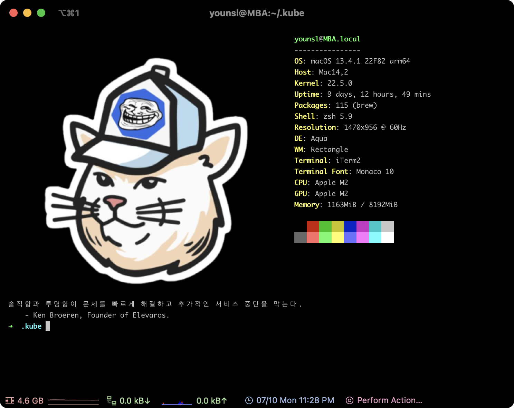

## 개요

패키지 관리자인 Homebrew를 이용해 autojump 플러그인과 neofetch를 설치하고 적용하는 방법을 설명합니다.



&nbsp;

## 환경

- **Hardware** : MacBook Pro (13", M1, 2020)
- **OS** : macOS Monterey 12.0.1
- **Terminal** : iTerm2 + zsh with oh-my-zsh
- **패키지 관리자** : Homebrew 3.3.2
- **설치대상**
  - **autojump 22.5.3**
  - **neofetch 7.1.0**

&nbsp;

## 준비사항

### 로컬 환경

- 로컬 환경에 macOS 패키지 관리자인 [Homebrew](https://brew.sh/)가 설치되어 있어야 합니다.
- 로컬 환경에 터미널 프로그램인 iTerm2 가 설치되어 있어야 합니다.

&nbsp;

## 유용한 터미널 플러그인들

### autojump

[autojump](https://github.com/wting/autojump)는 내가 이전에 이동했던 경로를 기억해놓았다가 해당 경로로 단번에 이동(Jump) 할 수 있게 해주는 기능의 플러그인입니다.

&nbsp;

#### (1) brew 설치 목록 확인

brew로 설치한 모든 패키지 목록을 확인합니다.

```bash
$ brew list
==> Formulae
bat			libevent		neovim
bdw-gc			libffi			nettle
ca-certificates		libidn2			openssl@1.1
cask			libnghttp2		p11-kit
coreutils		libtasn1		pcre
emacs			libtermkey		pkg-config
fzf			libtool			readline
gettext			libunistring		tree-sitter
gmp			libuv			unbound
gnutls			luajit-openresty	unibilium
guile			luv			zsh
hugo			m4			zsh-completions
jansson			msgpack
kubernetes-cli		ncurses

==> Casks
docker	iterm2
```

`autojump`라는 이름의 소프트웨어는 확인되지 않습니다.

&nbsp;

#### (2) 설치

`brew`를 사용해서 `autojump` 패키지를 설치합니다.

```bash
$ brew install autojump
...
==> /opt/homebrew/Cellar/python@3.10/3.10.0_2/bin/python3 -m pip install -v --no-deps --no-index --upgrade --isolated --target=/opt/homebrew/lib/python3.10/site-packages /opt/hom
🍺  /opt/homebrew/Cellar/python@3.10/3.10.0_2: 3,135 files, 57.6MB
==> Installing autojump
==> Pouring autojump--22.5.3_3.arm64_monterey.bottle.tar.gz
==> Caveats
Add the following line to your ~/.bash_profile or ~/.zshrc file:
  [ -f /opt/homebrew/etc/profile.d/autojump.sh ] && . /opt/homebrew/etc/profile.d/autojump.sh

If you use the Fish shell then add the following line to your ~/.config/fish/config.fish:
  [ -f /opt/homebrew/share/autojump/autojump.fish ]; and source /opt/homebrew/share/autojump/autojump.fish

Restart your terminal for the settings to take effect.

zsh completions have been installed to:
  /opt/homebrew/share/zsh/site-functions
==> Summary
🍺  /opt/homebrew/Cellar/autojump/22.5.3_3: 20 files, 170.7KB
==> Caveats
==> autojump
Add the following line to your ~/.bash_profile or ~/.zshrc file:
  [ -f /opt/homebrew/etc/profile.d/autojump.sh ] && . /opt/homebrew/etc/profile.d/autojump.sh

If you use the Fish shell then add the following line to your ~/.config/fish/config.fish:
  [ -f /opt/homebrew/share/autojump/autojump.fish ]; and source /opt/homebrew/share/autojump/autojump.fish

Restart your terminal for the settings to take effect.

zsh completions have been installed to:
  /opt/homebrew/share/zsh/site-functions
```

&nbsp;

현재 `brew`로 설치한 패키지 목록을 다시 확인합니다.

```bash
$ brew list                                                                                                                                                            23:12:50
==> Formulae
autojump    fzf     jansson     libtermkey    mpdecimal   p11-kit     tree-sitter

...
```

설치목록에 `autojump`가 추가된 걸 확인할 수 있습니다.

&nbsp;

#### (3) 플러그인 추가

현재 zsh 설정파일을 확인합니다.

```bash
$ cat ~/.zshrc

...

plugins=(
  git
  zsh-syntax-highlighting
  zsh-autosuggestions
)
```

사용할 플러그인 목록은 `plugins=()` 안에 선언하면 됩니다.

&nbsp;

`plugins` 아래에 `autojump` 플러그인을 사용하도록 추가합니다.

```bash
$ vi ~/.zshrc

...

plugins=(
  git
  zsh-syntax-highlighting
  zsh-autosuggestions
  autojump  # add this line
)
```

vi 에디터에서 변경사항을 저장합니다.

&nbsp;

#### (4) 적용

```bash
$ source ~/.zshrc
```

zsh 설정파일의 변경사항을 즉시 적용한다.

&nbsp;

#### (5) 동작 테스트

```bash
$ cd /Users/ive/githubrepos/blog/content/blog
$ cd /
```

`autojump` 테스트를 위해 각자 환경에서 깊숙한 경로까지 한번 방문한 후 최상단 디렉토리인 root directory(`/`)로 이동합니다.

&nbsp;

`j <점프할 디렉토리명>` 명령어를 입력해서 autojump를 사용할 수 있습니다.

```bash
$ pwd  # before run `j` command
/
```

```bash
$ j blog
/Users/ive/githubrepos/blog/content/blog
```

```bash
$ pwd  # jumped
/Users/ive/githubrepos/blog/content/blog
```

여러 디렉토리 진입을 건너뛰고 root directory(`/`)에서 `blog` 레포지터리로 바로 이동했습니다.

&nbsp;

### neofetch

neofetch는 터미널 창에서 컴퓨터와 OS에 대한 유용한 정보를 제공해주는 툴입니다.

&nbsp;

#### (1) brew 설치 목록 확인

brew로 설치한 모든 패키지 목록을 확인합니다.

```bash
$ brew list
==> Formulae
bat			libevent		neovim
bdw-gc			libffi			nettle
ca-certificates		libidn2			openssl@1.1
cask			libnghttp2		p11-kit
coreutils		libtasn1		pcre
emacs			libtermkey		pkg-config
fzf			libtool			readline
gettext			libunistring		tree-sitter
gmp			libuv			unbound
gnutls			luajit-openresty	unibilium
guile			luv			zsh
hugo			m4			zsh-completions
jansson			msgpack
kubernetes-cli		ncurses

==> Casks
docker	iterm2
```

목록을 보면 `neofetch`는 아직 없으므로 설치가 필요합니다.

&nbsp;

#### (2) brew 검색

brew에서 제공하는 패키지 목록에서 `neofetch`를 검색합니다.

```bash
$ brew search neofetch
==> Formulae
neofetch                                 onefetch
```

검색 결과에 `neofetch`가 있습니다.

&nbsp;

#### (3) neofetch 설치

brew를 사용해서 neofetch를 설치합니다.

```bash
$ brew install neofetch
==> Downloading https://ghcr.io/v2/homebrew/core/screenresolution/manifests/1.6
######################################################################## 100.0%
==> Downloading https://ghcr.io/v2/homebrew/core/screenresolution/blobs/sha256:3
==> Downloading from https://pkg-containers.githubusercontent.com/ghcr1/blobs/sh
######################################################################## 100.0%
==> Downloading https://ghcr.io/v2/homebrew/core/neofetch/manifests/7.1.0-2
######################################################################## 100.0%
==> Downloading https://ghcr.io/v2/homebrew/core/neofetch/blobs/sha256:78eb3e99d
==> Downloading from https://pkg-containers.githubusercontent.com/ghcr1/blobs/sh
######################################################################## 100.0%
==> Installing dependencies for neofetch: screenresolution
==> Installing neofetch dependency: screenresolution
==> Pouring screenresolution--1.6.arm64_monterey.bottle.tar.gz
🍺  /opt/homebrew/Cellar/screenresolution/1.6: 5 files, 57.7KB
==> Installing neofetch
==> Pouring neofetch--7.1.0.all.bottle.2.tar.gz
🍺  /opt/homebrew/Cellar/neofetch/7.1.0: 6 files, 350.6KB
```

최신버전의 `neofetch` `v7.1.0`이 설치 완료되었습니다.

&nbsp;

#### (4) 적용

zsh 설정파일을 엽니다.

zsh이 실행될 때 마지막에 `neofetch` 명령어를 실행하도록 마지막 라인에 `neofetch`를 추가합니다.

```bash
$ vi ~/.zshrc
...
export PATH=/opt/homebrew/bin:/Library/Frameworks/Python.framework/Versions/3.9/bin:/usr/local/bin:/usr/bin:/bin:/usr/sbin:/sbin

neofetch  # add this line
```

이제 iTerm2를 실행시키면 zsh 설정파일을 읽고, 마지막 라인에서 `neofetch`가 실행된다.

&nbsp;

#### (5) 결과확인

새 터미널창이 열릴 때마다 `neofetch` 명령어가 실행되어 디테일한 하드웨어 스펙, OS 정보를 표출해준다.


&nbsp;

좌측에 나오는 ASCII 그림은 원하는 이미지로 설정이 가능하다.

기본값은 각 운영체제의 로고이다. MacBook의 경우 기본 값으로 Apple 로고가 출력됩니다.

&nbsp;

## 더 나아가서

### neofetch 커스텀 이미지

neofetch에서 자신이 원하는 이미지를 넣고 싶다면 [neofetch로 터미널 꾸미기](/blog/setup-neofetch-on-iterm2/) 페이지를 참고해서 설정할 수 있습니다.

&nbsp;

### 랜덤 명언 조합하기

제 경우 neofetch 하단에 명언이 나오도록 [fortune](https://formulae.brew.sh/formula/fortune) 패키지를 조합해서 사용하고 있습니다.


&nbsp;

macOS 패키지 관리자인 [brew](https://brew.sh)를 사용해서 fortune을 설치합니다.

```bash
brew install fortune
```

&nbsp;

로컬 환경에 `fortune` 명령어가 추가됩니다.

```bash
$ which fortune && fortune -v
/opt/homebrew/bin/fortune
fortune-mod version 9708
```

&nbsp;

neofetch와 fortune을 조합한 zsh 설정파일 예시입니다.

```bash
$ vi ~/.zshrc
...

neofetch
fortune ~/.config/fortune/
```

zsh에 설정한 것과 동일하게, `~/.config/fortune` 디렉토리 안에 출력할 명언 파일들을 작성해서 미리 한 곳에 모아 놓습니다.

&nbsp;

제 사용 사례로는 책이나 미디어에서 인상깊게 본 구절과 유명 개발자들의 명언을 `.fortune` 파일에 모두 기록해두고, 터미널을 열 때마다 습관적으로 읽을 수 있게 계속 노출시키고 있습니다.

아래와 같이 각 카테고리별로 `.fortune` 파일을 분류합니다.

```bash
$ ls
bootstrap.sh        crypto.fortune      general.fortune     programming.fortune security.fortune    strfile.sh
carrer.fortune      devops.fortune      philosophy.fortune  science.fortune     sre.fortune
```

&nbsp;

명언을 모아놓은 텍스트 파일을 작성했으면 이제 `~/.config/fortune/` 디렉토리 안에 `strfile.sh` 스크립트를 생성합니다.

```bash
$ cat << EOF > ~/.config/fortune/strfile.sh
#!/bin/bash

# 현재 디렉토리에서 .fortune 파일 목록을 가져옴
fortune_files=$(find . -maxdepth 1 -type f -name "*.fortune")

# 각 .fortune 파일에 대해 strfile 실행
for fortune_file in $fortune_files; do
  strfile "$fortune_file"
done
EOF
```

`fortune`은 일반 텍스트 파일만은 읽지 못하므로, 인덱스 정보가 담긴 데이터 파일 `.dat`로 변환 처리해주는 스크립트입니다.

이 때 사용되는 `strfile` 명령어는 `fortune`과 같이 사용되며, 텍스트 파일을 더 쉽게 검색하고 무작위로 텍스트를 선택하는 데 도움을 줍니다. `strfile`을 실행하면 텍스트 파일을 읽어 들이고 인덱스가 담긴 데이터 파일 `.dat`을 생성합니다. 이 인덱스 데이터 파일은 `fortune`이 출력할 명언을 검색할 때 빠른 액세스를 가능하게 합니다.

&nbsp;

명언이 있는 경로에서 `strfile.sh`을 실행합니다.

```bash
sh strfile.sh
```

```bash
"./programming.fortune.dat" created
There were 26 strings
Longest string: 366 bytes
Shortest string: 59 bytes

...

"./science.fortune.dat" created
There were 4 strings
Longest string: 169 bytes
Shortest string: 80 bytes
```

스크립트는 각각의 `.fortune` 파일을 읽어서 인덱스 정보가 담긴 데이터 파일인 `.dat`를 생성합니다.

&nbsp;

스크립트를 실행한 후 결과는 다음과 같습니다.

```bash
$ ls ~/.config/fortune/
bootstrap.sh            crypto.fortune.dat      general.fortune.dat     programming.fortune.dat security.fortune.dat
carrer.fortune          devops.fortune          philosophy.fortune      science.fortune         sre.fortune
carrer.fortune.dat      devops.fortune.dat      philosophy.fortune.dat  science.fortune.dat     sre.fortune.dat
crypto.fortune          general.fortune         programming.fortune     security.fortune        strfile.sh
```

각 분야별로 모아놓은 `.fortune` 파일에 매핑되는 `.dat`가 생성된 걸 확인할 수 있습니다.

> **주의사항**  
> `fortune` 명령어는 `.dat` 파일 그 자체로는 명언 내용에 대한 완전한 정보를 읽지 못합니다. 디렉토리 안에 `.fortune`과 `.dat` 파일 **둘다** 존재해야 `fortune`이 정상적으로 명언 데이터를 읽을 수 있습니다.

&nbsp;

이제 iTerm2를 재실행하거나 `zsh` 명령어로 쉘을 재시작하면, `fortune`은 `~/.config/fortune/`에 위치한 모든 명언들 중 하나를 랜덤하게 출력합니다.

&nbsp;

## 마치며

개발하는 대부분의 시간은 끝없는 고민으로 이어진 시간과 정신의 방입니다.

이런 식으로 아기자기한 터미널 환경을 만들면 고된 프로그래밍도 그나마 덜 힘들게 느껴지고 종종 재밌게 다가올 때가 있으므로 공들여서 구축해놓도록 합니다.

이렇게 개발환경 세팅 하다보면 현재 환경을 개선하는 일에 빠져들 때가 있습니다. 마치 [야크 털 깎기](https://www.lesstif.com/software-engineering/yak-shaving-29590364.html)<sup>Yak Shaving</sup>처럼요. 하지만 야크 털 깎기는 재밌습니다.
