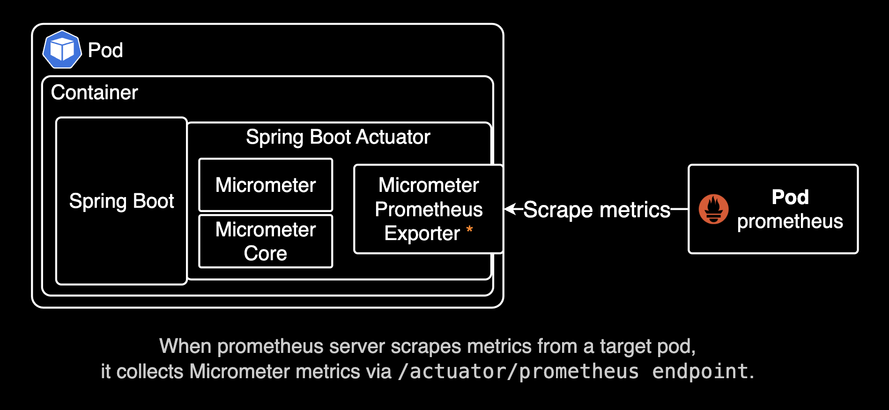
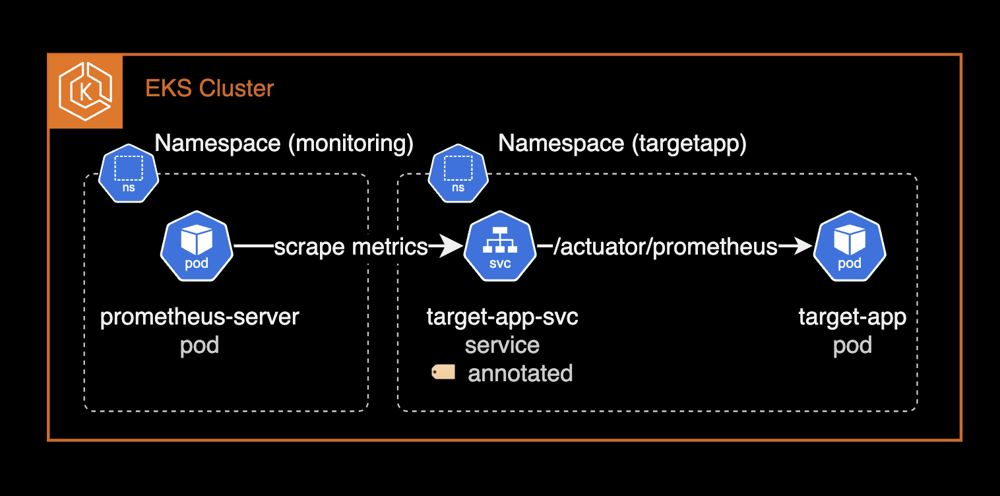

## 개요

Spring Actuator 의 Prometheus 엔드포인트를 통해 JVM 메트릭을 수집하는 방법을 정리합니다.

관측가능성 확보를 담당하는 DevOps Engineer 또는 SRE 엔지니어를 위한 가이드입니다.

&nbsp;

## 환경

- EKS 1.30
- Application : Java 17.0.4.1 (with Micrometer)
- Prometheus 2.48.0
- Prometheus Operator는 사용하지 않는 환경

&nbsp;

## 주의사항

### Prometheus 환경

이 설정 가이드에서는 [Prometheus Operator](https://github.com/prometheus-operator/prometheus-operator)를 사용하지 않고, 일반적인 Prometheus Server 2.48.0을 사용합니다. 따라서 프로메테우스 서버가 메트릭을 수집(scrape)하는 과정에서 `serviceMonitor`, `podMonitor` 커스텀 리소스를 사용하지 않습니다. Prometheus Operator에서만 해당 커스텀 리소스들을 사용할 수 있기 때문입니다.

&nbsp;

## 설정 방법

Spring Boot 어플리케이션에서 Micrometer 라이브러리를 사용해 메트릭을 노출시킨 후, 프로메테우스 서버에서 수집(scrape)하는 절차로 크게 두 가지 단계로 나누어 설정합니다.

&nbsp;

### Spring Boot Application

`build.gradle.kts` 파일에 다음과 같이 `micrometer-registry-prometheus` 의존성을 추가합니다. `micrometer-registry-prometheus`는 프로메테우스 서버에서 메트릭을 수집하는 데 필요한 의존성입니다.

아래는 `build.gradle.kts` 파일의 일부분입니다.

> **micrometer 라이브러리 버전**: 최신 버전의 micrometer 클라이언트(1.x)를 사용하려면 `micrometer-registry-prometheus`를 사용하고, "레거시" 클라이언트(0.x)를 사용하려면 `micrometer-registry-prometheus-simpleclient`를 사용하세요. 이 시나리오에서는 최신 버전(`1.x`)의 micrometer 클라이언트를 사용하고 있습니다. 자세한 사항은 [micrometer prometheus 공식 문서](https://docs.micrometer.io/micrometer/reference/implementations/prometheus.html)를 참고하세요.

```java
dependencies {
    implementation("org.springframework.boot:spring-boot-starter-actuator")
    implementation("io.micrometer:micrometer-registry-prometheus")
    // ... omitted for brevity ...
}
```

- `org.springframework.boot:spring-boot-starter-actuator` : Spring Boot Actuator는 애플리케이션의 상태를 모니터링하고 관리할 수 있는 다양한 엔드포인트를 제공합니다. `/actuator/health`, `/actuator/metrics`, `/actuator/info`와 같은 엔드포인트를 통해 애플리케이션의 정보 및 헬스체크를 확인할 수 있습니다.
- `io.micrometer:micrometer-registry-prometheus` : Micrometer는 JVM 기반 애플리케이션에서 메트릭을 수집하고 Prometheus와 같은 모니터링 시스템에 전송할 수 있도록 지원합니다. 이 라이브러리를 사용하면 `/actuator/prometheus` 엔드포인트를 통해 Prometheus가 메트릭을 수집할 수 있습니다. 수집 가능한 메트릭에는 JVM 메모리 사용량을 나타내는 `jvm_memory_used_bytes`, 현재 실행 중인 스레드 수를 나타내는 `jvm_threads_live_threads`, 시스템 CPU 사용량을 나타내는 `system_cpu_usage`, JVM 프로세스의 가동 시간을 나타내는 `process_uptime_seconds`, 그리고 HTTP 요청 처리 시간을 나타내는 `http_server_requests_seconds` 등이 포함됩니다. 이 외에도 다양한 JVM 및 애플리케이션 관련 메트릭들을 수집할 수 있습니다.

&nbsp;

아래와 같이 `application.yaml` 파일에 다음과 같은 설정을 추가합니다.

```yaml
# example/src/main/resources/local/application.yaml
management:
  endpoints:
    web:
      exposure:
        include: prometheus, metrics, health
  endpoint:
    health:
      probes:
        enabled: true
  metrics:
    export:
      prometheus:
        enabled: true
```

`exposure`는 Spring Boot Actuator에서 관리 엔드포인트의 노출을 제어하는 설정입니다. `management.endpoints.web.exposure.include`는 어떤 엔드포인트를 외부에 노출할지를 지정합니다. 기본적으로 `health` 엔드포인트는 포함됩니다.

위 코드에서는 prometheus, metrics, health 엔드포인트가 노출되도록 설정되어 있습니다. 이는 Prometheus가 메트릭을 수집할 수 있도록 하고, 애플리케이션의 상태를 확인할 수 있는 health 엔드포인트도 외부에서 접근 가능하게 합니다. 자세한 사항은 [Spring Boot Actuator 공식 문서](https://docs.spring.io/spring-boot/docs/current/reference/html/actuator.html#actuator.endpoints.exposing)를 참고하세요.

&nbsp;

### Prometheus Scrape

수집 대상 파드의 서비스 리소스에 다음과 같은 어노테이션을 추가하면 프로메테우스 서버는 자동으로 메트릭을 수집합니다.

```yaml
kind: Service
# ... omitted for brevity ...
metadata:
  annotations:
    prometheus.io/scrape: 'true'
    prometheus.io/port: http
    prometheus.io/path: /actuator/prometheus
```

`prometheus.io/port`는 쿠버네티스 서비스에 등록된 포트 이름과 직접적인 포트 번호 둘 다 사용할 수 있습니다.

약속된 어노테이션을 기반으로 `prometheus` 서버가 자동으로 감지하고 메트릭을 수집(scrape)하는 설정은 `prometheus-server` 파드의 설정 파일에서 확인할 수 있습니다.

```bash
kubectl exec -it prometheus-server-79f7d4d8d-mcb9f \
  -n prometheus \
  -c prometheus-server -- cat /etc/config/prometheus.yml
```

&nbsp;

해당 어노테이션으로 수집된 JVM 메트릭들은 `job` 라벨에 `kubernetes-service-endpoints` 값을 가지게 됩니다. 아래는 자동 스크레이핑에 대한 `prometheus.yml` 설정입니다.

```yaml
# ... omitted for brevity ...

- honor_labels: true
  job_name: kubernetes-service-endpoints
  kubernetes_sd_configs:
  - role: endpoints
  relabel_configs:
  - action: keep
    regex: true
    source_labels:
    - __meta_kubernetes_service_annotation_prometheus_io_scrape
  - action: drop
    regex: true
    source_labels:
    - __meta_kubernetes_service_annotation_prometheus_io_scrape_slow
  - action: replace
    regex: (https?)
    source_labels:
    - __meta_kubernetes_service_annotation_prometheus_io_scheme
    target_label: __scheme__
  - action: replace
    regex: (.+)
    source_labels:
    - __meta_kubernetes_service_annotation_prometheus_io_path
    target_label: __metrics_path__
  - action: replace
    regex: (.+?)(?::\d+)?;(\d+)
    replacement: $1:$2
    source_labels:
    - __address__
    - __meta_kubernetes_service_annotation_prometheus_io_port
    target_label: __address__
  - action: labelmap
    regex: __meta_kubernetes_service_annotation_prometheus_io_param_(.+)
    replacement: __param_$1
  - action: labelmap
    regex: __meta_kubernetes_service_label_(.+)
  - action: replace
    source_labels:
    - __meta_kubernetes_namespace
    target_label: namespace
  - action: replace
    source_labels:
    - __meta_kubernetes_service_name
    target_label: service
  - action: replace
    source_labels:
    - __meta_kubernetes_pod_node_name
    target_label: node

# ... omitted for brevity ...
```

&nbsp;

프로메테우스 서버 파드가 대상 어플리케이션 파드의 JVM 메트릭을 수집(scrape)하는 과정은 다음과 같이 진행됩니다.



&nbsp;

수집 대상인 백엔드 어플리케이션은 현재 JVM 기반이며, Java 17 버전을 사용하고 있습니다.

```bash
bash-5.1$ java -version
openjdk version "17.0.4.1" 2022-08-12 LTS
OpenJDK Runtime Environment Corretto-17.0.4.9.1 (build 17.0.4.1+9-LTS)
OpenJDK 64-Bit Server VM Corretto-17.0.4.9.1 (build 17.0.4.1+9-LTS, mixed mode, sharing)
```

&nbsp;

사용 가능한 Actuator의 엔드포인트를 확인하려면 다음 명령어를 실행합니다. `jq` 명령어가 설치되어 있어야 합니다.

```bash
which jq
curl -s http://localhost:8080/actuator | jq
```

```json
{
  "_links": {
    "self": {
      "href": "http://localhost:8080/actuator",
      "templated": false
    },
    "prometheus": {
      "href": "http://localhost:8080/actuator/prometheus",
      "templated": false
    },
    "health-path": {
      "href": "http://localhost:8080/actuator/health/{*path}",
      "templated": true
    },
    "health": {
      "href": "http://localhost:8080/actuator/health",
      "templated": false
    },
    "metrics": {
      "href": "http://localhost:8080/actuator/metrics",
      "templated": false
    },
    // ... omitted for brevity ...
  }
}
```

JVM 기반의 어플리케이션 파드에서 다음 명령어를 실행하면 수집할 수 있는 메트릭을 확인할 수 있습니다.

```bash
curl -s http://localhost:8080/actuator/prometheus
```

```bash
# HELP disk_total_bytes Total space for path
# TYPE disk_total_bytes gauge
disk_total_bytes{path="/deployments/.",} 1.07361579008E11
# HELP jvm_buffer_count_buffers An estimate of the number of buffers in the pool
# TYPE jvm_buffer_count_buffers gauge
jvm_buffer_count_buffers{id="mapped - 'non-volatile memory'",} 0.0
jvm_buffer_count_buffers{id="mapped",} 0.0
jvm_buffer_count_buffers{id="direct",} 31.0
# HELP application_started_time_seconds Time taken (ms) to start the application
# TYPE application_started_time_seconds gauge
application_started_time_seconds{main_application_class="kr.co.<REDACTED>.<REDACTED>.<REDACTED>",} 30.301
# HELP jvm_threads_states_threads The current number of threads having NEW state
# TYPE jvm_threads_states_threads gauge
jvm_threads_states_threads{state="runnable",} 20.0
jvm_threads_states_threads{state="blocked",} 0.0
jvm_threads_states_threads{state="waiting",} 16.0
jvm_threads_states_threads{state="timed-waiting",} 37.0
jvm_threads_states_threads{state="new",} 0.0
jvm_threads_states_threads{state="terminated",} 0.0
# HELP process_files_open_files The open file descriptor count
# TYPE process_files_open_files gauge
process_files_open_files 85.0
# HELP application_ready_time_seconds Time taken (ms) for the application to be ready to service requests
# TYPE application_ready_time_seconds gauge
application_ready_time_seconds{main_application_class="kr.co.<REDACTED>.<REDACTED>.<REDACTED>",} 30.307
# HELP jvm_classes_loaded_classes The number of classes that are currently loaded in the Java virtual machine
# TYPE jvm_classes_loaded_classes gauge
jvm_classes_loaded_classes 20435.0
# HELP system_cpu_count The number of processors available to the Java virtual machine
# TYPE system_cpu_count gauge
system_cpu_count 1.0
# HELP jvm_memory_max_bytes The maximum amount of memory in bytes that can be used for memory management
# TYPE jvm_memory_max_bytes gauge
jvm_memory_max_bytes{area="heap",id="Tenured Gen",} 3.57957632E8
jvm_memory_max_bytes{area="nonheap",id="CodeHeap 'profiled nmethods'",} 1.22912768E8
jvm_memory_max_bytes{area="heap",id="Eden Space",} 1.43130624E8
jvm_memory_max_bytes{area="nonheap",id="Metaspace",} -1.0
jvm_memory_max_bytes{area="nonheap",id="CodeHeap 'non-nmethods'",} 5828608.0
jvm_memory_max_bytes{area="heap",id="Survivor Space",} 1.7891328E7
jvm_memory_max_bytes{area="nonheap",id="Compressed Class Space",} 1.073741824E9
jvm_memory_max_bytes{area="nonheap",id="CodeHeap 'non-profiled nmethods'",} 1.22916864E8
# HELP jvm_threads_daemon_threads The current number of live daemon threads
# TYPE jvm_threads_daemon_threads gauge
jvm_threads_daemon_threads 56.0
# HELP jvm_memory_usage_after_gc_percent The percentage of long-lived heap pool used after the last GC event, in the range [0..1]
# TYPE jvm_memory_usage_after_gc_percent gauge
jvm_memory_usage_after_gc_percent{area="heap",pool="long-lived",} 0.22336272467016433
# HELP jvm_buffer_total_capacity_bytes An estimate of the total capacity of the buffers in this pool
# TYPE jvm_buffer_total_capacity_bytes gauge
jvm_buffer_total_capacity_bytes{id="mapped - 'non-volatile memory'",} 0.0
jvm_buffer_total_capacity_bytes{id="mapped",} 0.0
jvm_buffer_total_capacity_bytes{id="direct",} 8711237.0
# HELP process_files_max_files The maximum file descriptor count
# TYPE process_files_max_files gauge
process_files_max_files 1048576.0
# HELP jvm_gc_memory_promoted_bytes_total Count of positive increases in the size of the old generation memory pool before GC to after GC
# TYPE jvm_gc_memory_promoted_bytes_total counter
jvm_gc_memory_promoted_bytes_total 2.8862608E7
# HELP jvm_memory_committed_bytes The amount of memory in bytes that is committed for the Java virtual machine to use
# TYPE jvm_memory_committed_bytes gauge
jvm_memory_committed_bytes{area="heap",id="Tenured Gen",} 3.57957632E8
jvm_memory_committed_bytes{area="nonheap",id="CodeHeap 'profiled nmethods'",} 3.4668544E7
jvm_memory_committed_bytes{area="heap",id="Eden Space",} 1.43130624E8
jvm_memory_committed_bytes{area="nonheap",id="Metaspace",} 1.13836032E8
jvm_memory_committed_bytes{area="nonheap",id="CodeHeap 'non-nmethods'",} 2555904.0
jvm_memory_committed_bytes{area="heap",id="Survivor Space",} 1.7891328E7
jvm_memory_committed_bytes{area="nonheap",id="Compressed Class Space",} 1.3565952E7
jvm_memory_committed_bytes{area="nonheap",id="CodeHeap 'non-profiled nmethods'",} 1.998848E7
# HELP disk_free_bytes Usable space for path
# TYPE disk_free_bytes gauge
disk_free_bytes{path="/deployments/.",} 9.2223438848E10
# HELP jvm_threads_peak_threads The peak live thread count since the Java virtual machine started or peak was reset
# TYPE jvm_threads_peak_threads gauge
jvm_threads_peak_threads 133.0
# HELP system_cpu_usage The "recent cpu usage" of the system the application is running in
# TYPE system_cpu_usage gauge
system_cpu_usage 0.013503964921259843
# HELP process_uptime_seconds The uptime of the Java virtual machine
# TYPE process_uptime_seconds gauge
process_uptime_seconds 9143.299
# HELP jvm_gc_max_data_size_bytes Max size of long-lived heap memory pool
# TYPE jvm_gc_max_data_size_bytes gauge
jvm_gc_max_data_size_bytes 3.57957632E8
# HELP jvm_buffer_memory_used_bytes An estimate of the memory that the Java virtual machine is using for this buffer pool
# TYPE jvm_buffer_memory_used_bytes gauge
jvm_buffer_memory_used_bytes{id="mapped - 'non-volatile memory'",} 0.0
jvm_buffer_memory_used_bytes{id="mapped",} 0.0
jvm_buffer_memory_used_bytes{id="direct",} 8711238.0
# HELP process_cpu_usage The "recent cpu usage" for the Java Virtual Machine process
# TYPE process_cpu_usage gauge
process_cpu_usage 0.012598425196850394
# HELP spring_kafka_listener_seconds_max Kafka Listener Timer
# TYPE spring_kafka_listener_seconds_max gauge
spring_kafka_listener_seconds_max{exception="none",name="org.springframework.kafka.KafkaListenerEndpointContainer#0-2",result="success",} 9.43929E-4
spring_kafka_listener_seconds_max{exception="none",name="org.springframework.kafka.KafkaListenerEndpointContainer#0-3",result="success",} 0.0
spring_kafka_listener_seconds_max{exception="none",name="org.springframework.kafka.KafkaListenerEndpointContainer#0-4",result="success",} 0.0
spring_kafka_listener_seconds_max{exception="none",name="org.springframework.kafka.KafkaListenerEndpointContainer#0-0",result="success",} 3.54099E-4
spring_kafka_listener_seconds_max{exception="none",name="org.springframework.kafka.KafkaListenerEndpointContainer#0-1",result="success",} 8.72295E-4
# HELP spring_kafka_listener_seconds Kafka Listener Timer
# TYPE spring_kafka_listener_seconds summary
spring_kafka_listener_seconds_count{exception="none",name="org.springframework.kafka.KafkaListenerEndpointContainer#0-2",result="success",} 1760.0
spring_kafka_listener_seconds_sum{exception="none",name="org.springframework.kafka.KafkaListenerEndpointContainer#0-2",result="success",} 1.057248711
spring_kafka_listener_seconds_count{exception="none",name="org.springframework.kafka.KafkaListenerEndpointContainer#0-3",result="success",} 0.0
spring_kafka_listener_seconds_sum{exception="none",name="org.springframework.kafka.KafkaListenerEndpointContainer#0-3",result="success",} 0.0
spring_kafka_listener_seconds_count{exception="none",name="org.springframework.kafka.KafkaListenerEndpointContainer#0-4",result="success",} 0.0
spring_kafka_listener_seconds_sum{exception="none",name="org.springframework.kafka.KafkaListenerEndpointContainer#0-4",result="success",} 0.0
spring_kafka_listener_seconds_count{exception="none",name="org.springframework.kafka.KafkaListenerEndpointContainer#0-0",result="success",} 1415.0
spring_kafka_listener_seconds_sum{exception="none",name="org.springframework.kafka.KafkaListenerEndpointContainer#0-0",result="success",} 0.779761961
spring_kafka_listener_seconds_count{exception="none",name="org.springframework.kafka.KafkaListenerEndpointContainer#0-1",result="success",} 1749.0
spring_kafka_listener_seconds_sum{exception="none",name="org.springframework.kafka.KafkaListenerEndpointContainer#0-1",result="success",} 0.914776561
# HELP jvm_gc_overhead_percent An approximation of the percent of CPU time used by GC activities over the last lookback period or since monitoring began, whichever is shorter, in the range [0..1]
# TYPE jvm_gc_overhead_percent gauge
jvm_gc_overhead_percent 3.3333333333333335E-5
# HELP jvm_gc_live_data_size_bytes Size of long-lived heap memory pool after reclamation
# TYPE jvm_gc_live_data_size_bytes gauge
jvm_gc_live_data_size_bytes 7.9954392E7
# HELP process_start_time_seconds Start time of the process since unix epoch.
# TYPE process_start_time_seconds gauge
process_start_time_seconds 1.73439660391E9
# HELP jvm_classes_unloaded_classes_total The total number of classes unloaded since the Java virtual machine has started execution
# TYPE jvm_classes_unloaded_classes_total counter
jvm_classes_unloaded_classes_total 82.0
# HELP logback_events_total Number of error level events that made it to the logs
# TYPE logback_events_total counter
logback_events_total{level="warn",} 0.0
logback_events_total{level="debug",} 0.0
logback_events_total{level="error",} 0.0
logback_events_total{level="trace",} 0.0
logback_events_total{level="info",} 17598.0
# HELP jvm_gc_pause_seconds Time spent in GC pause
# TYPE jvm_gc_pause_seconds summary
jvm_gc_pause_seconds_count{action="end of major GC",cause="Metadata GC Threshold",} 1.0
jvm_gc_pause_seconds_sum{action="end of major GC",cause="Metadata GC Threshold",} 0.202
jvm_gc_pause_seconds_count{action="end of minor GC",cause="Allocation Failure",} 62.0
jvm_gc_pause_seconds_sum{action="end of minor GC",cause="Allocation Failure",} 0.557
jvm_gc_pause_seconds_count{action="end of major GC",cause="Heap Dump Initiated GC",} 2.0
jvm_gc_pause_seconds_sum{action="end of major GC",cause="Heap Dump Initiated GC",} 0.354
# HELP jvm_gc_pause_seconds_max Time spent in GC pause
# TYPE jvm_gc_pause_seconds_max gauge
jvm_gc_pause_seconds_max{action="end of major GC",cause="Metadata GC Threshold",} 0.0
jvm_gc_pause_seconds_max{action="end of minor GC",cause="Allocation Failure",} 0.005
jvm_gc_pause_seconds_max{action="end of major GC",cause="Heap Dump Initiated GC",} 0.0
# HELP system_load_average_1m The sum of the number of runnable entities queued to available processors and the number of runnable entities running on the available processors averaged over a period of time
# TYPE system_load_average_1m gauge
system_load_average_1m 1.4140625
# HELP http_server_requests_seconds
# TYPE http_server_requests_seconds summary
http_server_requests_seconds_count{exception="None",method="GET",outcome="SUCCESS",status="200",uri="/actuator/metrics",} 3.0
http_server_requests_seconds_sum{exception="None",method="GET",outcome="SUCCESS",status="200",uri="/actuator/metrics",} 0.012474533
http_server_requests_seconds_count{exception="None",method="GET",outcome="SUCCESS",status="200",uri="/actuator/prometheus",} 8.0
http_server_requests_seconds_sum{exception="None",method="GET",outcome="SUCCESS",status="200",uri="/actuator/prometheus",} 0.040926837
http_server_requests_seconds_count{exception="None",method="GET",outcome="SUCCESS",status="200",uri="/actuator/health/**",} 7488.0
http_server_requests_seconds_sum{exception="None",method="GET",outcome="SUCCESS",status="200",uri="/actuator/health/**",} 8.469948957
http_server_requests_seconds_count{exception="None",method="GET",outcome="SUCCESS",status="200",uri="/actuator/health",} 3.0
http_server_requests_seconds_sum{exception="None",method="GET",outcome="SUCCESS",status="200",uri="/actuator/health",} 0.215863709
http_server_requests_seconds_count{exception="None",method="GET",outcome="CLIENT_ERROR",status="404",uri="/**",} 1.0
http_server_requests_seconds_sum{exception="None",method="GET",outcome="CLIENT_ERROR",status="404",uri="/**",} 0.016433945
# HELP http_server_requests_seconds_max
# TYPE http_server_requests_seconds_max gauge
http_server_requests_seconds_max{exception="None",method="GET",outcome="SUCCESS",status="200",uri="/actuator/metrics",} 0.0
http_server_requests_seconds_max{exception="None",method="GET",outcome="SUCCESS",status="200",uri="/actuator/prometheus",} 0.002992877
http_server_requests_seconds_max{exception="None",method="GET",outcome="SUCCESS",status="200",uri="/actuator/health/**",} 0.004317313
http_server_requests_seconds_max{exception="None",method="GET",outcome="SUCCESS",status="200",uri="/actuator/health",} 0.0
http_server_requests_seconds_max{exception="None",method="GET",outcome="CLIENT_ERROR",status="404",uri="/**",} 0.0
# HELP jvm_gc_memory_allocated_bytes_total Incremented for an increase in the size of the (young) heap memory pool after one GC to before the next
# TYPE jvm_gc_memory_allocated_bytes_total counter
jvm_gc_memory_allocated_bytes_total 8.994968608E9
# HELP jvm_memory_used_bytes The amount of used memory
# TYPE jvm_memory_used_bytes gauge
jvm_memory_used_bytes{area="heap",id="Tenured Gen",} 7.9954392E7
jvm_memory_used_bytes{area="nonheap",id="CodeHeap 'profiled nmethods'",} 3.154368E7
jvm_memory_used_bytes{area="heap",id="Eden Space",} 7.5049552E7
jvm_memory_used_bytes{area="nonheap",id="Metaspace",} 1.13213752E8
jvm_memory_used_bytes{area="nonheap",id="CodeHeap 'non-nmethods'",} 1576832.0
jvm_memory_used_bytes{area="heap",id="Survivor Space",} 3712240.0
jvm_memory_used_bytes{area="nonheap",id="Compressed Class Space",} 1.3254928E7
jvm_memory_used_bytes{area="nonheap",id="CodeHeap 'non-profiled nmethods'",} 1.9390848E7
# HELP jvm_threads_live_threads The current number of live threads including both daemon and non-daemon threads
# TYPE jvm_threads_live_threads gauge
jvm_threads_live_threads 73.0
```

어플리케이션 파드의 `/actuator/prometheus` 엔드포인트에서 수집할 수 있는 다양한 JVM 및 애플리케이션 관련 메트릭들을 확인할 수 있습니다.

&nbsp;

이 메트릭들을 조합해 JVM 메트릭 위주의 대시보드를 만들 수 있습니다.

Grafana에서 수집한 메트릭을 조합해 대시보드를 만든 예시:



이를 통해 블랙박스 영역이었던 JVM 메트릭을 더 세부적으로 관측할 수 있습니다. 관측가능성은 손이 많이 가는 작업이지만 더 나은 품질의 서비스를 제공하는데 필요한 매우 중요한 작업입니다.

&nbsp;

## 정리

뉴렐릭이나 데이터독 에이전트를 통해 JVM(Java)에 대한 APM 성능 메트릭을 수집할 수 있습니다. 그러나 비용 절감 및 벤더 락인을 방지하기 위해 JVM 메트릭을 직접 수집하는 방법이 장기적인 관점에서는 더 좋은 선택인 것 같습니다.

오너십을 DevOps Engineer와 SRE가 더 가져갈 수도 있기도 하고, 오픈소스 기반의 관측가능성(Observability) 솔루션들을 조합해 운영하는 것이 더 클라우드 네이티브한 방식이라고 생각합니다.

&nbsp;

## 관련자료

- [Spring Boot + Actuator + Micrometer로 Prometheus 연동하기](https://velog.io/@windsekirun/Spring-Boot-Actuator-Micrometer%EB%A1%9C-Prometheus-%EC%97%B0%EB%8F%99%ED%95%98%EA%B8%B0)
- [Micrometer Prometheus 공식 문서](https://docs.micrometer.io/micrometer/reference/implementations/prometheus.html)