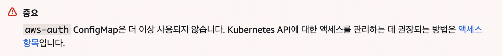

## 개요

이 가이드는 EKS 클러스터에 대한 접근 권한을 설정하고 구성하는 방법을 설명하며, 특히 aws-auth ConfigMap 방식과 Access Entry 방식 간의 차이점을 중점적으로 다룹니다.

AWS 콘솔이나 CLI가 아닌 EKS 테라폼 모듈을 기준으로 설정 방법을 설명하며, EKS 클러스터의 접근 관리에 대한 이해를 높일 수 있습니다. 또한, 최신 권장 방식인 Access Entry를 통해 클러스터 접근을 보다 안전하고 유연하게 관리하는 방법을 배울 수 있습니다.

&nbsp;

## 배경지식

### EKS 클러스터 권한 관리 방식

기존 방식인 `aws-auth` configMap은 사용 중단(Deprecated)되었기 때문에 EKS 클러스터에서 Access Entry 방식을 사용하는 것을 권장합니다. [AWS 공식문서](https://docs.aws.amazon.com/ko_kr/eks/latest/userguide/auth-configmap.html)에서는 다음과 같이 설명하고 있습니다.



&nbsp;

기존 권한 관리 방식인 `aws-auth` configMap과 Access Entry 방식을 비교해보면 다음과 같습니다.

| 항목 | aws-auth configMap | Access Entry 방식 |
|-----|--------------------|------------------|
| 사용 중단 여부 | 사용 중단됨 (Deprecated) | 현재 권장되는 방법 |
| 설정 방법 | kubectl을 통해 configMap을 편집하여 설정 | IAM 보안 주체를 직접 매핑하여 설정 |
| 유연성 | 제한적 (configMap 형식에 의존) | 더 유연함 (IAM 역할 및 사용자에 대한 직접 매핑 가능) |
| RBAC 통합 | RBAC와의 통합이 복잡함 | RBAC와의 통합이 간편함 |
| 관리 용이성 | 수동으로 관리해야 하며, 형식 오류 시 접근 권한 상실 위험 | IAM 역할 및 사용자 매핑이 명확하여 관리 용이 |
| 보안 | IAM 역할 및 사용자에 대한 세부 설정이 어려움 | IAM 보안 주체에 대한 세부 설정 가능 |
| 문서화 | AWS 문서에서 더 이상 업데이트되지 않음 | 최신 AWS 문서에서 지속적으로 업데이트됨 |

Access Entry는 IAM 역할 및 사용자를 직접 매핑할 수 있어 유연성과 관리 용이성이 뛰어나며, RBAC 통합이 간편합니다. 또한, 보안 설정이 강화되고 최신 AWS 문서에서 지속적으로 업데이트되므로 클러스터 접근 관리에 더 적합한 선택입니다.

&nbsp;

다음은 Access Entry 방식의 아키텍처입니다.


&nbsp;

`aws-auth`의 대표적인 한계점을 예로 들면, configMap을 잘못 작성하거나 삭제하게 되면 클러스터에 접근할 수 있는 권한이 완전히 사라져버립니다. 이 경우 모든 사용자가 클러스터에 접근할 수 없게 되어 운영 중인 서비스에 심각한 영향을 미칠 수 있습니다. 이러한 상황에서는 AWS 서포트팀의 도움을 받아야만 문제를 해결할 수 있어 시간 소모가 크고 서비스 중단으로 이어질 수 있습니다. 따라서 클러스터에 접근할 수 없게 되면 운영 중인 애플리케이션의 유지보수나 긴급 대응이 불가능해져 비즈니스에 큰 영향을 미칠 수 있습니다. 이러한 이유로 `aws-auth` configMap의 사용은 위험 요소가 크고 관리의 복잡성을 증가시키는 요인이 되어, 새로운 접근 방식인 Access Entry 방식이 낫습니다.

&nbsp;

## 환경

- **EKS 버전** : v1.30
- **테라폼 모듈** : `terraform-aws-modules/eks/aws` v20.24.3
- **Terraform 버전** : v1.6.0 on darwin_arm64

&nbsp;

## 설정 방법

이 시나리오에서 작업하는 테라폼 코드 구조는 다음과 같다고 가정합니다. `demo-eks-cluster` 디렉토리에서 작업을 진행합니다.

```bash
eks/
├── other-cluster/
│   └── # tf files of other cluster
└── demo-eks-cluster/
    ├── backend.tf
    ├── main.tf
    ├── outputs.tf
    ├── variables.tf
    └── version.tf
```

&nbsp;

EKS 테라폼 모듈 v20.0.0 이상부터는 Access Entry 리소스를 설정(생성)할 수 있습니다. 그 이하 버전의 EKS 모듈에서 Access Entry를 사용하고 싶은 경우, EKS 모듈 버전을 20.0.0 이상으로 업그레이드하거나 직접 AWS 콘솔에서 Access Entry를 설정하는 대안	이 있습니다.

```terraform {hl_lines=["4"]}
# demo-eks-cluster/main.tf
module "eks" {
  source  = "terraform-aws-modules/eks/aws"
  version = "20.24.3"

  access_entries = {
    # ... omitted for brevity ...
  }
}
```

EKS 모듈에서 Access Entry에 대한 설정은 `access_entries` 값을 사용합니다.

&nbsp;

Access Entry를 사용하기 위해서는 [클러스터의 인증 모드](https://docs.aws.amazon.com/ko_kr/eks/latest/userguide/grant-k8s-access.html#set-cam)를 `API_AND_CONFIG_MAP` 또는 `API`로 변경해야 합니다. 이렇게 하면 Access Entry를 위한 API가 추가됩니다.

클러스터의 인증 모드별 설정 가능 여부는 다음과 같습니다.

| 인증모드 | aws-auth | Access Entry |
|--------|----------|--------------|
| `API` | X | O |
| `API_AND_CONFIG_MAP` | O | O |
| `CONFIG_MAP` | O | X |

위 표에서 `O`는 해당 인증 모드에 설정 가능, `X`는 설정 불가능을 의미합니다.

&nbsp;

`aws-auth` [configMap](https://kubernetes.io/ko/docs/concepts/configuration/configmap/)의 기존 권한 설정을 Access Entry로 마이그레이션하기 전까지는 인증모드를 `API_AND_CONFIG_MAP`로 설정해 두 가지 방식을 모두 사용할 수 있도록 안전장치를 마련해야 합니다. [컨트롤플레인의 인증모드](https://docs.aws.amazon.com/ko_kr/eks/latest/userguide/grant-k8s-access.html#set-cam)를 `API`로 설정하면 다시는 `CONFIG_MAP` 또는 `API_AND_CONFIG_MAP`으로 돌아갈 수 없기 때문입니다.


기존 클러스터의 인증 모드 전환은 단방향 작업입니다. `CONFIG_MAP`에서 `API_AND_CONFIG_MAP` 인증 모드로 전환할 수 있으며, `API_AND_CONFIG_MAP`에서 `API` 인증 모드로 전환할 수 있습니다. 이러한 작업을 반대 방향으로 되돌릴 수는 없습니다. 즉, `API`에서 `CONFIG_MAP` 또는 `API_AND_CONFIG_MAP` 인증 모드로 다시 전환할 수 없습니다. 그리고 `API_AND_CONFIG_MAP`에서 `CONFIG_MAP` 인증 모드로 다시 전환할 수 없습니다.

&nbsp;

EKS 테라폼 모듈에서 인증 모드를 `API_AND_CONFIG_MAP`로 설정하는 방법은 다음과 같습니다.

```terraform {hl_lines=["21"]}
# demo-eks-cluster/main.tf
module "aws_auth" {
  source  = "terraform-aws-modules/eks/aws//modules/aws-auth"
  version = "~> 20.0"

  create_aws_auth_configmap = true
  manage_aws_auth_configmap = true

  aws_auth_roles = [
    # ... existing mapRoles in aws_auth configMap ...
  ]

  aws_auth_users    = []
  aws_auth_accounts = []
}

module "eks" {
  source  = "terraform-aws-modules/eks/aws"
  version = "20.24.3"

  authentication_mode = "API_AND_CONFIG_MAP"
  access_entries = {
    # ... existing access entries ...
  }
}
```

`API_AND_CONFIG_MAP`이 활성화되면 클러스터는 Amazon EKS Access Entry API와 `aws-auth` configMap 모두에서 인증된 AWS IAM 보안 주체를 가져오되, Access Entry API에 우선순위를 부여합니다. 즉, 동일한 IAM 보안 주체에 대해 Access Entry API에 설정된 권한이 우선적으로 적용됩니다.

&nbsp;

테라폼 모듈로 EKS 클러스터를 관리하지 않는 경우, AWS CLI를 사용해서 인증 모드를 `API_AND_CONFIG_MAP` 또는 `API`로 설정할 수 있습니다.

```bash
aws eks update-cluster-config \
   --name <CLUSTER_NAME> \
   --access-config authenticationMode=API_AND_CONFIG_MAP # or API
```

&nbsp;

EKS 모듈의 `access_entries` 값을 사용해서 Access Entry 리소스를 설정합니다.

`enable_cluster_creator_admin_permissions`를 `true`로 설정하면 현재 테라폼을 실행하는 주체(Principal)의 ARN을 Cluster Admin으로 설정하는 Access Entry를 자동 생성합니다. Principal은 IAM User, IAM Role, IAM Identity Center의 SSO Role 중 하나입니다.

```terraform {hl_lines=["6", "8"]}
# demo-eks-cluster/main.tf
module "eks" {
  source  = "terraform-aws-modules/eks/aws"
  version = "20.24.3"

  authentication_mode = "API"

  enable_cluster_creator_admin_permissions = true

  access_entries = {
    cluster_admin_devops_engineer = {
      type              = "STANDARD"
      kubernetes_groups = []
      principal_arn     = "arn:aws:iam::<account_id>:role/aws-reserved/sso.amazonaws.com/ap-northeast-2/AWSReservedSSO_<role_name>_<role_id>"
      policy_associations = {
        cluster_admin = {
          policy_arn = "arn:aws:eks::aws:cluster-access-policy/AmazonEKSClusterAdminPolicy"
          access_scope = {
            type       = "cluster"
            namespaces = []
          }
        }
      }
    }

    cluster_admin_site_reliability_engineer = {
      type              = "STANDARD"
      kubernetes_groups = []
      principal_arn     = "arn:aws:iam::<account_id>:role/aws-reserved/sso.amazonaws.com/ap-northeast-2/AWSReservedSSO_<role_name>_<role_id>"
      policy_associations = {
        cluster_admin = {
          policy_arn = "arn:aws:eks::aws:cluster-access-policy/AmazonEKSClusterAdminPolicy"
          access_scope = {
            type       = "cluster"
            namespaces = []
          }
        }
      }
    }
  }
}
```

Access Entry의 `type`에는 `STANDARD`, `EC2_LINUX`, `EC2_WINDOWS`, `FARGATE_LINUX` 중 하나를 선택할 수 있습니다. `STANDARD`는 IAM User, IAM Role, IAM Identity Center의 SSO Role의 권한을 적용할 수 있습니다.

> [IAM 모범사례](https://docs.aws.amazon.com/ko_kr/IAM/latest/UserGuide/best-practices.html#update-access-keys)에 따라 `aws-auth`와 Access Entry에서 IAM User 대신 IAM Role에 쿠버네티스 권한을 부여하는 것을 권장합니다.

EKS 테라폼 모듈에서는 워커노드의 권한에 대한 Access Entry(`EC2_LINUX`, `EC2_WINDOWS`, `FARGATE_LINUX`)를 자동 생성해주기 때문에 워커노드에 대한 권한 설정은 필요하지 않습니다. 클러스터 관리자는 사용자들에 대한 권한만 설정하면 됩니다.

&nbsp;

Access Entry에 사용할 수 있는 모든 정책 목록을 확인하려면 다음 명령어를 실행합니다.

```bash
export AWS_PROFILE=<YOUR_PROFILE_NAME>
aws eks list-access-policies
```

Access Policy를 조회하는 주체(Principal)에는 `eks:ListAccessPolicies` 권한이 있어야 합니다.

&nbsp;

`list-access-policies` 명령어는 다음과 같은 형식으로 출력됩니다.

```json
{
    "accessPolicies": [
        {
            "name": "AmazonEKSAdminPolicy",
            "arn": "arn:aws:eks::aws:cluster-access-policy/AmazonEKSAdminPolicy"
        },
        {
            "name": "AmazonEKSAdminViewPolicy",
            "arn": "arn:aws:eks::aws:cluster-access-policy/AmazonEKSAdminViewPolicy"
        },
        {
            "name": "AmazonEKSClusterAdminPolicy",
            "arn": "arn:aws:eks::aws:cluster-access-policy/AmazonEKSClusterAdminPolicy"
        },
        {
            "name": "AmazonEKSEditPolicy",
            "arn": "arn:aws:eks::aws:cluster-access-policy/AmazonEKSEditPolicy"
        },
        {
            "name": "AmazonEKSHybridPolicy",
            "arn": "arn:aws:eks::aws:cluster-access-policy/AmazonEKSHybridPolicy"
        },
        {
            "name": "AmazonEKSViewPolicy",
            "arn": "arn:aws:eks::aws:cluster-access-policy/AmazonEKSViewPolicy"
        },
        {
            "name": "AmazonEMRJobPolicy",
            "arn": "arn:aws:eks::aws:cluster-access-policy/AmazonEMRJobPolicy"
        },
        {
            "name": "AmazonSagemakerHyperpodClusterPolicy",
            "arn": "arn:aws:eks::aws:cluster-access-policy/AmazonSagemakerHyperpodClusterPolicy"
        },
        {
            "name": "AmazonSagemakerHyperpodControllerPolicy",
            "arn": "arn:aws:eks::aws:cluster-access-policy/AmazonSagemakerHyperpodControllerPolicy"
        },
        {
            "name": "AmazonSagemakerHyperpodSystemNamespacePolicy",
            "arn": "arn:aws:eks::aws:cluster-access-policy/AmazonSagemakerHyperpodSystemNamespacePolicy"
        }
    ]
}
```

특정 Access Entry에서 사용할 Access Policy의 `arn` 값을 확인한 다음 테라폼 코드의 `policy_arn`에 추가합니다.

&nbsp;

Terraform EKS 모듈 v20.x 기준으로 `aws_auth` configMap은 EKS 서브모듈에서 관리합니다.

아래는 `eks` 모듈에 `aws_auth` 서브모듈을 포함해서 생성한 테라폼 구조 예시입니다.

```terraform
# demo-eks-cluster/main.tf
module "aws_auth" {
  source  = "terraform-aws-modules/eks/aws//modules/aws-auth"
  version = "~> 20.0"
}

module "eks" {
  source  = "terraform-aws-modules/eks/aws"
  version = "20.24.3"
}
```

&nbsp;

Access Entry를 생성한 다음 기존 권한과 동일하게 동작하는지 확인한 후 `aws-auth` configMap 리소스를 삭제합니다.

`kube-system` 네임스페이스에 있는 configMap 리소스를 삭제하기 위해서는 `create_aws_auth_configmap`과 `manage_aws_auth_configmap`를 모두 `false`로 설정합니다.

```terraform {hl_lines=["6-7"]}
# demo-eks-cluster/main.tf
module "aws_auth" {
  source  = "terraform-aws-modules/eks/aws//modules/aws-auth"
  version = "~> 20.0"

  create_aws_auth_configmap = false
  manage_aws_auth_configmap = false

  aws_auth_roles = [
    {
      rolearn  = "arn:aws:iam::<account_id>:role/AWSReservedSSO_<role_name>_<role_id>"
      username = "<username>"
      groups   = ["system:masters"]
    }
  ]

  aws_auth_users    = []
  aws_auth_accounts = []
}

module "eks" {
  source  = "terraform-aws-modules/eks/aws"
  version = "20.24.3"

  access_entries = {
    # ... preserve existing access entries ...
  }
}
```

&nbsp;

그 다음 `terraform plan` 명령어를 통해 `aws-auth` configMap이 삭제될 예정인 것을 확인할 수 있습니다.

```bash
terraform plan
```

&nbsp;

`plan` 명령어를 실행한 후 `apply` 명령어를 실행하면 `aws-auth` configMap이 삭제됩니다.

> ⚠️ `aws-auth` configMap은 클러스터 사용자 및 워커노드 권한 설정의 중요한 리소스입니다. 삭제 전 `plan`에서 리소스가 정확한지 확인하세요.

```bash
terraform apply
```

만약 `aws-auth` configMap 삭제 후 EKS 클러스터 접근이 안 되는 사용자가 발생한 경우, AWS 콘솔을 사용해 Access Entry에 해당 IAM Role 또는 IAM User를 추가하여 접근 권한을 임시 복구할 수 있습니다.

&nbsp;

`kubectl` 명령어를 통해 실제 클러스터에서 `aws-auth` configMap이 삭제된 것을 확인할 수 있습니다.

```bash
kubectl get configmap -n kube-system
```
&nbsp;

## 결론

Access Entry 방식에 대한 주요 권장사항은 다음과 같습니다.

- AWS는 향후 EKS 버전에서 `aws-auth` configMap을 더 이상 사용하지 않을 계획입니다. 따라서 `aws-auth` configMap을 통해 부여된 IAM User, IAM Role, 워커 노드의 권한을 Access Entry로 미리 마이그레이션하는 것이 안전합니다.
- [IAM 모범사례](https://docs.aws.amazon.com/ko_kr/IAM/latest/UserGuide/best-practices.html#update-access-keys)에 따라 IAM User 대신 IAM Role에 쿠버네티스 권한을 부여합니다. IAM Role은 임시 자격 증명으로 보안을 강화하고, 권한 관리와 자동화가 용이하며, 최소 권한 원칙을 적용할 수 있습니다. 이는 `aws-auth` configMap과 Access Entry 방식 모두에 해당됩니다.
- [스트랭글러 패턴](https://docs.aws.amazon.com/ko_kr/prescriptive-guidance/latest/modernization-decomposing-monoliths/strangler-fig.html)을 사용해서 `aws-auth` configMap 방식에서 Access Entry로 점진적으로 옮기는 것이 중요합니다. 안전장치로 마이그레이션 과정 동안에는 클러스터의 인증 모드를 configMap과 Access Entry 둘 다 지원하는 `API_AND_CONFIG_MAP` 방식으로 세팅해놓는 걸 권장합니다. 모든 마이그레이션이 완료되면 클러스터의 인증 모드를 `API`로 변경하세요.

&nbsp;

## 관련자료

- [간소화된 Amazon EKS 액세스 관리 제어 톺아보기](https://aws.amazon.com/ko/blogs/tech/a-deep-dive-into-simplified-amazon-eks-access-management-controls/)

> 향후 Amazon EKS의 특정 Kubernetes 버전에서는 지원되는 인증 소스에서 aws-auth ConfigMap이 제거될 예정이므로 액세스 항목으로 마이그레이션할 것을 권장합니다.

- [Deep dive into the new Amazon EKS Cluster Access Management features](https://securitylabs.datadoghq.com/articles/eks-cluster-access-management-deep-dive/#beware-of-managed-access-policies-for-non-read-only-access)
- [액세스 항목을 사용하도록 인증 모드 변경](https://docs.aws.amazon.com/ko_kr/eks/latest/userguide/setting-up-access-entries.html)
- [액세스 항목 생성](https://docs.aws.amazon.com/ko_kr/eks/latest/userguide/creating-access-entries.html)