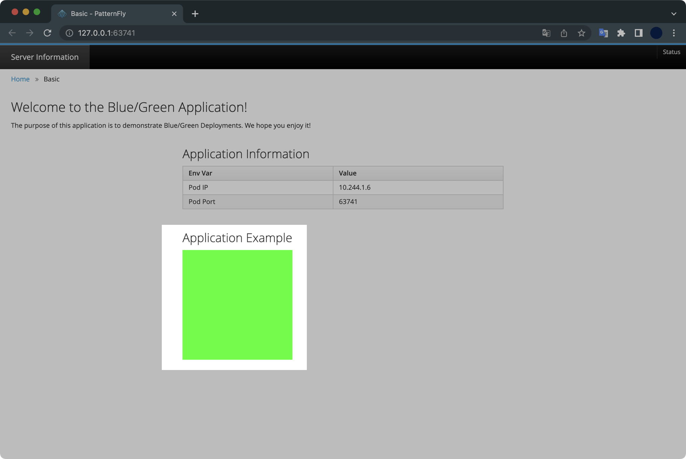

## 개요

ArgoCD는 쿠버네티스 클러스터와 함께 사용하는 대표적인 GitOps 구현체입니다.

이 글은 minikube 클러스터 환경에 ArgoCD를 설치하고 데모 어플리케이션을 배포해보는 일련의 과정들을 설명하고 있습니다.

&nbsp;

## 전제조건

- minikube가 설치되어 있어야 합니다.
- docker desktop이 설치되어 있어야 합니다.

macOS의 경우 패키지 관리자인 homebrew를 이용해 minikube와 docker dekstop 모두 쉽게 설치할 수 있습니다.  
물론 이 글에서 관련 패키지의 설치 과정까지 설명하지는 않습니다.

&nbsp;

## 환경

- **OS** : macOS Monterey 12.4 (M1 Pro)
- **Shell** : zsh + oh-my-zsh
- **minikube** v1.26.0 (brew로 설치함)
- **docker desktop** v20.10.16 (brew로 설치함)

저희가 구성할 ArgoCD 아키텍쳐는 다음과 같습니다.


&nbsp;

## 실습하기

### 1. minikube 클러스터 생성

`minikube` 명령어가 정상 동작하는지 확인합니다.

```bash
$ minikube version
minikube version: v1.26.0
commit: f4b412861bb746be73053c9f6d2895f12cf78565
```

&nbsp;

노드 3대로 구성된 minikube 클러스터를 생성합니다.

```bash
$ minikube start \
  --driver='docker' \
  --nodes=3 \
  --addons='ingress' \
  --kubernetes-version='stable'
```

minikube 클러스터를 생성할 때 `--addons` 옵션을 사용해서 ingress addons를 활성화해주는 게 중요 포인트입니다.

&nbsp;

**Addon 확인**  
`ingress` 애드온이 활성화되어 있는지 확인합니다.

```bash
$ minikube addons list
```

현재 `ingress` 애드온이 `enabled ✅`로 활성화된 상태입니다.

```bash
|-----------------------------|----------|--------------|--------------------------------|
|         ADDON NAME          | PROFILE  |    STATUS    |           MAINTAINER           |
|-----------------------------|----------|--------------|--------------------------------|
| ...                         | ...      | ...          | ...                            |
| ingress                     | minikube | enabled ✅   | 3rd party (unknown)            |
| ...                         | ...      | ...          | ...                            |
```

&nbsp;

**Node 확인**  
minikube 클러스터를 구성하는 노드 정보를 확인합니다.

```bash
$ kubectl get node
NAME           STATUS   ROLES           AGE   VERSION
minikube       Ready    control-plane   84m   v1.24.1
minikube-m02   Ready    <none>          82m   v1.24.1
minikube-m03   Ready    <none>          81m   v1.24.1
```

컨트롤 플레인 1대와 워커노드 2대로 구성되어 있습니다.  
모든 노드는 쿠버네티스 `v1.24.1`을 사용하고 있습니다.

&nbsp;

### 2. ArgoCD 설치

**네임스페이스 생성**  
`argocd` 네임스페이스를 생성합니다.

```bash
$ kubectl create namespace argocd
```

&nbsp;

#### ArgoCD 배포

이후 ArgoCD 설치 매니페스트를 다운로드 받는 동시에 `apply`로 배포합니다.

```bash
$ kubectl apply \
  -n argocd \
  -f https://raw.githubusercontent.com/argoproj/argo-cd/stable/manifests/install.yaml
```

stable 버전의 ArgoCD를 배포할 네임스페이스는 저희가 방금 만든 `argocd` 네임스페이스입니다.

&nbsp;

#### 배포 과정 모니터링

ArgoCD 컴포넌트 전체가 설치되기 까지 최소 2분 이상 소요됩니다.  
ArgoCD가 설치되는 동안 `watch` 명령어를 사용해 ArgoCD 관련 파드의 생성 과정을 모니터링합니다.

```bash
$ watch -d -n1 "kubectl get all -n argocd"
```

**watch 명령어 설명**  
`-d` : 값이 변화하면 터미널에 음영처리해서 표시해주는 옵션입니다.  
`-n1` : 모니터링을 1초 간격으로 진행한다는 의미입니다.

&nbsp;

argocd-server 서비스의 기본 타입은 `ClusterIP` 입니다.

```bash
$ kubectl get service argocd-server -n argocd
NAME            TYPE        CLUSTER-IP       EXTERNAL-IP   PORT(S)          AGE
argocd-server   ClusterIP   10.102.205.163   <none>        80/TCP,443/TCP   2m59s
```

&nbsp;

#### 서비스 설정

ArgoCD 설치가 완료되었으면 이제 ArgoCD 서비스 타입을 기본값인 `ClusterIP`에서 `LoadBalancer`로 변경합니다.

```bash
$ kubectl patch svc argocd-server \
  -n argocd \
  -p '{"spec": {"type": "LoadBalancer"}}'
service/argocd-server patched
```

&nbsp;

서비스 타입이 `ClusterIP`에서 `LoadBalancer`로 변경된 걸 확인할 수 있습니다.

```bash
$ kubectl get service argocd-server -n argocd
NAME            TYPE           CLUSTER-IP       EXTERNAL-IP   PORT(S)                      AGE
argocd-server   LoadBalancer   10.102.205.163   <pending>     80:31129/TCP,443:32744/TCP   3m46s
```

&nbsp;

### 3. ArgoCD 웹 접속

minikube에서 `arogcd` 서비스가 외부에 노출된 상태인지 확인합니다.

```bash
$ minikube service list | grep argocd
```

&nbsp;

minikube 클러스터 안에 서비스로 연결합니다.

```bash
$ minikube service argocd-server -n argocd
|-----------|---------------|-------------|---------------------------|
| NAMESPACE |     NAME      | TARGET PORT |            URL            |
|-----------|---------------|-------------|---------------------------|
| argocd    | argocd-server | http/80     | http://192.168.49.2:31129 |
|           |               | https/443   | http://192.168.49.2:32744 |
|-----------|---------------|-------------|---------------------------|
🏃  argocd-server 서비스의 터널을 시작하는 중
|-----------|---------------|-------------|------------------------|
| NAMESPACE |     NAME      | TARGET PORT |          URL           |
|-----------|---------------|-------------|------------------------|
| argocd    | argocd-server |             | http://127.0.0.1:63319 |
|           |               |             | http://127.0.0.1:63320 |
|-----------|---------------|-------------|------------------------|
[argocd argocd-server  http://127.0.0.1:63319
http://127.0.0.1:63320]
❗  Because you are using a Docker driver on darwin, the terminal needs to be open to run it.
```

위 명령어에서 `http://127.0.0.1:63320` 주소를 복사합니다.  
참고로 127.0.0.1 뒤에 붙는 포트는 각자 환경마다 다릅니다.

웹 브라우저를 열고 해당 주소로 접속하면 ArgoCD 로그인 페이지를 만나게 됩니다.


&nbsp;

Admin 계정의 패스워드는 Secret에 암호화되어 있습니다.  
Secret에서 뽑아낸 ArgoCD의 Admin 패스워드를 `ARGO_PASSWORD` 환경변수에 보관합니다.

```bash
$ ARGO_PASSWORD=$(kubectl get secret argocd-initial-admin-secret \
  -n argocd \
  -o jsonpath="{.data.password}" | \
  base64 -d)
```

Admin 패스워드를 확인해봅니다.

```bash
$ echo $ARGO_PASSWORD
cymW0qvyzHYuCIRN
```

패스워드도 마찬가지로 각자 환경마다 다르게 출력됩니다.

&nbsp;

이제 ArgoCD 웹페이지에서 로그인합니다.


- **ID** : admin
- **Password** : `echo $ARGO_PASSWORD`의 결과값 입력

&nbsp;

### 4. Application 배포하기

#### Application

ArgoCD는 `Application`이라는 단위의 커스텀 리소스로 관리합니다.  
`Application` CRD<sup>Custom Resource Definition</sup>는 환경에 배포된 애플리케이션 인스턴스를 나타내는 Kubernetes 리소스 개체입니다.  
Application은 쉽게 말해서 ArgoCD가 참조하는(지속적으로 배포하려고 하는) "깃허브 소스 레포지터리" 대상이라고 이해하면 쉽습니다.

&nbsp;

#### Deploy application

데모 어플리케이션의 매니페스트를 작성합니다.

```yaml
$ cat << EOF > ./bgd-application.yaml
apiVersion: argoproj.io/v1alpha1
kind: Application
metadata:
  name: bgd-application
  namespace: argocd
spec:
  destination:
    namespace: bgd
    server: https://kubernetes.default.svc 
  project: default 
  source: 
    path: apps/bgd/overlays/bgd
    repoURL: https://github.com/redhat-developer-demos/openshift-gitops-examples
    targetRevision: minikube
  syncPolicy: 
    automated:
      prune: true
      selfHeal: false
    syncOptions:
    - CreateNamespace=true
EOF
```

저희가 배포하려는 데모 어플리케이션의 깃허브 레포지터리 주소는 <https://github.com/redhat-developer-demos/openshift-gitops-examples>입니다.  
`bgd`는 blue-green deployment의 약자입니다.

&nbsp;

작성한 매니페스트를 사용해서 데모 어플리케이션을 배포합니다.  
매니페스트에 이미 `namespace: argocd` 값이 포함되어 있기 때문에, 배포할 때 네임스페이스 지정 옵션인 `-n`을 생략해도 됩니다.

```bash
$ kubectl apply -f bgd-application.yaml
application.argoproj.io/bgd-application created
```

&nbsp;

데모 어플리케이션은 기본적으로 `bgd` 네임스페이스를 사용하도록 설정되어 있습니다.

```bash
$ kubectl get all -n bgd
```

&nbsp;

데모 어플리케이션의 구조는 크게 보면 Deployment와 Service로 구성되어 있습니다.

```bash
NAME                       READY   STATUS    RESTARTS   AGE
pod/bgd-696c9d9497-mqwpz   1/1     Running   0          2m19s

NAME          TYPE       CLUSTER-IP    EXTERNAL-IP   PORT(S)          AGE
service/bgd   NodePort   10.99.5.226   <none>        8080:32085/TCP   2m19s

NAME                  READY   UP-TO-DATE   AVAILABLE   AGE
deployment.apps/bgd   1/1     1            1           2m19s

NAME                             DESIRED   CURRENT   READY   AGE
replicaset.apps/bgd-696c9d9497   1         1         1       2m19s
```

&nbsp;

ArgoCD 웹에서 데모 어플리케이션의 구성을 확인합니다.


&nbsp;

ArgoCD는 각 Application을 구성하는 모든 리소스를 시각화해서 보여줍니다.  
이러한 시각화 기능 때문에 많은 기업들이 ArgoCD를 사용하고 있습니다.


&nbsp;

배포한 어플리케이션 웹페이지에 접속합니다.

```bash
$ minikube service bgd -n bgd
```

기본 브라우저가 열리면서 자동적으로 서비스를 통해 `bgd-application`의 웹페이지로 접속됩니다.


&nbsp;

#### Change application

어플리케이션의 정보를 변경해서 적용합니다.

```bash
$ kubectl patch deploy/bgd \
  -n bgd \
  --type='json' \
  -p='[{"op": "replace", "path": "/spec/template/spec/containers/0/env/0/value", "value":"green"}]'
deployment.apps/bgd patched
```

웹페이지를 새로고침해서 확인해보면 파란색으로 보이던 웹페이지가 초록색으로 변경되는 걸 확인할 수 있습니다.



&nbsp;

이후 Deployment의 배포 상태를 모니터링합니다.

```bash
$ kubectl rollout status deploy/bgd -n bgd
```

```bash
Waiting for deployment "bgd" rollout to finish: 1 old replicas are pending termination...
Waiting for deployment "bgd" rollout to finish: 1 old replicas are pending termination...
deployment "bgd" successfully rolled out
```

&nbsp;

다시 파란색으로 변경해봅니다.

```bash
$ kubectl patch deploy/bgd \
  -n bgd \
  --type='json' \
  -p='[{"op": "replace", "path": "/spec/template/spec/containers/0/env/0/value", "value":"blue"}]'
deployment.apps/bgd patched
```

&nbsp;

### 5. selfHeal 기능 활성화

`bgd-application`의 selfHeal 플래그를 `true`로 설정해서 selfHeal 기능을 활성화합니다.

```bash
$ kubectl patch application/bgd-application \
  -n argocd \
  --type=merge \
  -p='{"spec":{"syncPolicy":{"automated":{"prune":true,"selfHeal":true}}}}'
application.argoproj.io/bgd-application patched
```

&nbsp;

ArgoCD 웹페이지에서 Prune과 Self Heal 기능이 활성화되어 있는지 여부를 확인합니다.


Application에서 [APP DETAILS] 버튼을 클릭합니다.

&nbsp;


bgd-application에서 Prune Resources와 Self Heal 기능 둘 다 활성화되어 있는 걸 확인할 수 있습니다.

- **Prune Resources** : 깃허브 소스가 업데이트될 때 이전 쿠버네티스 리소스(교체된 Pod, 교체된 ReplicaSet 등)를 자동으로 제거하는 옵션입니다. 안전상의 이유로 ArgoCD의 Prune Resource 값은 기본적으로 비활성화(`false`) 설정되어 있습니다.  
  [ArgoCD 공식문서](https://argo-cd.readthedocs.io/en/stable/user-guide/auto_sync/#automatic-pruning)
- **Self Heal** : `selfHeal` 플래그를 `true`로 설정(활성화)하면 ArgoCD가 지속적으로 git repository의 설정값과 운영 환경 값의 싱크를 맞춥니다. 기본적으로 5초마다 계속해서 sync를 시도하게 됩니다. 시도하는 간격은 `argocd-application-controller` deployment에 설정된 `--self-heal-timeout-seconds` 값입니다.  
  [ArgoCD 공식문서](https://argo-cd.readthedocs.io/en/stable/user-guide/auto_sync/#automated-sync-semantics)

&nbsp;

## 정리하기

실습환경을 정리하기 위해서 minikube 클러스터를 삭제합니다.

```bash
$ minikube delete
```

결과값은 다음과 같습니다.

```bash
🔥  docker 의 "minikube" 를 삭제하는 중 ...
🔥  Deleting container "minikube" ...
🔥  Deleting container "minikube-m02" ...
🔥  Deleting container "minikube-m03" ...
🔥  /Users/guest/.minikube/machines/minikube 제거 중 ...
🔥  /Users/guest/.minikube/machines/minikube-m02 제거 중 ...
🔥  /Users/guest/.minikube/machines/minikube-m03 제거 중 ...
💀  "minikube" 클러스터 관련 정보가 모두 삭제되었습니다
```

3대의 minikube 노드가 삭제된 걸 확인할 수 있습니다.

&nbsp;

```bash
$ kubectl get node
The connection to the server localhost:8080 was refused - did you specify the right host or port?
```

모든 노드가 사라진 걸 확인할 수 있습니다.

&nbsp;

## 마치며

이것으로 minikube 환경의 ArgoCD 튜토리얼을 마치겠습니다.  
해당 자료는 Red Hat Developer에 게시된 [ArgoCD Tutorial](https://redhat-scholars.github.io/argocd-tutorial/argocd-tutorial/01-setup.html)을 기반으로 작성했습니다.
