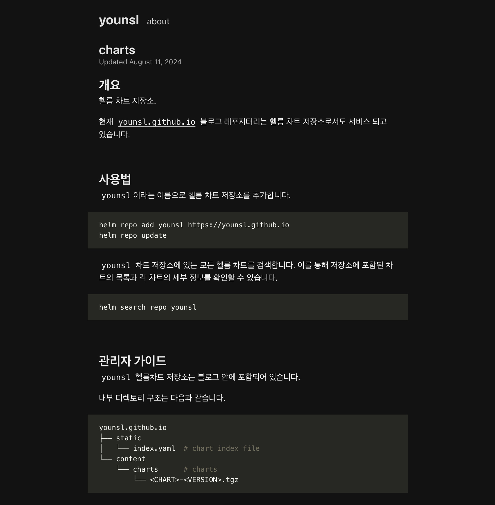

## 개요

Github Pages로 호스팅되고 있는 깃헙 블로그를 오픈소스 헬름 차트 저장소로 활용하는 방법을 설명합니다.

이 가이드를 따라 차트 저장소인 `charts`와 블로그 레포지토리인 `<username>.github.io`를 통합하여, 블로그 레포지터리 내에 차트 저장소를 포함시키는 구조로 변경했습니다.

&nbsp;

## 환경

### 블로그 레포지터리

- **대상 레포지터리 이름** : `younsl.github.io`
- **프레임워크** : Hugo 0.130.0
- Github Pages로 호스팅되고, Github Actions에 의해 `main` 브랜치 기준으로 배포되는 블로그 레포지터리입니다. 자세한 사항은 [deploy.yml](https://github.com/younsl/younsl.github.io/blob/main/.github/workflows/deploy.yml) Workflow를 참고하세요.


&nbsp;

## 차트 저장소 구성 및 사용 가이드

> **주의사항**: 이 가이드에서 차트 저장소로 사용할 블로그는 호스팅 플랫폼으로 Github Pages와 Go 언어 기반의 정적 사이트 생성기인 [Hugo](https://github.com/gohugoio/hugo)를 사용하고 있습니다. 따라서 다른 호스팅 플랫폼을 사용하는 경우 차트 저장소 구성 방법이 다를 수 있습니다.

### 구성방법

#### 헬름 차트 준비

블로그 레포지터리 루트 디렉토리에서 `content` 디렉토리 밑에 `charts` 디렉토리를 새롭게 생성합니다.

```bash
mkdir content/charts
```

&nbsp;

`charts/` 디렉토리 밑에 호스팅할 차트 디렉토리들을 추가합니다.

```bash {hl_lines=["12-17"]}
$ tree -L 3 -I 'public|resources'
younsl.github.io
├── LICENSE
├── README.md
├── assets
├── config.toml
├── content
│   ├── about
│   ├── blog
│   │   └── ... blog contents ...
│   └── charts
│       ├── actions-runner      # chart directory
│       ├── argocd-apps         # chart directory
│       ├── backup-utils        # chart directory
│       ├── index.md            # index page
│       ├── karpenter-nodepool  # chart directory
│       └── rbac                # chart directory
├── static
└── themes
```

&nbsp;

`charts/index.md` 페이지를 추가해서 차트 저장소에 대한 [소개 페이지](https://younsl.github.io/charts/)를 만듭니다.



&nbsp;

#### 차트 패키징

사용자들에게 제공할 각 차트 디렉토리를 `.tgz` 압축파일 하나로 패키징하는 작업입니다.

```bash
$ cd ./content/charts
$ helm package actions-runner --destination .
Successfully packaged chart and saved it to: /Users/younsung.lee/github/younsl/younsl.github.io/content/charts/actions-runner-0.1.2.tgz
$ helm package argocd-apps --destination .
Successfully packaged chart and saved it to: /Users/younsung.lee/github/younsl/younsl.github.io/content/charts/argocd-apps-1.6.1.tgz
```

&nbsp;

결과적으로 다음과 같이 `.tgz` 파일들이 `charts` 디렉토리에 위치합니다.

```bash {hl_lines=["13","15"]}
$ tree -F -L 3 -I 'public|resources'
younsl.github.io/
├── LICENSE
├── README.md
├── assets/
├── config.toml
├── content/
│   ├── about.md
│   ├── blog/
│   │   └── ... blog contents ...
│   └── charts/
│       ├── actions-runner/
│       ├── actions-runner-0.1.2.tgz # Generated
│       ├── argocd-apps/
│       ├── argocd-apps-1.6.1.tgz    # Generated
│       └── ...
├── static/
└── themes/
```

&nbsp;

#### index.yaml 생성

helm 차트 저장소에서 `index.yaml` 파일은 Helm 리포지토리의 차트 목록과 해당 메타데이터를 관리하는 중요한 역할을 합니다. 이 파일은 주로 Helm 리포지토리를 구성하고, 클라이언트가 사용할 수 있는 차트를 안내하는 역할을 합니다.

아래는 `index.yaml` 파일의 예시입니다.

```yaml
apiVersion: v1
entries:  # [1]
  actions-runner:
  - apiVersion: v2  # [2]
    created: "2024-08-13T17:37:46.096019+09:00"  # [3]
    description: A Helm chart for Kubernetes to deploy GitHub Actions runners include  # [4]
      horizontalRunnerAutoscaler and serviceAccount
    digest: 9cf400390b27ed2d214aecdeafc7797e13aa623dd04b8f850196e92d891a8419
    maintainers:  # [5]
    - email: cysl@kakao.com
      name: younsl
      url: younsl.github.io
    name: actions-runner  # [6]
    sources:  # [7]
    - https://github.com/younsl/charts/
    urls:  # [8]
    - https://younsl.github.io/charts/actions-runner-0.1.2.tgz
    version: 0.1.2  # [9]
  backup-utils:
    # ... truncated ...
```

- `[1]` 리포지토리에 포함된 차트들을 나타내며, 각 차트는 이름을 키로 가지는 목록으로 표시됩니다. 여기서는 actions-runner라는 이름의 차트를 나타냅니다.
- `[2]` 이 차트(actions-runner)의 API 버전을 나타냅니다. 이는 차트 내부에서 사용되는 Kubernetes API의 버전을 의미합니다.
- `[3]` 차트가 생성된 날짜와 시간을 나타냅니다. 여기서는 2024-08-13에 생성된 것을 알 수 있습니다.
- `[4]` 차트의 간단한 설명입니다. 이 예시에서는 GitHub Actions 러너를 배포하기 위한 Helm 차트임을 설명하고 있습니다.
- `[5]` 차트의 유지 관리자 정보입니다. 이름, 이메일, URL 등이 포함됩니다. 이 예시에서는 younsl이라는 유지 관리자의 정보가 제공됩니다.
- `[6]` 차트의 이름입니다. 이 예시에서는 `actions-runner`라는 이름을 사용하고 있습니다.
- `[7]` 차트의 소스 코드가 위치한 URL을 나타냅니다. 이 예시에서는 GitHub 리포지토리를 가리키고 있습니다.
- `[8]` 차트의 패키지가 저장된 위치를 나타내는 URL입니다. 클라이언트는 이 URL을 통해 차트를 다운로드할 수 있습니다.
- `[9]` 차트의 버전을 나타냅니다. 이 예시에서는 `0.1.2` 버전입니다.

&nbsp;

`index.yaml` 파일을 생성합니다.

```bash
cd static
helm repo index ../content/charts/ --url https://younsl.github.io/charts/
```

`--url` 옵션에는 실제 헬름 차트 압축파일<sup>.tgz</sup>들이 위치하게 될 블로그 웹페이지 주소로 지정합니다.

위 명령어를 실행하면 차트 경로와 버전 정보 등의 메타데이터가 담긴 `index.yaml` 파일이 `/content/charts/` 디렉토리 안에 새롭게 생성됩니다.

&nbsp;

생성된 `index.yaml` 파일을 `static` 디렉토리 안으로 이동시킵니다.

```bash
mv ../content/charts/index.yaml ./index.yaml
```

Gatsby, Hugo와 같은 정적 사이트 생성기에서는 `static` 디렉토리에 있는 모든 파일들이 빌드 시 결과물의 루트 디렉토리로 복사됩니다. 예를 들어, `static/index.yaml`이라는 파일이 있다면, 빌드 후 결과물에서는 `/index.yaml` 경로로 접근할 수 있습니다.

결과적으로 `static/index.yaml`은 `https://<USERNAME>.github.io/index.yaml` 형태로 호스팅됩니다.

&nbsp;

결과적으로 다음과 같은 디렉토리 구조로 헬름 저장소가 구성됩니다.

```bash
younsl.github.io/
├── LICENSE
├── README.md
├── assets/
├── config.toml
├── content/
│   ├── about.md
│   ├── blog/
│   │   └── ... blog contents ...
│   └── charts/
│       ├── actions-runner/      # chart package
│       ├── argocd-apps/         # chart package
│       ├── backup-utils/        # chart package
│       ├── index.md             # index page
│       ├── karpenter-nodepool/  # chart package
│       └── rbac/                # chart package  
├── static/
│   └── index.yaml               # chart index file
└── themes/
```

지금까지 블로그 레포지터리의 변경사항을 모두 `git push` 해서 반영합니다.

&nbsp;

Github Pages로 배포가 완료되었는지 확인하기 위해, `index.yaml` 파일이 정상적으로 다운로드되는지 체크합니다.

```bash
curl \
  -s \
  -o /dev/null \
  -w "HTTP Status: %{http_code}, Total Time: %{time_total} seconds, Download Size: %{size_download} bytes" \
  https://younsl.github.io/index.yaml
```

`index.yaml` 파일이 정상적으로 호스팅되고 있으면 HTTP 상태 코드가 `200`이며, 다음과 같은 출력을 볼 수 있습니다.

```bash
HTTP Status: 200, Total Time: 0.446528 seconds, Download Size: 3173 bytes
```

이제 차트 저장소가 사용자들에게 정상적으로 호스팅되고 있음을 확인했습니다.

&nbsp;

### 사용방법

#### 헬름 레포 추가

헬름 레포를 추가합니다.

```bash
helm repo add younsl https://younsl.github.io
```

&nbsp;

helm 레포지터리를 업데이트합니다. 이 과정은 로컬에 저장된 차트 저장소 정보를 최신 상태로 동기화합니다.

```bash
helm repo update
```

&nbsp;

#### 사용 가능한 차트 목록 조회

이제 `younsl` 차트 저장소(Repository)에서 사용할 수 있는 차트 목록을 조회할 수 있습니다. 이 명령어는 차트 저장소에 저장된 모든 차트와 해당 차트의 버전, 앱 버전, 설명을 출력합니다.

```bash
helm search repo younsl
```

&nbsp;

예상 출력은 다음과 같습니다:

```bash
NAME                        CHART VERSION  APP VERSION  DESCRIPTION
younsl/actions-runner       0.1.2                       A Helm chart for Kubernetes to deploy GitHub Ac...
younsl/argocd-apps          1.6.1                       A Helm chart for managing additional Argo CD Ap...
younsl/github-backup-utils  0.3.1          3.11.4       GitHub Enterprise Backup Utilities
younsl/karpenter-nodepool   0.1.1          0.1.0        A Helm chart for Karpenter nodepool, it will cr...
younsl/rbac                 0.1.0          0.1.0        Helm chart to define RBAC resources in the gito...
```

여기서 `NAME`은 차트의 이름, `CHART VERSION`은 차트의 버전, `APP VERSION`은 해당 차트가 설치하는 애플리케이션의 버전, DESCRIPTION은 차트의 간단한 설명입니다.

&nbsp;

#### 템플릿 YAML 다운로드

테스트를 위해 차트로부터 helm template yaml을 받아봅니다.

```bash
helm template younsl/actions-runner
```

`helm template <REPO_NAME>/<CHART_NAME>` 형태로 명령어를 실행해 차트에서 생성될 리소스들의 YAML 파일을 미리 확인할 수 있습니다.

&nbsp;

예상 출력은 다음과 같습니다:

```yaml
---
# Source: actions-runner/templates/serviceaccount.yaml
apiVersion: v1
kind: ServiceAccount
metadata:
  name: doge-basic-runner
  labels:
    helm.sh/chart: actions-runner-0.1.2
    app.kubernetes.io/name: actions-runner
    app.kubernetes.io/instance: release-name
    app.kubernetes.io/managed-by: Helm
  annotations:
    eks.amazonaws.com/role-arn: arn:aws:iam::111122223333:role/doge-eks-cluster-actions-build-runner-s3-access-irsa-role
---
# Source: actions-runner/templates/horizontalrunnerautoscaler.yaml
```

Helm 차트가 생성할 ServiceAccount와 기타 리소스들의 구성 파일을 미리 확인할 수 있습니다. 이를 통해 Kubernetes 클러스터에 실제 배포하기 전에 필요한 설정을 조정할 수 있습니다.

&nbsp;

이제 Github Pages로 만들어진 블로그를 헬름 차트 저장소로도 활용할 수 있습니다.

&nbsp;

## 관련자료

- [차트 저장소 가이드](https://helm.sh/ko/docs/topics/chart_repository/)
- [샘플 레포지터리](https://github.com/younsl/younsl.github.io)
- [Github Pages로 제공한 차트 페이지](https://younsl.github.io/charts/)
