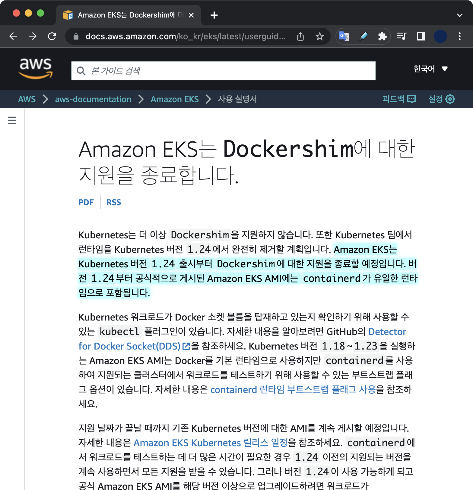

## 발단

컨테이너를 관리하는 프로그램을 컨테이너 런타임<sup>Container Runtime</sup>이라고 부른다.  

쿠버네티스는 v1.20 이후 컨테이너 런타임으로서 도커를 사용 중단<sup>deprecating</sup>하기로 결정했다.  
쿠버네티스 v1.20 버전부터는 dockershim이 사용 중단되었다<sup>`deprecated`</sup>는 경고 메세지가 출력된다.  

```bash
Using dockershim is deprecated, please consider using a full-fledged CRI implementation
```

&nbsp;

이 메세지의 의미는 도커에 내장된 컨테이너 런타임인 dockershim이 곧 삭제된다는 의미이다.  
쿠버네티스 v1.24 버전부터 dockershim 삭제가 확정된 상태이다.

&nbsp;

## 변경사항

컨테이너 런타임으로 docker 대신 containerd를 사용할 경우, kubelet과 docker 사이에서 중간다리 역할을 하는 dockershim이 완전히 제거된다는 게 핵심이다.

&nbsp;

### kubelet 아키텍쳐 변경

컨테이너 런타임으로 docker 대신에 containerd를 사용할 경우, docker와 달리 중간다리 역할을 하는 dockershim이 필요없다.

개선될 컨테이너 런타임의 아키텍처는 다음과 같다.

")

containerd를 사용하면 `kubelet`이 CRI를 통해 파드를 생성, 제어할 때 아키텍쳐가 더 간결해지고 이는 파드 시작 시 지연시간 감소, 처리성능 향상 등의 결과로 이어진다.

&nbsp;

### 파드 시작시 지연시간 비교

아래 그래프는 dockershim과 containerd의 파드 시작시 지연시간을 비교한 자료이다.  
막대 그래프가 낮을 수록 파드를 시작하는 속도가 빠름을 의미낸다.

")

Containerd가 Dockershim보다 파드 시작에 걸리는 시간이 약 20% 더 빠르다.

&nbsp;

## 이유

Kubernetes가 컨테이너 런타임에서 dockershim을 지원 중단하기로 결정한 배경에 대해 알아본다.

&nbsp;

### 도커의 방치

도커의 개발사인 Docker, Inc.는 도커에 내장된 컨테이너 런타임인 dockershim을 2019년 3월 이후로 2년 넘게 업데이트 없이 방치했다.

쿠버네티스는 1년간 도커가 dockershim을 개선해주기를 기다렸으나 도저히 개선되지 않자 지원 중단을 결정했다.

&nbsp;

### 쿠버네티스와의 호환성

쿠버네티스는 <abbr title="Container Runtime Interface">CRI</abbr> 표준을 사용해 컨테이너 런타임과 통신한다.  
그러나 docker는 CRI 표준을 지키지 않고 별도로 dockershim이라는 컴포넌트를 통해 변환을 거쳐 도커 전용 인터페이스로 변환해 사용해왔다.

중개인<sup>broker</sup> 역할인 dockershim 때문에 발생하는 불필요하고 복잡한 구조 때문에 쿠버네티스 측에서 소프트웨어 유지보수가 어려워졌다.

&nbsp;

## 영향/해결책

Kubernetes 클러스터 관리자의 관점에서의 시스템 영향과 해결방안.

&nbsp;

### 컨테이너 이미지

컨테이너 이미지는 <abbr title="Open Container Initiative">OCI</abbr> 표준을 따른다.  
따라서 dockershim이 아닌 containerd와 같은 다른 컨테이너 런타임을 사용하더라도 기존처럼 컨테이너 생성, 삭제, 제어할 수 있다.

단순히 여러 컨테이너 런타임 중 하나인 dockershim이 쿠버네티스에서 사라지는 것 뿐이다.  
쿠버네티스의 리소스인 파드나 이를 구성하는 컨테이너라는 개념 자체가 사라지는 건 아니기 때문에 기존에 잘 사용하던 컨테이너 이미지를 업데이트하거나 변경하는 등의 조치는 필요없다.

&nbsp;

### 온프레미스 환경의 컨테이너 런타임

쿠버네티스 클러스터를 구성하는 핵심 컴포넌트에는 컨트롤 플레인과 워커 노드가 있다.  
쿠버네티스 클러스터 관리자는 이 두 타입의 전체 노드에서 컨테이너 런타임을 변경해주는 마이그레이션 작업이 필요하다.

dockershim을 대체할 컨테이너 런타임은 크게 2가지로 요약할 수 있다.  
containerd과 CRI-O. 두 컨테이너 런타임 중 하나를 선택해 마이그레이션하면 된다.

> 컨테이너 런타임을 docker에서 containerd나 CRI-O로 변경하게 될 경우, 기존에 사용하던 `docker`로 시작하는 명령어는 전부 사용할 수 없게 되니 참고하자.
>
> `docker` 명령어를 대체하는 대표적인 CLI 툴로 `nerdctl`, `crictl` 등이 있다.

**Alert**  
참고로 CRI-O와 Containerd는 갑자기 혜성처럼 나타난 초기 버전의 오픈소스는 아니다.  
컨테이너가 등장한 초기 시점부터 dockershim과 양립하고 있던 오픈소스 진영이었다.

&nbsp;

#### **CRI-O**

Red Hat, 인텔, SUSE, Hyper, IBM의 관리자와 컨트리뷰터들이 만든 커뮤니티 중심의 오픈소스 프로젝트이다.  
CRI-O는 container를 실행하는 역할만 담당하고 있다. 도커의 dockershim과 동일한 역할.  
CRI-O는 image build, CLI, image registry 생성 등의 부가 기능은 수행하지 못하기 때문에 이 역할을 담당하는 별도 소프트웨어를 추가로 조합해서 써야한다.

2017년에 CRI-O v1.0이 출시되었다.

&nbsp;

#### **containerd**

단순성, 견고성 및 이식성을 강조하는 산업 표준 컨테이너 런타임.

containerd는 Linux 및 Windows 노드에서 사용할 수 있다. 이미지 전송 및 저장, 컨테이너 실행 및 관리, 로우레벨 스토리지, 네트워크 연결 등에 이르기까지 호스트 시스템의 전체 컨테이너 수명 주기를 관리하는 데몬이다.  
containerd는 2019년 2월 28일부로 Kubernetes, Prometheus, Envoy 및 CoreDNS에 이어 <abbr title="Cloud Native Computing Foundation">CNCF</abbr> 내에서 공식적으로 졸업<sup>graduated</sup>한 성숙한 프로젝트이다.

&nbsp;

### EKS 환경의 컨테이너 런타임

Amazon EKS의 경우 [AWS 공식문서](https://docs.aws.amazon.com/ko_kr/eks/latest/userguide/dockershim-deprecation.html)를 통해 몇 버전부터 컨테이너 런타임으로 dockershim을 사용할 수 없는 지 확인한다.

2022년 8월 기준으로 EKS v1.24 버전부터는 노드에 컨테이너 런타임으로 유일하게 `containerd`만 지원한다.



Amazon EKS 버전 1.23에서 dockershim을 계속 지원하더라도 지금부터 미리 애플리케이션 테스트를 시작하여 Docker 종속성을 식별하고 제거하는 것이 장기적으로 편하다.  
이는 AWS가 EKS 사용자들에게 권고하고 있는 사항이다.

**중요**  
기존에 운영 중인 EKS v1.23 이하의 EKS 클러스터들의 경우, EKS 노드 수준에서 docker 종속성을 제거해야만 EKS 클러스터를 버전 1.24로 업데이트할 준비가 된다.

&nbsp;

#### containerd 직접 살펴보기

AWS의 관리형 쿠버네티스 서비스인 EKS에서 v1.24 버전을 사용중인 워커 노드에 직접 접속했습니다.  
워커 노드 안에서 `containerd`에 대해 직접 확인한 결과는 다음과 같습니다.

&nbsp;

기본적으로 EKS 전용 AMI 이미지에는 `containerd`가 미리 설치되어 있습니다.

```bash
# On worker node of EKS v1.24 version
$ rpm -qa containerd
containerd-1.6.6-1.amzn2.0.2.x86_64
```

&nbsp;

Containerd를 관리하려면 `ctr` 명령어를 사용합니다.

```bash
$ ctr version
Client:
  Version:  1.6.6
  Revision: 10c12954828e7c7c9b6e0ea9b0c02b01407d3ae1
  Go version: go1.18.6

Server:
  Version:  1.6.6
  Revision: 10c12954828e7c7c9b6e0ea9b0c02b01407d3ae1
  UUID: e441287b-85f9-4eb6-8d5c-214588128e6f
```

&nbsp;

워커 노드에서 시스템 데몬을 통해 `containerd` 엔진이 구동중입니다.

```bash
# On worker node of EKS v1.24 version
$ systemctl status containerd
```

```bash
● containerd.service - containerd container runtime
   Loaded: loaded (/usr/lib/systemd/system/containerd.service; enabled; vendor preset: disabled)
  Drop-In: /etc/systemd/system/containerd.service.d
           └─00-runtime-slice.conf, 10-compat-symlink.conf
   Active: active (running) since Wed 2023-02-08 04:48:31 UTC; 1 weeks 2 days ago
     Docs: https://containerd.io
 Main PID: 4543 (containerd)
    Tasks: 221
   Memory: 578.0M
   CGroup: /runtime.slice/containerd.service
           ├─ 1260 /usr/bin/containerd-shim-runc-v2 -namespace k8s.io -id 065c794b43695bc93246f609d42f8b0870ac7c798ae762f0277756431c9fc56e -address /run/containerd/containerd.sock
           ├─ 4543 /usr/bin/containerd
           ├─ 4863 /usr/bin/containerd-shim-runc-v2 -namespace k8s.io -id bb88290c4fd89625ed954c54cf925ab78f3a73baf2e23933e68376ba50c6a08b -address /run/containerd/containerd.sock
           ├─ 4864 /usr/bin/containerd-shim-runc-v2 -namespace k8s.io -id 0df2a779bc49f04fb2043eb26f2967237aa6ac142849c982c9bcb085fd2a8890 -address /run/containerd/containerd.sock
           ├─ 5695 /usr/bin/containerd-shim-runc-v2 -namespace k8s.io -id 9682b13dd2fd125fae4cdf39285962cabfa7581e3180dd3bd40c3cc5bc6da058 -address /run/containerd/containerd.sock
           ├─ 9369 /usr/bin/containerd-shim-runc-v2 -namespace k8s.io -id 0674fe84c54462a32c657fc33a755f00e1580dd7a53e9edf24934b2b830b800f -address /run/containerd/containerd.sock
           ├─15239 /usr/bin/containerd-shim-runc-v2 -namespace k8s.io -id a47834f4cf64463fa4faad39e3d4bdc511362a6bea4c5fcda860d237802a667f -address /run/containerd/containerd.sock
           ├─15348 /usr/bin/containerd-shim-runc-v2 -namespace k8s.io -id 55400466687fa15d0adb7dfd39c05bf67245b38627af6e7d5d1ed47e74e3b3b0 -address /run/containerd/containerd.sock
           ├─15446 /usr/bin/containerd-shim-runc-v2 -namespace k8s.io -id 1540ee7a82275d7161bcc8ae1bfa443fb941df88ee5dc7f611be2c185791a45a -address /run/containerd/containerd.sock
           ├─21932 /usr/bin/containerd-shim-runc-v2 -namespace k8s.io -id 98f8020329508634804254afe7076144f84ab34c64587e8ea5269d5ac6c8963e -address /run/containerd/containerd.sock
           ├─21968 /usr/bin/containerd-shim-runc-v2 -namespace k8s.io -id c269750107e1851e7f681e558dca8829f347ded4d4c92776bb420d9493965250 -address /run/containerd/containerd.sock
           ├─22611 /usr/bin/containerd-shim-runc-v2 -namespace k8s.io -id 008937b7219e3e7ba8058689b0c64fe10b732f7cb3f9c59500c786f230be554e -address /run/containerd/containerd.sock
           ├─22683 /usr/bin/containerd-shim-runc-v2 -namespace k8s.io -id eb14b3425970cd8a4a47de8718b034f8d2b567b6024d8c981b10bc45dd0b01da -address /run/containerd/containerd.sock
           ├─25550 /usr/bin/containerd-shim-runc-v2 -namespace k8s.io -id 6be4955ee30ae52c85e72ad5601ba22d1ca33407b197a8fbf7635208ac98c834 -address /run/containerd/containerd.sock
           ├─26365 /usr/bin/containerd-shim-runc-v2 -namespace k8s.io -id 95ce29c699a5250cca139f74c889445a39d9ac979af9cf1aa931043c799bf0ff -address /run/containerd/containerd.sock
           └─27533 /usr/bin/containerd-shim-runc-v2 -namespace k8s.io -id da918b0bbf3b9931354c12bbf47868e8c2b2330bc757203aa55b648e17b422c3 -address /run/containerd/containerd.sock

Feb 18 00:13:13 ip-xx-xxx-xxx-xxx.ap-northeast-2.compute.internal containerd[4543]: time="2023-02-18T00:13:13.090159292Z" level=info msg="Finish port forwarding for \"6be4955ee30ae52c85e72ad5601ba22d1c...port xxxx"
...
Hint: Some lines were ellipsized, use -l to show in full.
```

&nbsp;

워커 노드에 파드가 배포되면 `containerd`에 의해 컨테이너들이 구동됩니다.  
클러스터 관리자는 워커 노드(EC2)에 접속해서 `ctr` 명령어를 통해 해당 노드에 어떤 컨테이너들이 구동되고 있는지 확인할 수 있습니다.

```bash
# ctr version : v1.6.6
# On worker node of EKS v1.24 version
$ ctr -n k8s.io c ls
```

```bash
CONTAINER                                                           IMAGE                                                                                                     RUNTIME
033a8649a6c6c1a0c83347c3990cf9f3c48b5fcdcd7aa7ca23d117ee2528224f    xxxxxxxxxxxx.dkr.ecr-fips.us-east-1.amazonaws.com/eks/pause:3.5                                           io.containerd.runc.v2
1a9b058d0821cac1bf0beabc857437932c7bb8b45338c673e90a14a36d18728b    quay.io/strimzi/operator:0.33.1                                                                           io.containerd.runc.v2
...
f944670f06c0cf67f858243d1c92fd41bb9a0ad7280314bcfd36125dee99ec27    xxxxxxxxxxxx.dkr.ecr-fips.us-east-1.amazonaws.com/eks/pause:3.5                                           io.containerd.runc.v2
```

&nbsp;

## 참고자료

[Don't Panic: Kubernetes and Docker](https://kubernetes.io/blog/2020/12/02/dont-panic-kubernetes-and-docker/)  
쿠버네티스 공식문서

[Amazon EKS는 Dockershim에 대한 지원을 종료합니다.](https://docs.aws.amazon.com/ko_kr/eks/latest/userguide/dockershim-deprecation.html)  
AWS 공식문서

[Amazon EKS now supports Kubernetes version 1.24](https://aws.amazon.com/ko/blogs/containers/amazon-eks-now-supports-kubernetes-version-1-24/)  
AWS 블로그 글
