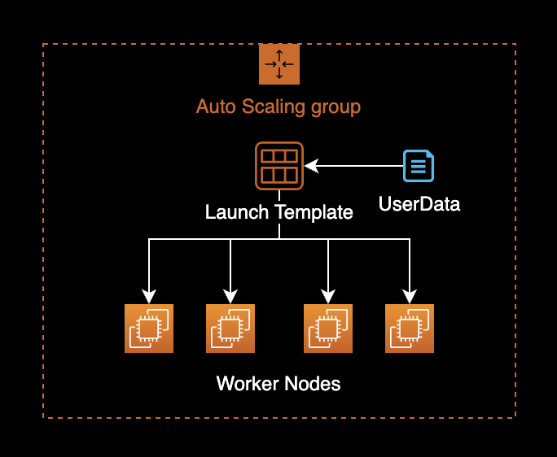

## 개요

Kubelet에서 자동으로 컨테이너 이미지를 정리하도록 Image Garbage Collection을 설정하는 방법을 소개합니다.

&nbsp;

이 글에서는 크게 2가지 워커노드 운영 방식에 대해서 Image Garbage Collection 설정방법을 다룹니다.

- EKS 노드그룹이 관리하는 EC2 워커노드 환경에서 Image Garbage Collection 설정하기
- Cluster Autoscaling을 담당하는 Karpenter에서 관리하는 EC2 워커노드 환경에서 Image Garbage Collection 설정하기

&nbsp;

## 배경지식

### Image Garbage Collection

Image Garbage Collection 기능을 잘 활용하면, EKS 워커노드의 호스트에서 구동되는 Containerd 데몬이 사용하는 디스크 공간을 효율적으로 사용할 수 있으며 불필요한 이미지와 레이어를 자동으로 삭제하여 디스크 공간을 절약할 수 있습니다.

&nbsp;

## 환경

### EKS

- **EKS v1.24**
- **Karpenter v0.27.0**

&nbsp;

### 로컬 환경

- **OS** : macOS Ventura 13.2.1
- **Shell** : zsh + oh-my-zsh
- **AWS CLI** : 2.11.2

&nbsp;

## 설정방법

### EKS 노드그룹

#### UserData 확인

EKS EC2 노드그룹은 Auto Scaling Group과 Launch Template 기반으로 운영됩니다.



&nbsp;

기존 워커노드에서 사용하는 Launch Template의 UserData 설정 정보를 확인합니다.

```bash
$ LT_ID=lt-xxxxxxxxxxxxxxxxx
```

`LT_ID` 환경변수에는 현재 EKS 노드그룹에서 사용중인 Launch Template ID를 입력합니다.

&nbsp;

해당 Launch Template의 UserData 설정 정보를 확인합니다.

```bash
$ aws ec2 describe-launch-template-versions \
    --launch-template-id $LT_ID \
    --query 'LaunchTemplateVersions[*].LaunchTemplateData.UserData' \
    --output text \
    | base64 --decode \
    && echo -e '\n'
```

```bash
MIME-Version: 1.0
Content-Type: multipart/mixed; boundary="//"

--//
Content-Type: text/x-shellscript; charset="us-ascii"
#!/bin/bash
set -ex
B64_CLUSTER_CA=LS0tLS1CRUdJTiBDR...CREDENTIAL...==
API_SERVER_URL=https://ExxxxxxFxxxxxxAExxAECBxCxDAxxxxx.sk1.ap-northeast-2.eks.amazonaws.com
K8S_CLUSTER_DNS_IP=172.20.0.10
/etc/eks/bootstrap.sh <YOUR_EKS_CLUSTER_NAME> --kubelet-extra-args '--node-labels=eks.amazonaws.com/nodegroup-image=ami-07xxxxxxx9xxxfxxx,eks.amazonaws.com/capacityType=ON_DEMAND,eks.amazonaws.com/nodegroup=dev-apne2-financial-x86-eks-node-group --max-pods=17' --b64-cluster-ca $B64_CLUSTER_CA --apiserver-endpoint $API_SERVER_URL --dns-cluster-ip $K8S_CLUSTER_DNS_IP --use-max-pods false

--//--
```

`--kubelet-extra-args` 옵션을 통해 Kubelet에 대한 상세 파라미터 설정을 관리하고 있습니다.

&nbsp;

#### UserData 수정

AWS 콘솔에 접속한 후 Launch Template의 UserData 값을 수정합니다.

`--kubelet-extra-args`에 `--image-gc-low-threshold=50` `--image-gc-high-threshold=70` 옵션을 추가합니다.

```bash
MIME-Version: 1.0
Content-Type: multipart/mixed; boundary="//"

--//
Content-Type: text/x-shellscript; charset="us-ascii"
#!/bin/bash
set -ex
B64_CLUSTER_CA=LS0tLS1CRUdJTiBDR...CREDENTIAL...==
API_SERVER_URL=https://ExxxxxxFxxxxxxAExxAECBxCxDAxxxxx.sk1.ap-northeast-2.eks.amazonaws.com
K8S_CLUSTER_DNS_IP=172.20.0.10
/etc/eks/bootstrap.sh <YOUR_EKS_CLUSTER_NAME> --kubelet-extra-args '--node-labels=eks.amazonaws.com/nodegroup-image=ami-07xxxxxxx9xxxfxxx,eks.amazonaws.com/capacityType=ON_DEMAND,eks.amazonaws.com/nodegroup=dev-apne2-financial-x86-eks-node-group --max-pods=17 --image-gc-low-threshold=50 --image-gc-high-threshold=70' --b64-cluster-ca $B64_CLUSTER_CA --apiserver-endpoint $API_SERVER_URL --dns-cluster-ip $K8S_CLUSTER_DNS_IP --use-max-pods false

--//--
```

&nbsp;

##### Kubelet의 Image GC 설정 파라미터

`--image-gc-low-threshold=50`
디스크 사용률의 50% 이하까지는 Image Garbage Collection를 실행하지 않습니다.  
EKS 최적화 AMI 이미지에서의 기본값은 80[%]입니다.

`--image-gc-high-threshold=70'`  
디스크 사용률의 70% 이상부터는 항상 Image Garbage Collection을 실행합니다.  
EKS 최적화 AMI 이미지에서의 기본값은 85[%]입니다.

```bash
NAME                       TYPE   DESCRIPTION
--image-gc-high-threshold  int32  The percent of disk usage after which image garbage collection is always run. (default 85)
--image-gc-low-threshold   int32  The percent of disk usage before which image garbage collection is never run. Lowest disk usage to garbage collect to. (default 80)
```

&nbsp;

운영중인 EKS 노드의 Image Garbage Collection 설정을 확인하려면 다음 명령어를 실행해서 확인할 수 있습니다.

```bash
$ kubectl proxy
$ curl -sSL "http://localhost:8001/api/v1/nodes/<NODE_NAME>/proxy/configz" \
    | python3 -m json.tool
```

위 명령어에서 `<NODE_NAME>`은 Node name 이름으로 바꿔서 실행합니다.

&nbsp;

```json
{
    "kubeletconfig": {
        "enableServer": true,
        "syncFrequency": "1m0s",
        "fileCheckFrequency": "20s",
        "httpCheckFrequency": "20s",
        "address": "0.0.0.0",
        ...
        "imageGCHighThresholdPercent": 85,
        "imageGCLowThresholdPercent": 80,
        ...
    }
}
```

`--image-gc-high-threshold`의 기본값은 85[%], `--image-gc-low-threshold` 값의 기본값은 80[%] 입니다.

&nbsp;

기존 Launch Template에 UserData를 수정한 다음 AWS 콘솔에서 새로 저장합니다.

&nbsp;

#### Instance Refresh

변경된 유저 데이터를 기존에 있는 EKS 워커노드에 반영하기 위해 ASG의 [인스턴스 교체](https://docs.aws.amazon.com/ko_kr/autoscaling/ec2/userguide/start-instance-refresh.html)<sup>Instance Refresh</sup>를 진행합니다.

롤링 업데이트 방식으로 오토 스케일링 그룹이 EKS 워커노드를 한 대씩 교체하게 됩니다.

```bash
$ ASG_NAME=eks-dev-apne2-xxxxxxxxx-x86-eks-node-group-xxxxxxxx-xxxx-xxxx-xxxx-16ab56ee2fec
$ LT_ID=lt-xxxxxxxxxxxxxxxxx
```

```bash
$ aws autoscaling start-instance-refresh \
    --auto-scaling-group-name $ASG_NAME \
    --strategy Rolling \
    --preferences '{"MinHealthyPercentage": 100, "InstanceWarmup": 60}' \
    --desired-configuration '{
      "LaunchTemplate": {
        "LaunchTemplateId": "'${LT_ID}'",
        "Version": "$Latest"
      }
    }'
```

```bash
{
    "InstanceRefreshId": "ee2b6718-79cc-47ff-97d3-7001b374a3c1"
}
```

정상적으로 인스턴스 교체가 시작되면 다음과 같이 결과값으로 `InstanceRefreshId`를 반환합니다.

&nbsp;

### 결과 확인

워커 노드의 이름을 확인하려면 다음 명령을 실행합니다.

```bash
$ kubectl get node -o wide
```

```bash
NAME                                                STATUS   ROLES    AGE     VERSION                INTERNAL-IP      EXTERNAL-IP   OS-IMAGE         KERNEL-VERSION                  CONTAINER-RUNTIME
ip-xx-xxx-xxx-8.ap-northeast-2.compute.internal     Ready    <none>   6h15m   v1.24.10-eks-48e63af   xx.xxx.xxx.8     <none>        Amazon Linux 2   5.10.165-143.735.amzn2.x86_64   containerd://1.6.6
ip-xx-xxx-xxx-99.ap-northeast-2.compute.internal    Ready    <none>   23m     v1.24.9-eks-49d8fe8    xx.xxx.xxx.99    <none>        Amazon Linux 2   5.4.228-131.415.amzn2.x86_64    containerd://1.6.6
ip-xx-xxx-xxx-127.ap-northeast-2.compute.internal   Ready    <none>   6h20m   v1.24.10-eks-48e63af   xx.xxx.xxx.127   <none>        Amazon Linux 2   5.10.165-143.735.amzn2.x86_64   containerd://1.6.6
ip-xx-xxx-xxx-169.ap-northeast-2.compute.internal   Ready    <none>   6d5h    v1.24.10-eks-48e63af   xx.xxx.xxx.169   <none>        Amazon Linux 2   5.10.165-143.735.amzn2.x86_64   containerd://1.6.6
ip-xx-xxx-xxx-221.ap-northeast-2.compute.internal   Ready    <none>   24m     v1.24.9-eks-49d8fe8    xx.xxx.xxx.221   <none>        Amazon Linux 2   5.4.228-131.415.amzn2.x86_64    containerd://1.6.6
```

이 중에서 오토 스케일링 그룹의 Instance Refresh에 의해 새로 교체된 노드를 판단합니다.

&nbsp;

쿠버네티스 클러스터의 API 서버에 연결하기 위해 다음 [proxy 명령](https://kubernetes.io/ko/docs/concepts/cluster-administration/proxies/)을 실행합니다.

```bash
$ kubectl proxy
```

&nbsp;

```bash
$ curl -sSL "http://localhost:8001/api/v1/nodes/<NODE_NAME>/proxy/configz" \
    | python3 -m json.tool
```

위 명령어에서 `<NODE_NAME>`은 Node name 이름으로 바꿔서 실행합니다.

&nbsp;

```json
{
    "kubeletconfig": {
        "enableServer": true,
        "syncFrequency": "1m0s",
        "fileCheckFrequency": "20s",
        "httpCheckFrequency": "20s",
        "address": "0.0.0.0",
        ...
        "imageGCHighThresholdPercent": 70,
        "imageGCLowThresholdPercent": 50,
        ...
    }
}
```

UserData를 참조하여 `--image-gc-high-threshold` 값이 70[%], `--image-gc-low-threshold` 값이 50[%]로 변경된 걸 확인할 수 있습니다.

&nbsp;

### Karpenter

provisioners CRD에 아래 kubelet 설정을 추가합니다.

- `spec.kubeletConfiguration.imageGCHighThresholdPercent`
- `spec.kubeletConfiguration.imageGCLowThresholdPercent`

&nbsp;

provisioners YAML을 변경한 예시는 다음과 같습니다.

```diff
---
# Reference:
# https://karpenter.sh/v0.27.0/concepts/provisioners/
apiVersion: karpenter.sh/v1alpha5
kind: Provisioner
metadata:
  name: default
  labels:
    app: karpenter
    version: v0.27.0
    maintainer: younsung.lee
spec:
  # Enables consolidation which attempts to reduce cluster cost by both removing un-needed nodes and down-sizing those
  # that can't be removed.  Mutually exclusive with the ttlSecondsAfterEmpty parameter.
  consolidation:
    enabled: true

  # If omitted, the feature is disabled and nodes will never expire.  If set to less time than it requires for a node
  # to become ready, the node may expire before any pods successfully start.
  ttlSecondsUntilExpired: 1209600 # 14 Days = 60 * 60 * 24 * 14 Seconds;

  requirements:
    - key: karpenter.sh/capacity-type
      operator: In
      values: ["on-demand"]
    - key: karpenter.k8s.aws/instance-family
      operator: In
      values: ["t3a"]
    - key: karpenter.k8s.aws/instance-size
      operator: In
      values: ["nano", "micro", "small", "medium", "large", "xlarge"]
    - key: kubernetes.io/os
      operator: In
      values: ["linux"]
    - key: kubernetes.io/arch
      operator: In
      values: ["amd64"]
    - key: topology.kubernetes.io/zone
      operator: In
      values: ["ap-northeast-2a", "ap-northeast-2c"]
  providerRef:
    name: default

  # Karpenter provides the ability to specify a few additional Kubelet args.
  # These are all optional and provide support for additional customization and use cases.
+ kubeletConfiguration:
+   imageGCHighThresholdPercent: 70
+   imageGCLowThresholdPercent: 50
```

Karpenter Controller가 새 노드를 생성할 때 kubelet 설정에 지정한 값들을 주입하게 됩니다.

&nbsp;

kubelet 설정을 추가한 provisioner CRD를 생성합니다.

```bash
$ kubectl apply -f crds.yaml
```

이후 Karpenter Controller가 새로 생성하는 워커노드들에는 provisioner에 선언된 kubelet 설정이 오버라이딩 되어 적용됩니다.

&nbsp;

Karpenter Controller가 새 워커노드를 생성한 시점 이후에 kubelet 설정 적용 결과를 확인합니다.

```bash
$ curl -sSL "http://localhost:8001/api/v1/nodes/<NODE_NAME>/proxy/configz" \
    | python3 -m json.tool
```

```json
{
    "kubeletconfig": {
        "enableServer": true,
        "syncFrequency": "1m0s",
        "fileCheckFrequency": "20s",
        "httpCheckFrequency": "20s",
        "address": "0.0.0.0",
        ...
        "imageGCHighThresholdPercent": 70,
        "imageGCLowThresholdPercent": 50,
        ...
    }
}
```

새로 생성된 워커노드에서 `imageGCHighThresholdPercent`와 `imageGCLowThresholdPercent` 값이 지정한 값으로 설정된 걸 확인할 수 있습니다.

&nbsp;

## 참고자료

[지정된 디스크 사용량 비율로 이미지 캐시를 정리하도록 Amazon EKS 작업자 노드를 구성하려면 어떻게 해야 합니까](https://aws.amazon.com/ko/premiumsupport/knowledge-center/eks-worker-nodes-image-cache/)  
AWS Knowledge Center에 게시된 가이드

[How to configuring kubelet garbage collection in EKS Cluster](https://medium.com/@bsc0227/how-to-configuring-garbage-collection-in-eks-cluster-51d74cb3717d)
