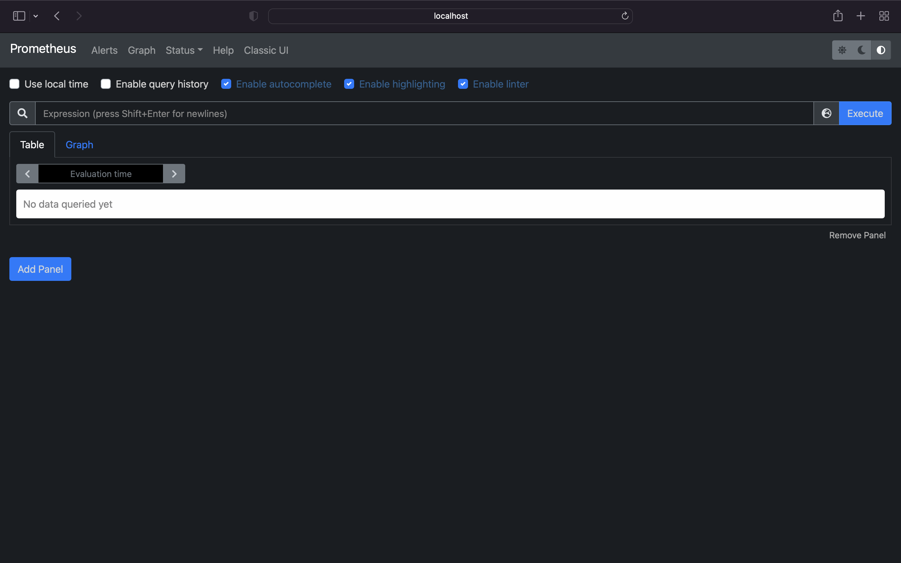
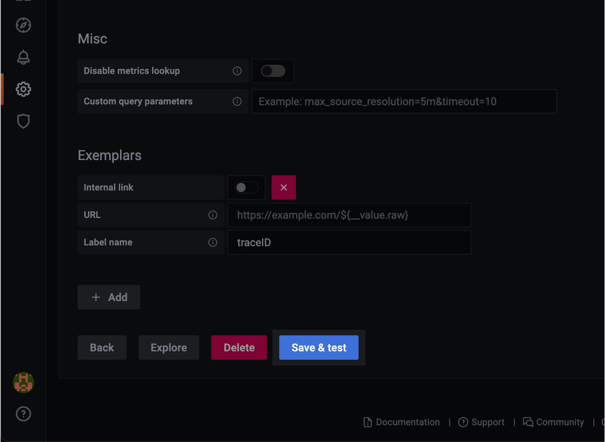
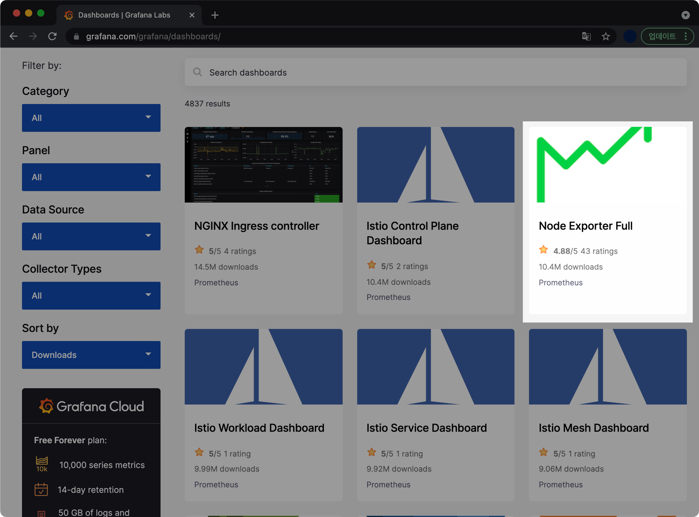

## 개요

minikube 기반의 로컬 쿠버네티스 환경에서 prometheus와 grafana를 설치, 구축하는 방법을 설명합니다.


&nbsp;

## 환경

* **Hardware** : MacBook Pro (13", M1, 2020)
* **OS** : macOS Monterey 12.0.1
* **패키지 관리자** : brew v3.3.5
* **Kubernetes 환경**
  * **Docker Desktop v4.2.0 (70708)** : Kubernetes 기능 활성화됨 (`Enable Kubernetes`)
  * **minikube v1.24.0** : brew를 이용하여 설치. 단일 노드 1개 생성.
  * **kubectl v1.22.4** : brew를 이용하여 설치
  * **helm v3.7.1** : brew를 이용하여 설치
  * **prometheus v2.31.1** : helm을 이용하여 설치 및 배포
  * **grafana v8.2.5** : helm을 이용하여 설치 및 배포

&nbsp;

## 본문

### 1. minikube, kubectl 설치

macOS용 채키지 관리자인 brew를 이용해 minikube와 kubectl을 설치합니다.

```bash
$ brew install minikube
```

```bash
$ brew install kubectl
```

&nbsp;

### 2. helm 3 설치

helm은 쿠버네티스의 패키지 관리자(Kubernetes Package Manager)입니다.  
helm을 이용하면 prometheus와 grafana를 설치와 동시에 자동 구성할 수 있습니다.

&nbsp;

#### helm 설치

macOS용 패키지 관리자인 brew를 이용해 `helm`을 설치합니다.  
brew를 이용해 설치하는 이유는 패키지 관리가 편리하기 때문입니다.

```bash
$ brew install helm
Updating Homebrew...
==> Auto-updated Homebrew!
Updated 2 taps (homebrew/core and homebrew/cask).
[...]
==> Downloading https://ghcr.io/v2/homebrew/core/helm/manifests/3.7.1
######################################################################## 100.0%
==> Downloading https://ghcr.io/v2/homebrew/core/helm/blobs/sha256:8587566f16cef
==> Downloading from https://pkg-containers.githubusercontent.com/ghcr1/blobs/sh
######################################################################## 100.0%
==> Pouring helm--3.7.1.arm64_monterey.bottle.tar.gz
==> Caveats
zsh completions have been installed to:
  /opt/homebrew/share/zsh/site-functions
==> Summary
🍺  /opt/homebrew/Cellar/helm/3.7.1: 60 files, 51MB
```

helm 3.7.1이 정상적으로 설치되었습니다. 60개의 파일이 포함되어 있고, helm의 용량은 51MB 입니다.  

&nbsp;

#### helm 설치 정보 확인

helm의 안정화된 버전(Stable)인 3.7.1이 설치되었습니다.  

버전정보 아래에는 `Kubernetes package manager`라는 간단한 설명이 적혀있습니다.  

```bash
$ brew info helm
helm: stable 3.7.1 (bottled), HEAD
Kubernetes package manager
https://helm.sh/
/opt/homebrew/Cellar/helm/3.7.1 (60 files, 51MB) *
  Poured from bottle on 2021-11-25 at 20:48:43
From: https://githubcom/Homebrew/homebrew-core/blob/HEAD/Formula/helm.rb
License: Apache-2.0
==> Dependencies
Build: go ✘
==> Options
--HEAD
	Install HEAD version
==> Caveats
zsh completions have been installed to:
  /opt/homebrew/share/zsh/site-functions
==> Analytics
install: 35,802 (30 days), 121,935 (90 days), 487,738 (365 days)
install-on-request: 35,054 (30 days), 119,382 (90 days), 477,316 (365 days)
build-error: 17 (30 days)
```

&nbsp;

#### helm 버전 확인

helm 명령어가 잘 실행되는 지 확인합니다.  

```bash
$ helm version
version.BuildInfo{Version:"v3.7.1", GitCommit:"1d11fcb5d3f3bf00dbe6fe31b8412839a96b3dc4", GitTreeState:"clean", GoVersion:"go1.17.2"}
```

&nbsp;

### 3. minikube 구성

minikube를 이용해 단일 노드로 구성된 kubernetes 환경을 먼저 만들고, 그 1대의 노드 위에 prometheus와 grafana를 배포해서 서비스할 계획입니다.  

이번 시나리오는 2대 이상의 멀티 노드가 아니라 마스터 노드 1개만으로 구성됩니다.  

&nbsp;

#### minikube 시작

docker 환경을 이용해서 minikube 노드 1개를 생성합니다. 해당 노드에 리소스는 2코어(`CPUs=2`)에 메모리가 `1988MB`가 할당되었습니다.

```bash
$ minikube start -p prom-demo
😄  [prom-demo] Darwin 12.0.1 (arm64) 의 minikube v1.24.0
✨  자동적으로 docker 드라이버가 선택되었습니다. 다른 드라이버 목록: virtualbox, ssh
👍  prom-demo 클러스터의 prom-demo 컨트롤 플레인 노드를 시작하는 중
🚜  베이스 이미지를 다운받는 중 ...
🔥  Creating docker container (CPUs=2, Memory=1988MB) ...
🐳  쿠버네티스 v1.22.3 을 Docker 20.10.8 런타임으로 설치하는 중
    ▪ 인증서 및 키를 생성하는 중 ...
    ▪ 컨트롤 플레인이 부팅...
    ▪ RBAC 규칙을 구성하는 중 ...
🔎  Kubernetes 구성 요소를 확인...
    ▪ Using image gcr.io/k8s-minikube/storage-provisioner:v5
🌟  애드온 활성화 : storage-provisioner, default-storageclass
🏄  끝났습니다! kubectl이 "prom-demo" 클러스터와 "default" 네임스페이스를 기본적으로 사용하도록 구성되었습니다.
```

`-p` 는 profile 옵션입니다. minikube에서는 profile을 통해 여러 개의 실습환경을 편하게 관리할 수 있습니다.

&nbsp;

#### profile 목록 확인

제 경우는 예전에 이미 생성해놓은 `mnlab` profile이 존재합니다. 그 아래에 방금 생성한 `prom-demo` profile이 보입니다.

```bash
$ minikube profile list
|-----------|-----------|---------|--------------|------|---------|---------|-------|
|  Profile  | VM Driver | Runtime |      IP      | Port | Version | Status  | Nodes |
|-----------|-----------|---------|--------------|------|---------|---------|-------|
| mnlab     | docker    | docker  | 192.168.49.2 | 8443 | v1.22.3 | Stopped |     4 |
| prom-demo | docker    | docker  | 192.168.49.2 | 8443 | v1.22.3 | Running |     1 |
|-----------|-----------|---------|--------------|------|---------|---------|-------|
```

prom-demo profile은 현재 1대의 노드로 구성되어 있으며 동작중(`Running`)입니다.  

&nbsp;

#### profile 상태 확인

```bash
$ minikube status -p prom-demo
prom-demo
type: Control Plane
host: Running
kubelet: Running
apiserver: Running
kubeconfig: Configured
```

`prom-demo` 라는 이름의 마스터 노드(`Control Plane`) 1대만 존재하고, 잘 실행되고 있는 상태입니다.

```bash
$ minikube node list -p prom-demo
prom-demo 192.168.49.2
```

&nbsp;

### 4. prometheus 설치 및 구성

```bash
$ kubectl create ns prometheus
namespace/prometheus created
```

`prometheus`라는 이름의 namespace를 새로 생성합니다.  
명령어의 `ns`는 namespace의 약어입니다.

&nbsp;

namespace 환경을 새로 생성한 `prometheus`로 변경해줍니다.

```bash
$ kubectl config set-context --current --namespace prometheus
Context "prom-demo" modified.
```

이제 `prometheus` namespace 안에 prometheus와 grafana를 설치할 계획입니다.

&nbsp;

컨텍스트 목록을 확인합니다.

```bash
$ kubectl config get-contexts
CURRENT   NAME             CLUSTER          AUTHINFO         NAMESPACE
          docker-desktop   docker-desktop   docker-desktop
*         prom-demo        prom-demo        prom-demo        prometheus
```

`NAMESPACE` 값이 `prometheus`로 변경된 걸 확인할 수 있습니다.

&nbsp;

#### repo 등록

```bash
$ helm repo add \
    prometheus-community https://prometheus-community.github.io/helm-charts
"prometheus-community" has been added to your repositories
```

`prometheus-community`라는 이름으로 repo(repository)를 등록합니다.

&nbsp;

#### repo 확인

```bash
$ helm repo list
NAME                  URL
prometheus-community  https://prometheus-community.github.io/helm-charts
```

`prometheus-community` repo가 새롭게 생성되었습니다.

&nbsp;

#### prometheus 설치

helm 차트를 이용해 prometheus를 설치합니다.

```bash
$ helm install \
    prometheus prometheus-community/prometheus
```

&nbsp;

실행 결과는 다음과 같습니다.  
`prometheus` 네임스페이스에 설치된 걸 확인할 수 있습니다.

```bash
NAME: prometheus
LAST DEPLOYED: Thu Nov 25 21:30:28 2021
NAMESPACE: prometheus
STATUS: deployed
REVISION: 1
TEST SUITE: None
NOTES:
The Prometheus server can be accessed via port 80 on the following DNS name from within your cluster:
prometheus-server.prometheus.svc.cluster.local


Get the Prometheus server URL by running these commands in the same shell:
  export POD_NAME=$(kubectl get pods --namespace prometheus -l "app=prometheus,component=server" -o jsonpath="{.items[0].metadata.name}")
  kubectl --namespace prometheus port-forward $POD_NAME 9090


The Prometheus alertmanager can be accessed via port 80 on the following DNS name from within your cluster:
prometheus-alertmanager.prometheus.svc.cluster.local


Get the Alertmanager URL by running these commands in the same shell:
  export POD_NAME=$(kubectl get pods --namespace prometheus -l "app=prometheus,component=alertmanager" -o jsonpath="{.items[0].metadata.name}")
  kubectl --namespace prometheus port-forward $POD_NAME 9093
#################################################################################
######   WARNING: Pod Security Policy has been moved to a global property.  #####
######            use .Values.podSecurityPolicy.enabled with pod-based      #####
######            annotations                                               #####
######            (e.g. .Values.nodeExporter.podSecurityPolicy.annotations) #####
#################################################################################


The Prometheus PushGateway can be accessed via port 9091 on the following DNS name from within your cluster:
prometheus-pushgateway.prometheus.svc.cluster.local


Get the PushGateway URL by running these commands in the same shell:
  export POD_NAME=$(kubectl get pods --namespace prometheus -l "app=prometheus,component=pushgateway" -o jsonpath="{.items[0].metadata.name}")
  kubectl --namespace prometheus port-forward $POD_NAME 9091

For more information on running Prometheus, visit:
https://prometheus.io/
```

helm으로 prometheus를 설치하면 prometheus는 pod 형태로 쿠버네티스 노드 위에 배포됩니다.  

&nbsp;

#### pod 배포 확인

prometheus 설치가 완료되면서 prometheus와 관련된 pod 5개가 배포된 걸 확인할 수 있습니다.  

현재 prometheus가 배포된 namespace 위치는 저희가 아까 새로 생성한 `prometheus`입니다.  

```bash
$ kubectl get po -n prometheus
NAME                                             READY   STATUS    RESTARTS   AGE
prometheus-alertmanager-74674b7775-gjhdm         2/2     Running   0          136m
prometheus-kube-state-metrics-58c5cd6ddb-2vjp5   1/1     Running   0          136m
prometheus-node-exporter-72m9k                   1/1     Running   0          136m
prometheus-pushgateway-88fd4899d-xqtzr           1/1     Running   0          136m
prometheus-server-5d455cb759-62f44               2/2     Running   0          136m
```

&nbsp;

##### prometheus pod 별 역할 설명


* `alertmanager` : alertmanager는 prometheus로부터 전달받은 경보(Alert)를 Email, Slack, Pagerduty 등 여러 방법을 이용해 관리자에게 보내는 역할을 합니다.
* `kube-state-metrics` : Kubernetes Cluster 내부의 자원(CPU, 메모리, 디스크 및 각 컨테이너가 사용하고 있는 리소스 현황, 네트워크 I/O, 정상 컨테이너, 비정상 컨테이너 개수 등)에 대한 매트릭을 수집해주는 exporter입니다.
* `node-exporter` : 서버 노드의 자원에 대한 매트릭을 수집해주는 exporter입니다.
* `pushgateway` : 매트릭을 푸시할 수 있는 중간 서비스입니다.
* `server` : Prometheus WEB UI를 띄울 수 있는 서버입니다.

&nbsp;

#### port-forward

prometheus-server 파드의 이름 `name`을 얻어서 `POD_NAME`이라는 환경변수에 저장합니다.

```bash
$ export POD_NAME=$(kubectl get pods --namespace prometheus -l "app=prometheus,component=server" -o jsonpath="{.items[0].metadata.name}")
```

&nbsp;

`POD_NAME` 환경변수를 확인합니다.

```bash
$ echo $POD_NAME
prometheus-server-5d455cb759-62f44
```

&nbsp;

POD_NAME 변수를 저장하는 명령어는 helm을 이용해 prometheus를 설치할 때 `NOTES` 부분에 이미 적혀있습니다.


&nbsp;

외부에서 9090 포트로 접속이 들어올 경우, prometheus-server(`prometheus-server-5d455cb759-62f44`) pod의 9090 포트로 연결해주도록 port-forward 설정합니다.

```bash
$ kubectl --namespace prometheus port-forward $POD_NAME 9090
Forwarding from 127.0.0.1:9090 -> 9090
Forwarding from [::1]:9090 -> 9090
Handling connection for 9090
Handling connection for 9090
```

&nbsp;

#### 접속 테스트

웹 브라우저를 열고 Prometheus 웹페이지 주소인 <http://localhost:9090>으로 접속합니다.



Prometheus 웹이 잘 실행됩니다.  
이제 Prometheus가 수집한 모니터링 데이터를 검색해서 테스트해봅시다.

&nbsp;

#### 수집 데이터 확인

prometheus가 쿠버네티스 노드로부터 데이터를 잘 가져왔는지 점검하는 단계입니다. 검색창(돋보기 아이콘)에 `kube_node_info`를 입력하고, Execute 버튼을 누릅니다.


1대 생성된 노드의 전체 정보가 나옵니다.

노드 관련 정보는 다음과 같습니다.

* `container_runtime_version` : docker://20.10.8
* `internal_ip` : 192.168.49.2
* `os_image` : Ubuntu 20.04.2 LTS
* `node` : prom-demo

&nbsp;

이제 `kubectl` 명령어로 node 정보를 출력해서 실제로 prometheus에서 수집된 정보와 비교해봅니다.  
명령어의 `-o wide` 옵션은 결과를 더 자세히 출력합니다.  
`no`는 node의 약자입니다.  

```bash
$ kubectl get no -o wide
NAME        STATUS   ROLES                  AGE   VERSION   INTERNAL-IP    EXTERNAL-IP   OS-IMAGE             KERNEL-VERSION     CONTAINER-RUNTIME
prom-demo   Ready    control-plane,master   50m   v1.22.3   192.168.49.2   <none>        Ubuntu 20.04.2 LTS   5.10.47-linuxkit   docker://20.10.8
```

prometheus 웹의 결과와 명령어 결과를 비교해보니 틀린 내용은 없습니다. prometheus가 쿠버네티스 노드에게서 데이터를 정상적으로 수집해왔습니다.

&nbsp;

### 5. grafana 설치 및 구성

grafana는 prometheus가 보내주는 시계열 매트릭 데이터를 시각화하는데 가장 최적화된 오픈소스 대시보드 툴입니다.  

&nbsp;

#### repo 등록

helm을 통해 grafana를 다운로드 받기 위해 먼저 repo를 등록합니다.  

```bash
$ helm repo add \
    grafana https://grafana.github.io/helm-charts
"grafana" has been added to your repositories
```

`grafana` 레포지터리가 새로 추가되었습니다.

&nbsp;

#### repo 확인

```bash
$ helm repo list
NAME                  URL
prometheus-community  https://prometheus-community.github.io/helm-charts
grafana               https://grafana.github.io/helm-charts
```

`grafana` 레포지터리가 새로 추가되었습니다.

&nbsp;

#### 설치

helm을 이용해 grafana를 설치합니다.

```bash
$ helm install grafana grafana/grafana
W1125 22:23:14.691555   19170 warnings.go:70] policy/v1beta1 PodSecurityPolicy is deprecated in v1.21+, unavailable in v1.25+
W1125 22:23:14.693706   19170 warnings.go:70] policy/v1beta1 PodSecurityPolicy is deprecated in v1.21+, unavailable in v1.25+
W1125 22:23:14.773504   19170 warnings.go:70] policy/v1beta1 PodSecurityPolicy is deprecated in v1.21+, unavailable in v1.25+
W1125 22:23:14.773573   19170 warnings.go:70] policy/v1beta1 PodSecurityPolicy is deprecated in v1.21+, unavailable in v1.25+
NAME: grafana
LAST DEPLOYED: Thu Nov 25 22:23:14 2021
NAMESPACE: prometheus
STATUS: deployed
REVISION: 1
NOTES:
1. Get your 'admin' user password by running:

   kubectl get secret --namespace prometheus grafana -o jsonpath="{.data.admin-password}" | base64 --decode ; echo

2. The Grafana server can be accessed via port 80 on the following DNS name from within your cluster:

   grafana.prometheus.svc.cluster.local

   Get the Grafana URL to visit by running these commands in the same shell:

     export POD_NAME=$(kubectl get pods --namespace prometheus -l "app.kubernetes.io/name=grafana,app.kubernetes.io/instance=grafana" -o jsonpath="{.items[0].metadata.name}")
     kubectl --namespace prometheus port-forward $POD_NAME 3000

3. Login with the password from step 1 and the username: admin
#################################################################################
######   WARNING: Persistence is disabled!!! You will lose your data when   #####
######            the Grafana pod is terminated.                            #####
#################################################################################
```

helm을 통해 grafana를 설치하면 prometheus와 동일하게 쿠버네티스 노드 위에 pod 형태로 배포됩니다.  

`NOTES:` 부분에는 grafana 설정 가이드가 나와 있습니다. 미리 숙지하면 편합니다.

&nbsp;

#### grafana 배포상태 확인

helm을 통해 grafana를 설치하면 node에 pod, service, deployment, replicaset이 알아서 배포됩니다.

```bash
$ kubectl get all -l app.kubernetes.io/instance=grafana
NAME                          READY   STATUS    RESTARTS   AGE
pod/grafana-59f986bdc-mbrcg   1/1     Running   0          99m

NAME              TYPE        CLUSTER-IP      EXTERNAL-IP   PORT(S)   AGE
service/grafana   ClusterIP   10.102.81.160   <none>        80/TCP    99m

NAME                      READY   UP-TO-DATE   AVAILABLE   AGE
deployment.apps/grafana   1/1     1            1           99m

NAME                                DESIRED   CURRENT   READY   AGE
replicaset.apps/grafana-59f986bdc   1         1         1       99m
```

`-l` 옵션에 grafana 라벨이 붙은 객체들만 보이도록 제한을 걸면 헷갈리지 않고 grafana 관련 리소스, 오브젝트 목록만 확인할 수 있습니다.  

&nbsp;

helm에서도 배포상태를 확인합니다.

```bash
$ helm list
NAME      	NAMESPACE 	REVISION	UPDATED                             	STATUS  	CHART             	APP VERSION
grafana   	prometheus	1       	2021-11-25 22:23:14.520143 +0900 KST	deployed	grafana-6.17.7    	8.2.5
prometheus	prometheus	1       	2021-11-25 21:30:28.306396 +0900 KST	deployed	prometheus-14.12.0	2.31.1
```

grafana v8.2.5는 정상적으로 `prometheus` 네임스페이스에 배포된 상태(`deployed`)로 확인됩니다.

&nbsp;

#### admin 계정의 패스워드 찾기

자동 생성된 grafana 웹페이지의 admin 계정의 패스워드를 찾는 절차입니다.  

grafana 설치시 참고사항(`NOTES:`)에 적힌 명령어 1번부터 차례대로 실행합니다.  

```bash
$ kubectl get secret --namespace prometheus grafana -o jsonpath="{.data.admin-password}" | base64 --decode ; echo
kJYxA6F19BN3TAWcHwsOpqcCOGMJ9sXM1cxOiWxK
```

admin 계정의 암호가 출력됩니다. 이 암호는 잠시후 grafana 웹페이지에 admin 계정으로 로그인할 때 사용되므로 잘 기록해둡니다.

&nbsp;

#### port-forward

외부에서 3000번 포트로 접속이 들어올 경우 grafana pod로 연결해주도록 port-forward 설정을 해줍니다.

```bash
$ export POD_NAME=$(kubectl get pods --namespace prometheus -l "app.kubernetes.io/name=grafana,app.kubernetes.io/instance=grafana" -o jsonpath="{.items[0].metadata.name}")
```

```bash
$ echo $POD_NAME
grafana-59f986bdc-mbrcg
```

```bash
$ kubectl --namespace prometheus port-forward $POD_NAME 3000
Forwarding from 127.0.0.1:3000 -> 3000
Forwarding from [::1]:3000 -> 3000
```

&nbsp;

#### 로그인

<http://localhost:3000> 으로 접속하면 Grafana 로그인 화면이 나옵니다.


아까 찾은 admin 계정의 패스워드를 입력한 후 로그인합니다.

&nbsp;

Grafana 초기화면입니다.


&nbsp;

#### 데이터 소스 연결

Prometheus는 데이터 수집, Grafana는 데이터 시각화를 담당합니다. Grafana에서 Data source라는 용어는 prometheus, influxDB와 같은 시계열 메트릭 데이터를 담고 있는 대상 데이터베이스라고 생각하면 됩니다. Grafana는 반드시 Data source와 네트워크 연결이 되어야 데이터 시각화를 할 수 있습니다.  

이제 Grafana에 데이터 소스를 등록하는 단계입니다.  

&nbsp;

Configuration → Data sources → Add data source 클릭


&nbsp;

Prometheus → Select 버튼 클릭


&nbsp;

데이터 소스를 설정하는 화면입니다.  


&nbsp;

#### URL 확인방법

data source를 등록하기 위해 먼저 prometheus-server의 IP, Port 정보를 알아야 합니다.  

prometheus-server의 Endpoint 정보를 확인합니다.  
명령어에서 `ep`는 endpoint의 약자입니다.  

```bash
$ kubectl get ep prometheus-server
NAME                ENDPOINTS         AGE
prometheus-server   172.17.0.6:9090   12h
```

제 기준에서 `prometheus-server`의 Endpoint IP는 `172.17.0.6`, 포트는 `9090` 입니다.  
Endpoint IP는 파드가 재생성되면 언제든 변경될 수 있기 때문에, 실무 환경에서는 절대 이렇게 사용하지 않습니다.  

**주의사항**  
`prometheus-server`의 Endpoint IP 주소는 각자 다를 수 있기 때문에 제 주소를 그대로 적어서 넣으면 통신불가로 인한 `Bad gateway` 오류가 발생합니다. 반드시 `kubectl get ep prometheus-server` 명령어로 직접 확인후 입력 바랍니다.

&nbsp;

**입력결과**


- **URL** :  위에서 확인한 `prometheus-server`의 endpoint 정보를 입력해줍니다.
- **Access** : Server (default)

**참고사항**  
Access의 종류 중 하나인 Browser(직접) 액세스는 더 이상 사용되지 않으며 조만간 최신 버전에서 제거될 예정입니다. [Grafana 공식문서](https://grafana.com/docs/grafana/latest/datasources/prometheus/#prometheus-settings)

&nbsp;



URL 값을 입력했다면 맨 아래에 위치한 Save & test 버튼을 눌러줍니다.  

&nbsp;

Grafana가 Prometheus와 정상 연결되었을 경우 `Data source is working` 메세지가 출력됩니다.


이제 Prometheus로 수집한 데이터를 시각화할 대시보드만 생성해주면 작업은 끝납니다.

&nbsp;

#### grafana dashboard import

[Grafana Labs](https://grafana.com/grafana/dashboards/) 공식 사이트에서 제공하는 대시보드 레이아웃들 중에서 마음에 드는걸 골라서 Import로 불러올 수 있습니다.

&nbsp;

Grafana Labs 사이트에 접속해서 메인화면에 보이는 Node Exporter Full를 클릭합니다.



&nbsp;

Node Exporter Full 대시보드는 Node Exporter가 수집한 노드 관련 정보를 디테일하게 표시해주는 레이아웃의 대시보드입니다.


Node Exporter Full의 Dashboard ID 값인 1860을 기억해둡니다.  
잠시후 Node Exporter Full 대시보드를 불러오는 단계(Import)에서 해당 ID 값 입력이 필요합니다.

&nbsp;

'+' 아이콘(Create) → Import 클릭


&nbsp;

Dashboard ID인 `1860` 입력 → 우측 Load 버튼 클릭


&nbsp;

Prometheus 선택 → Import


&nbsp;


Grafana 공식 사이트에 업로드된 Node Exporter Full 대시보드를 받아 환경에 생성한 결과입니다.  

CPU Basic, Memory Basic, Network Traffic Basic 등의 노드 데이터 수집도 정상적으로 진행되고 있습니다.  

&nbsp;

이제 Helm 차트를 사용해서 Prometheus와 Grafana를 배포하는 작업이 완료되었습니다.

&nbsp;

## 결론

Kubernetes 환경에서 Prometheus + Grafana는 이제 선택을 넘어서 엔지니어에게 필수로 요구되는 모니터링 기술 스택입니다.  

Prometheus는 모니터링 데이터를 수집하는 역할, Grafana는 Prometheus가 수집한 데이터를 관리자가 보기 좋게 시각화하는 역할을 담당합니다. 컨테이너 인프라 환경에서는 많은 종류의 소규모 기능이 각각 작은 단위로 나뉘어진 마이크로서비스 아키텍쳐로 개발 및 배포되기 때문에 반드시 중앙 모니터링이 필요합니다. 이때 효율적으로 모니터링할 수 있는 테크 스택 중 하나가 Prometheus와 Grafana의 조합입니다. Prometheus와 Grafana는 컨테이너 형태로 패키징되어 동작하며 최소한의 자원으로 쿠버네티스 클러스터의 상태를 시각적으로 표현합니다.  

기업의 규모 가릴 것 없이 모니터링 목적으로 사용하는 테크 스택이기 때문에 심도 있게 배워두면 취업 뿐만 아니라 커리어에도 큰 도움이 될 거라고 생각합니다.  

&nbsp;

## 참고자료

[Prometheus Architecture](https://prometheus.io/docs/introduction/overview/)  
prometheus 공식문서의 아키텍처 소개 자료입니다.

[Bad gateway 네트워크 이슈 발생시 참고](https://stackoverflow.com/questions/48338122/grafana-http-error-bad-gateway-and-templating-init-failed-errors)  
stackoverflow의 질문글입니다.
