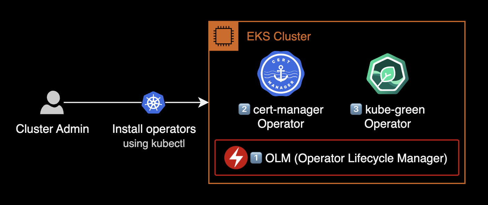
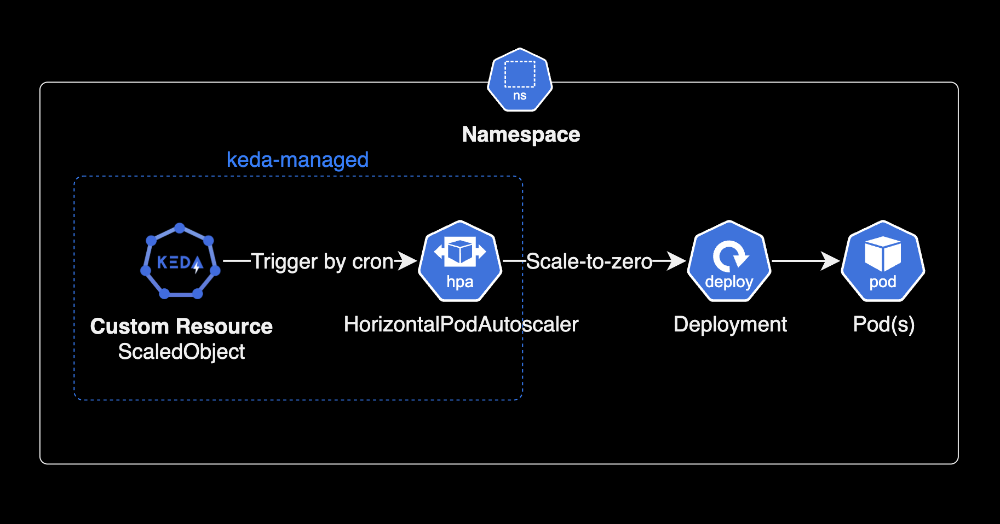

## 개요

리소스를 자동 절약하게 관리해주는 쿠버네티스 에드온인 kube-green을 설치하는 가이드입니다.

&nbsp;

## 배경지식

### kube-green

kube-green은 Deployments가 관리하는 Pod, CronJob 등의 리소스가 필요하지 않을 때 해당 리소스를 자동으로 종료하는 간단한 쿠버네티스 애드온입니다.


kube-green을 쿠버네티스 클러스터에 설치해서 운영하면 **컴퓨팅 비용 절약**과 **환경 보호** 두 가지를 모두 실천할 수 있습니다.

kube-green은 [CNCF Landscape에 Silver 멤버](https://landscape.cncf.io/?category=service-proxy&grouping=category&selected=kube-green)로 등록된 오픈소스 프로젝트이며, 이미 오래 전부터 검증된 쿠버네티스 에드온입니다.


&nbsp;

### 설치 가능한 클러스터 환경

[kube-green v0.5.0](https://github.com/kube-green/kube-green/releases/tag/v0.5.0) 기준으로 설치할 수 있는 쿠버네티스 클러스터 환경은 다음과 같습니다.

- **Kubernetes 클러스터 버전** : `>= 1.19` `<= 1.26`
- **CPU 아키텍처** : ARM64 또는 AMD64

자세한 사항은 kube-green 공식문서의 [Prerequisite](https://kube-green.dev/docs/install/#prerequisite)를 참고합니다.

&nbsp;

### kube-green이 제어하는 리소스

kube-green은 [sleepinfo](https://kube-green.dev/docs/configuration/)라고 하는 커스텀 리소스(CRD)를 통해 [아래 쿠버네티스 리소스](https://kube-green.dev/docs/lifecycle/#what-resources-handles)를 제어합니다.

- Deployment
- CronJobs

기본적으로, deployment 리소스는 제외하지 않는다면 sleepinfo에 지정된 시간동안에 파드가 0개로 유지됩니다.
만약 sleepinfo로 deployment와 더불어 cronjobs도 함께 일시 중지하려면 `suspendCronJobs` 값을 true로 설정합니다.

&nbsp;

### 사용 예시

#### 평일 근무시간에만 dev 클러스터 운영하기


- dev EKS 클러스터의 deployment와 pod를 근무시간 대인 오전 9시부터 오후 6시까지만 운영합니다.
- 이후 시간대인 오후 6시부터 오전 9시까지는 dev 파드를 0개로 유지합니다.
- 토요일과 일요일 주말 시간대에도 dev 파드를 0개로 유지합니다.
- 파드가 0개로 유지되면 [Kubernetes Cluster Autoscaler](https://github.com/kubernetes/autoscaler) 혹은 [Karpenter](https://karpenter.sh)가 비어있는 워커노드를 자동으로 drain 처리한 후 정리<sup>Deprovisioning</sup>합니다.

&nbsp;

## 환경

### 쿠버네티스 클러스터 환경

- EKS v1.24
- x86_64 기반의 `t3a.xlarge` EC2
- **Operator Lifecycle Manager v0.24.0**
- **cert-manager v1.11.0** : Helm 차트가 아닌 Operator 방식으로 설치합니다.
- **kube-green v0.5.0** : Helm 차트가 아닌 Operator 방식으로 설치합니다.

&nbsp;

### 로컬 환경

- **OS** : macOS Ventura 13.2.1
- **Shell** : zsh + oh-my-zsh

&nbsp;

## 설치하기

### 설치과정 요약

EKS 클러스터에 kube-green을 설치하는 과정은 총 3단계로 구성됩니다.



1. `olm` 설치 : OLM<sup>Operator Lifecycle Manager</sup>은 Kubernetes Operator를 사용하기 위해 필요한 에드온입니다.
2. `cert-manager` operator 설치
3. `kube-green` operator 설치

&nbsp;

#### 설치방식

일반적으로 쿠버네티스 클러스터에 어플리케이션을 설치하는 방식은 3가지로 구분됩니다.

- 직접 YAML manifest를 사용하여 `kubectl apply`로 설치
- Helm 차트 사용
- Kubernetes Operator 사용

이 시나리오에서는 Kubernetes Operator 방식을 활용하여 cert-manager와 kube-green을 설치합니다.

&nbsp;

#### 쿠버네티스 오퍼레이터의 이점

쿠버네티스 오퍼레이터 설치 방식의 가장 큰 장점은 애플리케이션을 쿠버네티스 클러스터에 배포하고 관리하는 과정을 자동화할 수 있다는 것입니다. 이렇게 하면 운영자들이 애플리케이션을 더 쉽게 관리하고 업데이트할 수 있으며, 설치 과정도 더 간단해집니다. 결과적으로 시스템을 효율적으로 운영하고 유지할 수 있는 이점을 제공합니다.

&nbsp;

### OLM 설치

[OLM](https://github.com/operator-framework/operator-lifecycle-manager)은 쿠버네티스 클러스터에 여러 오퍼레이터의 설치를 도와주고 관리해주는 프레임워크입니다.

OLM는 애플리케이션을 자동으로 관리해주는 설치 마법사 같은 역할을 합니다. OLM을 사용하면 다양한 에드온들을 클러스터에 설치하고 필요할 때 업데이트하고 관리하는 일을 손쉽게 할 수 있습니다.

&nbsp;

쿠버네티스 오퍼레이터를 설치하기 위해 클러스터에 OLM<sup>Operator Lifecycle Manager</sup>을 설치합니다.

> 이전에 이미 쿠버네티스 클러스터에 OLM을 설치한 경우, 아래 OLM 설치 과정을 건너뛰고 cert-manager operator 설치 단계로 이동합니다.

```bash
$ curl -sL https://github.com/operator-framework/operator-lifecycle-manager/releases/download/v0.24.0/install.sh \
    | bash -s v0.24.0
```

2023년 3월 23일 기준으로 최신 버전인 OLM [v0.24.0](https://github.com/operator-framework/operator-lifecycle-manager/releases/tag/v0.24.0)을 설치합니다.

&nbsp;

OLM 운영에 필요한 deployment와 Pod 상태를 확인해서 OLM 설치 결과를 확인합니다.

```bash
$ kubectl get deploy,pod \
    -n olm \
    -o wide
```

Operator Lifecycle Manager 파드는 기본값으로 `olm` 네임스페이스에 설치됩니다.

&nbsp;

### cert-manager 설치

[kube-green](https://github.com/kube-green/kube-green) 설치 전에 먼저 cert-manager를 설치합니다.

&nbsp;

cert-manager 설치시 참고한 가이드 문서는 다음과 같습니다.

- cert-manager 공식문서의 [Option 2: Installing from OperatorHub.io](https://cert-manager.io/docs/installation/operator-lifecycle-manager/#option-2-installing-from-operatorhubio)
- cert-manager 공식 [OperatorHub.io 페이지](https://operatorhub.io/operator/cert-manager)

&nbsp;

EKS 클러스터에 `cert-manager` Operator를 설치합니다.

```bash
$ kubectl create -f https://operatorhub.io/install/cert-manager.yaml
```

```bash
subscription.operators.coreos.com/my-cert-manager created
```

&nbsp;

operator 리소스 목록을 확인합니다.

```bash
$ kubectl get operators
NAME                     AGE
cert-manager.operators   2m58s
```

`cert-manager` operator가 새로 추가되었습니다.

&nbsp;

`csv`(clusterserviceversions) 리소스 목록을 조회합니다.

```bash
$ kubectl get csv
```

```bash
NAME                     DISPLAY          VERSION   REPLACES                 PHASE
cert-manager.v1.11.0     cert-manager     1.11.0    cert-manager.v1.10.2     Succeeded
```

잠시 기다리면 `cert-manager` Operator 상태가 `Installing`에서 `Succeeded`로 변경되며 설치가 완료됩니다.

&nbsp;

### kube-green 설치

> **설치방식에 대한 안내**  
> 이 가이드에서는 cert-manager와 kube-green 모두 헬름 차트를 사용한 설치 방법이 아닌 쿠버네티스 오퍼레이터 설치 방식을 사용합니다.

&nbsp;

EKS 클러스터에 `kube-green` operator를 설치합니다.

```bash
$ kubectl create -f https://operatorhub.io/install/kube-green.yaml
```

```bash
subscription.operators.coreos.com/my-kube-green created
```

`kube-green` operator가 생성되었습니다.

&nbsp;

클러스터에 생성된 operator 리소스 목록을 확인합니다.

```bash
$ kubectl get operators
NAME                     AGE
cert-manager.operators   11m
kube-green.operators     8s
```

cert-manager operator와 kube-green operator가 새로 생성된 걸 확인할 수 있습니다.

&nbsp;

설치한 `kube-green` operator의 현재 상태와 버전을 확인합니다.

```bash
$ kubectl get csv
```

```bash
NAME                     DISPLAY          VERSION   REPLACES                 PHASE
cert-manager.v1.11.0     cert-manager     1.11.0    cert-manager.v1.10.2     Succeeded
kube-green.v0.5.0        kube-green       0.5.0     kube-green.v0.4.1        Succeeded
```

잠시 기다리면 kube-green operator가 설치 완료됩니다.  
operator 설치가 완료되면 상태값이 `Installing`에서 `Succeeded`로 변경되는 걸 확인할 수 있습니다.

&nbsp;

## 구성하기

`kube-green` operator가 사용하는 CRD 목록을 확인합니다.

```bash
$ kubectl api-resources \
    --api-group='kube-green.com' \
    -o wide
```

```bash
NAME         SHORTNAMES   APIVERSION                NAMESPACED   KIND        VERBS                                                        CATEGORIES
sleepinfos                kube-green.com/v1alpha1   true         SleepInfo   delete,deletecollection,get,list,patch,create,update,watch
```

kube-green operator는 `sleepinfo`라고 하는 커스텀 리소스<sup>CRD</sup>를 사용해서 deployment의 파드를 제어하고 리소스를 절약합니다.

&nbsp;

kube-green 동작 테스트를 하기 위한 샘플 SleepInfo yaml을 작성합니다.

```bash
$ cat << EOF > sleepinfo-default.yaml
---
apiVersion: kube-green.com/v1alpha1
kind: SleepInfo
metadata:
  name: default-sleepinfo
  namespace: default            # 제어할 네임스페이스 지정
  labels:
    app: kube-green
    maintainer: "younsung.lee"
spec:
  weekdays: "*"                 # 매일
  sleepAt: "*:*"                # 항상
  suspendCronJobs: true         # deployments와 cronJob도 같이 종료
  timeZone: "Asia/Seoul"        # 기준시간은 Seoul
EOF
```

- default 네임스페이스에 deployments를 1년 365일 내내 0개 파드로 유지하는 SleepInfo 입니다.
- `spec.suspendCronJobs` 값이 `true`이므로 CronJobs 리소스도 1년 365일 내내 중지합니다.

&nbsp;

`default` 네임스페이스에 SleepInfo를 생성합니다.

```bash
$ kubectl apply -f sleepinfo-default.yaml
```

&nbsp;

`default` 네임스페이스에 SleepInfo가 생성되었습니다.

```bash
$ kubectl get sleepinfo -n default
NAME                AGE
default-sleepinfo   136m
```

&nbsp;

같은 네임스페이스의 deployment 상태를 확인합니다.

```bash
$ kubectl get pod -n default
```

```bash
NAME                    READY   STATUS        RESTARTS   AGE
nginx4-57cf9577-6fpcs   2/2     Terminating   0          8m22s
nginx4-57cf9577-qvzxj   2/2     Terminating   0          8m22s
nginx4-57cf9577-vbvzv   2/2     Terminating   0          2d1h
```

sleepinfo를 생성하자마자 deployments가 관리하는 파드들이 모두 삭제되는 걸 확인할 수 있습니다.

&nbsp;

sleepinfo에 의해 영향을 받은 deployment의 최근 이벤트 정보를 확인합니다.

```bash
$ kubectl describe deploy \
    -n default nginx4 \
    | grep -A5 '^Events'
```

```bash
Events:
  Type    Reason             Age   From                   Message
  ----    ------             ----  ----                   -------
  Normal  ScalingReplicaSet  31m   deployment-controller  Scaled up replica set nginx4-57cf9577 to 3
  Normal  ScalingReplicaSet  23m   deployment-controller  Scaled down replica set nginx4-57cf9577 to 0
```

sleepinfo 명령에 의해 deployment가 파드를 0개로 유지하는 걸 확인할 수 있습니다.

&nbsp;

deployment 정보를 다시 확인합니다.

```bash
$ kubectl get deploy -n default
```

```bash
NAME     READY   UP-TO-DATE   AVAILABLE   AGE
nginx4   0/0     0            0           34d
```

SleepInfo에 지정된 시간동안에는 deployment의 파드가 0개로 줄어든 상태로 계속 유지됩니다.

&nbsp;

SleepInfo의 요일, 잠자는 시간, 기상 시간에 대한 설정 방법은 [kube-green 공식문서](https://kube-green.dev/docs/configuration/)를 참고합니다.

```yaml
apiVersion: kube-green.com/v1alpha1
kind: SleepInfo
metadata:
  name: working-hours
spec:
  weekdays: "*"     # 요일 지정
  sleepAt: "20:00"  # 잠자는 시간 지정 (Pod 0개로 줄어듬)
  wakeUpAt: "08:00" # 깨어나는 시간 지정 (정상 상태로 복구)
  ...
```

&nbsp;

이것으로 kube-green 설치 및 구성 가이드를 마치도록 하겠습니다.

&nbsp;

## 더 나아가서

### kube-green으로 비용 절감하기

쿠버네티스 클러스터 환경에서 kube-green을 단독으로 사용하는 경우 워커노드의 컴퓨팅 비용 절감을 실현하기 어렵습니다.


쿠버네티스 클러스터의 워커 노드를 자동 삭제하고 늘려주는 Kubernetes Cluster Autoscaler 또는 Karpenter를 반드시 kube-green과 같이 조합해서 사용해야만 컴퓨팅 비용 절감을 실현할 수 있습니다.

&nbsp;

### Karpenter와 조합하기

헬름차트를 사용한 Karpenter 설치 및 구성 가이드는 아래에 있는 제 다른 포스트를 참조하시면 좋습니다.

[Karpenter 설치하기](/blog/k8s/karpenter)  
[karpenter 헬름 차트 버전 업그레이드](/blog/k8s/upgrade-karpenter/)

쿠버네티스 클러스터의 노드 오토스케일러인 CA<sup>Cluster Autsocaler</sup> 보다는 AWS에서 제공하는 Karpenter가 새 노드를 띄우는 시간이 빠르기 때문에 되도록이면 Karpenter 사용을 권장합니다.

&nbsp;

### 다른 대안

#### KEDA

특정 시간대에 파드의 scale-to-zero를 적용하는 것은 `kube-green`만 가능한 것은 아닙니다. KEDA<sup>Kubernetes-based Event Driven Autoscaling</sup>의 경우도 Cron Scaler를 사용하여 scale-to-zero를 지원합니다.



&nbsp;

scale-to-zero를 구현하기 위해 KEDA는 커스텀 리소스로 `ScaledObject`를 사용합니다. `kubectl` 명령어를 사용해서 KEDA에서 사용하는 Custom Resource 목록을 조회할 수 있습니다.

```bash
$ kubectl api-resources --api-group keda.sh
NAME                            SHORTNAMES               APIVERSION         NAMESPACED   KIND
clustertriggerauthentications   cta,clustertriggerauth   keda.sh/v1alpha1   false        ClusterTriggerAuthentication
scaledjobs                      sj                       keda.sh/v1alpha1   true         ScaledJob
scaledobjects                   so                       keda.sh/v1alpha1   true         ScaledObject
triggerauthentications          ta,triggerauth           keda.sh/v1alpha1   true         TriggerAuthentication
```

&nbsp;

아래는 cron scaler를 사용하여 한국시간<sup>KST</sup> 기준으로 매일 오전 9시부터 ~ 18시까지만 10개의 파드를 운영하고, 업무시간 외에는 비용 절감을 위해 scale-to-zero를 구현하는 예제입니다.

```yaml
apiVersion: keda.sh/v1alpha1
kind: ScaledObject
metadata:
  name: cron-scaledobject
  namespace: default
spec:
  scaleTargetRef:
    apiVersion: apps/v1
    kind: Deployment
    name: my-deployment
  minReplicaCount: 0
  cooldownPeriod: 300
  triggers:
  - type: cron
    metadata:
      timezone: "Asia/Seoul" # The acceptable values would be a value from the IANA Time Zone Database.
      start: "0 9 * * *"     # At 9:00 AM
      end: "0 18 * * *"      # At 6:00 PM
      desiredReplicas: "5"
```

- 근무 시간 외에 scale-to-zero를 적용하려면 ScaledObject에서 `minReplicaCount: 0`을 설정하고 근무 시간 동안에 `desiredReplicas`로 복제본을 늘려야 합니다.
- 기본적으로 ScaledObject의 `cooldownPeriod` 설정은 5분(300초)이므로 실제 파드 축소는 cron 일정 종료 매개변수로부터 5분 후에 발생합니다.

KEDA에 대한 더 자세한 정보는 [KEDA 공식 홈페이지](https://keda.sh/)와 [KEDA Github](https://github.com/kedacore/keda)에서 확인 가능합니다.

&nbsp;

## 참고자료

**kube-green**  
[Github kube-green](https://github.com/kube-green/kube-green)  
[kube-green docs](https://kube-green.dev/)

**KEDA**  
[KEDA docs](https://keda.sh/)  
[Github keda](https://github.com/kedacore/keda)
