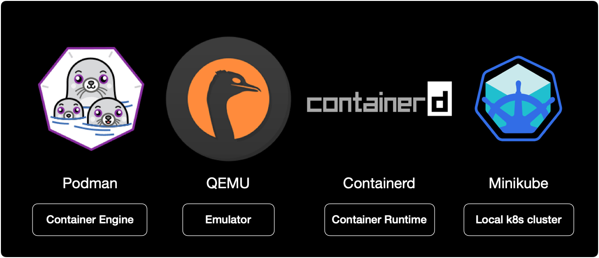
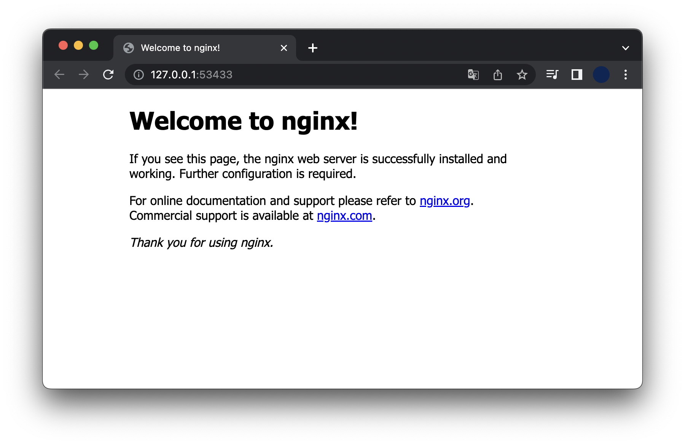

## 개요

도커 데스크탑은 최근 유료화 선언으로 인해 많은 사용자들이 등을 돌린 상황입니다.

저 또한 도커 데스크탑을 사용하던 유저로서, 이제는 버릴 때가 되었다고 판단했습니다.  
그래서 로컬 테스트 환경으로 사용했던 docker desktop을 버리고, podman + containerd로 minikube 클러스터 사용하기로 마음 먹었습니다.

제가 사용하는 소프트웨어 스택은 다음과 같습니다.



docker desktop 자리를 Podman, QEMU 그리고 Containerd로 대체했습니다.

Containerd는 앞으로 쿠버네티스 환경에서 기본적으로 사용되는 CRI이기 때문에 어차피 사용할 거 로컬에서도 익숙해지자는 의미로 사용했습니다.  

```bash
$ minikube start --help
...
    --container-runtime='':
    The container runtime to be used. Valid options: docker, cri-o, containerd (default: auto)
```

minikube에서는 자동적으로 설치된 container runtime을 감지 후 사용합니다.  
대부분의 minikue 사용자들은 아직까지는 docker desktop + dockershim 조합으로 사용하고 있습니다.

&nbsp;

## 환경

- **OS** : macOS 12.5
- **Hardware** : M2, 8 Core CPU, RAM 8G
- **Shell** : zsh + oh-my-zsh
- **minikube** v1.26.1
- **podman** 4.1.1

&nbsp;

## 전제조건

- macOS용 패키지 관리자인 brew 설치가 필요합니다. podman 설치에 필요합니다.
- 로컬 쿠버네티스 클러스터를 생성하기 위해 minikube 설치가 필요합니다.

&nbsp;

## 시작하기

### podman 구성

**podman 설치**  
brew를 사용해서 podman을 설치합니다.

```bash
$ brew install podman
```

podman이 설치될 때 종속성으로 인해 가상화 에뮬레이터인 [qemu](https://www.qemu.org/)도 같이 설치됩니다.

&nbsp;

**podman 머신 생성**  
podman 가상머신을 생성합니다. podman은 가상머신을 생성할 때 qemu를 사용합니다.  
가상머신 리소스로 2 CPU Core, 4G RAM, 20GB 스토리지를 할당합니다.

```bash
$ podman machine init \
    --cpus 2 \
    --memory 4096 \
    --disk-size 20
```

&nbsp;

podman 가상머신을 시작합니다.

```bash
$ podman machine start
```

&nbsp;

podman 가상머신 리스트를 조회합니다.

```bash
$ podman machine ls
NAME                     VM TYPE     CREATED             LAST UP            CPUS        MEMORY      DISK SIZE
podman-machine-default*  qemu        About a minute ago  Currently running  2           4.295GB     21.47GB
```

가상머신 타입이 `qemu`입니다.  
`LAST UP` 값이 `Currently running`이면 현재 실행중인 상태입니다.

&nbsp;

podman 엔진 버전을 확인합니다.

```bash
$ podman version
Client:       Podman Engine
Version:      4.1.1
API Version:  4.1.1
Go Version:   go1.18.3
Built:        Wed Jun 15 05:12:46 2022
OS/Arch:      darwin/arm64

Server:       Podman Engine
Version:      4.1.1
API Version:  4.1.1
Go Version:   go1.18.3
Built:        Thu Jun 23 01:18:30 2022
OS/Arch:      linux/arm64
```

Podman Engine `4.1.1`을 사용하고 있습니다.

&nbsp;

### minikube 설정

기본적으로 minikube는 podman을 실행할 때 `sudo`를 사용합니다.  
minikube에서 containerd를 사용하려면 podman의 Rootless 설정해주는 걸 권장하고 있습니다.  
[관련자료](https://minikube.sigs.k8s.io/docs/drivers/podman/#rootless-podman)

```bash
$ minikube config set rootless true
```

&nbsp;

이후 minikube 설정을 확인합니다.

```bash
$ minikube config view
- rootless: true
```

`rootless`가 활성화 상태입니다.

&nbsp;

### minikube 클러스터 생성

2대의 노드로 구성된 minikube 클러스터를 생성합니다.  
이 때 노드를 생성할 드라이버는 `podman`, 컨테이너 런타임은 `containerd`로 지정합니다.

```bash
$ minikube start \
    --driver='podman' \
    --container-runtime='containerd' \
    --kubernetes-version='stable' \
    --nodes=2
```

앞으로는 docker보다는 containerd에 익숙해져야 합니다.  
쿠버네티스가 컨테이너 런타임으로 오피셜하게 밀고 있는게 Containerd이기 때문입니다.  
AWS도 마찬가지로 Kubernetes 버전 1.23 출시부터 공식적으로 발표된 Amazon EKS AMI에는 유일한 런타임으로 containerd를 포함한다고 공지했습니다.  
[AWS 공식문서](https://docs.aws.amazon.com/ko_kr/eks/latest/userguide/kubernetes-versions.html#available-versions)

&nbsp;

minikube와 podman + containerd를 사용해서 구성한 아키텍처는 다음과 같습니다.


&nbsp;

**context 조회**  
minikube 클러스터가 생성 완료되면 터미널에서 자동적으로 context가 변경되어 클러스터에 연결됩니다.

```bash
$ kubectl config get-contexts
CURRENT   NAME       CLUSTER    AUTHINFO   NAMESPACE
*         minikube   minikube   minikube   default
```

현재 `minikube` 클러스터에 접속된 상태입니다.

&nbsp;

**노드 확인**  
클러스터를 구성하는 노드 목록을 확인합니다.

```bash
$ kubectl get node -o wide
NAME           STATUS   ROLES           AGE   VERSION   INTERNAL-IP    EXTERNAL-IP   OS-IMAGE             KERNEL-VERSION             CONTAINER-RUNTIME
minikube       Ready    control-plane   75s   v1.24.3   192.168.49.2   <none>        Ubuntu 20.04.4 LTS   5.18.13-200.fc36.aarch64   containerd://1.6.6
minikube-m02   Ready    <none>          57s   v1.24.3   192.168.49.3   <none>        Ubuntu 20.04.4 LTS   5.18.13-200.fc36.aarch64   containerd://1.6.6
```

2대의 노드가 `Ready` 상태로 있습니다.  
노드의 `CONTAINER_RUNTIME` 값이 docker가 아닌 `containerd://1.6.6` 인 걸 확인할 수 있습니다.

&nbsp;

**컨테이너 확인**  
podman 엔진에 올라간 컨테이너 목록을 확인합니다.

```bash
$ podman ps
CONTAINER ID  IMAGE                                COMMAND     CREATED             STATUS                 PORTS                                                                                                                       NAMES
606cc91bbe20  gcr.io/k8s-minikube/kicbase:v0.0.33              About a minute ago  Up About a minute ago  0.0.0.0:40481->22/tcp, 0.0.0.0:34387->2376/tcp, 0.0.0.0:35643->5000/tcp, 0.0.0.0:41253->8443/tcp, 0.0.0.0:46851->32443/tcp  minikube
b250d416cac7  gcr.io/k8s-minikube/kicbase:v0.0.33              42 seconds ago      Up 43 seconds ago      0.0.0.0:45537->22/tcp, 0.0.0.0:39403->2376/tcp, 0.0.0.0:41409->5000/tcp, 0.0.0.0:45209->8443/tcp, 0.0.0.0:35681->32443/tcp  minikube-m02
```

각 컨테이너 하나가 1대의 minikube 노드를 의미합니다.

&nbsp;

### 테스트

#### deployment 배포

테스트를 위해 nginx 파드 3대를 배포하는 deployment를 생성합니다.

```bash
$ cat << EOF | kubectl apply -n nginx -f -
---
# Namespace
apiVersion: v1
kind: Namespace
metadata:
  name: nginx
  labels:
    app: nginx

---
# Deployment
apiVersion: apps/v1
kind: Deployment
metadata:
  name: nginx-deployment
  namespace: nginx
  labels:
    app: nginx
spec:
  replicas: 3
  selector:
    matchLabels:
      app: nginx
  template:
    metadata:
      labels:
        app: nginx
    spec:
      containers:
      - name: nginx
        image: nginx:1.14.2
        ports:
        - containerPort: 80
EOF
```

&nbsp;

containerd 런타임을 사용한 클러스터 환경에서도 nginx 컨테이너 3대가 정상적으로 생성된 걸 확인할 수 있습니다.

```bash
$ kubectl get all -n nginx
NAME                                    READY   STATUS    RESTARTS   AGE
pod/nginx-deployment-6595874d85-4jg46   1/1     Running   0          3m17s
pod/nginx-deployment-6595874d85-ffpns   1/1     Running   0          3m17s
pod/nginx-deployment-6595874d85-n7vth   1/1     Running   0          3m17s

NAME                               READY   UP-TO-DATE   AVAILABLE   AGE
deployment.apps/nginx-deployment   3/3     3            3           3m17s

NAME                                          DESIRED   CURRENT   READY   AGE
replicaset.apps/nginx-deployment-6595874d85   3         3         3       3m17s
```

&nbsp;

#### service 배포

nginx pod를 외부로 노출시키기 위한 service 리소스를 생성합니다.  
서비스 타입은 `NodePort` 입니다.

```bash
$ cat << EOF | kubectl apply -n nginx -f -
---
apiVersion: v1
kind: Service
metadata:
  name: nginx-service
  namespace: nginx
spec:
  type: NodePort
  selector:
    app: nginx
  ports:
    - targetPort: 80
      port: 80
      # nodePort is Optional field
      # By default and for convenience,
      # the Kubernetes control plane will allocate
      # a port from a range (default: 30000-32767)
      nodePort: 30080
EOF
```

&nbsp;

`nginx-service` 서비스가 생성되었습니다.

```bash
$ kubectl get service -n nginx
NAME            TYPE       CLUSTER-IP    EXTERNAL-IP   PORT(S)        AGE
nginx-service   NodePort   10.105.26.6   <none>        80:30080/TCP   2m4s
```

&nbsp;

minikube 터널링으로 노드포트에 접속합니다.

```bash
$ minikube service nginx-service -n nginx
|-----------|---------------|-------------|---------------------------|
| NAMESPACE |     NAME      | TARGET PORT |            URL            |
|-----------|---------------|-------------|---------------------------|
| nginx     | nginx-service |          80 | http://192.168.49.2:30080 |
|-----------|---------------|-------------|---------------------------|
🏃  nginx-service 서비스의 터널을 시작하는 중
|-----------|---------------|-------------|------------------------|
| NAMESPACE |     NAME      | TARGET PORT |          URL           |
|-----------|---------------|-------------|------------------------|
| nginx     | nginx-service |             | http://127.0.0.1:53433 |
|-----------|---------------|-------------|------------------------|
```

&nbsp;

nginx 파드에 정상적으로 연결되었습니다.



이처럼 podman + containerd 환경에서도 동일하게 일반적인 테스트를 수행할 수 있습니다.  
단, minikube에서도 공식적으로 podman을 `experimental` 상태라고 표기해놓았기 때문에 일부 테스트가 동작하지 않을 수도 있다는 점을 참고해야 합니다.

```bash
$ minikube start --help
...
    --driver='':
        Driver is one of: qemu2 (experimental), docker, podman (experimental), ssh (defaults to auto-detect)
```

`help` 옵션으로 확인해보면 `podman (experimental)`이라고 표기되어 있습니다.

&nbsp;

### 실습환경 정리

#### 중지

minikube 클러스터와 podman 머신을 중지해서 메모리를 회수하는 게 중요합니다.  
아래 명령어로 중지합니다.

```bash
$ minikube stop
$ podman machine stop
```

&nbsp;

#### 삭제

만약 minikube 클러스터와 podman machine을 이후에 재사용하지 않을 경우, 완전히 삭제하고 싶다면 아래 명령어를 실행해서 정리합니다.

```bash
$ minikube delete
$ podman machine rm -f
```

&nbsp;

## 결론

docker desktop을 버리고 containerd + podman으로 대체해도 minikube 테스트에는 큰 지장이 없는 걸로 확인됩니다.  
docker desktop 대신 containerd + podman 조합으로 사용해보는 것도 괜찮은 것 같습니다.
