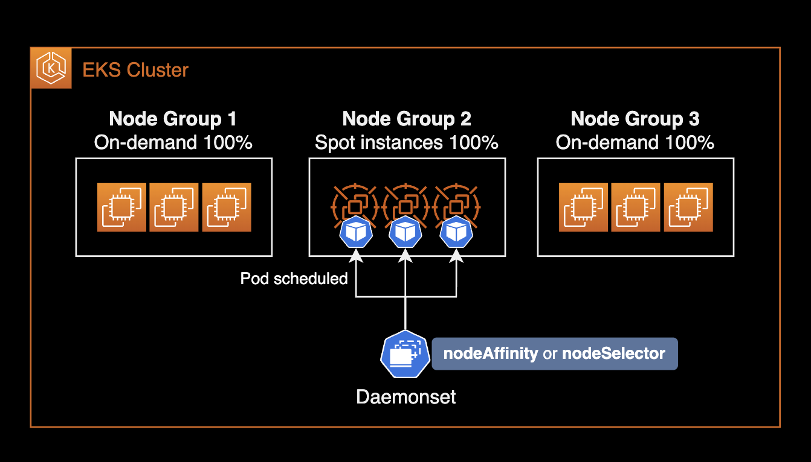
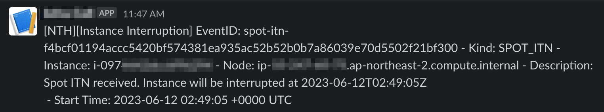



&nbsp;

## 개요

이 글은 다음 주제들을 다룹니다.

- Node Termination Handler(이하 NTH)의 동작방식과 주요 기능을 설명합니다.
- 헬름 차트를 사용해서 Node Termination Handler를 설치하고 운영하는 방법을 소개합니다.

쿠버네티스 클러스터와 AWS 인프라를 운영하는 SRE 또는 DevOps Engineer를 대상으로 작성되었습니다.

&nbsp;

## 배경지식

### EKS 스팟 워커노드 사용시 주의사항

스팟 인스턴스를 EKS에 적용하면 비용 절감과 확장성을 향상시킬 수 있지만, 언제든 종료될 수 있다는 점을 명심해야 합니다.

&nbsp;

EKS 워커 노드에 스팟 인스턴스를 적용하기 위해서는 몇 가지 고려해야 할 사항들이 있습니다. 먼저 스팟 인스턴스가 종료된다는 스팟 인스턴스 인터럽션 안내<sup>ITN</sup>을 처리할 수 있어야 합니다.  
AWS EC2는 스팟 인스턴스 **종료 2분 전**에 해당 인스턴스에 대한 [인터럽션 안내 이벤트](https://docs.aws.amazon.com/AWSEC2/latest/UserGuide/spot-instance-termination-notices.html)를 발생합니다.  

&nbsp;

EKS 환경에서 스팟 인스턴스 인터럽션을 처리할 때 필요한 대응 조치는 다음과 같습니다.


- **cordon** : 해당 워커 노드에 더 이상 파드들이 스케쥴링되지 않도록 막는 설정해야 합니다. 어차피 2분 후 해당 스팟 인스턴스는 Terminate 될 예정이기 때문입니다.
- **drain** : 동작 중인 파드들을 다른 워커노드로 옮겨서 재배치 해야합니다.

&nbsp;

스팟 인스턴스 인터럽션 안내<sup>ITN</sup>에 대응하지 않으면 애플리케이션 코드가 정상적으로 중지되지 않거나, 이미 중단 예정인 워커노드에 새 파드를 실수로 스케줄링 할 수 있습니다.  
그렇다고 이 스팟 인스턴스 인터럽션 안내<sup>ITN</sup>에 대한 대응 작업을 EKS 클러스터 관리자가 일일히 매번 진행하는 건 현실적으로 불가능합니다.

그래서 만들어진 쿠버네티스 컨트롤러가 Node Termination Handler 입니다.


NTH는 스팟 인스턴스 인터럽션 안내 이벤트를 감지한 후 자동으로 해당 스팟 노드를 스케줄링 제외한 후, 올라가있는 노드를 다른 노드로 재배치(drain)합니다.

&nbsp;

NTH를 사용하면 스팟 인스턴스로 비용을 절약하면서 동시에 (온디맨드 만큼은 아니지만) 스팟의 치명적 단점인 언제든 종료될 수 있다는 불안정성을 낮출 수 있습니다.

&nbsp;

### Node Termination Handler의 동작방식

aws-node-termination-handler(NTH)는 2가지 모드 중 하나로 동작합니다.  
두 모드(IMDS 및 대기열 프로세서) 모두 EC2 인스턴스에 영향을 미치는 이벤트를 모니터링하지만 각각 다른 유형의 이벤트를 지원합니다.

|                    Feature                    | IMDS Processor | Queue Processor  |
| :-------------------------------------------: | :------------: | :--------------: |
| Spot Instance Termination Notifications (ITN) |       ✅        |        ✅        |
|               Scheduled Events                |       ✅        |        ✅        |
|       Instance Rebalance Recommendation       |       ✅        |        ✅        |
|        AZ Rebalance Recommendation            |       ❌        |        ✅        |
|        ASG Termination Lifecycle Hooks        |       ❌        |        ✅        |
|         Instance State Change Events          |       ❌        |        ✅        |

좀 더 다양한 노드 관련 이벤트를 자동 대응하고 싶다면, Queue Processor 모드로 NTH를 구성하는 걸 추천합니다.  
대신 IMDS 모드보다 Queue Processor 모드의 설치 과정이 복잡합니다.

&nbsp;

### Node Termination Handler의 설치방식

IMDS 모드와 Queue Processor 모드는 NTH 파드가 배포되는 방식과 구성이 다릅니다.

&nbsp;

#### IMDS (Instance Metadata Service) 모드


- Daemonset 형태로 NTH Pod가 배포됩니다.
- NTH Pod는 EC2 내부에서 IMDS와 통신하며 `spot/`, `events/`와 같은 [인스턴스 메타데이터](https://docs.aws.amazon.com/AWSEC2/latest/UserGuide/instancedata-data-categories.html)를 상시 모니터링합니다.
- 헬름 차트만 배포하면 바로 NTH가 모든 스팟 워커노드에서 동작하므로 Queue Processor 모드에 비해 설치가 쉽습니다.
  - NTH 파드에 IAM Role([IRSA](https://docs.aws.amazon.com/eks/latest/userguide/iam-roles-for-service-accounts.html)) 연결 작업이 필요 없으므로 구성이 단순합니다.

&nbsp;

#### Queue Processor 모드


- Deployment 형태로 NTH Pod가 배포됩니다.  
- 추가 인프라 설정이 필요합니다. 추가적인 인프라로는 IAM Role (IRSA), EventBridge Rule, SQS가 해당됩니다.  
- 설치 방법이 IMDS 모드에 비해 복잡합니다.

&nbsp;

## 환경

### 로컬 환경

- helm v3.12.0
- kubectl v1.27.2

&nbsp;

### 쿠버네티스 환경

- EKS v1.25
- Node Termination Handler v1.19.0 (차트 버전 v0.21.0)

&nbsp;

## 설치하기

헬름 차트를 사용해서 NTH를 IMDS 모드로 설치하는 게 목표입니다.

&nbsp;

### 차트 다운로드

[AWS NTH 공식 깃허브 저장소](https://github.com/aws/aws-node-termination-handler)를 다운로드 받습니다.

```bash
$ git clone https://github.com/aws/aws-node-termination-handler.git
```

참고로 NTH 공식 깃허브 레포지터리 안에 [헬름 차트](https://github.com/aws/aws-node-termination-handler/tree/main/config/helm/aws-node-termination-handler)도 포함되어 있습니다.

&nbsp;

NTH 레포지터리 내부에 위치한 헬름 차트 경로로 이동합니다.

```bash
$ cd aws-node-termination-handler/config/helm/aws-node-termination-handler
$ pwd
/Users/younsung.lee/github/aws-node-termination-handler/config/helm/aws-node-termination-handler
```

&nbsp;

차트 디렉토리 `config/helm/aws-node-termination-handler`의 내부 구조는 다음과 같습니다.

```bash
$ tree .
.
├── Chart.yaml
├── README.md
├── example-values-imds-linux.yaml
├── example-values-imds-windows.yaml
├── example-values-queue.yaml
├── templates
│   ├── NOTES.txt
│   ├── _helpers.tpl
│   ├── clusterrole.yaml
│   ├── clusterrolebinding.yaml
│   ├── daemonset.linux.yaml
│   ├── daemonset.windows.yaml
│   ├── deployment.yaml
│   ├── pdb.yaml
│   ├── podmonitor.yaml
│   ├── psp.yaml
│   ├── service.yaml
│   ├── serviceaccount.yaml
│   └── servicemonitor.yaml
└── values.yaml

2 directories, 19 files
```

&nbsp;

### 차트 수정

헬름차트의 `values.yaml`을 수정합니다.

저희는 `values.yaml` 파일에서 크게 2가지 설정을 수정할 예정입니다.

1. **daemonsetNodeSelector** : NTH 파드가 배포될 노드 지정
2. **webhookURL** : NTH가 이벤트 처리후 알림 메세지를 발송할 Slack incoming webhook의 URL 주소

&nbsp;

#### daemonsetNodeSelector

```yaml
# Now we are in `values.yaml`
daemonsetNodeSelector:
  # 데몬셋이 NTH 파드를 배포할 기준 설정
  eks.amazonaws.com/capacityType: SPOT
```

스팟 워커노드에만 NTH 파드를 배포하도록 `daemonsetNodeSelector`를 지정합니다.  
데몬셋의 배포 대상을 제한하지 않을 경우 On-demand를 포함한 모든 워커노드에 NTH 파드가 배포되어 불필요한 리소스를 차지하게 됩니다.

&nbsp;

#### 파드 리소스 제한

[Node Termination Handler 공식 헬름차트](https://github.com/aws/aws-node-termination-handler/blob/main/config/helm/aws-node-termination-handler/templates/daemonset.linux.yaml#L177-L179)에는 리소스 요청값 제한값이 기본적으로 걸려있지 않습니다.

데몬셋에 의해 각 노드마다 배치되는 데몬셋 파드의 리소스 초기 요청량(requests)과 최대 제한값(limits)을 지정합니다.

기본적으로 데몬셋 파드는 백엔드나 프론트엔드 어플리케이션 파드와 달리 큰 리소스가 필요 없습니다. 제 경우는 아래와 같이 적은 리소스를 할당해도 전혀 동작에 문제가 없었습니다.

`values.yaml` 파일에 다음과 같은 리소스 요청량 제한량 설정을 추가합니다.

```yaml
# Now we are in `values.yaml`
resources:
  requests:
    cpu: 10m
    memory: 40Mi
  limits:
    cpu: 100m
    memory: 100Mi
```

&nbsp;

#### webhookURL (선택사항)

NTH 파드가 cordon & drain 조치를 할 때마다 슬랙 채널로 알람이 갈 수 있게 슬랙의 Incoming webhook URL을 입력합니다.

> Slack의 Incoming webhook 설정 방법은 이 글의 주제를 벗어나므로 설명은 생략하겠습니다.

```yaml
# Now we are in `values.yaml`
# webhookURL if specified, posts event data to URL upon instance interruption action.
webhookURL: "https://hooks.slack.com/services/XXXXXXXXX/XXXXXXXXXXX/XXXXXXXXXXXXXXXXYYYZZZZZ"
```

&nbsp;

만약 NTH의 이벤트 핸들링에 대한 슬랙 알람을 받을 필요 없다면 `webhookURL`은 기본값으로 비워두도록 합니다.

```yaml
# Now we are in `values.yaml`
# webhookURL if specified, posts event data to URL upon instance interruption action.
webhookURL: ""
```

&nbsp;

#### webhookTemplate (선택사항)

헬름차트의 `webhookTemplates` 값을 수정하면 NTH가 보내는 알람 메세지 템플릿을 커스터마이징 할 수 있습니다.  
혹은 별도의 ConfigMap(또는 Secret)에 템플릿 정보를 저장한 후, 불러오는 방법도 있습니다.

```yaml
# webhookTemplate if specified, replaces the default webhook message template.
webhookTemplate: “{\”text\”:\”:rotating_light:*INSTANCE INTERRUPTION NOTICE*:rotating_light:\n*_EventID:_* `{{ .EventID }}`\n*_Environment:_* `<env_name>`\n*_InstanceId:_* `{{ .InstanceID }}`\n*_InstanceType:_* `{{ .InstanceType }}`\n*_Start Time:_* `{{ .StartTime }}`\n*_Description:_* {{ .Description }}\”}”
```



&nbsp;

기본값으로 아무것도 선언하지 않은 webhookTemplate은 다음과 같습니다.

```yaml
webhookTemplate: "\{\"Content\":\"[NTH][Instance Interruption] InstanceId: \{\{ \.InstanceID \}\} - InstanceType: \{\{ \.InstanceType \}\} - Kind: \{\{ \.Kind \}\} - Start Time: \{\{ \.StartTime \}\}\"\}"
```


자세한 사항은 NTH 깃허브에서 [End to End 테스트 코드](https://github.com/aws/aws-node-termination-handler/blob/b6477836cc81f6c2e82ca9840adf170472bbd0fc/test/e2e/webhook-test#L30)를 확인하도록 합니다.

&nbsp;

일반적인 네트워크 구성의 경우, Slack 알람을 받으려면 NTH Pod가 위치한 노드가 NAT Gateway를 경유해 Internet의 슬랙에 도달 가능한 네트워크 구성이어야 합니다.



슬랙 채널로 이벤트 핸들링 알람을 보내는 주체는 NTH Pod입니다.

&nbsp;

### 헬름으로 NTH 설치

로컬에 받은 헬름차트를 사용해서 NTH를 설치합니다.  
NTH는 시스템 기본 네임스페이스인 `kube-system`에 설치하는 걸 권장합니다.

```bash
$ CHART_VERSION=0.21.0
$ helm upgrade \
    --install \
    --namespace kube-system \
    aws-node-termination-handler ./aws-node-termination-handler \
    --version $CHART_VERSION
```

NTH는 기본적으로 IMDS<sup>Instance Metadata Service</sup> 모드로 설치됩니다.

&nbsp;

```bash
Release "aws-node-termination-handler" has been upgraded. Happy Helming!
NAME: aws-node-termination-handler
LAST DEPLOYED: Sun Jun 11 17:40:56 2023
NAMESPACE: kube-system
STATUS: deployed
REVISION: 5
TEST SUITE: None
NOTES:
***********************************************************************
* AWS Node Termination Handler                                        *
***********************************************************************
  Chart version: 0.21.0
  App version:   1.19.0
  Image tag:     public.ecr.aws/aws-ec2/aws-node-termination-handler:v1.19.0
  Mode :         IMDS
***********************************************************************
```

Node Termination Handler 버전이 1.19.0이고 (차트 버전은 0.21.0), IMDS 모드로 설치된 걸 확인할 수 있습니다.

&nbsp;

이미 Node Termination Handler가 설치된 상황에서 재설치가 필요한 경우 `--recreate-pods`와 `--force` 옵션을 사용하면 됩니다.

```bash
$ helm upgrade \
    --install \
    --namespace kube-system \
    aws-node-termination-handler ./aws-node-termination-handler \
    --version $CHART_VERSION \
    --recreate-pods \
    --force
```

```bash
Flag --recreate-pods has been deprecated, functionality will no longer be updated. Consult the documentation for other methods to recreate pods
```

명령어 실행시 나타나는 위 경고문은 `--recreate-pods` 옵션이 deprecated 되었다고 알려주는 내용입니다. NTH 재설치 자체는 문제없이 진행되므로 넘어가도 됩니다.

&nbsp;

NTH 릴리즈의 설치 상태를 확인합니다.

```bash
$ helm list -n kube-system
```

```bash
NAME                           NAMESPACE     REVISION   UPDATED                                STATUS     CHART                                 APP VERSION
aws-node-termination-handler   kube-system   5          2023-06-11 17:40:56.273914 +0900 KST   deployed   aws-node-termination-handler-0.21.0   1.19.0
```

&nbsp;

NTH 릴리즈에 적용된 `values.yaml` 상태를 확인합니다.

```bash
$ helm get values aws-node-termination-handler -n kube-system
```

저희가 `values.yaml` 파일에서 변경한 노드 선택, 슬랙 웹훅 주소 설정 값 2개가 잘 적용되어 있는지 확인합니다.

&nbsp;

### NTH 파드 상태 확인

NTH 데몬셋 상태를 확인합니다.

```bash
$ kubectl get daemonset -n kube-system aws-node-termination-handler
```

```bash
NAME                           DESIRED   CURRENT   READY   UP-TO-DATE   AVAILABLE   NODE SELECTOR                                                AGE
aws-node-termination-handler   2         2         2       2            2           eks.amazonaws.com/capacityType=SPOT,kubernetes.io/os=linux   3h56m
```

크게 2가지 확인이 필요합니다.

- 데몬셋에 NODE SELECTOR가 제대로 설정되어 있는지 여부
- NTH 파드가 Spot 인스턴스에만 배포되어 있는지 확인합니다.

IMDS<sup>Instance Metadata Service</sup> 모드로 NTH를 설치한 이유는 (주로) 스팟 인스턴스의 인터럽션 이벤트를 핸들링하기 위한 목적이 큽니다.  
스팟 인스턴스 중단 안내 외에 특별하게 핸들링할 이벤트가 없다면 리소스 절약을 위해 온디맨드 노드에 배치될 필요가 없습니다.

&nbsp;

만약 스팟 워커노드가 Kubernetes Autoscaler(혹은 Karpenter)에 의해 자동으로 스케일 아웃되는 경우 NTH 데몬셋은 다음과 같이 동작합니다.

```bash
NAME                           DESIRED   CURRENT   READY   UP-TO-DATE   AVAILABLE   NODE SELECTOR                                                AGE
aws-node-termination-handler   2         2         2       2            2           eks.amazonaws.com/capacityType=SPOT,kubernetes.io/os=linux   3h56m
```

&nbsp;

EKS 클러스터에 스팟 인스턴스가 1대 더 늘어나서 워커노드가 총 3대가 된 상황입니다.

```bash
NAME                           DESIRED   CURRENT   READY   UP-TO-DATE   AVAILABLE   NODE SELECTOR                                                AGE
aws-node-termination-handler   3         3         3       3            3           eks.amazonaws.com/capacityType=SPOT,kubernetes.io/os=linux   3h57m
```

IMDS 모드는 aws-node-termination-handler 파드를 데몬셋을 통해 배포하기 때문에, 스팟 워커노드가 스케일 아웃되어 대수가 늘어나면 그에 맞춰서 NTH 파드도 자동 생성된 걸 확인할 수 있습니다.

&nbsp;

## 참고자료

[Karpenter와 Spot으로 저렴하고 유연하게 노드 프로비저닝하기](https://tech.scatterlab.co.kr/spot-karpenter/)  
스캐터랩에서 쓴 NTH 도입기입니다. 국내에서는 가장 깔끔하게 정리된 문서가 아닐까 싶습니다.

[NTH 설치방법](https://github.com/aws/aws-node-termination-handler#installation-and-configuration)  
NTH 공식 깃허브 README

[NTH 차트](https://github.com/aws/aws-node-termination-handler/tree/main/config/helm/aws-node-termination-handler)  
NTH 공식 깃허브에 업로드된 Helm Chart. 혹은 [ArtifactHUB](https://artifacthub.io/packages/helm/aws/aws-node-termination-handler)를 참고해서 설치하셔도 괜찮습니다.

[Reduce Kubernetes Infrastructure cost with EC2 Spot Instances — Part 2](https://medium.com/upday-devs/reduce-kubernetes-infrastructure-cost-with-ec2-spot-instances-part-2-6e311ef56b84)  
(영문) Non-production 환경을 100% Spot 인스턴스로 운영한 대단한 사례입니다.  

[Spot Instance Advisor](https://aws.amazon.com/ko/ec2/spot/instance-advisor/)  
각 리전과 인스턴스 타입별로 스팟 인스턴스 중단 빈도[%]를 확인할 수 있습니다.
