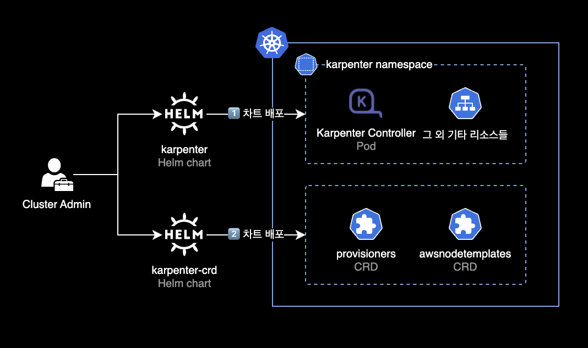

## 개요

Helm 차트로 EKS 클러스터에 배포한 Karpenter v0.26.0을 v0.26.1로 업그레이드하는 방법을 소개합니다.

&nbsp;

## 중요사항

이 가이드는 EKS 클러스터에 구 버전 Karpenter 헬름 차트가 이미 배포되어 있는 상황을 가정하에 설명합니다.

EKS 클러스터에 Karpenter를 최초 설치하는 상황이 아닌, 기존 Karpenter v0.26.0 헬름의 버전을 v0.26.1로 업그레이드하는 상황입니다.

&nbsp;

## 배경지식

### Karpenter

Karpenter는 예약할 수 없는 파드를 감지하고 새 노드를 자동으로 프로비저닝하는 오픈 소스 클러스터 오토스케일러입니다.


&nbsp;

ASG<sup>Auto Scaling Group</sup> 기반으로 동작하는 Kubernetes Cluster Autoscaler와 다르게 Karpenter는 Karpenter Controller(Pod)가 다이렉트로 EC2 인스턴스를 생성 또는 삭제합니다.


Karpenter의 장점은 다음과 같습니다.

- Karpenter는 ASG를 사용하지 않고 Karpenter Controller(Pod)가 직접 인스턴스를 관리하므로 더 빠르게 워커 노드를 생성하고 삭제할 수 있습니다.
- Karpenter는 노드 그룹과 오토 스케일링 그룹을 사용하지 않기 때문에 클러스터 노드 관리가 더 편합니다.
- 생성이 필요한 파드들의 CPU, Memory 리소스 값을 자동 계산한 후 적절한 인스턴스 타입을 섞어서 배치하므로 EC2 비용 절감 및 유연한 리소스 확장을 할 수 있습니다.

&nbsp;

### Karpenter 관련 차트



Karpenter는 총 2개의 헬름 차트로 운영됩니다.

- **karpenter** : Karpenter Controller. 헬름 차트로 배포됩니다.
- **karpenter-crd** : Karpenter CRDs. 헬름 차트로 배포됩니다.

&nbsp;

`karpenter`와 `karpenter-crd` 차트가 배포된 이후에는 실제로 Karpenter Controller가 사용할 `provisioners`와 `awsnodetemplates` 리소스를 `kubectl apply` 명령어로 배포합니다.

&nbsp;

## 환경

### 클러스터 환경

- **EKS v1.24**
- **노드의 CPU 아키텍처** : AMD64 (x86_64)
- **Karpenter** : v0.26.0 → v0.26.1
  - 헬름 차트 방식으로 설치, 업그레이드
  - Karpenter CRD도 동일하게 v0.26.0 → v0.26.1로 업그레이드

&nbsp;

### 로컬 환경

- **OS** : macOS 13.2.1 (Ventura)
- **Helm** : v3.11.1

&nbsp;

## Karpenter 헬름 차트 업그레이드(설치) 절차

### 1. 환경변수 설정

로컬 터미널에서 설치하려고 하는 Karpenter 버전 환경변수를 설정합니다.

```bash
$ KARPENTER_VERSION=v0.26.1
```

사용 가능한 전체 버전 목록은 [Karpenter Github Releases](https://github.com/aws/karpenter/releases) 페이지에서 확인 가능합니다.

&nbsp;

### 2. Karpenter Controller 설치

#### Karpenter Controller values 작성

- 이 글은 쿠버네티스 클러스터에 구 버전 Karpenter 헬름 차트가 이전에 배포되어 있다는 가정하에 설명합니다.

- Karpenter Controller가 사용하는 IAM Role, Karpenter Controller로 생성된 노드가 사용할 Instance Profile(IAM Role) 등은 [Karpenter 초기 설치](/blog/k8s/karpenter/) 시에 생성하는 별도 과정이 필요합니다.


- Karpenter 관련 IAM Role 생성 절차는 이 글의 주제를 벗어나기 때문에 다루지 않습니다.

&nbsp;

##### values.yaml 예시

제 경우 karpenter controller가 사용할 `values.yaml` 파일을 작성했습니다.  
`values.yaml`로 배포할 Karpenter 버전은 `v0.26.1`입니다.

```yaml
# -- Overrides the chart's name.
nameOverride: ""
# -- Overrides the chart's computed fullname.
fullnameOverride: ""
# -- Additional labels to add into metadata.
additionalLabels: {
  app: karpenter
}

# -- Additional annotations to add into metadata.
additionalAnnotations: {}
# -- Image pull policy for Docker images.
imagePullPolicy: IfNotPresent
# -- Image pull secrets for Docker images.
imagePullSecrets: []
serviceAccount:
  # -- Specifies if a ServiceAccount should be created.
  create: true
  # -- The name of the ServiceAccount to use.
  # If not set and create is true, a name is generated using the fullname template.
  name: "karpenter"
  # -- Additional annotations for the ServiceAccount.
  annotations: {
    eks.amazonaws.com/role-arn: "arn:aws:iam::111122223333:role/KarpenterControllerRole-<YOUR_CLUSTER_NAME_HERE>"
  }
# -- Specifies additional rules for the core ClusterRole.
additionalClusterRoleRules: []
serviceMonitor:
  # -- Specifies whether a ServiceMonitor should be created.
  enabled: false
  # -- Additional labels for the ServiceMonitor.
  additionalLabels: {}
  # -- Endpoint configuration for the ServiceMonitor.
  endpointConfig: {}
# -- Number of replicas.
replicas: 2
# -- The number of old ReplicaSets to retain to allow rollback.
revisionHistoryLimit: 10
# -- Strategy for updating the pod.
strategy:
  rollingUpdate:
    maxUnavailable: 1
# -- Additional labels for the pod.
podLabels: {}
# -- Additional annotations for the pod.
podAnnotations: {}
podDisruptionBudget:
  name: karpenter
  maxUnavailable: 1
# -- SecurityContext for the pod.
podSecurityContext:
  fsGroup: 1000
# -- PriorityClass name for the pod.
priorityClassName: system-cluster-critical
# -- Override the default termination grace period for the pod.
terminationGracePeriodSeconds:
# -- Bind the pod to the host network.
# This is required when using a custom CNI.
hostNetwork: false
# -- Configure the DNS Policy for the pod
dnsPolicy: Default
# -- Configure DNS Config for the pod
dnsConfig: {}
#  options:
#    - name: ndots
#      value: "1"
# -- Node selectors to schedule the pod to nodes with labels.
nodeSelector:
  kubernetes.io/os: linux
# -- Affinity rules for scheduling the pod.
affinity:
  nodeAffinity:
    requiredDuringSchedulingIgnoredDuringExecution:
      nodeSelectorTerms:
        - matchExpressions:
            - key: karpenter.sh/provisioner-name
              operator: DoesNotExist
        - matchExpressions:
            - key: eks.amazonaws.com/nodegroup
              operator: In
              values:
              # Karpenter Controller(Pod)는 기존 노드그룹에 배포하도록 nodeAffinity 설정
              - <YOUR_NODEGROUP_NAME_HERE>
  podAntiAffinity:
    preferredDuringSchedulingIgnoredDuringExecution:
    - weight: 100
      podAffinityTerm:
        labelSelector:
          matchExpressions:
          - key: app.kubernetes.io/instance
            operator: In
            values:
            - karpenter
        topologyKey: "kubernetes.io/hostname"
# -- topologySpreadConstraints to increase the controller resilience
topologySpreadConstraints:
  - maxSkew: 1
    topologyKey: topology.kubernetes.io/zone
    whenUnsatisfiable: ScheduleAnyway
# -- Tolerations to allow the pod to be scheduled to nodes with taints.
tolerations:
  - key: CriticalAddonsOnly
    operator: Exists
# -- Additional volumes for the pod.
extraVolumes: []
# - name: aws-iam-token
#   projected:
#     defaultMode: 420
#     sources:
#     - serviceAccountToken:
#         audience: sts.amazonaws.com
#         expirationSeconds: 86400
#         path: token

# -- Array of extra K8s manifests to deploy 
extraObjects: []
#- apiVersion: karpenter.k8s.aws/v1alpha1
#  kind: AWSNodeTemplate
#  metadata:
#    name: default
#  spec:
#    subnetSelector:
#      karpenter.sh/discovery: {CLUSTER_NAME}
#    securityGroupSelector:
#      karpenter.sh/discovery: {CLUSTER_NAME}

controller:
  image:
    # -- Repository path to the controller image.
    repository: public.ecr.aws/karpenter/controller
    # -- Tag of the controller image.
    tag: v0.26.1
    # -- SHA256 digest of the controller image.
    digest: sha256:5dfe506624961f386b68556dd1cc850bfe3a42b62d2dd5dcb8b21d1a89ec817c
  # -- SecurityContext for the controller container.
  securityContext: {}
  # -- Additional environment variables for the controller pod.
  env: []
  # - name: AWS_REGION
  #   value: eu-west-1
  envFrom: []
  # -- Resources for the controller pod.
  resources: {}
  # We usually recommend not to specify default resources and to leave this as a conscious
  # choice for the user. This also increases chances charts run on environments with little
  # resources, such as Minikube. If you do want to specify resources, uncomment the following
  # lines, adjust them as necessary, and remove the curly braces after 'resources:'.
  #  requests:
  #    cpu: 1
  #    memory: 1Gi
  #  limits:
  #    cpu: 1
  #    memory: 1Gi

  # -- Controller outputPaths - default to stdout only
  outputPaths:
    - stdout
  # -- Controller errorOutputPaths - default to stderr only
  errorOutputPaths:
    - stderr
  # -- Controller log level, defaults to the global log level
  logLevel: ""
  # -- Controller log encoding, defaults to the global log encoding
  logEncoding: ""
  # -- Additional volumeMounts for the controller pod.
  extraVolumeMounts: []
  # - name: aws-iam-token
  #   mountPath: /var/run/secrets/eks.amazonaws.com/serviceaccount
  #   readOnly: true
  # -- Additional sidecarContainer config
  sidecarContainer: []
  # -- Additional volumeMounts for the sidecar - this will be added to the volume mounts on top of extraVolumeMounts
  sidecarVolumeMounts: []
  metrics:
    # -- The container port to use for metrics.
    port: 8080
  healthProbe:
    # -- The container port to use for http health probe.
    port: 8081
webhook:
  logLevel: error
  # -- The container port to use for the webhook.
  port: 8443
# -- Global log level
logLevel: debug
# -- Gloabl log encoding
logEncoding: console
# -- Global Settings to configure Karpenter
settings:
  # -- The maximum length of a batch window. The longer this is, the more pods we can consider for provisioning at one
  # time which usually results in fewer but larger nodes.
  batchMaxDuration: 10s
  # -- The maximum amount of time with no new ending pods that if exceeded ends the current batching window. If pods arrive
  # faster than this time, the batching window will be extended up to the maxDuration. If they arrive slower, the pods
  # will be batched separately.
  batchIdleDuration: 1s
  # -- AWS-specific configuration values
  aws:
    # -- Cluster name.
    clusterName: "<YOUR_CLUSTER_NAME>"
    # -- Cluster endpoint. If not set, will be discovered during startup (EKS only)
    clusterEndpoint: ""
    # -- The default instance profile to use when launching nodes
    defaultInstanceProfile: "KarpenterNodeInstanceProfile-<YOUR_CLUSTER_NAME_HERE>"
    # -- If true then instances that support pod ENI will report a vpc.amazonaws.com/pod-eni resource
    enablePodENI: false
    # -- Indicates whether new nodes should use ENI-based pod density
    # DEPRECATED: Use `.spec.kubeletConfiguration.maxPods` to set pod density on a per-provisioner basis
    enableENILimitedPodDensity: true
    # -- If true then assume we can't reach AWS services which don't have a VPC endpoint
    # This also has the effect of disabling look-ups to the AWS pricing endpoint
    isolatedVPC: false
    # -- The node naming convention (either "ip-name" or "resource-name")
    nodeNameConvention: "ip-name"
    # -- The VM memory overhead as a percent that will be subtracted from the total memory for all instance types
    vmMemoryOverheadPercent: 0.075
    # -- interruptionQueueName is disabled if not specified. Enabling interruption handling may
    # require additional permissions on the controller service account. Additional permissions are outlined in the docs.
    interruptionQueueName: ""
    # -- The global tags to use on all AWS infrastructure resources (launch templates, instances, etc.) across node templates
    tags:
      Creator: "younsung.lee@company.com"
      ManagedBy: "Helm"
      Maintainer: "younsung.lee@company.com"

```

제가 사용한 `values.yaml` 파일은 Karpenter 공식 깃허브에 업로드된 [values.yaml](https://github.com/aws/karpenter/blob/main/charts/karpenter/values.yaml)을 기반으로 작성되었습니다.

&nbsp;

#### Karpenter Controller 헬름 배포

Karpenter 컨트롤러를 헬름으로 설치합니다.

아래 명령어는 Karpenter 초기 설치 뿐만 아니라 버전 업그레이드 상황에서도 사용 가능합니다.

```bash
$ helm upgrade \
    --install \
    --namespace karpenter \
    --create-namespace \
    karpenter oci://public.ecr.aws/karpenter/karpenter \
    --version ${KARPENTER_VERSION} \
    --values values.yaml \
    --wait
```

```bash
Pulled: public.ecr.aws/karpenter/karpenter:v0.26.1
Digest: sha256:xxxxxxxxxxxxxxxxxxxxxxxxxxxxxxxxxxxxxxxxxxxxxxxxxxxxxxxxxxxxxxxx
Release "karpenter" has been upgraded. Happy Helming!
NAME: karpenter
LAST DEPLOYED: Mon Mar  6 21:47:08 2023
NAMESPACE: karpenter
STATUS: deployed
REVISION: 5
TEST SUITE: None
```

위와 같이 `deployed` 상태이면 정상적으로 배포된 것입니다.

&nbsp;

Karpenter Controller의 현재 상태를 확인합니다.

```bash
$ kubectl get pod \
    -n karpenter \
    -o wide
```

```bash
NAME                         READY   STATUS    RESTARTS   AGE   IP               NODE                                                NOMINATED NODE   READINESS GATES
karpenter-7b6b6f6bfd-t2zvh   1/1     Running   0          10m   xx.xxx.xxx.14    ip-xx-xxx-xxx-236.ap-northeast-2.compute.internal   <none>           <none>
karpenter-7b6b6f6bfd-xkc9q   1/1     Running   0          10m   xx.xxx.xxx.196   ip-xx-xxx-xxx-176.ap-northeast-2.compute.internal   <none>           <none>
```

헬름 차트 기본값 기준으로 Karpenter Controller는 2개의 Pod로 배포됩니다.

&nbsp;

Karpenter Controller Pod의 최근 로그를 확인합니다.

```bash
$ kubectl logs -f \
    -n karpenter \
    -c controller \
    -l app.kubernetes.io/name=karpenter
```

&nbsp;

### 3. Karpenter CRDs 설치

Karpenter Controller가 사용할 CRD 차트를 설치합니다.

아래 명령어는 Karpenter 초기 설치 뿐만 아니라 버전 업그레이드 상황에서도 사용 가능합니다.

```bash
$ helm upgrade \
    --install \
    --namespace karpenter \
    --create-namespace \
    karpenter-crd oci://public.ecr.aws/karpenter/karpenter-crd \
    --version ${KARPENTER_VERSION} \
    --wait
```

```bash
Release "karpenter" has been upgraded. Happy Helming!
Pulled: public.ecr.aws/karpenter/karpenter-crd:v0.26.1
Digest: sha256:xxxxxxxxxxxxxxxxxxxxxxxxxxxxxxxxxxxxxxxxxxxxxxxxxxxxxxxxxxxxxxxx
NAME: karpenter-crd
LAST DEPLOYED: Mon Mar  6 21:03:51 2023
NAMESPACE: karpenter
STATUS: deployed
REVISION: 2
TEST SUITE: None
```

위와 같이 `deployed` 상태이면 정상적으로 배포된 것입니다.

&nbsp;

### 4. 차트 결과 확인

`karpenter`와 `karpenter-crd` 차트 정보와 현재 배포 상태를 확인합니다.

```bash
$ helm list -n karpenter
```

```bash
NAME            NAMESPACE   REVISION    UPDATED                                 STATUS      CHART                   APP VERSION
karpenter       karpenter   5           2023-03-06 21:47:08.187374 +0900 KST    deployed    karpenter-v0.26.1       0.26.1
karpenter-crd   karpenter   2           2023-03-06 21:03:51.831199 +0900 KST    deployed    karpenter-crd-v0.26.1   0.26.1
```

Karpenter Controller와 CRD 모두 `v0.26.1` 버전으로 배포된 상태입니다.

&nbsp;

### 5. CRD 생성

CRD 생성 결과를 확인합니다.

```bash
$ kubectl api-resources \
    --categories karpenter \
    -o wide
```

```bash
NAME               SHORTNAMES   APIVERSION                   NAMESPACED   KIND              VERBS                                                        CATEGORIES
awsnodetemplates                karpenter.k8s.aws/v1alpha1   false        AWSNodeTemplate   delete,deletecollection,get,list,patch,create,update,watch   karpenter
provisioners                    karpenter.sh/v1alpha5        false        Provisioner       delete,deletecollection,get,list,patch,create,update,watch   karpenter
```

`provisioners`와 `awsnodetemplates` CRD를 사용중인 것을 확인할 수 있습니다.

&nbsp;

Karpenter Controller Pod는 다음 2개의 Karpenter CRD를 참조해서 새 EC2 노드를 프로비저닝하게 됩니다.

- **provisioners** : 인스턴스 타입, kubelet 파라미터 설정, 불필요 노드 자동정리<sup>Consolidation</sup> 설정 등
- **awsnodetemplates** : AMI, 서브넷 지정, 보안그룹 지정 등

&nbsp;

#### crds.yaml 예시

default CRD를 생성하기 위한 `crds.yaml` 파일을 작성합니다.

```yaml
cat << EOF > crds.yaml
---
# Reference:
# https://karpenter.sh/v0.26.1/concepts/provisioners/
apiVersion: karpenter.sh/v1alpha5
kind: Provisioner
metadata:
  name: default
  labels:
    app: karpenter
    version: v0.26.1
    maintainer: younsung.lee
spec:
  # Enables consolidation which attempts to reduce cluster cost by both removing un-needed nodes and down-sizing those
  # that can't be removed.  Mutually exclusive with the ttlSecondsAfterEmpty parameter.
  consolidation:
    enabled: true

  # If omitted, the feature is disabled and nodes will never expire.  If set to less time than it requires for a node
  # to become ready, the node may expire before any pods successfully start.
  ttlSecondsUntilExpired: 1209600 # 14 Days = 60 * 60 * 24 * 14 Seconds;

  requirements:
    - key: karpenter.sh/capacity-type
      operator: In
      values: ["on-demand"]
    - key: karpenter.k8s.aws/instance-family
      operator: In
      values: ["t3a"]
    - key: karpenter.k8s.aws/instance-size
      operator: In
      values: ["nano", "micro", "small", "medium", "large", "xlarge"]
    - key: kubernetes.io/os
      operator: In
      values: ["linux"]
    - key: kubernetes.io/arch
      operator: In
      values: ["amd64"]
    - key: topology.kubernetes.io/zone
      operator: In
      values: ["ap-northeast-2a", "ap-northeast-2c"]
  providerRef:
    name: default

---
# Reference:
# https://karpenter.sh/v0.26.1/concepts/node-templates/
apiVersion: karpenter.k8s.aws/v1alpha1
kind: AWSNodeTemplate
metadata:
  name: default
  labels:
    app: karpenter
    version: v0.26.1
    maintainer: younsung.lee
spec:
  amiFamily: AL2
  subnetSelector:
    karpenter.sh/discovery: <YOUR_CLUSTER_NAME_HERE>
  securityGroupSelector:
    karpenter.sh/discovery: <YOUR_CLUSTER_NAME_HERE>
EOF
```

&nbsp;

EKS 클러스터에 `provisioners`와 `awsnodetemplates`를 생성합니다.

```bash
$ kubectl apply -f crds.yaml
```

```bash
provisioner.karpenter.sh/default created
awsnodetemplate.karpenter.k8s.aws/default created
```

`provisioners` 리소스와 `awsnodetemplates` 리소스가 생성되었습니다.  
참고로 `provisioners`와 `awsnodetemplates`는 네임스페이스 단위에 속하지 않는 리소스입니다.

&nbsp;

`kubectl get` 명령어로 현재 사용중인 Karpenter CRD 목록을 확인할 수 있습니다.

```bash
$ kubectl get provisioners,awsnodetemplates
```

```bash
NAME                               AGE
provisioner.karpenter.sh/default   68m

NAME                                        AGE
awsnodetemplate.karpenter.k8s.aws/default   68m
```

&nbsp;

### 6. 모니터링

#### Karpenter Controller 로그 모니터링

이후 약 10분 이상 Karpenter 컨트롤러의 로그를 모니터링합니다.

```bash
$ kubectl logs -f \
    -n karpenter \
    -c controller \
    -l app.kubernetes.io/name=karpenter
```

정상적인 상황의 경우, `DEBUG`, `INFO` 레벨의 로그만 출력됩니다.

IAM 권한 문제, 설정 오류 등으로 인한 `ERROR` 레벨의 로그가 지속적으로 출력되는 경우 해당 원인을 찾아서 해결해야 Karpenter Controller가 제대로 동작합니다.

&nbsp;

#### 노드 상태 모니터링

전체 워커노드 운영 현황도 같이 모니터링합니다.

```bash
$ kubectl get node -L beta.kubernetes.io/instance-type
```

```bash
NAME                                                STATUS   ROLES    AGE    VERSION                INSTANCE-TYPE
ip-xx-xxx-xxx-132.ap-northeast-2.compute.internal   Ready    <none>   13m    v1.24.10-eks-48e63af   t3a.medium
ip-xx-xxx-xxx-176.ap-northeast-2.compute.internal   Ready    <none>   4d4h   v1.24.9-eks-49d8fe8    t3a.medium
ip-xx-xxx-xxx-171.ap-northeast-2.compute.internal   Ready    <none>   13m    v1.24.10-eks-48e63af   t3a.xlarge
ip-xx-xxx-xxx-236.ap-northeast-2.compute.internal   Ready    <none>   4d4h   v1.24.9-eks-49d8fe8    t3a.medium
```

&nbsp;

## 결과

기존에 헬름 차트로 배포해서 사용중이던 Karpenter `v0.26.0`를 `v0.26.1`로 버전 업그레이드 완료했습니다.

```bash
$ helm list -n karpenter
```

```bash
NAME            NAMESPACE   REVISION    UPDATED                                 STATUS      CHART                   APP VERSION
karpenter       karpenter   5           2023-03-06 21:47:08.187374 +0900 KST    deployed    karpenter-v0.26.1       0.26.1
karpenter-crd   karpenter   2           2023-03-06 21:03:51.831199 +0900 KST    deployed    karpenter-crd-v0.26.1   0.26.1
```

&nbsp;

## 참고자료

[Karpenter v0.26.1 버전 업그레이드 가이드](https://karpenter.sh/v0.26.1/upgrade-guide/)  
Karpenter 공식문서

[Github - Karpenter](https://github.com/aws/karpenter/tree/main/charts/karpenter)  
`karpenter` 차트

[Github - Karpenter CRD](https://github.com/aws/karpenter/tree/main/charts/karpenter-crd)  
`karpenter-crd` 차트
