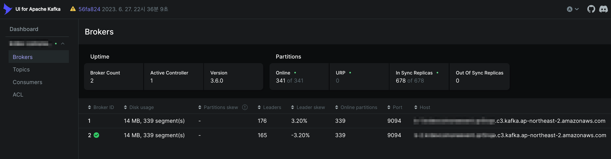

## 개요

AWS의 관리형 Kafka 서비스인 MSK 클러스터 운영자를 위한 가이드

&nbsp;

## 환경

온프레미스 Kafka Cluster가 아닌 Managed Kafka 클러스터인 MSK를 기준으로 설명합니다.

&nbsp;

## 가이드

&nbsp;

---

&nbsp;

### 클러스터 업그레이드

Amazon MSK 버전 업그레이드와 클러스터 설정 업데이트 기능은 Kafka 모범 사례를 기반으로 하며 클러스터 IO에 Kafka를 계속 사용할 수 있도록 하는 롤링 업데이트 프로세스를 사용합니다. 따라서 설정 파일이 업데이트 되거나 Kafka 버전 업그레이드가 진행되더라도 영향도는 Kafka Client가 받는 영향도는 없습니다. (물론 이 또한 고가용성 설정이나 모범사례에 기반한 설정이 적용되어 있어야 합니다.)

자세한 사항은 [Best practices for version upgrades](https://docs.aws.amazon.com/msk/latest/developerguide/version-support.html#version-upgrades-best-practices) 페이지를 참고합니다.

&nbsp;

---

&nbsp;

### 브로커 타입

브로커 타입별로 권장 파티션 수가 지정되어 있습니다. 이를 넘을 경우 MSK 클러스터의 버전 업그레이드를 실패하므로 주의하도록 합니다.

예를 들어 `t3.small`은 브로커당 권장 파티션 수가 300입니다. 각 브로커가 Online Partition으로 `330`개를 사용하고 있을 경우, 해당 클러스터의 Kafka 버전 업그레이드에 실패합니다.

- **관련문서** : [MSK 모범사례](https://docs.aws.amazon.com/ko_kr/msk/latest/developerguide/bestpractices.html#partitions-per-broker)

&nbsp;

MSK 클러스터의 브로커 당 파티션 개수를 모니터링하는 방법은 Kafka UI를 설치하여 MSK Cluster 정보를 수집하거나, Prometheus + Grafana 등을 통해 수집한 메트릭을 통해서 확인할 수 있습니다.

아래는 Kafka UI에서 확인한 브로커 상태 정보입니다.



&nbsp;

---

&nbsp;

### 고가용성 설정

- 복제 인수(RF<sup>Replication Factor</sup>)가 `3` 이상인지 확인합니다. RF가 `1`이면 롤링 업데이트 중에 오프라인 파티션이 발생할 수 있고 RF 값이 `2`이면 패치 중에 오프라인 파티션이 발생할 수 있습니다. 브로커 수가 `2`개라면 RF를 `2`로 두는 걸 권장드립니다.
  - `default.replication.factor` : RF<sup>Replication Factor</sup>. 이 값은 토픽의 파티션을 몇 개의 브로커에 복제할지를 결정하는 설정입니다. 높은 복제 계수는 브로커 장애가 발생해도 데이터가 유실되지 않도록 보호하는 데 도움을 줍니다.
- 최소 동기화 복제본(minISR)을 최대 RF - 1로 설정합니다. RF와 동일한 minISR은 롤링 업데이트 중에 클러스터 생성을 방해할 수 있습니다. 2개의 minISR을 사용하면 하나의 복제본이 오프라인 상태일 때 3방향 복제된 항목이 가능합니다.
  - `min.insync.replicas` : ISR<sup>In-Sync Replication</sup>. 이 값은 쓰기 요청이 성공하기 위해 동기화되어야 하는 최소 리플리카 수를 지정합니다. 이 설정은 데이터의 내구성을 높이고, 쓰기 작업의 데이터 일관성을 보장하는 데 중요합니다.

&nbsp;

브로커 3개 구성인 경우 RF, ISR 설정 예시

```bash
default.replication.factor = 3
min.insync.replicas = 2
replica.lag.time.max.ms = 30000
```

&nbsp;

브로커 2개 구성인 경우 RF, ISR 설정 예시

```bash
default.replication.factor = 2
min.insync.replicas = 1
replica.lag.time.max.ms = 30000
```

&nbsp;

---

&nbsp;

### 계층형 스토리지

[계층형 스토리지](https://docs.aws.amazon.com/ko_kr/msk/latest/developerguide/msk-tiered-storage.html)는 사용자가 자주 접근하지 않는 데이터를 자동으로 더 저렴한 스토리지 계층으로 이동시키는 기능을 말합니다. Kafka의 주요 사용 사례 중 하나는 대량의 로그 또는 이벤트 데이터를 저장하고, 이를 실시간으로 분석하는 것입니다. 이러한 데이터 중 일부는 생성 후 단기간에 많이 사용되지만, 시간이 지남에 따라 접근 빈도가 줄어들 수 있습니다.

MSK의 계층형 스토리지 기능을 사용하면, 이러한 Cold 데이터를 자동으로 더 저렴한 스토리지로 이동시켜 비용을 절감할 수 있습니다. 예를 들어, 초기에는 SSD와 같은 고성능 스토리지에 데이터를 저장했다가, 일정 기간이 지나면 자동으로 HDD 같은 저비용 스토리지로 옮겨지게 됩니다. 이는 특히 데이터를 장기간 보관해야 하는 경우 비용 효율적입니다.

이 기능은 비용을 절감하면서도, 필요할 때 빠른 접근이 가능하도록 유지하기 위해 중요합니다. 사용자는 데이터의 저장 위치나 성능에 대해 걱정하지 않고, MSK 서비스가 자동으로 관리해주는 편리함을 누릴 수 있습니다.

&nbsp;

계층형 스토리지<sup>Tiered storage</sup>의 사용 조건

- 계층형 스토리지가 활성화된 Amazon MSK 클러스터는 버전 3.6.0 또는 2.8.2.tiered를 사용해야 합니다.
- 계층형 스토리지는 브로커 유형 t3.small을 지원하지 않습니다.

MSK 클러스터에서 위 2개 조건이 충족되면 계층형 스토리지<sup>Tiered Storage</sup> 기능을 사용할 수 있습니다.

&nbsp;

테라폼 MSK 모듈에서 Tiered Storage 기능을 활성화하려면 `storage_mode` 값을 `LOCAL`(default)이 아닌 `TIERED`로 변경합니다.

```terraform
#-------------------------
# MSK Cluster
#-------------------------
module "msk_cluster" {
  ...

  name                        = local.name
  kafka_version               = "3.6.0"
  number_of_broker_nodes      = 3
  broker_node_az_distribution = "DEFAULT"

  # Valid values: `null`, `PER_TOPIC_PER_PARTITION`, `PER_BROKER`, `PER_TOPIC_PER_BROKER`
  # https://docs.aws.amazon.com/msk/latest/developerguide/metrics-details.html
  enhanced_monitoring = "PER_TOPIC_PER_PARTITION"

  broker_node_storage_info = {
    ebs_storage_info = {
      volume_size = 500
    }
  }

  # Broker node's storage autoscaling
  storage_mode               = "TIERED"
```
